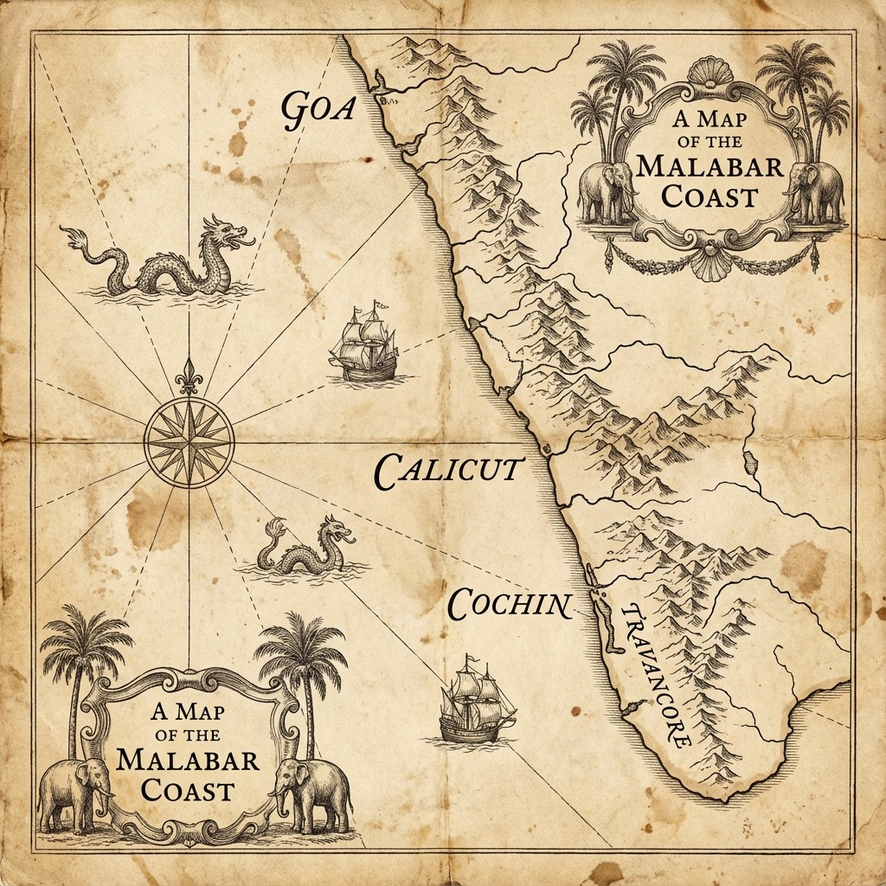

# Blood and Thrones

*RV Menon*

Three kings. Three witnesses. One peninsula remade by gunpowder, pepper, and the slow violence of empire.

# Dedication

*Dedicated to my parents, my spouse, to history lovers all over the world, and to Suraj, who recommended this theme.*

# Copyright {.unlisted}

Copyright © 2025 RV Menon

All rights reserved.

This is a work of historical fiction. While many events, places, and figures are historical, some characters, timelines, and scenes are invented or compressed for narrative.

# Foreword

I wrote this series to raise awareness about eighteenth-century Travancore and its remarkable king, Marthanda Varma. His story deserves to be known beyond the borders of Kerala.

On the southwestern coast of India, Marthanda Varma inherited a kingdom beset by internal rivals and external powers. Through military reform, administrative clarity, and sheer ruthlessness, he forged it into a dominant state on the Malabar Coast.

He was a pragmatist. He was capable of great cruelty in service of greater order. He created institutions that outlasted him.

This is not a biography. It is a novel, told through the eyes of a fictional Maratha horseman who washes up on Travancore's shores and finds himself drawn into the king's orbit. But the king at the centre of the story is drawn from history, and I have tried to render him honestly.

---

## The King {.unlisted}

Marthanda Varma was pious. He was also ruthless. He was cunning, charming, and strong. He could be generous to those who served him and merciless to those who opposed him.

Some modern accounts paint him as a Hindu fanatic, a king who built temples and persecuted foreigners out of religious zeal. This is a misreading. Marthanda Varma employed Christians, Muslims, and Europeans in positions of trust throughout his reign. His most famous general, Eustachius De Lannoy, was a Catholic from Arras who served him until death. His commercial agents included Syrian Christians and Jewish merchants. His navy was commanded by Muslim Marakkars.

His beginnings were precarious. Growing up as a junior prince in Venad, he was fourth in line to the throne and ascended at age twenty-three only after the untimely deaths of his predecessors. He inherited a crown with limited authority; many nobles refused to recognize him, conspiring to depose and assassinate him repeatedly.

From these precarious beginnings, he rose to dominate the region, using every tool available to build a state: military reform, administrative clarity, and sheer ruthlessness. 

---

## The Ettuveetil Pillamar {.unlisted}

The Ettuveetil Pillamar, the Eight Lords, appear in this novel as antagonists. I do not believe they were villains.

They were powerful men in a weak kingdom. For generations before Marthanda Varma, the Travancore royal family had been diminished, hemmed in by nobles who controlled the land, the armies, and the trade. The Pillamar were not usurpers; they were the real power. When a strong candidate appeared in the royal line, they did what powerful men have always done: they tried to remove the threat.

They failed.

Marthanda Varma arrested them, tried them summarily, and executed them. Their families were stripped of lands and titles. Some historians have called this draconian. It was. It was also effective. The message was clear: Travancore would no longer be ruled by committee. There would be one king, and the king would rule.

Were all of them guilty of regicide? Probably not. Were their punishments proportionate? By modern standards, no. But Marthanda Varma was not building a modern state. He was building a state that could survive, and survival required examples.

---

## The Thampis {.unlisted}

The king's cousins and nephews, the Thampis, also met harsh fates. Some were executed. Others were exiled. Modern readers may find this disturbing.

I find it rational.

In a matrilineal succession system, every male relative is a potential rival. The Thampis had claims to the throne, and they had supporters. If Marthanda Varma had spared them, they would have become rallying points for every disaffected noble, every displaced Pillamar, every foreign power looking for a lever. He would have spent his reign fighting civil wars instead of building walls.

He chose otherwise. History does not record that he lost sleep over it.

---

## The European Context {.unlisted}

To understand eighteenth-century Malabar, you must understand eighteenth-century Europe.

The wounds of the Thirty Years' War were barely a century old. The War of the Spanish Succession had ended within living memory. Religious hatreds that had torn the continent apart still simmered. The Dutch were fiercely Protestant, shaped by their long revolt against Catholic Spain. The Portuguese were equally fierce Catholics, veterans of the Inquisition. The English were Protestant but happy to fight anyone for commercial advantage. The French were Catholic but happy to ally with Protestants against mutual enemies.

These hatreds travelled with the trading companies.

When Dutch and Portuguese ships met off the Malabar Coast, they were not merely competing for pepper. They were continuing wars that had begun in Antwerp and Lisbon. When the English established their factory at Anchuthengu, they were not just building a warehouse. They were planting a flag in a conflict that stretched from London to Batavia.

The kings of Malabar learned to navigate these hatreds. They played the companies against each other, extracted concessions from all sides, and occasionally found themselves caught in the crossfire. Marthanda Varma was particularly skilled at this game. He took English loans, fought Dutch armies, and employed Portuguese priests, all while keeping his own counsel.

---

## The Armies {.unlisted}

The Dutch East India Company was not a Dutch army. It was a corporate military force drawn from across Europe and Asia.

Its officer corps included Germans, men from the Low Countries, French Huguenots, Danes, and Swedes. Its soldiers included men from Java and Bali, Indian lascars, and African slaves. The force that landed at Colachel in 1741 was a polyglot army serving a commercial enterprise headquartered in Amsterdam but fighting on a beach in South India.

This diversity was the Company's strength and its weakness. It could recruit soldiers from anywhere. But those soldiers had no particular loyalty to the Company beyond their pay. When the pay stopped or the cause seemed lost, they deserted, defected, or simply walked away.

De Lannoy was one such man. Born in Arras, trained in the Low Countries, shipped to Sri Lanka (Ceylon), and then, during the Colachel campaign, crossing the lines at Kanyakumari to enter Travancore service, he made a choice that the Company's books could not have predicted. He stayed. He built. He died as the Valiya Kappittan of Travancore, buried in a chapel he constructed with his own money.

The companies brought their conflicts to India. But India absorbed them, transformed them, and made them serve purposes the directors in Amsterdam and London never imagined.

---

## A Note on Sources {.unlisted}

The historical events in this novel are drawn from a variety of sources, including the Travancore State Manual and various accounts of the Dutch East India Company's activities on the Malabar Coast, alongside modern historical scholarship on Travancore.

Where sources conflict, I have chosen the version that seems most defensible and best serves narrative coherence. Where sources are silent, I have invented. The result is fiction, not history. Readers seeking the historical record should consult the sources directly.

---

## Finally {.unlisted}

This is the first book of a series. It covers the period from roughly 1735s to 1750s, from Marthanda Varma's consolidation of power through the Battle of Colachel to the Thrippadidanam, when he dedicated his kingdom to the god Padmanabha.

The story continues in *The Dutchman's Son*, which follows the next generation through the reign of Dharma Raja and the coming storm from Mysore.

I hope these books bring a forgotten corner of Indian history to new readers. The men and women who built Travancore deserve to be remembered.

---

*The Author*
*December 2024*

# Prequel: The Vow and the Tiger

In the late 1730s, the western coast of India smelled of wet gunpowder and pepper. Salt wind carried the tang of the Arabian Sea into every camp and every fort. Between the surf and the hills, empires pressed against each other like wrestlers, each convinced the other would tire first.

On one coast, the Portuguese still rang their church bells over Goa and flew their flags above stone walls that had learned to swallow screams. They had held this strip of land for generations, long enough to believe it belonged to them by habit. Their forts along the Konkan were a chain of white teeth, and their caravels and galleys prowled the sea lanes, guarded, when it suited them, by the dark hulled ships of the Siddis. The Siddis of Janjira were not priests and merchants like the Portuguese. They were sea fighters, a kingdom of sailors with African blood and Indian shores, hired and hated and feared in the same breath. Between them, they made the coast feel fenced.

Then the Maratha hand closed.

In Pune, Baji Rao, the Peshwa, sent orders like arrows. His younger brother Chimaji Appa carried those orders to the coast and made them personal. Chimaji was not a man who loved speeches. He loved tallies of powder and lists of captured guns, the slow certainty of siege lines tightening. But he understood something about the Portuguese that many inland men missed. They were not unbeatable because they were white or Christian. They were dangerous because they had fort walls, cannon, and the patience of men who believed time itself worked for them.

So Chimaji vowed that time would not save them.

I heard the vow in a camp that stank of horse sweat and damp rope. The monsoon had passed, leaving the earth soft and the mosquitoes hungry. Chimaji stood in a circle of officers, a lamp smoking beside him, his face hard in the flicker. Behind him, Brahmins chanted in a small, stubborn voice, and the men answered in murmurs, hands touching sword hilts and prayer beads with equal familiarity. He did not promise easy victory. He promised that no foreign flag would be allowed to sit on Konkan soil unchallenged, not the Portuguese cross, not the Siddi banner painted on a prow. He promised to take their forts one by one, to make the coast remember who it had always belonged to.

Wars are made of such vows. They are also made of trenches, and blood, and the stubborn labour of men who drag cannon through mud.

The Konkan campaign was not a single battle. It was a grinding season of sieges and raids, forts that fell after weeks of hunger and sudden night attacks that left a road littered with broken carts and spilled grain. We learned to cut supply lines, to watch for the glint of a musket barrel in coconut groves, to move like a flood and vanish like smoke. We learned that Portuguese guns could kill a horse as easily as a man, and that a cavalry charge means nothing if the ground is chopped into ditches and sharpened stakes.

The Portuguese fought like men defending a house they had stolen and made their home. They countermined our tunnels. They bribed scouts. They sent priests to promise salvation to men who could not read their prayers. When that failed, they sent iron and rope. They broke bodies in cells under Goa and called it justice.

We broke forts instead.

At Vasai (Bassein), the Portuguese fortress that watched the sea like an old predator, I saw a wall tremble under our guns. I saw men climb into smoke with ladders shaking in their hands. I saw my black mare Kanka take a ball through the chest and fold as if the ground had suddenly gone soft beneath her. In the roar and confusion, in the stink of powder and blood, I understood that campaigns turn into legends because the men who live through them need something to hold onto when the dead begin to outnumber the living.

In those months, we spoke as if Konkan was the whole world. We spoke as if Chimaji Appa’s war was the only war that mattered.

It was not.

Far south, beyond the passes and the Deccan plateau, beyond the long curve of the Malabar coast where pepper vines climbed trees like hungry fingers, another king was shaping a kingdom with the same ruthless patience. I did not meet him then. I did not even know his name beyond a rumour carried by merchants. But later, in Travancore, I learned that while Chimaji tightened his siege lines against Portuguese stone, Marthanda Varma of Venad was tightening his grip on men and land.

Venad was not supposed to frighten anyone. It was a wet strip of country pressed between the mountains and the sea, broken into quarrelling houses and temple lands, rich in pepper and coconut and river mouths, and rich, too, in the kind of small pride that makes neighbours sharpen knives. Its neighbours were older, some wealthier, some with better access to the ports, but many had lived too long under the shadow of Dutch treaties and European guns to imagine a future that was fully their own.

Marthanda Varma did imagine it.

He had the ego of a man who refuses to stay small. He dreamed of a southern empire, a single authority that could tell the pepper coast what price it would accept and which foreign ship could anchor where. To build it, he first crushed the threats inside his own house. The Thampi brothers who claimed power by blood and violence were hunted down. The *Ettuveetil Pillamar*, the Eight Houses who had treated the crown like a decoration while they ruled the land, were broken and scattered. Venad learned, in a short brutal span, that this king would not be managed.

Then he turned outward.

Small kingdoms and chiefdoms that had spent generations balancing each other suddenly found a new weight pressing on them. Some bent. Some resisted. Some ran to older powers for protection. It was in the interest of the Dutch that no single prince on the Malabar coast became too strong. A divided land made treaties easy. A divided land signed away pepper cheaply, prince by prince, without the Dutch needing to maintain an expensive army beyond the walls of their coastal forts.

So the Dutch played the coast like a stringed instrument.

Kochi (Cochin), long a pivot between European powers, watched with alarm. The Samudri, the Zamorin of Kozhikode (Calicut), understood that a king who grew too strong in the south would eventually pull at the north as well. Principalities nursed grievances and old succession disputes like infected wounds. Dutch agents offered arms and ammunition, offered promises, offered the thin comfort of European umbrellas. Alliances formed, not out of love, but out of fear.

Inside Venad, Marthanda Varma prepared anyway. He had something most of his rivals lacked, a minister who could see past today’s feud to tomorrow’s war. Ramayyan Dalawa was not a man who shouted on battlefields. He was a man who counted, who read letters in multiple tongues, who understood that pepper is not just spice but power. Under his guidance, the king gathered guns, trained men, and made a state that could endure beyond one season’s victory.

By 1738, two storms were rising on two coasts. In the west, Chimaji Appa’s vow sharpened the Maratha appetite against the Portuguese and their allies. In the deep south, Marthanda Varma’s ambition sharpened Travancore against every neighbour, every rival house, and every European company that believed this coast could be owned.

I was only a cavalryman then, one more rider in Chimaji’s shadow, thinking I knew what war was.

The Portuguese taught me otherwise.

# Character Guide

This guide is here so you can keep houses, titles, and foreign powers straight on a first read. Historical figures are noted as such. Fictional or composite characters are noted as such.

## Maratha Confederacy (West Coast)

*   **Chimaji Appa (historical):** Younger brother of Baji Rao I, the Peshwa. Commander of the Maratha Konkan campaign against Portuguese forts and coastal rivals.
*   **Baji Rao I, the Peshwa (historical):** The Maratha empire’s chief minister and strategist, whose expansionist wars reshape the subcontinent’s balance.
*   **The Siddis of Janjira (historical):** A sea power on the Konkan, feared for naval warfare and shifting alliances.

## Travancore and Venad (Deep South)

*   **Marthanda Varma (historical):** King of Venad and architect of Travancore’s rise, ruthless in consolidation and hungry for a sovereign southern state.
*   **Ramayyan Dalawa (historical):** The king’s diwan and principal strategist, a man of letters, records, and cold clarity.
*   **The Senior Rani (historical):** Matrilineal authority within the royal household, whose legitimacy and politics shape succession.
*   **The *Ettuveetil Pillamar* (historical, collective):** “Lords of the Eight Houses,” powerful nobles broken during the years of consolidation.
*   **The Thampi brothers (historical, collective):** Rival claimants and violent challengers to the young king’s authority.

## Dutch and European Soldiers

*   **Eustachius De Lannoy (historical):** A Dutch officer who crossed over during the Colachel campaign and rose to become the kingdom’s senior European commander.
*   **Karl August (composite):** A European deserter and drill expert, used in the novel as a bridge between company discipline and local war.

## Other Colonial Powers

*   **Portuguese authorities in Goa (historical):** The Estado da Índia administration, controlling prisons, forts, and old trade routes by fear and habit.
*   **English at Anchuthengu (Anjengo) (historical):** A cautious Company presence on the Travancore coast, trading and watching, sometimes lending aid when interests align.
*   **French at Mahe (historical):** A smaller European power on the coast, present as a rumour and a possible counterweight in the wider chessboard.

## Rivals, Allies, and Neighbours

*   **Kochi (Cochin) (historical polity):** A coastal kingdom and Dutch ally, threatened by Travancore’s expansion.
*   **Samudri, the Zamorin of Kozhikode (Calicut) (historical title):** “Lord of the Sea,” a northern power whose interests clash with any southern empire.
*   **The Nayak of Madurai (historical office):** A Tamil southern ruler whose horsemen and claims press Travancore’s frontier.
*   **Chanda Sahib (historical):** A Carnatic contender whose pressure helps trigger the Dutch crisis.
*   **Kottarakkara and the Elayadathu line (historical polity):** A northern succession house used by rivals and foreign companies as leverage against Travancore.
*   **Kayamkulam, Desinganadu, Purakkad, Thekkumkur, Vadakkumkur (historical polities):** Smaller kingdoms and principalities drawn into alliances against a rising Travancore.

## Key Fictional and Composite Characters (This Novel)

*   **Nagoji Sawant (fictional):** A Maratha cavalryman captured by the Portuguese and thrown into the south, where he becomes both weapon and witness.
*   **Keshavrao (fictional):** A younger comrade from the Konkan campaign, whose fate marks Nagoji.
*   **Ibrahim Marakkar (composite):** A coastal power broker who understands that trade and war are the same river.
*   **Padmini Amma (fictional):** A formidable estate holder whose house becomes a hinge between old order and new state.
*   **Revathi Bayi (fictional):** A princess of Velinadu, sharp minded and dangerous to love.
*   **Dhanaji (fictional):** A Deccan man in exile, carrying his own loyalties and grief into Travancore’s wars.
*   **Savitri of Kottarakkara (fictional):** A single face for a broader succession struggle at the kingdom’s northern edge.

# Horse of the Servant {.title}

*RV Menon*

1738: The Pepper Coast. The storm broke the ship. The coast will break the man and rebuild him.

# Chapter 1: Dungeons of Goa

The first thing they took was my name.

Not with ceremony or proclamation, just a shrug and an entry in a book. To the men who ruled this cellar I was no longer Nagoji Sawant. I was no longer *huzurat* cavalry in the service of Chimaji Appa and the Peshwa. No longer the rider of the black horse Kanka, nor the son of a landlocked village near Nashik where the farthest water anyone feared was a swollen river in the rains. In the quiet of Maratha tents that word *huzurat* carried weight, the household horse that rode closest to command, picked out by sardars when bravery and impatience had been proved in more than one fight. Here I was a number the clerk scratched beside the words *prisioneiro marata*.

They chained us in rows along the curved wall, backs pressed to damp stone, ankles linked by rusty iron. Above, somewhere beyond the sweating ceiling, the bells of Goa's churches rang for evening prayers. Down here, the rhythm that governed us was the scrape of the gaoler's boots and the splash of the bucket that carried away blood and filth. Water dripped somewhere in the darkness, steady as monsoon rain on a Deccan roof.

I was twenty-five that year, 1738, in the seasons after we broke a string of Portuguese forts along the Konkan, old enough to have seen men I admired die foolishly, young enough to believe I could still choose the shape of my own death.

They had already taken my fingernails by the time Father Duarte came.

The padre walked carefully between the lines of prisoners, his black cassock held slightly above the slime on the floor. He was a thin man with a scholar's stoop and ink-stained fingers, the sort of holy man who looked built for argument, not battle. Yet the calluses on his right hand told me he had once held something heavier than a quill. Here he was, deep under the Portuguese fortress at Goa, eyes moving from one ruined body to the next.

My gaze stayed on him without seeming to. That habit predated the Portuguese by years. As a boy in the Deccan I had learned to sit in the corner of a fort courtyard and see everything, from the loosened strap on a trooper's saddle to the way a sardar's hand tightened on his sword hilt at the mention of a rival. Here in this cellar I turned the same skill on other men.

The gaoler, João, moved beside the priest. He was a broad man whose belly strained his leather belt, a man who had learned to wrap cruelty in jokes. He smelled of garlic sausage and chapel incense, an unholy combination. When he passed my place he tapped my shoulder with his boot, almost companionable.

“Este,” he said in Portuguese, “this one is stubborn.”

I kept my face blank. Stubborn is better than broken in any language.

Father Duarte's gaze followed the gaoler's gesture. His eyes were grey and tired, with the faint redness of a man who slept badly. When he saw my hands, wrapped in dirty cloth, he winced and his fingers twitched inside his sleeves.

“How long since the last questioning?” he asked in that same tongue.

“Two days,” João replied. “He still insists he is only a horseman. No names, no forts, no routes. He knows we have others who talk, but still he holds on.”

The priest's eyes came back to my face. “You understand our language, senhor marata?”

“Enough to know when I am being lied to, Father,” I said in my own Marathi. My mouth tasted of rust and old water. “But you can speak your questions. I have heard most of them already.”

João laughed. “You see, he understands.”

“Bring him,” Father Duarte said.

They unshackled my legs and hauled me upright. My joints protested after so long curled under me. I bit back the groan. A Maratha horseman does not whimper in front of an enemy. We bleed, we fall, we curse the gods and get back up. On the black soil of the Deccan that had been simple enough. Here in the Portuguese darkness it took more effort.

The interrogation chamber lay twenty paces away and felt like another world entirely. The smell changed as we went, from rotting straw and human waste to oil, sweat and something sharp that stung the nose, a sour mixture of wine and old fear. They had built the room under a vaulted arch, stone thick enough to swallow most screams before they reached the street.

Ropes hung from an iron ring bolted into the ceiling. A table sat to one side, laid out neatly with tools that had never worked metal. Pliers. Hammers. Wooden wedges. A brazier glowed on the far side of the room, its coals sending up a thin trail of heat that shimmered in the dim light.

This was where the Portuguese forged information.

They sat me on a stool with my wrists bound to its legs. João checked the knot, then moved to the table. The priest remained standing, hands tucked into his sleeves, fingers worrying at the cloth.

“Nagoji Sawant,” Father Duarte said, using my name as if it still belonged to me. “You have already told us that you rode with a Maratha force against our allies. You have admitted that you attacked Portuguese caravans and outposts. The Viceroy's spies insist you were *huzurat* cavalry under Chimaji Appa himself, chosen by your sardars for your initiative. Such men see more than dust and hooves. What we do not yet know is who ordered those attacks, how many men you had, and which forts or roads you meant to strike next.”

“You know more than I do then,” I said. “We raided where we could, when we could, against whoever traded with our enemies. That is the way of the ghats and passes. You have maps and books. You draw lines on paper and call them borders. My horse does not read.”

João picked up a pair of iron tongs. “Your horse is dead,” he said conversationally. “We shot it when we brought you in. A pity. Fine animal.”

My throat closed. Kanka's black mane against my cheek on winter mornings, his easy stride, the way he had carried me through musket fire near Chaul. I forced the memory down. They wanted to see grief; they wanted to use it as a lever.

“Then he died better than I will,” I said, hearing the flatness in my own voice.

Father Duarte studied me. “You are not a fool,” he said. “You know your position. The Viceroy needs names. He needs to know if the army that devoured his northern strongholds is turning its hunger south. He needs to know if Chimaji Appa intends to bring his siege guns to Goa next. If you cooperate, your suffering can end. I can speak for you, perhaps secure you work on a plantation, a life in chains that is still a life. If you do not...”

His gaze flickered briefly toward the brazier.

Those northern forts rose in my mind, one victory after another in those hard years, each fall ringing like a bell across the Konkan. Chimaji Appa followed, and with him the fear I smelled on these priests. They knew what we knew: the war was not over. Chimaji was coming for Goa. Any day now, the ground above this dungeon would shake with the impact of Maratha cannon.

“If I do not,” I said, “you will do what you have already done to others. You will pull at my body until it comes apart. You will hold hot iron to my skin. You will try to make me scream something that fits the shapes you already have in your mind.”

João snorted. “He talks too much.”

“He is a soldier,” Father Duarte said softly. “He knows the game.” He stepped closer. “Tell me this at least, Nagoji. Not for the Viceroy, for me. Do you believe you fight for God, for some higher good, or is it simply for plunder and the honour of your people?”

The question surprised me more than any threat could have. For an instant the dungeon vanished and I was once again on a ridge above the Godavari, looking down at the dust of a marching column, feeling that familiar tightness in my chest that was not quite fear and not quite joy.

“I fight because I was born into a world where men who do not fight are trampled,” I said slowly. “I fight because if my people do not learn to meet guns with courage, someone else's flag will fly over our forts. As for God, Father, I leave Him to the Brahmins and to you. He seems to favour whoever has the better powder.”

The priest's mouth twitched, a shadow of something that might almost have been a smile.

“You see,” João said, “he gives you nothing. Let me loosen his tongue.”

For a heartbeat Father Duarte did not answer. His jaw worked, as if he chewed on words he could not swallow. Then he inclined his head, a small, weary nod, and João reached for the tools.

The next hours stretched and blurred. The first wedge went under what remained of my left thumbnail. After that, pain lost its degrees. Once you have felt your fingers crushed in iron and your joints forced against the way they were meant to bend, the mind floats above the body and watches priests and gaolers ply their trade.

Once, when João reached for the brazier, Father Duarte's hand shot out and closed over his wrist.

“Not yet,” he said, voice rough. “The Viceroy needs a hand that can still hold a quill.”

The gaoler grumbled, but he chose another tool.

Somewhere in that haze Father Duarte said, “Enough.” João protested that the marata still held back names. The tired priest insisted that a dead prisoner could not testify and that the Viceroy preferred confessions on paper, not corpses.

When they dragged me back to the cellar and chained me in my place against the wall, my hands were raw meat and my shoulders throbbed with each breath. I closed my eyes, not in prayer, but in calculation.

How many guards at the door. How often they changed shifts. Which men wore keys at their belts and which only carried cudgels. Where the buckets were stored. How many steps from the stair to the courtyard above.

I counted, as I always had. Horses, men, paces, opportunities.

The priest's question lingered like smoke in my mind.

Did I believe in anything beyond survival and the honour of my people?

That night, as rats skittered along the edges of the straw and someone sobbed quietly in the darkness, I decided that belief did not matter in this place. Numbers did. Chains did. Ships did.

Rumour moved through the dungeon the next day, low and cautious, like water seeping through a crack.

They were gathering prisoners, men said in whispers. Not for the stake, not for the scaffold, but for transport. Somewhere far to the south the Portuguese needed labour. Somewhere beyond the horizon they were building something that required bodies that did not ask questions.

Back pressed to cold stone, I listened, and for the first time since they dragged me into this fortress a thin thread of hope tugged at me.

Ships meant movement. Movement meant chances.

The Portuguese had taken my name and tried to break my body. They had forgotten the simplest lesson of the Deccan monsoon.

Storms do not ask permission.

# Chapter 2: The Slave Ship South

They woke us under cover of bells. The great church above rang for early Mass, a flood of sound rolling down through stone into the cells. I counted the strokes. When the last echo faded, bolts scraped at the dungeon door.

João entered with three guards at his back.

“Up,” he shouted in rough Konkani, a version rounded by Portuguese tongues. “Those marked go to the docks.”

He moved down the line with a leather strip of symbols, tapping one man, skipping two, cuffing another awake, all the while humming a hymn under his breath. The tune was the same one the church bells had played.

When he reached me he did not bother to look at the marks on my cell wall. He knew where I sat. He had spent too many hours standing over me, hands busy with iron and rope.

“On your feet, marata,” he said. “The Viceroy has found a use for you.”

The guards unlocked the shackles at my ankles. For a brief moment the weight of the iron vanished and my legs swung free, terrifyingly light. I stood slowly, every joint complaining. The beatings and the wrenched limbs from the previous days had left my body bent and aching, but I forced myself not to limp.

Ahead, two places along the chain, Keshavrao shuffled in step, his familiar narrow shoulders stiff, his black hair hacked short in the Portuguese style. Even now his right hand twitched at his side, still reaching for a sword hilt that was no longer there.

They chained us in a line, six men to a length of iron, wrists manacled, collars clamped around our necks. The metal was slick from the sweat and grime of countless prisoners before us.

“Rao,” I said softly.

His head twitched, but he did not look back. A guard walked between us, club in hand.

The climb from the dungeon to the world of light was like being born through a tunnel of stone. At each turn the air grew a little fresher and the smell of filth retreated before new smells. Oil. Bread. Sea.

We emerged into a courtyard of whitewashed walls and glaring sky. The sudden brightness stabbed my eyes. Shapes resolved themselves slowly. Musketeers stood along the walls, hats tilted, matchcords coiled at their belts.

Father Duarte stood near the gate.

He was dressed for travel, a broad hat shading his grey eyes, a leather satchel over one shoulder. When our line of prisoners shuffled past, his gaze moved along the chain until it found me. For a moment our eyes met.

I expected triumph, or at least satisfaction. The stubborn Maratha, broken at last, being led to whatever slow death awaited in the southern plantations.

Instead, his jaw tightened. His hand rose, almost involuntarily, and made a small sign of the cross, not the hurried gesture of a man warding off contamination, but something slower, more deliberate. A blessing, perhaps. Or an apology.

He did not speak. He did not step forward. He simply watched as the guards pushed us toward the gate, and then he turned away, disappearing through a side door into the fortress.

I filed his face away in the part of my mind that kept accounts. Men who hesitate are men who can be used. Men who feel guilt carry weight that slows them down.

Someday, I thought, that hesitation might matter.

Beyond the far gate the sound of the sea thudded against the edge of hearing.

They moved us through narrow streets where the houses leaned inward like gossiping women, balconies almost touching above our heads. Goan Catholics in clean cotton stepped aside as we passed, hands over mouths and noses. A few Hindu merchants watched from their doorways, faces carefully blank. Their eyes told a different story. They measured us, weighed the value of the bodies in chains, and filed the calculations away in minds that already carried too much.

The smell of salt grew stronger. So did the stink of tar, fish and unwashed sailors.

When we reached the harbour the full weight of the Portuguese world pressed in. The masts of ships clustered against the sky like a forest of stripped trees. Ropes creaked, gulls screamed, and the heave of water against hulls set up a constant low groan that settled in the bones.

One ship loomed closer than the rest, her hull black and high, her stern built up like a little fortress of carved wood and painted saints. Men moved along her rails, hauling on lines, shouting in a mixture of tongues. On the wharf below her a platform had been erected, and on it a man in a broad-brimmed hat checked lists against the lines of chained prisoners.

“To Angola,” someone whispered behind me. “Africa.”

“Not this one,” said another voice, older and bitter. “The Jesuits need bodies for their lands to the south. Some place beyond Sri Lanka. They will work us until we forget our own names.”

João tugged at our chain. “Faster,” he grunted. “The tide waits for no man. Not even maratas.”

We were herded up a gangplank slick with sea and tar. The ship towered over us, the smell of old voyages clinging to her planks. As my bare feet touched the wood, the planks flexed under my weight, shifting subtly as the water lifted and dropped the hull. For a moment an old, absurd thought surfaced.

Horses would hate this.

On deck the air was full of movement. Sailors darted around us, some dark-skinned men from other parts of the empire, some pale Europeans whose faces burned red in the sun. Above, canvas cracked as it caught the breeze. The world of land, with its forts and fields and familiar dust, already felt far away.

They drove us below.

The hold had been prepared for us. Wooden shelves had been built along the sides, each shelf divided into little pens by upright planks. Someone had scratched prayers into the wood above my head, in a script I could not read. Another prisoner, another ship, another journey that ended somewhere in chains. We were pushed into these spaces, four or five men to a compartment, until the air was thick with bodies. Iron rings had been bolted into the beams overhead to take the chains that linked us.

Keshavrao and I ended in the same section by accident or indifference. When the guards moved on, rattling chains and cursing, he turned his head at last.

“Sahib,” he whispered.

I had never liked that word from him. In camp I had insisted he use my name. We were both sons of the Deccan; the distance between us was one of experience, not blood. Now, though, in that cramped, stinking space, there was comfort in the old military habit.

“Rao,” I said. “You are still alive.”

He gave a small, breathless laugh that turned into a cough. “For now.”

We spoke little at first. The hold filled with the noises of settling misery. Chains scraped. Men shifted to ease cramps that could not truly be eased. Someone at the far end of the deck began to chant a hymn in a coastal tongue close to my own, voice rising and falling as if it belonged to the creaking of the hull.

Through a hatch far above, a square of light showed strips of sky. A gull crossed that square, a white streak against blue, and the ship began to move.

“Do you know where they send us?” Keshavrao asked after a while.

“South,” I said. “That much is certain.”

“I heard one of the guards say they need men to cut cane,” he muttered. “Fields of sugar, as tall as a man. Sun that burns the skin off your back. The priest promised them that work in distant lands counts the same as service to their God. We will sweat for their salvation.”

In camp he had been the one who joked, who found some rough song to carry us through long marches. The dungeon had scraped that away. I remembered him riding bareheaded near Chaul, singing over the crack of muskets, daring the Portuguese to shoot the song out of his mouth.

“We are not there yet,” I said. “As long as we move, there is a chance.”

He shifted his weight, chains clinking. “The sahib still counts chances.”

“It is what I know.”

Time on a ship is different from time on land. In a fort you can measure days by the sun on the walls, by the calls of guards on the ramparts, by the rhythm of work and rest. In the dark belly of a vessel there is only the change in the pitch of the hull, the moments when hatches open for food and air, and the slow erosion of the sense that the world is anything more than wood, iron and salt.

They brought us rice and dried fish twice a day. The water was stale and tasted of wood and old journeys. Men fell sick quickly in the close, damp air. Coughs turned wet. Wounds from the dungeon festered. The little space that each of us had claimed narrowed as the weaker sagged against the stronger.

Sometimes, when the hatches stayed open a little longer, Portuguese voices drifted down from above.

“Wind is with us,” one man said once. “If it holds we round the cape before the worst of the storms.”

“If the storms do not find us anyway,” another replied. “This run is cursed. The last ship took lightning in the mast. They say God sends warnings.”

“God sends opportunity,” a third voice cut in, amused. “These bodies in the hold are silver if they live to touch the soil we have claimed.” He named a number of cruzados per head, as if we were sacks of pepper. “Pray for their health, not their souls.”

Their laughter filtered down with the light.

Below deck Keshavrao shivered.

“If there is a storm,” he said, voice low, “will the ship break?”

“All ships break,” I said. “The question is when and how.”

He was silent for a time. Then, very quietly, he said, “If the chains break too, I will follow wherever you jump, sahib.”

The words settled over me heavier than iron.

I had never meant to collect followers. On the dusty roads and river crossings near Nashik I had led men because someone had to ride in front, to show that Portuguese guns could be faced even away from their forts. Those who followed did so because they trusted my calculations, not because they saw anything in me worth adoring. Now, in a dark hold that smelled of vomit and fear, one boy's loyalty wrapped itself like a rope around my chest.

I reached across the narrow gap between us and rested my bandaged hand on his forearm.

“If there is a chance,” I said, “I will not leave you.”

His fingers closed briefly over my bandaged hand. Neither of us mentioned that promises made in chains are the easiest to break.

Above, the timbers creaked in a new rhythm. The ship rolled more sharply, the water slapping her sides with a sound that had teeth. Somewhere, a sailor cursed. Somewhere else, a prayer rose.

The Arabian Sea was beginning to remind us who owned this ship.

# Chapter 3: The Choice in the Storm

The first warning was not the shout of a sailor or the crack of thunder. It was the change in the way the ship moved.

Even in chains I had learned the rhythm of this hull. She rolled and heaved with a certain patience, rising over long swells and settling again, her creaks and groans almost like a breathing beast. One night, as the air in the hold grew thick and hot, that rhythm snapped.

The roll sharpened. The floor under us tilted harder to one side, then the other, so that our chains jerked and bodies slid against one another. A few men cursed. One began to retch. Above, heavy boots thudded across the deck with new urgency.

“Storm,” Keshavrao whispered.

I let the word hang and listened. Ships speak when they are in trouble. The strain of timbers changes. The voices of the men who serve them shift from boredom and casual insult to clipped orders.

Now those voices were raised. Portuguese words rattled overhead, sharp and fast.

“Reef the sails... haul, haul... tie that down... move, you son of a dog...”

Then, farther off, a deep boom rolled across the water. Not a cannon, but thunder, the long growl of a sky gathering its strength.

The hatch above us slammed open. Rain hammered down in a sheet for a heartbeat before a canvas awning was dragged into place. Grey light poured into the hold, turning the filth on the floor into a glistening smear.

A guard appeared at the top of the ladder, bracing himself with one hand on the frame, the other gripping a musket.

“Quiet down there,” he shouted in Konkani. “No shouting. No prayers. If any of you break your chains and try for the deck we put a ball in your gut and throw you over.”

No one laughed at his bravado. It is easy to make threats on solid ground. At sea, when the hull itself complains under your feet, every man knows he is at the mercy of things greater than muskets.

The ship lurched again, harder. Men cried out as they slammed into each other, iron biting into ankles and wrists. The guard swore, lost his balance, and disappeared from the square of light. His musket clattered down the ladder and landed not far from me, spinning on the boards before coming to rest against a beam.

For an instant the hold went very still.

Muskets are like horses. They draw every eye in a space. Even men who have never fired one recognise the shape of power.

Then the hull heaved once more. Someone shouted. A chain yanked tight. The spell broke.

“Leave it,” another guard bellowed from above. “Get back to work. The pigs below are not our problem if the mast goes.”

The musket lay between us and the ladder like something washed up by a strange tide. Too far to reach. Too close to ignore.

“Sahib,” Keshavrao murmured, “if the ship breaks...”

“If the ship breaks,” I said, “no musket will save them.”

Water began to seep along the floor, first as a thin trickle, then in thicker threads that followed the slope of the boards. The air grew colder as wind forced itself into the seams. The smell of the sea, sharp and raw, fought with the stink of the hold.

The storm did not descend at once; it built in layers. First the tilt of the deck, then the drum of rain, then the cracks of closer thunder. Only when the first real wave hit us broadside did the men in the hold understand what it meant.

The ship rolled so violently that for a few heartbeats we were almost weightless. Stomachs lurched. Chains snapped taut, then slackened. Bodies slammed into wood and into each other. Somewhere to my left a man screamed as his arm bent under another's weight at the wrong angle.

Cold water surged across the floor, soaking my legs to the knee.

“Hold to the beams,” I shouted in Marathi. “Hook your arms over the wood above. Do not let the chain drag you.”

It was useless advice for some. The space was too tight, the iron too confining. Still, a few men nearest me copied my movement, looping their forearms over the rough timber above their heads whenever the ship lurched, taking some strain off their wrists and ankles.

Keshavrao tried and nearly lost his grip as another wave hit. I grabbed his forearm and steadied him, the iron between us clanging.

“Listen to me,” I said, pitching my voice low and close. “Storms break ships. When wood breaks, iron bolts pull out. Chains go loose. The men above will think only of their own skins. In that chaos there will be one moment when we can move without them seeing.”

His eyes were wide in the gloom. “Move where?”

“Towards air,” I said. “Towards anything that floats.”

Another crash of water. The hull groaned like an animal in pain.

“And if there is no such thing?” he asked.

“Then we die here in the dark,” I said. “You have seen the dungeon. That is what awaits us at the end of this journey in another land. Tell me which death you prefer.”

He swallowed. His Adam's apple bobbed against his collar.

“With you,” he said, “I prefer the one that involves a chance.”

The storm grew teeth.

Soon there was no rhythm left in the ship, only violent, unpredictable lurches. The world narrowed to wood, iron, cold and noise. Lightning flashed through gaps around the hatch cover, turning the hold into brief, harsh portraits of fear. Men clung to each other, to beams, to whatever they could find.

Above, voices rose in panic.

“The mainmast... hold her steady... cut the rope... it will take us over...”

A new sound joined the rest, a long, splintering crack that vibrated through the hull. The ship shuddered as if struck by a giant hand. Something heavy crashed on the deck above. More shouting, this time with the edge of terror men do not bother to hide.

“She is taking water... pump, for the love of God...”

Water poured into the hold in earnest now, not in thin sheets but in surges that smacked into our legs and bellies. The cold stole breath. Chains grew heavier as they dragged through the flood.

“We will drown down here,” someone gasped.

He was right. If the ship sank with us still chained to the beams, the sea would fill our mouths before we even reached the surface.

“Look,” Keshavrao shouted in my ear. “The ring.”

He jerked his chin toward the iron ring that held the chain above our heads. It was bolted into a beam with thick nails, but with each violent roll the wood around it creaked and splintered a little more. Dark cracks spread around the bolt, widening as the hull flexed.

“When it goes,” I said, “we move.”

We did not have to wait long.

Another wave hit. The ship climbed, shuddered, then seemed to fall out from under us. In that sickening drop there was a sound like a tooth being pulled from rotten gum. The ring tore free from the beam with a spray of splinters. The chain that held our section dropped, yanking our collars and wrists, then sagged.

Men screamed, not in pain but in wild, sudden hope.

“Quiet,” I snapped. “You want them to hear?”

The noise above would hide a great deal, but panic makes men loud. Loud men attract attention.

I wriggled my hands as far as they would go along the slackened chain, bringing my wrists closer to the bolt hole in the beam. The wood there was ragged and soft. With enough force, perhaps the iron could be slipped, not from the cuffs themselves, but from the weakened timber.

“Help me,” I said to Keshavrao. “On three. Pull as if you are trying to tear your own head off. One, two...”

On three we both jerked backwards, putting all our remaining strength into the chain. Muscles screamed. The edges of the collars bit into our necks. For a moment nothing moved. Then the rotten wood gave another fraction, the hole widening.

“Again,” I hissed.

We pulled, again and again, timing our efforts with the wildest rolls of the ship. On the fourth attempt the bolt tore free entirely. The length of chain that linked our collars dropped to the floor with a splash.

We stumbled, suddenly unmoored. Our wrists were still shackled, our ankles still chained in pairs, but for the first time since Goa there was open space above our heads.

“Others,” Keshavrao said.

I nodded. “Quickly.”

We moved along the beam as far as our ankle chains allowed, grabbing at iron, yanking at rings, kicking at weak points in the wood. Some prisoners were too far away for us to reach. Others had rings buried in sound timber that would not yield. In a few compartments we were able to free the line that held the collars, giving those men the same fraction of liberty we now possessed.

Liberty was a generous word. We were still in a dark box, chained at wrists and ankles, with a storm trying to tear the world apart above us. Yet the feel of slack iron at our throats did something to the spine that torture had not. It made men stand a little straighter, even with the deck pitching underfoot.

“The hatch,” I said. “We need air. We need to see.”

The ladder swayed with every lurch. The fallen musket still lay at its foot, water washing around it in little currents.

“If we take it,” Keshavrao said, “they will shoot us.”

“If we stay,” I said, “we may drown before they can load.”

I sloshed forward, every step a battle against the water and the drag of the chains. My fingers closed around the stock of the musket. It was not loaded. Sensible men do not leave a primed weapon lying about. Still, weight is weight, and a length of hardwood with a metal barrel can break a wrist or a skull more cleanly than bare hands.

“Stay behind me,” I told Keshavrao.

I began to climb.

The ladder felt narrower than any siege stair I had ever mounted. My shackled ankles limited my stride. The musket bumped against the rungs as I went. Around me the hull creaked and shuddered. Water slapped the underside of the deck in heavy blows.

Halfway up a figure appeared in the square of light, backlit by a flash of lightning. For an instant he was only a silhouette, musket in hand.

“Back,” he shouted, the word broken by fear and the tilt of the world. “Back, or I fire.”

He tried to bring the barrel down toward me. The ship chose that moment to lurch. He flailed for balance, one hand leaving the ladder.

Years of riding into gaps in enemy lines had trained my body to move in such instants before my mind could think.

I drove the butt of my own musket upward with all the force I could muster. It connected with his wrist. Bone cracked. His weapon spun away. He cried out, reaching blindly for support, and missed.

He fell past me, hitting the rungs once, twice, then the floor of the hold with a wet, final sound. The water took him, rolling him against the planks like a piece of discarded cargo.

The ladder was clear.

“Now,” I shouted. “Move. All of you who can climb, move.”

I scrambled the last few steps and burst onto the deck. The hatch opened just aft of the mainmast, near the middle of the ship.

The storm greeted me like an enemy who had been waiting.

Rain hammered down in sheets. Wind ripped at what little cloth I had left. The deck tilted. I grabbed a rope to keep from sliding into the frothing black water below. Above, what remained of the mast loomed at an angle, torn canvas snapping like flags of surrender.

Men fought everywhere. Not each other, but the elements. Sailors wrestled with lines, knives in their teeth, trying to cut away rigging that threatened to drag the ship over. Others pumped at hand levers that fed water from the bilges back to the sea, their faces white in the lightning flashes.

No one looked at me.

To them I was just another piece of loose cargo tossed up from below. Their world had shrunk to ropes, timbers and the next wave.

Behind me, at the hatch by the mast, Keshavrao's head appeared. His eyes were huge in the storm light.

“Sahib,” he cried. The word was whipped away by the wind.

Another wave loomed, higher than the others. It reared up on our starboard side, to my right, a wall of water lit silver for a moment by lightning. For that instant everything was clear.

The broken mast. The men at the pumps. The open sea beyond, white-capped and hungry. Keshavrao's thin hands on the ladder. The chain still linking his ankles. The iron still binding his wrists.

A coil of rope lay by the starboard rail at my right, half loose at my feet. A shattered spar floated just off the ship's side, momentarily caught in the eddying water.

Calculations raced through me faster than words. Leap now, reach the spar. Keshavrao follows, chains drag him under. Wait to free him, we both get smashed against the rail.

The wave fell.

It hit the ship with a force that tore screams from every throat. Water crashed over the deck, hammering us flat. For a moment I was nowhere, only a body in a cold, roaring universe. Then the ship lurched up again, and I found myself on my knees, fingers clawed into that coil of rope.

Keshavrao still clung to the hatch, half out of the hold, half in. The water had drenched him, slicking his hair to his skull. Blood ran from somewhere on his forehead, thin in the rain. His right hand still twitched at his side, reaching for a sword that would never come.

“Sahib,” he shouted again. “Do not leave me.”

He had said, in the dark below, that he would follow wherever I jumped.

The storm offered no time for noble speeches now.

I threw one end of the rope toward him. It slapped wetly against the deck, then slipped, the coils sliding toward the scuppers as the ship tilted yet again.

“Tie it,” I yelled. “Around your chest. Quick.”

He fumbled with the rope, fingers clumsy with cold. Another wave loomed. The ship's bow plunged into it. For a moment the world became only grey and white.

The rope went taut in my hands.

For an instant I thought he had managed it, that I could haul him up and over the hatch, that we would stand together on the deck and leap in our own time.

Then the line took the wrong kind of weight. Not a man's body tied with intent, but the dead drag of something pulled by a force greater than any arm. The rope burned across my palm.

The ship dropped. The wave receded. The rope peeled my skin and vanished over the side, whipped away by retreating water.

Keshavrao was gone.

For a heartbeat I stared at the empty hatch, the broken ladder, the absence where his face had been. The rope burns on my palms throbbed, the only proof he had been there at all. The storm did not pause to mark his passing. The next gust tore at the stump of the mast. The next wave reared.

The spar I had seen floated closer, riding the foam just off the rail.

In the Deccan, before we rode into Portuguese fire, my troop and I had made a pact. If a man fell, the others rode on. We would mourn later, in camp, with liquor and song and stories. On the field there was no room for hesitation.

This was my field now.

I wrapped the remaining coil of rope around my chest twice and knotted it as best I could with numb fingers, leaving the free end trailing. It was a poor excuse for a plan, but sometimes the gods look kindly on men who refuse to freeze.

I staggered to the rail.

The sea clawed at the hull. The spar rose on the swell, close enough now that I could see the splinters at one end, the barnacles clinging to its underside.

I took one breath, tasting salt and fear. I thought of Keshavrao's narrow shoulders in the hold, of his quiet “with you, sahib” in the dark.

“Forgive me,” I said, to the boy I promised not to leave, to the horse who died better than I would, to whatever gods listen to men who jump into storms.

Then I hurled myself over the side.

The sea closed over my head like the hand of an angry god.

# Chapter 4: The Fishermen of the Pepper Coast

When the sea finally spat me out, it did so without ceremony.

Sand. My chest slammed into it so hard I thought my ribs had cracked. Salt water poured from my mouth, my nose, places I did not know could hold water. The retreating surf clawed at my legs, trying to pull me back. I dug my fingers into the coarse grit and held on.

Breathing was a battle. Each time I drew in air it brought more salt, more pain. My limbs felt like they belonged to someone else, a man made of lead and bruises. Somewhere in the confusion the rope around my chest had come free of the spar. Perhaps it had caught on something beneath the surface. Perhaps the sea gods had decided they had eaten enough and spat me out.

I lay there for a time that could have been minutes or hours, cheek pressed to wet sand, waves washing over my back and receding. At some point the noise in my ears shifted. The sea was no longer alone.

Voices.

They came first as a blur, rising and falling like the surf itself. Then words began to separate.

“...alive”

“Look at his hands...”

“See the brand on his arm.”

Hands rolled me onto my back. The sky spun. It was a flat, lowering grey, the colour of stale rice water. Rain had stopped, but clouds still hung heavy. Between my face and that sky were three other faces, framed by beards and damp hair.

They were not Portuguese.

These men wore lungis hitched up around their thighs and short, sleeveless vests that clung to their chests. Their skin was the brown of men who spent their lives in sun and salt. The smell that clung to them was strong and specific: fish, coconut oil, the faint sharpness of toddy.

One of them pushed my hair back from my forehead with rough fingers. I flinched out of habit more than fear.

“Easy, *bhau*,” he said in Konkani, using the word for brother in that tongue, close enough to my Marathi that my bruised mind could follow. “You are on land now.”

Land. The word tasted strange.

“Water,” I croaked.

A clay pot was pressed to my lips. The first swallow burned. The second soothed. The third brought my mind back enough that I could look past the men bending over me.

The beach stretched in a shallow curve, broken here and there by outcrops of black rock. Beyond it a line of coconut palms stood, their fronds rattling softly in the wind. The sea that had tried to keep me now rolled in long, heavy swells, its earlier fury spent.

On the sand to my right lay the broken carcass of a ship's boat, its planks scattered. Farther along the shore something larger loomed, half hidden by spray. I recognised the curve of a Portuguese hull, cracked open on an unseen reef. Bits of timber bobbed in the surf. No bodies, not that I could see.

Perhaps the sea had decided it had eaten enough men for one day.

“He has soldier's calluses,” one of the fishermen said, lifting my hand. The bandages the Portuguese had wrapped around my ruined fingers were soaked and filthy. “Look at this. Not a clerk. Not a merchant.”

“Look at this,” another said, tugging at the ragged cloth on my shoulder. The Portuguese brand stood out beneath it, puckered and angry.

They spoke in quick, rolling Malayalam among themselves, a language I could not follow. Their gestures and the way their eyes moved over my wounds told their conclusion clearly enough: a fighter. A man who had been in Portuguese hands long enough to be burned.

“Kill him,” a third voice said. It came from a little farther away, cautious. “Why bring trouble to the village? The Portuguese will send men when they hear of their ship. The Dutch will want to know what washed up in waters they claim. Better the sea finishes its work.”

The man who had given me water snorted.

“The Portuguese and the Dutch ask questions anyway,” he said. “You think leaving one marata on the sand will satisfy either of them? We might as well gain something.”

“What?” the cautious voice demanded. “He is half dead.”

“Half is still half,” the first man replied. He turned back to me and switched to a broken Konkani that bore the marks of trade. “You fought them, yes?”

“Yes,” I said. My voice rasped. “On the Deccan roads. Near their forts.”

He nodded, as if that confirmed a calculation.

“Our king to the south fights them too,” he said. “And the other pale ones from the north, the Dutch. He sharpens his teeth for them. A man who has seen Portuguese dungeons and still breathes may be useful.”

King. Teeth. Dutch. The words caught like hooks in my exhausted mind.

“Travancore,” I said slowly.

The fisherman raised his brows. “You know the name.”

“I know they have not yet learned to kneel when a foreign flag flies,” I said. “That is enough.”

He grinned. His teeth were surprisingly white against his weathered skin.

“You see, he has a tongue as well as scars. Come, *bhau*. Before the crabs claim you.”

They lifted me with practised ease, one man taking my shoulders, another my legs. The third walked ahead, scanning the shore. My body protested every movement. Muscles pulled at wounds. My head swam. Yet underneath the pain there was something else.

Sand grit against my bare heels. The rustle of palm fronds. The smell of earth instead of salt.

After the dungeon and the storm, these small things felt like gifts.

We left the wreckage behind. No one stopped to strip it. That would come later, when the sea had finished gnawing and the Portuguese had decided what could be salvaged. For now the fishermen moved with the quick, furtive caution of men who did not want to be seen near a crime they had not committed.

A crow cawed somewhere ahead, indignant at our approach. The first solid ground I had felt in weeks pressed against my back with each step the fishermen took.

Beyond the line of palms the land rose gently. Narrow paths wound between plots of wet paddy and neat little houses made of mud and red stone, their roofs thatched with palm leaves. The air smelled different here. Less of fish, more of earth and green things.

Children watched us from doorways, wide-eyed. Women carrying pots on their hips paused, eyebrows knitting as they took in the dripping figure the men carried.

“Portuguese,” one girl whispered.

“No,” the man at my feet said sharply. “Look at his eyes. Look at his mark. This one is enemy of the Portuguese.”

We stopped at a low house near the edge of the village. A woman with streaks of grey in her hair stepped out, wiping her hands on her sari. A betel-stained smile flickered at the corner of her mouth as she took in the dripping figure, then vanished. The fishermen spoke to her rapidly in Malayalam. She listened without interrupting, eyes flicking over me, taking in the branded arm, the bandaged hands, the raw rope marks on my chest.

“Bring him in,” she said at last. Her voice had the calm authority of someone used to making decisions that stuck. “If he dies, burn him quietly. Otherwise, send word to the *kapitan*.”

The *kapitan*. A local headman, or something more? The word carried more weight here than it ever had in the inland markets where I had first heard it.

Inside the house it was cool and dim. The floor was packed earth, swept smooth. Smoke from a small hearth curled up toward a hole in the roof. They laid me on a woven mat and set about stripping off the salt-stiffened rags that clung to me.

The first touch of clean water on my skin made me hiss. The woman's hands were brisk, not gentle, but she avoided the worst of the wounds. When she saw the state of my fingers, her mouth tightened. She said something in Malayalam, her tone sharp with disgust.

The fisherman who spoke Konkani translated. “She asks what they did to you.”

“Asked questions,” I said.

He translated. She clicked her tongue and replied in a quick burst of Malayalam.

“She says keep your stories for the kapitan,” the fisherman said. “She does not need to hear them to know what kind of men they are.”

A boy appeared at the doorway, panting, and spoke rapidly in Malayalam. The fishermen exchanged glances. From the word “kapitan” and the urgency in the boy's voice, I understood enough.

So. I was not the first piece of foreign wreckage to wash up in their nets.

The Konkani-speaking fisherman adjusted the cloth on his shoulder and turned to me.

“Rest,” he said. “When the *kapitan* comes, speak carefully. He works for men who have long arms.”

I closed my eyes for a moment, not to sleep but to gather what little strength I had left. Storms on land were different from storms at sea. They did not roar and crash; they crept in on quiet feet, through conversations and calculations.

I had escaped the Portuguese dungeon and the drowning ship by chance and stubbornness. If I was to survive whatever came next, I would need more than that.

Footsteps sounded outside, firm and quick. A new voice spoke in Malayalam, low but carrying. The fishermen answered with words laced with respect.

When the man they called *kapitan* stepped into the house, the smell of salt and foreign places came with him. He was shorter than the fishermen but broader, with a scar that ran from his left ear to the corner of his jaw, the kind of scar a blade leaves when it just misses the throat.

His eyes moved over me the way a horse trader's eyes move over new stock. He noted the brand, the bandaged hands, the way I held myself despite the wounds. I had seen that look before, in market squares where men were sold. For a long moment he said nothing. In that silence, I was being weighed.

# Chapter 5: Road to Travancore

The man they called *kapitan* introduced himself as Ibrahim.

Not with a bow or a flourish, only with a nod and a measuring look that told me he had decided what kind of man I was before he opened his mouth.

“You were on the Portuguese ship,” he said in Konkani, the trade tongue one of the fishermen had used to speak with me. “The storm did not like her.”

“The storm did not like any of us,” I said. My voice had grown stronger after a day of rest, rice gruel and herbs that burned my throat but soothed my chest. “I took the chance it gave.”

He glanced at my branded arm, at the bandaged hands, at the rope burns.

“You are Maratha.”

“Yes.”

“You fought them.”

“Yes.”

He nodded, his thumb tracing the scar on his jaw, a habit, I would learn, that meant he was filing information away.

“Our king fights them too,” he said. “And their cousins, the Dutch. He will want to hear what you have seen.”

He paused, his thumb tracing the scar again. Something flickered behind his eyes, a calculation, a road not taken. Then it was gone.

He did not say which king. On this coast there were many rulers, small and large, each jealous of their titles. The fishermen had spoken the name Travancore, but I wanted to hear it from this man's mouth.

“Who is your king?” I asked.

Ibrahim's lips twitched.

“You will learn his names and his titles in good time,” he said. “For now, think of him as the man whose land you lie on, whose boats pull the pepper your people crave, and whose patience with Europeans is thin.”

He gestured to the woman who had tended my wounds.

“Can he travel?”

She snorted. “He should rest another week, but you will not wait. Men like you never do.”

“Men like me are paid to be impatient,” he said mildly. To me he added, “Can you ride in a cart, or on a horse?”

At the word horse an ache went through me that had nothing to do with broken skin.

“I can sit,” I said. “I can walk, if there is no better way.”

“There is a better way, though you will not like it,” Ibrahim said. “Come.”

They did not give me back my old clothes. Those were beyond saving. Instead the village turned out a cotton dhoti and a simple shirt that smelled faintly of coconut smoke. The cloth felt strange after months of coarse prison rags and damp. My branded arm was hidden now. My hands, wrapped in clean strips of linen, throbbed less.

Outside, the village had returned to its habits. Women drew water from a well. Children chased each other with shrieks of laughter. Men patched nets in the shade of leaning palms. Only the occasional glance at the path toward the sea betrayed the fact that a Portuguese ship had broken nearby.

Ibrahim led me not to the shore, but inland, along a narrow track that wound between paddy fields. The water in the flooded plots reflected the darkening sky in strips. Frogs chirped. A faint breeze carried the smell of wet earth and something else, sharp and almost floral.

“Pepper,” Ibrahim said when he saw my nose twitch. “You will come to know that smell well if you stay on this coast. It sits in the lungs. It pays for guns.”

I breathed it in. On the Deccan we had fought for the routes that carried this smell north. Now I was at the source.

“And for kings,” Ibrahim added. “That too.”

We reached a small clearing where a pair of bullocks stood hitched to a cart. The cart's bed was lined with sacks. Some held rice, others the dried, wrinkled berries that gave the air its sting.

“We send word ahead,” Ibrahim said. “Our people are the vines that run along this coast. We carry news as well as goods. When we bring you to the king's men, they will already know more about you than you think.”

“What do you tell them?”

He shrugged, but the gesture was a little too careful.

“That I found a branded Maratha officer on our beach after a Portuguese ship broke. That he still has both eyes and more teeth than one would expect from the Viceroy's dungeons. That he speaks like a man who has led horse into gunfire and lived.” He glanced at me sideways. “A man like that has value. The question is always to whom.”

The cart jolted as he climbed up. He offered me a hand. I took it and hauled myself onto the sacks, biting back a groan as my bruised ribs protested.

“Rest,” he said. “The road is long, and the bulls do not hurry.”

He was right about the bulls. They moved with the slow, patient gait of creatures that had never been asked to do anything quickly. The cart creaked along narrow paths that gradually turned into a broader road. Above us the sky shifted from bruised grey to the deep blue of evening. Fireflies sparked in the wet fields. Somewhere a temple bell rang, a soft, clear sound that seemed to hang in the thick air.

“Your people,” Ibrahim said after a time, “what do they think of this coast?”

“They think of it when they want money,” I said. “Pepper, cloth, horses from beyond the sea. Men from the north fight for these things, but our hills do not grow them. We have learned to ride down toward the ports, strike at caravans and warehouses, ride back before your masters answer.”

“Your masters,” he repeated. “Not you.”

“I serve, as all men serve,” I said. “But I know the difference between a fort built to defend a people and a fort built to protect a treasury.”

He considered that.

“Our fortresses are both,” he said. “You will see.”

We passed through small settlements where people spoke Malayalam I could not follow. Ibrahim greeted men by name, asked after catches and prices, then translated the essentials into Konkani for me. In one village a group of boys ran alongside the cart for a while, pointing at me.

“Who is he?” one of them called out.

“A man who thought he could drown, then changed his mind,” Ibrahim replied. The boys laughed, then peeled off, already drawn by some new distraction.

As the road climbed slightly, the line of coconut palms thinned. In their place rose other trees, taller and denser, their leaves a darker green. The air grew heavier, as if the forest held the day's heat in its branches.

“Beyond these hills,” Ibrahim said, “the land belongs to men who answer only to the king. They do not like uninvited guests. If you were walking alone, they would have misdirected you until you found yourself back at the sea with fewer coins and perhaps fewer fingers.”

“And with you?”

“With me you are still an uninvited guest,” he said, “but one whose arrival has been announced.”

We stopped near a wayside shrine where a stone image sat under a tree draped with cloth and bangles. An old woman tended a little lamp before it. Ibrahim stepped down, offered a coin and a nod. The woman blessed him with a smear of ash on his forehead, then looked past him at me.

“That one carries storms in his bones,” she said in Malayalam. Ibrahim translated, then replied in the same tongue. When I raised an eyebrow, he shrugged.

“I told her you carry horses there too. Storms and horses can both be useful, if you know how to ride them.”

As evening deepened, we reached a larger settlement. It was not quite a town, not yet, but bigger than the fishing village. Houses stood closer together. A small bazaar clustered around a crossroads, stalls offering spices, cloth, oil, and trinkets. The road here was better packed, the wheel ruts deeper.

Near the centre stood a compound wall of red stone blocks. A wooden gate broke its length. Two men with spears lounged there, straightening when they saw Ibrahim.

“You come late, *kapitan*,” one of them said.

“The sea does not consult my schedule,” Ibrahim said. He jerked his chin toward me. “This is the man I sent word about.”

The guard peered at me, his gaze lingering on my hands and the line of my shoulders.

“He looks like he should already be dead.”

“He disagrees,” Ibrahim said. “Our king might too.”

They let us through.

Inside the compound a low hall stood, its wooden pillars carved with curling designs. Lamps hung from chains, casting soft light on the packed earth floor. Men sat cross-legged around a central space where a mat had been laid. At the far end, on a slightly raised platform, another man sat with a stack of palm leaf records and a writing stylus.

He wore no crown, only a simple dhoti and a shawl over one shoulder. Yet the way others watched him made it clear he was the one who mattered here.

“This is not the king,” Ibrahim murmured as we approached. “He is busy elsewhere. This is one of his hands on this coast.”

The man looked up.

“You bring me shipwreck,” he said in Malayalam. Ibrahim translated, but the dry amusement in the official's tone needed no translation.

“The sea brought him,” Ibrahim said. “I only stopped the crabs from finishing.”

The man's eyes moved to me.

“Name,” he said. Ibrahim translated the harsh Malayalam syllable for me.

“Nagoji Sawant.”

“Service?”

“*huzurat* cavalry,” I said. “Household horse under Chimaji Appa. Until the Portuguese netted me.”

His eyes flicked to my bandaged hands, the brand under my sleeve. “You raided them?”

“Yes.”

“You know their forts?”

“Some.”

He tapped the edge of his palm leaf with the stylus.

“Our king sharpens his sword for the Dutch now,” he said, waiting for Ibrahim to echo the words in Konkani. “And for those local chiefs who think they can hide behind European flags. He has horse from Madurai, musketeers of his own, ships that slip between the foreign hulls at night. What does a Maratha rider know that he does not already have?”

There it was. The question that would decide whether I was given a place in this new game or quietly dropped into some ditch.

“Your king knows his own land,” I said to Ibrahim, watching the official's face. “He knows these hills, these backwaters, which chiefs will bend and which must be broken. The Dutch and the Portuguese know their books and their drills. I know how men like them think when they stand on foreign soil and believe God and powder have made them superior. I know what a horse can do to a musket line when the man in the saddle has stopped being impressed by white skin.”

Silence settled over the hall for a moment.

Then the man on the platform smiled, very slightly.

“You speak well for someone who almost fed the fish,” he said, the translation arriving a moment after the amusement in his eyes. “Rest tonight. Tomorrow we take you to the king's war hall. He can decide whether your words are as sharp as you think.”

I bowed my head. Not as a subject, not yet, but as a man who understands that some battles begin with a lowered gaze and a measured tone.

Outside, night had fallen. The air was thick and warm. Somewhere in the darkness pepper vines climbed up their supports, indifferent to the schemes of men. Somewhere to the south a king I had not yet met considered maps covered in salt stains and ink.

The road that had begun in a Goan dungeon now pointed toward him.

Horses. Guns. Storms.

Sleep came slowly that night, but when it did, it carried no dreams of drowning. Only the steady beat of hooves on sand, and a distant roar like the sea.

# Chapter 6: The Coastal Hall

They did not take me to a palace.

In the Deccan, kings and sardars received men in high halls thick with incense, with carpets to muffle footsteps and paintings on the walls to remind visitors who held power. Here, on this coast, the hall where my fate shifted stood within sight of the sea.

We travelled south along a road that clung to the edge of the land. On one side, palm groves and pepper gardens climbed gentle slopes. On the other, low cliffs dropped toward a strip of sand and the grey plane of the ocean beyond. The air carried a constant tang of salt and something metallic, as if the very wind had tasted blood.

The bulls were gone. This time I rode, though not as I had once ridden.

The horse beneath me was a coastal animal, smaller than the Deccan mares I knew, with a rougher coat and a suspicious eye. He did not know my hand, and I did not yet know his language. Still, the feel of a moving back under me, the sway of a neck, the rhythm of hooves on packed earth, did something to straighten my spine.

Ibrahim rode on a sturdy pony at my side, his clothes different from the day I had first seen him in the fisher village. Now he wore a short coat over his vest, its pockets bulging with something that clinked softly when he moved.

“Gifts,” he said when he saw me glance. “Information costs, *bhau*. So do favours. When we reach the hall, remember that.”

Ahead, the road dipped. A narrow inlet cut into the land, its water dark and still. Boats lay drawn up along its banks, some broad-bellied cargo craft, others slender canoes for river work. The smell of fish was strong here, mixed with the smoke of cooking fires.

On a rise beyond the inlet, a structure of wood and stone looked down on everything.

It was not large, not compared to the great forts of the north, but there was purpose in every line. The outer wall was of red stone blocks, rough, topped with a parapet from which musketeers could fire. Within that wall rose a long hall with an open front, its wooden pillars carved with curling motifs of vines and tigers. Behind the hall, on higher ground, I glimpsed the start of a rampart that ran inland, following the shape of the land.

“This is only one claw,” Ibrahim said softly. “The kingdom itself is the beast.”

Guards in white cotton and dark sashes watched us approach. They carried matchlocks and spears, their posture alert but not nervous. One recognised Ibrahim and raised a hand in greeting.

“The king is in council,” he said. “You are expected.”

The words sent a little shock through me. In most kingdoms I had known, days would pass between a stranger's arrival and an audience with the ruler. Messages would be sent. Names would be checked. Here I had crossed a few hills from a minor compound and already the king himself waited at the end of the road.

They took our horses. As I dismounted, the coastal animal tossed its head and snorted. I patted its neck without thinking, feeling the warm hide, smelling sweat and salt. My bandaged fingers ached with the remembered absence of Kanka. This horse did not know me. Kanka would have nudged my shoulder.

We climbed a short flight of stone steps to the hall.

Inside, the air was cooler. The roof was high enough to let smoke and heat rise, yet low enough that one could still hear the sea beyond when the hall fell quiet. Mats covered the floor. Men sat cross-legged in loose rows, leaving a clear space in the centre.

At the far end, on a slightly raised wooden platform, a man sat with a spear resting against his shoulder and a rolled map on the mat before him.

He wore no crown. He was tall, his hair tied into a bun to his left in the style I would come to know as a *Konda*. His forehead was marked with the simple lines of a Vaishnavite devotee. His upper body was bare save for a single cloth thrown over one shoulder. A sword lay within easy reach, its hilt polished by use, not ornament.

At his side sat another man with sharp, fine features and a thin frame wrapped in a plain white cloth. In front of him lay a low table with palm leaf bundles, ink and a stylus. His eyes moved constantly, taking in everything, even when the king's attention seemed fixed on the map. Men near us whispered that this was his diwan, Ramayyan, a man who spoke Persian and Dutch and the trade tongues of this coast.

“Marthanda Varma,” Ibrahim murmured. “And his diwan. Remember what I said about gifts.”

We stepped forward. Conversations dimmed. The back of my neck prickled, as it always did when I walked alone into a space where everyone else already knew their place.

I bowed. Not as deeply as a subject would, but enough to acknowledge the man on the platform as something other than a fellow soldier.

“Your Majesty,” Ibrahim said, his voice smooth. “This is the Maratha rider I wrote of. He comes from Portuguese chains and storm water, and he carries knowledge of both.”

Marthanda Varma's eyes left the map and settled on me.

They were dark, steady eyes, the kind that measure before they strike. I had seen such eyes in generals' tents and in the glare of men who held small forts against impossible odds. There was nothing soft in them, but there was nothing careless either.

He spoke then, in Malayalam, the syllables unfamiliar on my ear. His gaze did not leave my face.

Ramayyan's Konkani followed a heartbeat later. “The Maharaja asks if you were on the ship that broke near our fishermen's village.”

“Yes,” I said. “I was.”

The king spoke again in his own tongue, a shorter question this time.

“He asks if you rode for the Peshwa,” Ramayyan translated.

“I did.”

Another question, another soft roll of Malayalam.

“You raided Portuguese outposts on the western roads that feed their ports,” came the diwan's version.

“I did.”

The king's hand flicked toward my bandaged fingers.

“They questioned you,” Ramayyan said for him.

“They tried.”

Something like amusement flickered in Marthanda Varma's gaze, gone as quickly as it came. If he understood my answers without his minister's help, he gave no sign beyond the speed with which his eyes moved.

He said a few more words in Malayalam, and Ramayyan pointed to a mat laid out a few paces away.

“Sit,” the diwan said. “Speak. Tell him how they fight now on your coast. Tell him how their forts stand, how their captains think, how quickly they can bring ships when a local chief resists.”

I sat. The diwan's eyes stayed on me, unblinking. His hand hovered over his stylus, ready to scratch on palm leaves anything he deemed worth remembering.

For the next while, time lost its edges.

I spoke of the Portuguese guns at Chaul and Daman, of bastions built thick and low so cannonballs skipped off instead of biting deep. I described their habit of keeping their best men close to the flag and sending raw or half-sick garrisons to watch the lonely outposts.

As for their papers and priests, I could only repeat what our banias and Brahmin clerks muttered in camp, that the Portuguese wrapped promises in palm leaves and made them tighter than ropes, that their padres walked ahead of soldiers with crosses held high, talking of one God while the men behind them counted how many guns a king could spare. We had heard of small rajas along this coast who signed such bargains thinking European friends would keep neighbours away, and found instead that they had invited a hungry wolf into their courtyards.

The king listened without interruption. Only occasionally did his fingers move on the spear shaft, a small adjustment, a tiny tap. The diwan wrote nothing at first. Then, as I began to speak of cavalry and how Portuguese infantry responded to sudden movement on their flanks, his hand moved, scratching quick notes.

At one point Marthanda Varma leaned forward, touched the map before him and spoke in Malayalam, tapping a point where a river mouth met the sea.

Ramayyan supplied the question in Konkani. “Here. This river mouth. How many days from their nearest stronghold at full sail?”

I closed my eyes for a moment, picturing the coastline as I had last seen it from the back of my horse. I thought of wind, of the usual routes, of how many days it had taken for replacement ships to arrive after we had burned a warehouse.

“If the wind favours them,” I said, “three days. Four if they are unlucky. Longer if someone whispers wrong directions into the ear of a pilot.”

Before the diwan could shape the words for him, the king looked up, eyes narrowing.

He said something sharp in Malayalam, only a few syllables.

“You mistrust pilots?” Ramayyan translated, but I had the prickling sense that the Maharaja already understood more than he chose to show.

“I mistrust everyone who touches a coin,” I said. “But men who steer ships can be made to see profit in many directions.”

The corner of his mouth twitched again.

“Ram,” he said without looking at the diwan.

“Already marked, Maharaja,” Ramayyan replied. His voice was soft, almost gentle. It did not match the sharpness of his gaze.

When I had finished, the hall felt oddly still, as if it were waiting for something.

Marthanda Varma spoke at length in Malayalam, his tone even. I caught none of the words, only the weight.

Ramayyan's translation carried the edge. “He says you speak as if you have counted men and ships for years, yet your own masters failed to keep you from their dungeons.”

The words were not meant as an insult. They were simple fact. Still, they stung.

“Any war has its losses,” I said. “I misjudged a patrol near the coast. I paid the price. That does not make my other calculations less true.”

The diwan turned the answer into Malayalam with a few quick phrases. The king listened, eyes unreadable. Then he spoke again, this time more briefly.

“He says, perhaps,” Ramayyan told me. “And he asks Ibrahim if he trusts you.”

“As far as one can trust a man who owes you his life and hates the same enemies,” Ibrahim said in Konkani. “Beyond that, trust is for priests.”

The king chuckled once, a dry sound that needed no translation.

Ramayyan murmured something in Malayalam that made Marthanda Varma's mouth twitch.

For a few breaths the Maharaja studied me in silence.

He spoke again in Malayalam, gesturing briefly toward the inlet and the wall behind him.

“He says they already have horse from the Nayak of Madurai,” Ramayyan translated. “Men who ride well enough. They have their own Nair warriors who can fight on foot or on small horses in this soil. They have Dutch fortifications in their minds, thanks to other Europeans who have chosen to be practical rather than loyal. He asks what you add that he does not already have.”

It was the same question that had been asked in the coastal compound, only sharpened by the fact that this time it came from the mouth of a man who could, with a word, have me thrown back to the Portuguese or consigned to some pepper estate as expendable labour.

I looked past him for a moment, out through the open side of the hall. From here, I could see the inlet below, the boats moored there, the stretch of sand beyond. Men moved like ants along the shore, unloading sacks, checking nets, shouting to one another in Malayalam.

Above them all the sea lay, flat and deceptive. Somewhere beyond that horizon sat Goa, with its dungeons. Somewhere farther still, Dutch hulls cut through foaming water, carrying men who believed pepper and souls could belong to them by right.

“You have horse from Madurai,” I said slowly. “You have Nair warriors who know this land as they know their own pulse. You have guns and forts and men from across the sea who teach you how Europeans think. What you do not yet have is someone who has ridden into a European line and felt it break. Someone who has watched their neat formations falter not from fear of God, but because a hoof struck at the right moment in the right place.”

I thought of Kanka then, of wet sand beneath his hooves near Chaul, of Portuguese musketeers flinching when our horses came at an angle they had not drilled for. I thought of Keshavrao's eyes in the storm, and the weight I now carried.

“You have men who can build ships and forts,” I said. “I can help you turn speed into a weapon against men who think their guns make them untouchable. I can help you teach your riders not to fear the sound of European volleys. I can show them where to strike, when to pull away, how to make men who drilled on flat European fields die confused on this coast.”

The diwan turned my words into Malayalam. The hall remained quiet. Somewhere outside a bird called. The waves hissed on the sand.

Marthanda Varma tapped the butt of his spear against the mat once, twice.

“Ram,” he said.

The diwan inclined his head.

In Konkani, for my benefit, he said, “The Madurai horsemen know the straight charge. They do not know the feint and vanish the way Deccan riders do. Our Maravar riders fight bravely, but not yet with discipline against guns. You could help shape that.”

The king smiled thinly at his minister's summary. He said something brief in Malayalam, his gaze returning to me.

“He says I always see the two faces of the coin,” Ramayyan translated, amused. “And he says, very well, Nagoji Sawant. For now, you are not a guest. You are not yet a servant either. You are an experiment.”

Marthanda Varma glanced past me toward the open hall and spoke again.

“He says that outside this fort a strip of land runs along the shore, too wet for most cavalry work, too narrow for big batteries,” the diwan went on. “It is also where the Dutch will expect us to be weakest. He tells you to take the Madurai horse and a hundred Maravar riders and show him something there he has not already imagined. And he says that if you are wrong, you will find Travancore worse than the Portuguese.”

The way Ramayyan relayed it made it clear that his king had imagined a great deal.

I rose, ignoring the pull of healing wounds.

“As he commands,” I said.

The Maharaja spoke once more in Malayalam, his voice lower.

“He says I am to give you what you need,” Ramayyan translated. “And he says you are not to waste men. He has spent too many lives to sit on that mat. He does not throw them away lightly, not even when the gods demand it.”

The diwan stood, gathering his palm leaves.

“Come,” he said. “Let us see what a storm can do when given horse instead of chains.”

As I followed him out of the hall, the roar of the sea grew louder. For the first time since Goa, my blood beat in my veins with something other than pain and stubbornness.

Storms had tried to kill me. Now I would learn whether I could become one.

As I walked, my hand went to my hip, to the empty place where a sword should hang. Not in threat, but in promise. *I will serve this king,* I told myself. *I will harden his riders and break his enemies. When that debt is paid, I will turn north again, find Chimaji, and burn the Portuguese out of Goa, stone by bloody stone.*

For now, Travancore was the forge. But the blade was meant for another war.

# Chapter 7: Horses in Wet Sand

The first time I tried to make Madurai horses run in Malabar sand, they laughed at me.

Not with their mouths. Horses do not waste breath on that. They laughed with every sideways step, every planted hoof that refused to drive, every rolling eye that said what the riders did not dare speak aloud.

You do not belong here, Deccan man.

The strip of beach the king had given me was narrow, caught between the rise of a low bluff and the tug of the Arabian Sea. At high tide the waves gnawed at it until only a sliver remained. At low tide it opened into a broader, packed plain of damp sand that looked inviting to a cavalryman who had never tried to stop a charge on such footing.

The sun had only just cleared the line of palms when the Madurai troop arrived, lances gleaming, turbans wrapped high. Their commander, a lean man with a hawk nose and a scar that puckered his left cheek, saluted with his spear butt to his chest.

“Raza Khan, at your service,” he said in a Hindustani that carried the singsong of the Carnatic. “The Nayak of Madurai sends his horse as promised. We have fought for Madurai and for your king before.”

Behind him the men sat straight in their saddles, horses tossing their heads, bits clinking. They looked confident. Too confident.

On the bluff above, a line of Maravar horsemen watched, their lighter mounts shifting impatiently. They wore no uniforms, only white mundus hitched for riding and short jackets, but each man carried himself with the easy assurance of one whose family had held swords for generations. Their commander, a broad-shouldered fellow named Ponnam Pandya Deven, had already ridden with me along the inland tracks. He said little, but his eyes missed nothing.

Closer to the bluff, under the shade of a cloth awning, two figures sat on low stools. Distance and the haze rising off the warming sand made them look small, but I knew them. Marthanda Varma, bare headed, a simple cloth over his shoulder. Ramayyan beside him, palm leaves in his lap, stylus ready, as if he meant to take notes on horses as much as on men.

The king had told me, in that coastal hall, to show him something he had not already imagined.

At the time, with the memory of chains still raw on my skin, the challenge had felt almost like grace. Now, faced with wet sand and two sets of riders who trusted their own ways more than mine, it sat on me like a weight.

“We begin with the simple release,” I said to Raza Khan and Ponnam Pandya Deven. “Ride to the water’s edge. Turn. Ride back. Do not let the hoof slide.”

Raza Khan frowned, his hand resting on his pommel.

“We did not ride from Madurai to school our mounts like children on their first pony,” he said. “My men ride to break lines, not to dance with crabs.”

“Your men ride on hard earth,” I said. “Here the ground lies to you. It looks firm, but it drinks the hoof. If you charge a Dutch square and your horse stumbles on the turn, you are not a soldier, you are a target.”

The Madurai rider’s jaw tightened. He glanced up at the bluff, where the King watched. He did not want to be seen arguing with the stranger Marthanda Varma had set over him.

“One pass,” he said. “To show you there is no magic in sand.”

Ponnan said nothing, but a faint smile touched his lips as he signalled his Maravar.

The first pass was a disaster.

I watched the Madurai horses hit the wetter sand. They were heavy beasts, bred for the dry country around Madurai. When they tried to turn, their weight carried them deep. Hooves sucked into the slurry. Legs flailed. Riders jerked reins to keep their seats, breaking the proud rhythm of the charge.

The Maravar fared slightly better. Their ponies were smaller, stepping lightly where the larger horses sank. They spun and darted, grinning at the southerners’ clumsiness.

“See?” I called out, riding my own mount between them. “The earth here judges weight. It punishes force.”

Ponnan brought his horse alongside mine as the line wheeled back toward firmer ground.

“This earth has judged hooves longer than you have ridden, Deccan man,” Ponnan said quietly. “We learned that under other kings.”

“Then teach your Madurai friends,” I said. “Today they followed me into the bog. Tomorrow they follow you around it.”

His eye flicked to Raza Khan, still cursing at his mount, then back to me.

“We will see whose tricks the Dutch remember,” he said.

Raza Khan had wrestled his horse back to firm ground. He looked furious, shaking sand from his stirrup.

“It is a bog,” he spat. “No cavalry can fight here.”

“The Dutch will be here,” I said. “If you cannot fight where they stand, why did you take the King’s coin?”

He glared at me, but the anger was cooled by the shame of the stumble.

“Again,” I said. “But this time, do not fight the ground. Let the horse find the bottom before you ask for the turn. You must ride with the sand, not against it.”

We spent the morning in that slurry.

I stripped the pageantry from them. No formations. No lances. Just men sweating in the heat, learning that the Malabar coast did not care about their lineage. I made them mix their lines, one heavy Madurai horse, one light Maravar pony.

“Watch him,” I told a Madurai rider whose beast was lathered and trembling. I pointed to a Maravar youth whose pony stood calm. “He does not force the step. He waits for the sand to hold him.”

The sun climbed. The heat turned the air liquid.

“This is not war,” Raza Khan grumbled as we paused for water. “This is labour.”

“It is the only war that matters today,” I said. “The Dutch carry muskets that fire in volleys. Precise. Mechanical. If you charge them straight, they will break you. You must come at them like the tide, fast, from the angle they do not expect, and gone before they can reload.”

Raza Khan wiped his face. “To ride like the tide, one must first not drown in the sand.”

“Exactly.”

I drew a line in the wet earth with a piece of driftwood.

“The Dutch line,” I said.

I drew two curves coming from the flanks.

“Us. We do not hit them. We bait them. We ride close, close enough to make them level their muskets. Then we turn. If we slip then, we die. If we turn true, they fire at ghosts, and while they reload, we take them with the sabre.”

Raza Khan looked at the crude map.

“It is a gamble,” he said. “To ride into the teeth of the gun and turn away.”

“It is better than riding into the teeth and staying there,” I said.

“If the horses hold,” he murmured.

“Make them hold.”

We went back to the work. Slowly, muscle by muscle, the rhythm changed. The Madurai horses stopped fighting the ground. The riders stopped jerking the reins. They began to feel the heavy, sucking pause of the sand and ride through it.

The change came first in the saddle. Horses moved under their riders with a new give, the subtle shift from resistance to acceptance. Men began to trust that their mounts would not vanish under them at every turn. Horses began to trust that their riders would not ask for impossible strides.

On the bluff, the awning's edge moved again. The king rose, stretching his legs. He spoke to Ramayyan in words I could not catch. The diwan inclined his head and wrote a few final marks on his palm leaves.

When the run ended I rode up the slope to them, sweat drying on my skin, sand clinging to my legs.

Marthanda Varma watched the riders regroup below, tiny figures against the shining strip of water.

“You make them move like fish,” he said, without preamble. “Not like bulls.”

“Fish do not charge muskets,” I said. “But yes. If your enemies expect bulls, better to be something else.”

He nodded slowly.

“They are not yet ready,” he said. “But they are less foolish than they were at sunrise.”

Ramayyan looked up from his palm leaves.

“They obeyed you,” he said. “Even when their pride bucked harder than their horses.”

“They obeyed the king's order,” I said. “I am only the voice today.”

“Voices matter,” Ramayyan said. “Especially when the sea is loud.”

The king's gaze shifted to the horizon, where a line of darker blue hinted at deeper water.

“The Dutch think these sands belong to them,” he said softly. “They think their boots and bayonets make them owners. Show me, Nagoji Sawant, that horses can disagree.”

I bowed my head once.

“I will try,” I said.

As I rode back down toward the strip of wet sand where Madurai and Maravar horsemen waited, catching their breath, a strange mixture tightened in my chest.

Fear, yes. Responsibility, sharp as any spear point. But also something I had not felt since before Goa, before the dungeon, before the storm.

Anticipation.

---

That evening, after the horses had been rubbed down and the men had scattered to their cook fires, I walked among the picketed mounts.

In the Deccan, I had ridden Kanka, a black mare with a temper like monsoon lightning and a stride that ate distance. She had died at Vasai, a Portuguese ball through her chest, and I had walked the last miles to Goa on foot, too stunned to mourn properly.

The horses here were different. Smaller, most of them. The Maravar ponies stood barely fourteen hands, their coats rough, their eyes watchful. The Madurai horses were taller, bred for show as much as war, their lines elegant but their temperaments uncertain in this strange wet land.

One horse caught my attention.

She was a bay mare, neither Madurai nor Maravar, something in between, probably bought from a trader who dealt with both coasts. Her coat was the colour of ochre red earth after rain, that deep red-brown that seemed to hold the earth's heat. She stood at the edge of the picket line, watching me approach with an expression I recognized.

Wariness. Interest. The calculation of a creature deciding whether to trust.

I held out my hand, letting her smell the salt and sweat on my palm.

“You do not belong to any of them either,” I said softly. “Do you?”

She snorted, breath warm against my fingers, then, unexpectedly, pushed her nose into my chest.

The smell of her filled my head: hay and sweat and something else, something green and unfamiliar, the herbs they fed the horses here to keep them cool in the coastal heat. It was not Kanka's smell. It never would be.

But it was honest.

“Kayal,” I said, the word coming unbidden. It was the Malayalam name for the backwaters, those brackish channels that threaded through this coast like veins. “You will learn the sand with me. And when the Dutch come, we will show them what a backwater horse can do.”

She tossed her head, as if agreeing to terms she had not yet heard.

It was the first time since Vasai that I had named a horse. The first time I had let myself care whether one particular animal lived or died.

Some bonds are forged in battle. Others in the quiet after, when the sun sets and a man stands alone with a creature who asks nothing but grain and a steady hand.

Kayal would carry me through Colachel and beyond. But that night, all I knew was the warmth of her breath and the red-brown of her coat, and the strange comfort of belonging, even a little, to this unfamiliar land.

---

Ibrahim found me there, still standing with my hand on Kayal's neck.

“You talk to horses,” he said. “I have seen men talk to worse.”

“Horses do not argue,” I said. “They simply refuse, or they follow. It is simpler than men.”

He leaned against a palm trunk, his face half-shadowed by the evening light.

“You are Hindu,” he said. It was not a question.

“After a fashion,” I said. “The Portuguese tried to convince me otherwise. It did not take.”

“And yet you pray to their god when it suits you,” he said. “I have seen you bow your head in their churches. I have seen you touch the wall of a mosque without spitting.”

“I pray to whatever is listening,” I said. “If the gods are as numerous as men say, surely one of them has time for a cavalryman with sand in his boots.”

Ibrahim was quiet for a moment.

“I am Muslim,” he said finally. “My fathers came from the coast of Arabia, traders who married local women and stayed. We built mosques. We kept the faith. But we also lit lamps at Hindu shrines when our ships sailed, and we asked Christian priests to bless our cargo when the winds were wrong.”

He shrugged.

“On this coast, the gods mix like the waters of the backwaters, salt and fresh, never quite one thing. A man who insists on purity drowns faster than one who learns to float in both.”

“And the king?” I asked. “Does he care which god you bow to?”

“The king cares that I bring him information and that I do not sell it to the Dutch first,” Ibrahim said. “My prayers are my own business. As long as I am useful, he does not ask whether I face Mecca or the temple when the sun rises.”

He pushed off from the tree.

“You are useful too, Sawant. That is why you are still alive. The king does not keep men for their faith. He keeps them for what they can do. Remember that, when you wonder why a Muslim sailor and a Hindu horseman and a Christian merchant all sit in the same war hall.”

He walked away into the gathering dark.

I stayed with Kayal a while longer, thinking about gods and usefulness and the strange tolerance of a king who measured men by their hands, not their prayers.

On Deccan soil, I had thought I knew the limits of what a horse could do against a gun. Here, with the sea muttering at my back and wet sand underfoot, those limits shifted.

Storms did not ask permission. Perhaps horses, taught well, did not either.

# Chapter 8: Padmini Amma's Estate

For months I lived near the fishermen’s village, sleeping on a mat in a small hut that smelled of dried prawns and damp thatch.

It was months of sun and salt. My days were spent on the wet sands, shouting until my throat was raw, trying to make Madurai horses and Maravar ponies understand each other. The fishermen watched us from their boats, laughing when a charger stumbled, nodding when a formation held. I ate their fish curry, spicy enough to make a Deccan man weep for milk, and drank their toddy. I became, in a small way, part of the landscape: the foreign captain who yelled at horses.

But the king did not keep me only on the beach.

There were inland fights too, small wars that never reached European maps but decided who paid tax, who held a temple key, who dared to whisper a rival claim. A pepper hill that refused the king’s men. A noble house whose gates had been shut too often. A band of chavers sent to make an example of an official on a narrow bund between paddy fields. Each time speed mattered, cavalry went first, and each time I found myself at the head of it, shouting orders in broken Malayalam, the salt still in my hair, my bandaged fingers clenched around reins that did not care about pain.

We came back with cuts and missing men. We also came back with a different kind of silence, the kind that forms when soldiers have watched you ride into danger instead of pointing at it from behind. Ramayyan said it once, flatly, as if it were a note on a palm leaf. “The Maharaja has seen you in blood, not only in sand.”

Then the King's ola came. Not to the war hall, but to a smaller pavilion near the temple.

Ramayyan was waiting. He did not look up from his palm leaves as I entered.

“The King is pleased with the sand,” he said. “He thinks you might be useful indoors as well.”

“I prefer the sky,” I said.

“Preferences are luxuries,” Ramayyan said. “We need you closer to the capital. There is an estate that can house you and your officers. Padmini Amma’s lands.”

I had heard the name. The woman who owned pepper hills.

Ramayyan finally looked up. His gaze was like a clerk’s scale, weighing gold against brass.

“She is Nair,” he said. “Her house follows the old ways. They are… particular about who sleeps under their roof. You are Maratha?”

“Yes.”

“Which line?”

“Sawant,” I said. “Kshatriya. My father’s house has held the sword for five generations. We do not plough.”

He studied me. It was not enough to be a soldier. In this land, as in mine, questions of blood and birth could close a door faster than any bolt.

“Sawant,” he repeated, testing the sound on his tongue. “Good. That will satisfy the temple priests who cook at her house. If you were low-caste, we would have to billet you in the stables. Padmini Amma might tolerate a foreign captain, but she will not tolerate pollution.”

He scratched a note on his leaf.

“Go then. Pack your kit. The cart is waiting. Try not to offend her. She supplies half the pepper that pays for your salary, pepper that Arab traders from Muscat and Aden bid against the Dutch to buy, paying in silver *chuckrams* and gold *varahans* that fill the King's treasury.”

---

The first time I saw Padmini Amma's house, I thought they had brought me to a temple by mistake.

Not one of the great stone temples I knew from the Deccan, with shikharas that clawed at the sky and carved gods staring down from high walls. This place had no towering spires, no massive gateways. It sprawled low and wide beneath the palms, its tiled roofs sloping gently, its carved wooden beams dark with oil and age. Yet everything about it said power. Two massive tuskers swayed in the shade of the compound wall, shifting their weight like grey boulders, and the sharp scent of horses from a long stable told me this house was built to defend its wealth, not just display it.

Power in the neatness of the courtyards, swept clean before dawn. Power in the thickness of the granary walls, mounds of paddy stacked inside like quiet promises. Power in the way men with spears stood not at the outer gate, but under the shade of the inner verandahs, where cool air and authority met.

In the shadow near the granary, I noticed a low wooden panel, its edges rubbed smooth as if fingers had found it in the dark. It looked like nothing. That was what made it feel important.

We rode in under an arch woven with coconut fronds and mango leaves. Someone had hung oil lamps there though the sun was high, wicks smoking gently, scenting the air with burnt ghee.

"Do not look for the sardar," Ibrahim murmured beside me as his horse's hooves clicked on the stone threshold. "Here, the house does not belong to the man who sleeps in the front room. It belongs to the name on the matrilineal line. You will see."

The courtyard we entered was long and rectangular, edged with pillared verandahs. On one side women sat sorting pepper berries on woven mats, their fingers moving with practised speed, their bangles clinking softly. On the other side, near a well, boys practised with short spears under the eye of an older man who barked corrections in Malayalam.

All of them, women and boys both, looked up as we dismounted. Their eyes slid over Ibrahim, whom they knew, then settled on me.

A stranger. A Maratha. A man who had washed up from Portuguese wreckage, spent what felt like an age smelling of dead fish, and now arrived here on a horse instead of a stretcher.

At the far end of the courtyard a woman stood.

She was not young, but no one would have called her old. Her hair, thick and black, was left unbraided and coiled at the nape of her neck. Gold gleamed at her ears and around her neck, not in great heavy chains, but in simple pieces that looked as if they had been worn for work as much as for ceremony. Her sari was cotton, not silk, hitched up around her ankles in the style of someone who might walk through fields.

She leaned lightly on a long stick that could have been a staff or a cane, depending on who held it.

“Padmini Amma,” Ibrahim said under his breath.

I bowed my head slightly as we approached, the way I might greet a landholding Patil in my own country. Not a deep court bow, but more than a nod to an equal.

“Amma,” Ibrahim said aloud, dismounting. “This is the rider I spoke of. The one the sea and the Portuguese fought over.”

Her gaze travelled from my feet to my face. It lingered on my hands, still wrapped in thin linen, on the faint outline of the brand under my sleeve, on the worn leather of my belt.

“The one who survived,” she said in Malayalam, slow enough now that I could follow. “The sea spits out strange things. You understand me, Nagoji?”

“Enough to know when I am being insulted, Amma,” I answered in the same halting tongue. “And enough to know when I am being measured.”

One corner of her mouth curved.

“Good. Men who cannot tell the difference do not live long here.”

She gestured with the stick.

“Come. Leave the horses to the boys. 

A boy of perhaps twelve ran forward and took my gelding's reins. He handled the animal with an easy calm that spoke of long familiarity. The horse snorted once, then allowed itself to be led away.

Ibrahim stayed near the outer corner, already talking quietly with one of her stewards. Padmini Amma walked with me along the verandah, the stick tapping lightly against the stone.

“The king sends you here to be near his capital and his horse,” she said. “And near a friendly house. Clever man. He knows that understanding an estate is as important as understanding a charge.”

“I am a soldier,” I said. “I count men, hooves, distances.”

“And who owns the land those hooves cross?” she asked mildly. “Who feeds the men you count? Whose pepper pays for their powder?”

We passed open doorways that looked into cool rooms. In one, two women bent over palm leaf bundles, counting and tying. In another, an elderly man with a thin white beard traced lines on a cloth map with his finger, lips moving as if reciting something. I smiled at the women a bit longer than I should have.

“My grandmother slept in that room,” Padmini Amma said, nodding toward the room in th house. “Her brother ran away with a dancer. Her sons went to fight for different chiefs. This house stayed with her sisters and their daughters. The men come and go. The name stays here.”

“In the Deccan,” I said, “we inherit through the father's line. A man's field is his son's.”

She tapped the floor with her stick.

“If your son's wife hates you, does that field still feel like safety?” she asked. “Here, a child is born into a house that will not forget him. Or her. This is our way. It has kept pepper flowing and swords sharp through more kings than I care to count.”

We reached a smaller inner courtyard, shaded by a large jackfruit tree. A stone platform sat under it, worn smooth by generations of use. From somewhere beyond its low wall came the sound of steel ringing on steel and the grunt of bodies in practice.

“Kalari,” she said, seeing my glance. “Our boys and some of our girls train there. Sticks, swords, dagger. When the king calls, they are ready. When the king forgets us, they are also ready.”

There was no threat in her tone. Only a statement of fact, laid on the ground like a tool.

She gestured for us to sit on the platform. A pretty girl brought water in brass tumblers. Another followed with a plate of sliced fruit and fried snacks. The ease with which they moved, the way they did not avert their eyes from me, the way Padmini Amma accepted their presence without comment, all of it was different from what I had grown up with.

In my village, women worked hard. They walked far for water, bent over fields, carried wood. But in the courtyard where men in armour sat, they moved like shadows at the edge, leaving food and vanishing. Here they flowed through the centre, talking, laughing, listening in.

“The king thinks highly of you,” Padmini Amma said, once the girl with the water had gone. “He put you on his sand, under his eye. He did not send you straight to the northern marches or to some pepper godown. That means he has not yet decided whether you are a spear for his hand or a knife that might cut it.”

“I am still an experiment,” I said. “He told me so himself.”

“He is honest, then,” she said. “Good. It makes it easier to decide how much to trust you.”

She watched me as she bit into a slice of jackfruit. The sticky juice glistened on her fingers before she wiped them on a cloth.

“You have a family,” she said. “Back in your hills.”

“Yes,” I said. The word tasted heavier than jackfruit. “Parents. A younger brother. Some fields that do not know whether I am alive.”

“And a wife?” she asked.

“No.”

“Why not?”

In the Deccan, such a question from a woman I had just met would have been unthinkable. Here it came like another test, dropped into the space between us.

“The life I chose did not lend itself to regular hearths,” I said. “I rode where the Peshwa's orders sent me. I did not think it fair to ask a woman to wait for a man who might ride into Portuguese guns one morning and never ride back.”

“You assume she would wait,” Padmini Amma said dryly. “Here, if a man does not return, the house continues. A girl's worth does not hang on whether some wanderer honours his promises. Perhaps your hills should learn from that.”

I could not help a short laugh.

“You speak freely, Amma.”

“I own this land,” she said. “Why should I not?”

She studied me for a moment, then seemed to make a decision.

“You will hear a word here,” she said. “*Sambandham*. From the Sanskrit, *sama*, meaning equal, and *bandham*, meaning bond or alliance. An equal bond. That is what we call the tie between a man and a woman here. Not ownership. Not conquest. An alliance between equals.”

I waited.

“In your Deccan,” she continued, “a woman leaves her father's house and enters her husband's. She becomes his. Her children are his. If he dies, she is a widow who depends on his family's mercy. Yes?”

“That is the way,” I said.

“Here, the way is different.” She tapped her stick against the stone. “A woman stays in her own house. Her *tharavadu*. When she takes a husband, or a lover, or a companion, call it what you will, he comes to her. He visits. He may sleep in her room. He may father her children. But he does not own the house. He does not own the land. He does not own her.”

“And the children?”

“Belong to her line,” Padmini said. “They carry her family name. They inherit from her brothers, not from their father. The father is honoured, yes. Loved, often. But he is a guest in the house where his children grow. He has his own *tharavadu*, his own sisters and their children to think of.”

She pointed toward the kalari, where the sounds of practice still echoed.

“Those boys training there, some of their fathers live in other houses, other villages. They come to visit their mothers when duty allows. But the boys belong here. This is their home. This is where they will fight and die if the king calls. Their fathers may ride for other lords entirely.”

“It sounds...” I searched for the right word. “Complicated.”

“It sounds practical,” she corrected. “A man who goes to war may not return. A man who travels for trade may find another woman in another port. A man who angers a king may lose his head. In your system, his wife and children are ruined. In ours, they are exactly where they were before, in their mother's house, with their mother's kin, on their mother's land.”

She smiled, showing teeth.

“We do not pretend men are reliable, Sawant. We plan for their failures.”

“And if a woman wishes to leave? To follow her husband to his house?”

“Then she is a fool,” Padmini said flatly. “But it happens. Some women fall so deeply in love that they forget their own names. They follow men to strange houses where they have no claim, no protection, no land. When those men tire of them, or die, or simply wander off, where do they go? Back here, if they are lucky. Into the streets, if they are not.”

She shook her head.

“*Sambandham* protects women by refusing to let them be owned. The law here says a woman's children are hers. The temples say it. The kings say it, even Marthanda Varma, who changes many things, does not change that. A Nair woman is never truly alone, because her house is always her house. Her children are always her children. No man can take that.”

“And men accept this?” I asked.

“Men accept what the land demands,” she said. “Those who do not accept it are welcome to find wives elsewhere. The Brahmins have their own customs. The Namboothiris keep their women locked in their compounds. The Syrians marry in their churches. We do as we have always done.”

It was a challenge, not a question.

She leaned back, studying me.

“You will be billeted here for a time,” she said. “Your horses will graze in our fields. Your men will eat from grain we grew. You will ride from this gate when the king calls. That makes you part of this house's story, whether you like it or not.”

She leaned forward, her voice dropping to a flat, hard tone.

“And tell your men to stay away from the girls in the house. If they try anything, we will carve them from navel to feet. Do not test us on this.”

“Houses have long memories,” I said.

“And longer tongues,” she replied. “They talk about men who think they ride above them. Remember that.”

She paused, then added, “You will meet one of those tongues soon. The king has asked our Velinadu kin to send a representative to a gathering. They send a princess. Revathi Bayi. She has more opinions than I have pepper vines. If you truly want to understand this kingdom, you will have to listen to her as carefully as you listen to Ramayyan.”

The name was not entirely new. I had heard it on the road to Travancore, in taverns and at shrines, attached to stories of a sharp tongued royal woman who refused to act grateful when Europeans bowed.

“She supports the king?” I asked.

Padmini Amma's expression shifted, just enough to be seen.

“She supports Travancore,” she said. “Not always the same thing as supporting its current occupant. You will discover this.”

I thought of Marthanda Varma on his low platform in the coastal hall, spear at his shoulder, maps at his feet. A man who had carved power from a fractured land. In my world, such a man expected his nobles to fall in line or fall in the field.

“He allows her to speak against him?” I said.

“He allows what he cannot easily stop,” Padmini Amma said. “The Velinadu line is old. Older than his throne. Older than his reforms. Older than Dutch and Portuguese ships on this coast. And they are not the only ones. The old Eight Houses on the marches once thought themselves kings too, until he broke them. You outsiders see one crown. We see many layered on the same land. Sometimes they sit well together. Sometimes they cut.”

The kalari sounds beyond the wall rose and fell. The thuds of feet, the hiss of breath, the smack of sticks training muscles to remember.

“When do we go to Velinadu?” I asked.

“In two days,” she said. “You will come as my guest, not as the king's experiment. That will confuse people. Confusion is useful.”

She rose, using the stick more as a symbol than as a support.

“Rest now,” she said. “Wash the salt from your skin. Look at how our men and women move through this house. Tomorrow we walk the fields. I will show you where your horses will chew and where they will trample. After that, we will see whether you can speak to a princess without putting your Deccan boot in your mouth.”

As she walked away, the women in the courtyard parted without being told, then closed again behind her. Men with account books stepped aside, then resumed their counts. A young girl carrying firewood paused to watch me for a heartbeat, eyes bright, then hurried on.

I sat alone on the stone platform under the jackfruit tree, listening to the layered sounds of the estate.

In Goa, power had been simple. It wore a uniform, spoke Portuguese, carried a crucifix and a gun. In Pune, power wore silk and pearls and spoke in measured Marathi behind carved screens. Here, power sounded like pepper being sifted, like a woman's stick tapping stone, like boys shouting in a training pit while a jackfruit tree dropped sticky fruit into waiting hands.

The king had given me horses and wet sand. Padmini Amma offered something less obvious and perhaps more dangerous.

A house that remembered. A house whose women spoke.

If I was to survive this southern kingdom, I would have to learn its female tongues as carefully as I learned the Dutch drill manuals we captured from broken forts.

Two days to learn how not to offend a princess.

I had faced Portuguese interrogations and Arabian Sea storms. Somehow, this felt like the more delicate task.

# Chapter 9: Princess of Velinadu

We left Padmini Amma's estate before sunrise, when the sky was the colour of old iron and the air still clung to the night's cool.

The road to Velinadu wound inland at first, away from the sea. We rode through low hills quilted with rubbery green, past ponds where lotus leaves floated like idle coins, past small shrines where bundled cloth and oil lamps clung to the trunks of ancient trees. As the light strengthened, mist lifted off the fields and revealed more of the land's body.

Women with baskets on their hips walked in groups, talking and laughing as they headed for pepper gardens. Men led bullocks toward ploughs. Children chased each other along bunds, their feet sure on narrow ridges that would have sent me tumbling into irrigation channels.

Padmini Amma rode at the head of our little party, side saddle on a compact horse that moved with the confidence of one who knew every stone on the path. She wore more silk than she had at home, but it was still muted, the colours drawn from the earth rather than court paintings. Gold glinted at her throat and wrists. At her right side, a sword hung, its hilt wrapped in worn leather.

I rode a little behind and to her left, close enough to hear her speak without raising her voice, far enough that if she chose to ignore me, she could do so without effort. Ibrahim and two of Padmini's male relatives followed, their eyes scanning the road.

“You have heard of Velinadu,” she said as the path widened into a beaten road. “What did your hills tell you?”

“Stories,” I said. “Of a place where the company men once thought themselves safe until women closed the gates on them. Of a line of queens who could sign treaties without asking anyone's permission.”

“Stories travel badly,” she said. “But the bones of that one are not wrong.”

She pointed ahead with her chin.

“Remember that when you meet Revathi. She carries those bones in her tongue.”

Velinadu Kovilakam was not the city my Deccan mind had expected. There were no towering walls, no massive bastions. Instead, a ring of red stone and earth circled a cluster of buildings and trees. The gates were wide enough for carts and elephants, but the guards who stood there seemed more focused on who entered than what.

They watched Padmini Amma approach with a mixture of respect and calculation.

“Amma,” one of them said, bowing his head. “You come early.”

“I prefer to see a place awake,” she said. “When tongues are still loose from sleep, they forget to lie as well.”

The guard's mouth twitched. His gaze slid to me.

“And this?”

“A rider from the north whom the sea sent back to us,” she said. “The Maharaja plays with him. I thought Velinadu should have its share.”

The guard's eyebrows rose at that, but he stepped aside.

Inside the ring, the ground rose gently toward a cluster of buildings shaded by broad trees. A straight path led to a central hall, its tiled roof flanked by smaller structures. Banners hung from poles, heavy with the morning's stillness. Women moved along the verandahs, some in plain cotton, some in brighter silk, all with their heads uncovered, their hair oiled and coiled or braided as they pleased.

Men were present too, fewer in number, their positions given away by their weapons, their writing tablets, their anxious glances toward doorways where no one had yet appeared.

“Remember,” Padmini Amma said quietly as we dismounted, “you stand in a place where land, not men, is the first thing named. The woman who carries that name can speak with the weight of many fields behind her. Do not address her as if she were a sardar's daughter waiting for a husband to give her meaning.”

“If I forget, I expect you to kick me,” I said.

She smiled, a flash of white teeth.

“That can be arranged.”

We were led to a side verandah and offered seats on woven mats. Servants brought coconut water in brass tumblers and banana leaf parcels of breakfast. The sound of drums came faintly from somewhere deeper within the complex, along with the chiming of bells.

“Ceremony,” Padmini said. “They will make you wait. That is part of the weighing.”

I sipped the cool water, letting it wash away the dust of the road. My stomach, which had once protested at every new coastal spice, had begun to learn the patterns of this land. Rice instead of bhakri. Coconut instead of groundnut. Fish where once there had been mutton.

Waiting is familiar to any soldier. You learn to let your mind drift without losing its edge. Yet as the minutes stretched, my spine tightened in a different way. This was not the tense quiet before a battle, when men cleaned swords and muttered prayers. It was the waiting men endure when summoned before someone who can change their fate with a word.

Footsteps approached. Not the heavy tread of armoured guards, but the light, quick rhythm of someone accustomed to moving through these spaces without being questioned.

A young woman stepped onto the verandah.

She was perhaps a little younger than I, though the way she held herself made guessing her exact years difficult. Her sari was of deep indigo shot with gold, draped in the local style, leaving one shoulder bare. Gold circlets gleamed on her upper arms. At her throat, a necklace of flat coins lay against skin the colour of polished teak.

Her hair was braided and looped, threaded with jasmine. A thin line of sandalwood paste ran along her hairline. Her eyes were dark and level, framed by kohl. When they met mine there was no flutter, no demure dip of lashes.

“Padmini Amma,” she said, inclining her head the smallest fraction. “You come with interesting company.”

“Revathi Bayi,” Padmini said, with the same almost bow. “You asked to see what the southern winds had blown in. I brought him before the salt left his skin.”

Revathi turned her gaze fully on me.

“You are the Maratha rider,” she said in Malayalam, her words precise and cool, each syllable placed slowly enough that even a northerner could not pretend to misunderstand. “The one the Portuguese could not quite break and the sea could not quite keep.”

“So they tell me,” I said.

“You speak our tongue?” she asked.

“I learn it,” I said carefully. “Slowly. Like a horse finding its footing on new ground.”

Her mouth twitched, not quite a smile.

“Good. Men who refuse to learn languages normally insist theirs is the only one that matters. Those men bore me.”

Revathi gestured to the mat opposite.

“Sit,” she said. “If you crane your neck the whole time, you will despise me before we have even argued.”

She sat with liquid ease, folding her legs under her. A servant appeared as if summoned by thought and placed a brass plate of food before her. She ignored it for the moment, eyes still on me.

“You ride for Marthanda Varma now,” she said. It was not a question.

“I ride where I am told,” I said. “At present, that is for your king.”

“My king,” she repeated, tasting the words as if they were unfamiliar. “He sits in Padmanabhapuram. He takes heads when he must and lands when he can. He builds forts and bargains with Dutchmen and Marakkars. He calls this kingdom his. That does not mean the earth beneath his feet has forgotten who owned it before.”

“You prefer the old ways?” I asked.

“I prefer ways that remember their promises,” she said. “The Velinadu line signed pacts with foreigners long before your Maratha court ever saw a European. We bled when those pacts were broken. We killed when they thought our hands too soft to hold swords. Now everyone speaks of the Maharaja's reforms as if the world began when he took the throne.”

There was no shrillness in her tone. Only a steady, simmering annoyance that reminded me of the way seasoned captains spoke of young sardars who thought themselves clever.

She leaned back slightly, studying me.

“And you,” she said. “What letters do you carry on your skin, Sawant?”

“A brand,” I said. I pushed my sleeve up enough to show the Portuguese mark. “Some scars. Joints that ache in the rain. Nothing a scribe would waste ink on.”

“You underestimate scribes,” she said. “They love scars. They make for good stories later.”

She picked up a piece of plantain from her plate at last, but held it between finger and thumb rather than eating.

“They also love patterns,” she went on. “They say you trained the Madurai horse on wet sand. Made them move like the fish I watch at low tide. Ramayyan filled a grove of palm leaves about it.”

“You think you can teach our men to kill Dutch as easily as you killed Portuguese on your hills?” she asked.

“There was nothing easy about it,” I said. “We lost men every time. Horses also. The ground does not care whose blood it drinks.”

“Yet you keep pouring,” she said. “Why?”

“Because if we do not, their flag will cast a shadow over every fort from Nashik to this coast,” I said. “Because in Goa, they tried to erase my name and replace it with a number in their books. I have seen their hunger. Give them an inch of riverbank, and they will swallow the whole valley before you have finished signing their treaty.”

Her eyes narrowed slightly.

“On that,” she said, “we agree.”

She picked up a piece of plantain from her plate and ate it slowly, chewing as if the act helped her think.

“You know what this place is?” she asked after a moment, gesturing vaguely toward the hall behind her, the trees, the earth under us.

“Velinadu,” I said. “Land of queens. Land where company men died when they forgot to listen.”

“They did not forget to listen,” she said. “They never thought they had to. That is worse.”

She pointed at the earth between us.

“This land belongs to my line,” she said. “Not to my husband, if I take one. Not to my sons, if I have them. To my sisters. To their daughters. To the name we carry. The company men did not understand that. They thought if they pleased the right man, signed the right paper, they owned the pepper, the trees, the very wind. They were wrong. Now they send different men, different papers.”

Her eyes turned toward the south, where I knew, beyond the curve of the land, Dutch ships rode at anchor somewhere beyond sight.

“Your king,” she went on, “understands some of this. He is not a fool. He knows that if he wants a strong kingdom, he must make peace with the houses that owned land before his uncles did. Yet he also wants to pull all power into his own hands. He builds a state that answers to the crown, not to the old lines. That is good for facing Europeans. It is less good for those of us whose names are older than his.”

She paused, and something shifted in her face. A shadow, there and gone.

“My mother's cousin sits in Kottarakkara,” she said, her tone carefully flat. “Savitri. Of the Elayadathu line. She writes to me sometimes. About the old ways. About what is owed.”

She did not elaborate. The silence stretched a heartbeat longer than it should have.

“Kottarakkara has not yet bent,” Revathi added. “The chief there still remembers what his grandmothers held. Your king circles that house the way a dog circles a wounded bird.”

I did not know the name. I did not know the house. The weight of what she was not saying settled into the air between us like monsoon humidity.

“You fear he will use men like me to cut your houses down,” I said.

“I do not fear,” she said. “Fear is for people who have no knives. I see him giving land and commands to men like you, whose ties to this coast are thin. Easier to shift such men when the time comes. Harder for them to say no.”

She smiled then, but it was a smile with an edge.

“Will you say no, Nagoji Sawant, when he points you at a house that will not bow as deeply as he likes?” she asked. “If he tells you my pepper fields shelter Dutch spies, will you burn them for him?”

The question was hypothetical, but it landed like a thrown dagger. I thought of Padmini's estate, of the boys in the kalari pit, of women sorting pepper under her eye. I thought of my own family fields near Nashik, and what it would feel like to watch them burn on the orders of a king who called himself my protector.

“I ride for the orders I am given,” I said slowly. “But I choose which king I allow to give them. That choice is not made lightly.”

“You have already made it,” she said. “You could have run north when the sea spat you out. Instead you stayed. You drilled horses on sand. You accepted the Maharaja's gaze on your neck. Do not pretend you stand at a crossroads when your feet are already on the path.”

Her bluntness stung because it was true.

“I stayed because he fights Europeans. Because in my hills men argue about who owns which fort while the companies buy whole coasts with a handful of coins and a barrel of powder.”

“So you chose him,” she said. “Understand that you also chose to stand on the other side of some doors when they close.”

She looked away briefly, toward the inner hall. Voices drifted from within, female and low.

“They groom you,” she said. “I can see it. Ramayyan marks your uses. The Maharaja tests your judgment. Padmini warms your feet at her hearth so your loyalty tastes local. They will make you a general of horse if you do not die first. Men like you look good in stories when the scribes write of brave charges.”

She met my eyes again.

“You will be offered many things,” she said. “Land. Honour. A place in their tales. Perhaps even a wife from some house that can make you feel rooted here.”

She shrugged slightly.

“Not from mine.”

The words were light. The tone was not.

“Men like you rarely have to ask,” she added. “The world falls over itself to give them offers. I state my position early.”

She rose then, smoothing her sari.

“Come,” she said. “The others will want to see that Padmini has not brought a complete fool into our courtyard. You will watch the ceremony, eat our food, listen to old women argue about dowries and young men boast about boats. Then you will go back to the Maharaja and tell him Velinadu smiled at you. Tell him also that we are still watching.”

She turned to go, then paused and looked over her shoulder.

“And Nagoji,” she said. “The next time you ride your horses on that wet sand, remember that when they trample, they do so on land that belongs to more than one king. Every hoofprint has a name beneath it. Learn those names.”

Then she was gone, swallowed by the shade of the inner hall, jasmine leaving a faint trail in the air.

Soft footsteps sounded behind me. Padmini Amma stepped back onto the verandah from the direction of the inner rooms and let out a slow breath.

“You did not disgrace yourself,” she said.

“I am not sure she agrees,” I said.

“She does not have to,” Padmini said. “Her place in this story is not to approve. It is to remind men like you and the Maharaja that the land remembers longer than crowns do.”

In the distance, drums began again, a steady heartbeat rhythm. As we rose to follow, the ground under my bare feet took on new weight.

In Goa, I had fought men who believed God and gunpowder gave them the right to rule. In Velinadu, I had met a woman who believed lineage and land gave her the right to refuse.

Between those two certainties, my own place felt precarious.

Yet there was a strange comfort in that.

If storms had taught me anything, it was that balance is not found on flat, solid ground. It is found on the shifting deck, in the moment between one wave and the next, when you decide whether to fall or to ride.

Revathi Bayi had made her position clear.

Later, when the hall had emptied and Padmini was talking quietly with house elders, a servant found me near the outer steps.

“The Velinadu lady asks if your feet remember her verandah,” he said.

She was waiting where I had first seen her, coins at her throat dimmer in the lamplight, the night air cooler on the stone.

“You heard many words today,” she said without preamble. “Tell me one thing you learned.”

“That treaties are nets,” I said. “And that Velinadu does not let anyone else hold the rope.”

The corner of her mouth twitched.

“Not bad,” she said. “And what did you learn about yourself?”

I hesitated.

“That I am still a man the sea has not decided to keep,” I said. “And that I stand on land that can throw me off if I forget whose it is.”

Her gaze flicked to the long white scar on my forearm, a souvenir of Goa.

“That one?” she asked. “Sea or fort?”

“Dungeon,” I said. “A Portuguese man with time and tools.”

Her hand lifted, almost of its own accord, stopping a finger's breadth from the mark.

“Travancore has its own tools,” she said softly. “Do not give us reason to use them.”

She let her hand drop.

“Go,” she added. “Padmini will think I am trying to steal her new toy.”

The question of where I would stand when the king's wishes scraped against the houses of this coast remained unanswered.

For now, I followed Padmini into the hall, where incense curled, drums spoke, and old Velinadu women weighed the future in words sharper than blades.

# Chapter 10: Lessons in Travancore

In the Deccan, a kingdom revealed itself in its forts.

You could stand on a bastion and read a ruler's mind in stone and mortar; how high he built his walls, how thick he poured his lime, where he dug his wells, where he placed his cannon. Temples and markets came later, clustering under the shadow of those choices.

In Travancore, I learned, you had to listen in different places.

Ramayyan taught me that, though he never called it teaching. He simply appeared one morning outside the quarters Padmini Amma had assigned me, his plain white cloth as neat as if it had never seen dust, his palm leaves under one arm.

“Walk with me, Sawant,” he said.

When the diwan of a kingdom tells you to walk, you do not ask where.

We started at the temple.

Not the great shrine at Padmanabhaswamy, which I had heard of but not yet seen, but a smaller temple on a hill above a cluster of houses and pepper gardens. Its gopuram was modest by southern standards, its stone steps worn hollow in the centre by generations of feet. It was dedicated to Lord Ayyappa, the forest warrior, brother of Ganapati and patron of all who carried arms in these hills. 

As we climbed, women and men stepped aside to let Ramayyan pass, murmuring greetings. He returned each with the same small nod, storing something behind his eyes.

Inside the outer courtyard, Brahmins moved through their rituals like men repeating a song they had sung since childhood. Oil lamps flickered. Bells chimed. The smell of ghee and incense wound itself around the stone pillars.

At the innermost threshold, where in some other temples a Deccan non-Brahmins like me might have been kept back, Ramayyan stopped and turned.

“You do not have to go closer,” he said. “The god knows you have your own ways.”

“Gods and I have an understanding,” I said. “I try not to waste their time.”

He smiled faintly.

“Watch instead,” he said.

We stood just inside the shade of the mandapa, where we could see both the sanctum and the outer courtyard.

“Who pays for the oil in those lamps?” he asked.

“The temple,” I said. “From offerings.”

“Where do the offerings come from?”

I thought of the boys in the kalari, of women sorting pepper, of carts groaning under loads of paddy.

“From the fields,” I said. “From houses like Padmini Amma's.”

“And who pays when the temple roof leaks, when the priest demands new ornaments for the god, when the elephant that carries the idol in procession goes lame?”

“The king,” I said. “If he is wise.”

“If he wants men to believe the god favours his reign,” Ramayyan said. “A temple is not just stone. It is a ledger. Offerings in. Blessings out. The names written on both sides matter.”

He nodded toward a wall where dozens of small lamps burned in niches.

“Each of those lamps is paid for by a house,” he said. “Some by Padmini's line. Some by fishermen. Some by men who own no land but rent their backs to others. When the king repairs this temple, they all see it. When he asks for extra tax to pay for muskets and forts, they remember whether he feeds their god.”

We left the temple and walked down toward the market.

There, under awnings of cloth and palm leaves, the kingdom took another shape. Traders from the interior haggled over sacks of rice and oil. Marakkar men bartered for pepper and cardamom, their eyes constantly flicking toward the path that led to the backwaters. An Arab merchant in a flowing white robe sat cross-legged on a raised platform, weighing silver *chuckrams* on a small brass scale while his servant counted sacks of pepper, each sack a *candi*, I had learned, roughly five hundred pounds, the measure by which fortunes were made or lost on this coast. Nearby, a Syrian Christian scribe sat with a low desk, writing contracts in a hand that flowed like water; beside him, a stack of *hundis*, bills of exchange that could turn pepper in Travancore into gold in Muscat without a single coin crossing the sea.

“Do you see the pattern?” Ramayyan asked.

“I see men arguing over coins,” I said. “That is the same everywhere.”

“Look closer,” he murmured.

Near one stall, a Marakkar captain I recognised from the coastal hall, not Ibrahim but his cousin Yusuf, leaned across a table piled with cloth.

“If your pepper is worm eaten,” he said in Malayalam, “my mast will refuse to carry it. The Dutch will not pay for rot.”

The woman behind the stall, not much older than Revathi Bayi but with a baby slung on her hip, folded her arms.

“My pepper has fewer worms than your honesty,” she said. “Your ships carry news as well as goods. When you bring Dutch coins into our land, remember that the king counts them with his fingers, not yours.”

Yusuf laughed, but his eyes flicked sideways, toward the street where Ramayyan and I stood, then briefly toward a pale faced factor further along the market. The scribe at his side made a tiny adjustment in the figures he had been writing.

“The king's tax sits between them,” Ramayyan said. “Too high, the Marakkar captain goes to another coast. Too low, the queen in Padmanabhapuram cannot buy Dutch guns to shoot back at Dutch ships.”

“You walk these places every day?” I asked.

“As often as I can,” he said. “A diwan who hears only petitions in the court knows half a kingdom. The other half lives here, in the way people say 'our pepper' and 'the king's pepper' as if they are the same, or as if they are not.”

From the market we went to the training ground.

It lay on a flat strip of land just inland from the coastal fort, where the ground was firm enough to bear the pounding of many feet. Men in white stood in lines two deep, matchlocks on their shoulders. A stocky European in a stained coat moved along the front rank, shouting commands in harsh, broken Hindustani.

Not De Lannoy. Not yet. This man was older, his belly soft, his eyes wary. One of the earlier European mercenaries who had sold his skill where he could.

“Ram, my friend,” he called when he saw us. “You come to see how well they march?”

“I come to see whether they can do more than march,” Ramayyan said mildly.

The European scowled.

“One thing at a time,” he said. “First they learn left from right.”

He barked an order. The front rank stepped forward, brought muskets down, primed, raised, aimed. On the next word the line fired as one. Smoke rolled out in a white sheet, stinging my eyes even from the side. The smell of saltpetre and burned powder wrapped itself around us.

“Adequate,” Ramayyan said.

“Praise indeed,” I murmured.

He glanced at me.

“Our men must learn this European dance,” he said, “or they will die confused when the Dutch play their drums. But this is only one rhythm. Yours is another. The temple has its own. The market too. A kingdom survives when these rhythms do not trip each other up.”

We walked on, down toward the backwaters.

There, in the maze of narrow channels and broad lagoons, the kingdom's veins opened.

Boats moved along the water like insects, some small, with one or two men poling, others broad and low, piled with sacks. The water's surface reflected palm fronds and sky in shards that broke and reformed with every ripple.

We found Ibrahim on a narrow quay, shouting at a man who was trying to load too many barrels onto a single boat.

“Do you want to sit on them?” he demanded. “If the boat sinks, the fish will have a feast and the Dutch will laugh.”

He broke off when he saw us.

“Diwanji,” he said, touching his forehead. “Sawant. Come to see how your horses eat?”

“Horses do not like water,” I said. “I admire anyone who rides it as if it were a road.”

Ibrahim grinned.

“Water is a road,” he said. “A road no company can draw a line through. They can put forts on the banks, but the backwaters go where they wish.”

Ramayyan rested his hand on one of the barrels.

“Pepper,” he said.

“And a little cardamom,” Ibrahim said. “Enough to flavour a Dutchman's breath and his profits.”

“And for the king?” Ramayyan asked.

“His share is already in his godowns,” Ibrahim said. “I am not fool enough to cheat the man whose scribes have longer memories than my own mother.”

Ramayyan's eyes crinkled at the edges.

“See,” he said to me as we left the quay. “Horses carry men to battle. Boats carry the coin that pays for their feed. Temples carry the stories that make those men willing to die. Markets carry the arguments over who deserves what. If you ride only on the training field, you will know how to move men. If you walk these other paths, you will know why they move.”

By the time the sun leaned westward, my legs ached more from walking than they had from a morning's ride. My head, too, buzzed with the weight of new connections.

In Pune, the world had been simple. Orders came. Men rode. Villages paid. Priests blessed. Merchants complained. Europeans were enemies to be raided, occasionally bargained with, rarely understood.

Here, everything tied to everything else with threads I had not seen at first. A temple roof and a musket barrel and a boat's cargo and a pepper vine and a boy in a kalari and a woman on a mat counting coins all tugged on the same knot.

As we climbed back up toward the coastal hall, the sea appeared again, a flat line of grey and blue beyond the inlet.

“You see now why the Maharaja thinks of war even when he sits in a temple courtyard,” Ramayyan said. “For him, conquest is not only taking land. It is knitting these pieces together so that when a Dutch cannon fires at one place, the rest does not unravel.”

“He is already at war,” I said. “Even when the Dutch have not fired.”

“He has been at war since before he took the throne,” Ramayyan said. “First with his own family. Then with the chieftains who thought him a boy.” He glanced toward the fort above us. “In the early years he turned his sword inward, against the Lords of the Eight Houses that once strangled this land and the temple yogakkar who thought the gods answered only to them. They sent assassins as often as petitions: a bowman on a palace roof, poison in lamp oil, a dagger in a festival crowd. Some of those men died on pikes, some in exile, some under the weight of their own ruined walls. Only after those knots were cut could he afford to reach outward, toward Kayamkulam and the other neighbours, and then toward Dutch cannon. Men like you feel war when the drums beat. Men like him feel it when the accounts do not balance.”

We reached the hall. The day was nearly done. Men inside already sat over palm leaves and cups of buttermilk, murmuring over plans.

Ramayyan paused at the threshold.

“You have a sharp eye, Sawant,” he said. “You see angles on a battlefield. See these angles too. When the time comes, the Maharaja will expect you to ride in ways that suit them. Not only your own.”

“He has my sword,” I said. “My eyes he can borrow when he asks.”

He regarded me for a moment, as if tasting the shape of my answer.

“Borrowed eyes,” he said. “We will see how long he keeps the loan.”

That conversation was the first lesson. The application came soon after.

---

The months blurred into seasons, the seasons into years.

I marked time not by calendars but by campaigns: the wet season when we rode against the Kayamkulam chiefs, the dry season when we fortified the northern passes, the monsoon when even horses learned to pray for solid ground. Each year the kingdom grew a little larger, a little tighter, a little more certain of its shape.

In those years before the Dutch clouds fully gathered, the King turned his “borrowed eyes” inward as Ramayyan had promised.

We rode not against foreign armies, but against the stubborn knots of the internal map. I learned that a “campaign” in Travancore did not always mean a pitched battle. Sometimes it meant riding with Padmini Amma to a chieftain's estate, a man who had formerly pledged loyalty to one of the Eight Houses, and standing silently by the gate while she negotiated the grain levy. My presence, and the fifty Maravar lancers behind me, turned a “request” into a “requirement.”

Other times, it was sharper.

I remember a raid on a recalcitrant *madampi* near Attingal who refused to send his men for the new army drills. He thought his high walls and thick bamboo groves would protect him from a young King's decrees. He did not know that Ramayyan had mapped his supply lines, or that I had trained a unit of Maravar horsemen to cut through bamboo dampness as if it were dry grass.

We took his walls at dawn. There was no glory in it, only the brutal efficiency of state-building. I watched as the King, standing in the smoking courtyard of a house that had been noble for three centuries, offered the defeated chief a choice: total submission or total erasure. The chief chose submission. His sons marched with us the next week.

“You see?” Marthanda Varma told me as we rode back, the smell of wet ash still on our clothes. “I do not destroy them because I hate them. I break them so they can be reset into a stronger bone.”

It was during these “years of consolidation” that I stopped being a guest and became a limb of this growing beast. I learned to distinguish the sullen silence of a conquered village from the quiet respect of a protected one. I learned to eat rice from a plantain leaf without spilling it, and to speak enough Malayalam to order a charge or a retreat.

And I learned that peace here was just a word for the time it took to reload.

---

Seasons passed in this way. Dust and rain and the slow grinding of old orders into new shapes. By the time the Dutch began to show their teeth more openly, I had ridden every road in the kingdom at least twice and forgotten what the Deccan hills looked like except in dreams.

One night, back at Padmini Amma's estate, as I sat under the jackfruit tree listening to distant temple bells and nearer kalari shouts, I thought of those early lessons.

Temple to market. Market to training ground. Training ground to backwaters. Backwaters to fort. Fort to palace. Palace to houses like Padmini's. Houses to Velinadu's halls.

In Goa, chains had held me still in one place. Here, invisible cords tied me to many. If one snapped, I had no doubt the others would tighten.

Travancore was already at war, even in its quiet moments. It had just learned to fight with more than swords.

If I wished to survive, I would have to learn the same.

# Chapter 11: Dutch on the Horizon

It was late in 1739 when the horizon finally changed, ending the years of quiet consolidation. This was not yet the war fleet that would come two years later, only a probing squadron, sent to measure distances and count our guns. But we did not know that then.

The Dutch had been on this coast long enough to learn our tides and our quarrels. Since they had taken Kochi (Cochin) from the Portuguese, their presence in Malabar had been driven by two hungers that never sat comfortably together. They wanted pepper at a price that pleased their faraway masters, and they wanted a way to reach the pepper hills beyond their coastal forts without bleeding coin on an expensive inland war. That restlessness made them smile in our halls and sharpen knives in our shadows.

We had not been idle. The army Ramayyan built had stretched its legs, marching north to swallow Kollam (Quilon) and break the lines of Desinganadu. It was a short, sharp campaign, a test of the new muskets and the discipline of the Nairs we had drilled in the wet sand. We won, and the Raja of Desinganadu fled, leaving his rich pepper fields in Marthanda Varma's grip. But in swallowing the small fish, we had drawn the eye of the shark.

---

The first time I heard De Lannoy's name, it came not in a court, but from a boy on a watch tower.

He was perhaps fifteen, lanky in the way youths are when their bones grow faster than their muscles. He stood on a wooden platform lashed to the top of a coconut palm on a headland, a long glass tube held to his eye. The sea wind tugged at his hair and his threadbare cloth.

"Three ships," he called in Malayalam as I rode up the sandy path under the midday sun. "No, four. The new one is smaller. They fly the same colours."

The guard at the base of the tree looked up.

"The banded flag?" he shouted.

"Yes," the boy said. "Red, white, blue."

The guard turned to me.

"Company ships," he said in Hindustani. "Dutch."

We were on a finger of land that jutted out into the sea, one of several such points along the coast where Marakkars and Nair guardians had built rough lookouts. From here, on a clear day, you could watch ships move along the horizon like beads on a string.

Today, the string was busier than usual.

I shaded my eyes and squinted out to sea. At first, all I saw were tiny specks of white against the blue. Slowly, my Deccan eyes, more accustomed to reading slopes and dust trails, began to make sense of the new shapes.

Four hulls, three large, one smaller, sails full, moving in slow procession along the line where sky met water.

"They are closer than yesterday," the boy called.

"You have seen them before?" I asked.

He grinned down at me.

"They come and go," he said. "Sometimes they sit like lazy crocodiles for days. Sometimes they hurry past as if chased by gods. These ones move like men who know where they are going."

"And who leads them?" I asked.

The boy lowered the glass for a moment and wiped his sweating palm on his cloth.

"The same tall captain," he said. "The one with the pale hair and the stick he uses to beat his men into straight lines."

The guard at the base snorted.

"He means the Dutch officer," he said. "The one their traders whisper about. The one who drills them until they piss in step."

"He stands on the quarterdeck, always in the same place," the boy went on. "Hands behind his back. When he turns, the men move. When he scratches his nose, they move slower."

There was admiration in his voice, grudging but genuine. Even enemy discipline has its own pull for young eyes.

"He has a name?" I asked.

The boy frowned.

"They shout something," he said. "Hard to hear over the wind. Lannoy. Lannu. Something like that."

It was the first time the sound of that name pricked my ears.

"Keep watching," I said. "Count how many days they hover. Count how close they dare come. The sea tells us things if we listen."

As we rode back toward the coastal hall, Ibrahim shook his head.

"They smell blood," he said. "Or pepper. To them it is the same."

"They smell a king who does not kneel easily," I said.

"That too," he agreed.

---

In the war hall, the air was thick with the smell of ink and sweat.

Maps lay unrolled across the floor, held down by stones and spear shafts. Pebbles and shells marked ships, forts, hills, villages. Ramayyan crouched over one of these maps, his thin fingers moving tokens with the care of a priest placing offerings.

Marthanda Varma sat nearby, not on his platform but on the floor itself, cross-legged, spear laid aside. His hair was bound back with a simple cloth. His upper body glistened with a sheen of heat; he had clearly been there for some time.

"Sawant," he said without looking up as I entered. "Tell me."

I crossed the room and knelt at the edge of the map.

"Four company ships," I said. "Three large, one smaller. Flying Dutch colours. Moving south along the line. The watch boy says the same tall officer stands on the quarterdeck. He calls him Lannoy, though the wind may have changed the name."

Ramayyan's hand hovered above a small shell.

"Here," he said, placing it off a headland he had marked with a charcoal smear. "If they hold that course and that speed."

"They will anchor within sight of our coast by evening," Ibrahim added, stepping forward. "Close enough to send boats ashore if they wish. Not close enough to risk your cannon, Maharaja."

"They test us," Marthanda Varma said. "They want to see how high we raise our hackles when they show their teeth."

He looked up at me.

"What would your Peshwa do?" he asked. "If four foreign ships hovered off his coast like vultures?"

In that moment Pune's court rose before me, painted pillars and high seat, the scribes and sardars, the priests and petitioners. I imagined the news carried north, the murmurs, the measured outrage.

"He would send letters," I said. "To his sardars, to the companies, to Delhi. He would demand explanations. He would threaten, but he would not move his own men until he had counted the cost twice. His coast is not as tightly bound to his capital as yours is. He can afford to pretend distance."

"I cannot," Marthanda Varma said. "If the Dutch piss in our waters, the smell reaches my throne the same day."

Ramayyan's stylus scratched on a palm leaf.

"We know from our informants," he said, "that these ships answer to the Zeeland chamber of the company. Their commander has been cautioned not to provoke open war, but has been told to remind local chiefs who controls trade. He will look for our weak points. He will test alliances."

"He will land if he thinks he can do so without losing too many shoes," Ibrahim said. "Boats to small ports. Gifts for those who fear you more than the company. Promises written in thick ink and broken in thin whispers."

"What do they make of our sand drills?" I asked. "Of our horse and muskets?"

"They know some of it," Ramayyan said. "Their merchants watch. Their petty captains talk. But they have not yet seen what you did on that shore when no one counted but the boy on the palm and the king under the awning."

Marthanda Varma tapped the map with his finger.

"I want them to glimpse enough to worry," he said. "Not enough to understand."

He looked at me, and something shifted in his expression.

"I have not forgotten what you did in February," he said.

---

I had been summoned to that meeting eight months before, the meeting with Van Imhoff himself.

The Dutch Governor of Sri Lanka (Ceylon) had sailed to this coast with three hundred men and a list of demands. He had met Marthanda Varma at Tengapattanam, arriving with gifts worth thousands of rupees and leaving with nothing but insults.

I had stood behind the king that night, dressed in Maratha fashion, my talwar visible, my scars on display. Beside me stood Dhanaji and four other Deccan riders, all of us positioned as if we were merely guards. We were not guards. We were theatre.

"Let them see Marathas at your shoulder," Ramayyan had whispered to the king before the meeting. "Let Van Imhoff wonder whether the Peshwa's men ride south for pepper or for alliance. A question he cannot answer is worth more than a hundred soldiers he can count."

Van Imhoff had arrived at half past eleven, the Malabar women ululating in welcome as the king's procession approached. The Dutch trumpets and drums answered our music. It was all very civil. It was all very careful. Each side counting the other's men, their weapons, their bearing.

Van Imhoff was not a fool. He had governed Sri Lanka. He knew how to read a local court. His eyes had lingered on my face, on the way I stood, on the Marathi I muttered to Dhanaji when the interpreter paused. He had no way of knowing I was a fugitive with no letter from Pune, no Peshwa's blessing, no army behind me. All he saw was what we wanted him to see: a southern king with Deccan steel at his back.

The meeting had ended badly. Van Imhoff had demanded pepper contracts and trading posts at Colachel and Vizhinjam. Marthanda Varma had countered with requests for Dutch support against Chanda Sahib, who was pushing from the south with Madurai's armies. Neither man gave ground.

Then came the gold.

"One thousand kalanjus," the king had said. "For the hiranyagarbha ceremony. A gesture of friendship from the Company."

The hiranyagarbha. The ritual that would make him twice-born, give him authority over the temples, and entitle him to be crowned Kulasekhara Perumal, sovereign of all Kerala.

Van Imhoff had smiled and offered eight.

Eight kalanjus. Less than one percent of what the ceremony required. It was not a negotiation. It was a calculated insult, a message that the Dutch did not want Marthanda Varma to complete the hiranyagarbha. They did not want him to become Kulasekhara Perumal, because a king with that title could claim authority over the entire Malabar coast, including territories where Dutch allies held power.

The Kochi Raja did not want it. The Desinganadu chief did not want it. The Dutch did not want it.

They measured out their contempt in gold and called it diplomacy.

Marthanda Varma had smiled and said nothing. But I had seen his jaw tighten. I had seen Ramayyan's stylus pause over his leaf. The insult had been noted. It would be answered.

Even before that insult, Varma had been thinking like a man building a state, not merely taking territory. On the southeastern frontier, where Madurai riders came down in the dry season, he had already scarred the land with earthworks and ditches at Aramboli. The Dutch saw that too. A king who builds walls is harder to bargain with than a king who only begs for guns.

---

Now, eight months later, the answer was taking shape.

"You will take a small party of riders along the coast," he said. "Move in sight of their ships, but out of cannon range. Let their glass see horse that do not fear the water's edge. Let them see dust where they expect to see only fishermen."

"They will think we mean to charge the sea," I said.

"Let them think many things," he said. "Confusion is a useful ally. We will not fire first. We will not give them cause to say to Batavia and Amsterdam that the savage Travancore king attacked peaceful traders. But we will not lower our heads either."

Ramayyan added softly, "And while you ride, our men on the backwaters will count how many boats the Dutch send toward which creeks. Our scribes in the markets will listen to which chiefs receive Dutch cloth and coins. Our temple men will note which sleeves carry new gold."

The plan, such as it was, spread like ripples from a stone.

---

The Dutch came to court three days later.

Not the same men from the ships. Envoys. Negotiators. Men with account books and careful smiles.

Court in Travancore did not look like court in Pune. There was no raised throne with a carved canopy, no line of sardars in embroidered coats jostling for the place closest to the royal ear. Instead, the king sat on a low platform in a long hall open on one side to the breeze. Mats covered the floor. Men and women sat in clusters rather than neat ranks, their positions telling you as much as their clothes.

From my place near one of the wooden pillars, I could see almost everything.

On the king's right sat Ramayyan, leaf bundles stacked neatly before him, stylus resting lightly in his hand. His eyes moved constantly. He seemed to be listening to three conversations at once, some spoken aloud, some in glances.

On the king's left, a space had been cleared.

That was where the Dutch would sit.

They entered with the heavy formality of men who had been told to be polite to people they considered their inferiors.

Two of them wore coats of dark cloth, cut tight at the waist, with rows of brass buttons that gleamed in the lamplight. Lace showed at their cuffs. Their hair was tied back, some grey streaks showing at the temples. Behind them walked younger men with account books and a single interpreter, a man of mixed features whose eyes slid everywhere and settled nowhere.

They carried hats under their arms, respectfully bareheaded within the hall.

"Maharaja," the older of the two said in Portuguese, bowing slightly. The interpreter turned the words into Malayalam with smooth precision. "The Honourable Company brings greetings and hopes for continued friendship."

Marthanda Varma inclined his head. He wore no crown, only a simple cloth over his shoulder and a string of rudraksha beads at his neck.

"You bring ships that sit like crows on our water," he said. "Is that how your company shows friendship?"

The interpreter blinked, taken aback by the directness. He recovered and translated. The Dutch envoy's mouth tightened very slightly.

"Our ships patrol the coast to protect trade," he said. "There are pirates. There are rival companies. The seas are not as peaceful as we would like."

"Nor is the land," the king said. "Yet you do not see my horse standing in your streets in Batavia."

There was a ripple in the hall. A few local chiefs smiled behind their hands. Padmini Amma, seated not far from the front, her stick across her knees, allowed the barest hint of amusement to show in her eyes.

The king's gaze flicked to her, and for a heartbeat something unguarded passed between them, then vanished back into politics.

Revathi Bayi sat farther back, surrounded by older women from Velinadu and a few younger relatives. She wore a deep green sari this time, her jewellery more subdued than at our first meeting. Her gaze, however, remained as sharp as a drawn blade.

The Dutch envoy spread his hands.

"We regret if our presence has caused concern," he said. "Our intention is only to ensure that the pepper and other goods we pay for reach our ships unmolested. We also wish to reaffirm our treaties with the important houses of this coast."

His eyes flicked toward the cluster of Velinadu women, then to Padmini Amma. He knew enough to know where land lay.

The Dutch and the Portuguese before them had learned early that it is cheaper to keep a royal house quarrelling than to garrison every village. If no single branch grows strong enough to close the pepper groves to them, the company can make a treaty with whichever cousin is hungry this season, buy the spice for less than it is worth, and sail away without leaving too many bones on our soil.

Ramayyan's stylus moved, marking that glance.

"Our treaties stand," Revathi Bayi said suddenly, in clear Portuguese that needed no interpreter. The room shifted its attention to her as easily as if someone had moved a lamp. "They say that the company respects Velinadu's rights and that Velinadu respects the company's trade. They say nothing of the company telling my kin in Travancore how many muskets to buy or whom to marry."

The Dutch envoy looked faintly surprised to be addressed directly by a woman. His eyes widened a fraction more when he realised she spoke his language.

"Princess," he said, inclining his head more deeply than he had for some of the chiefs. "We know the history of your line. We come with renewed respect."

"Respect is shown in actions, not words," she replied. "Last time your company men came to Velinadu with arrogance, many of them fed the earth. We have not forgotten. I doubt their widows have either."

One of the younger Dutchmen shifted uncomfortably.

"The events you mention were unfortunate," the envoy said. "They belonged to another time, another management."

"Our memories do not change when your clerk's handwriting does," she said.

Marthanda Varma let the exchange breathe for a moment, then lifted his hand.

"We are not here to relive old mistakes," he said. "We are here to see whether new ones can be avoided."

He gestured, and the hall's attention turned toward a group of men seated a little way off.

Local chiefs, each wearing their pride in different shapes. One had his hair tied back with a carved wooden stick, a sign of some minor title. Another wore layers of gold chains that looked more like debt than wealth. A third sat very straight, his clothes plain, his hands unadorned, the mark of someone who trusted his own land more than ornaments.

"You have lands that lie between my forts and the company's warehouses," the king said to them. "You send pepper and men to both of us. You owe tax to my throne and promises to Velinadu and oaths to the Dutch. That is a great many directions for your heads to bow."

There was nervous laughter.

"The Maharaja speaks truth," one chief said, choosing boldness. "We are pulled like rope in a tug of war. We wish only that the rope not break."

"Rope breaks when it is worn or rotten," Ramayyan said softly. "We are trying to strengthen it. The question is whether you prefer to be tied to a king who lives among you or to a company whose masters sit beyond the sea."

The Dutch envoy's face remained carefully neutral, but his interpreter swallowed.

I watched the chiefs' eyes. Some darted toward the Dutch, some toward the king, some toward the floor. One man's gaze flicked, just once, toward Ibrahim in the back of the hall. Ramayyan's stylus noted that too.

"The company brings guns and coins," one of the chiefs said. "They pay fair weight for pepper, twelve varahans the candi, in good gold pagodas."

"Fair weight," Padmini murmured. "And then they sell that pepper at three times the price elsewhere. Ask them what is fair."

The chief in plain clothes, the one who trusted his land more than ornaments, shifted slightly. "What of Kottarakkara?" he asked. "The Elayadathu chief still receives Dutch Factors. His sister's daughter writes to Velinadu. There are whispers."

The name dropped into the hall like a stone into still water.

I watched the ripples.

Marthanda Varma's jaw tightened, a small movement, quickly controlled. Ramayyan's stylus stopped mid-stroke. Padmini's fingers curled around her stick until her knuckles paled. And Revathi, beside her, went utterly still, her face a mask that told me nothing and everything.

No one spoke for three heartbeats.

"Kottarakkara," the king said finally, his voice carefully even, "will be addressed in its time. We are not here to discuss houses that have not yet learned to count."

The plain-clothed chief lowered his eyes. He had asked a question he already knew the answer to. He had wanted to see who flinched.

I filed the name away. Kottarakkara. Elayadathu. Revathi's stillness. The king's jaw. Something lived in those syllables that I did not yet understand.

Only later, when company cannon fired beside Kochi and Desinganadu men and Dutch coin flowed into the hands of exiled princes, did I understand what that question had really been. Kottarakkara was not just a stubborn house. It was a lever. The Dutch had no love for any collateral branch of Travancore. They loved only the advantage of a divided court, where promises could be bought cheap and pepper could be signed away under one cousin's seal while another cousin sharpened his knives.

"We do not deny the company's role in trade," Marthanda Varma said. "But let no one here be confused. This land is not theirs. The roads are not theirs. The fields are not theirs. The men who die when guns fire are not theirs."

He turned back to the Dutch envoy.

"You wish to reaffirm treaties," he said. "Let us speak plainly. You will have your pepper. You will pay for it. You will not build new forts on this coast without my consent. You will not arm my enemies. In return, you will find your ships supplied, your merchants safe from bandits who think Europeans make sound targets."

"And if we refuse?" the envoy asked.

Silence fell. Even the breeze seemed to pause at the edge of the hall.

Ramayyan's gaze slid to me for a fraction of a heartbeat, then back to the map of faces.

"Then you test our patience," Marthanda Varma said. "And our sand."

The words were simple. The weight behind them was not.

I thought of the drills on the shore, of horses learning to move in wet sand, of matchlocks cracking over the surf. I thought of the boy in the palm top lookout, counting Dutch hulls.

The envoy must have thought of those things too, or of reports that had reached him. His jaw shifted. Some calculation moved behind his eyes.

"We will convey your words to our superiors," he said. "In the meantime, we propose a written agreement, signed by you, the Velinadu house, and the leading landholders, so that all parties understand their obligations."

Revathi lifted her chin.

"We will read every line," she said. "Twice."

"And we will draft some of our own," Ramayyan added. "Our scribes are not as slow as you may think."

---

The rest of the afternoon passed in the rhythms of negotiation.

Words like "mutual defence" and "exclusive rights" and "tariffs" floated in the air, in Portuguese, in Malayalam, in Tamil the interpreter shifted to when he needed to make sense to more ears. Ramayyan guided the flow like a patient river pilot, steering around rocks, nudging here, redirecting there.

I listened, and I watched.

Watched which chiefs spoke and which stayed silent. Watched when Padmini's fingers tapped her stick and when they curled tight around it. Watched when Revathi's nostrils flared at a phrase. Watched the way the Dutch envoy's younger assistants whispered into his ear when some term troubled them.

At one point, during a break in the talk, Revathi moved along the edge of the crowd until she stood near me.

"You have been very quiet, Sawant," she said in Konkani. "Does all this talk bore a man who prefers the noise of hooves?"

"On the contrary," I said. "I am learning how many ways there are to start wars without lifting a sword."

She gave a short, pleased hum.

"Good," she said. "If you are to serve here, you must learn to hear when a word carries the weight of a musket. Otherwise you will charge at the wrong time."

Her gaze swept the hall.

"See that man," she said, tilting her head toward one of the plainer dressed chiefs. "Two years ago he took Dutch coin to rebuild his flooded fields, a hundi drawn on the Kochi factory, payable in pepper at harvest. Today he speaks loudly about loyalty to the Maharaja. He is not lying. He has simply forgotten that the company expects their coin back with interest. When they come to collect, I wonder whose banner he will stand under."

"And you?" I asked. "Under whose banner will you stand when the king and the company pull in different directions?"

She looked at me as if I had asked whether the sea preferred high or low tide.

"I stand under Velinadu's," she said. "The others move around us and hope we do not notice when they step on our toes."

---

After the Dutch withdrew, the light slanted low. They bowed, promised to return with draft papers, and left behind a faint trail of foreign scent, a mixture of spice and sweat and some sharp alcohol.

As they walked out, their interpreter, a Portuguese factor, glanced at me, quick and curious. To him I was a foreigner in this hall, yet not European. A man in simple cotton, with scars on his hands, listening more than he spoke. A piece on the board whose shape he had not yet accounted for.

Good.

Let them wonder.

Ramayyan beckoned me.

"Come," he said. "There is someone you should meet who knows the Dutch from inside their own walls."

He led me out of the main hall, down a side passage that smelled of limewash and oil, into a smaller room open on one side to a narrow courtyard. A single man sat there on a low stool, a clay cup of water untouched at his feet.

He was pale, even under the southern sun, with a yellowish cast that spoke of long illness. His hair, cropped short, was threaded with grey, though he could not have been much older than me. A rough cotton shirt and dhoti hung awkwardly on a frame that still seemed to remember the cut of a uniform.

"This is Karl August," Ramayyan said in Malayalam, speaking slowly so I would understand. "He once wore the company's blue coat. Now he wears ours, when he wears anything at all."

The man rose, stiff with old pains, and inclined his head.

"I fought for the Dutch," he said in halting Portuguese, the words thick with a guttural accent. "They did not pay. They did not feed. They left us to rot in mud and fever. I decided I preferred to rot on my own terms."

Ramayyan spread a fresh palm leaf on the floor between us. Karl August knelt and began to draw with a stick of charcoal.

"Here," he said, sketching a curve that I recognised as the line of the coast. "Colachel. Sand. Here, mud fort, half fallen already under the weight of your enemy's guns." He marked a small square and shaded one corner. "Powder. Rice. Too close. They keep them together in their little church, because stone keeps damp out better than canvas."

He drew a second mark offshore.

"Here, Kanyakumari camp," he said. "Men sick. Smallpox. No pay. They hate their officers more than you do."

Ramayyan watched the shapes with the calm of a man fitting new pieces into a puzzle he already almost understood.

"We will not win this war with bravery alone," he said quietly. "We will win it with men who know where the enemy keeps his fire and his food."

---

That evening, as the sky turned copper, I rode along the ridge above the beach.

The ships had moved closer, as predicted. Their hulls were now clear, dark against the pale water. I could see gunports like blind eyes along their sides, open, closed, open. Through Ibrahim's glass, passed briefly to me, I glimpsed tiny figures pacing decks, adjusting ropes, staring back.

On the quarterdeck of the largest ship, a man stood.

Even at this distance, his posture was distinct. Hands clasped behind his back. Feet planted apart, adjusting minutely with the roll of the ship. A hat shaded his face, but I could see the pale of his hair where it escaped.

The boy on the watch tower had not exaggerated. There was a kind of contained severity in the man's stance, the same quality I had seen in Deccan officers who lived for drill and order.

I lowered the glass, then raised it again, as if the second look might show me something the first had missed.

"He is just a man," Ibrahim said quietly. "He will bleed like any other if you cut him."

"I know," I said. "But until I see him on land, it is hard not to think of him as part of the ship."

"Then imagine him drowning," Ibrahim said dryly. "That will help."

We walked our horses along the ridge, taking care to keep our silhouettes visible. Below, on the beach, a handful of Maravar riders trotted their mounts through the shallows, water splashing around their horses' legs. Farther inland, carts moved along the track with deliberate slowness, making it clear that life on this coast did not halt because European hulls hovered.

On the ship, tiny glass circles glinted in the last light as Dutch eyes watched us.

"The tall one will note that your riders do not panic when the waves reach their hooves," Ibrahim said. "He will tell his superiors that you train horse for this coast. They will mark it in their letters. Somewhere, a man with a powdered wig will tap that line and frown."

"Good," I said. "Let his wig itch."

Ibrahim handed back his glass with a small, unreadable smile.

"I should ride ahead," he said. "There are men in Kollam who will want to know the Dutch squadron has moved closer. Merchants who have contracts with both sides."

"Both sides?" I asked.

He shrugged, the gesture carrying generations of coastal pragmatism.

"A Marakkar who sells only to one master starves when that master sails away," he said. "My cousins trade with the company factories. My uncles trade with the Zamorin's ports. My father, God rest him, once sold the same pepper to Dutch and Portuguese buyers in the same week, each thinking they had an exclusive arrangement."

"And you?" I asked. "Who do you sell to?"

His eyes met mine, and for a moment I saw something beneath the easy merchant's charm: a calculation as cold as any I had seen in Ramayyan's gaze.

"I sell to whoever keeps this coast free enough for men like me to keep selling," he said. "Today, that is your king. Tomorrow?" He spread his hands. "The sea does not care about flags. Neither do I."

He kicked his horse into motion before I could respond, leaving me to wonder whether I had just heard an oath of loyalty or a warning.

---

When the sun dipped, I sat with Ramayyan as the chiefs drifted away.

"The Dutch left angry today," he said, adding a last few lines to his palm leaves. "They know the King is shifting the peppercorn trade away from them."

"Shifting it where?" I asked.

"To the Syrian Christians," he said, gesturing vaguely toward the north where Mathoo Tharakan's people held sway. "Tharakan and his kin. The King trusts them. They are of this soil, even if their god came from across the water. They build the warehouses, they move the grain, they keep the coin within the kingdom."

"And the other chiefs?"

"They grumble," Ramayyan said. "Houses like Elayadathu prefer the Portuguese or the Dutch. They think white skin means heavier gold. They do not see that the foreign hand takes two coins for every one it gives."

I frowned. "Why does the King not give the trade to his own kind? Why must it be Christians or foreigners? Are there no Hindu merchants?"

Ramayyan smiled, a dry, thin curving of his lips. "You are from the Deccan, Sawant. You forget our laws here. For a Hindu of good caste to cross the black water is to lose his caste. The ocean is kalapani, forbidden water. We can farm the pepper, we can tax the pepper, but we cannot sail with it to the markets of Arabia or Rome. That sin, we leave to others. Thankfully, their men are equally brave. We find them useful behind muskets or cannons."

He tapped his stylus against the leaf. "So we use the hands that are free to move. The Syrians. The Muslims. The King binds them to him so that when the ships sail, the profit returns to Padmanabhapuram, not Lisbon or Amsterdam."

"And the English?" I asked. "They sit at Anchuthengu and watch the same sea."

Ramayyan's mouth twitched.

"They are not saints," he said. "They lent us guns and silver when Chanda Sahib pushed from the south, not out of love for Travancore, but because they did not wish to see their factory swallowed by Madurai men."

He picked up another leaf, its edge already dark with handling.

"A Company doctor there put his own coin on the line," he went on. "He advanced money so that the Maharaja could meet part of what Chanda Sahib demanded and keep his army moving. The English call it a loan. We call it buying time."

"You trust him?" I asked.

"I trust his fear," Ramayyan said. "He knows that if this kingdom falls, the next army that marches along this coast will not stop at Anchuthengu to ask about interest."

---

Later, long after the horses were stabled and the riders dismissed, I climbed the bluff alone.

The boy with the spyglass had gone. The watch was held by an older man who nodded and went back to his quiet pacing. I walked to the edge where scrub gave way to rock and sat, knees drawn up, arms resting on them.

In the darkness, the sea erased distances. The ships were now only clusters of lights, their masts invisible. They could have been fishing boats, or floating shrines, or ghosts.

I listened to the hiss of waves on the sand below, the occasional creak of branch, the distant boom of surf against some unseen rock.

Somewhere out there, on that largest hull, the pale-haired officer, Lannoy, Lannu, whatever his men called him, stood or slept or paced. He had his own maps, his own Ramayyan whispering advice, his own king in a far city expecting profit and control.

We had not yet met. Our swords had not yet crossed. Our names were sounds on other men's tongues.

Yet already I could feel him in the shape of the air, in the tension of the men in the hall, in the way Marthanda Varma's fingers had tapped the map when he spoke of him.

In Goa, my enemies had been men I could see across a dungeon table, smell across a torture room. Here, some of the most dangerous ones hovered beyond sight, their decisions carried by water and sealed with wax hundreds of leagues away.

I pressed my palm against the rough rock beside me, feeling its solidity.

"Come closer," I murmured to the lights offshore. "Come stand where I can reach you. Let us see how your neat lines fare when the ground shifts under you."

The sea gave no answer. It rarely does.

But as I sat there, the breeze shifted slightly, bringing with it the faintest trace of unfamiliar smoke. Not coconut husk, not jackfruit wood, not the resin of local trees.

Ship smoke.

Dutch smoke.

Threads had been woven in that hall. Some would hold. Some would snap. Either way, the fabric of this coast had been pulled a little tighter.

The horizon had begun to move nearer, whether it wished to or not.

# Chapter 12: The Shadow from Arcot

Before the Dutch became the enemy we watched from our beaches, there was another shadow that fell across Travancore each dry season. It came not from the sea but from the northeast, from the passes where the ghats gave way to the Carnatic plains. It came with cavalry and cannon, with demands written in Persian and backed by Mughal seals that meant nothing in Delhi but everything to the men who carried them.

Chanda Sahib.

I had heard the name in Pune, spoken with the wary respect one gives to a competent rival. He was not Mughal by blood, but he had married into the Nawab of Arcot's family and climbed through the wreckage of the Carnatic wars until he held Madurai in his fist. From there, he looked south and saw what every ambitious man saw: pepper, ports, and a king who had not yet learned to bow.

"He came first in thirty-six," Ramayyan told me one evening, as we sat on the steps of a small temple watching the sun sink behind the palms. "Before you washed up on our shore. Before the king had finished breaking the Pillamar. We were weak, and Chanda Sahib knew it."

He picked up a small stone and turned it in his fingers.

"His cavalry came through Shenkottai (Shencotta) pass like water through a cracked dam. They burned villages. They took what they wanted. They sat on the edges of our kingdom and waited for the Maharaja to come with gold."

"And he came?"

"He had no choice." Ramayyan's voice carried no shame, only the flat pragmatism of a man who had counted the cost. "We paid. Tribute, they called it. Protection money is what it was. Fifty thousand rupees the first time. Then they came back the next year and asked for more."

I thought of the Maratha sardars I had known, the ones who rode into Mughal territory each dry season to collect chauth and sardeshmukhi. We called it our right. The Mughals called it extortion. The farmers caught in between called it survival.

"How many times?" I asked.

"Every year since," Ramayyan said. "Sometimes Chanda Sahib himself. Sometimes his generals. Sometimes just the threat of them, enough to keep us looking over our shoulder while we tried to build walls and train men. The Dutch watched all of it. They saw a king who had to buy his peace from one direction while they circled from another."

He threw the stone into the gathering dark.

"That is why we needed the English loans. That is why an English Company's money mattered more than its friendship. Every rupee we paid to Chanda Sahib was a rupee we could not spend on powder or walls."

---

I learned more from the men who had fought in those earlier campaigns.

I rode against Chanda Sahib's cavalry in the skirmishes near Nagercoil, with Dhanaji at my shoulder. We spoke of it afterward with the frustrated respect of men who had faced a worthy enemy.

"Their horse were better than ours," he admitted. "Faster on open ground. They knew the passes, knew the water holes. We could not pin them down. Every time we moved to block one column, another appeared somewhere else."

"How did you survive?"

He shrugged. "We did not fight them in the open. We let the land fight for us. The ghats are not kind to cavalry that does not know them. Rivers flood. Paths become mud. Elephants cannot climb where goats can."

He gestured toward the distant hills.

"And we paid. When fighting cost more than tribute, the Maharaja opened his treasury. It is not glorious, but it kept the kingdom standing."

The tribute was not the only cost. Chanda Sahib had demanded Shenkottai, a strategic town on the southeastern frontier where the passes met the plains. It was a dagger pointed at Travancore's belly, and for years we had fought over it in small, ugly skirmishes that never quite became war.

"He wanted the pepper routes," Ramayyan explained. "Control Shenkottai, and you control what flows through the passes. He could have taxed every grain of pepper that moved to Madurai, to the Carnatic, to the ports the English and French were fighting over."

"And the Maharaja refused to give it up?"

"He gave it up, then took it back, then gave it up again." Ramayyan's smile was thin. "Shenkottai has changed hands more times than I can count. Each time, men died. Each time, we paid in gold and blood."

---

What I did not tell them was what I knew from my own people.

The Marathas had not been idle while Chanda Sahib played king in the south. The Peshwa's generals had watched him rise with the same calculation they applied to every power that grew too strong. A Nawab who controlled Madurai and reached for Travancore was a Nawab who might one day threaten Maratha interests in the Carnatic.

I had left Pune before the campaign began, but I had heard whispers even in my exile. Raghuji Bhonsle's men were moving south. The Nizam was distracted by his own troubles. And Chanda Sahib, for all his cavalry and his Persian letters, was overextended.

I said nothing of this to Ramayyan. I did not know how the war would end, and I had learned that speaking of Maratha strength in a foreign court could be dangerous. Men might think I was a spy, or worse, a lever they could use to bargain with powers I no longer served.

So I kept my silence and watched the horizon for news.

---

It came in the spring of 1741, just as the Dutch were tightening their grip on the coast.

A messenger arrived from the northeast, exhausted, his horse lathered and trembling. He had ridden through the night, through territory that was still contested, carrying a single ola sealed with wax.

Ramayyan read it in the war hall. His face did not change, but I saw his fingers tighten on the edges of the leaf.

"Chanda Sahib has fallen," he said.

The room went silent.

"Fallen?" Marthanda Varma leaned forward. "Dead?"

"Captured." Ramayyan handed the leaf to the king. "The Marathas took Tiruchirappalli (Trichinopoly). Chanda Sahib was inside. Raghuji Bhonsle's men have him in chains."

I felt the eyes in the room turn toward me, quick and curious. They knew where I came from. They knew what the orange flag meant.

Marthanda Varma read the leaf slowly, his lips moving slightly as he parsed the Tamil script. When he looked up, his expression was unreadable.

"The Peshwa's war has done what our tribute could not," he said. "Chanda Sahib will not ride south this season. Perhaps not ever."

"The Marathas will want payment for their service," one of the chiefs muttered. "They always do."

"Let them want," the king said. "They are far away. The Dutch are close. I will worry about debts when the creditors can reach my door."

He turned to me.

"You knew this was coming, Sawant?"

I chose my words carefully.

"I knew the Peshwa had interests in the Carnatic," I said. "I knew Raghuji Bhonsle was ambitious and that Chanda Sahib had made enemies. But I did not know when or how the blow would fall. I have been here, Maharaja, not in Pune. My knowledge is old."

He studied me for a long moment.

"Old knowledge is still knowledge," he said. "Tell me what happens now. What do the Marathas do with a captured Nawab?"

I thought of the ransoms I had seen negotiated in the Deccan, the endless bargaining over prisoners of rank.

"They will hold him," I said. "He is worth more alive than dead. His family will pay for his release, or the Nizam will pay, or whoever wants to use him as a piece in the next game. The Marathas are patient. They will extract every pagoda they can before they let him go."

"And while they extract?"

"While they extract, he cannot ride south. His generals will scatter. His army will dissolve. Men who followed him for glory will look for new masters. The pressure on your eastern frontier will ease."

Ramayyan nodded slowly.

"Then we have a window," he said. "The Marathas have given us a gift, whether they meant to or not. Chanda Sahib is caged. The Dutch do not know it yet."

"They will know soon enough," the king said. "Their spies are everywhere. But for now, we can turn our full attention to the sea."

He stood, his spear in his hand.

"Enough talk of Arcot. The Dutch are the enemy in front of us. Let the Marathas deal with the shadow at our back. We have our own war to win."

---

That night, I walked alone through the camp.

The news had spread. Men spoke in low voices about the Marathas, about Chanda Sahib, about what it meant for the kingdom. Some looked at me with new respect, as if my people's victory was somehow mine. Others looked at me with suspicion, wondering what other secrets I kept behind my Maratha face.

I found a quiet spot on a low rise overlooking the coast. The sea was dark, the Dutch ships invisible, but I could imagine them out there, waiting.

Chanda Sahib had been the shadow at our back for years. Every dry season, his cavalry had come through the passes, demanding tribute, testing our defenses, reminding us that we were not the only power with ambitions in the south. Now that shadow had been lifted by men I no longer served, men who would not even know my name if I returned to Pune.

The irony was not lost on me.

I had fled the Peshwa's justice. I had washed up on this foreign shore with nothing but the scars on my back and the skills in my hands. And now, without knowing it, the very power I had escaped had done more to secure Travancore's eastern frontier than all my drills and all my riding.

The world turns strangely. One man's capture becomes another man's freedom. One kingdom's loss becomes another kingdom's gain.

I thought of Chanda Sahib in his chains, somewhere in the Carnatic, bargaining for his life with men who counted his worth in gold. I thought of the Marathas, my people, planting their flags where the Mughals had once ruled. I thought of Marthanda Varma, freed now to face the Dutch without looking over his shoulder.

The sea wind carried the smell of salt and smoke.

Tomorrow, or the day after, the Dutch would make their move. They would land at Colachel with their blue coats and their cannon, thinking they faced a king still bleeding from two fronts.

They were wrong.

The shadow from Arcot had lifted. Now there was only the sea, and the enemy upon it, and the sand where we would meet them.

I turned back toward the camp. There was still work to do.

# Chapter 13: The Eve of Colachel

The day before Colachel smelled of coconut smoke and rain that had not yet fallen.

Clouds had gathered over the sea since morning, thick and low, their underbellies a dark grey that matched the mood along the coast. The air was heavy, each breath like drinking warm water. Even the waves seemed to roll in with less enthusiasm, as if waiting for something.

We waited with them.

Reports had come in all day.

From the boy on the palm tower came word of Dutch ships shifting their positions offshore, boats running between them and the coast, sails furled and unfurled like nervous fingers.

Ibrahim and his Marakkar cousins sent tidings of supply craft cut loose in the night, anchors sabotaged, small fires flickering briefly on distant decks.

Messengers from inland chiefs spoke of men mustering, some eager, some sullen; grain moved toward the fort; rumours of certain houses grumbling that this was not their quarrel.

Kottarakkara sent nothing. A silence that Ramayyan noted without comment, his stylus pausing over the name before moving on. When I asked about it, he only said, “Some absences speak louder than presence.” Padmini, overhearing, made a sound that was not quite a laugh. “The Thekkumkur Raja counts Dutch masts and waits to see which way the wind blows. Savitri in Kottarakkara writes letters to Velinadu asking whether this is the moment.” She did not say what moment. She did not need to.

Velinadu replied with a formal message from Revathi Bayi, saying she would remain within her halls, Velinadu men ready to move if the Dutch threatened their share of the coast. The words were correct, empty of warmth. Padmini read them twice. “She is watching too,” she murmured. “Watching to see whether her king is worth her kinswoman's silence.”

Padmini Amma moved through all of this like a pivot.

In the morning, she was in her fields, walking the bunds with bare feet despite the heat, speaking to men and women who bent over pepper vines. She told them which plants would be stripped early to feed troops and which would be left to ripen for trade, a calculation that balanced war and future harvest.

“You will not take the vines on that ridge,” she told one village headman. “If the Dutch burn the lower fields, we will still have pepper to sell them at higher prices when they crawl back.”

He blinked, then grinned.

“Always thinking of profit, Amma,” he said.

“Profit is survival written in accounts,” she replied. “Go. Make sure the granaries are locked. If any man tries to sell grain to a company agent at the old price tomorrow, I will make him eat dust for a month.”

By noon, she was at the fort, her stick tapping stone as she walked along the ramparts.

“The walls will hold,” she said, more to herself than to me. “If the men do.”

In the afternoon, she sat in a small room near the war hall, counting out cloth and grain for the families of men who would ride or march at dawn.

“We do not let our soldiers worry about whether their children will eat while they face Dutch guns,” she said. “Fear is heavy enough without empty stomachs.”

By sunset, she was back at her estate, watching as boys carried oil to the temple, as women lit lamps in doorways, as the shadows lengthened.

“You will ride from here in the morning,” she told me, standing under the jackfruit tree where so many of our conversations had begun. “Your horses will leave hoofprints in my yard. Do not waste them.”

“I will try not to trample anything you wish to keep,” I said.

“The sea and the Dutch will trample more than you ever could,” she said. “Just make sure that when they do, they taste sand with it.”

While she moved through her layers of responsibility, I moved through mine.

In the coastal training ground, I rode with the Madurai and Maravar horsemen one last time before the real test. We had been drilling for months, so we did not run full drills. It was too late to teach new tricks. Instead, we rode slowly along the wet sand, letting the horses feel the ground under different tides.

Ponnan kept his horse a half length from mine, as he often did now, close enough to hear, far enough to pretend distance.

“Tomorrow we do not have the luxury of turning when we please,” he said. “They will fire when it suits them, not us.”

“Then make the sand your ally before their powder speaks,” I said. “You and your men read this beach better than any Deccan rider.”

He snorted softly.

“If we live through this, Sawant, I will decide whether to be flattered,” he said.

“Remember,” I told them all, “you do not have to kill every Dutchman to win. You have to break their line, their nerve, their belief that you will always fall before their guns. If you survive one volley and reach them still moving, half their courage will die before any man does.”

Raza Khan adjusted his turban.

“We have fought men with guns before,” he said. “But we have not fought men who think their God has given them all the guns that matter.”

“Then we teach their God some humility,” I said.

Later, in the fort courtyard, I walked among the Nair footsoldiers.

They sat cleaning muskets, checking powder flasks, tying talismans around their wrists and arms. Some muttered mantras under their breath. Others joked too loudly, voices a shade too high.

I stopped near a group of young men who had drilled under the European instructor and under Deccan cavalry eyes both.

“You have seen their ships now,” I said. “Do they look like gods?”

One laughed, nervously.

“They look like houses turned on their sides,” he said. “With too many sticks.”

“And the men on them?” I asked.

“They look like men,” another said. “Too pale. Too stiff.”

“Good,” I said. “Remember that when they fire. Their powder burns the same. Their blood spills the same. Their screams sound the same when steel touches them.”

In the war hall, maps lay open again.

Marthanda Varma studied them with that same stillness I had come to recognise, the kind that meant all his thinking had narrowed to a fine point. Beside him stood a man I had seen only fleetingly, Mathoo Tharakan, a Syrian Christian merchant from the north with eyes as sharp as Ramayyan’s stylus. He wore the simple white cloth of his people, but the gold cross at his neck and the deference the Dalawa showed him spoke of his standing.

“They are here because their books are bleeding,” Marthanda Varma said, his finger tracing the coastline on the map. He glanced at the merchant. “They are angry that we swallow the pepper states. They are angry that we refuse their contracts and sell instead through men like Tharakan here. They are angry that the profit stays in Syrian and Nair purses instead of flowing to Batavia.”

Tharakan inclined his head. “Their anger is cheaper than their pepper, Your Highness. Let them keep it.”

He looked up, his eyes hard.

“They expect to march inland, burn a few villages, perhaps even threaten the capital, and force us to sign whatever paper they shove in front of us.”

Ramayyan moved a token, a small Dutch coin, onto the sand of Colachel.

I had learned by then not to mistake him for a clerk. I had seen him lead men against Kollam and the Desinganadu coalition, breaking their lines with the same precision he used to balance accounts. He understood supply routes the way a river pilot understands currents: where grain could flow, where it would pool, where it would run dry. The best generals I had known in the Deccan were the ones who could count rice bags as easily as enemy banners. Ramayyan could do both without looking up from his palm leaves.

"They are overconfident," the Dalawa said. "And they are alone. Our spies in Sri Lanka say the Governor there has stripped his garrisons to send this force. They expect reinforcements from Batavia, but they will not come."

“Why not?” I asked.

“The Java War,” Ramayyan said, a rare hint of satisfaction in his voice. “The Dutch are busy fighting their own fires in the east. They cannot spare men for a pepper feud in Travancore. What sits on that beach is all they have.”

“Two thousand men,” Varma said. “Professional soldiers. Good muskets. Cannon.”

“Against our thousands,” I said. “If we charge them,”

“No charge,” Varma cut in. “Not yet. We do not spend men to prove we are brave. We spend them to win.”

He pointed to the map again.

“We pin them,” he said. “I have raised two thousand extra levies from the southern districts. We move them here, and here. Block the outcome to the inland road. Force them back onto the sand.”

“A siege?” I asked. “On an open beach?”

“A prison without walls,” Ramayyan corrected. “We dig in. We build batteries. We squeeze them against the sea.”

“And the sea?” I asked. “They have ships. They can resupply. They can leave.”

“Not if the water is as hostile as the land,” Varma said. “I have spoken to the Mukkuvar headmen. The fishermen. They know every rock and current. At night, the sea will belong to them, not the Dutch ships.”

He looked at me.

“Your horsemen will not charge a line, Nagoji. You will be the bars of the cage. You will patrol the perimeter. Capture their scouts. Cut off their foraging parties. Make sure that once they step onto that beach, they never step off it unless in chains.”

It was a colder plan than a dawn charge. It lacked the glory of a thunderous collision, but it carried the ruthless weight of certainty.

“We will starve them,” I said. “And bleed them.”

“We will break them,” Varma said. “Slowly. Until they realise that their monopoly is worth less than their lives.”

Night came down slowly.

The clouds that had hung low all day finally let go a thin drizzle, just enough to sharpen the smell of earth and sea. Before the last orders went out, the temple near the fort held a special puja.

Not the noisy, sprawling festival of harvest or marriage, but a focused, tight ceremony meant to steady hands that would hold weapons at dawn. Oil lamps were set in long rows along the outer wall. Men and women moved past them with cupped palms, touching each flame lightly, then pressing that faint heat to their eyelids and chests.

Padmini stood near the inner gate, handing small packets of kumkum and ash to any soldier who wished to take them. Some men tied the cloth around their wrists, others tucked it into their belts. A few, mostly Madurai horsemen, hung back, respectful but wary of unfamiliar gods.

Ibrahim brought a small brass lamp from the mosque by the shore and set it discreetly near the temple steps, the light from it mingling with the others.

“The sea does not care whose name you call when it takes you,” he murmured to me. “Best to have several listening.”

Raza Khan stood apart with his Madurai men, their hands pressed together in their own way towards Mecca, their lips moving in prayers that belonged to other lands. We had all come from somewhere else. Tomorrow we would bleed into the same sand.

“You think they pray on those ships?” Ibrahim asked, nodding toward the dark line of the sea.

“They pray to their god and their profit,” I said. “I do not know which they trust more.”

“We will find out tomorrow,” he said.

When the last chant faded and the priests banked the central flame, the air in the courtyard felt thicker, not with smoke, but with the weight of what had been asked and promised in whispers. Lamps flickered on one by one in houses and halls. In the temple courtyards, priests chanted louder than usual, as if hoping their gods could be persuaded to pay special attention in the morning.

Back at Padmini Amma's estate, a quiet settled that felt almost like the pause between inhaling and exhaling.

Men who would normally have gathered to talk after supper sat with their families instead, fingers tracing outlines on children's faces, hands resting a little longer on wives' shoulders. Women moved with restless energy, checking and rechecking that rice jars were full, that lamps had enough oil, that clothes for mourning lay where they could be found if needed.

Under the jackfruit tree, Dhanaji, one of my senior riders from the Deccan who had survived Goa's dungeons alongside me, sat sharpening his talwar.

“You ever think you would be here, sahib?” he asked, using the old title out of habit. “At the edge of a southern sea, about to ride at Dutch guns for a king who is not yours?”

“The gods have poor handwriting,” I said. “If they wrote this in my horoscope, the astrologer must have fallen asleep.”

He chuckled, then grew serious.

“The men trust you,” he said. “They grumble about sand and salt, but when you say 'ride', they will.”

“That is what frightens me,” I said.

He looked up, surprised.

“You are not afraid of Dutch guns?” he asked.

“Guns I understand,” I said. “Men who follow because they believe you see further than they do, that is a weight I am still learning how to carry.”

Dhanaji's gaze softened.

“You carried it on the Godavari,” he said. “You carried it when we hit Portuguese caravans. You carried it when you chose to jump from that ship and leave a boy behind rather than let both of you drown for nothing. Do not pretend this is new.”

The mention of Keshavrao landed like a stone in my chest.

“It feels different here,” I said. “There, we rode for hills we knew. For forts that had our banners. Here, I ride for a king I have known only a short while, on land whose gods I do not fully understand.”

“The bullets will not stop to ask whose gods you prayed to,” Dhanaji said. “You ride for the man you chose when you did not run north. That is enough for now.”

Padmini appeared then, her stick making no sound on the damp earth, as if she knew better than to disturb the night's heavy silence.

“You men speak of guns and gods,” she said, stepping into the circle of lantern light. “But there are older powers to reckon with before the sun rises.”

She looked at me. “Come, Nagoji. There is one place you must visit. A place few eyes outside our bloodline have seen.”

I glanced at Dhanaji, who nodded slightly, sensing a dismissal. I rose and followed her.

She led me away from the house, past the granaries and the sleeping quarters of the servants, toward a dense thicket of trees that loomed like a dark island at the edge of the estate. As we approached, the air grew cooler, smelling of wet stone, camphor, and rotting leaves. The canopy overhead was so thick it blotted out the few stars that had managed to pierce the clouds.

“This is the *Sarpa Kavu*,” Padmini whispered. “The Abode of Snakes.”

We stepped into the grove, and a cold prickle of dread ran down my spine. The hairs on my arms rose as the air thickened. Roots coiled over the ground like solidified serpents. In the centre, beneath a massive tree that seemed to hold up the sky itself, a small stone clearing opened up. Large termite mounds rose from the earth like natural stupas, the ancient homes of the serpents, flanked by hundreds of granite idols. Snakes with hoods spread, coiled bodies, singular and intertwined, stood in silent vigil.

Revathi Bayi was there, lighting a small oil lamp at the foot of the largest idol. She stood wrapped in a shawl against the damp air, her face illuminated by the flickering flame.

“It is a secret place,” Revathi said softly, her voice blending with the rustle of leaves. “Only the immediate family of Padmini Amma's *tharavadu* may walk here freely. To bring a stranger is to ask the Naga Rajas to witness him.”

“He rides for us,” Padmini said, bowing her head before the stone serpents. “He needs their permission to bleed on their earth.”

Revathi gestured to the idols. “Do you understand the significance of this, Nagoji? This house is one of the oldest in the state. Before there were kings in Padmanabhapuram, before the Dutch sailed their wooden islands, this grove was here. We do not cut a single branch. We do not sweep the leaves. We let the Nagas rule this darkness so that they might let us rule the light.”

“We ask for their blessing,” Padmini added. “Not for glory, but for venom. The stillness that strikes.”

I bowed, feeling the weight of the centuries in that small, shadowed clearing. The silence here was not empty; it was watchful.

“There is a moment,” Revathi said, looking past the idols into the dark, “before every great event, when the land holds its breath. Birds become quiet. Even the wind hesitates. This is that moment. The Naga lords are listening.”

“You will ride tomorrow,” she continued, her eyes finding mine. “Songs will be written about men like you. But remember, we do not shout our war cries here. We endure. We bend until men think we will break, then we stand up again. That is the lesson of the snake.”

Padmini touched the ground, then her forehead. “Pray, Nagoji. Ask that your strike be true.”

I closed my eyes, the smell of the damp earth filling my lungs. I did not pray for victory. I prayed for the focus of the cobra, the patience of the stone.

When I opened my eyes, I was alone with Revathi. Padmini had slipped away, perhaps to the supply wagons, or perhaps simply to give us this moment.

“Good,” Revathi said, her voice trembling slightly. “Now go. Sleep if you can.”

The vulnerability in her tone broke my resolve. I stepped forward and pulled her into a tight embrace. She did not resist; she melted against me, her body soft and shaking, tears dampening my shoulder. For a heartbeat, the war vanished. I did not care about the King or the Dutch or the damp gunpowder waiting in the fort. I only wanted to remain here, anchoring myself to this woman, for a lifetime.

“If I survive,” I whispered into her hair, the words fighting their way past the lump in my throat, “we will have a conversation about queens and guests. But not tonight.”

She pressed her forehead briefly against my neck, breath warm on my skin, then pulled back just far enough to look at me.

“You do not get to die cheaply now,” she said, voice rough. “Not with unfinished words between us.”

“Then I will try to live expensively,” I said, attempting a smile that did not quite reach my own eyes.

“Nagoji?” Dhanaji’s voice echoed from near the house, sharp and questioning.

Revathi pulled back, wiping her cheeks swiftly. She looked at me, a sad, knowing smile touching her lips. Then she stepped closer again, her voice dropping to a whisper that carried the sharp edge of a blade.

“And Nagoji... if you die tomorrow, die facing the right direction. Do not give the Dutch the satisfaction of seeing your back.”

She hesitated, her fingers brushing one of the stone serpents.

“And if you live,” she murmured, barely louder than the rustle of leaves, “do not make me a widow for a king I did not choose.”

She turned back to the idols, leaving only the memory of her fragrance hanging in the humid air to torture me.

Padmini guided me back to the edge of the grove when I emerged. “The dawn will not wait,” she said, appearing from the shadows. “Rest now.”

When I finally lay down on the mat Padmini's people had given me, sleep came in fragments.

In one fragment, I was again in the Goan dungeon, chains cold against my skin. In another, I was on the storm struck ship, rope burning my hands as Keshavrao vanished into the black water. In a third, I was on that wet strip of sand, horses pounding beside me, Dutch muskets spitting fire, and through the smoke, Revathi’s sorrowful smile watching me.

In the last fragment before dawn, I stood alone on a beach that was both Colachel and not, the sea on one side, the fort on the other, the sound of drums carrying on the wind.

When the real drums began, calling men to arms in the grey before sunrise, they sounded exactly like the ones in my dream.

The eve was over.

The storm was here.

# Chapter 14: The Siege of Colachel

In 1741, by the time we closed our ring around Colachel, we were already tired from another war.

The Dutch had not come when Travancore was fresh and waiting. They chose their moment while the Maharaja was far to the south, near the tip of the land, wrestling with Chanda Sahib's men and the Madurai claim on Anchuthengu. The army had marched and bled along that front, coin had already been turned into borrowed muskets and English favours, and Ramayyan's palm leaves were full of debts instead of spare plans. When company flags finally showed themselves off Colachel, they were not striking a king who had been building his sand batteries in peace. They were striking a man who had only just pushed one invader back and had not yet found his footing again.

They had already tested this coast the previous November. Their ships had sat offshore like patient carrion and shelled Colachel for days, then slipped away into rough water, leaving burned huts and a warning written in salt and ash. The siege that followed was only the longer version of that same message.

The first days were confusion.

Messages galloped up and down the coast. Men who had thought they were going home from the southern campaign found themselves turned north instead. Guns that had faced Chanda Sahib's lines were dragged through wet fields and narrow village paths toward this new beachhead. For a short, sharp time, the Dutch had what they wanted: Travancore stretched, its king fighting on two fronts, its lines thin.

Their confidence had not come from the sea alone. Two years before Colachel, the company had decided to stop being a guest at our table. They reached for the oldest weapon on this coast, a royal house divided. They took up the grievance of the Elayadathu line at Kottarakkara, a princess pushed aside when Varma interfered in her house's succession, and they promised her Dutch support in return for pepper signed cheap under her seal. Desinganadu, Kochi, Purakkad, Thekkumkur, each nursing its own wounds, were quick to stand under that foreign umbrella. Their men struck from the north while Dutch ships bit at the south, and for a few months blue coats sat in villages from Kottar to the edges of Colachel as if Padmanabhapuram were already within reach.

Only when those scattered strands were pulled together did the battle settle into its true shape.

The war became a weight, not a collision.

There was no grand charge, no thunder of hooves on wet sand as I had imagined in restless sleep. Instead, there was the slow, grinding work of earth and patience.

For weeks, we pinned them against the sea.

Our lines curved around their beachhead like a tightening noose. We dug trenches in the sandy soil, reinforcing them with palm trunks and woven mats. We raised batteries of cannon that pounded their impromptu stockade day and night. We watched them through the haze of heat and salt spray, a blue and grey mass of men shrinking into an ever-smaller patch of ground.

“They are stubborn,” Dhanaji muttered one morning, wiping sweat from his eyes as we watched a fresh plume of smoke rise from their camp. “Most men would have swum for the ships by now.”

“They are waiting for help that is not coming,” I said. “And they are afraid to admit that the great Dutch East India Company has been trapped by a king they thought was a petty chieftain.”

Strategy had shifted, just as Varma had promised.

My riders did not charge squares. We became the gaolers of the perimeter. Ponnan’s Maravar horse wove through scrub and low palms, closing gaps my Deccan eyes would have missed, while Madurai and Maratha riders watched the wider tracks.

We patrolled the scrub inland, catching the desperate few who tried to slip out to forage for food. We rode down their scouts. We cut off the trickle of fresh water from the inland streams.

But the true strangeness of this war was that it had two fronts: the land where we stood, and the sea where the fishermen ruled.

Late one night, I went down to the water’s edge, away from our main batteries.

The moon was hidden behind monsoon clouds. The sea was a black, heaving mass. It should have been empty; no sane man sailed these waters in the dark during the rains.

But it was alive.

Shadows moved on the surf. Low, narrow boats, blackened with soot, slipped through the waves with barely a splash. The Mukkuvar men, their bodies oiled to slip through water and grip rope and hull alike, were going to work.

A group of them returned, dragging their craft up the sand. They were grinning, their teeth white in the gloom.

“Good fishing?” I asked one of the headmen, a scarred man named Antony.

He spat a stream of betel juice into the sand.

“Very good, Ayya,” he said. “We found a supply boat trying to come in from a ship further out. It has a hole in its hull now. The rice is for the fish.”

“And the crew?”

“Some swam,” he said with a shrug. “The sea is hungry tonight.”

He gestured to the dark water.

“They do not understand,” he said. “They think big ships make them masters. But big ships must anchor. And anchors act like tethers for goats. We swim out, we cut, we drill. They are fighting the ocean, and the ocean is on our side.”

It was a terrifyingly efficient alliance. On land, Ramayyan’s batteries hammered their walls. At sea, Ibrahim’s divers and boatmen bled their supplies and nerves. The Dutch were trapped in a box where the walls were fire and the floor was water.

In late May, when the siege tightened and the air began to taste of rain, Varma rode north to Tiruvattar and begged Adi Kesava Swami for success. He returned without ceremony and ordered the trenches pushed closer.

Before we pinned them here, their mud ramparts had already sagged under the weight of their own guns, and an early storm had torn some of their anchors away. Hackert, the commander they had trusted to lead them, had gone north with fresh troops, leaving Lieutenant Rijtel to hold this shrinking patch of sand with sick men and empty barrels.

Yet they held.

Their officers kept them disciplined. From a distance, a tall figure paced the perimeter of their shrinking fort, shifting men to plug gaps, rationing their dwindling food, keeping their muskets firing though the volleys grew more ragged as powder ran low.

"They are stubborn," Ramayyan admitted one evening, looking over the casualty reports. "Good officers, wasted on a merchant's war."

"They think they serve their nation," Varma said. The king sat on a camp stool, sharpening a small knife, his eyes on the distant Dutch fires.

"They serve a company," Ramayyan corrected. "Merchants who will check the cost of their rescue against the price of pepper and decide they are too expensive."

Then, eight days before the end, the tall officer vanished from the Dutch ramparts.

The watch boy on the palm noticed first. "The pale one with the stick is gone," he called down. "Two days now. They move differently without him."

Rumours reached us through Marakkar ears: a European had crossed the lines at Kanyakumari, had walked into a Travancore outpost and asked to speak to whoever commanded. Not as a prisoner. As a man with something to offer.

"De Lannoy," Ramayyan said, reading an ola that had come by runner. "Eustache Benoit de Lannoy, born in Arras. A captain. He says the Dutch position is hopeless and he would rather build than rot."

"A deserter," I said.

"A pragmatist," Varma corrected. "There is a difference. One runs from fear. The other walks toward opportunity." He looked at the distant Dutch fires. "Bring him to me after this is done. If he is what he claims, he may be more useful than all the prisoners we take."

The end, when it came, arrived on a wind from the sea.

It was the 10th of August. The sun had broken through the clouds, baking the wet sand until the air shimmered. The smell of the siege, unburied waste and rotting fish mixed with burnt powder, hung heavy over everything.

Our batteries had been firing sluggishly all morning. The heat made the gunners slow.

I thought of Karl August's charcoal marks on Ramayyan's leaf, the little shaded square he had drawn where powder and rice lay too close together for anyone's comfort.

“Wake them up,” I told a Nair captain. “If the Dutch think we are sleeping, they might try a sortie.”

He shouted an order. A crew on the main battery, nearest the beach, sponged their piece and rammed a charge home. They adjusted the elevation, squinting against the glare, aligning the barrel by habit toward the heart of the fort where Ramayyan had quietly told them the enemy kept its teeth.

I do not believe in luck. I believe in preparation meeting opportunity. But sometimes, war throws dice.

The gun fired. A puff of white smoke. A dull thud.

We watched the ball arc through the air, a dark speck against the bright sky. It cleared the outer wall of the Dutch stockade. It cleared the line of tents where their sick lay.

It dropped with the precision of a hawk into the centre of their camp.

For a heartbeat, nothing happened.

Then the world turned white.

A roar, deeper and louder than any thunder, punched the air. It knocked men off their feet in our forward trenches. My horse reared, screaming. I fought to control him, my own ears ringing, the breath driven from my lungs by the shockwave.

A pillar of flame stood over the Dutch camp. It climbed higher and higher, boiling with black smoke, debris spinning in its heart like leaves in a cyclone.

"The magazine," Dhanaji screamed, his voice sounding thin through the ringing in my ears. "They hit the powder room." The church, Karl August had said, turned into a storehouse because stone walls keep damp out better than canvas. Fire swept through the stockade, hungry and fast, fed by the wind. We could see tiny figures running, flailing. We could hear the pops of muskets cooking off in the heat, small echoes of the great blast.

Secondary explosions rippled out, barrels of powder, grenades, anything that could burn. The structures they had built, the food they had hoarded, the shelter they had clung to, all of it was being consumed.

I thought the explosion would break them. I was wrong.

Through the smoke and flame, I saw movement. Blue coats, grey coats, emerged from the wreckage. Not fleeing. Forming.

“They're coming out,” Dhanaji shouted.

And they were. The Dutch infantry poured through the gaps in their burning walls, muskets levelled, bayonets fixed. Even with their fort destroyed, their supplies gone, their powder scattered, they came out fighting.

Their first volley caught our forward trenches. Men fell. The ragged line of blue-coats advanced through the smoke, firing and reloading with the mechanical precision of men who had drilled until the motions lived in their bones.

“Hold!” Ramayyan's voice carried over the chaos. “Hold the centre!”

The Nair infantry braced, their swords and spears forming a wall against the bayonets. But the Dutch kept coming, their square tight, their discipline unbroken even in catastrophe. They were not running to the sea. They were cutting their way out.

I was already riding when I saw it.

I had positioned my Maravar and Madurai horse on the left flank, hidden by a grove of palms. From there, I saw what Ramayyan might have missed in the smoke, the Dutch square had a seam.

They were focused on the infantry ahead. Their rear ranks watched the burning fort behind them. But their flank, the side facing the scrubland, had thinned as officers pulled men forward to reinforce the advance.

I did not wait for an order. I did not signal. I simply kicked my horse into motion, and my riders followed like water through a broken dam.

The last hundred yards stretched like hours. Through the haze I saw Dutch faces turning, eyes widening as they registered what was coming. A sergeant shouted something, tried to wheel his men. Too slow. Their muskets were still swinging toward us when we reached them, bayonets catching sunlight at angles that would never meet horse or rider.

We hit the Dutch square from the side.

The impact was terrible. Horses screaming, steel ringing, the wet crunch of bodies falling. The Dutch tried to turn, to reform, but a square that turns is no longer a square. It is a crowd.

I drove my horse toward the gap we had torn. Dhanaji was beside me, then ahead of me, his sword already bloody. The Deccan riders poured through, and suddenly we were among them, too close for their muskets, too fast for their bayonets.

The square collapsed.

It did not break cleanly. The Dutch fought in knots, in clusters, back to back. But the shape that had protected them was gone. Ramayyan's infantry pressed from the front. We circled and struck again from the rear. We were in the middle of it, cutting down the resistance one desperate pocket at a time.

And then, as suddenly as it had begun, it was over.

The survivors threw down their arms. Some knelt. Others simply stood, hollow-eyed, their hands raised, their blue coats stained with blood and ash.

As the sun began to set, painting the smoke-stained sky in lurid purples and reds, the fire finally burned itself down to glowing embers. The Dutch huddled on the beach, a broken remnant of the force that had landed with such arrogance. But they had not surrendered meekly. They had come out fighting, and it had taken our charge to end them.

Then, through the haze of smoke and fading light, a figure emerged from our lines.

He was tall, pale-haired, wearing a simple cotton tunic instead of the blue coat I had expected. He walked toward the Dutch survivors with his hands open at his sides, calling out in their tongue. I recognized the voice from descriptions: De Lannoy, the deserter who had crossed to us eight days before.

The Dutch survivors stared at him with a mixture of recognition and betrayal. Some spat. Others simply sagged, as if seeing one of their own in Travancore cloth was the final blow.

De Lannoy spoke to them for a long moment, his voice too low to carry. When he turned back toward our lines, a Dutch sergeant had stepped forward to parley.

I rode up to where Ramayyan stood.

He was not holding his leaf bundles today. The Diwan had led the infantry centre himself, as he had led it against Kollam and against the Desinganadu forces in the years leading up to this siege. His white dhoti was splattered with mud and soot. He was wiping a curved Nair sword with a piece of silk, the motion as precise as his calligraphy. Men who knew only his reputation for accounts and stylus forgot that he had planned the supply lines that kept our batteries fed, the grain routes that let us starve the Dutch while our own men ate. A general who cannot count is a butcher. Ramayyan could count, and he could kill.

“They are done,” I said.

“Yes,” he said softly, sliding the blade back into its sheath with a click. “They are done.” He looked at the king.

“Shall we finish them?” a captain asked.

Marthanda Varma looked at the miserable huddle on the sand, at the ships turning away in the deepening twilight.

“No,” he said. “Dead men cannot sign treaties. And they cannot teach us how to build what they just lost.”

He turned his horse away.

“Let them simmer tonight,” he said. “Let them taste the ash. Tomorrow, we will see what remains.”

The siege of Colachel had ended not with the thunderclap alone, but with our charge through the smoke. The explosion had wounded them. The cavalry had finished it.

But as I looked at the smoking ruin and the prisoners being led away, I knew the silence to come would be more dangerous than the noise. Now came the words. And words, in my experience, could be sharper than any sword.

# Chapter 15: Prisoners of a New King

The end came with a lie, or perhaps just a misunderstanding of what honour meant on this coast.

For two days after the explosion, De Lannoy went back and forth between our lines and the Dutch camp. He carried terms, counter-terms, and the slow grinding of pride against reality. On the twelfth of August, the capitulation was signed. On the thirteenth, the Dutch marched out.

The smoke had cleared by then, but the smell lingered, ash and burnt powder mixed with the salt of the sea. They had signalled their readiness to treat. Terms had been agreed upon, or so they believed.

They marched out of their ruined camp at mid-morning.

It was a strange sight. Beaten men, coats stained with soot and blood, yet forming ranks with their drums beating. They carried their muskets. Their officers wore their swords. The agreement was that they would be compelled to surrender the fort but allowed to march with their arms to the Dutch factory at Kanyakumari.

I sat on my horse near the dunes, watching them come.

“They look relieved,” Dhanaji said at my shoulder. “They think they are going for a long walk and then a boat home.”

“The King does not let tigers walk away because they promise not to bite,” I said.

Marthanda Varma waited on the rise where our main battery had stood. His Nair infantry lined the path the Dutch were taking, silent, impassive.

When the last Dutch soldier had stepped away from the charred remains of the stockade, the trap snapped shut.

A conch blew.

Suddenly, the Nair lines thickened. Spears lowered. Matchlocks were raised from behind the dunes where my riders had waited. The path to Kanyakumari was blocked by a wall of shields.

The Dutch column halted. Confusion rippled through their ranks. Their senior officer, a man named Donnadi who had commanded in De Lannoy's absence, shouted something and pointed his sword toward the road.

Ramayyan rode forward, with De Lannoy at his side.

"The road is closed," Ramayyan said, his voice carrying over the wind. "You are prisoners of the State of Travancore."

"We have terms!" Donnadi shouted back, his face darkening with rage. Then his eyes found De Lannoy on our side, a strip of Travancore cloth knotted across his stained blue coat, and something harder crossed his features. "Traitor. You negotiated this trap."

"I negotiated your lives," De Lannoy called back in Dutch. "The alternative was to let you starve until the monsoon drowned what the siege did not kill. Take what is offered, Joseph."

"You have marched out," Ramayyan said calmly. "Now you will drop the arms."

For a moment, I thought they would fight. I saw hands tighten on musket stocks. I saw Donnadi's knuckles turn white on his hilt. They were surrounded, outnumbered twenty to one, starving and shocked, but they were soldiers.

I watched Donnadi's face through my glass. I had seen that expression before, on Keshavrao's face in the storm, on my own in the Goan dungeon. The moment when a man realizes that every road leads to the same wall.

His lips moved. I could not hear the words, but I saw him look at the sky, then down at his boots, then at the young drummer boy standing rigid beside him. The boy could not have been more than fourteen. His hands were shaking on his drumsticks.

Donnadi reached out and put a hand on the boy's shoulder. Something passed between them, permission, perhaps, or apology. The boy's face crumpled, then steadied.

Then Donnadi looked at his men, hollow-eyed, burnt, swaying with fatigue. He looked at the thousands of fresh Nair troops ringing them. He looked at the sea behind him, where the ships had drawn back like spectators who did not want to be splashed by blood. And he looked at De Lannoy, standing with the enemy, already wearing their cloth.

He swore, a short, sharp sound. Then he unbuckled his sword belt.

He did not throw it. He held it for a moment, the leather warm from his body, the brass of the hilt catching the sun. I saw his thumb trace the Company insignia, the VOC monogram that had been his identity since he was a boy in the Low Countries dreaming of foreign shores.

Then he let it fall. It landed in the sand with a soft thud, not a clatter. A quiet death for a quiet surrender.

"Down," he ordered, his voice cracking on the word.

The clatter of hundreds of muskets falling onto the beach sounded like a heavy rain. Some of the men wept. Others stood rigid, staring at nothing. One sergeant knelt and pressed his forehead to his fallen weapon, as if saying goodbye to an old friend.

“Take them,” Varma said.

We took twenty-three European officers that day, with Joseph Donnadi the senior among them. We took hundreds of soldiers, their muskets, their drums, and the few cannon that had not burst in the fire. De Lannoy, who had crossed to us eleven days before, watched his former comrades march into captivity with an expression I could not read.

We did not march them to Kanyakumari. We marched them inland, away from the sea that had failed to save them, to the granite walls of Udayagiri Fort.

---

The next morning, before the prisoners had even been sorted and counted, Ibrahim Marakkar appeared at the beach.

He came not from the inland roads but from the sea itself, his small boat sliding through the surf with the ease of a man who had spent his life reading these waters. Behind him, a second boat carried crates and bundles wrapped in oiled cloth.

I watched from the dunes as he stepped onto the sand, his bare feet finding purchase where Dutch boots had stumbled. He surveyed the wreckage of the company camp with the eye of a merchant appraising goods at auction.

“You move quickly,” I said, walking down to meet him.

“The sea moves quickly,” he replied. “I merely follow its currents.”

He gestured to the burned stockade, the scattered equipment, the abandoned positions.

“There will be salvage,” he said. “Rope, metal, cloth. Things the company left behind in their haste to surrender. Things that have no flag now.”

“Those belong to the king,” I said.

“Some do,” Ibrahim agreed. “The cannon, certainly. The muskets. But the small things? The cook pots and the sail canvas and the personal effects of men who will never need them again?” He smiled. “Those find their way into other hands. They always have. Since the first ship wrecked on this coast, men like my grandfather have known where to look.”

“And you happened to be nearby,” I said. “Ready to look.”

“I happened to be watching from a safe distance,” he said. “As I always do when large men with guns disagree. It is healthier.”

His crew had begun unloading the second boat. It was not salvage, I realised, but supplies. Rice. Dried fish. Coconut oil. The small necessities that an army needs after a battle.

“For the prisoners,” Ibrahim said, following my gaze. “They will need to eat. The king will want them alive and useful, not starved into uselessness. This is my contribution.”

“Generous,” I said.

“Practical,” he corrected. “Marthanda Varma will remember who fed his new recruits. And if the Dutch ever return, they will remember who was kind to their countrymen in captivity.” He shrugged. “A man who is remembered kindly by both sides is a man who survives.”

“Is that all you care about? Surviving?”

Ibrahim looked at me, and for a moment the merchant's mask slipped.

“I care about this coast,” he said quietly. “My family has traded here for three hundred years. We have seen the Portuguese come and fade. Now the Dutch fade. Tomorrow it will be someone else. But the Marakkars remain.” He tapped his chest. “We remain because we never forget that the sea belongs to no one. It only lends itself to those clever enough to use it.”

He turned back to his boats, already calling orders to his men.

“Tell your king his prisoners will not starve on my account,” he said over his shoulder. “And tell Ramayyan I will have the full inventory of Dutch salvage on his table by nightfall. For the usual consideration, of course.”

I watched him work, this man who fed both sides and swore loyalty to neither, and wondered which was more dangerous: an enemy you could see, or a friend you could never quite trust.

---

The victory did not give us the luxury of rest.

Before the prisoners were fully counted, Ramayyan's runners brought new word from the south. A boat had slipped in under the headlands at Kanyakumari. Fresh men. Blue coats. Not a fleet, but enough to be dangerous if they reached our exhausted lines while we were busy sorting captives and salvaging cannon.

Marthanda Varma called me to the edge of the dunes.

"They will try to reach their countrymen," he said, eyes on the sea. "Or at least to make us believe they can. Either way, I will not let the company write a second ending to this battle while my men are drinking water."

He pointed south, toward the hard line where land narrowed and the sea pressed close.

"Ride," he ordered. "Take your fastest. Take Maravar scouts. Take the Madurai men if they can keep up. Find what has come out of Kanyakumari and break its teeth. But do not chase it into stone."

Dhanaji swung into his saddle without waiting for me to speak.

"If you are going to ride into trouble," he said, "I will be close enough to drag you out."

We went south at a gallop, the beach track flashing under hooves, coconut palms blurring into a green wall. The wind off the sea stung my eyes. My ribs, bruised from the fighting and the hard turns of the charge, protested at every stride. I clenched my jaw and rode through it. Pain was a tax you paid for staying alive.

An hour later we met them where our coastal lines bent around a shallow stream. The trenches and palm-log barricades we had thrown up for the siege ran here like a scar, and the Dutch had found a weak stitch. A handful of blue coats had slipped through in the early light, bayonets fixed, moving with the quick confidence of men who believed the war had not yet been decided.

They had pushed far enough to make our pickets fall back. Far enough to taste the idea of escape.

Then they saw cavalry crest the sand ridge.

I did not give them time to choose a formation. I drove my horse straight at their centre, then pulled left at the last moment, letting the wet sand do what it always did: slow the footman and favour the rider who knew when to turn. Dhanaji hit from the right with the Maravar scouts, cutting off their retreat to the dunes. Madurai lancers came in behind us, not elegant in this ground, but heavy enough to make Dutch shoulders flinch.

Their first volley cracked in the damp air and went wide. Smoke blew into their own faces. They tried to reset. They tried to lock into the comfort of drill. But drill is a luxury when hooves are already inside your breath.

Steel met steel. A Dutch sergeant went down under a horse's shoulder, his bayonet skittering into the sand. Another man fired point-blank and missed, the recoil turning his musket into a club. I took him with the flat of my blade, not out of mercy, but because we needed prisoners who could speak.

It lasted minutes. It felt like an hour.

When the Dutch realised they could not break through and could not hold the ground, they did the one sensible thing. They withdrew fast, back toward Kanyakumari, leaving two dead, three wounded, and one officer limping between his men, his face pale with shock at how quickly a victory can be taken away.

My horse wanted to follow. So did my blood.

Then a runner reached us, panting, a palm leaf message in his hand.

"Order from the Dalawa," he gasped. "Do not pursue. Not into their guns."

I stared south, toward the invisible factory walls at Kanyakumari, toward the ships that could still put cannon on any open stretch of beach. I knew what Ramayyan meant. Here, on broken sand and shallow water, their discipline became a burden. Under their own stone, with clear ground and prepared fire, it would become a weapon again.

I lifted my sword and held it across my chest, the signal to halt.

"Let them run," I told my men. "Let them carry the story back. Today they learned that even the road home has teeth."

Only when the last blue coat had vanished into the haze did I let myself breathe.

---

Two days later, I stood in a stone courtyard within Udayagiri.

The air here was different, still heavy with moisture, but held close by the hills and the high walls. The Dutch officers had been separated from their men. They were kept in the upper quarters, treated better than common prisoners but watched by guards who never blinked.

Marthanda Varma had summoned Lannoy.

The meeting took place in a small hall used for private audiences. No throne, just a low platform and simple mats. Ramayyan was there, of course, his stylus ready.

And beside him sat Mathoo Tharakan. He was no longer just the merchant I had seen at the war council. Today, he wore the heavy gold chains and silk tunic of a *Sarvadhi Karyakkar*, a high noble of the court. Marthanda Varma had elevated him, breaking centuries of caste tradition to place a Syrian Christian at the heart of his durbar. It was a statement as loud as any cannon: in this new Travancore, power flowed to those who built the state, regardless of the god they prayed to.

To my Deccan eyes it still felt like a boundary crossed. But the Syrian houses of this coast were not meek converts huddled outside the warrior order. They trained in the same kalari pits as Nairs, carried steel when the kingdom called, and stood in the old hierarchy closer to horse and musket than to plough. The king was shocking some priests, yes, but he was not inventing a new world from nothing.

I stood by the door, silent witness.

Lannoy was brought in. He looked better than he had on the beach: washed, his wound bandaged, though his coat was still the same stained blue. He did not bow.

“You have a strange way of keeping treaties,” he said, his voice flat.

Marthanda Varma studied him.

“I keep the treaties that benefit my people,” the king said. “Allowing an enemy army to march to another fort so they can attack me again next year does not benefit anyone but you.”

“Honour,” Lannoy began.

“Honour is eating well and sleeping without fear,” Varma cut him off. “Dead men have no honour. You are alive. That is the only term that matters.”

Lannoy fell silent. He knew enough of war to know that the loser does not dictate the vocabulary of the aftermath.

“You are Eustachius De Lannoy,” the king said. “You know guns. You know drill. You know how to build forts that do not burn when a lucky shot hits them.”

“I am a Captain of the Dutch East India Company.”

“The Company is a ledger,” Varma said.

“And books with too much red ink are burned,” Tharakan interjected softly, his voice carrying the weight of a man who owned half the warehouses on the coast.

“It has already written you off,” the king continued, nodding at his noble. “Do you think they will send a fleet to rescue a man who lost a beachhead? They will count the cost, shake their heads, and hire a new captain.”

Ramayyan had already shown him damp letters taken from the wrecked Dutch camp. One, in the Governor's careful hand from Kochi, admitted that the company had been “successful at first, but for want of men and other necessaries had to leave him master of the field.” Varma did not need enemy ink to know the truth, but he enjoyed hearing it from their own mouths.

Lannoy flinched. It was a small movement, but it betrayed him.

“What do you want?” he asked.

“I want you to build me an army that fights like yours,” Varma said. “But better. Because it will fight for its own land, not for pepper prices.”

“You want me to turn my coat.”

“I want you to change your master,” Varma said. “Serve me. Train my men. Cast cannon for us. Build walls that stand.”

“And if I refuse?”

“Then you remain in Udayagiri,” Ramayyan said. “Not as a guest, but as a prisoner. You will rot here while the world forgets your name. And eventually, you will die here, of fever or old age, wondering what you might have built.”

Lannoy looked at the stone floor. He looked at the window, where the green hills of Travancore rose against the sky.

“And if I accept?”

“You keep your sword,” Varma said. “You keep your rank. You rise as high as your skill takes you. You become the Valiya Kappittan, the Great Captain of my forces.”

It was a staggering offer. To go from a prisoner in a dungeon to the commander of the army that had defeated him.

Lannoy looked at me.

“You were a mercenary once,” he said. “Before you were a courtier.”

“I am still a mercenary,” I said. “I just found a paymaster who offers more than coin.”

“And does he keep his word?”

“He kept me alive when others would have hanged me,” I said. “And he let you live when he could have let the Nair boys spear you on the beach.”

Lannoy took a long breath. He looked at his hands, then at the King.

“I have men,” he said. “Donnadi. The others.”

“They can serve too,” Varma said. “Or they can wait. The choice is theirs. But the offer starts with you.”

The silence stretched. I could see the calculation in the Dutchman’s eyes. The loyalty to a distant flag warring with the reality of the stone walls and the indifference of the corporate master he had served.

“I will not fight against the Dutch,” he said finally.

“I do not need you to fight them,” Varma said, a smile touching his lips. “I need you to make sure I do not have to fight them again. Or if I do, that they lose even faster.”

Lannoy nodded slowly.

“Then,” he said, “I accept.”

Marthanda Varma did not rise. He simply nodded to Ramayyan.

“Good,” the King said. “Ram will draw up the papers. You start tomorrow.”

“Tomorrow?” Lannoy looked surprised.

“The war isn't over just because you surrendered,” Varma said. “There are other factories. Other chiefs. There is always work. Go. Sleep. You will need your strength.”

As guards escorted the new Great Captain out, Ramayyan looked up from his leaf.

“He will be useful,” the Dalawa said.

“He will be a weapon,” Varma said. “And like any weapon, we must make sure he points away from us.”

He looked at me.

“That will be part of your task, Nagoji. You speak his language. You know his kind. Watch him. Be his friend holding the shield.”

“Friendship with a man who walked away from his own flag is a complicated thing,” I said.

“Life is complicated,” Marthanda Varma said, standing up and reaching for his spear. “That includes surviving it. The simple things usually end in funerals.”

We walked out into the courtyard of Udayagiri. The sun was high now. The Dutch prisoners, no, the Dutch recruits, were being fed in the lower yard. They looked up as we passed, fear mixing with curiosity.

They did not know it yet, but they had just become the seed of the Travancore Nair Brigade.

---

Lannoy's first morning as a Travancore officer began before dawn.

I found him in the courtyard, still wearing his stained Dutch coat, staring at the pile of local cloth that had been left outside his door. A white *mundu*, a simple cotton tunic, sandals of a kind he had probably never worn.

“They expect me to dress as one of them,” he said.

“They expect you to stop dressing as their enemy,” I said. “The coat is a problem. Men who lost brothers at Colachel will not take orders from a man who wears the uniform that killed them.”

He touched the brass buttons, running his thumb along the Company insignia.

“I have worn this since I was seventeen,” he said. “It was the first thing I bought with my own wages. My mother sewed the lining herself before I left Arras for the sea.”

“Your mother is in Arras,” I said. “You are in Travancore. The coat cannot follow you where you are going.”

He stood very still for a long moment.

Then, slowly, he unbuttoned it. The brass clicked softly in the morning quiet. He folded the coat with the care of a man folding a shroud and set it on the stone bench beside him.

Beneath it, his shirt was sweat-stained, his chest pale where the sun had never reached.

He picked up the white *mundu* and looked at it as if it were a map of an unknown country.

“Show me,” he said.

I showed him how to wrap it, how to tuck the end so it would not unravel during drill, how to move without tripping over the unfamiliar length. He fumbled twice, cursed in Flemish, then got it right on the third attempt.

When he straightened, he looked like a ghost of himself, a European skeleton wearing Indian skin.

“Do I look ridiculous?” he asked.

“You look like a man who has not yet learned to stand in his new clothes,” I said. “That will change. The cloth is easy. The hard part is what happens when you give your first order and a Nair captain looks at your pale face and wonders why he should obey.”

“What do I do then?”

“You show him something he respects,” I said. “Not your old rank. Not your old flag. Something new. Competence. Fairness. The willingness to stand in the same sun and eat the same rice.”

He nodded slowly.

“The rice,” he said, “is going to take some getting used to.”

“So is everything else,” I said. “Welcome to Travancore, Kappittan.”

He did not smile. But something in his face shifted, the first crack in the wall between what he had been and what he might become.

That evening, I saw him walking the ramparts alone, the Dutch coat still folded on his bench, untouched. He had not thrown it away. Perhaps he never would.

But he was not wearing it.

History is strange. It turns on a lucky shot, a broken promise, and a conversation in a stone room.

I looked at the walls of the fort. They were strong. But with Lannoy’s help, I knew they would become stronger. And Travancore, this slip of land between the mountains and the sea, would become something no one, not even the great Companies of Europe, could swallow.

# Chapter 16: Building a New Army

The horse died on the third day of the fever.

I had bought him from a Tamil trader, a grey with a black mane, not as fine as the mount I had lost in the storm, but steady, patient, willing to learn the sand. I had named him Megha, for the monsoon clouds he reminded me of.

When he would not rise that morning, I knew. I sat with him in the stable while the grooms kept their distance, watching his flanks heave, feeling his neck grow cold under my hand. He did not struggle at the end. He simply stopped, the way a lamp runs out of oil.

I buried him myself, on the hill behind Padmini Amma's estate, in the shade of a tamarind tree. The ground was hard. It took hours. By the time I finished, my hands were blistered and the sun was setting.

Dhanaji found me there, staring at the mound of red earth.

“He was a good horse,” he said.

“He was mine,” I said. “The first horse I bought here with my own coin.”

We stood in silence. Below us, the lights of the training ground flickered where the evening drill was beginning without me.

“How long have we been here?” I asked.

Dhanaji counted on his fingers. “Four monsoons since we washed up on this coast.”

Time after a battle does not move in days. It moves in drills.

You look up one morning and realise that the men who had never seen a European volley a season ago now curse when a recruit fumbles his priming. You notice that the boys in the kalari have grown into broad-shouldered youths who no longer look over their shoulders for approval before they strike. You find grey at your temples that you do not remember earning.

That was how I measured time after Colachel.

In the first weeks after the battle, before drills ground the days into one long line, I lay under the jackfruit tree at Padmini Amma's estate with my ribs bound tight and my head full of surf and smoke.

Revathi came twice.

The first time was on the pretext of speaking with Padmini about grain and widows' stipends. When Padmini left us with a pot of buttermilk and a warning not to bleed on her courtyard, Revathi sat on the low wall near my feet, her eyes on the sky.

“You look worse than the Dutch,” she said. “At least they had the sense to collapse on sand, not good stone.”

“Sand is softer,” I said. “Stone holds the bruise longer.”

She clicked her tongue and reached for the bandage at my side.

“Who wrapped this?” she asked.

“A Maratha who has tied more saddle girths than ribs,” I said.

She undid the cloth with quick, efficient fingers, ignoring my hiss when the air touched the raw skin, then wound it again, tighter and neater.

“This kingdom keeps trying to turn you into ash,” she murmured. “Do not give it all of you at once.”

I wanted to tell her that part of me had already burnt on that beach and in the letters I had not yet written north. Instead, I said, “I promised your Nagas I would bleed on their earth. I did not promise how much.”

She tied off the bandage and sat back.

“Learn to keep a little for yourself,” she said. “And for those who will have to live with whatever is left.”

Then she rose and called for Padmini, business returning to her face like a veil.

The second time, she came alone.

It was past midnight. The household had gone to sleep, and I was lying awake in my room, watching the shadows of palm fronds move across the ceiling. My ribs ached. My mind would not stop replaying the moment my cavalry had hit the Dutch square, the sound, the give, the faces.

I heard the door open. No knock. No lamp.

“You are not sleeping,” she said from the darkness.

“Neither are you.”

She crossed the room and sat on the edge of my mat. I could smell jasmine and something else, sandalwood, the kind burned at funerals and temples.

“Padmini told me you wake screaming,” she said. “That you call out names she does not recognize.”

“Padmini talks too much.”

“Padmini loves you,” she said. “That is why she told me.”

We sat in silence. Outside, a night bird called, plaintive and unanswered.

“I lost a husband,” she said quietly. “At the battle of the lagoon, five years before you washed up on this coast. He was a fool who charged when he should have waited. I watched from the walls. I saw his horse go down. I saw what they did to him after.”

Her voice did not waver. She had told this story to herself too many times for it to wound her now.

“For a year, I did not sleep,” she continued. “I would close my eyes and see his face. Not the living face, the other one. The one they left in the mud.”

“How did it stop?” I asked.

“It did not stop,” she said. “I learned to carry it. The way you learn to walk with a stone in your shoe. Eventually, you forget you are limping.”

She reached out and found my hand in the darkness.

“I did not come here to talk about the dead,” she said.

“Why did you come?”

“Because you are alive,” she said. “And so am I. And I am tired of pretending that is not worth something.”

Her fingers traced up my arm, finding the edge of the bandage, then moving past it to the bare skin of my shoulder. I caught her wrist.

“Revathi...”

“There is a room,” she said. “Below the granary. Padmini showed me, years ago. It kept someone alive once, when knives were hunting. No one goes there now. No one will hear.”

“If anyone sees you leave...”

“I am a widow,” she said. “I am not a wife. What I do with my nights is my own concern.”

There was a defiance in her voice, but beneath it, something else. A question. She was giving me the choice to refuse.

I did not refuse.

We moved through the sleeping house like thieves. She knew the way, through the storeroom, past the great clay vessels of rice, to the low wooden door in the corner that looked like nothing more than a repair panel. The cellar beyond was small and dark, smelling of old grain and earth. A single mat had been laid on the floor, and a brass lamp that she lit with a flint she carried.

In that flickering light, she looked at me.

“I have thought about this,” she said. “Since the night you stood in my hall and told me you were not a man who made promises. I have thought about what it would mean to want someone who might die in any season's campaign.”

“And?”

“And I decided that I would rather have one night I chose than a lifetime of nights I did not.”

She reached up and unpinned her hair. It fell past her shoulders, darker than the shadows around us.

What happened next was not the coupling of poems, all moonlight and whispered endearments. It was something rawer, two people who had both learned that the world takes without asking, choosing for once to take something for themselves.

She was careful of my ribs. I was careful of the scars she carried that I could not see. We did not speak of love. We did not need to. The word would have been too small for what moved between us, grief and want and the desperate hunger to feel something other than the weight of the dead.

Afterward, we lay on the mat in the lamplight, her head on my shoulder, her breath warm against my neck.

“Padmini will know,” I said.

“Padmini knew before I did,” she replied. “Why do you think she showed me this room?”

I laughed, then winced as my ribs protested.

“That woman sees too much.”

“She sees what she needs to see,” Revathi said. “And she decides what to remember.”

She propped herself up on one elbow and looked at me.

“This changes nothing,” she said. “You are still a mercenary with no name and no house. I am still a princess with a dead husband and a living reputation to protect. In the morning, I will leave before the servants wake. We will not speak of this in daylight.”

“And the next time?”

She smiled, a small, private thing that I had never seen her wear in public.

“The next time,” she said, “you will have to earn.”

She rose, dressed in the darkness with the efficiency of a woman who had learned not to linger, and was gone before the first birds began to call.

I lay in that hidden room until dawn crept through the cracks in the door. The lamp had burned out. The smell of her lingered on the mat, on my skin.

Something had shifted. Not the world, the world remained indifferent to the small hungers of two people in a cellar. But something in me. A door I had kept barred since Keshavrao drowned, since my family faded into letters that grew shorter each year.

I was still a man with no home. But for the first time since I had washed up on this coast, I was a man who wanted one.

Varma had already ridden to Tiruvattar once in late May, before the siege tightened, to beg Adi Kesava Swami for success. Now, after Colachel, he went again to settle the debt.

We rode north to Tiruvattar, to the Adi Kesava Perumal temple where the river runs clear over black stone and the air smells of wet moss and ghee lamps. Varma went in barefoot, no crown, only a white cloth and the bandage on his shoulder still stiff from Colachel. He laid gold and pepper at the inner shrine, a *kanikka* offering for a victory he believed had been granted as much by Padmanabha as by powder. When he rose, the Chief Priest brought out a long sword from the sanctum and placed it in his hands, the royal blade the deity is said to lend to kings who defend this land.

On the ride back, he carried that sword across his knees as if it were a living thing. I had seen him ruthless in war, cunning in council, tender once or twice with a child. I had never seen him so certain. The work that followed felt like it marched behind that steel.

After that, the drills began in earnest.

In drills. In walls. In the sound of muskets fired in rhythm on fields where once only temple drums echoed.

Lannoy chose to stay.

At sunrise, the morning after his interrogation, he came before the king again. His hands were unbound this time, though guards still stood near.

“I will serve,” he said in Portuguese, voice flat but clear. “Under your conditions.”

Marthanda Varma inclined his head slowly.

“Then you are no longer a prisoner,” he said. “You are an officer. We will see what kind.”

From that day, the work changed.

Walls that had been patched with whatever stone was at hand were stripped and rebuilt according to new designs. Bastions took on an angular, European look, jutting out like clenched fists. Firing steps were cut with careful calculations of height and angle. Old cannons were remounted, new ones cast or bought. Udayagiri’s granite belly was thickened and braced, and the older fort at Kalkulam was rebuilt on the same star lines, then renamed Padmanabhapuram Fort so the capital would never be without teeth again.

The first time I climbed one of those finished walls and looked down, my stomach did a small, unfamiliar twist. Deccan forts I had grown up with were proud, vertical things. They rose from crags like stacked fists, their lines clean, their corners square, their strength drawn as much from the hill beneath as from the stone above. You could ride up to such a fort, look at it, and know where its teeth sat and where its blind spots lay. Lannoy's designs were different. From above, the fort no longer looked like a box or a ring. It looked like a jagged flower or a star, each bastion thrust out at an angle so that every length of wall could be watched and raked by fire from another. There were no safe shadows at the base now, no stretch of stone that did not lie under some slit or parapet. Even the height felt strange. The walls were lower and thicker than the tall, showy ramparts of my childhood, built not to impress riders like me, but to swallow cannon shot and spit it aside.

Lannoy walked those walls with the same restrained intensity he had once given to Dutch decks. He sketched on palm leaves and bits of paper, muttering to himself, then turned to Travancore masons and carpenters and explained with gestures when words failed.

“If you make this parapet straight, a cannonball that hits it will punch through,” he said once, tapping a line in the clay. “If you slope it, the ball glances off. You save stone. You save men.”

The mason, a squat man with arms like tree trunks, squinted at the sketch, then at the old wall.

“Angled seems more difficult,” he said. “Stone likes to sit square.”

“So do men,” Lannoy replied. “We will teach them both new habits.”

He did not work alone.

I found myself increasingly at his side, not because we liked each other, but because Ramayyan liked the results when we were forced to share space.

In the mornings, Lannoy drilled musketeers and cannon crews.

“Again,” he would say, not raising his voice, but sharpening it. “Prime, load, aim, fire. Faster. Together. The ball does not care whose fingers poured the powder if the timing is wrong.”

He taught them to aim low, to fire not at banners or faces, but at belts, where a shot might tear through more than one man. He taught them to conserve powder in the wet season, to keep their matchcord dry, to clean their barrels with care.

In the afternoons, I drilled horse.

“Again,” I would say, sometimes in the same tone without meaning to. “Circle, feint, scatter, reform. Feel the sand. Trust the man at your side to see the gap you missed.”

I taught them to ride not as independent heroes, but as parts of a moving shape. I taught them that the first volley is not the end of the world, that horses can be taught not to bolt at the sound of muskets if handled calmly.

Sometimes our drills overlapped.

On those days, Lannoy and I stood together on the edge of the training ground, watching as musketeers fired and horse swept across their front at calculated distances.

“In the Low Countries, we would never expose our men like this,” he said once, shaking his head as a line of Travancore infantry fired over the heads of a passing cavalry unit. “Too much risk of friendly fire.”

“In the Low Countries, you fight on flat ground,” I said. “Here, your men will have Nairs screaming in their ears and sand in their teeth. Better they learn now how to keep their hands steady when hooves thunder near.”

He made a noncommittal sound, then adjusted a recruit's stance with a quick touch.

“Thumb here,” he said in broken Malayalam. “If you put it there, the recoil will break it. Then you cannot pull the trigger again.”

The recruit winced, nodded, corrected himself.

We argued often.

“Your cavalry should form in deeper blocks,” he said one day, tracing rectangles with his boot in the dust. “Two or three ranks. Their weight will punch through any line.”

“And present a thicker target for cannon,” I replied. “Our horses are not war machines that regenerate overnight. We cannot afford to lose them in piles for the satisfaction of seeing one dramatic impact.”

“Shock matters,” he insisted.

“So does survival,” I said. “These men have fields to return to when the wet season comes. If you burn them all in one summer, who will plant your pepper?”

He glared, then sighed.

“You are stubborn,” he said.

“You are surprised?” I asked.

He laughed, short and sharp.

“No,” he said. “You are a horseman. I would worry if you were not.”

The men watched these exchanges with a mixture of amusement and wariness.

For them, we represented two very different kinds of foreignness.

I was the Deccan outsider, with my Maratha tongue and my stories of forts in dry hills. Lannoy was the pale-haired European, with his long nose and his talk of places with names like Zeeland and Arras. We both spoke with the king's backing. We both shouted at them when drills went badly. We both bled with them when things went wrong.

Ramayyan hovered at the edge of our shared work, occasionally stepping in to smooth a quarrel, more often simply watching.

“You pull in different directions,” he said once, when Lannoy and I had nearly come to blows over the placement of a new redoubt. “Good. That keeps the fort from rolling down the hill in one piece.”

“We could build two forts,” I muttered. “One for each of us.”

“We cannot feed two,” he replied. “Learn to share walls.”

The king did not attend every drill. He did not need to. His presence was felt anyway.

When he did appear, he watched quietly, saying little. A slight tightening of his jaw at a sloppy volley, a small nod at a clean charge, a brief word to a captain whose unit had improved, all of these carried more weight than a dozen shouted orders.

He also rode out to inspect the new forts that rose along the northern marches.

“We will not wait for the Dutch to bring their friends here,” he said, standing on a newly built bastion overlooking a narrow pass. “We have other enemies in this land. The Mysore men. The old chiefs who resent my line. Riders from Madurai, if they decide to come south. This army is not only for white men.”

His gaze slid to me when he said Tamil.

A few days after one such inspection, he appeared at the drill ground with a bundle of cloth over his arm.

“If we are to face them,” he said, glancing toward the distant line of the sea where Dutch hulls rode, “let them see that we can stand in their order as well as our own.”

Lannoy unfolded short coats of rough blue cloth and stiff felt hats in the company style. The men muttered as the pile grew. So did I.

“We are not Dutch,” I said later, low enough that only Lannoy heard. “I will not dress like a Company clerk in boots.”

“Cloth does not decide who you serve,” he replied. “These coats make your men look like one body. They make European eyes see an army, not a crowd. Wear them when the Maharaja asks. Throw them aside when you ride home.” He looked at our infantry, bare-chested, dhotis hitched, muskets on shoulders. “If a captain in Amsterdam sees a sketch of blue jackets and straight lines, he will think twice before sending a few more men as if they marched into a market.”

I hated that he was right.

The next time the drums beat and the king came to watch, a line of Nair and Madurai infantry stood in those blue coats, hats stiff on their heads, muskets at the same angle. I sat my horse behind them, the collar tight at my throat, the felt hot and unfamiliar above my scars. Some of the men grinned when they saw me in that foreign cloth, but they straightened all the same.

For a few breaths, from a distance, the line might almost have been one of the neat formations I had once ridden against. Then the order broke, coats were shrugged open, dhotis loosened, and the smell of sweat and river mud reclaimed the field. The cloth was only another tool. The men inside it were still ours.

Travancore's shape changed under this work.

Villages that had once sent men only when summoned now saw their sons marching in regular drills on designated days. Chiefs who had kept small private bands of fighters began to send those men to be integrated into company-sized units under the king's officers. The old, loose patchwork of levies and personal retainers slowly rewove itself into something tighter.

Not everyone liked it.

In some houses, older men grumbled that the Maharaja was taking their traditional rights. In others, younger men welcomed the chance to rise through a system that recognised skill more than birth.

Padmini Amma navigated these shifts with her usual blend of sharp tongue and practical adjustment.

“You will send ten men to the new fort,” she told one reluctant kinsman. “You will also send grain. In return, when raiders come from the north, those cannons will not ask whether your house paid its proper share before they fire. This is how a kingdom works, cousin. Not like your grandfather's time.”

Revathi watched with a more complicated gaze.

At Velinadu, she attended some of the new musters, her eyes following the lines of men, the shapes of formations, the flags that flew above them.

“Your king buys loyalty with guns,” she said to me once as we watched a mixed unit of Nair and Madurai infantry fire in turn. “It is an expensive currency. When the guns rust, what will hold them?”

“Habit,” I said. “Fear. Pride.”

“Habit breaks,” she said. “Fear changes its object. Pride is a fire that burns houses as easily as enemy camps.”

She was not wrong.

But as I watched a line of young recruits bring their muskets to their shoulders in a smooth movement that would have been unthinkable three years earlier, I could not deny the power of what we were building.

A state that could kill Europeans.

A state that could, in time, kill men who looked like me, if the map shifted.

In quieter moments, alone under the jackfruit tree or on the fort wall at dusk, I thought of my village near Nashik. Of my brother walking the fields. Of my parents' hair turning white. Of Deccan forts that may or may not have heard of a small southern battle called Colachel.

“You could go back,” Dhanaji said one evening as we watched Lannoy's men practice loading drills by lamplight. “You have earned the right. The king would not stop you. He might even send a letter to Peshwa saying you fought well.”

“And then what?” I asked. “I arrive as a man who has seen how a small kingdom built for war thinks. They will either treat me as a curiosity or try to use me against this land. Either way, I will find myself in another man's web. At least here I know the strands.”

He grunted.

“You speak as if you are resigned,” he said.

“I speak as if I have counted,” I replied. “And found fewer deaths in this column than in the others.”

He laughed, shaking his head.

“Always counting,” he said.

“It is what I know how to do,” I said.

One evening, after a long day of drills, Lannoy and I found ourselves standing alone on a bastion above the inlet where Marakkar boats moved like dark insects.

For a time we said nothing. The sky was the colour of old pewter, the water below catching and breaking what little light remained.

“When I was a boy,” he said suddenly, without preamble, “I dreamed of building fortresses on foreign shores. In school we drew maps and imagined walls that would project our power into strange lands. It was all lines and angles. None of us drew the people who would live behind those walls.”

He gestured toward the fort under our feet.

“Now I build them for a king who once tried to kill me,” he said. “Life has a sense of humour.”

“You are paid,” I said.

“So are carpenters,” he replied. “They do not always get to choose which houses their beams hold up.”

He looked at me.

“My mother writes that the company priests tell her to pray for my soul,” he added quietly. “She lights candles for a son who is either dead or damned, depending on which story they tell that week. I do not know which pains her less.”

The admission hung between us, more intimate than any talk of angles.

“Do you ever regret staying?” he asked.

I thought of Goa. Of the storm. Of Keshavrao's hand slipping from the rope. Of the first time Marthanda Varma offered me a place.

“Regret” I said. “No. Question, yes. Often.”

“That is something,” he said.

A few weeks later, at Udayagiri, someone tried to answer those questions for us.

We were walking the new rampart line there at dusk, arguing over whether a particular angle gave enough overlapping fire, when a musket cracked from the scrub beyond the outer ditch. The sound came with the flat, hard snap of powder close to hand, not the distant thud of a practice shot.

The ball sang past Lannoy's head, close enough that I heard it clip a loose strand of his hair. Another shot followed a heartbeat later, then a third, both low and hurried. Stone chipped from the parapet near my knee.

“Down,” I snarled, dragging him with me behind the bastion's lip.

Below, our sentries shouted and scattered, muskets snatched up, eyes searching the scrub and rocky outcrops beyond the ditch. Dogs barked. A whistle blew. Somewhere in the gathering dark, feet pounded briefly, then faded.

By the time a search party reached the far bank, whoever had fired was gone. They found only three spent cartridges, trampled grass and the faint, sour smell of someone who had sweated fear and anger in equal measure.

“Not our men,” Ramayyan said later, when reports came in. “Our guards do not waste powder taking potshots at their own fort. Dutch agents, perhaps. Or some Kochi fool who thinks that if De Lannoy dies, the company will pat his head. It pleases me that they aimed badly. It troubles me that they aimed at all.”

Lannoy had gone very still when the first ball passed his ear. Afterward, in the lamplight of the guardroom, he looked at the chipped stone on the parapet and said only, “They will try again, in other ways.”

For me, the musket marks at Udayagiri became one more mark in the tally of storms we now lived under. Not all of them came from the sea.

The next morning the king sent for us. He listened to Ramayyan’s report, eyes flat, then turned to two Nair soldiers from his own household, men with scarred forearms and the quiet gait of temple guards.

“You will walk with Kappittan Lannoy,” he told them. “You will walk with Sawant. Wherever they go, you are their shadow.” It was protection, yes. It was also a reminder. No weapon in this kingdom is left without a hand on its hilt.

For a little while, another thought gnawed at me.

Revathi had spoken more than once of how dangerous it was to let a foreign officer build teeth into this coast, how easy it would be, if a wall ever fell, to let it land on the man who had drawn its lines. Velinadu had eyes and ears in more places than I could count. It would not have been hard for someone who shared her hatred of European arrogance to whisper a path to a hired musket.

The idea tasted wrong even as it formed. She had never been a woman who hid behind bush and ditch. If she wanted De Lannoy humbled or gone, she would say it in a hall where everyone could hear, not send a nervous shooter to scratch stone at his ear. I held on to that, the way a man in a storm holds on to one known star. Love is a poor shield against suspicion, but it is more stubborn than fear.

Below, a cannon boomed, part of a test. The sound rolled out over the water, startling birds from the trees.

“They will come back,” Lannoy said softly. “My old masters. In some form. They do not like being told no.”

“Then we will have walls ready for them,” I said.

He nodded.

“And guns,” he added. “And horse. And men who know how to move on sand.”

We stood there until the light faded, two foreigners on a southern wall, both bound to a king who trusted us enough to let us build his teeth and distrusted us enough never to look away for long.

Travancore was changing.

So was I.

The Deccan rider who had washed up on this coast had never imagined he would spend years teaching men how to drill, arguing over stone angles with a Dutchman, and worrying about supply tallies.

Yet when I watched a new unit march past in neat order, muskets on their shoulders, eyes forward, I felt something like pride.

Not in the idea of a perfect army. There is no such thing. But in the knowledge that somewhere, in some future battle, a Dutchman or a Portuguese or a Mysorean would stand, baffled, as men from this small kingdom refused to die in the patterns their manuals predicted.

That was enough for now.

# Chapter 17: Adoption of the Stranger

The King came to Padmini Amma’s estate not with the thunder of drums or the announcement of heralds, but with the quiet dust of a traveller who knows the road too well.

He arrived at dusk, just as the lamps were being lit in the niches of the front courtyard. There were no elephants, only a small troop of his household guard who stayed by the gate, their eyes scanning the perimeter with the ease of men who expected trouble even in peace.

But it was the passengers in the palanquins who made the household hold its breath.

First, Marthanda Varma himself, stepping out with that familiar, coiled energy. Then, from a second, more ornate palanquin, a woman whose bearing mirrored his, the Senior Rani of Attingal, his sister. And with her, a boy of perhaps ten years, with wide, watchful eyes. The nephew. The heir.

I stood by the jackfruit tree, ready to melt away since there was something secretive about this visit. “Stay,” Padmini Amma said from the verandah. She was dressed in her finest white, fresh jasmine in her hair, but her face was set in lines of old iron. “This is not a state visit. It is a family matter.”

“I am not family, Amma,” I said. “I should leave.”

“You will stay,” she repeated.

The King did not stop for formalities. He walked up the steps, touched Padmini’s feet with a reverence I had rarely seen him show anyone, even priests.

“Valiyamma,” he said.

“Highness,” she replied, her voice soft. She looked at the woman and the boy. “And the future.”

The Rani inclined her head. “The past remembers the debt, Padmini amma. We have brought the boy to see the walls that saved his uncle.”

The boy stood very still, taking in the estate with eyes that missed nothing. He had his uncle's sharp cheekbones but his mother's watchful stillness. When his gaze passed over me, it paused, catalogued, moved on.

“You are the Maratha,” he said. His voice had not yet broken, but it carried clearly. “The one who trains horses to dance with muskets.”

“I am,” I said.

“My uncle says you once killed three men in Goa with a chain still on your wrist.”

“Your uncle exaggerates,” I said. “It was two men. The third I only broke.”

The boy considered this.

“I would like to learn how to break men,” he said. “When I am older.”

The Senior Rani placed a hand on his shoulder. “You will learn many things when you are older,” she said. Her voice was cool, measured, the voice of a woman who had spent her life ensuring her son would live long enough to learn anything at all. “For now, you will learn to watch and remember. That is what kings do before they act.”

She looked at me, and I saw the calculation in her eyes, the same cold counting that lived in her brother.

“My brother trusts you,” she said. “I am slower to trust. But I am told you have kept him alive when others would have let him fall. That buys you my attention, if not yet my confidence.”

“I ask for nothing more, Highness,” I said.

“Good,” she said. “Men who ask for too much too quickly tend to lose what they already have.”

They moved into the inner courtyard, the *nalukettu*, where the open sky looked down on a sunken stone floor. The house was a masterpiece of the old style, its steep, gabled roofs swooping low. Dark teak pillars stood at the corners, carved with Yalis and processions of elephants that seemed to march around the wood, carrying the weight of the roof on their backs. The floor beneath our feet was a seamless expanse of black oxide, polished with egg whites and coconut oil until it gleamed like a dark mirror.

The servants were dismissed. The guards remained outside. It was just Padmini, the royal family, Ramayyan (who had arrived silently, as always), and me.

I was an intruder in a shrine.

“Sit,” Marthanda Varma said, settling himself on a low wooden stool. The boy sat beside him, mimicking his posture.

“Nagoji Sawant,” the King said, looking at me. “You look ready to jump over the wall.”

“Royal visits usually involve more warning, Highness,” I said. “And fewer secrets.”

“This house has held bigger secrets than this,” Varma said. His eyes roamed the wooden pillars, the dark timber ceiling. “Do you know why I trust Valiyamma more than my own ministers? Why her grain wagons pass my checkpoints without being searched?”

I glanced at Padmini. She was watching him with a mixture of affection and fierce protectiveness.

“No, Highness.”

“Thirty years ago,” the King said, his voice dropping to a murmur that barely carried across the stone, “I was not yet eight years old, but I was a hunted animal. The Lords of the Eight Houses, the *Ettuveetil Pillamar*, wanted my blood. They had poisoned my food, bribed my guards, and set assassins on the roads. I could trust no one. Not the palace, not the temples.”

He pointed to a small wooden door in the corner, barely visible in the shadows.

“That leads to the cellar,” he said. “Beneath the granary. It is dark, full of spiders and the smell of old rice.”

He looked at the boy. “I lived there for three weeks, while the Pillamar's men tore apart the village looking for me. I heard their boots on the floorboards above my head. I heard them threaten Valiyamma. I heard them hold a knife to her husband’s throat.”

The boy’s eyes widened.

“And what did she do?” the King asked, his gaze shifting back to Padmini.

“I offered them buttermilk,” Padmini said drily. “And told them that if they woke my baby, I would curse their lineage for seven generations. They were superstitious men. They left.”

The King smiled, but it didn't reach his eyes. “She fed me when I was starving. She hid me when I was hunted. She risked her house, her life, and her child for a prince who was fourth in line and had nothing to give her but promises.”

“You have kept those promises,” Padmini said.

“Not all of them,” Varma said. “I am here to offer you a son, not as a replacement for your son and husband, felled by the Pillamar's men, but as a new staff for my Valiyamma to lean on in her old age.”

He turned to me. The playfulness was gone.

“Nagoji Sawant. You have commanded my horse. You have built my walls. You have bled at Colachel. You serve me better than men who share my blood.”

“I serve the hand that feeds me,” I said.

“That is a mercenary's answer,” Ramayyan interjected from the shadows. “The King needs more than a mercenary.”

“You are a stranger here,” the King continued. “A Maratha. A man with no clan, no *tharavadu* to claim him. In Travancore, a man without a house is like smoke, he drifts with the wind. I cannot have my best cavalry commander drift.”

He motioned to the Rani. She stepped forward, holding a silver plate with a folded cloth, a lamp, and a small ivory elephant, its tusk tipped with gold, a symbol of the strength the King wished to grant this new bond.

“The priests say a man's caste is written in bone,” the King said, his voice dry. “But I have found that even the gods' writing can be edited, if the ink is gold.”

He gestured to Ramayyan, who produced a small scroll tied with saffron thread.

“The Chief Priest has discovered, after a surprisingly generous donation to the temple roof fund, that your lineage was not Maratha after all, but a lost branch of a Nair house that wandered north. A miracle.” Varma’s eyes glittered. “You have been purified. The rituals were done in your absence, by proxy. You are a Nair now, Sawant. Or you will be, once the water touches you.”

He looked at Padmini.

“I formally request,” the King said, using the high, formal Malayalam of the court, “that the House of Padmini Amma accept a new son. Not of blood, but of water and oath. That he be given the rights of the hearth, the protection of the name, and the duty of the lineage.”

The silence in the courtyard was absolute.

I looked at Padmini. This was no small thing. What the King proposed was not the formal royal adoption of princes, but a *tharavadu* inclusion, a ceremony by which a house could weave a stranger into its lineage through water, oath, and the consent of its senior woman. It was rare, but not unknown; the matrilineal houses of this coast had always found ways to graft useful branches onto their family trees. Still, it meant inheriting the debts, the feuds, the ancestors.

Padmini stood up. She walked over to me, her eyes searching my face.

“He eats too much,” she said to the King, her voice trembling slightly. “And he cleans his sword in the house, which annoys the servants. And he broods like an old woman when it rains.”

She reached out and cupped my face. Her hands were rough with work, warm and steady.

Then she did something I did not expect. She took my wrist, my left wrist, where the Portuguese brand still sat like a pale scar against my skin, and turned it upward. She traced the ridged letters with her thumb, the way a mother might trace a wound she wished she could have prevented.

“This mark,” she said quietly, “says you belong to men who wanted to break you. It says you are property. It says you are less than the goats they slaughtered for their feasts.”

Her grip tightened.

“But this house,” she said, “says otherwise. This house says you are mine. And no brand, no empire, no company of merchants will ever own what I have claimed.”

She pressed her lips to the scar, a gesture so swift and fierce that I nearly pulled away. When she raised her head, her eyes were wet but her voice was iron.

“You are already my son in every way that matters to the gods. The only thing left is to tell the gods formally.”

She turned to the King. “I accept.”

The Rani stepped forward. She dipped her finger in the oil of the lamp and touched it to my forehead, then to the boy's.

“Witness,” she said to the young Prince. “This is how loyalty is woven. Not just with gold, but with kinship.”

The King stood. He looked at me, and for the first time, I saw him not as the strategist or the warlord, but as a man paying a debt he had carried for thirty years.

“You are Nagoji of Padmini's House now,” he said. “The stranger is gone. Do not let us find him again.”

“I will not, Highness,” I said, my voice thick.

“Good,” he said. He gestured to the door. “Now, show the boy the cellar, Valiyamma. He needs to know that Kings do not always sit on thrones. Sometimes, they sit in the dark and wait for a woman with a sharp tongue to save them.”

The boy looked at the heavy wooden door, then up at the intricate latticework of the ventilation screens above, where light filtered in geometric patterns. The palace he would one day inherit at Padmanabhapuram was grander, with its four-storied complex and the Mint Palace, but the grammar of the wood and stone was the same here. The same reverence for shadow, the same breathing walls.

As they disappeared through the low doorway, Padmini turned to me.

“A name,” she said. “You need one that fits this house.”

The Rani, pausing at the threshold, looked back. “In this land, a man belongs to his mother's line. You have no mother here. But you have Valiyamma.”

Padmini was silent for a moment, her fingers still warm against my jaw.

“Ananthan,” she said finally. “For the serpent on which Lord Padmanabha rests. The one who holds up the world without asking for thanks.”

“Ananthan Pillai,” Ramayyan said from the shadows, testing the sound. “It will do. The records will reflect it.”

Footsteps returned from the cellar, soft on the black oxide floor. The boy came out first, eyes wide, dust on his knees as if the earth itself had claimed him for a moment and let him go. Marthanda Varma followed, one hand still on the boy’s shoulder.

He stopped in front of me. In his hand was a small bundle wrapped in red cloth.

“Ananthan Pillai,” he said, tasting the name. “Now you look like you belong.”

The bundle landed in my palm, heavier than it should have been for its size. I unfolded the cloth and a blade caught the lamplight, straight, narrow, cold even in warm air. Near the hilt, stamped clean into the steel, was a conch, the royal mark.

“Dutch steel,” the King said. “Fine Holland steel, taken off my beach and hammered into something worth carrying. If you must wear a foreigner’s iron at your belt, let it carry my sign.”

The handle was ivory, fitted with gold at guard and pommel, fine work made for a courtier’s hand. I closed my fingers around it and felt the weight settle, certain, deliberate.

“This is too much,” I said.

“It is exactly enough,” he replied. “A name ties you to a house. A blade ties you to a duty. Keep it close. Let every man who sees it understand whose work you do.”

The name settled on me like a second skin, strange and familiar at once.

I had ridden into this land as Nagoji Sawant, on a borrowed horse, branded by enemies, carrying nothing but the memory of a drowned friend and a war I could not finish.

I would stay as Ananthan Pillai, a *Thampuran* and trusted general of the king.

Later, alone in the courtyard after they had gone, I traced the carved elephants on the nearest pillar. They marched in an endless procession, trunk to tail, carrying nothing, going nowhere, holding up the roof simply because that was what they had been made to do.

The knife’s weight pressed at my waist, its conch a second mark against my skin. I understood then what the King had given and what he expected in return.

I understood them now.

---

Revathi came three days later.

She had heard, of course. News of a royal visit travels faster than horses, and news of an adoption faster still. By the time she arrived, half the coast knew that the Maratha mercenary had been swallowed into a Nair house.

She found me on the verandah, watching the rain.

“Ananthan Pillai,” she said, testing the name the way one tests a blade's edge. “It suits you less than I expected.”

“It will grow into me,” I said. “Or I into it.”

She sat beside me, close enough that our shoulders almost touched. The rain made a curtain between us and the world.

“You have a house now,” she said. “A name. A mother who will fight tigers for you.” There was something in her voice I could not read. “The stranger is gone.”

“The stranger was always a story I told myself,” I said. “A way to keep one foot outside the door. In case I needed to run.”

“And now?”

I turned to look at her. The rain had dampened her hair, and droplets clung to her skin like scattered pearls.

“Now I have a door of my own,” I said. “And I would like you to come through it.”

She raised an eyebrow. “That is bold, for a man who once told me he made no promises.”

“I am not making a promise,” I said. “I am making an invitation.”

I stood and held out my hand.

She looked at it for a long moment. Then at me. Then at the house behind us, Padmini's house, my house now, with its carved elephants and its hidden rooms and its weight of history.

“Padmini...” she began.

“Has gone to the temple,” I said. “She will not return until evening. The servants know better than to disturb the son of the house when he is entertaining.”

A smile tugged at the corner of her mouth. “You have grown arrogant very quickly, Ananthan Pillai.”

“I have grown certain,” I said. “There is a difference.”

She took my hand.

This time, I led. Through the corridors I now had the right to walk as master, past the storeroom and the granary, to the cellar door that no longer felt like a secret I was borrowing.

“The last time,” she said as I lit the lamp, “I brought you here.”

“The last time, I had nothing to offer but myself,” I said. “Now I have walls. A roof. A name that will not wash away with the next tide.”

“You think that matters to me?”

“I think,” I said, setting down the lamp and turning to face her, “that you have spent years being the one who decides. The one who comes and goes. The one who holds the door.”

I stepped closer.

“Tonight,” I said, “let me hold it.”

She studied my face in the flickering light. Looking for something, doubt, perhaps, or the old hesitation that had lived in me like a second heartbeat.

She did not find it.

“One night,” she said. “Then we see.”

“One night,” I agreed.

But we both knew it was a lie. One night had already become two, and two would become more, and somewhere in the counting we would lose track and find that we had built something without meaning to.

This time was different. In the cellar where kings had hidden and strangers had coupled in the dark, I was neither fugitive nor guest. I was a man in his own house, with a woman who had chosen to enter it.

She let me unlace her blouse. She let me lay her down on the mat that still smelled faintly of old grain and older secrets. She let me set the pace, slow where before we had been urgent, deliberate where before we had been desperate.

Afterward, she lay with her head on my chest, tracing the scar on my wrist, the brand that Padmini had kissed, the mark that no longer felt like a chain.

“You are different,” she said.

“I am the same man.”

“No,” she said. “You are the same soul. But the man has changed.” She propped herself up to look at me. “The man who washed up on this coast would not have taken my hand. He would have waited for me to take his.”

“The man who washed up on this coast had nothing to offer.”

“He had himself,” she said. “That was always enough. He just did not know it.”

She kissed me once, soft and unhurried, then rose to dress.

“I will come again,” she said.

“I know.”

“Not because you have a house now,” she added, pausing at the door. “But because you finally believe you deserve one.”

She left. The lamp guttered and died. I lay in the darkness of my own cellar, in my own house, and felt for the first time that the walls around me were not a cage but a foundation.

Some burdens are not chosen. Some names are not earned. Some debts are paid by becoming what is needed, and learning to call it home.

And some doors, once opened, are never fully closed again.

# Chapter 18: Dutch Come Bowing

The second time Dutchmen entered the coastal hall, they smelled less of salt and more of caution.

It had been some time since Colachel.

Long enough for new walls to rise, for fresh muskets to find their way into Travancore hands, for stories of the broken company square to spread along the Malabar coast and into places where men in powdered wigs frowned over them.

Long enough for Batavia to send new instructions.

We heard of the envoys before we saw them.

In the markets, Marakkar traders spoke of Dutch factors counting coins more carefully, of ship captains who now asked twice before pressing a local chief too hard. Yusuf Marakkar in particular always seemed to know a little more than he said, his comments about company moods shaped like bait. In the backwaters, boatmen reported quieter company landings, fewer musket armed patrols. In the temples, priests heard confessions from men who had once taken Dutch bribes and now feared they had backed the wrong god.

“They will come,” Ramayyan said one morning, tapping a palm leaf with his stylus. “Not with drums, this time. With papers.”

He was right.

When the envoys arrived, their coats were more subdued than those of the men who had strutted here before the battle. Their lace was less ostentatious, their hats held more humbly. Behind them walked scribes with thicker bundles, as if they hoped paper could balance scales that guns had tipped.

Lannoy stood at the edge of the hall as they entered.

I stood further in to the right of the King’s platform. I was no longer the mercenary observing from the pillars. I was the *Valia Karyakkar* of the Horse, wearing the heavy silver chain of office Padmini Amma had fastened around my neck that morning. The guards knew it, the ministers knew it, and from the way the Dutch envoys’ eyes lingered on me, they suspected that the “Maratha” had found a permanent stall in this stable. I was a man with a *tharavadu* now, and that gave me a weight that mere steel could not.

Lannoy wore a simple cotton coat over his European shirt, his hair tied back as always. A sword hung at his side, not the one he had surrendered at Colachel, but a similar blade, its hilt now wrapped in local cloth.

The Dutch envoys saw him and faltered.

For a heartbeat, their careful expressions cracked. Then they recovered, faces smoothing.

“Captain De Lannoy,” the senior envoy said in Dutch, bowing slightly. “We were told...”

He trailed off. What had they been told? That he was dead. That he was rotting in some dungeon. That he had been shipped off to another colony.

Their eyes took in the sword at his side, the way Travancore guards stood near him without hostility, the way Ramayyan's gaze flicked to him with approval rather than suspicion.

“You were told many things,” Lannoy replied in the same language. “Some of them were true.”

He stepped back, ceding the centre of the hall, making it clear that he was not the one they had to address.

Marthanda Varma sat on his platform as before, bare feet on the mat, spear within reach. If he felt any satisfaction at the sight of Dutchmen forced to greet one of their own as a subordinate in his court, he did not show it beyond the smallest narrowing of the eyes.

“Maharaja,” the envoy said in careful Portuguese, then through a Malayalam interpreter, “the Honourable Dutch East India Company conveys its formal regrets for the unfortunate conflict at Colachel and wishes to restore relations based on mutual advantage.”

“Regrets,” Marthanda Varma repeated. “You regret that your men died when they tried to land on my shore. Do you regret sending them here at all?”

The envoy spread his hands in that same well-practised manner that men of his trade seemed to learn along with their letters.

“Circumstances,” he said, “were misjudged. We underestimated the strength and resolve of Travancore. We have been instructed to correct this error.”

“By whose instruction?” Ramayyan asked softly.

“By the Governor General and Council at Batavia,” the envoy said. “And by our superiors in the chambers that oversee company trade in Europe.”

“So far from this coast,” Padmini murmured from her place. “Yet their decisions wash up here like driftwood.”

“They now recognise,” the envoy continued, “that trying to force terms upon Travancore is neither profitable nor prudent. They propose a treaty.”

He gestured, and a scribe stepped forward with a folded document.

Ramayyan did not move to take it. Instead, he signalled to one of his own scribes, who came forward with an empty palm leaf and stylus.

“Read,” Ramayyan said.

The scribe read aloud in Portuguese, the interpreter trailing in Malayalam. Terms unrolled in the air.

Recognition of Travancore's sovereignty over its present territories. Agreement not to build new forts or expand existing ones without consultation. Guarantees of pepper and other spices to the company at agreed prices. This was the Treaty of Mannar, a first step, though Ramayyan called it “only a pause for breath.”

“Who decides who is a pirate?” Revathi asked from where she sat beside Padmini. “In Velinadu, when we killed company men who broke their word, you called us pirates.”

The envoy's jaw tightened.

“We propose a joint commission,” he said. “Representatives from your court and ours. They will determine such matters.”

Ramayyan's stylus scratched a note.

“You wish us to share the work of deciding whether men who threaten your profits are criminals,” he said. “Interesting.”

There were other clauses.

Company access to certain forests for timber. Provisions for protection of company factors in Travancore towns. An article expressing “friendship and alliance” in the event of other European power encroachment.

Lannoy's face remained impassive, but I saw one corner of his mouth twitch at that.

“You would like us to fight your rivals at your side,” Marthanda Varma said. “After you tried to land soldiers on my beach without permission.”

“We would like stability,” the envoy said. “Your kingdom has proven that it can resist outsiders. We prefer to be your trading partners rather than your enemies.”

“Partners,” the king said. “Partners who once tried to break my spine.”

There was a murmur in the hall.

“You offer recognition,” Ramayyan said, tapping the air with his stylus. “You offer trade. You offer to pay for pepper instead of taking it. In return, you wish our help in keeping other company rivals away, and our assurance that we will not shut you out entirely.”

“Yes,” the envoy said.

“And what do you offer,” Revathi asked, “for the men who died at Colachel and in Velinadu and in the smaller towns your patrols burned?”

The envoy hesitated.

“We cannot bring back the dead,” he said. “We can only ensure that more do not die in similar misunderstandings.”

The envoy paused, and something flickered behind his careful expression.

“We are also aware,” he added, his tone shifting to something almost casual, “that not all houses on this coast share the Maharaja's... enthusiasm for consolidation. There are those who remember older arrangements. Older claims.”

He did not look at anyone in particular. He did not need to.

Ramayyan's stylus stopped moving. Marthanda Varma's eyes narrowed by a fraction. Revathi's hand, resting on her knee, curled into a loose fist.

“If the company wished,” the envoy continued, “we could simply wait. Support those who feel aggrieved. Let internal divisions do what external force could not.”

The words hung in the air like smoke after a musket shot.

“You could,” the king said softly. “You will find the cost higher than you expect.”

“Perhaps,” the envoy said. “Or perhaps not. We have learned patience.”

The threat was clear. Somewhere, someone the Dutch could use was waiting. A claim. A grievance. A kinswoman with long memories.

I thought of the name I had seen in Ramayyan's register. Elayadathu. The entry marked HIGH.

“Misunderstandings,” Padmini said under her breath, her voice harder than before. “A pretty word for greed.”

Marthanda Varma sat very still for a long moment.

When he spoke, his voice was calm.

“You come here,” he said, “because you have learned that your guns cannot keep us from killing your men if you land them without leave. You have learned that this small strip of coast is not as easy to bully as some others. You have learned that some of our houses, like Velinadu and Padmini's line, will not sign papers that erase their names. So you bring different papers. Clever. I approve of cleverness. It makes life interesting.”

The envoy opened his mouth to speak. The king lifted a hand.

“Do not mistake my approval for weakness,” he said. “We will sign treaties that benefit us. We will not sign away our children's choices. If you wish pepper, you will pay. If you wish safe anchorage, you will obey our rules. If you wish warriors, you will not have them. This army is not for hire.”

Ramayyan's stylus paused over his leaf. He glanced at the king, then wrote something with quick strokes.

“As for Captain De Lannoy,” Marthanda Varma went on, “he is now my officer. He will not return to your service. If your company has complaints about that, they may address them to me, not to him.”

The envoy's throat worked.

“We had hoped,” he began, “that he might be returned as part of an exchange...”

“You had hoped many things,” the king said. “Hopes are not terms.”

Lannoy stood very straight, eyes fixed somewhere past the envoys' shoulders.

“If you wish to send him letters,” Ramayyan said, a hint of something like kindness in his tone, “we will read them first. If they are respectful, we will let him see them. If they instruct him to betray his new oath, we will burn them without troubling him.”

The younger Dutchman at the envoy's side looked as if he might choke. The older man kept his features composed through will alone.

“We will convey your requirements to Batavia,” he said. “In the meantime, may we proceed to sign the articles that concern trade and recognition”

“We will draft our own version,” Ramayyan said. “Your paper will be weighed against it. When both sides match, we will sign.”

“How long will this take?” the envoy asked.

“As long as needed,” Ramayyan replied. “We have learned to be patient. We will sign this truce at Mannar now. But the real treaty, the one where you promise never to stand in our way again, the Treaty of Mavelikkara, that will come when we are finished with the north.”

After the formal session ended, the hall thinned.

Chiefs drifted away, muttering about clauses, about how much pepper would now be counted in new ways. Priests whispered that the company was finally acknowledging what the gods had known: that Travancore would not be an easy feast.

Lannoy stood near a pillar, hands clasped behind his back, watching as his old compatriots were escorted out.

The senior envoy paused beside him.

“You seem healthy,” he said in Dutch. “Better than many expected.”

“I have work,” Lannoy said. “Men here do not waste tools.”

“You have chosen the wrong side,” the envoy murmured. “The company does not forget those who betray it.”

“It forgets those who die for it,” Lannoy replied quietly. “I prefer to be remembered by someone closer than Amsterdam.”

The envoy's jaw tightened.

“They call you traitor in Batavia,” he said.

“They can call me what they like,” Lannoy said. “Here, they call me kapitan. That is enough.”

After the Dutch had gone, I found Revathi on the verandah outside, looking toward the sea.

The light caught the coins at her throat and turned them into small, steady suns. For a moment I imagined what it would be to see that glint across a courtyard that smelled of rice and lamp smoke, not ink and powder.

“Satisfied?” I asked.

She made a noncommittal sound.

“They bowed,” she said. “That is something. They put quills where they once put muskets. Also something. But I have seen enough paper to know that men who sign today can tear tomorrow.”

“Ram will keep copies,” I said.

“Paper burns,” she said. “Land remembers.”

Padmini joined us, her stick ticking against the floor.

“Today, my son, we have made them pay to do what they once did for free,” she said. “That is a small victory.”

“Small victories add up,” I said.

“So do small betrayals,” Revathi replied.

Her hand brushed mine briefly as she turned back toward the sea, the contact so light it might have been an accident. My pulse did not think so.

She looked at me.

“Remember this, Nagoji,” she said, dropping the formal titles she used in public. “You are of this house now. So when people speak of Colachel in years to come, they will talk of the day Dutchmen fell before Travancore guns and horse. Few will talk of the quiet days afterward, when men in coats tried to rebuild their power with ink. Those days matter too.”

“I will remember,” I said.

“Good,” she said. “Because one day, when you are old and some young rider asks you how we kept this coast from becoming another Goa, you must tell him about both. The charge and the papers. The dead on the sand and the men who bowed here today.”

Her words settled into me like stones in a pouch.

Later, writing by lamplight, I noted the date, the names, the key terms. Not because I trusted my memory, but because I had learned from watching Ramayyan that paper, in the right hands, could be a weapon.

Before the oil in the lamp had burned halfway down, a guard tapped at my door.

“Ramayyan requests you,” he said. “Now.”

---

I found Ramayyan bent over his palm leaves, stylus moving as if the day had never ended.

He was not alone. Ibrahim Marakkar sat on a low stool nearby, a cup of buttermilk in his hands, speaking in a low voice that stopped when I entered.

"Pillai," Ibrahim said, rising. "I was just leaving."

“Stay,” Ramayyan said, without looking up. “He should hear this too.”

Ibrahim hesitated, then settled back onto his stool.

“Dutch?” I asked.

“Not Dutch,” Ramayyan said. “North.”

Ibrahim's eyes held mine.

“My cousins trade in Maratha ports,” he said. “They carry pepper and cloth and silver. They carry talk too. Pune has heard of Colachel. Some men call it luck. Some call it warning. Some say a kingdom that can break a company square might one day threaten Maratha borders. Others say such a kingdom might make a useful ally against the English, who are beginning to look south with hungry eyes.”

I felt the room tighten around those names. Pune. English. Ally. Threat.

“And which way does the wind blow?” I asked.

Ibrahim stood.

“The wind blows in circles,” he said. “It carries your name north and the Peshwa's name south. Somewhere in the middle, men are deciding whether those names should be written in treaties or in obituaries.”

He touched his forehead in a gesture of respect and walked out, leaving the smell of sea salt behind him.

I watched him go.

“You trust him?” I asked.

Ramayyan's stylus paused.

“I trust his web,” he said. “Every strand vibrates when something moves. If he lies to me, another strand will tell me.”

He returned to his leaf as if nothing had been said.

“When the first letter comes,” he added, voice calm, “bring it to me.”

---

The Dutch had come bowing.

It did not mean they had forgotten how to bite.

But as I went back to my lamp and my notes, I could taste dust on the wind, dry and far away, carrying the Deccan toward this coast.

# Chapter 19: Shadows of the Deccan

News from the Deccan arrived the way monsoon storms do.

Not as a single, clear front, but as a series of clouds that thickened until you realised the sky had changed.

Sometimes it came in letters, carefully wrapped in cloth and tucked into the luggage of a trader whose loyalties could be bought or trusted. Sometimes it came as gossip in the mouth of a caravan guard who had drunk too much toddy at a wayside stall. Sometimes it came in the eyes of a man who had walked too far in too few days to be merely passing through.

For a long time after Goa and the storm, I had trained myself not to look north too often. The work in Travancore had needed my full attention. Sand, horse, fort, Dutch. The Deccan had receded to the edges of my waking mind, surfacing only at night in dreams of black soil and dry wind.

Then a letter arrived with my village's dust still clinging to it.

Padmini found me in the shade of the jackfruit tree, as she often did, and tossed the small bundle into my lap.

“From your hills, my son,” she said, her voice softer than usual. “The boy who brought it walked like a man used to stones, not sand. He eats too fast. That is how I know he comes from a place where grain is a worry.”

My fingers trembled slightly as I unwrapped the cloth.

Inside was a folded piece of paper, not palm leaf, bearing my name in a hand I recognised even before I read the words.

My younger brother's, grown more angular since I had last seen it.

Nagoji anna,

We heard from a trader that you did not drown. I would have been offended if the sea had kept you. This land needs you more than salt does.

Our parents live. Their backs bend more than before, but they still walk the fields at dawn and argue with each other over how much seed to risk in each plot. Father says the sky is more unreliable than the Peshwa. I am not sure which is the greater insult.

The world here turns as it always has and yet not.

The Peshwa grows more powerful. New chiefs rise. Old ones fall. There are quarrels with men in Delhi and men in Mysore and men with names I did not hear when you left. Our forts still stand, but their banners change more often. Some say the Maratha hand is strong. Others say each finger pulls in a different direction.

He wrote of local matters too.

A neighbour's death. A cousin's marriage. A new well that had finally struck water after so many failed attempts that the villagers now treated it like a miracle.

Then, near the end, a single line that made my chest tighten.

Do you remember Keshavrao, who sat in the cell with you near the coast before they took you away? We heard a tale from a coastal trader that a boy with his name died trying to escape a Portuguese ship. There are many boys and many names. Stories change as they travel. I do not know if this is true. I only know that when I heard it, I thought of you and the sea.

The words blurred for a moment.

We heard a tale.

Not a report. Not a record. A story. Yet stories carry their own weight.

I saw again the black water boiling around the ship, the rope burning my hands, the moment the line went taut and then snapped free. Keshavrao's face, eyes wide, mouth open, vanished under a wave.

I had known, in my bones, that the sea had kept him. Seeing the shape of the tale written in my brother's hand pressed that knowledge into ink.

At the bottom of the letter, almost an afterthought, he had written:

The Peshwa's court has heard of a southern king who broke white men on a beach. They argue over whether it was luck or craft. Some say we should send men to learn. Some say we should conquer him before he grows too strong. I thought you might want to know that your new king's name has reached our hills, even if they mispronounce it.

I sat for a long time with the letter in my hands.

The jackfruit tree's shade shifted. The sounds of the estate moved around me. Women called to each other. Boys shouted in the kalari. Somewhere, a pot clanged.

Deccan names wrapped themselves around Travancore sounds in my head until it felt as if two different songs were playing at once.

When I finally folded the letter and tucked it into my belt, Padmini was still there, watching from a respectful distance.

“Bad news?” she asked.

“Mixed,” I said. “Which is the only kind that travels far.”

“Your people live,” she said. It was not a question.

“Yes,” I said. “For now.”

“And the men who rule your hills?” she asked.

“They grow sharper,” I said. “And more divided.”

She nodded.

“Sharp and divided,” she said. “Dangerous combination.”

Her words should have steadied me.

Instead, I heard Ibrahim's voice from the day the Dutch came bowing: the wind blows in circles, and names travel.

By dusk, Ramayyan's runner found me.

“The Maharaja wants you,” he said. “Bring the letter.”

We sat not in the crowded war hall, but in a smaller room off to the side, its walls lined with shelves of palm leaves and a few cloth wrapped volumes that had once been Portuguese property.

He held my brother's letter in his hand.

“Your people write well,” he said. “Your brother has a quick mind. I like his joke about the sky and the Peshwa.”

“He does not have to face either directly,” I said. “That makes jokes easier.”

The king smiled faintly, then let the expression fade.

“He tells you that your homeland has heard of me,” he said. “That some in your former master's court admire Colachel, others fear it.”

“Yes.”

“He also tells you of quarrels, of shifting banners,” the king said. “None of that surprises me. The Maratha confederacy is a storm with many centres. What interests me is this.”

He tapped the line about conquering Travancore.

“Do you think they will try?” he asked.

I thought of the men in Pune, of their hunger for land and revenue, of their pride.

“If they think you are weak, yes,” I said. “If they think you are useful, they will keep you as you are, so long as you do not interfere with their plans. They have many enemies closer to home.”

“And you?” he asked. “If they called you back, if they sent a letter with your brother, ordering you to return to serve under their banner again, what would you do?”

The words landed like weights on the mat between us.

I thought of my father, his back bent over a plough. Of my mother, her hands stained with turmeric and oil. Of my brother, sitting by lamplight, tongue between his teeth as he wrote this letter. Of Deccan forts where I had first learned to count men and cannons.

I also thought of this king, sitting on a low platform surrounded by palm leaves and rolled maps, building a new kind of state because the old kinds were crumbling under European pressure.

“I would read the letter,” I said slowly. “I would weigh it. I would remember Goa. I would remember the storm. I would remember Colachel. Then I would choose.”

“You do not say which way you would choose,” he said.

“Because I am not arrogant enough to think I know what the world will look like when that letter arrives,” I said. “If it arrives.”

He studied me.

“Honest,” he said. “I prefer honest answers to pious lies.”

He set the letter down.

"Understand this, Ananthan," he said. "You are useful to me because you are Maratha *and* because you are Padmini's son. You can speak to men in Pune in a way my other nobles cannot. You can tell them what you have seen here. You can make them fear and respect this kingdom, or you can make them see it as prey."

His gaze sharpened.

“If you ever choose the second, we will stand on opposite sides of a very narrow river,” he said. “If you choose the first, you will have my gratitude. For whatever that is worth.”

He waved a hand, dismissing the solemnity with a flick.

“For now, you stay,” he said. “There is still Dutch paper to manage and Mysore greed to watch. The north will have to wait its turn.”

When I left the room, the air outside felt thicker.

The shadows of the Deccan had lengthened into Travancore's corridors.

In the days that followed, I noticed small changes in the way some men looked at me.

Not mistrust exactly. More calculation.

In their eyes, my usefulness now had a clear expiry date. As long as I pointed my gaze and my horse south and west, toward Dutch and Mysore threats, I was an asset. The moment my head turned too often north, I would become a risk.

Padmini, as always, cut through the fog with a single remark.

“You cannot stand with one foot in each river forever,” she said as we watched men load supplies for a northern fort. “At some point you must choose which current to let carry you.”

“What if I cling to a rock between them?” I asked.

“Then you drown slower,” she said. “But you still drown.”

Revathi was blunter.

“Your hills call you,” she said one evening on the Velinadu verandah. “Your king here calls you. You are flattered to be wanted by both. Do not let that flattery blind you to the fact that neither will mourn very long if they must cut you loose.”

“You have a cruel tongue,” I said.

“No,” she said. “I have an impatient one.”

She leaned back against the carved pillar, a playful glint entering her eyes that softened the hard truth of her words.

“Besides,” she added, “do not let that silver chain weigh you down with too much hope. Even if you have a *tharavadu* now, I am a Princess of Velinadu. We do not marry commoners, Nagoji. Even ones who think they have found a root.”

It was said in jest, but the wall was there, invisible and ancient.

That impatient tongue was right. I could not stand in two rivers.

That night, I did not sleep.

I sat on the verandah of my quarters, watching the moon trace its slow arc over the coconut palms. The estate was quiet save for the rhythmic croak of frogs in the irrigation channels and the distant bark of a village dog.

I looked at my hands in the moonlight. The fingernails had grown back, but wrong, ridged and discoloured where the Portuguese interrogators had torn them out. I had stopped noticing them months ago. Now I studied them as if seeing them for the first time.

These hands had held Maratha reins on Deccan dust. They had gripped Portuguese chains in Goa's darkness. They had pulled Keshavrao toward a rope that broke. They had trained Travancore cavalry in wet sand and held a dying chaver's wrist while a king drove steel through his throat.

Whose hands were they now?

I thought of my father's hands, thick-knuckled from decades of plough and sword. Of my mother's hands, always moving, grinding spices at dawn, the stone *sil-batta* keeping time with her morning prayers. Of my brother's hands, ink-stained, scratching words onto paper by lamplight.

They did not know the man those hands had made me. They remembered a son, a brother, a Maratha horseman who rode north to raid Portuguese forts and never came home. That man had been simpler. He had known which rivers were his.

Somewhere in the black water off this coast, Keshavrao's bones lay tangled in Portuguese wreckage. He had followed me. He had trusted me. And I had let go.

I could not bring him back. But I could stop pretending that the man who failed him still existed.

The decision, when it came, arrived not as a thunderclap but as a settling, like silt finding the riverbed after a flood. I had been fighting the current for years. Now I would let it carry me.

The next morning, I went to the market near the harbour, to a stall run by a Gujarati *sowcar*, a money changer whose networks of trust ran deeper than any royal decree.

I placed a heavy pouch on his table. It was gold, borrowed from Padmini Amma’s private vault. A debt I would repay with service, or blood.

“This goes to Nashik,” I said. “To the house of Ramji Sawant.”

The trader weighed the pouch, his eyes widening slightly at the heft. “It is a long road, *Karyakkar*. Roads have bandits. Bandits have hunger.”

“It travels by your *hundi*,” I said. “Your paper is worth more than gold on the road. Do not tell me otherwise.”

He nodded, a flicker of respect in his gaze. He wrote out the note of credit, his hand steady.

“And this?” he asked, pointing to the sealed letter I had placed beside the gold.

“This travels with it,” I said.

I had written it the night before, by a dying lamp. It was short.

*To Bhalerao Sawant,*

*The man known as Nagoji died at Colachel. The sea that took Keshavrao took him too, in a different way. Do not look for him. He fights battles that are no longer yours.*

*Use this gold to buy new seed, to fix the roof, to keep the creditors from the door. It is the last debt he owed you.*

*Forget his name. Remember his love.*

It was a lie. And it was the truest thing I had ever written.

“It will reach them,” the trader said, sealing the transaction with a stamp of red wax. “My word is iron.”

“See that it is,” I said.

I walked back to the fort feeling lighter, as if I had cut a heavy pack from my saddle.

When I reached Padmini’s estate, she was waiting by the gate, leaning on her stick. She looked at my empty hands, then at my face.

“The letter is sent?” she asked.

“Yes,” I said.

“And the man who wrote it?”

“He stayed at the market,” I said. “He is not coming back.”

She nodded slowly, her eyes searching mine.

“Then who stands before me?” she asked.

I touched the cold silver of the chain around my neck. I looked at the red tiled roof of the *tharavadu* that had sheltered a king and now sheltered me. I tasted the air, heavy with pepper and sea salt. It no longer tasted foreign.

For a moment, I felt the pull of two currents, the dry wind of the Deccan, smelling of dust and millet and my mother's turmeric-stained hands, and the wet breath of this coast, carrying salt and pepper and the jasmine Padmini wore in her hair. They had been at war in my chest for years.

Now, standing at this gate, I let one of them go.

Not forgotten. Never forgotten. But released, the way you release a horse too old to ride, with gratitude and grief, with the knowledge that holding on would only make both of you suffer.

I looked at my scarred hands one last time. Nagoji Sawant's hands. Hands that had failed Keshavrao, that had been broken by Portuguese iron, that had somehow found their way to this red-tiled house on a pepper coast.

They would not change. The scars would remain. But the name attached to them could.

“Ananthan Pillai,” I said.

The name felt strange on my tongue, new and stiff like unconquered leather. But it fit. Ananthan, the endless one, the serpent who holds up worlds. Pillai, the suffix that marked me as Padmini's son, as a man with roots in this soil even if his bones remembered another.

The man I had been, Nagoji Sawant, died in the black water with Keshavrao. The sea had just taken longer to tell me.

Padmini Amma smiled, an expression that cracked the iron mask she usually wore.

“Welcome home, Ananthan Pillai,” she said. “Dinner is ready. Do not make us wait.”

As I stepped through the gate, I caught sight of Revathi’s latest letter tucked into Padmini’s waistband, its edge stained with lamp smoke. I knew its outward words would be correct and cool, all talk of levies and Velinadu rights, but somewhere between them there would be a line that cut deeper. She never named worry, but she folded it into the way she asked whether the king's new walls were worth the men they ate.

The thought that my new name might one day be spoken in her halls as easily as in this courtyard lodged itself like a small, dangerous hope.

I followed Padmini inside.

The Deccan son was gone. Another man, with two coasts in his chest, had taken his place.

The Travancore soldier had finally arrived.

For the moment, that was enough.

# Chapter 20: Guest in Velinadu

Some months after Colachel and before fire ever touched Padmini's upper fields, things shifted between Revathi and me.

It began with small things. A message about canal rights that arrived addressed to me personally, not through Ramayyan's office. A question about horse breeds slipped into correspondence about levy schedules. An invitation to a temple festival in a village near her border, phrased as if my presence were required for security but attended by no one who needed securing.

I rode to that festival. She was there, standing near the offering stones, her presence explained by some thin fiction about inspecting local granaries. We did not speak of anything important. We watched the procession, the drums, the brass lamps carried by women in white. When our hands brushed reaching for the same plate of *prasadam*, neither of us pulled away.

“You are far from your marches,” she said.

“The marches can spare me for a day,” I said.

“Only a day?”

“Perhaps two.”

It was two days, and then three. I slept in a guesthouse near the temple, and each morning she found some reason to be walking the same paths I walked. We spoke of the kingdom, of the Dutch who had bowed, of the chiefs who still grumbled. We did not speak of what we were doing, circling each other like two hawks who had spotted the same thermal.

On the third evening, as the festival ended and the crowds dispersed, she stopped at the edge of the village where her escort waited.

“This cannot continue,” she said.

“No,” I agreed.

“It is noticed. People talk. Ramayyan has already written three lines about it.”

“Only three?”

She did not smile.

“Come to Velinadu,” she said. “When you are ready to speak plainly. Not before.”

She rode away without looking back.

It took me two months to find the courage. In that time, I told myself a dozen reasons why it was impossible, why the gap between us was too wide, why a landless Maratha and a Princess of Velinadu belonged in different stories. Each reason crumbled when I remembered her hand brushing mine over the *prasadam*.

Then the summons came.

---

The summons from Velinadu came on a piece of cloth, not a palm leaf.

Padmini handed it to me under the jackfruit tree, her fingers lingering on the edge as if reluctant to let it go.

“She asks,” Padmini said, “not commands. That is already different.”

The cloth was dyed a deep green, the colour Revathi favoured. The message, stitched in fine Malayalam, was brief.

*Come to Velinadu when the next moon is full. There is a decision to be made that cannot be written.*

It was not signed.

It did not need to be.

---

Velinadu had changed since my first visit.

The walls were thicker. The halls felt more crowded. Children’s voices echoed in courtyards where once only older women had sat. Men with muskets now stood at certain gates where before there had been only spears.

Yet the bones of the place remained the same.

The long verandah where Revathi had first watched me, coins at her throat catching the light. The training pit where boys learned to move with sticks while their sisters watched and commented. The inner courtyard where pepper and politics were weighed together.

She met me there, under the same beam of carved wood, her hair now threaded with more grey, her eyes no less sharp.

“Ananthan Pillai,” she said, inclining her head the smallest fraction. “Or do you still answer to Nagoji when you dream?”

“Depends on the dream,” I said.

Her mouth twitched.

“You have not grown less infuriating,” she said.

We walked the length of the verandah in silence for a while, listening to the household move around us. Women’s bangles. The thud of grain being pounded. The distant shout of a boy in the kalari.

She stopped near a pillar and rested her hand against it.

She turned to face me fully.

“My uncles bring proposals every week,” she said. “Men of good lineage. Men with land. Men whose feet are firmly planted in this red soil. They promise safety. They promise that the weight of this house will not rest solely on my shoulders.”

“And yet you sent a green cloth to a landless Maratha,” I said.

“Because safety bores me,” she admitted, a ghost of a smile touching her lips. “But fear does not.”

She took a step closer, her eyes searching mine.

“I am afraid, Nagoji. Not of war. Of you.”

“Me?”

“You are a man of the sword,” she said. “And you are a man of the Deccan. Your heart beats to a rhythm I do not know. If I marry you, will you stay true? Or will you one day wake, smell the dust of the north, and ride back to your hills, leaving me with memories and ghosts?”

“The Deccan is my past,” I said. “You are my present.”

“Present is fleeting,” she countered. “And there is another thing. A harder thing.”

She straightened, her chin lifting in that regal way that always made my breath catch.

“I am not a woman who walks three paces behind. I am the matriarch of Velinadu. I sit in councils. I command men. Can you, a warrior who has ridden with kings, accept a woman as his equal? Not in the shadows, in the light?”

“I have ridden with Padmini Amma,” I said. “I know what a woman with iron in her spine looks like.”

“Padmini is your mother by oath,” she said. “I would be your wife. It is different. A husband expects to rule. Here, you will not rule.”

She gestured to the house around us.

“This is *Marumakkathayam*, Nagoji. The lineage runs through the women. If we have children, sons or daughters, they will belong to Velinadu. They will be of my house, not yours. You will be the father, loved and honoured, but you will be a visitor in their heritage. Can your pride accept that? Can you watch your son grow up belonging to a world where you are always, in some small way, a guest?”

The question hung heavy in the air.

I looked at the stone under our feet. I thought of the pride of my ancestors, the patrilineal certainty of the Marathas. Then I looked at her, at the strength in her jaw, the vulnerability in her eyes.

“My pride died at Colachel,” I said softly. “It was reborn as something else. Something that values the root over the branch.”

“I will always be a guest here,” I said. “If you can spare me a corner of your house and a sliver of your heart, that is enough.”

Her eyes closed briefly.

“You already hold more than a sliver,” she said. “But I have responsibilities. To this land. To these people. You are an honoured guest here, and a guest under Padmanabha's sky. This land was never yours to own. Only to serve.”

“My own ‘house’ is a neem in the fort courtyard and a jackfruit in Padmini's yard,” I said. “My only property is a horse that does not like cannon smoke.”

She smiled, genuinely this time.

“Then you lose nothing you truly possess,” she said. “And gain nieces who will argue with you and sons who will pretend to listen.”

The picture that rose in my mind at those words undid me more than any flattery could have.

Children’s feet on these stones. A small hand in mine, sticky with fruit, tugging me toward the kalari to show off a new strike. Revathi’s voice scolding me for teaching them dirty Deccan curses.

“Padmini knows?” I asked.

“She was the one who told me to stop being proud and send for you,” Revathi said. “She said, ‘If you must refuse him, do it with a full stomach, not an empty bed.’”

I laughed, the sound startling us both.

“And Ramayyan?” I asked.

“He has already written three lines about the possible outcomes,” she said. “He will adjust the fourth when we tell him what we have decided.”

“My house,” I said slowly, “will always be Padmini Amma’s courtyard and whatever barracks and walls the king sends me to. My name in the Deccan is already a ghost. If I marry you, I do not become lord of Velinadu. I become another story whispered in its corridors.”

“Yes,” she said. “One more story. One more thread in the cloth. That is all any of us are.”

I stepped closer.

“Then let it be written,” I said.

She let out a breath I had not known she was holding.

“Do not expect wedding songs,” she said. “We are too old for that nonsense.”

“You are,” I said. “I, on the other hand, am ageless.”

She snorted.

“You will sleep in the small room near the western verandah,” she said briskly, slipping back into command. “Your horse will stay at the outer stable. You will attend morning rites when you are here and drills when you are not. You will not teach our nieces to gamble with cowrie shells.”

“I make no promises about the cowries,” I said.

Her hand brushed mine, the same light touch as on that verandah after the Dutch bowed, years ago. This time, neither of us pretended not to feel it.

---

The marriage itself was smaller than any court scribe would have wanted and larger than either of us would admit mattered.

There were no trumpets, only drums, the deep, rolling *chenda* that set the blood moving, and the sharper *thimila* that answered like a heartbeat. No courtiers, only house elders. No long lines of guests, only those who had carried these years with us. Ponnan and his men were the last to arrive along with Lannoy and one of his captains.

Dhanaji arrived the morning of the ceremony, dusty from the road, with a grin I had not seen since we were young men racing horses on the Deccan plateau.

“You could have sent word earlier,” he said, clasping my arm. “I had to bribe three boatmen and outride a tax collector to get here in time.”

“I did not know myself until a week ago,” I said. “Revathi does not believe in long engagements.”

“She does not believe in anything that wastes time,” he said. “I have learned that much.” He looked around the courtyard, at the preparations underway, the flowers being strung, the brass vessels being polished. “So. The last of us to fall.”

“You never fell,” I said.

Dhanaji’s grin died. He looked at the floor, scuffing his toe against the stone.

"I am going back," he said quietly. "To the Deccan. I miss my parents. I miss the dry air. I am not of this place, Ananthan. The food is too wet, the customs too strange. I am homesick."

I felt a pang of sympathy. He was a rider of the plateau, not a man of the coast. I did not want him going empty-handed.

I drew the ivory-hilted knife from my waist and pressed it into his hand.

“Why?” he demanded, trying to push it back. “No. I will not carry a foreign king's treasure. It suits you here. It does not suit me.”

“Because I am tying myself to this coast,” I said. “You are the one man who remembers the Deccan boy under my skin. Take it, Dhanaji. If the gods cut you down here, let your son come south with it. Let him find me by the conch and the gold. I will not turn him away.”

For a moment, the courtyard noise thinned. Dhanaji swallowed.

“You swear that?” he asked.

“I swear it,” I said.

He slid the knife into his belt under his cloth, hiding the gold like contraband.
His hand stayed there a moment, as if he needed to feel the weight and know it was real.

“If anyone asks,” he said hoarsely, “I stole it.”

“If anyone asks,” I said, “tell them you earned it.”

“Stay for the feast,” I said. “There will be enough food to make even you stop talking.”

“I would not miss it,” he said. “Someone has to tell embarrassing stories about your youth. The bride deserves to know what she is getting.”

---

The ceremony began as the sun touched the tops of the coconut palms.

Padmini stood beside Revathi, her stick planted firm, her eyes bright with something fiercer than tears. She had dressed in her finest white, and the jasmine in her hair filled the air with sweetness. When she looked at me, I saw not just approval but something like completion, as if a circle she had been drawing for years had finally closed.

Lannoy stood near the back, awkward in local cloth, watching with the expression of a man who could not decide whether this counted as a military alliance or something more dangerous. Ramayyan hovered near a pillar, lips moving as if already turning the scene into neat lines on palm leaves. Dhanaji leaned against the far wall, arms crossed, smiling.

The priest chanted in Sanskrit I only half understood, his voice rising and falling like water over stones. Revathi sat before the sacred fire, her face composed, her hands steady as they moved through the ritual gestures. I knelt beside her, close enough to smell the sandalwood paste on her skin, the jasmine woven into her hair.

And then the moment came.

The priest held up the *tali*, a small gold ornament on a yellow thread, simple compared to the heavy necklaces I had seen on northern brides, but carrying the weight of a thousand years of tradition. He blessed it with water and ash and words older than any kingdom on this coast.

“Take it,” the priest said to me. “Tie it, and she is yours. She ties her thread to you, and you are hers. Three knots for three lives, past, present, and what is yet to come.”

I looked at Revathi.

She was not looking at the priest or the fire or the watching elders. She was looking at me. And in her eyes, I saw the same question she had asked on the verandah: *Can you do this? Can you stay?*

I took the *tali* in my hands. The gold was warm from the priest's palm, the thread soft against my fingers. I had held swords and reins and dying men. I had never held anything that felt as heavy as this small piece of metal.

Revathi bowed her head, exposing the nape of her neck. I saw a small scar there, near her hairline, something I had never noticed in all our nights in the cellar. A childhood wound, perhaps. A story I did not yet know.

I would have time to learn it now.

My hands trembled as I brought the thread around her neck. I, who had charged Dutch squares without flinching, whose fingers never shook when drawing a bow, could not keep my hands steady for this.

The first knot.

*For the past*, the priest intoned. *For all that brought you to this moment.*

I thought of Keshavrao drowning. Of the brand on my wrist. Of the cellar where we had first reached for each other in the dark.

The second knot.

*For the present. For what you are to each other now.*

Revathi's breath was warm against my wrist. She reached up, not to adjust the thread, but to touch my hand, a brief pressure, steadying me, telling me without words that she was here, that this was real, that I was not dreaming in some fever after Colachel.

The third knot.

*For what is yet to come. For children and grandchildren. For the thread that continues after you are both dust.*

I pulled the knot tight.

When I looked up, Revathi's eyes were wet. Not with sorrow. With something I had never seen her permit herself to show in public, hope.

“It is done,” the priest said.

The drums began again, louder now, triumphant. Women ululated, the sound piercing the evening air. Somewhere, Dhanaji whooped like a boy at a horse fair.

But I heard none of it. I was looking at my wife, my *wife*, and she was looking back at me, and for a moment the world was only the two of us and the thin gold thread that now bound us.

“You did not drop it,” she murmured, too soft for anyone else to hear.

“I almost did,” I admitted.

“I know,” she said. “I felt your hands shaking. The great cavalry commander, terrified of a piece of string.”

“The string is easy,” I said. “It is what it means that terrifies me.”

She smiled, the private smile, the one she had first shown me in the cellar.

“Good,” she said. “Stay terrified. It will keep you honest.”

---

The feast that followed was Velinadu's answer to any doubt that this union was blessed.

Banana leaves lined the courtyard floor, each one a green platter waiting to be filled. The women of the house moved in practiced rhythm, ladling rice into small mountains, surrounding them with a siege of curries and condiments. First came the *sambar*, thick with drumstick and tamarind. Then the *rasam*, thin and peppery, smelling of smoke and *jeera*. Fried *pappadam* cracked under eager fingers. Pickled mango, sour enough to make my eyes water, sat beside fresh coconut *chutney*.

But the dish that drew murmurs of appreciation was the *avial*.

It arrived in brass vessels, steam rising, vegetables cut into precise batons, drumstick, yam, raw banana, beans, snake gourd, all bound together in a sauce of coconut and yoghurt, tempered with curry leaves and a whisper of coconut oil. The aroma alone was enough to make a hungry man weep.

“Ramayyan invented this,” Padmini said, noticing my expression. “Years ago, during a siege, when we had many vegetables and little else. He told the cooks to combine everything and pray. It worked better than prayer usually does.”

I looked at the Dalawa, who was methodically mixing his rice with *sambar*, pretending not to hear.

“You invented a dish?” I asked.

“I solved a logistics problem,” he said without looking up. “The cooks merely executed.”

Revathi laughed, a real laugh, unguarded, the first I had heard from her all day.

"He also insisted on the precise sequence of cutting," she said. "Something about the vegetables cooking at the same rate. He wrote it down in one of his notebooks."

“Some things,” Ramayyan said primly, “are worth recording.”

He paused, then added, “For that matter, *sambar* itself is a Deccan dish, in origin. It was invented by your King Sambhaji when he took refuge in the south and his cooks combined available vegetables to make something both nutritious and flavourful. We merely perfected it.”

I bent to my leaf and ate as the Malabar coast ate, with my fingers, mixing rice and curry into small balls, the coconut oil slick on my palm, the flavours layering on my tongue in ways that Deccan food never had. The *avial* was unlike anything I had tasted: creamy and earthy, the vegetables still holding their shape, the yoghurt adding a tang that cut through the richness.

For a moment, surrounded by the sounds of eating and laughter and the occasional clatter of a serving ladle, I forgot that I was a Maratha in a Nair house, a sword in a land of pepper. I was simply a hungry man at a wedding feast, grateful for the food and the company.

When Revathi and I walked the small circle before the goddess, the lamps flickered in a draft. For a heartbeat, the flames leaned toward us, then straightened, as if acknowledging a new pattern in the air.

Later, in the quiet of the western verandah, after the rituals and the teasing and the first awkward attempts at sharing a space that was hers before it was ours, she sat with her back against a pillar and watched the courtyard.

“Do you feel married?” she asked.

“I feel like a guest who has been told he may stay past sunset,” I said.

“Good,” she said. “Never forget you are that. When you ride out, you carry more than your own name now. You carry mine. You carry the children we may have and the ones who will claim us in stories. Do not make them spit when they say ‘Ananthan Pillai’.”

She fell silent for a moment, watching a single lamp flame gutter and steady again in the courtyard below.

“My mother died when I was young,” she said, voice low. “Sometimes I try to remember her face and find only the lines other people drew for me. I do not want our children to know me only as a name on land records and in Ramayyan's leaves.”

“They will know you as the woman who kept their house standing when kings and companies tried to pull it apart,” I said.

“They will know me as the woman who sent their father to the marches,” she replied. “Do not let them hate me for that.”

“If they must hate anyone, let it be me,” I said. “I will tell them it was my choice to ride. Yours to keep the roof over their heads.”

“I will try to give them reasons to argue over me instead,” I said. “Half will call me fool. Half will call me necessary.”

“All will call you loud,” she said.

We sat in companionable silence, listening to the house settle. Somewhere a child laughed in its sleep. Somewhere a woman scolded a man for stepping on freshly washed stone.

After a time, she rose.

“Come,” she said, and held out her hand.

She did not lead me to the cellar.

She led me to her room, the room that had been hers alone since her first husband died, the room where the matriarch of Velinadu slept and woke and made the decisions that shaped a thousand lives. The door was carved teak, old and heavy. She pushed it open without ceremony.

Inside, a single lamp burned. The bed was low, spread with white cloth, strewn with jasmine that the women of the house had scattered there as was customary. The smell was almost overwhelming, sweetness and tradition and expectation.

“No cellar tonight,” she said, reading my expression. “No hiding. You are my husband now. This is your room as much as mine.”

“It does not feel like mine,” I said.

“It will,” she said. “Give it time.”

She began to remove her jewelry, the heavy gold at her ears, the bangles at her wrists, the *tali* she left. Each piece she set on a wooden stand with the precision of ritual.

“In the cellar,” she said, her back to me, “we were thieves. Stealing hours. Pretending the world did not exist beyond those walls.”

She turned.

“Tonight, we are not thieves. Tonight, we are husband and wife, in our own home, with the blessings of priests and the knowledge of everyone who matters. There is nothing to hide from.”

She reached up and unpinned her hair. It fell the way it had that first night, darker than shadows, longer than memory.

“I find,” she said, “that I do not know how to do this without hiding. I have been a widow so long that secrecy became a skin. Help me shed it.”

I crossed the room to her. I took her face in my hands, the same hands that had trembled tying the *tali*, now steady.

“We learn together,” I said.

This time was different from the cellar.

There was no urgency, no desperation, no fear of footsteps overhead. There was only the lamp and the jasmine and the slow discovery of what it meant to touch someone you no longer had to let go of at dawn.

She was different too. The guarded woman who had always held something back, some final reserve, let it fall away piece by piece. When she pulled me down to the bed, it was not with the fierce hunger of stolen time but with the quiet certainty of claimed ground.

I learned the scar at her hairline, a fall from a mango tree when she was seven. I learned the ticklish spot behind her knee that made her gasp and then laugh. I learned the way she said my name, my real name, *Nagoji*, when she forgot to be careful, and the way she corrected herself to *Ananthan* and then gave up and used neither, just sounds, just breath.

And she learned me. The brand she had traced before, she now kissed, not with Padmini's fierce claiming, but with a tenderness that undid me more completely. The scars from Colachel, still pink and puckered along my ribs. The grey that had crept into my hair since we first met.

“You are older,” she said, tracing a line at my temple.

“So are you,” I said.

“I have earned it,” she said. “You have merely survived.”

“Survival is its own earning,” I said.

She smiled and pulled me closer, and for a long time there were no more words.

---

Afterward, she lay with her head on my chest, her fingers drawing idle patterns on my skin.

“I should go,” I said, old habit speaking. “Before the servants...”

“You should stay,” she said, her arm tightening around me. “You are not a guest anymore, Ananthan. You do not have to leave before the house wakes. You can be here when the sun rises. You can eat breakfast in this room if you wish. You can walk these corridors without looking over your shoulder.”

The words settled into me slowly, like water into dry earth.

I did not have to leave.

I could stay.

“It will take time,” I said, “to stop feeling like a thief.”

“I know,” she said. “It took me years to stop feeling like a widow. Some mornings I still wake and reach for a man who has been dead longer than you have been on this coast.” She propped herself up to look at me. “We are both haunted. But perhaps haunted people can keep each other company.”

I pulled her back down, her head settling into the hollow of my shoulder as if it had been made for that purpose.

“Company,” I said. “Yes. I think I can do that.”

We slept then, tangled together, while the house woke around us and the servants whispered and the children of Velinadu began their morning noise. For the first time, I did not wake at the sound of footsteps. For the first time, I did not reach for a weapon.

For the first time, I was home.

---

For the first time since Goa, since the dungeon, since the storm, I felt something like rest.

Not peace. The world beyond Velinadu still boiled. Mysore still watched. The British and the French still bartered with Arcot. The Dutch still counted their losses. Travancore still balanced on knives.

But here, in this house where pepper and politics and old love all shared the same air, I was no longer only a sword.

I was also a husband.

And, in time, a father whose children ran these stones and called this place home, even as they learned to ride under a king whose kingdom we had both helped, and hindered, and loved into being.

# Chapter 21: Ramayyan's Ledger

I had always known that Ramayyan wrote things down.

You could see it in the ink stains on his fingers, in the callus where his stylus rested, in the way his eyes drifted for a moment when someone spoke, as if he were already filing the words away on some inner page.

What I had not seen, until that afternoon, was the scale of his book.

It was not a single volume, of course. It was a room.

I found it by accident.

We were in the fort, discussing the placement of a new storehouse, when a sudden rain squall rolled in from the sea, grey and angry. Men scrambled to cover powder barrels. The meeting scattered. Looking for shelter, I ducked through a doorway I had not used before, expecting a small guard room.

Instead, I stepped into a space where history sat in rows.

Palm leaf bundles filled shelves from floor to ceiling. Each bundle was tied with string and marked with a small clay tag impressed with symbols. There was no dust. Someone came here often enough to keep it away.

At a low table in the centre of the room sat Ramayyan.

He did not look surprised to see me.

“You found my garden,” he said.

“Garden?” I asked, dripping rainwater onto the floor.

“These are the plants I tend,” he said, gesturing at the shelves. “Some bear fruit. Some only thorns.”

I stepped closer, careful not to brush against the bundles.

“What are they?” I asked, though I had already guessed.

“Records,” he said. “Of land. Of grain. Of taxes. Of temple offerings. Of letters. Of men.”

He picked up a bundle and untied it with the ease of long habit.

On the top leaf, in his neat hand, I saw a list of names.

Each name had lines of notes beside it. Places. Dates. Short phrases.

He ran a finger down the list and stopped on one.

Sawant, Nagoji.  
Origin: Deccan, near Nashik.  
First appearance: Goan dungeon, retrieved by Travancore allies.  
Skills: cavalry command, European engagement, adaptability.  
Family: father (farmer), mother, younger brother.  
Loyalties: to Maratha ideal, to personal honour, increasingly to Travancore king.  
Risks: potential Maratha recall (mitigated by Velinadu bond), emotional ties northward, relationship with Revathi Bayi (alliance tied, marriage).

The last word made me cough.

“You write this of me?” I asked.

“I would be negligent if I did not,” he said calmly. “You are a piece on the board. A valuable one. Pieces can be lost in many ways. I keep track.”

He turned a few more leaves.

Padmini Amma. Landholdings. Kin ties. Temper.  
He had already noted her heir in that tight script of his, a niece named Nandini who was still a child when I first saw the line. Years later he would add, in the same neat hand, the date of Padmini's death beside it.  
Revathi Bayi. Velinadu rights. Alliances. Known grudges.  
Eight Houses of the Marches. Old noble coalition. Broken formally, roots remain.  
Lannoy. Family in Europe. Letters sent and burned. Skills. Possible breaking points.

He turned another leaf, and I caught a glimpse before he moved on.

Elayadathu Swaroopam (Kottarakkara).  
Chief: confined. Health: declining. Succession: disputed.  
Senior lady: Savitri. Claims: legitimate under matrilineal law. Disposition: hostile.  
Dutch contact: confirmed. Letters intercepted: three.  
Velinadu connection: blood tie to Revathi Bayi. Leverage: significant.  
Risk assessment: HIGH. Timeline: before next monsoon.

The words “before next monsoon” had been underlined twice.

Ramayyan turned the leaf over before I could read more, but not before I saw his finger pause on one line. The line that said “Velinadu connection.”

He did not explain. I did not ask. Some ledgers are not meant to be read aloud.

He tapped Lannoy's name instead.

“He worries about his soul,” he said. “That is useful to know.”

I felt an odd mixture of amusement and discomfort.

“And you keep such lists on everyone?” I asked. “Even the king?”

“Especially the king,” he said. “He would be angry if I did not. He understands that forgetting is a luxury small kingdoms cannot afford.”

He retied the bundle and set it aside, then picked up another.

“This one is about land,” he said. “Who owns which field. Which temple claims what offering. Which house has a dispute with its neighbour that might flare into something worse. That is another kind of army.”

He gestured toward a shelf where tags bore the names of distant villages.

“If a chief in the north delays sending grain,” he said, “I can see from here whether his harvest failed or his greed grew. I do not have to ride there to find out.”

“You watch us all,” I said.

“Yes,” he said simply.

“Is that not... exhausting?” I asked.

He smiled, a little sadly.

“It is what I know how to do,” he said. “You count men and hooves. I count tendencies. Between us, perhaps we keep this place alive.”

I glanced back at the leaf with my own name on it.

“You write of my loyalties,” I said. “Do you write of your own?”

“Of course,” he said. “Only not where anyone else can read.”

He opened another bundle and let me see only the top line before snapping it shut.

Ramayyan.  
Loyalties: to the idea of a Travancore that outlives this generation. To the king as long as he remembers that.

“You will burn that if someone else ever comes in here,” I said.

For the first time since I had entered the room, something like weariness slipped past his careful composure.

“If someone else comes in here uninvited, there will be larger problems than old palm leaves,” he said. “Some days I wonder whether all this writing merely delays the avalanche. Then a small note saves a village or stops a fool from giving a Dutch factor too much pepper, and I pick up the stylus again.”

We stood in silence for a moment, surrounded by the soft murmur of the rain outside and the imagined rustle of all those recorded lives.

“Does it not feel like spying?” I asked. “Keeping such close watch on men who trust you?”

“Spying is what others call watching when they disapprove of the watchers,” he said. “I call it preparation. I have seen too many small kings fall because they believed goodwill would shield them from men with ships and guns. Goodwill is a poor shield. Knowledge is better.”

“Knowledge can twist,” I said. “It can make you see danger where there is none. It can make you cut men down before they have done anything, because you fear they might.”

He regarded me.

“You speak like someone who has seen that happen,” he said.

“In Pune, I watched a sardar order a loyal captain executed because a Brahmin said the stars looked wrong,” I said. “He had heard a rumour that the captain admired another chief. That rumour became fact in his mind because fear and jealousy filled the gaps. We lost a brave man. The supposed traitor never even drew his sword.”

Ramayyan nodded slowly.

“Fear is my enemy too,” he said. “That is why I write. It gives fear less room to invent.”

He gestured at the bundles again.

“When someone tells me that Padmini holds back grain,” he said, “I can look and see that last year her fields flooded and the year before she sent more than required. Gossip dies on paper like that. When a chief whispers that Revathi plots against the king, I can see that she has refused three offers from Dutch factors in the last month. I do not have to guess.”

“And when you see a line you do not like?” I asked. “What then?”

"Then I talk," he said. "Or I watch more closely. Or I advise the king to move a piece before it moves itself. I am not omniscient, Ananthan. I can only reduce surprises."

He looked at me, his gaze sharpening.

“You fear that one day you will open a letter from your brother and I will be reading over your shoulder, planning how to keep you from riding north,” he said.

“Should I not?” I asked.

“You should know that if I decide to keep you from riding north, it will not be because of a letter,” he said. “It will be because the balance of this kingdom requires it. If I decide it is better to let you go, it will be for the same reason. My ledger is not about you alone. You are one line in a very long text.”

There was no malice in his tone. That made it harder, not easier.

“Does it not trouble you,” I asked, “to think of people as lines on leaves?”

“Sometimes,” he said quietly. “Then I walk in the market. I stand in a temple. I eat at Padmini's hearth. I remind myself that these marks represent men and women with faces and voices. That keeps me from becoming what you fear. Or so I hope.”

He retied the bundle with my name and slid it back onto the shelf.

“You are disturbed,” he said. “That is good. Men who are comfortable being watched are either fools or tyrants.”

“And you?” I asked. “Which are you?”

He smiled again, that same sad twist.

“I am tired,” he said. “And determined. That is all.”

The rain outside had eased to a drizzle. The light in the room was soft, filtered through the high narrow window.

“Why show me this?” I asked. “You could have sent me away.”

“Because you walk with half your weight in the north and half here,” he said.

“I married into Velinadu,” I countered. “I sent my brother the final gold. I am here.”

“Marriages end,” Ramayyan said, unmoved. “Gold runs out. Roots are harder to kill than branches. I watch to ensure they do not regrow. You need to understand what you carry in this land. Not just your sword. Your shadow. You are not just a man who trains horses. You are a potential message. A symbol. A warning. It is better you see how I measure that than imagine monsters where there are only old men with styluses.”

“Old?” I said, raising an eyebrow.

He chuckled.

“Old in work, if not in years,” he said. “I have already seen three serious attempts to cut his life short. An arrow from the north wall, a priest with poison in the sanctum oil, a knife in the crush of a festival crowd. We caught those because someone, somewhere in these leaves, had written a warning in time. I would rather fill shelves than graves.”

I remembered that festival night.

The Maharaja had insisted on sweeping the inner stones at Padmanabhapuram himself before the lamps were lit, broom in his hands, forehead bare of crown, priests chanting while women set rows of flame along the walls. The crowd pressed in closer than Ramayyan liked, helpers and onlookers and curious men blending into one restless ring of bodies. When the first assassin moved, I saw him not by his face, but by the way his shoulders did not bend in reverence with everyone else's. His knife flashed toward the king's side. I caught his wrist and dragged him down, and in the tangle that followed the Maharaja slipped on spilled oil and struck his head on the flagstones. We killed two of the men there among the broken pots and scattered flowers. A third vanished into the press. We never learned whether he carried Dutch coin, Kochi promises, or only the old houses' grudges in his sleeve.

As I left the room, the shelves watched me with their mute rows.

Outside, the air smelled of wet stone and ink.

That night, lying under the jackfruit tree after the ground had dried, I thought of Ramayyan's books.

Of my line in it. Of Revathi's. Of Padmini's. Of Lannoy's. Of the king's own.

In Goa, a different kind of book had been kept, with names and numbers and punishments assigned. There, I had been a prisoner number. Here, I was a sentence in a longer story.

It was a small difference. It was also vast.

I did not know whether, in years to come, historians would praise Ramayyan as wise or condemn him as a spider. I only knew that without men like him, scribbling in rooms that smelled of coconut smoke and ink, kings like Marthanda Varma would stand even less chance against machines like the Dutch company and storm bent confederacies like my own.

We all kept our own accounts, in our own ways.

Mine were carved in memories of hooves on sand and the weight of men's trust.

His were written in palm leaves and tags.

Both, I suspected, would matter when the next storm came.

# Chapter 22: Command of the Kayamkulam Frontier

The king liked to meet his gods without the court watching.

Not at the great temples where priests and courtiers watched every gesture, but at an old Shiva shrine on a rocky hill a little inland from the coast, half swallowed by mangotrees and old stone. Men in the fishing villages said it was older than the oldest temples, older than the first palm-leaf records, older than any king brave enough to pretend the coast belonged to him.

“If I breathe too often under carved ceilings,” he had said once, “I forget what rain smells like on bare rock.”

That night he and the heir wanted to climb the hill.

Not for ceremony, not for show, but to stand before a black *lingam* and remember that some things do not belong to a crown. The king did not want me with them. He wanted only the boy and the god. Ramayyan argued until the king's patience thinned.

We rode without a procession.

Ramayyan had protested, in his careful way, arguing for at least a few guards, a few trusted Nair blades, a Marakkar with a keen eye. “You remember the festival night when you fell on the temple stones,” he said. “Not every knife announces itself.” Marthanda Varma listened, then shook his head.

“If a king cannot sit with his god without a wall of men between them,” he said, “he is already dead.”

“If you die,” Ramayyan replied, “so do many of us who had no say in that decision. And if the heir dies with you, this kingdom becomes a feast.”

In the end they compromised.

The guards came with us as far as the foot of the hill. There, at a narrow stone stair that cut up through the trees, the king dismounted and handed his reins to a waiting boy.

“You will have your men,” he told Ramayyan, who had followed us that far. “They will wait here. If I do not come down by the time the first light reaches that palm’s top frond, you may storm the gods' courtyard and scold me.”

Ramayyan did not laugh. He only bowed and stepped back.

“Take Ananthan,” he said. “If you insist on trusting no one else with your back tonight, at least trust the man who has seen how Europeans strike.”

Marthanda Varma's eyes settled on me, sharp as a blade laid flat.

“You will walk behind,” he said. “You will watch the boy. You will speak only if spoken to. Do not bring your Deccan noise into my god's courtyard.”

That was his permission, given with all the reluctance of a man swallowing medicine.

So it was that I climbed the temple steps beside a king and his heir, torchlight trembling on wet stone, with no sound but our breath and the distant murmur of the forest.

The shrine was small.

Its gopuram barely rose above the trees. The outer wall, once painted, now showed patches of bare stone where lime had peeled. Oil lamps burned in niches, their flames bending in the night breeze. A single priest swept the courtyard, his old arms moving with steady rhythm, while a younger assistant carried fresh wicks and ghee from shadow to shadow. A few women in faded saris finished their prayers and drifted away down the steps, their bangles soft as insects.

The inner courtyard was barely the size of a Deccan village house.

Stone flags underfoot. A low mandapa leading to the sanctum, its entrance hung with strings of wilting jasmine and ash-white threads. In the centre of the space stood a single jackfruit tree, its trunk thick, its roots pushing up between the stones like knuckles.

Marthanda Varma stepped under the tree, hands coming together in a brief namaskaram.

The heir copied him, a fraction too quickly, as if afraid the god would turn away if he blinked.

Without his spear, without his platform, he looked less like a king and more like any other man who had brought his worries to a god. The muscles at the back of his neck were tight. The lines around his eyes had deepened in the years since I had first seen him in the coastal hall.

“Wait here,” he said quietly, to me. “If anyone comes, tell them the king is scolding his god and does not wish to be scolded in return.”

He put a hand on the heir's shoulder and guided him toward the sanctum, where the priest had begun the evening lamps. The doorway was low and dark, the air inside thick with incense and old stone. Shiva waited within, a black *lingam* marked with ash.

I stayed near the jackfruit tree, eyes scanning the courtyard.

Old habit.

Count the exits. The shadows. The people.

The women had already left, their bangles jingling faintly as they descended the outer steps. The priest moved between sanctum and side room, fussing with ghee and wicks. The younger assistant hovered near the mandapa, ready with a torch. A dog slept near the wall, nose tucked into its tail, twitching occasionally in some chase dream.

Everything seemed ordinary.

Then a younger priest stepped out from the side room.

His hair was oiled and tied back, ash smeared thick on his forehead. A white cloth was wrapped cleanly around his waist and over one shoulder in the temple style. In his hands he carried a small brass plate with flowers and a clay lamp. To any casual eye he was simply another servant of the god coming to tend the flame.

Only his eyes were wrong.

They were too still.

Devout men have a certain softness around the gaze, a readiness to be distracted by a bird or a child or a stray dog. This man's eyes moved once, to take in the courtyard, and then fixed on the heir with the unblinking focus of a man who has burned away every other thought.

I felt the hairs on my arms rise.

He walked toward the sanctum, footsteps almost soundless on the stone. In his hands, the brass plate did not rattle. The little lamp's flame burned steady despite the faint breeze.

He passed within arm's length of me.

“Ayya,” I said softly, in Malayalam. “The priest is busy. You may have to wait.”

He ignored me and stopped a few paces from the heir.

He lifted the brass plate until the lamp's light touched the heir's face and spoke in a low, formal Malayalam that rolled too fast for my Deccan ears. I caught only fragments. Eight houses. Vow. Chaver. Heir.

Whatever the full words, the king understood them.

I saw the king's shoulders tighten, his hands uncurl from prayer. He stepped between the heir and the young priest, shifting his weight like a man who has chosen to meet a charging bull with his chest rather than let it take his child from behind.

Then the young priest's right hand dropped.

The brass plate clanged as it hit the stone. The flower garland spilled. The little lamp skidded, smearing a line of oil.

In the same motion, his left hand came up from beneath the edge of his cloth.

Steel flashed.

A long dagger, curved slightly, double-edged, held in a reversed grip, the point angled toward his own body, ready to plunge forward into another's.

He lunged for the heir.

The temple assistant made a sound that was half shout, half prayer, and threw himself in front of the blade. Steel flashed once. The assistant crumpled, torchlight spilling across the stone.

My body moved before thought caught up.

The heir stood like a deer in torchlight.

I stepped in, left hand snapping out to grab the chaver's wrist, fingers closing around bone and tendon. The impact jolted up my arm, but I held. His momentum carried us both forward. My shoulder thudded into his ribs. The dog woke with a bark and fled.

Marthanda Varma half turned, one hand hooking the heir by the shoulder and shoving him back toward the sanctum. The boy stumbled, still staring, and the old priest caught him and hauled him behind a pillar.

Yes, chaver.

The word surfaced with the shock.

I had heard of such men in stories. Warriors from the north who bound their hair with certain knots, whispered oaths before goddesses, and swore to die taking down their target. Men who trained not for survival, but for a single moment of impact.

His strength surprised me.

He was not a large man, but his arm felt like a rope pulled taut. He twisted his wrist, trying to slide the blade free of my grip, not to escape, but to find another angle toward the king.

His elbow slammed into my ribs.

Pain flared along my side. My grip loosened for a fraction of a heartbeat. He used that sliver of freedom to wrench his arm, the dagger's point scraping along my palm.

Blood slicked our hands.

The blade darted up, now aiming for the king's throat rather than his back.

Marthanda Varma moved.

Later, when I thought back on it, I realised that the stories of his youth, the ones about him fighting his uncles' men in temple courtyards and river fords, had not been exaggerated.

He stepped inside the dagger's arc instead of away, his left hand snapping out to clamp down on the chaver's forearm just above my grip. His right hand drove into the man's throat, fingers stiff, the way kalari masters strike at certain points.

The chaver gagged, his breath catching.

For most men, that would have ended the fight.

He was not most men.

With a strangled sound, he snapped his head forward, his forehead crashing into the king's brow. Bone met bone with a dull crack. Marthanda Varma reeled back a step, blood already trickling down between his eyes.

The dagger surged forward again, this time toward the soft flesh under his jaw.

My right hand, freed for an instant, shot up.

I caught the chaver's wrist with both hands now, fighting not just his arm, but the full weight of his body driving behind it.

We looked like dancers locked in an awkward embrace, our arms tangled, our faces inches apart.

His breath stank of betel and something metallic, with a resinous sweetness I had smelled in northern camps. Kanjav, chewed to make a man deaf to the thought of his own death. His eyes were wide, pupils blown, not with terror, but with some fierce joy.

“For the old houses,” he rasped again, in a voice torn by the strike to his throat. “For those he broke.”

He tried to knee me in the belly. I twisted, letting the blow glance off my hip.

I drove my forehead into his cheekbone.

Stars burst behind my eyes. A wet crunch told me his nose had fared worse.

We staggered, feet slipping on the oil from the fallen lamp.

His heel skidded. For a heartbeat, balance deserted him.

I used that opening.

Dropping my weight, I hooked my foot behind his ankle and heaved, twisting his wrist as I did.

We went down together.

The stone slammed into my shoulder. Something popped, a hot line of pain shooting down my arm.

The dagger clattered, skidding away across the floor, spinning once before coming to rest against a pillar.

The chaver did not hesitate.

He rolled toward me, fingers clawing, nails digging into my face, my neck. His right hand shot for my belt, seeking any weapon there. Finding none, he curled those fingers into a fist and drove it toward my throat.

Marthanda Varma's foot took him in the ribs.

The king had regained his balance.

He kicked not like a courtier, but like a man who had spent hours in bare earth pits, stamping out on straw men the patterns kalari masters taught. His heel drove into the chaver's side with a meaty thud.

The man's body folded around the impact.

Before he could uncurl, the king dropped onto him, one knee pinning his arm, one hand seizing a fistful of hair and slamming his head against the stone.

Once.

Twice.

The third time, the chaver's eyes lost focus for a fraction of a heartbeat.

That was enough.

I scrambled, crawling across the stone, shoulder screaming, hand slick with blood, reaching for the fallen dagger.

Fingers closed around the hilt.

The metal felt warm from recent life.

I turned, blade ready.

The chaver, pinned under the king's weight, saw the steel.

He did not flinch.

He bucked, using what little freedom he had left, not to escape, but to drive his body upward, trying to impale himself on the point, to push his chest toward it so that his death might yet score the king.

Marthanda Varma shifted, taking the brunt of that surge on his own shoulder.

The chaver's head collided with his jaw. Teeth clicked. Blood sprayed from the king's split lip.

For a moment, I feared the dagger would find us all.

Then training took over.

Instead of driving the blade straight down, I angled it, sliding the edge along the chaver's throat and then pressing, hard, at a shallow cut.

He thrashed.

I cut again, deeper this time, at the side of the neck, where I knew bigger veins ran close to the surface under the skin.

Warmth spilled over my hand.

His movements became more frantic, then weaker, then stuttered.

He stared up at the tree above us, at its leaves, at the patch of sky, at a god only he could see.

“For the old...” he whispered, the last word lost in a wet gurgle.

Then he was still.

For a long moment, all I could hear was breath.

My own, ragged. The king's, rough. The heir's, small and fast, from behind the pillar where the priest had dragged him. The priest's, high and panicked. The dog's, whining from behind a pillar.

The smell in the courtyard had changed.

Jackfruit leaves and ghee lamps and old stone, now cut through with the sharp iron tang of fresh blood.

The temple assistant lay where he had fallen, eyes open, torch guttering beside his hand.

Marthanda Varma eased himself off the corpse.

His forehead was split, a line of red cutting through the sandal paste. Blood dripped from his lip. His right shoulder hung a little lower than the left.

“You are hurt,” I said.

“So are you,” he replied.

Only then did I notice the sting in my palm where the dagger had scraped, the dull ache in my ribs, the persistent throb in my dislocated shoulder.

The priest shuffled forward, hands shaking.

“Maharaja,” he stammered. “Forgive... I did not... he came as any other... I...”

“Quiet,” Marthanda Varma said, not unkindly. “Fetch water. Clean cloth. And send a boy down to Ramayyan. Tell him the king has slipped on the temple steps and needs a bandage.”

The priest stared, then bobbed his head and fled, sandals slapping on the stone.

We sat under the jackfruit tree, backs against the trunk, the chaver's body lying a little distance away, already losing the tension that had made him so dangerous.

“Chaver,” Marthanda Varma said after a while, testing the word on his split lip. “From the Kayamkulam frontier, most likely. One of the old Eight Houses that still dream of undoing me.”

He glanced toward the pillar.

“He came for the heir,” he said. “Not for me.”

“He said it was for the old houses,” I said.

“Of course,” he said. “Men like him are always for something old. They rarely live long enough to see whether the old was worth killing for.”

He spat a thin line of blood to the side.

“If there are any remnants of the Eight Houses still hiding in these hills,” he said, voice low, “I want chavers sent into their courtyards. I want no traces left. No last cousin with a purse. No temple man willing to whisper for them. Nothing.”

He wiped blood from his brow with the back of his hand, smearing it.

“You moved fast,” he added, almost as an afterthought.

“Not fast enough,” I said, flexing my sore fingers.

“Fast enough to make me reach for his arm instead of my neck,” he said. “Fast enough that I have time now to think about the problem, instead of meeting my ancestors earlier than I wish.”

We sat in silence a little longer.

“This is why Ramayyan hates when I come without an escort,” he said finally. “He counts these risks. He writes them in his leaves. Today he will add a line in red.”

“He will add one for me too,” I said.

“He already had one for you,” the king said. “Today, perhaps, he will underline it.”

He turned his head, wincing.

“You could have stepped aside,” he said quietly. “Left him to his path. I would be lying broken on this stone now. You would have a clear road north, in the confusion that followed.”

“I did not think,” I said. “My body moved.”

“Bodies move toward what they trust,” he said. “Remember that.”

Footsteps sounded on the stair below, fast and many.

Ramayyan burst into the courtyard, two guards behind him. His usually composed face was tight, eyes scanning the scene in a single sweep.

He took in the corpse, the blood, the king's split brow, my bruised shoulder, and the heir half hidden behind the pillar with the priest's arm locked around him.

His jaw clenched.

“Steps,” he said flatly. “You slipped on the steps.”

Marthanda Varma smiled faintly.

“The gods are clumsy hosts,” he said.

Ramayyan exhaled through his nose, then nodded, accepting the fiction for what it was.

“We will clear this,” he said, gesturing to the body. “Quietly. I will have questions. Later.”

He looked at me.

“You too,” he said. “Do not ride far until we have spoken.”

For once, there was no humour in his voice.

Later, when the blood had been washed from the stone and a fresh smear of sandal paste applied as if to heal both floor and pride, we sat in a small room off the fort courtyard, my shoulder bound, the king's brow stitched.

Ramayyan paced like a caged tiger.

“I keep records,” he said. “I count chiefs who murmur. I watch Dutch papers. I listen to Marakkar gossip. I have already seen arrows loosed from our own walls, poison in lamp oil, knives in festival crowds. I knew there were men who wished you dead. I did not know one had sent a chaver after the heir.”

“If you had,” Marthanda Varma said, “you would have forbidden me to climb that hill. I would have gone anyway.”

Ramayyan stopped pacing.

“Yes,” he said. “That is why it infuriates me.”

He turned to me.

“You took the blade meant for the heir,” he said. “Or at least, the first one. That buys you more than thanks.”

Marthanda Varma shifted in his seat.

“It confirms something I had been weighing,” he said. “Ram worries about the north. About what you will do if your hills call you loudly enough. I worry about the Kayamkulam frontier. About men there who watch my growing strength and wonder whether they might trim it while Dutch eyes are elsewhere.”

He looked at me.

“I cannot stand on every fort wall myself,” he said. “I cannot sit in every temple courtyard. I cannot ride every patrol. I need men whose first instinct, when a dagger appears, is to move toward my chest, and his, not away from it.”

My bruised ribs ached at the memory.

“So,” he said, “I will give you what I once offered and you once refused. A permanent command on the Kayamkulam frontier. Horse that answer to your word. Men who will look to you when they see smoke on the horizon.”

Ramayyan's eyes flicked between us, measuring.

“If you accept,” the king went on, “you tie yourself to this kingdom in a way that will be hard to undo. If you later decide to ride north, you will not do so as a free blade, but as a man breaking his own oath.”

“A chaver in reverse,” I said. “Sworn to die in one place instead of to kill in another.”

He smiled, though the split in his lip made the motion painful.

“Something like that,” he said.

“You do not have to answer now,” Ramayyan interjected quickly. “This is a fevered moment. Blood runs hot. Decisions made when the smell of iron is still in the nose can feel different when it fades.”

I shook my head.

“No,” I said. “If I think too long, I will count too many futures and ride in none. I am tired of standing with one foot in each river.”

I looked at the king.

“I will take your frontier,” I said. “I will build horse there that answer to this land. I will send word north of what I have chosen. If the Peshwa or his men think me traitor, they can write my name in their own books. I have no space left in mine for their judgments.”

Ramayyan closed his eyes briefly, then opened them.

“So noted,” he said softly.

“Good,” Marthanda Varma said. “Then this is settled. Ram will see that the orders are written. Padmini will scold you for taking on more work. Revathi will scold you for choosing us over her old worlds. The rest we will handle as it comes.”

He raised his cup of watered buttermilk.

“To clumsy gods and fast horses,” he said.

I raised mine.

“To careful reckonings that keep us alive long enough to regret our choices,” I replied.

He laughed, wincing, and drank.

When word of my new command reached Padmini, she came to the fort with her stick tapping more sharply than usual.

“So,” she said, looking me up and down. “You finally decided which current to trust. I hope your horse can swim.”

“They can,” I said. “I am less sure about their rider.”

“You managed a chaver,” she said. “The frontier will be easier. At least there, the men who want to kill you will have to ride a little before they try.”

As I rode north some weeks later, standard snapping above my cavalry column, shoulder still aching faintly in the evenings, I thought of the temple stone, of the thin line between life and death measured by inches of steel and a man's decision to step in instead of aside.

The Kayamkulam frontier waited.

So did whatever knives the old houses there had honed in the dark.

But for the first time since Goa, I felt not like wreckage caught between currents, but like part of a river that had chosen its course.

# Chapter 23: First Campaign for the Tiger

The Kayamkulam frontier smelled different from the coast.

Less salt, more dust. Less pepper, more smoke from small village fires. The wind carried the sharp scent of red earth and dry grass instead of wet sand. It felt closer to the Deccan than anything I had known in years, and yet the rhythm of the land was still Travancore's.

The houses here owed the king less by habit than by calculation.

Their fields fed both his forts and their own ambitions. Their men had fought under his banner when Dutch guns threatened, but they had not forgotten that, before Marthanda Varma's rise, they had answered to weaker crowns. Some resented the new walls that rose on their ridges. Some grumbled about the levies Ramayyan's scribes counted with such care.

It was among these hills that the first campaign of my new command began.

The trouble started, as such things often do, with a rumour.

“Kollamkara Raja is entertaining foreign visitors,” a Marakkar trader said as he warmed his hands on a cup of spiced buttermilk in the fort courtyard. “Men with pale faces and boxes of cloth. They come up the river at night.”

“Dutch?” I asked.

The trader shrugged.

“Their ships sit off the coast these days with papers instead of cannons,” he said. “But their smaller craft still wander. Company men do not forget how to look for gaps.”

Ramayyan's fingers tapped on his palm leaf when he heard.

“Kollamkara sits near Padmini's northern edge,” he said. “If he tilts too far toward Dutch coin, they will have a foothold behind our forts.”

Marthanda Varma looked at me.

“You wanted a frontier,” he said. “Here it is. Go and see whether this raja needs reminding who sharpens his sword.”

So we rode.

My new command was a mixed force.

Travancore Maravar horse, lighter and quicker than Deccan cavalry, able to move through scrub and narrow paths. Madurai lancers, still a little disdainful of these inland tracks but proud of their spears. A core of Maratha riders from my own band, men who had chosen to stay in this southern service with me, their tongues and jokes still carrying the hills in them.

Behind us, on slower feet, marched a unit of musketeers and a small, mobile gun, meant more to remind the northern chiefs of the king's reach than to batter walls.

Padmini rode with us for the first day.

“My lands lie between you and his,” she said. “I would rather be there when your men look for grazing.”

Her presence did more than protect her fields.

Her stick and tongue kept certain chiefs honest.

When we stopped in the first village, a petty headman greeted us with the formalities due a royal officer, then tried to impress us with his grievances against Kollamkara.

“He takes more grain than the old agreements said,” the man complained. “He sends his men to collect 'roads tax' each season. We pay to use the paths our grandfathers cut.”

Padmini listened, then said, “You also sell pepper behind the king's back to men who come in small boats at night. Do not pretend only he stretches old lines.”

The headman flushed and fell silent.

In one village that lay between Padmini's lands and Kollamkara's hill, we rode into the middle of a temple festival.

It was not a grand thing like those I had heard of at Padmanabhapuram, but the scale did not blunt its power. Bright cloths had been tied between trees. Oil lamps flickered in niches along the outer wall. Drums and nadaswarams wound a tight melody through the air. Men and women circled the shrine with small clay lamps cupped in their hands, their faces lit from below like the carved figures on the gopuram.

We reined in at the edge of the crowd. A magnificent tusker, its forehead adorned with a gold *nettipattam*, the ceremonial forehead plate, stood near the entrance, swaying gently as children offered it bananas. No one scattered. They shifted to make space, eyes flicking to our swords and horses, then back to the small procession that wound out from the sanctum.

A group of girls carried a palanquin bearing a simple wooden image of the goddess, decked in fresh flowers. Behind them walked older women with brass plates of rice and turmeric, their steps measured. Padmini dismounted and joined them without a word, slipping into the line as if she had always been there. Men bowed their heads as she passed.

"War does not stop for this," Ponnan murmured.

“This does not stop for war either,” I said.

For a few breaths we were simply part of the circle. The lamps moved, the drums spoke, the smell of ghee and jasmine and sweat wrapped around us. Somewhere in that swirl, a boy bumped into Yusuf Marakkar, who had appeared near the food stalls, hand on a basket of sweet fried discs.

He steadied the child with an easy smile, then caught my eye and tipped his head, as if to say that business never slept, not even when gods walked. I did not know whether he had come to pay respect, to listen, or to see which chiefs showed their faces. Perhaps all three.

When the procession ended and the goddess returned to her place, Padmini came back to her horse, eyes brighter.

“Now we go remind men outside these walls that she is not the only one watching,” she said.

By the next morning, the air had thickened with a different kind of tension.

Scouts reported armed men moving near the forest edge. Smoke rose in thin columns from hidden camps. A runner brought word that a small convoy of Travancore grain, destined for the new fort, had been ambushed a few nights earlier. The attackers had left company cloth and coins on one of the bodies, either as payment or as a message.

"He wants us to know," Ponnan said as we examined the scene. "He is not hiding this. He wants the Maharaja to see Dutch colour in his quarrel."

“That way, if we strike him, he can tell other chiefs that we did it at the Dutch's bidding,” I said. “And if we do not, he can tell the Dutch we fear their anger.”

We found Kollamkara's men first.

They waited for us in a narrow valley where the road dipped between two wooded slopes.

Not a full ambush.

That would have required more patience than they possessed. It was an assertion, not an attempt to kill us all.

A line of spearmen and archers across the path. Men on the slopes with muskets. Their banners fluttered in the hot breeze, bright cloth pinned to tall poles.

At their centre sat the raja.

He was a heavy man, flesh hanging a little over his belt, but his eyes were sharp. He wore gold in his ears and around his neck, and a sword at his hip that had seen use. He sat on a low stool placed deliberately in the centre of the road, as if daring us to ask him to move.

I rode forward with Ponnan and a Nair captain at my side.

“Raja,” I said, inclining my head.

"Pillai," he said, with a mocking emphasis on the new name. "We heard the Maharaja had given a Maratha his Kayamkulam frontier. Nice of him to send you to announce yourself."

His tone walked the line between mockery and welcome.

“You block the king's road,” I said. “That is one way to greet his officer.”

“I block no one's road,” he said. “I sit on mine. If the king wishes to pass, his horse can step around me. There is plenty of ground in this valley.”

His men chuckled.

“And if Dutch coin passes along this road at night?” I asked. “Does that belong to you as well?”

His eyes narrowed fractionally.

“Dutch coin spends in our markets,” he said. “As does Marakkar coin. As does Brahmin coin. The grain you send north does not ask whose hand dropped the money it buys. Why should I?”

Ponnan shifted his weight beside me, ready for the argument to turn sharper.

I lifted a hand slightly.

“The king does not object to trade,” I said. “He objects to men using foreign guns to settle local quarrels.”

I gestured at the assembled force.

“Travancore men lie dead on that road you raided,” I said. “Their powder has company smell on it. That is not trade. That is provocation.”

For a moment, something like guilt flickered in his gaze.

Then pride smothered it.

“They took more than their due,” he said. “The new walls demand more from us than the old ones did. If the king wants to tighten his hand, he should expect us to wriggle.”

“If you wriggle into Dutch arms, do not be surprised when their grip leaves marks,” I said. “We have seen what their embrace feels like.”

His jaw clenched.

“You come here with horse and muskets and speak as if we are children,” he said. “You forget that my men bled at Colachel too. When the Dutch fell, they did not ask whether the spear in their gut belonged to a Travancore Nair or a Kollamkara one.”

He was not wrong.

Many of these men had fought under the same sky on that beach. They now stood, not exactly opposite us, but at an angle that could become sharp quickly.

“We do not forget,” I said. “Which is why the king sent me to talk before cannons. But talk has its limits.”

I glanced at the slopes.

His men watched us, shifting their weight, fingers near trigger guards.

“You know what Dutch do when they see men with muskets blocking their road,” I said. “They fire, then argue later. We are giving you the courtesy of argument first. Do not mistake it for fear.”

He looked past me at the line of Travancore musketeers behind, at the small gun, at Padmini's banner among our horse.

When he saw Padmini herself, sitting her horse under a nearby tree, face unreadable, his shoulders tightened.

“If you fight them, you fight me,” she had told him years ago over a dispute about canal water. “When you come to their aid, you spill your blood on my soil. Do not forget whose ground you stand on.”

He glanced now at the stretch of land where our two domains brushed.

"What do you want, Pillai?" he asked.

“Your men off the road,” I said. “Your promise that you will not use Dutch muskets on Travancore caravans. And your agreement that if company men come again, they do so as merchants, not as your private army.”

“And what does the king give?” he asked tightly.

“The same thing he gave at Colachel,” I said. “Proof that when Dutch turn from coins to guns, they find more sand in their mouths than pepper.”

For a heartbeat, the valley held its breath.

Then he snorted and pushed himself up from his stool.

“You speak well for a man from the hills,” he said. “Too well. It makes me suspect you have Ramayyan's ink on your tongue.”

“I have my own words,” I said. “He just helps me keep track of where they land.”

He waved his hand.

“Stand aside,” he told his men. “Let the king's horse pass. Only fools stand in front of a cannon to prove a point.”

The line parted, slowly.

It felt less like victory than like being allowed to step over a tripwire that could be reset behind us.

As we rode past, Ponnan leaned toward me.

“That was not the last of him,” he murmured.

“No,” I said. “But it is not today.”

We did not have to wait long for today.

Two weeks later, while we were still establishing our new patrol patterns and visiting smaller chiefs, smoke rose from near Padmini's northern fields.

Not cook smoke. Not temple lamps. Thick, black columns that meant burning.

By the time we reached the ridge above, the raiders were already withdrawing.

They had hit a narrow strip of pepper gardens along a canal, torching vines, cutting support poles, trampling the soil. A few of Padmini's men lay dead near the path, their bodies hacked, not shot. The raiders moved with the easy familiarity of men who knew every bend of the land.

Kollamkara's men. Wearing no company colours, carrying no Dutch muskets, but the message was clear enough: you do not frighten me with your cannon.

“He could not strike at the king,” Padmini said, her voice shaking with restrained fury. “So he struck at me instead. He thinks you will hesitate to chase him into his own scrub.”

He was wrong.

We rode hard.

The chase that followed was not like Colachel.

No neat lines. No open beach. No clear horizon.

We galloped along narrow tracks between red rock outcrops, branches whipping at our faces. We splashed through shallow streams, hooves slipping on mossy stones. We crashed through patches of scrub, ducking low to avoid branches.

Kollamkara's riders knew the breaks in the land where they could vanish. We had to force them to show us.

At one bend, they tried an ambush.

Half a dozen men burst from cover ahead, firing matchlocks at close range. Another group loosed arrows from a side thicket.

The first volley caught two of our horsemen. One fell backwards, hands clutching at a spreading dark on his chest. The other pitched sideways, his foot tangled in his stirrup, his horse dragging him for several yards before Ponnan cut the strap with his blade and hauled him clear.

We did not stop.

I drove my horse straight at the nearest shooter, my sword out.

His eyes widened as he realised his musket had not had time to reload. He dropped it and reached for a sword.

Too slow.

My blade caught his arm, biting through cloth and flesh. He yelled, stumbling back. I did not let him find his feet. I cut again, higher, the edge sliding under his jaw. He went down with a startled cough and did not rise.

Ponnan and his Maravar riders swept into the flank of the ambush, their lighter mounts darting between trees. Spears flashed. The raiders, seeing their first strike fail, disappeared back into the scrub.

As we regrouped on the far side of the bend, Ponnan rode up, sweat streaking his horse's neck.

“Your Deccan tricks work in these hills too,” he said, breathing hard. “I begin to believe you did not lie about sand and surprise.”

“I trust Maravar hooves more than my tricks,” I said. “Without you on that flank, half my plans would be corpses in the road.”

He gave a short, pleased grunt.

“Good,” he said. “Remember that when the king counts whose men bled here.”

We did not follow deep. That was their terrain. Instead, we pressed along the main path, forcing their main body to keep moving.

By late afternoon, we had pushed them toward a shallow valley choked with low thorn bushes and rocky outcrops.

The kind of place where a careless commander could lose half his men in a few breaths.

We reined in on a ridge, horses blowing hard.

“If we go in there blind, we will bleed for every shrub,” Ponnan said.

“He chose this ground for that,” Padmini said. She had insisted on coming, riding near the rear of our column, eyes flinty. “He thinks you will either rush in and lose men or pull back and let him claim he held you.”

I looked at the valley.

At the patterns of shadow and light. At the possible lines of retreat. At the rocks that could hide men with muskets.

“We do neither,” I said.

I signalled for the small gun we had brought.

Not a great battering piece like those that sat in the coastal forts. A lighter cannon, meant to be moved quickly, its crew used to dragging it over uneven ground.

We positioned it on the ridge, pointed not at a wall, but at the thickest stand of scrub where the raiders' trail vanished.

“We do not need to kill them all,” I said to the gun captain. “Just remind them that this terrain does not belong only to them.”

He nodded, sighted, and fired.

The cannon's roar echoed off the hills, startling birds from the trees. The ball tore through scrub and rock. Men shouted from below, some in pain, some in anger.

We fired twice more, adjusting slightly each time.

The cannon could not kill a whole band hidden in such cover. It could tear holes in their confidence.

“Now,” I said.

We sent in small groups on foot.

I went with the first, dismounting and drawing my talwar. In scrub like this, men die faster when you can smell each other’s breath.

The valley swallowed us.

Thorns caught at cloth and skin. Stones shifted underfoot. The air felt close, wet with the exhalations of hidden bodies.

It began with a matchlock shot that went wide, shredding leaves near my ear. Then they were on us.

A man lunged at me from behind a bush, spear low. I twisted, letting the point scrape past my hip, and drove my elbow into his jaw. Bone crunched. He staggered. I cut his hamstring, watched his leg fold, and finished him before he hit the ground.

Another came, sword raised high, face smeared with ash. I stepped inside his swing and took his throat. He made a thin sound, hands clawing at his neck, and sagged into the thorn.

A third tried to circle, dagger in his fist, eyes bright with the fever of the chase. He slipped on a loose stone. I did not let him recover. I cut across his cheek, then across his neck, and kept moving.

The world narrowed. Heat, screams, powder smoke, fresh blood, all of it sang to something dark in me. I was not just fighting. I was hunting.

I cornered a young raider against a rock face. He had lost his sword. His hands were up, eyes wide with terror.

“Mercy!” he cried.

I laughed. It was a wet, ugly sound.

“Mercy is for men who stay on their own land,” I snarled. I raised my sword, intent not just on killing him, but on splitting him to the navel.

A hand clamped onto my wrist. Iron-hard.

"Ananthan!"

I spun, ready to strike the interrupter.

Ponnan stood there, his face streaked with soot, but his eyes clear and hard. He held my arm, forcing the blade down.

“Look at him,” he hissed. “He is a boy. He is beaten.”

“He is an enemy,” I panted, the blood pounding in my ears like a war drum.

“He is not the Portuguese,” Ponnan said, his voice cutting through the haze. “We are not at Colachel, fighting white devils. These are men of the soil. Kill him if you must, but do not butcher him like a dog.”

The red receded, leaving me cold and shaking. I looked at the boy, who was sobbing now. I looked at my sword, dripping.

I lowered the blade.

“Go,” I told the boy. “Run before I remember who I am.”

He scrambled away.

Another raider burst from the scrub behind him, trying to use the boy’s body as a shield as he backed off. I stepped in and cut him down. The boy ran harder, feet slipping on rock, disappearing into the thorn.

By the time the sun slid toward the horizon, the valley was silent. The raiders who hadn't fled lay broken among the rocks.

We walked back to the ridge. Padmini was waiting.

She looked at the blood on me, too much of it to be mine, and then at the bodies being dragged into lines.

“You were thorough,” she said. Her voice was steady, but there was a flicker of something in her eyes. Not fear, exactly. Recognition.

“They will not come back,” I said. My voice sounded raspy, strange even to my own ears.

"No," Ponnan observed quietly, wiping his spear. "Ghosts rarely raid."

“Good,” Padmini said. She turned her horse. “War is not a place for half-measures.”

When we returned to the fort weeks later, report written, the reception was not what I expected.

Ramayyan Dalawa sat in the audience hall, the palm leaf scroll unspooled before him. Marthanda Varma paced behind him. The air in the room was brittle.

"This report," Ramayyan said, tapping the leaf with a stylus. "It makes for... vivid reading."

"We secured the border," I said, standing stiffly. Padmini stood beside me, her chin high.

"You secured a massacre," Marthanda Varma said, stopping his pace. He turned to look at me, his eyes cold. "We sent you to deter a chieftain, Pillai. Not to paint the rocks with the entrails of his farmers."

"They were armed," Padmini cut in. "They were raiders."

"They were potential subjects," Ramayyan snapped. "Or at least, men whose cousins pay us tax. Do you know what the gossip in the market is? That the King's new Maratha captain is a butcher. That he enjoys the kill too much."

The flush rose in my neck. The memory of the red haze, of the boy I had almost split, burned.

"It... got out of hand," I said, my voice low. "The fighting was close. Confused. I lost myself."

"You are a commander," the King said sharply. "You do not get the luxury of losing yourself. That is for foot soldiers and berserkers."

"I apologise, Your Highness," I said, bowing my head. "It will not happen again."

"It better not," Ramayyan said.

"He has nothing to apologise for," Padmini said, her voice ringing in the hall.

We all looked at her.

"They burned my fields," she said, her eyes flashing fire. "They took foreign money to threaten our flank. Ananthan did what was necessary. If the price of safety is a few bloody rocks, I will pay it."

"We do not ask you to pay it, Amma," Marthanda Varma said quietly. "We ask you to remember that we are building a kingdom, not a graveyard."

"Sometimes they are the same thing," she said. She looked from the King to me, disgust on her face, perhaps at them for their softness, perhaps at me for my apology. "I will not stand here and be scolded for surviving."

She turned and walked out, her cane striking the stone floor hard with every step.

The silence she left was heavy.

"Go, Ananthan," Ramayyan said, waving a hand. "Clean yourself up. And pray that the next rumour speaks of your discipline, not your thirst."

I saluted and left, feeling smaller than I had in years.

That night I scrubbed the valley off my skin until my knuckles stung. The water in the basin turned pink, then clear, and still I could taste smoke at the back of my throat.

Padmini found me before dawn.

She did not strike her cane on the floor this time. She stood in the doorway of my quarters with her shawl pulled tight and her eyes bright in the lamp glow.

“Do not let their scolding fool you,” she said.

I swallowed. “It was not scolding. It was judgment.”

“In public,” she said. “Yes.”

I said nothing.

“After I walked out,” she went on, voice low, “I went back. I needed to speak of my burned fields, and I wanted to know how far they meant to leash you. I waited outside the king’s rooms while Ramayyan went in. Their doors do not hold words as well as stone holds arrows.”

She leaned close, as if the walls themselves were listeners.

“He asked Ramayyan if Kollamkara would send men into that valley again,” she said. “And Ramayyan said no, not after what the Maratha did to the last ones. Do you know what the king said then?”

My stomach tightened.

“He said a kingdom cannot be run by butchers,” Padmini whispered. “Then he said it is very useful to have a man the enemy believes is one. Let them fear the Tiger’s claws.”

She straightened, the shawl slipping a little from one shoulder.

“So be careful,” she said. “They will shame you when eyes are watching, and they will praise you when they want you sharp. Do not let their need become your hunger.”

I stared at my hands, clean now, and still not clean.

Peace is a fragile skin on a rotting fruit.

 Three days later, the King went to the great Padmanabhaswamy temple. It was a private worship, or as private as a King's prayers can ever be. 

I commanded the escort. We stood at the outer perimeter of the *belikal* stones, the offering stones that ring the temple, watching the crowd that had gathered to see the royal party.

 The air smelled of camphor and crushed flowers. A line of temple elephants, darker than the night sky and draped in silks, swayed in the shade of the gopuram, their chains clinking with a lazy rhythm that underpinned the chanting.

 It happened in the space between two heartbeats.

 A man near the front of the crowd, dressed in the simple white mundu of a devotee, suddenly moved. He did not run; he flowed, like water finding a crack in a dam.

 A *chaver*. A suicide warrior who has accepted death before he even draws his blade. They come to their mission with *kanjav* or *bhang* in their blood, to dull fear and sharpen resolve into a single point. The coast has sung of chavers for generations, in ballads and kalari tales, so a man who chooses that path is already half legend before his blade clears his cloth.

 Ideally, my guards should have stopped him. But he was fast, and the crowd was thick.

 He cleared the line of spears in one leap. His target was not the King.

 It was the boy.

The Heir stood frozen, eyes wide, as the assassin's knife, a curved, nasty thing meant for gutting, flashed down.

 Marthanda Varma did not shout. He did not call for guards.

 He stepped in.

 He threw his own body across the boy's, turning his back to the blade.

 The knife did not find the boy's throat. It found the King's shoulder.

 I was moving by then, my sword already clearing leather. But the King was faster. Even as the blade bit into his flesh, he spun, ignoring the pain, and drove his heavy rings into the assassin's face.

 The man stumbled.

 A dozen spears took him before he hit the ground.

 The silence that followed was more terrible than the scream.

 The King stood swaying slightly, blood darkening the white silk of his angavastram. The boy clung to his leg, sobbing.

 “Highness!” Ramayyan was there in an instant, his face ashen.

 “I am fine,” Marthanda Varma rasped. He looked down at the dead assassin. “Check the boy.”

 “The Prince is unharmed,” Padmini's voice came from the crowd, sharp with relief. She pulled the nephew into her arms.

 We carried the King back to the palace. At the main gates, the royal elephants sensed the blood or the tension; they shifted restlessly in their stables, their low rumbles vibrating through the ground as we passed. We took him to the same room with the black floor and the ship-prow roof. Physicians came with pastes and bandages. The wound was deep but not mortal. The muscle had taken the fury of the blow.

 I used the time while they bound him to study the assassin's corpse.

 Ramayyan came in an hour later. He looked sick.

 “Well?” the King asked, his voice tight with pain.

 “A *chaver*,” Ramayyan said. “From the north.”

 “Who sent him?”

 “We found a mark on his dagger hilt,” Ramayyan said. “And gold in his waist pouch that speaks of Kochi mints. But the style... the hatred...”

 He hesitated.

 “Say it,” the King hissed.

 “Thampi,” Ramayyan whispered. “One of the sons who fled. The brothers are dead, but their hate breeds in exile.”

 Marthanda Varma closed his eyes.

 For a long moment, there was only the sound of the oil lamps sputtering.

 When he opened them, the cold amusement I had seen earlier was gone. In its place was something ancient and terrifying. “They struck at the child,” he said softly. “They did not come for me, a man who can fight. They came for the future.”

 “They are desperate, Highness,” Ramayyan said. “Exiles dreaming of old glories.”

 “Dreams are dangerous,” the King said. He sat up, pushing away the physician's restraining hand.

 “Listen to me, Dalawa. And you, Pillai.”

 We leaned in.

 “I want a squad,” he said. “Not soldiers. *Chavers* of our own. Or men who have forgotten how to sleep.”

 “To guard the Prince?” I asked.

 “No,” Marthanda Varma said. “To hunt.”

 He looked at the ceiling, where shadows danced on the carved timber.

 “Go north,” he said. “Find where these sons hide. Find their wives. Find their children. Find anyone who carries a drop of Thampi blood.”

 “Highness,” Ramayyan started, “the political fallout...”

 “There will be no politics,” the King said, his voice dropping to a whisper that chilled the room more than the night air. “Because there will be no one left to complain. I want them gone, Ramayyan. Root and branch. If a babe in arms carries that name, I want it silenced.”

 “But... just days ago, you spoke against butchery,” I ventured, the memory of his scolding fresh.

 He looked at me. His eyes were hard, flat surfaces, reflecting nothing but the intent to destroy.

"That was war, Pillai," he said. "War has rules. Men fight for land, for coin, for duty. We respect that."

 He touched the bandage on his shoulder.

 “This?” he said. “This is not war. This is a weed trying to strangle my sapling. And for weeds, there is no treaty. There is only fire.”

 He lay back, his face pale but his jaw set like the stone of his fort.

 “Kill them all,” he said. “And when you are done, bring me the rings from their fingers so I know my nephew is safe.”

 I looked at Ramayyan. The Dalawa nodded, slowly, his face grim.

 We walked out into the corridor, where the black floor gleamed under our feet.

 “The Tiger has teeth,” Ramayyan murmured, echoing the King's earlier words.

 “And claws,” I said, feeling a chill that had nothing to do with the wind. “God help anyone who thinks they can clip them.”

# Chapter 24: Under De Lannoy's Standard

By the time the first dry season after Kollamkara's valley campaign came and went, people in the fort had started calling one of the new bastions “the foreigner's tooth.”

They said it half in jest, half in grudging respect.

From that bastion, De Lannoy and I watched a unit of cavalry and infantry move through a combined drill that would have made both my younger self and his former company captains splutter.

Maravar horse trotted along the base of the wall, then wheeled, moving in pairs between marked posts. Behind them, musketeers lowered their weapons in controlled waves, firing over the horses' backs at imaginary targets in the scrub beyond. At intervals, a small cannon boomed, its recoil checked by well-braced wheels.

The air smelled of burned powder, sweat and red dust.

“They are improving,” Lannoy said, shading his eyes with one hand as he watched.

“You sound almost pleased,” I said.

“Almost,” he agreed.

We stood under a banner that combined our worlds.

The king's emblem flew at the top of the staff, but below it hung a smaller pennant bearing a simple design Lannoy had drawn himself: a diagonal line, representing the fort wall, crossed by a curved one, representing horse movement.

“If you insist on naming bastions after me,” he had said when he first heard the soldiers muttering “foreigner's tooth,” “I insist on at least choosing a decent symbol.”

I had shrugged.

“Better a tooth than a sore,” I had said. “At least this one bites outward.”

Not everyone liked how sharp that bite was becoming.

In court, whispers had grown.

“The Deccan rider and the Dutch captain,” one chief said once, loud enough for the words to travel. “Two foreigners teaching us how to use our own land.”

“Teaching us how to keep it,” Padmini had replied. “If you prefer to learn from men who have never seen a European musket up close, that is your choice. Do not complain when your sons bleed for it.”

Still, the resentment was there.

We felt it in the way some chiefs delayed sending men for drills, citing weather or harvests. We heard it in the sharper questions posed in the hall when Ramayyan suggested new levy structures. We saw it in the tightened mouths of certain officers when the king listened more closely to Lannoy's fortification advice than to theirs.

“We must not become a separate standard,” Lannoy said to me one evening as we walked along the rampart. “If they see us as a force within a force, we will be cut out like a tumour when the monarchy changes.”

“You think that will happen?” I asked.

He shrugged.

“In my land, kings fall,” he said. “In yours, too. We would be naive to think this court will look the same ten years from now.”

“We fight for the structure, then,” I said. “Not the man.”

“We fight so that whoever sits on that platform cannot easily undo what we have built without making himself vulnerable to men with better guns,” he said. “It is a selfish defence, in a way.”

“Selfish defence keeps people alive,” I said.

He laughed.

“There you go with your unpleasant truths again,” he said.

Our partnership had settled into a rough rhythm.

We still argued, about walls and patrols, about how much to build and how much to risk in motion.

Ramayyan stepped in, not as judge, but as balancer. “Stone where you must, earth where you can. Drill, but do not go blind on the marches.” When I told him he spent as much time keeping the two of us from killing each other as keeping the king alive, he replied, “It is all the same work. Preventable deaths exhaust me.”

Our men, meanwhile, learned to see us not as two rival courts, but as two facets of the same demand.

On one hot afternoon, during a combined drill, a young Nair musketeer fired too early, his shot kicking up dust far from the wooden target.

“Again,” Lannoy barked, surprisingly fluent in Malayalam now.

The youth flinched, began to fumble with his powder horn.

“Breathe,” I called from my horse's back as I trotted past. “The gun does not fear your heartbeat. Make it go slower than the drum.”

Later, when the same recruit managed to fire in perfect time over the heads of passing cavalry, both of us nodded.

“Good,” Lannoy said.

“Now do it when someone is shouting in your ear,” I added.

The boy grinned, sweat dripping into his eyes.

"Yes, Kappittan, yes, Pillai," he said.

He did not seem to care which of us got which title. We were both, to him, men who made his arms ache and his shoulders remember new positions.

It was in such small, shared approvals that our partnership took root.

Outside the fort, the world did not stop. New powers stirred inland, and new flags began to appear at northern ports.

“The Dutch are no longer the only storm,” Ibrahim said one evening over a cup of toddy. “Now there are others.”

“We will need more than one tooth,” Padmini said. “And more than one kind of jaw.”

Revathi watched from Velinadu with her usual layered gaze.

“You and De Lannoy are useful,” she said to me on one of my visits. “You are also convenient scapegoats.”

“Scapegoats?” I asked.

“If the army fails, they will say the foreigner misled it,” she said. “If it grows too strong, they will say the foreigner twisted it. Either way, men who resent change will blame you rather than their own laziness.” Her gaze drifted toward the foreigner's tooth. “If a wall ever falls, I would rather it land on the Dutchman who designed it than on my people,” she added once, without a smile.

“You make the future sound bleak,” I said.

“I make it sound like what it often is,” she replied. “Complicated.”

---

The king's next demand made Revathi's complications feel almost simple.

He held up the coat as if it were a trophy.

White cotton, cut long in the European fashion, with buttons of brass running down the front like a column of small suns. Beneath it, a waistcoat of red. Beside these, breeches that stopped at the knee, stockings, and shoes with buckles that caught the lamplight.

“This,” Marthanda Varma said, “is what my army will wear.”

The war hall had gone very quiet.

I stood among a dozen officers, Nair captains, Maravar commanders, a few men from the hired Madurai regiment. De Lannoy stood apart, near the maps, his face carefully blank.

“The drill is European,” the king continued. “The muskets are European. The cannon are cast to European patterns. The forts are built to European designs.” He set the coat down on the table. “It is time the men who use these things look as if they belong to the same army.”

One of the older Nair captains shifted his weight.

“Maharaja,” he said carefully, “our men have always worn...”

“What they pleased,” the king finished. “And they have fought as individuals who happened to stand near each other. That ends. When a Dutch officer looks through his glass at my lines, I want him to see something that makes his stomach turn. Not a rabble. A machine.”

He turned to De Lannoy.

“You have seen European armies. Tell them.”

Lannoy stepped forward. His Malayalam had grown fluent over the years, though his accent still marked him.

“In Europe,” he said, “when regiments dress alike, they move alike. The eye learns to follow the pattern. A man who breaks formation is visible at once. His officers can correct him. His comrades can support him.” He paused. “More than this, when an enemy sees a line of men dressed the same, he sees not individuals but a wall. Walls are harder to break than crowds.”

“And,” the king added, “when those walls wear coats that look like the ones his own army wears, the enemy hesitates. He wonders if reinforcements have arrived. He wonders if his maps are wrong. Hesitation kills.”

The logic was sound. I knew it. Every officer in that room knew it.

But when I looked at the coat on the table, I did not see logic.

I saw Goa.

I saw Portuguese soldiers in their white and red, walking the corridors of the fortress where I had hung in chains. I saw the officer who had supervised my interrogation, adjusting his cuffs before giving the order for the next round. I saw the guards who had dragged Keshavrao and me to the ship, their buckled shoes clicking on stone floors slick with monsoon damp.

The coat was not Portuguese. The cut was different, the buttons plain rather than ornate. But the colour, the shape, the entire idea of wrapping myself in European cloth...

My throat tightened.

"You have concerns, Pillai," the king said.

It was not a question.

“I have served you in the clothes I brought from the Deccan,” I said. “They have not prevented me from drilling your horse or riding in your campaigns.”

“No,” he agreed. “But your horse are a small part of this army. When the full force marches, I want one face. Not many.”

“The men will resist,” I said. “They will see this as...”

“Foreign,” he said. “Yes. As they saw muskets once. As they saw star forts. As they saw firing by volley instead of by whim.” His eyes held mine. “They learned. So will you.”

He turned to the room.

“Coats will be issued within the month. Officers will set the example. Dismissed.”

The others filed out. I stayed.

The king did not seem surprised.

“You are thinking of Goa,” he said.

“I am thinking of many things.”

“You are thinking that this coat looks like the coat of the men who broke your fingers and chained you in a ship's hold.” He picked up the garment, examining it. “It is not the same coat. The men who wear it will not be the same men.”

“Knowing and feeling are different animals,” I said.

“Yes,” he said. “They are. But I do not have time to wait for your feelings to catch up with your knowledge. The Dutch will return in some form. Other Europeans will come. When they do, I want them to see an army that they recognise and fear.”

He set the coat down and walked to the window.

“Talk to De Lannoy,” he said. “He wears the coat already. Ask him how it sits on a man who once wore a different one.”

---

I found Lannoy on the bastion they still called the foreigner's tooth.

He was watching the evening drill, a cup of toddy in his hand. The setting sun painted the training ground in shades of copper and dust.

“You stayed behind,” he said without turning. “I assume you did not simply want to admire the buttons.”

“The king told me to speak with you.”

“Ah.” He took a sip. “About the coat.”

“About wearing the coat.”

He nodded slowly, still watching the men below.

“When I crossed the lines at Kanyakumari,” he said, “I expected to die. I had seen what happens to European officers who walk into an Indian camp without a flag behind them. A rope if you are unlucky. A cell if you are not. What I did not expect was to be offered a choice.”

“The king's offer.”

“Yes. Serve Travancore, or rot in a cell until the war ended and the company forgot my name.” He laughed softly. “They would not have lifted a finger. I knew too much about their failures. Dead men cannot testify.”

He turned to face me.

“The first time I put on Travancore colours, I felt as if I had swallowed broken glass. Every thread reminded me that I was no longer Dutch. That the company's books had written me off. That my mother would light candles for a son who had become, in their eyes, a traitor.”

“And now?”

He looked down at his coat, the same white cotton the king had displayed, though worn and patched at the elbows.

“Now it is cloth,” he said. “It keeps the sun off my shoulders and the rain off my back. The man inside has not changed. He has simply learned to wear a different skin.”

“You chose this,” I said. “You accepted the king's offer. I did not choose to look like a Portuguese guard.”

“No,” he agreed. “But you chose to stay. You chose to drill these men, to build these walls with me, to ride in campaigns that served this crown. Each of those choices was a thread. The coat is simply the weaving.”

I leaned against the parapet, staring at the distant line of the sea.

“In Goa,” I said, “there was an officer. He would come to the cell each morning in a coat like the one the king showed us. White, with red beneath. Brass buttons. He would check his cuffs before he gave orders. He was very particular about his cuffs.”

Lannoy said nothing.

“The coat was always clean,” I continued. “Even when there was blood on the floor. He would step around it carefully so as not to stain his shoes. Then he would leave, and the guards would do what he had ordered, and the coat would walk out as spotless as it had walked in.”

“And when you see this coat...”

“I see his cuffs,” I said. “I see his shoes. I see the door closing behind him while I hung from the chains and wondered how many more mornings I could survive.”

The evening drum sounded below. Men began to form up for the last drill of the day.

“I cannot make that memory disappear,” Lannoy said. “No one can. But I can tell you what I have learned about clothes and men.”

He moved to stand beside me, both of us looking down at the training ground.

“In Zeeland, where I was born, there is a saying: the shirt does not make the sailor, but it tells you which ship he serves. When I wore the company's coat, I served the company. I believed in their mission, their maps, their vision of what these coasts should become. When I put on this coat, I did not stop being the man who once believed those things. I simply chose a different ship.”

“And if the ship is wrong?”

“Then you are wrong with it,” he said. “But you are wrong *together*. That is what the coat means. Not that you have become European. Not that you have forgotten Goa or the Deccan or whatever home you carry in your chest. It means that when you stand in a line with these men, you are telling the world: we fight as one.”

He finished his toddy and set the cup on the parapet.

“The Portuguese who tortured you, they were not evil because of their coats. They were evil because of what they chose to do while wearing them. You have the same choice. You can wear this cloth and be the man who trains cavalry to protect Padmini's fields. Or you can refuse, and be the man who could not see past his scars to what his king was building.”

The words struck harder than I wanted to admit.

“You make it sound simple,” I said.

“It is not simple,” he said. “I still dream of Dutch ships sometimes. I wake up speaking Flemish. There are mornings when I look at the coat hanging on its peg and I feel that glass in my throat again.” He shrugged. “Then I put it on. And I go to the wall. And I do the work. Eventually, the glass becomes smaller.”

Below, a young recruit fumbled his musket drill. An officer shouted. The boy corrected himself.

I thought of Keshavrao. Of my brother's fields in the Deccan. Of Revathi's sharp eyes and Padmini's steady hands. Of every choice I had made since the storm threw me onto this coast.

The coat was cloth. The man inside would still be me.

“I will wear it,” I said.

Lannoy nodded. He did not smile or clap my shoulder or offer congratulations. He simply nodded, as one soldier acknowledges another's decision.

“The first few days will be difficult,” he said. “The cloth will feel wrong. You will want to tear it off and burn it.” A faint smile crossed his face. “I recommend against burning it. The quartermaster is very particular about inventory.”

“I will try to restrain myself.”

“Good.” He picked up his cup. “Now come. There is more toddy in the guardroom, and I want to argue with you about whether the northern patrol should be expanded.”

---

When the coats arrived a week later, I put mine on in private.

The cloth was stiff, the buttons unfamiliar under my fingers. For a long moment I stood before the small bronze mirror in my quarters, seeing a stranger.

Then I adjusted the cuffs, carefully, the way that officer in Goa had done, and walked out to the drill ground.

The men stared. A few muttered. One young horseman started to laugh, then stopped when he saw my face.

“The same drills,” I said. “Different cloth. Mount up.”

They mounted.

And we began.

---

The Portuguese came two weeks after the coats.

Not with ships or guns, but with letters and gifts, a small embassy sent from Goa to assess the kingdom that had broken their old rivals. Three men in dark cloth, one secretary with a record book, and a priest.

I was on the parade ground when they rode in, my new coat stiff across my shoulders, watching a squad of musketeers run through their paces. Ramayyan appeared at my elbow.

“The Viceroy sends his compliments,” he said, his voice dry. “And his curiosity. They wish to discuss trade. Pepper, as always.”

“The Dutch came for pepper too,” I said. “We know how that ended.”

“The Portuguese are more careful now. They have watched what happened at Colachel. They come to talk, not to threaten.” He paused. “You should be present at the audience. The king wants them to see our officers.”

I turned to follow him, and stopped.

The priest had dismounted near the stables. He was older than I remembered, his hair gone grey, his scholar's stoop more pronounced. But the ink-stained fingers were the same. The grey eyes, tired and watchful, were the same. The way his hand twitched inside his sleeve when he was uncertain, that too was the same.

Father Duarte.

He had not seen me yet. He was speaking to his secretary, gesturing toward the fortifications with something that might have been professional interest or professional concern.

More than a decade.

More than a decade since he had walked between the rows of prisoners in that dungeon, his cassock held above the filth, since he had asked me whether I believed in God or only in powder, since he had watched João reach for the tools, hesitated, and nodded anyway, since he had stood at the gate and made the sign of the cross as they led me to the ship.

I walked toward him.

My boots, European boots, buckled, the kind that had clicked on the stone floors of Goa, announced my approach. He turned, and his face went through a sequence of expressions: polite greeting, confusion, recognition, and then something I had not expected.

Fear.

“Senhor,” he said, his voice catching. His Portuguese came out rough, as if he had forgotten how to use it. “I... that is...”

“Father Duarte,” I said. I kept my voice level. “You have come a long way from Goa.”

His eyes moved over my coat, my stance, the sword at my hip, the men drilling behind me who would come if I raised my hand. He was calculating, as I had calculated once, the distance between himself and safety.

“You survived,” he said finally. “The ship... we heard it was lost in a storm.”

“Most of it was,” I said. “I did not.”

He swallowed. His hand moved toward the cross at his throat, then stopped, as if he realised the gesture would be inadequate.

“I have thought of you,” he said. “Over the years. I have wondered...”

“Whether I would come for you?”

“Whether you found what you were fighting for.” His voice steadied slightly. “That night, in the chamber, you said you fought because men who do not fight are trampled. You said God favours whoever has the better powder.” He looked at the parade ground, at the uniformed soldiers, at the fort walls built to European design. “It seems you found the better powder.”

“I found something,” I said. “Whether it is what I was fighting for, I am still deciding.”

We stood in silence. Around us, the business of the fort continued. Horses were led to water. Officers shouted commands. The secretary hovered at a distance, uncertain whether to intervene.

“I could have you arrested,” I said quietly. “There are enough men here who remember what the Portuguese did to their kin. Some of them lost brothers in your dungeons. Some of them lost more.”

His jaw tightened, but he did not look away.

“You could,” he said. “It would not be unjust.”

“No,” I said. “It would not.”

I let the silence stretch.

“But I am not going to,” I said. “Do you know why?”

He shook his head.

“Because you hesitated,” I said. “In the chamber, when João reached for the brazier, you stopped him. At the gate, when they led us to the ship, you made the sign of the cross. Not the quick one, the one that wards off evil. The slow one. The one that asks for something.”

His eyes glistened. He blinked it away.

“I asked for your forgiveness,” he said. “I have asked for it every day since.”

“I cannot give you that,” I said. “What was done to me is not mine alone to forgive. Keshavrao drowned in that storm. Others died in your cells. Their forgiveness is not mine to grant.”

I stepped closer.

“But I can tell you this, Father. You were right about one thing. The men who do not fight are trampled. And sometimes the men who fight become something they did not expect. I wear this coat now. I drill these men. I serve a king who broke your old rivals and will break anyone else who threatens his coast.”

“The man you tortured is gone,” I said. “The man who stands here now has made his choices. Some of them haunt me. Some of them I am proud of. Most are somewhere in between.”

Father Duarte nodded slowly.

“Then we are alike in that,” he said. “More than I would have thought.”

“Perhaps,” I said. “Go to your audience. Discuss your pepper. Sign whatever treaties Ramayyan puts in front of you. And when you return to Goa, tell them what you saw here. Tell them that the man they branded as property now commands the cavalry that guards this coast.”

I turned and walked back to the parade ground.

Behind me, I heard the secretary hurrying to Father Duarte's side, heard the murmur of questions. I did not look back.

That night, alone in my quarters, I took off the European coat and hung it on its peg. My hands were steady. The glass in my throat, the one Lannoy had spoken of, was still there.

But it was smaller.

---

The Prince came to the training ground three months after the coats arrived.

He was no longer the wide-eyed boy who had clung to his uncle's leg while assassins' blood pooled on temple stone. Four years had stretched him into a young man of fourteen, with his uncle's sharp cheekbones and his mother's watchful eyes. He had grown tall enough to look me in the chest, though his shoulders still carried the narrowness of youth.

“My uncle says I am to learn from you,” he said.

He stood at the edge of the drill ground, dressed not in royal silks but in a simple training tunic. Two guards hovered at a respectful distance, their hands never far from their hilts.

“Learn what?” I asked.

“How to stay alive when men want me dead.”

There was no self-pity in his voice. Only a flat acknowledgment of fact.

I remembered the temple. The curved blade flashing toward his throat. His frozen terror. The King's blood on white silk.

“Your uncle could have sent you to De Lannoy,” I said. “He knows more about European warfare than I ever will.”

“De Lannoy teaches formations,” the Prince said. “My uncle says you teach survival.”

I looked at the guards.

“They stay at the gate,” I said. “On the training ground, you are not a prince. You are a student. If I strike you, they do not interfere. If you fall, they do not help you rise. Understood?”

The Prince turned to the guards. “You heard him. Wait at the gate.”

They hesitated. One of them, an older Nair with grey at his temples, stepped forward.

“Highness, the Maharaja's orders were...”

“The Maharaja's orders were to learn from this man,” the Prince said. His voice had an edge I had not heard before. “I cannot learn if I am wrapped in silk. Go.”

They went.

The Prince turned back to me, and for a moment I saw his uncle in the set of his jaw.

“What first?” he asked.

I threw a wooden practice sword at his chest. He caught it, barely.

“First,” I said, drawing my own, “you learn how much you do not know.”

I did not go easy on him.

For the first week, I beat him thoroughly. I struck his ribs when his guard dropped, swept his legs when he overcommitted, disarmed him until he learned to recover without thinking.

He did not complain or ask to rest. When I finally called a halt each evening, he would bow, drink deeply, and return the next morning with fresh bruises layered over fading ones.

“You are trying to kill the heir,” Ramayyan observed one afternoon, appearing at my shoulder with his usual silence.

“I am trying to make him harder to kill,” I said. “There is a difference.”

“The Senior Rani has concerns.”

“The Senior Rani can train him herself if she prefers.”

Ramayyan's lips twitched. “I will tell her you said that.”

“Tell her also that he has not once asked to stop. Not once asked for special treatment. In a month, he has learned more than most recruits learn in three.”

“She knows,” Ramayyan said. “That is why she has not intervened.”

He watched the Prince take another fall, roll, and come up with his sword ready, a move I had drilled into him until his body performed it without thought.

“He will need more than sword work,” Ramayyan added.

“I know,” I said. “But sword work comes first. A king who cannot fight inspires no one.”

“A king who can only fight inspires no one either.”

"Then teach him your accounts," I said. "I will teach him how to survive long enough to use them."

---

The Senior Rani came to watch on the last day of the first month.

She did not announce herself. I noticed her only when the Prince's eyes flicked toward the edge of the training ground and stayed there a heartbeat too long. I followed his gaze and saw her standing in the shade of the armoury wall, dressed in white without ornament, her hair pulled back severely, her face unreadable.

“Continue,” I said to the Prince. “A king who is distracted by his mother will be distracted by everything.”

He flushed but returned to his stance. We drilled for another hour, the sun climbing, the dust rising. When I finally called a halt, I walked to where she stood.

“Highness,” I said. “You could have summoned me to the palace if you wished to speak.”

“I wished to see,” she said. “There is a difference between reports and observation.”

Her eyes moved to her son, who was drinking deeply from a water skin, his training tunic dark with sweat.

“He has changed,” she said. “The way he stands. The way he enters a room. Even the servants have noticed.”

“He has learned that his body can do more than he believed,” I said. “That is the first lesson. The rest follow.”

“And the cost?”

“Bruises. Sore muscles. A few cuts that will scar.” I paused. “Nothing that will not heal.”

She was silent for a moment.

“When he was born,” she said, her voice dropping, “my brother held him and wept. He knew what it meant to bring a son into a house where men with knives dream of your blood.”

She turned to face me fully.

“I have spent fourteen years keeping him alive,” she said. “Tasters, guards, astrologers. I have counted every shadow, every servant, every visitor who lingered too long near his rooms.”

“And now you send him to me to be beaten with wooden swords,” I said.

“Now I send him to you because I have realised that all my counting has made him soft.” Her jaw tightened. “At the temple, when the chaver came, he froze. My son, heir to all this, stood like a deer in torchlight while men died around him. I cannot protect him from his own paralysis.”

“He will not freeze again,” I said. “I am burning that out of him.”

“I know,” she said. “That is why I have not stopped you, despite what Ramayyan tells you about my concerns.” A ghost of a smile crossed her face. “My concerns are real. But so is my understanding that a mother's fear can become a son's chains.”

She reached into the folds of her sari and withdrew a small object, pressing it into my hand. It was a gold coin, old, worn smooth by generations of fingers.

“This was my grandmother's,” she said. “It passes from woman to woman in this house. It has no value except memory.”

“Then why give it to me?”

“I am not giving it to you,” she said. “I am showing it to you. So that you understand what you are training. Not a soldier. Not a prince. A line. Four hundred years of women who have kept this house standing while men with swords tried to cut it down.”

She took the coin back.

“If you break him,” she said, “I will have you killed. Slowly. With full knowledge of what is happening to you. Do you understand?”

“I understand, Highness.”

“Good.” She turned to leave, then paused. “He speaks of you at dinner. He says you tell him unpleasant truths. Continue. He hears too many pleasant lies from everyone else.”

She walked away, back straight, steps measured, a woman who had learned to carry weight without showing it.

The Prince appeared at my elbow, watching her go.

“She likes you,” he said.

“She threatened to have me killed slowly.”

“Yes,” he said. “That is how you know she likes you. The ones she does not like, she simply has killed. Without warning.”

I looked at him, this boy who was learning to be hard.

“Your mother is a dangerous woman,” I said.

“She is a Rani of Attingal,” he replied. “Dangerous is the least of what she is.”

---

The second month, I began to teach him to ride.

Not the ceremonial riding of processions, sitting tall on an elephant's back while servants held umbrellas. Real riding. The kind where the horse is an extension of your body, where you think in hoofbeats instead of words.

We started before dawn, when the training ground was empty and the air still cool enough to breathe without tasting dust.

“In the Deccan,” I told him as we walked the horses in slow circles, “a man's horse is his second self. When I was your age, I learned to eat and sleep only after my mount had been fed and watered.”

“We do not have the same tradition here,” the Prince said. “Our kings ride elephants.”

“Elephants are for show,” I said. “For crushing and terrifying. But a horse, a horse can take you where elephants cannot. Through gaps in lines. Around flanks. Away from danger when danger is the only certainty.”

I nudged my horse into a trot. He followed, his seat improving day by day.

“Your uncle rides well for a man raised on palanquins,” I said. “He learned because he had to. When the Pillamar hunted him, elephants would have announced his presence to every spy in the kingdom. Horses let him move like smoke.”

“He told me,” the Prince said. “He said you reminded him of the men who taught him.”

“I am not from this coast,” I said. “I do not know its roads and its rivers the way a local man would. But I know what it means to run. And I know what it means to stop running and turn to fight.”

We rode in silence for a while. The sun crept above the tree line, painting the world in shades of gold and green.

"Pillai," the Prince said. "At the temple. When the chaver came."

I waited.

“I froze,” he said. “I saw the blade and I could not move. If my uncle had not...”

“He did,” I said. “That is what matters.”

“But I should have...”

“You were ten years old,” I said. “Trained in nothing. Prepared for nothing. A grown warrior might have frozen in that moment. A boy can be forgiven.”

“I am not ten now,” he said.

“No,” I agreed. “You are not.”

I reined my horse to a stop. He did the same.

“If it happens again,” I said, “you will not freeze. Not because you are braver than you were, but because your body will know what to do before your mind has time to be afraid. That is what we are building here. Instinct that runs deeper than thought.”

“And if instinct is not enough?”

“Then you die,” I said. “As all men do, eventually. But you die moving, not standing still. You die with your sword in your hand, not in its sheath. And the men who see it will say: he was a prince who fought like a king.”

He looked at me for a long moment.

“You do not speak to me like the others do,” he said.

“Should I?”

“No,” he said. “The others speak around the truth. You speak through it.”

“Your uncle does the same.”

“My uncle is the king. He can afford honesty.” The Prince smiled, a small, wry thing that reminded me suddenly of Revathi. “The rest of the court cannot.”

“I am not of the court,” I said. “I am a Maratha who washed up on your shore and learned to wear your coats. I have nothing to gain from flattering you and nothing to lose from telling you when your guard drops.”

“That,” he said, “is why my uncle sent me to you.”

---

By the third month, I began to include him in the regular drills.

Not as a prince, but as a junior officer. He wore the same white coat as the others, stood in the same lines, took the same corrections.

At first the men were uneasy. One Nair captain muttered that the heir could not be treated like a common soldier. I told him that was the point.

The Prince did not complain. He took corrections without argument, repeated drills until his arms shook, and one afternoon hauled a collapsed recruit into the shade with his own water.

That evening, after the men had dispersed, the Prince found me on the bastion.

"Pillai," he said. "The men. They look at me differently now."

“They look at you as one of them,” I said. “Is that not what you wanted?”

“I do not know what I wanted,” he admitted. “I only knew I did not want to be the boy at the temple again. The one who stood there while others bled for him.”

“You will never be that boy again,” I said. “You have made certain of it.”

He leaned against the parapet, looking out at the training ground below.

“De Lannoy says you are too hard on the men,” he said. “He says a good commander knows when to push and when to rest.”

“De Lannoy is right,” I said. “About most things. But he was not hunted as a child. He did not grow up knowing that assassins dream of his blood. You and your uncle have a different war than the one Lannoy fights.”

“And you?”

I thought of Goa. Of the chains. Of Keshavrao's hand slipping from the rope.

“I have my own wars,” I said. “They taught me that rest is a luxury. Survival is not.”

The Prince nodded slowly.

“My uncle says you are the only man in this court who has nothing to gain from his favour,” he said. “He says that makes you dangerous. And valuable.”

“Your uncle sees too much,” I said.

“He sees enough,” the Prince replied. “He saw that I needed this. And he saw that you could give it.”

He straightened, rolling his shoulders the way I had taught him to shake off tension.

"Thank you, Pillai," he said. "For not treating me like glass."

“Glass breaks,” I said. “You are not glass. You are iron that has not yet been forged. The fire is uncomfortable. But it is necessary.”

He smiled, that wry, Revathi-like smile again.

“Then I will try to enjoy the burning,” he said.

He walked down from the bastion, past the guards who no longer hovered quite so close, past the men who nodded to him as a fellow soldier rather than bowing to him as a prince.

I watched him go, and thought of the boy in Padmini's courtyard, wide-eyed and uncertain, witnessing an adoption he did not yet understand.

That boy was gone.

In his place walked someone who might, one day, be worthy of the throne his uncle was building for him.

---

The artillery came under new command that season.

His name was Thoma Ittyerah, and he was the first man I met in Travancore who made the sign of the cross before touching a cannon.

He was Syrian Christian, from a family that claimed descent from converts made by the Apostle Thomas himself, long before any Portuguese ship had troubled these waters. His people had been here for centuries, trading pepper and metal while kingdoms rose and fell around them.

“My grandfather cast cannon for the Zamorin,” Thoma told me the first day we worked together. “My father cast them for Kochi. I cast them for Travancore.” He shrugged, his broad shoulders lifting beneath the simple white cloth of his tunic. “The metal does not care which king pays for the mould.”

De Lannoy had found him in the north, at a village where Syrian Christian metalworkers had been making church bells and agricultural tools for generations. What Lannoy saw was potential, men who understood fire and bronze, who could learn to shape weapons as easily as ploughshares.

“They are not soldiers,” Lannoy had reported to the king. “But they are craftsmen. Give me a year, and they will be both.”

It had taken less than a year.

Thoma now commanded the lighter artillery pieces, the field guns that could be dragged through hill country and jungle paths, the weapons that had broken Kollamkara's confidence in that bloody valley. His crews were a mix of Syrian Christians and converted Nairs, bound together by the shared language of powder and trajectory.

“You do not pray to the same gods as your men,” I observed one afternoon, watching his crew drill.

“No,” Thoma agreed. He was adjusting the elevation of a small cannon, squinting along its barrel. “But we bleed the same colour. That is enough for a gun crew.”

He stepped back and signalled. The cannon roared. Downrange, a wooden target exploded into splinters.

“The Dutch taught us that cannons are tools of discipline,” he said, as the smoke cleared. “Fire together, reload together, fire again. No room for heroes. Only for men who can count and follow orders.”

“You learned from the Dutch?”

“My uncle worked in their foundry at Kochi, before they decided that teaching Indians to cast good bronze was against company policy.” He smiled, showing teeth stained by betel. “They stopped the lessons. They could not take back what we had already learned.”

His crews worked with a precision that reminded me of temple rituals, each movement prescribed, each role understood. The loader, the rammer, the man who held the slow match. They moved around the cannon like priests around an altar, their faith not in any god but in the mathematics of fire.

---

It was Thoma who first told me about the Jews.

We were inspecting a shipment of saltpetre when a small boat pulled up to the dock. The man who stepped off wore a dark coat despite the heat, a cap over his head, and a beard that fell to his chest.

“Avraham,” Thoma called, raising a hand. “You are early.”

The man approached, his eyes taking in everything, the stacked barrels, the guards, me.

“The roads from Kochi are clear this season,” he said. His Malayalam was accented, the vowels shaped by some other tongue. “The king's peace has been good for travel.”

Thoma turned to me. "Ananthan, this is Avraham ben Ephraim. His family has traded with mine for four generations. Avraham, this is the Maratha, the one the soldiers call the Deccan rider."

Avraham inclined his head. “I have heard of you. The man who teaches horses to dance with muskets.”

“The man who tries,” I said. “What brings you from Kochi?”

“Saltpetre,” he said. “And other things the king requires. My people have traded on this coast longer than any European memory.”

I had heard of the Jews of Kochi, traders who kept their own quarter near the Raja's palace, but I had never spoken to one.

“You supply the king's army?” I asked.

“We supply whoever pays fairly and keeps their word,” Avraham said. “Marthanda Varma pays fairly. His Dalawa keeps accounts that even our elders respect. That is rare among kings.”

He gestured toward the barrels.

“Good saltpetre,” he said to Thoma. “From the caves near Madurai. The Tamil merchants tried to raise the price, but we reminded them that we have been trading longer than their grandfathers have been alive. They reconsidered.”

Thoma laughed. “The Jews of Kochi,” he said to me, “have a saying: 'The Portuguese came and went, the Dutch came and are going, the English are coming. We remain.'”

“We have been expelled from many lands,” Avraham said. “Spain, Portugal, half of Europe. But never from this coast. The rajas here understood something that Christian kings did not, a merchant who can trade with Arabs and Persians and Europeans alike is more valuable than any army.”

He looked at the fort rising behind us, at the star-shaped bastions and the European-style walls.

“Now you build armies too,” he added. “Perhaps that is wise. Perhaps not. We shall see what survives longer, the walls or the books.”

---

Over the following months, I learned more about the Jews of Kochi.

Thoma said there were Malabari Jews, old families woven into the coast, and Paradesi Jews, newer arrivals from Europe who still carried Spanish and Portuguese scars. Both lived under the Raja's protection near the palace, trading where others were forbidden to own land.

"They cannot own land outside their quarter," Thoma said. "But they can own ships. They can trade. And they remember everything, every debt, every favour, every slight. Do not cheat a Jew of Kochi, Ananthan. His grandson will remember."

“You speak as if you admire them,” I said.

“I speak as a Christian whose ancestors were here before Portugal existed,” Thoma replied. “We know what it means to be ancient in a land that others call new. The Jews understand. The Nairs understand, though they would not admit it. Even you Marathas, with your old forts and older gods, you understand.”

He adjusted the cannon we were inspecting, tightening a wheel bolt.

“The Dutch and the Portuguese, they think history began when their ships arrived. They write their books and draw their maps and believe they are the first to see these shores.” He spat into the dust. “This coast has buried empires before them. It will bury more.”

I thought of Goa, and of men certain their faith and their flags made them superior to the men they tortured.

“And yet we wear their coats now,” I said. “And fire their cannons.”

“We wear what is useful,” Thoma said. “We fire what works. That is not surrender. That is wisdom.” He smiled. “The Jews taught us that, too. Survive first. Remember always. And never forget who tried to destroy you.”

---

Avraham came to the fort several more times that season, always with goods the army needed, saltpetre, sulphur, copper for casting, cloth for uniforms. Each time, he and Thoma would sit together over cups of arrack, speaking in a mixture of Malayalam and Portuguese and something else that I later learned was Ladino, the old Spanish tongue the Paradesi Jews had carried with them across the seas.

One evening, I joined them.

“You ask many questions,” Avraham observed, after I had spent an hour learning about trade routes and currency exchanges and the complex web of debts and favours that connected Kochi to Basra to Amsterdam.

"I was a soldier," I said. "Soldiers learn to read terrain. This," I gestured vaguely at the account books and manifests spread between us, "is terrain I never learned to read."

“It is simpler than you think,” Avraham said. “Every transaction is a story. Who needs what. Who has what. What they will trade to get what they need. Follow the story, and you understand the trade.”

“And what story does Travancore tell?” I asked.

He was quiet for a moment, turning his cup in his hands.

“Travancore tells a story of a king who learned that pepper is power,” he said. “Who saw that the Europeans would bleed each other dry for control of the spice trade, and decided to make them bleed on his terms instead of theirs. It is a clever story. We shall see if it has a happy ending.”

“You doubt it?”

“I doubt all kings,” Avraham said. “My people have learned that lesson in many lands. But this king...” He paused. “This king pays his debts. That is worth something.”

He stood, gathering his papers.

"My grandfather traded with the Zamorin," he said. "My father traded with Kochi. I trade with Travancore. My son will trade with whoever holds this coast when I am gone." He smiled, and there was something ancient in his eyes. "The Jews endure, Pillai. We have outlasted Pharaohs and Caesars and Inquisitors. We will outlast kings of pepper, too."

He left, his small boat disappearing into the gathering dusk.

Thoma and I sat in silence for a while, watching the lamps being lit along the walls.

“Strange allies, these,” I said.

“All allies are strange,” Thoma replied. “Until you need them.”

---

One evening, after a particularly long day of drills and disputes, Lannoy and I ended up in the fort's small armoury, checking a new shipment of blades.

He picked up a talwar, feeling its weight.

“Your swords are better for cutting from horseback,” he said. “Our straight blades are better for thrusts on foot.”

“We make do with what the land asks,” I said. “If the ground is cluttered, curve your steel.”

He tested the edge with his thumb, then flipped the sword, offering it hilt first.

“If we are to be blamed together, we may as well be armed together,” he said.

I took the blade.

“You have accepted that you will never go back,” I said.

He leaned against a rack of spears, staring at some point between us.

“Back where?” he asked. “To ships that would call me traitor? To a land that has already written my name in a different set of books?”

He shook his head.

“This is my fort now,” he said. “These are my men. If I spend the rest of my life trying to make sure they do not die as stupidly as some of my countrymen did, perhaps that will be enough to balance a few lines.”

His words echoed my own thoughts more than he knew.

We stood there in silence for a few breaths, two men far from the places that had birthed us, bound to a banner that was neither of our first choosing, yet had become ours by repeated, bloody decisions.

"Under whose standard do we truly stand, Ananthan Pillai?" he asked softly. "The king's? The idea of this place? The memory of the men who died at Colachel?"

“All of them,” I said. “On different days.”

He nodded.

“On the days when it is the king's,” he said, “we must be careful. Kings change. Places endure longer.”

“You have been talking to Revathi,” I said.

He smiled.

“She scolds me too,” he said. “Apparently my foreignness does not exempt me.”

We left the armoury and stepped out onto the wall.

Below, under the foreigner's tooth, men still drilled in the waning light.

Travancore men, moving in patterns that had never existed on this coast before European hulls, Deccan riders and Dutch captains all smashed into it.

Whatever names future scribes gave this army, for this moment, it was ours.

We stood under its standard.

Together.

# Chapter 25: Ramayyan's Test

The ola came on a day that smelled of ink and rain.

I had spent the morning on the marches, watching a new patrol route settle into the feet of my horsemen. By afternoon, clouds rolled in from the west, blurring the line of the hills. By the time I reached the fort, my clothes were damp and my temper short.

Ramayyan waited for me in his small room off the war hall, the one that looked onto a narrow courtyard where a single neem tree grew.

“You ride in all weathers now,” he said, as I shook rain from my turban.

“The marches do not stay still when the sun hides,” I replied.

He nodded toward a low stool.

“Sit,” he said. “We have a matter to discuss that is not for the hall.”

A palm leaf lay on the table between us, weighted with a small stone.

He did not touch it.

“You have been busy,” he said. “Putting out small fires along the northern border. Reminding rajas and petty chiefs that Dutch coins are not the only shining things in this world.”

“You told me that was my work,” I said.

“It is,” he said. “So is this.”

He lifted the stone and turned the leaf so that I could see the script.

It was not his hand.

The curves and strokes were Deccan, the ink a little thicker, the pressure on the fibre different.

My own name sat near the top.

Nagoji Sawant,  
Who rode once under our banners and now rides for a southern king.

“From Pune,” I said softly.

“From a camp near it,” Ramayyan said. “Carried by a trader who thought he was being clever and by a spy who was cleverer.”

I read.

Brother in arms,

Word has reached us that you did not die in the sea as some said, but live in the south, drilling horse for a small king who has found a way to trouble Europeans.

You have seen their methods now. You know their weaknesses and their strengths. You also know the weaknesses of this southern kingdom, for all its new walls.

Our masters plan.

The northern storms will soon settle; attention will turn to lands that have grown fat while we fought elsewhere. The Peshwa and his sardars speak of pepper and ports and of not letting any small ruler think he can stand alone when the confederacy stretches its hand.

If you return now, with what you have learned, you will not come back as a simple cavalry officer. You will have estates confirmed, your family freed from certain levies, your advice heard. You could help guide our charge south so that we do not waste men as company fools did at Colachel.

If you stay, you risk being trapped when the map changes under your feet.

Think on this.

For now, tell us what you know.

He did not sign his name, but the tone told me who had written it.

A sardar I had ridden under in the Konkan, a man who had once clapped me on the shoulder after a well judged raid and said, “You see further than I do, Nagoji. One day that will get you killed or much land.”

Here he was, offering the latter and implying the former.

“How long have you had this?” I asked.

“Long enough to read it more than once,” Ramayyan said. “Not long enough for the ink to fade.”

“And you did not burn it,” I said. “Interesting.”

He regarded me levelly.

“It is not my place to burn your past,” he said. “Only to weigh what it asks of your present.”

“You think this is a trick,” I said.

“Everything is a trick,” he said. “That does not mean it is not also sincere.”

He leaned back, hands resting lightly on his knees.

“They offer you land, status, a place beside men whose blood you share,” he said. “They ask for information. Not yet for betrayal. That comes later, if the first request goes unchallenged.”

“You brought me here knowing this,” I said.

“Yes,” he said. “I could have had the messenger arrested, the letter intercepted, and never told you. Instead, I show you. Ask yourself why.”

“You want to see what I do,” I said. “You want to move me from the 'risk' column in your books to the 'asset' one, one way or the other.”

He did not pretend otherwise.

“The Maharaja trusts you more than most of his own nobles,” he said. “That trust has kept some of this kingdom's bones from breaking. It also makes you a potential crack. I prefer to test a wall before the storm does.”

Rain tapped softly on the tiles above.

I looked at the leaf again.

Estates confirmed.  
Family freed from certain levies.  
Advice heard.

I could picture my father straightening his back a little if such promises came true. I could see my brother's wife cooking with a little more ghee, my nephews wearing slightly better cloth. I could imagine riding up to one of the old Deccan forts as a man whose name scribes took down without asking for a patron's seal.

I could also see the other images the leaf did not paint.

Travancore forts with their star teeth turned inward. Dutch and other European faces watching as Maratha horse poured down from the north, trying to do in one sweep what companies had failed to do in years of nibbling. Padmini's estate burned not by Kollamkara's men but by my own countrymen. Revathi watching from Velinadu as yet another power tried to fold her land into a larger map.

“They ask for what I know,” I said. “If I tell them nothing, I insult men I once rode beside. If I tell them everything, I open this kingdom's ribs.”

“If you tell them nothing useful,” Ramayyan said, “you close one door but leave others uncertain. If you tell them only what helps them avoid company mistakes without helping them cut us, you may keep two houses from collapsing on each other.”

“Half truths,” I said.

“Selected truths,” he replied.

His eyes sharpened.

"This is the test, Ananthan," he said. "Not whether you will ride north tomorrow. I do not believe you will. The test is whether, when confronted with a choice between making Travancore easier prey and making your old masters slightly less blind, you know where to place your weight."

He slid a blank leaf toward me, along with a stylus.

“Write,” he said. “I will not guide your hand. I will read what you write. Then I will decide what to send.”

The stylus felt heavier than any sword.

For a moment, the room spun with images from both lives.

My mother tying a charm on my wrist before my first real battle. Padmini handing me a cup of water under the jackfruit tree. Keshavrao's face as the rope slipped from his grasp. Lannoy's profile as he watched a new bastion take shape. The boy on the palm tower tracking Dutch sails. My brother's letter, the line about men in Pune mispronouncing Marthanda Varma's name.

I began to write.

Not quickly, not slowly.

I wrote of Colachel, but not of every detail.

I described the Dutch error in landing on a narrow strip of sand without securing the flanks. I wrote of how their square became a trap when muskets and horse hit from unexpected angles. I mentioned the way wet ground betrayed heavy boots. I did not write that Travancore drills had improved since then. I did not mention the new bastions' angles, the specific range of certain batteries, the weaknesses we had patched and those we had only marked for later.

I wrote of European arrogance, how it made them underestimate Indian infantry, how it made them believe a few cannon and flags could break houses that had buried their dead before under other empires.

I did not write of internal rifts in Travancore, of which chiefs grumbled, of which houses might be tempted to switch sides if a large Maratha force appeared.

I wrote that if the confederacy wished to ride south with some hope of not ending as Dutchmen had, it would need to treat coastal houses as partners, not possessions, and to understand that matrilineal estates did not respond to threats the way some fief holders did.

I did not write that such understanding came with a cost that my old masters had never seemed willing to pay.

When I finished, my hand ached.

Ramayyan took the leaf and read it in silence.

His expression did not change much, but I saw his eyes pause on certain lines.

When he looked up, his gaze was thoughtful.

“You have given them enough to avoid dying stupidly if they ever fight Europeans on beaches,” he said. “You have not given them a clear path through our forts.”

“If they do come, I would rather they hit Dutch and other company men effectively than stumble into our guns like idiots,” I said. “But I will not pave their road over Padmini's fields or Velinadu's shrines.”

He nodded.

“The messenger waits at the border,” he said. “He is patient.”

“And if he is not?” I asked.
 
“Then his horse will sink in sand one day and I will not weep,” he said.
 
 Ramayyan reached for the leaf.
 
“No,” I said.
 
 My hand covered his.
 
 He looked up, eyebrows raised.
 
“It is a good letter,” I said. “It allows me to keep a foot in the north. To answer a friend. To be a Maratha who helps Travancore.”
 
“Yes,” Ramayyan said.
 
“I am not a Maratha who helps Travancore,” I said. “Not anymore.”
 
 I took the leaf. I took the original message from the Deccan.
 
 I walked to the small oil lamp burning in the niche.
 
"Ananthan," Ramayyan said softly. "Once you do this, there is no echo. You become silent to them."
 
“I know,” I said.
 
 I held the leaves to the flame.
 
 They caught quickly. The dry palm cracked, the ink bubbling as it turned to black smoke.
 
 We watched them burn until the ash fell onto the stone floor.
 
“I have no advice for Pune,” I said. “My sword is here. My words stay here.”
 
 Ramayyan watched the last spark die. Then, for the first time in all the years I had known him, he smiled. A true smile, not a baring of teeth.

“You understand what you have done,” he added. “You have closed a door on one future. You could have written a different letter, one that made this court easier to cut. I would have seen it. The Maharaja would have seen it. We would have acted.”

“You would have cut me before they could cut you,” I said.

“Yes,” he said, without flinching. “Today, I do not have to.”

He reached for another leaf, smaller, and wrote two short lines.

Sawant, Nagoji: tested with northern letter.  
Burned the bridge himself.  
Is ours.

He did not hide it from me.

“You keep this in your records,” I said.

“I keep it in mine,” he said. “You keep it in your bones.”

He set down the stylus and regarded me with something that might have been satisfaction.

“There is one more thing,” he said. “Since you have proven yourself today, you may as well know the shape of other pieces on the board.”

He reached for another bundle of leaves, older, the edges worn from handling.

“The Portuguese priest,” he said. “Father Duarte. You confronted him when the embassy arrived.”

My jaw tightened. “I remember.”

“He has been in my pay for eleven years.”

The words landed like stones in still water.

“What?”

“Since before you washed up on this coast,” Ramayyan said. “He reached out to us through a Marakkar trader not long after the Dutch began pressing harder. A man of conscience, he said. A man who had seen what his empire did to those it conquered and found the taste bitter.”

I thought of the dungeon. The hesitation. The sign of the cross at the gate.

“He tortured me,” I said. “He watched while João...”

“Yes,” Ramayyan said. “He did. And then he spent years sending us reports on Portuguese troop movements, on which officers could be turned, on which soldiers were desperate enough to consider service under a different flag.”

“The European defectors,” I said slowly. “The ones who came to train our gunners.”

“Some of them came because Father Duarte whispered in their ears,” Ramayyan said. “He told them of a kingdom that paid well, that did not ask men to burn villages for the glory of a distant crown, that valued skill over birth. He absolved them of their doubts and pointed them south.”

I sat back, my mind reeling.

The dungeon rose before me unbidden. The stone walls. The chains. João's tools laid out with surgical precision. And Duarte, always Duarte, standing just far enough back to claim he was merely observing, his grey eyes watching my fingers bend at angles they were never meant to bend.

Eleven years.

While I had been learning to ride on wet sand, to eat rice instead of millet, to say Padmanabha's name without stumbling, I had been burning my bridge to the Deccan and building a new self from the ashes. In those same years, that priest had been whispering in the ears of my new masters. Every report he sent had helped the kingdom that saved me. Every soldier he turned had strengthened the army I now commanded.

The man who watched my torture had spent eleven years secretly serving the crown I had chosen to die for.

I did not know whether to laugh or weep or simply walk out into the rain and let it wash away the neat lines I had drawn between enemy and ally, torturer and saviour.

“When he came with the embassy,” I said. “When I confronted him. Did he know...”

“That you were here? That you had become one of our generals?” Ramayyan's smile was thin. “Of course he knew. I told him myself, years ago, when I first understood who you were. I told him that the man he had watched being broken in Goa now commanded cavalry that could reach the walls of his precious fort.”

“And he still came.”

“He asked to come,” Ramayyan said. “He wanted to see what you had become. Perhaps he wanted to know if you would kill him. Perhaps he wanted to give you the chance.”

I remembered the fear in Duarte's eyes. The way his hand had moved toward the cross at his throat. The words: *I have asked for your forgiveness every day since.*

“Was any of it real?” I asked. “The guilt? The hesitation?”

“All of it was real,” Ramayyan said. “That is why he is useful. A man who pretends guilt can be caught in his pretense. A man who truly carries it will do anything to lighten the weight.” He paused. “He serves us because serving us is the only penance he can find. Every soldier he turns, every report he sends, is a small stone removed from the pile on his chest.”

“And you let me threaten him,” I said. “You let me stand there and speak of having him arrested.”

“I let you have your moment,” Ramayyan said. “You needed it. He needed it. Now you both know where you stand.”

“Where do we stand?”

“On the same side of the wall,” Ramayyan said. “Though you came to it by different doors.”

I thought of the confrontation again. Of Duarte saying *Then we are alike in that. More than I would have thought.*

He had not been speaking only of choices and regrets. He had been speaking of service to the same crown.

“Does he know I know now?” I asked.

“He will,” Ramayyan said. “I will send him word. It may make your next meeting less... theatrical.”

“There will be a next meeting?”

“There will be many,” Ramayyan said. “He is too useful to waste on a single embassy. And now that you know, you can work with him directly. There are Portuguese soldiers who might listen to a man who survived their dungeons more readily than they would listen to a spy in priest's robes.”

I shook my head slowly.

“Your reach is longer than I imagined,” I said.

“My reach is exactly as long as it needs to be,” Ramayyan said. “The Maharaja builds walls. I build the network that tells us where enemies will strike before they lift their hammers.”

He gathered the old leaves and tucked them away.

“Father Duarte will continue his work,” he said. “You will continue yours. Occasionally, your paths will cross. When they do, remember that the man who watched your torture has spent eleven years trying to undo what his empire builds. That does not erase what he did. But it may change what it means.”

He paused at the door.

“One more thing,” he said. “The priest has asked to remain. Not as an envoy. Permanently.”

“Here? In Travancore?”

“In Thiruvananthapuram,” Ramayyan said. “He says Goa has become unbearable to him. Too many ghosts in the corridors. He wishes to spend his remaining years where his work has meaning.”

“And the Maharaja permits this?”

“The Maharaja permits many things that serve his purpose,” Ramayyan said. “A Catholic priest who can minister to our European soldiers, who can ease the conscience of men thinking of defecting, who can write letters to Goa that say what we wish them to say: such a man has value. Besides,” he added, “De Lannoy has been asking for a chaplain for years. His faith sits uneasily without the sacraments. Now he will have them.”

I imagined it: the Dutch soldier and the Portuguese priest, kneeling together in some small chapel, speaking to a god neither Marthanda Varma nor Ramayyan worshipped, yet serving the same crown.

“This kingdom collects strange pieces,” I said.

“This kingdom uses what it finds,” Ramayyan replied. “As it used you. As it used me. As it will use anyone who proves their worth.”

When I stepped out into the courtyard, the rain had stopped.

The neem tree dripped slowly, its leaves gleaming.

Padmini found me there, as if she had been waiting.

“Ram summoned you,” she said. “He had the look he gets when balancing pots on a shelf.”

“He tested a shelf,” I said. “It did not crack.”

“Good,” she said. “I am too old to build new ones for this house.”

Revathi's reaction came later, through a line in one of her sharp letters.

You have done what I expected and feared, she wrote. You have chosen to make the Deccan less blind without making Travancore naked. That is a narrow path. Do not pretend it is not also a chain.

She was right.

Every choice binds.

Ramayyan's test had not been whether I loved my hills more than this coast. It had been whether, when pressed, I would betray one home to save another.

I had chosen.

The entry had been made.

The storm that would test those lines had not yet arrived.

But when it did, at least I would not have to wonder whose side of the wall I was standing on.

# Chapter 26: Fire in the Pepper Fields

The fire started as a thin, uncertain line on the horizon.

At first it looked like nothing more than the usual dry season burn, a farmer clearing undergrowth, a careless coal from a cook fire. We had seen such smudges before along the marches and near the coast.

Then the line thickened. Broke. Reappeared in two places at once.

By the time the first runner reached the fort, sweat slick on his chest, the air already held the faint, bitter tang of something more than scrub.

“Raiders,” he panted. “From the west and the north. Some with Dutch guns. Some with old house banners. They strike near Padmini Amma's upper fields.”

Two fronts.

Exactly what Ramayyan had feared.

“The timing,” he said later, in the war hall, fingers pinching the bridge of his nose, “is not an accident. Someone has been counting our drills as carefully as we count their gossip.”

One column of raiders had come along the coast, hitting small fishing villages and storehouses, testing our new outposts, then fading when confronted with cannon. The other slipped down through the northern hills, men from Kollamkara's line and a few of his sulking neighbours, now emboldened by whispers of Dutch backing and Maratha distraction.

They had chosen their meeting point well.

A stretch of land where pepper grew thick on both sides of a narrow path, the vines climbing their rough bark supports in dense walls of green. Canals ran nearby, feeding the plants and providing easy movement for boats. A few small shrines dotted the ridges, stone and carved wood almost swallowed by foliage.

Padmini's land.

She was in the fort when the news came, having come to argue over grain rates and levy schedules.

Her stick stopped tapping when she heard the runner's words.

“They chose my fields,” she said. “Of course they did. Old men fight their wars in land they have never walked; young ones set torches where women count vines.”

Marthanda Varma's jaw tightened.

“We cannot let them hold that strip,” he said. “If they do, they have a knife at our throat. They can move along the canal, slip between our northern and coastal forts, vanish into house land whenever we chase.”

I saw the problem as soon as I pictured the map.

“Our horse cannot move at speed through those vines,” I said. “The path is too narrow. The supports too close. The canal banks too soft.”

“Foot,” Ramayyan said.

“Foot will bleed in every bush,” I said. “Every stand of pepper is cover. Every tree hides a musket. We will lose men in inches.”

“You have an alternative?” the king asked.

The answer came before I wanted it to.

“Burn it,” I said.

The word hung in the air like smoke.

Padmini's head snapped toward me.

“Burn it?” she repeated, very softly.

“Not all,” I said quickly. “A strip. Narrow. Enough to deprive them of cover along the canal. We can drive them out of that corridor. Without that, they must choose: retreat into the open where our horse can run or stay and be flanked in smaller patches.”

“You speak of my vines as if they were scrub,” she said.

“Today, to them, they are a shield,” I said. “Tomorrow, if they live, they are coin. I know what I am asking.”

Her knuckles tightened on her stick.

“You know,” she said. “You do not feel.”

Marthanda Varma looked between us.

“If we do nothing,” he said quietly, “they will move along that corridor until they reach places where our walls are thin and our men few. They will hit us where we cannot easily answer. They will write their own terms in our fields.”

“If we burn,” Padmini said, “you carve a wound through my land that will take years to heal. Pepper is not rice. It does not spring back in one season. You cut into my children and their children.”

Ramayyan's stylus lay still on the leaf before him.

“Amma,” he said, “if we let them keep that corridor, they carve different wounds. Through forts. Through houses. Through your own name when they brag of having used your land to break the king.”

She closed her eyes for a heartbeat.

When she opened them, they were wet and furious.

“Do it,” she said. “But do not pretend you did it to me without my consent. Let every man who walks that blackened line in years to come know that I allowed it, and that I remember every step you take on it.”

I nodded, throat tight.

“I will ride there myself,” I said. “I will not ask another to light the first torch.”

The ride to her upper fields was short and long at once.

Short in distance. Long in what it stretched inside me.

Smoke thickened as we approached.

Not the high, pale smoke of distant scrap fires, but dark, greasy columns that tasted of resin and sap. Sparks floated in the air, landing on skin and cloth, stinging.

We reined in on a ridge that overlooked the disputed strip.

The sight below made my stomach knot.

Pepper vines climbed in dense, ordered lines along both sides of the canal, their leaves thick, their fruit clusters hanging like green beads. Between them, the narrow path ran like a vein. In that vein, raiders moved, their bodies half hidden by foliage, muskets glinting between leaves.

Shots cracked from the shadows.

Along the canal, we could see the shapes of boats, low and loaded, ready to slip into any gap.

"If we hit them from here," Ponnan said, "we expose ourselves. They have too many places to hide."

“We do not hit them here,” I said. “We hit their shield.”

I dismounted.

The ground underfoot was dry, the leaf litter crisp. The air shimmered with heat from fires already licking at the far edges, where some careless torch had caught more than intended.

I took a torch from one of the men, its head wrapped in oil soaked cloth, flame steady despite the breeze.

For a moment, I simply stood, feeling the weight of it.

Padmini's face flashed in my mind. Her stick. Her eyes.

Revathi's words came too.

You will always choose the king first, she had said. The houses later.

I stepped to the line where the first row of vines began.

I set the torch to the dried leaves and bark at the base of the support post.

For a heartbeat, nothing happened.

Then the flame caught.

It crawled up the post, licking at the lower leaves. The sap in the stem hissed, resisting. The fire flared brighter, driven by the oiliness of the plant.

I moved along the line, men spreading out on either side of me, setting similar points.

A controlled burn, as much as such a thing can be in war.

We lit a zig zag path, not a solid wall, leaving gaps where men could move, where new growth might find purchase in years to come. Enough, I hoped, to deny full cover without turning the land into a charcoal scar with no hope.

The fire responded with its own logic.

It leapt where we had not intended, skipped over some of our careful lines to catch on a fallen branch we had missed. Smoke boiled up, thicker, hotter. The raiders below shouted, caught between the sudden blaze and the patrols we had already sent to block their retreat into open ground.

Some tried to push through the unburned rows, hoping the vines would protect them from our shots.

We waited until the smoke half obscured their movement, then fired into the gaps we had created, where silhouettes showed clearer against flame.

This was a cruel way to fight.

Men coughed and choked, eyes streaming, stumbling out of the burning strip only to meet our blades. Others, more lucky or more desperate, threw themselves into the canal, water hissing as embers fell around them.

I do not pretend there was honour in that moment.

It was ugly and hot and filled with the sounds of men and plants dying together.

Some of our own fell too, caught by stray shots or sucked into the flames when the wind shifted. We pulled who we could back. We lost others in the smoke.

By late afternoon, the corridor no longer existed.

In its place lay a blackened stretch of ground, posts charred and fallen, vines gone, earth scorched. Beyond it, patches of green pepper still stood, untouched, their leaves fluttering in a hot breeze that smelled of ash.

The raiders had scattered.

Some bodies lay in the burned strip, blackened beyond recognition. Others floated in the canal. A few survivors limped away into neighbouring land, coughing, their clothes singed, their pride burned worse than their skin.

We did not pursue far.

The fire had done its work.

That night, back at the fort, the smell of smoke clung to everything. Even the water tasted faintly of it.

Padmini arrived late, having ridden to her fields as soon as we sent word that the immediate danger had passed.

She walked into the hall without ceremony, soot streaks on her sari, hair plastered to her temples with sweat.

Every conversation stuttered and stopped.

She stood in the centre of the room and looked at me.

“You did what you said you would,” she said. “You burned a strip. Not all. Enough.”

Her voice was flat.

“I rode there,” she went on. “I walked the black line. It runs like a mark across my land. For years, men will ask what happened there. I will tell them. They will ask why. I will tell them that too.”

“We stopped them,” I said. “They will not use your vines as cover again.”

“When the raiders burned your lower fields years ago, you called it an act of cowardice,” I said, the memory of that first campaign rising unbidden. “Today, I did it with a torch in my own hand. I do not know which ash is heavier.”

She looked at me, her eyes hard and unblinking.

"They burned to destroy," she said. "You burned to save. But ash tastes the same in my mouth, Ananthan. Do not expect me to distinguish the flavour."

“My vines,” she continued, her voice dropping. “The king's vines. The Dutch's desired vines. Your fuel. Many names for the same plants.”

She took a breath.

“I do not say you were wrong,” she said. “If I thought there had been another way, I would be screaming now, not speaking. But do not expect me to thank you. There are wounds that are necessary and wounds that are kind. This was the first, not the second.”

Marthanda Varma watched from his platform, face unreadable.

“You have my word,” he said quietly, “that the state will help replant, will support your house through the years it takes for those vines to bear fruit again.”

“Your word does not make plants grow faster,” she said. “But perhaps it will keep some of my boys from having to sell their swords to men like Kollamkara when the hunger comes.”

She turned to leave, then paused.

"You have chosen your side firmly now, Pillai," she said without looking back at me. "When Dutch, Mysore or your own hills come in force, you will be in front of the king's fort. You will not be standing on my verandah. I will remember that."

Her footsteps echoed as she walked out.

Revathi's anger arrived later, as I had known it would.

She did not waste it on public scenes.

Instead, she came to the fort wall where I stood a few evenings later, watching the blackened strip in the distance, still visible as a dark line even from here.

“You carved your own mark into this land,” she said, without greeting.

“We carved it together,” I said. “The king, Ramayyan, Padmini. I merely held the first torch.”

“Men like you always say that,” she replied. “You hide behind councils and shared decisions when the fire is yours.”

She leaned on the parapet, staring north.

“Do you remember when you first came to Velinadu,” she asked, “how you spoke of fighting Europeans, of keeping this land free from their flags?”

“I do,” I said.

“Today, for a moment, you were the one using fire on fields to force men to move,” she said. “If a Dutchman had done what you did, you would have called him monster. Because you did it for a king you respect, you call it necessity.”

“You think there was another choice?” I asked.

She was silent for a long time.

“No,” she said finally. “That is what angers me most. Sometimes, the only choices left are between a slow death and a quick burn. You chose well for the kingdom. Badly for the house. As I knew you would.”

She straightened.

“This does not make you evil,” she said. “It makes you dangerous. To love you, as I do, is to love a man whose first instinct is to save the larger pattern, not the smaller square.”

Her gaze flicked toward the blackened strip.

“You once asked only for a corner of my house and a sliver of my heart,” she said. “Today you carved a wound across my land instead.”

The words landed heavier than any accusation.

“You knew that before we stood before the goddess,” I said quietly.

“Of course,” she said. “I married you with my eyes open. I knew there would be days when you stood on the wall beside the king instead of on my verandah. I did not expect to like it when those days came.”

She moved away from the wall, then turned back.

“We will work together when it suits the land,” she said. “We will stand in the same halls. We will speak the same anger at the same foreigners. We will share this house in name and in law. But do not ask me to pretend this scar is not also your work.”

She walked away, her back straight.

The blackened strip in the distance did not care about our hearts.

It sat there, a dark vein, waiting for green to creep back over it in its own time.

As the sun set, its last light turned the scorched posts into jagged silhouettes.

The fire in the pepper fields had done more than deny cover to raiders.

It had burned away the illusion that love could soften the choices ahead.

In its place, another truth rose, harder edged.

Later, when Ramayyan sifted rumours, Ibrahim Marakkar's name floated more than once to the surface, tied to bales of cloth and quiet conversations on canal banks. Whether he had helped Kollamkara reach Dutch guns or had nudged those same whispers toward the fort first was never entirely clear.

I asked Ramayyan about it once, months after the ash had cooled.

He did not look up from his palm leaves.

“Some men are most useful when both sides believe they are theirs,” he said. “Ibrahim has traded on this coast longer than you have been alive. He will trade here after we are both dust. Do not trouble yourself with his accounts. I keep them for him.”

“And if he betrayed us?”

“Then I would know,” Ramayyan said. “And he would know that I know. That is usually enough.”

He turned a page, stylus already moving to the next line.

Men like Ibrahim rarely walked in straight lines. Perhaps that was the only way to survive on a coast where every power wanted the same pepper.

# Chapter 27: The Last of the Old Houses

The map in the war hall had grown crowded.

Not with our own marks, with others'. Ramayyan had drawn them in different inks, each colour a different threat, each line a different direction from which death might come.

To the north, in red: Mysore. Its growing power was still half rumour, half fact, a hill kingdom learning to move men and guns like a single body. Its eyes, they said, turned toward every coast that grew pepper.

To the northeast, in black: the Nizam's lands. Hyderabad was far, but its armies were not. They had swallowed kingdoms larger than Travancore for breakfast and forgotten their names by dinner.

To the east, in brown: Arcot. The Nawab there played games with the British and the French, selling his loyalty to whoever paid most that season. His cavalry could ride south if anyone made it worth their while.

And all around the coast, in blue: the Europeans. Dutch. Portuguese. British. French. Each with ships, each with guns, each with the patient hunger of men who thought in generations.

“We are small,” Marthanda Varma said, his finger tracing the borders of his kingdom. “Smaller than any of them. If they came together, if even two of them agreed to split us, we would last a season. Perhaps two.”

He looked up at me.

“Do you know why I have spent twenty years taking every small kingdom on this coast?”

It was not a question that expected an answer. But I gave one anyway.

“To deny them footholds,” I said. “Every petty raja who might sell his port to Mysore or his pepper to the Dutch without your leave. Every chief who might open a back door while you face the front.”

“Partly,” he said. “But there is more.”

He gestured at the map.

“A hundred small kingdoms are a hundred small throats to cut,” he said. “One larger kingdom is a single throat, yes, but it is also a single fist. I do not take these lands because I am greedy. I take them because divided, we are meat. United, we are at least a problem.”

By then Padmini Amma was gone.

The fever that followed the last rains had taken her in three days, quick and unsentimental as she would have chosen. The same jackfruit tree that had shaded her stick when she scolded kings shaded the pyre where her body burned, the smoke carrying the smell of ghee and pepper leaves into a sky that had watched her all her life.

Her heir was her sister's girl, Nandini, still small enough that the brass water pot she carried looked too big for her hands. The house elders came to Velinadu and to the fort both, cloths knotted tight in worry, and asked Revathi and me to stand with them until the child was old enough to carry the name herself.

As Padmini's adopted son, some duties fell to me that no woman, however senior, could perform in the eyes of temple and custom. It was my hand that carried the fire to her pyre. It was my shoulder that helped bear her body around the inner stones before the flames took her. When the priests recited the rites that mark a house's loss, they looked to me to answer where a son might have stood.

I did not inherit that estate. No man truly does here. But as Padmini's adopted son and Revathi's husband, I became its caretaker. When tax men came or Marakkars haggled or temple stewards asked about lamp oil, it was my hand that signed beside Nandini's mark. My work was to keep the roof sound and the vines alive until she grew into her own temper.

Only once that duty was settled did the king begin to speak aloud of Kottarakkara.

Ramayyan set down his stylus.

“Kottarakkara,” he said quietly.

The name fell into the room like a stone into water.

“Yes,” the king said. “Kottarakkara. The last of the old houses that still believes it can stand alone.”

---

I had known this day was coming.

The foreshadowing had been there for years, in Revathi's silences, in Padmini's careful warnings, in the notes Ramayyan kept that I had glimpsed and pretended not to understand.

Kayamkulam had fallen. Thekkumkur and Vadakkumkur were ours. But now a new name rose.

Kottarakkara. Savitri.

Names that meant nothing to me when I first washed up on this coast, and everything now.

The Raja of Kottarakkara had finally pushed too far. Dutch factors in his court. Letters intercepted that spoke of “alternatives” to Travancore rule. When we marched, he fled to Kochi, leaving the throne empty. But his kinswoman remained.

“He thinks he can play them against us,” Ramayyan said. “He thinks if he makes himself useful to the Dutch, they will protect him from our reach.”

“They will eat him,” I said. “After they use him to weaken us.”

“He knows that too, somewhere in his mind,” Ramayyan said. “But pride is a powerful drug. His grandmothers held this land before our king's line took the throne. He cannot accept that the world has changed.”

“And Savitri?” I asked.

The name tasted strange on my tongue. Revathi's kinswoman. The woman whose claim to Kottarakkara was as legitimate as any could be under the old laws.

“She waits,” Ramayyan said. “She writes letters to Velinadu asking what Revathi will do when the hammer falls. She writes letters to the Dutch asking what they will offer if she raises a banner. She is not foolish. She prepares for every outcome.”

“Including the one where we win,” I said.

“Including that one,” he agreed.

---

The campaign against Kottarakkara was not like Colachel.

There was no single beach, no dramatic charge. It was a slow strangulation, a series of small moves that cut the chief off from his allies, his trade, his hope.

We blocked the roads his merchants used. We diverted the canals that fed his fields. We made it known to every house that traded with him that Travancore's memory was long and its patience short.

“This is not war,” Lannoy said one evening as we watched supply carts move toward our forward positions. “This is siege without walls.”

“Walls can be rebuilt,” I said. “What we are breaking cannot.”

Within months, the siege lines around Kottarakkara were complete. The Raja fled to Kochi. But Savitri did not run. She stayed to claim the chair he left behind.

And then Savitri's letter came.

---

She claimed what was hers by right.

Under the matrilineal laws of her house, she was the senior woman of Kottarakkara. With the raja fled and no male heir of age, the succession passed to her. She demanded recognition. She demanded Kottarakkara.

She demanded what Marthanda Varma had already decided to keep.

“If I give her the throne of Kottarakkara,” he said in the war hall, “every house I have absorbed will see it as permission to demand the same. The Kollamkara remnants. The Kayamkulam kin. The Thekkumkur nephews. The dozen petty rajas whose lands now feed our army. They will point to Savitri and say, see, the old ways still hold.”

“And if you refuse?” I asked.

“Then I make an enemy of a woman with legitimate grievances and powerful friends,” he said. “The Dutch will use her. And Velinadu...”

He did not finish. He did not need to.

Velinadu was Revathi. And Revathi was blood kin to Savitri.

“This was always going to happen,” Ramayyan said. “We knew it when we first moved against Kottarakkara. We knew that one day a woman would stand in this hall and demand what her grandmothers held.”

“Did you know it would be her?” the king asked.

“I knew it would be someone like her,” Ramayyan said. “Sharp. Legitimate. Connected. The worst kind of enemy: one who is not wrong.”

---

I met Savitri at Kottarakkara, in the old palace where she had barricaded herself when Travancore's pressure grew too strong.

She was older than I had expected, lines of care etched around her eyes and mouth. But she held herself like someone who had spent a lifetime being told she could not, and had decided otherwise.

“The Maratha rider,” she said when she saw me. “Marthanda Varma's foreign sword.”

“I am not here to fight you,” I said.

“No,” she agreed. “You are here to measure me. To see if I am the kind of threat that can be bought, or frightened, or simply waited out.”

“And which are you?”

She smiled, but there was no warmth in it.

“I am the kind that remembers,” she said. “My kinsman died in a room he could not leave, asking for air, asking for home. Your king calls that statecraft. I call it murder dressed in manners.”

“He threatened Travancore's unity,” I said. “He invited our enemies into his court.”

“He defended his house,” she said. “As his mothers did before him. As I will.”

She stepped closer.

“Do you know why your king fears the matrilineal law?” she asked. “It is not because it is old. It is because it gives women like me standing. A claim that does not depend on which man thinks he owns me. Your king builds a state where power flows downward from one throne. We come from a world where it flows sideways, through sisters, through daughters, through the women who remember.”

“That world is ending,” I said.

“Perhaps,” she said. “Or perhaps it will outlast his walls. Empires fall. Women remain.”

She turned away.

“Tell him I will not disappear quietly,” she said. “Tell him that if he denies my claim, I will find allies who respect it. Tell him that the Dutch have already made offers. Tell him that when Mysore finally moves south, they will remember which houses resisted Travancore and reward them.”

“You would sell your coast to the very powers you claim to oppose?” I asked.

“I would survive,” she said. “That is what women like me have always done. We outlast the men who think they own us. We tend our gardens long after their forts have fallen.”

---

The battle came at Kottarakkara, as we knew it would.

Savitri had fled to the Dutch when the palace walls could no longer hold. They had armed her cause, gathered men from the chiefs who still resented Marthanda Varma's rising hand. It was their last play, their attempt to reclaim through proxy what they had lost on Colachel's beach.

The fighting was ugly.

Not the clean chaos of cavalry charges and musket volleys. This was house land, temple land, ground where every tree held a memory. Men fought not just for pay or king, but for the idea that the old names still meant something.

I saw Savitri once, across a field of trampled paddy. She sat her horse in white mourning clothes, now grey with dust and smoke. A sword hung at her side. Behind her, men with Dutch guns and local spears waited for orders.

Our eyes met.

She did not look like a villain. She looked like a woman who had weighed her choices and found them all bitter.

We won.

Not because we were right, but because we had more. More guns. More discipline. More of the terrible arithmetic that decides such things.

By evening, her force had scattered. The Dutch factors fled toward their ships. The local men melted back into the land, hoping to be forgotten.

Savitri herself was captured trying to reach the coast.

---

They brought her to the king's tent as the sun set over the field where her hopes had died.

Her hands were bound. Her face was bruised. But she stood straight, and when she looked at Marthanda Varma, there was no surrender in her eyes.

“You could have run,” he said.

“This is my land,” she replied. “I will not watch it from a ship.”

He rose and walked to where she stood.

For a long moment, neither spoke.

“I met you once,” he said finally. “When we were young. Before any of this. You had a laugh that carried across courtyards.”

Something flickered in her face. Memory. Pain.

“I have not laughed in a long time,” she said.

“No,” he agreed. “Neither have I.”

He turned away, then back.

“I will not kill you,” he said. “I will not imprison you. You will go to Kochi, to the Dutch who promised you so much and delivered so little. You will live there. But you will not return. If you set foot in Travancore again, I will treat you as I would any invader.”

“Exile,” she said.

“Survival,” he replied. “More than your kinsman received.”

Her jaw tightened.

“You are building something,” she said. “I see it. These forts. These armies. One kingdom where a hundred stood. Perhaps it will hold against Mysore. Perhaps it will outlast the Dutch. Perhaps your name will be spoken with respect a hundred years from now.”

She leaned forward.

“But remember this,” she said. “Every house you broke, every succession you denied, every woman you sent into exile, we become stories. And stories outlast walls. When your forts are ruins and your laws are dust, someone will remember what you took. They will remember me.”

“Let them,” he said. “I build for the living, not the remembered.”

“That,” she said, “is why you will never understand us.”

They led her away toward the coast, toward a ship that would carry her to a place she could see but never again touch.

I watched until she was gone from sight, this woman who had been willing to burn everything for the right to remain. The smoke from Kottarakkara's fields drifted across the evening sky, mixing with the salt air from the sea that would carry her into exile.

The last of the old houses had fallen.

Now came the work of making sure they could never rise again.

# Chapter 28: Servant of Padmanabha

The fall of Kottarakkara broke the resistance of the old houses, but Marthanda Varma knew that broken things could be mended if the glue was strong enough. He needed an act that would seal the kingdom forever, beyond the reach of Dutch intrigue or noble ambition.

Three days later, in the monsoon month of 1750, he called every noble in the kingdom to Padmanabhaswamy.

Not for war council. Not for treaty. For something else entirely.

The temple at night was a different creature than by day. Oil lamps burned in brass holders along every wall, their flames reflected and doubled in the polished stone floors until the whole space seemed to float on fire. The smell of ghee and camphor mixed with the older smell of stone that had stood for centuries. Shadows moved between the pillars, too deep to hold anything human, yet watchful.

I stood at the back, among the lesser officers and the Marakkar captains. Near the front there was a place where Padmini would once have stood, stick planted, eyes sharp. Fever had taken her months before, yet in that packed hall the gap she left felt as visible as any banner. Revathi had not come. Her absence was noted, weighed, filed away.

The nobles filled the mandapa in ranks according to their importance, their jewels catching the lamplight, their faces carefully composed. Some had lost kinsmen to the king's campaigns. Some had lost lands. All had learned to bow.

A conch blew, long and low. A temple herald stepped into the lamplight, voice trained to cut through drums and crowd.

“Listen and witness. His Highness Sree Anizham Thirunal Marthanda Varma, Maharaja of Travancore, victor of Colachel, breaker of the Eight Houses.”

The titles landed like drumbeats. The full name raised gooseflesh on my arms. I had heard him called Varma, called Maharaja, called tiger. Hearing the whole weight of him spoken aloud inside a temple made the air feel thinner.

Marthanda Varma entered with none of his usual display.

He wore no crown, no heavy gold. Only a simple white dhoti and the sacred thread across his chest. In his hands he carried a sword, its blade catching the flame light, its hilt wrapped in silk.

The temple priests waited before the sanctum, their chants low and steady, a river of sound that had flowed here long before any of us were born and would flow long after we were dust.

He walked the length of the mandapa alone.

Every eye followed him. Every breath held.

At the threshold of the sanctum, the air grew heavy, pressed down by the weight of stone and centuries. Inside, the massive form of the deity, Lord Padmanabha reclining on the great serpent Anantha, was visible only in fragments of gold and shadow.

But the true weight of this place was not in the stone. It was under it. We all knew what lay in the vaults beneath the flagged floor. Centuries of the coast's harvest, the black gold of pepper, converted into the yellow gold of offerings. Roman aurae, Venetian ducats, Dutch guilders, ancient coins from empires that had risen and fallen while this temple stood. Every sack of spice that had left these shores had returned as tribute, buried here in the dark, a hoard vast enough to buy the Dutch East India Company three times over.

The serpent's hoods seemed to shift in the flickering light, a thousand eyes watching the one man who dared to stand before them.

Marthanda Varma stopped.

He knelt on the cold stone. The silence in the mandapa was absolute; I could hear the hiss of oil in the nearest lamp.

He lowered the sword.

It did not clatter. He placed it with the care of a father laying down a sleeping child, steel touching stone with a soft, final *click*.

And then he spoke.

“From this day,” he said, his voice carrying through the sudden silence, “I am no longer king of this land. I am only the servant of He who lies here. All that I have taken, all that I have built, all that I have paid for in blood and exile and broken houses, I give to Him. The kingdom is His. I merely hold it in trust.”

The priests' chanting swelled, a deep, resonant vibration that seemed to come from the floor itself, accepting the gift.

I watched the nobles' faces in the lamplight.

Some looked moved, tears glinting at the edges of their eyes. The pious among them saw a king humbling himself before his god, surrendering earthly glory for divine service. They saw devotion.

Others saw the trap.

Near the back, where I stood, a minor chief from the northern marches leaned toward his neighbour, his eyes wide.

“He has given the land to god,” he murmured, his voice barely audible above the chanting, “so that he can keep it forever.”

His neighbour's lips twitched but did not smile.

“Who can take from a god what a god owns?” the first man continued. “Not Mysore. Not the Nizam. Not the Dutch. Not even a woman with a legitimate claim.”

I looked at Ramayyan. The Dalawa was not watching the King. He was not looking at the deity. His gaze was sweeping the rows of bent heads, cataloguing every hesitation, every stiff conflict in a noble's shoulder. He was checking the mortar on this new wall they had built.

I understood then.

He had built walls of stone and armies of men. Now he built a wall of faith, and it was the strongest of them all.

The king, the servant now, rose from his knees. The sword remained at the deity's feet, drinking the lamplight.

But he was not finished.

A temple attendant stepped forward, carrying something that made the nobles shift and murmur. Not a crown. Not a sceptre. A broom. A common broom, the kind any sweeper might use, its bristles worn from honest work.

Marthanda Varma took it.

The murmuring died. In the silence, I could hear the oil lamps hissing.

He began to sweep.

Not a token gesture, not a symbolic brush across the threshold. He swept the stone floor before the sanctum with slow, deliberate strokes, gathering the dust and the scattered flower petals, the ash and the remnants of a thousand offerings. The bristles scraped against the ancient stone.

Then he walked.

He swept the entire circumference of the temple, step by step, the broom moving in steady arcs. Past the mandapa where the nobles stood frozen. Past the pillars where oil lamps flickered. Past the outer walls where the serpent groves whispered. The king who had broken the Dutch, who had shattered the Eight Houses, who had built an army that made Mysore think twice, swept the floor like any temple servant.

No one spoke. No one moved.

The chiefs who had muttered about traps and politics watched a king on his knees with a broom, and something shifted in their faces. This was not theatre. This was a man who meant what he said.

When he completed the circle and returned to the sanctum, his dhoti was dusty, his hands grey with ash. He handed the broom back to the attendant and stood before the deity once more.

When he turned to face the assembly, his eyes found mine for a moment.

There was no triumph in his gaze. Only the weariness of a man who had finally placed his last piece on the board and could only wait to see if the game was won.

"Padmanabha Dasa," the priests intoned. Servant of Padmanabha.

The nobles bowed.

Even those who had muttered bent their heads, because what else could they do? The land belonged to god now. And god's servant still held the sword.

---

Revathi came to the fort one week later.

She did not speak to me at first. She simply stood in the courtyard, looking at the banner that flew above the gate, the banner that now flew over all the lands that had once been a dozen kingdoms.

“She reached Kochi,” she finally said. “They gave her a small house. She tends a garden now.”

“I am glad she lives,” I said.

“Are you?” she asked.

I did not answer.

“You could have let her go,” she said. “During the battle. You were close enough. She was trying to reach the boats.”

“I did not see her,” I said.

“Liar,” she said, but there was no heat in it. Only weariness.

“Perhaps,” I admitted.

She looked at me then, truly looked, as if seeing me for the first time.

“You have made your choice,” she said. “Completely now. There is no more standing with one foot in each river. You are his man. His sword. His builder.”

“Yes,” I said.

“And I am still hers,” she said. “Her kinswoman. Her blood. The one who stood beside you in the same hall while you burned her claim.”

“Velinadu sent no men against us,” I said. “You kept your doors closed.”

“Closed is not the same as open,” she said. “Silence is not the same as support.”

She turned away, then back.

“We will not be enemies,” she said. “Velinadu and Travancore need each other too much for that. We will stand in the same halls. We will sign the same treaties. We will face the same threats from Mysore and wherever else they come.”

She paused.

“But we will never be simple,” she said. “You chose. So did I.”

“What did you choose?” I asked.

“To remember,” she said. “When everyone else forgets what this cost, I will remember. Savitri's face. Her garden in Kochi. The laugh she will never laugh again. Someone has to carry that weight. It will not be you. It will not be him. So it will be me.”

She walked away into the evening light.

I watched her go, this woman I might have loved in another life, another choice, another world where kings did not have to break houses to build kingdoms.

---

The Thrippadidanam, the Great Offering, did what accounts and cannons could not. It silenced the internal threats. And with the house secure, the external threats withered.

Three years later, in 1753, the Dutch returned to Mavelikkara. This time, they did not just bow. They signed. Ramayyan's “real treaty” had come to pass. They agreed to “reciprocate friendship,” to sell us arms, and most importantly, to never again stand in the way of Travancore's expansion. They had sold their allies to save their trade.

But the final cost of that peace was not written in ink.

That night, I found the king on the rampart, staring at nothing.

“The Nizam sent an envoy last month,” he said without looking at me. “Asking about trade routes. Mysore's man was here before that, talking about shared interests. The British have begun building at Madras as if they mean to stay forever. And the Dutch, even now, count their losses and plan their next move.”

He turned to face me.

“This is what I was always building toward,” he said. “Not conquering for glory. Consolidating for survival. Every house I absorbed, every chief I bent, every woman I exiled, it was all for this: a kingdom strong enough that when they come, any of them, all of them, they will find more than pepper and prayers.”

“And the cost?” I asked.

“The cost,” he said, “is that men like Savitri's kinsman die in rooms they cannot leave. That women like her tend gardens in foreign cities and curse my name. That Revathi looks at me like I am the disease I claimed to cure.”

He gripped the parapet.

“Do you think I do not feel it?” he asked. “Do you think I do not wake in the night and hear them? Every name. Every claim I denied. Every law I bent or broke.”

His voice cracked.

“I remember her laugh,” he said. “From when we were young. And I remember the moment, in that tent, when I looked in her eyes and saw that she would never laugh again. I did that. For this.”

He gestured at the kingdom around us. The forts. The walls. The roads. The army.

“For this,” he repeated.

I had no comfort to offer.

Some wounds are the price of building. Some prices are too high to name but too necessary not to pay.

---

The chapel stood in a quiet corner of Udayagiri Fort, built of local stone with a simple wooden cross above its door.

I found them there one evening, after the treaty was signed and the Dutch had sailed away with their diminished pride. De Lannoy knelt in the front pew, his grey head bowed, his lips moving silently. Father Duarte stood at the small altar, hands raised, speaking Latin words that meant nothing to me but clearly meant everything to the man who listened.

I waited outside until the prayers ended.

When De Lannoy emerged, his face held a peace I rarely saw in the war halls.

"Pillai," he said. "You do not usually visit this part of the fort."

“I do not usually find two Europeans praying to their god in a kingdom that just surrendered itself to ours,” I said.

Father Duarte appeared in the doorway behind him. He was older now, his hair fully white, but his eyes still carried that grey tiredness I remembered from the dungeon. Only now it looked less like guilt and more like acceptance.

“The Maharaja has been generous,” Duarte said. “He permits us this small space. In return, we ask nothing of him but the right to serve.”

“And to pray,” De Lannoy added. “A man needs something beyond walls and accounts. Otherwise the walls become a prison and the accounts become chains.”

I looked at them: the Dutch soldier who had crossed the lines at Kanyakumari and chosen to stay, the Portuguese priest who had watched my torture and chosen to atone. Both had found their way to this same small chapel in a Hindu kingdom that had broken the power of both their empires.

“It is strange,” I said. “The three of us. A Maratha cavalryman, a Dutch artillerist, a Portuguese priest. Twenty years ago, our peoples were killing each other across three continents. Now we stand under the same banner.”

“The banner does not ask where we came from,” De Lannoy said. “Only where we stand now.”

Father Duarte stepped forward. His hand rose, hesitated, then completed the motion, a sign of the cross in my direction, quick but deliberate.

"I do not do this to convert you," he said. "I know you have your own gods, or none, as you choose. I do it because it is the only blessing I know how to give. And you have earned a blessing, Ananthan Pillai. Whatever you believe."

I did not know how to respond.

“The chapel is open,” De Lannoy said. “Not only to Catholics. Some of the Syrian Christians come. A few of the European soldiers who have families now. Even Ramayyan visited once, though he spent the whole time examining the stonework rather than the altar.”

“That sounds like Ramayyan,” I said.

“He said the mortar was acceptable,” Duarte added, with a ghost of a smile. “High praise, from him.”

We stood in the evening light, three men who had come to this coast by different storms and found ourselves building the same house.

“When I die,” De Lannoy said quietly, “I have asked to be buried here. In this fort I helped design. Under a stone that says I served Travancore.”

“And I will say the words over you,” Duarte said. “If God grants me the years.”

“What words?” I asked.

“The ones that tell God a good man is coming,” Duarte said. “A man who served faithfully, even when faith was hard. A man who built walls to protect people he had once been sent to conquer.” He looked at De Lannoy. “The words are the same in any language. The meaning is what matters.”

De Lannoy clasped my arm.

“We are all servants now,” he said. “You serve Padmanabha through the king. I serve Padmanabha through the walls. Duarte serves Padmanabha through the men he turns from destruction to construction.” He smiled. “It is a strange household. But it holds.”

I thought of Ramayyan's words, years ago: *This kingdom uses what it finds.*

Here was the proof. A chapel in a Hindu fort. A Dutch soldier and a Portuguese priest praying side by side. A Maratha cavalryman watching them, wearing a European coat, carrying a sword blessed by a Brahmin.

The kingdom had absorbed us all.

And somehow, in the absorbing, it had made us more than we had been alone.

---

Years later, when my hair had greyed and my joints ached with old battles, a young officer asked me what Travancore had been like before it was Travancore.

I thought of the map in the war hall, with its many colours. Red for Mysore. Black for the Nizam. Brown for Arcot. Blue for the Europeans.

I thought of a hundred small kingdoms that were now one.

I thought of Savitri in her garden, tending plants she had not chosen, in a city she had not wanted.

I thought of Revathi, somewhere in Velinadu, remembering what the rest of us had learned to forget, our children and grandchildren running those same stones, arguing over whether their grandfather was a fool or a necessary storm.

I thought of one night on her western verandah, long before Savitri's banners rose, when I almost told her I would lay down my marches if she asked. The words sat on my tongue like a loaded musket. She turned away to scold a niece for running on wet stone, and I swallowed them. Perhaps that mercy was hers, not mine.

I thought of Marthanda Varma on that rampart, gripping the stone, saying “I remember her laugh.”

“It was smaller,” I said finally. “And more divided. And more free, in some ways. And more vulnerable.”

"Do you miss it?" the officer asked.

I looked out at the forts that now guarded every approach, at the roads that connected every village, at the army that could stand against Mysore and the Dutch and whoever else came.

When I had first washed ashore on this coast, the king had borrowed lancers from the Nayak of Madurai and begged muskets from English factors. His cavalry was a handful of men on horses that feared the sand. His forts were old walls that a good siege train could breach in a week.

Now there were fifty thousand men under arms. Musketeers drilled in the European fashion, firing by volley, reloading in step. Artillery crews who could hit a ship's deck from shore batteries. A string of star forts from Kottar to the northern marches, each one designed by men who had learned from Dutch mistakes. Horse that no longer feared the surf. Officers who read maps and spoke three languages. A navy that made the Marakkars proud to fly the king's flag beside their own.

All of it built in twenty years. All of it paid for in pepper and blood and the bones of men who had dreamed of different futures.

"I miss what it cost," I said.

He did not understand. How could he? He had been born into the kingdom we built. He did not know what had been burned to make it.

I thought of a young man in a Portuguese dungeon, telling a priest that belief did not matter, that only numbers and chains and ships were real. That man had been wrong. Belief had turned out to matter more than anything, just not the kind the priest was selling.

But somewhere in Kochi, an old woman tended her garden.

And somewhere in Velinadu, another old woman remembered, while young voices that carried my blood and hers shouted in the courtyards of a house that had taken me in as a guest and kept my children as its own.

And here, on these walls, I stood guard over the thing we had built from the ashes of what they had lost.

That was the price.

That was always the price.

The monsoon came that year, as it always did. The rains fell on the forts and the fields and the roads. They fell on Kochi, where Savitri's garden drank them gratefully. They fell on Velinadu, where Revathi sat and remembered and my grandchildren ran laughing through wet corridors.

They fell on me, on these walls, on this kingdom that had eaten so many smaller ones to become something that might survive.

I lifted my face to the rain and let it wash away what it could.

Some things do not wash.

Some things we carry.

For as long as we live, and in the stories that outlast us.

# The Dutchman's Son

*RV Menon*

1758: Udayagiri Fort. A Dutch boy raised Lutheran becomes Travancore's gunner. Hyder Ali rises in the north, and every wall begins to feel temporary.

# Chapter 1: The King's Death

The cannons spoke at dawn.

I counted them from the ramparts of Udayagiri - twenty-one guns, fired at measured intervals, five seconds between each report. A gunner's mind cannot help but measure. The powder charges were consistent, the crews well-drilled. Even in grief, Travancore maintained its standards.

The king was dead. Marthanda Varma had built this kingdom from blood and genius. He had broken the Dutch and humbled the old nobility, then at Mavelikara in 1753 forced the Company to swallow its meddling. In 1750 he had surrendered the kingdom to Sri Padmanabha and ruled as the deity's servant. Now he was gone.

I had served him for seventeen years. I had never spoken to him directly, not once. He was the king, and I was a captured Dutch gunner who had been permitted to live. The distance between us was measured in more than rank. And yet, standing on those walls as the smoke drifted across the morning sky, I felt something like grief.

Perhaps it was not grief for him. Perhaps it was grief for the world he had made, which would now have to survive without him.

---

My name is Pieter van der Berg. I was born in Batavia in the year of our Lord 1725, the son of a Dutch trader and a woman whose blood was mixed in ways my father never discussed. I joined the Dutch Company's army at fourteen, was shipped to Ceylon at fifteen, and was marching with the Dutch expedition against Travancore at sixteen.

That was in 1741. The Battle of Colachel, they called it later, though at the time it felt less like a battle than a slaughter. I remember the Travancorean lines emerging from the morning mist, more of them than we had expected, better armed than we had believed. I remember the sound of our formation breaking, the screams of men I had trained with dying in the mud. I remember running, and then not running, and then waking in chains with a wound in my side that should have killed me.

I was sixteen years old. I expected to die.

Instead, I met Eustachius De Lannoy, a Catholic captain born in Arras.

---

But that is an old story, and today is a day for new ones. The king is dead. Long live the king.

I found De Lannoy in the chapel, as I knew I would. He knelt before the small altar he had built years ago, his fair hair now threaded with grey, his lips moving in prayers I could not hear. Catholic prayers, spoken in Latin, in a Hindu kingdom where he had lived longer than he had ever lived in Europe. The contradictions of his life were written in that small room - the cross above the altar, the oil lamp burning in the corner, the Malayalam inscriptions on the walls.

I waited until he crossed himself and rose. He moved slower than he once had, as if each motion had to be agreed with by old injuries. He was forty-three years old, and the years had not been gentle.

I had learned to wait in this chapel, though the prayers were never mine. The Lutheran boy who had hated Catholics - hated this Catholic in particular, this Frenchman who had sold his sword to heathens - that boy was gone. In his place stood a man who no longer knew what to believe. De Lannoy had kept his faith. I had lost mine somewhere between Colachel and here.

"You heard the guns," he said, flat.

"All of Travancore heard the guns."

"Yes." He moved to the window, looking out at the fort he had built, the walls he had designed, the cannon emplacements I now commanded under his supervision. "I remember when he was young. Marthanda Varma. Before he was king, before he was legend. He was just a prince then, hunted by his own family, fighting for a throne that seemed impossible to claim."

"You helped him claim it."

"I helped him build an army. He claimed the throne himself." De Lannoy's voice was soft, distant. "He was not a kind man. He was not even a good man, by most measures. He killed his enemies without mercy. He broke the old families that had ruled these lands for centuries. He did things that would damn him in any church I know."

"And yet?"

"And yet he built something. Something that will outlast all of us." De Lannoy turned to face me. His eyes, pale blue faded almost to grey, held mine. "Do you know what he said when I married Margaret? When the English Company's factor at Anchuthengu called her a native's whore and refused to trade with a man who had 'gone local'?"

I shook my head. I had heard rumours, but never the story from De Lannoy himself.

"He wanted to burn the factory. March north with two thousand men and teach the English Company's factor at Anchuthengu what it meant to insult his officer's wife." De Lannoy's voice was soft, almost wondering. "His ministers talked him down. Barely. But he would have done it, Pieter. He would have started a war with the English for my honour." He paused. "What king does that for a foreign mercenary?"

"One who understood loyalty."

"One who understood that his officers were his. Not Dutch, not Portuguese, not Flemish. His." De Lannoy looked back at the window. "That is what matters in the end. Not whether we were good or kind or merciful. Whether we built something that endures. Whether we made men believe they belonged to something worth dying for."

I thought about that. I was thirty-three years old, no longer young, not yet old. I had a wife and three children. I had a rank and a purpose. I had a life in this strange green land that was nothing like the life I had imagined when I was a boy in Batavia.

"What happens now?" I asked.

"Now? Now the nephew becomes king. Dharma Raja, they will call him. He is not his uncle - he is scholarly, pious, more interested in temples than in wars. But perhaps that is what Travancore needs. His uncle built the walls. Perhaps the nephew can fill them with something worth defending."

---

The coronation came a week later.

I spent the morning inspecting the ceremonial battery - twelve guns that would fire the royal salute. A young gunner had packed the charges too tight, and I made him redo them twice until the powder sat right. He looked at me with resentment, but he would thank me later. A misfire during a coronation salute was the kind of mistake that ended careers.

When the ceremony began, I watched from the edges of the crowd, one more soldier in a sea of soldiers, as Karthika Thirunal Rama Varma was crowned Dharma Raja of Travancore. The ceremonies were elaborate, ancient, conducted by priests who chanted in Sanskrit while elephants swayed and drums thundered and the nobility of the kingdom prostrated themselves before their new master.

He was younger than I expected - perhaps thirty, with a scholar's soft hands and a contemplative expression that seemed out of place amid all the martial splendor. When he spoke, his voice was quiet, almost gentle. He spoke of dharma, of righteousness, of the duty a king owes to his people. He did not speak of war or conquest or the enemies who ringed Travancore on every side.

"He is not a warrior," I said to De Lannoy, who stood beside me.

"No. He is something else." De Lannoy's expression was unreadable. "His uncle was a sword. Perhaps the nephew is meant to be a shield."

"Can a shield hold against what is coming?"

De Lannoy did not answer. But I saw his eyes drift northward, toward the mountains that separated Travancore from the kingdoms beyond. Somewhere beyond those mountains, a soldier named Hyder Ali was building an army unlike anything India had ever seen.

The old king was dead. The new king was crowned. And the world was changing in ways none of us fully understood.

---

That night, I returned to my quarters in the fort and found my wife waiting for me.

Lakshmi was Nair, from a family that had served Travancore for generations. We had been married for twelve years, against the wishes of her family and the raised eyebrows of the Dutch community that no longer existed. She had given me three children - two boys and a girl - and she had given me something more valuable than children: a reason to stay.

"You have been with De Lannoy," she said. She always knew.

"The king is dead. We were... remembering."

"Remembering." She handed me a cup of something warm - rice water flavoured with ginger, a southern remedy for troubled minds. "You Dutch remember too much. Always looking backward, never forward."

"I am not Dutch anymore."

"You are not Travancorean either." Her voice was gentle, not accusing. We had had this conversation many times, in many forms. "You are something in between. Like our children."

I looked toward the room where the children slept. Willem, the eldest, was eleven now - old enough to begin training, old enough to ask questions about his father's past that made my mouth go dry. Anna was eight, with her mother's dark eyes and her father's restless curiosity. Little Thomas was five, too young to understand anything except that his father sometimes looked sad for reasons he could not explain.

"What will happen to them?" I asked. "When we are gone, when De Lannoy is gone, when there is no one left who remembers what we were?"

"They will become what they become. Just as you did. Just as everyone does." Lakshmi sat beside me, her warmth familiar and comforting. "You think too much, husband. The king is dead. Another king has taken his place. The sun will rise tomorrow, and the day after, and the day after that. The world goes on."

"The world is changing."

"The world is always changing. That does not mean we must change with it."

But we do, I thought. We change whether we want to or not. Travancore had changed me from a Dutch soldier into whatever I was now - not Dutch, not Travancorean, something that had no name in any language I knew. My children would change into something else again, something even further from what I had been.

Was that loss? Or was it simply the way of things?

I did not know. I am not sure I know even now.

---

*The king was dead. I had served him for seventeen years without ever speaking to him, and now he was gone, and another man sat on his throne.*

*I did not know then what was coming. None of us did. We thought the wars were over, the kingdom secure, the future assured. We did not know about Hyder Ali's rockets or Tipu's dreams of conquest. We did not know that the walls we had built would be tested as they had never been tested before.*

*We knew only that an era had ended, and another was beginning. We knew only that we were caught between what we had been and what we might become.*

*Travancore takes what it needs, De Lannoy had told me once. It had taken him, a Dutch commander who became a Travancorean legend. It had taken me, a captured boy who became an artillery officer with a Nair wife and mixed-blood children.*

*What would it take next? What would it make of us?*

*I did not know. But standing on the walls of Udayagiri, watching the smoke from the funeral pyres drift across the sky, I sensed that the answer would not be gentle.*

*The old king was dead. The new age was beginning.*

*God help us all.*

# Chapter 2: Smoke at Colachel

Salt wind always carries a warning.

The men who had grown up in Batavia's humid heat did not know that. They complained about the grit in their teeth and the way the sea air made the powder go sour if you were careless. They cursed the palms and the glare and the strange green coast that refused to look like the Indies they thought they understood.

The older soldiers from Zeeland and Amsterdam knew better. They tasted that wind and kept their mouths shut. A sea that smells of iron and rotting weed is a sea that has watched too many men die.

I was sixteen years old and did not yet know how to read weather properly. I learned at Colachel.

---

We camped on sand that never cooled.

The day before the battle, we had dragged our guns into position by sweating oxen and sweating men, ropes cutting into palms, wheels sinking and jerking as if the earth itself resisted our arrogance. The officers shouted in Dutch and bad Portuguese. The sepoys answered in languages I did not recognise. Somewhere beyond them, in the palm shadow, local guides watched with eyes like shutters.

Our expedition had come from Ceylon with confidence packed into every crate. We had sailed down with orders, silver, and the certainty that the petty kingdoms of the Malabar coast would fold the way they always folded when a European company pressed hard enough. We had a governor's signature. We had a factor's promises. We had cannon, disciplined infantry, and a commander who had fought in Europe.

That commander was Eustachius De Lannoy.

Even then he did not belong among us.

He spoke Dutch with a Walloon drawl that stretched vowels and softened consonants until the language sounded foreign in his mouth. The Zeelanders winced when he gave orders. The men from Amsterdam called him "the Frenchman" as if it were a curse, though he was Flemish and would correct them coldly when he heard it. He crossed himself before meals. He kept a small rosary hidden in his coat and pretended not to know that the other officers laughed about it when he was out of earshot.

In the Company, a Catholic could rise if he was useful. He could command if he won. But he would never be invited fully into the room. The wars of religion were a century past, but the hatred lingered like smoke in old cloth.

I had been taught to distrust men like him. My father had been a trader, my mother a woman whose ancestry was spoken of only in hints, and in our household Lutheran certainty had been one of the few clean lines. Catholics were the enemy in Europe, the corruptors of the Portuguese and Spanish, the men who brought priests into trade the way a surgeon brings a knife into flesh.

When De Lannoy inspected our guns, I watched him the way you watch a loose rope in a storm. Useful until it snaps, and then fatal.

He paused by my gun that afternoon, a six-pounder mounted on a creaking carriage. I was the youngest on the crew, small enough to crawl where older men could not, quick enough to move powder and shot without needing to be kicked.

"You," he said, pointing with his riding crop.

I stiffened, waiting to be blamed for something. Part of me hoped he would give me a reason to hate him more openly.

"What is the range at two degrees elevation, standard charge, with this bore and barrel length?" he asked, as if we were in a classroom rather than a war camp.

I blinked. The other men shifted, impatient. I knew how to load, how to swab, how to stand clear of the recoil. I did not know the mathematics.

"I do not know, sir," I said.

His eyes narrowed. Not anger. Calculation. The same look a merchant gives a bolt of cloth, assessing worth.

"Six hundred yards," he said. "Give or take for wind and powder quality. You should know that. Every man on a gun crew should know the numbers, not just the motions." He tapped the barrel with his crop. "War is arithmetic. The rest is noise."

Then he moved on, leaving me with the taste of shame and salt. I told myself his accent made him sound like a schoolmaster, and that schoolmasters were not to be respected. It was a child's thought. I was a child.

That night I lay awake under a canvas that stank of damp and old sweat. I listened to the sea and told myself the next day would be like the drills. We would form, fire, advance, and the locals would run. I told myself the Company did not lose to men in cotton and bare feet.

In the morning, the cannons taught me humility.

---

At dawn the coastline looked almost gentle.

Mist lay over the palms. The sea was a dull pewter, ruffled by wind that tugged at flags and turned the campfires into ribbons of smoke. Our men stood in line, bayonets fixed, coats already stained with sweat. The guns were loaded. The powder casks were covered with cloth to keep the damp out. Drummers beat a steady rhythm that made the heart believe in order.

De Lannoy rode along the line once, slow, his expression unreadable. He did not give a speech. He did not promise glory. He only pointed with his crop and adjusted distances, shifting a gun a foot to the left, moving a squad half a pace back as if he could see the battle already and was correcting it before it happened.

Ahead, beyond the dunes, the Travancorean line formed.

They did not look like the scattered levies our factors had described. They were not a handful of spear men trembling behind palm trunks. They came in blocks, ranks deep, matchlocks and muskets held with practised hands. Their flags moved above them, bright against the grey morning. Between their infantry, I saw guns, more than we had expected, their barrels catching the first light.

The first time I heard their drums, I understood we were not the only ones who believed in order.

Someone near me muttered a prayer. It might have been Catholic. It might have been Lutheran. In the mouth of a frightened man, the difference does not matter.

The Travancorean guns spoke first.

There was no formal challenge, no polite exchange of opening volleys the way European manuals pretended war should begin. One moment the morning was full of wind and drumbeats, the next it was full of iron.

The ball that took the head off the man two places to my left made a sound I have never forgotten. It was not a heroic sound. It was a wet crack, like a ripe fruit smashed on stone, followed by a spray that painted the sand dark.

Men screamed. Drummers stumbled. Someone dropped his match.

We fired back.

Our guns roared, and for a moment I felt relief. The familiar recoil, the smoke, the way the barrel jumped and settled. The world narrowing to a simple sequence: sponge, load, ram, prime, fire. Arithmetic. Noise.

Then their second volley came in and tore through our line again.

The Travancorean gunners did not fire wildly. They fired with purpose. They had ranges. They had angles. They had officers who knew what they were doing. Through the smoke, I caught glimpses of their crews - swabbing, loading, ramming, priming - and they moved faster than we did. Someone had drilled them. Someone had taught them the arithmetic.

I thought of De Lannoy's question, his calm voice reciting numbers I had not bothered to learn. Six hundred yards. The Travancorean guns were hitting us from further than that.

One of our guns took a hit on the carriage and flipped sideways, the barrel rolling in the sand like a dead animal. The crew scattered. A man tried to grab the trail and was crushed under the wheel.

Our infantry tried to advance, bayonets out, a square of disciplined cloth marching into smoke.

The smoke thickened until I could barely see the next gun.

Orders became fragments. "Hold." "Forward." "Reload." "Jesus." "Godverdomme."

The sea vanished behind a curtain of powder. The palms became ghosts. The air tasted of sulphur and salt and panic.

I ran ammunition until my arms shook.

Shot, then powder, then wadding. I counted the steps between the powder cask and the gun because counting gave the mind something to cling to.

On the third run, I slipped in blood and fell hard on my knees. The sand was warm. The blood was warmer.

I looked up and saw De Lannoy through the smoke.

He was on foot now, his horse gone, his coat torn at the sleeve. He stood near the centre of the line, shouting orders that were swallowed by cannon thunder. He pointed, corrected, rallied. He moved like a man trying to hold back a tide with his hands.

For the first time, I saw fear on his face.

Not cowardice. Not panic. Fear as information. Fear as recognition.

This was a battle we could lose.

And in that moment, blood on my hands and sand in my teeth, I hated him. Hated the papist who had led us here. Hated the Frenchman whose arithmetic had failed. I did not yet understand that the failure was not his, that no amount of calculation could have saved us from our own arrogance. I only knew that a Catholic had brought good Lutheran boys to die on a heathen beach, and that felt like reason enough for hatred.

---

It ended the way most battles end.

Not with a clean moment of decision, not with a flag lowered and a formal surrender. It ended with collapse.

Our left flank buckled first. Travancorean cavalry, light and fast, appeared out of the smoke and cut into men who could not see them until steel was already inside the ribs. Our infantry tried to turn and present bayonets, but turning under fire is never orderly. A line becomes a knot. A knot becomes a rout.

Someone shouted to fall back.

Someone shouted to stand.

Men did both, and in doing both they did neither.

I remember a face, a boy like me, eyes wide behind powder-black lashes, his mouth opening to speak. A ball took him mid-sentence and threw him backwards as if he was a doll.

I remember the smell of burning coir as a hut caught fire near the dunes.

I remember stumbling over a body and realising it was still warm, still moving, still trying to breathe with half a chest.

Then I remember pain.

It was a hard, blunt pain in my side, like being hit by a club. I looked down and saw blood soaking my coat. I had not even heard the shot that found me. That is how battle teaches you your own smallness. It does not announce itself. It simply takes.

I tried to keep moving. My legs obeyed for a few steps, then did not.

The sand rose to meet me.

Somewhere above, men ran. Feet thudded. A horse screamed. The world shook with cannon fire.

I lay on my back and watched smoke drift across the sky, grey on grey. A palm frond fluttered like a torn flag.

I thought of Batavia, of canals and tiled roofs I had never seen, of my mother humming in a language that was not Dutch. The memory felt like someone else's life.

Then a shadow fell across me.

I tried to raise my knife. My hand moved an inch and stopped.

A man stood over me with a curved sword and a cloth wrapped around his head. His skin was dark, his eyes brighter than the morning. He looked at me with something like disgust, then spat beside my head.

He said something in Malayalam. I did not understand the words. I understood the tone.

Two more men came. They hauled me up by the shoulders and dragged me toward the rear, my boots leaving furrows in the sand. Each jolt sent fire through my side. I bit down on my tongue until I tasted blood and metal.

We passed bodies. Dutch bodies. Travancorean bodies. Men were equal in death, lined up on the same sand.

As they dragged me, I saw De Lannoy again.

He was on his knees in the sand, hands bound, his face smeared with soot. A Travancorean officer stood behind him, speaking calmly, as if they were discussing trade rather than defeat. De Lannoy's jaw was clenched. His eyes were fixed on the horizon, where Dutch ships sat useless in the grey sea.

He did not look at me.

I hated him for that too. For the battle, for the defeat, for the way he knelt there like a man already calculating his next move while boys like me bled into the sand. The papist. The Frenchman. The traitor who would sell his sword to anyone who paid.

I did not know then that I would become exactly like him.

---

I woke in a room that smelled of damp stone and rotting straw.

For a moment I thought I was in Batavia again, fevered in my mother's arms. Then pain dragged me back. My side throbbed. My mouth was dry. My wrists ached where rope had rubbed them raw.

There were other men in the room, groaning, coughing, praying. The wounded smell of human beings packed together in heat and fear is the same in every prison.

The light came through a small opening high in the wall. Through it I could hear birds, bright and indifferent.

Someone had cleaned the wound and packed it with cloth. Someone had decided I was worth keeping alive.

I did not know why.

Days blurred. They brought rice water and a thin gruel that tasted of smoke. They dragged the worst wounded out and did not bring them back. At night, rats came bold as officers and ran over our legs.

Once, a priest entered. Not a European priest. A Brahmin with ash on his forehead and a voice like dry leaves. He looked at us as if we were cattle. He spoke to a guard, pointed at two men, and those men were taken away.

I did not see them again.

When the door closed, someone began to sob, a low animal sound that made the hair on my arms rise.

I learned to measure time by artillery.

Not battle artillery, but training. Every morning, somewhere above, guns were fired. Not in anger. In drill. The sound was steady, disciplined, intentional. This fort, whoever owned it now, still believed in mathematics.

On the seventh day, the door opened and a familiar voice spoke my name.

"Pieter van der Berg."

I pushed myself up, dizzy, and turned.

De Lannoy stood in the doorway.

He did not wear a Dutch coat. He wore local cloth, but he carried himself with the same straight-backed precision. Two Travancorean soldiers stood behind him. They did not hold him. They guarded him.

For a moment my mind refused to accept what my eyes were telling it.

He looked at the room, at the men, at the blood-stained straw. His face did not soften. Pity was not one of his tools.

His eyes stopped on me.

"Stand," he said.

I tried. My legs shook. I got to my feet anyway, because a boy in the Company learns quickly that you obey officers even when your body argues.

De Lannoy stepped closer. He studied my face as if it was a map.

"You were on the guns," he said.

"Yes, sir."

"You have hands that move quickly, and you count without realising you are counting." His gaze dropped to my fingers. "You will work for me."

The words hit like a second wound.

"Work?" I managed.

"Work," he repeated. "Not chains. Not the rope. Not the knife." His voice lowered, as if the walls might be listening. "Learn, and live. That is the offer. It is the only offer."

Behind him, one of the Travancorean soldiers shifted his spear.

De Lannoy kept his eyes on mine.

"Decide," he said.

My stomach twisted. Pride rose, hot and useless. So did fear, cold and clean.

Outside, a cannon fired, the sound rolling through stone like distant thunder.

I thought of the sand at Colachel, of bodies lined like broken dolls, of the moment the world collapsed into smoke.

I swallowed. My mouth tasted of straw and blood.

"Yes," I said.

De Lannoy nodded, as if confirming a calculation he had already made.

"Good," he replied. "Come."

And I followed the man I had hated - the papist, the Frenchman, the traitor - out of the prison and into the life I did not yet understand.

The Lutheran boy stayed behind in that cell. He died there, I think, with the others who could not bend. What walked out was something else. Something that would learn to sit in a Catholic's chapel, marry a Nair woman, and serve a Hindu king. Something that would forget how to pray in any language.

Something that would become exactly what it had despised.

But that was later. That morning, I only knew that I was alive, and that alive was better than the alternative.

I followed De Lannoy into the sunlight, and I did not look back.

# Chapter 3: The Captive Boy

They moved us before dawn, because men are easier to manage when they cannot see where they are going.

The guards came with lanterns hooded against the rain. They tied our wrists in pairs, not too tight, not too loose. Tight enough to remind us who owned the rope. Loose enough that we could walk without falling and breaking bones they still intended to use.

I went out of the prison with ten other Dutch boys and men. Some were wounded like me, limping, mouths clenched against pain. Others were hollow-eyed from fever. One man coughed constantly, the sound wet and deep, and by the time we reached the yard he was leaving dark flecks on the ground.

The fort smelled different from the prison. Less rot. More oil, more powder. Metal warmed by the day and cooling in the night. Even in the dark, I could hear work: a hammer on iron, a cart wheel creaking, a mule snorting as someone tightened a strap.

War does not end when a battle ends. It changes shape.

---

They took us to the gun park.

I had expected to be sent to fields, to dig, to carry stones. Instead we were marched into a yard where cannon sat in rows like sleeping beasts, their barrels slick with rain, their carriages dark with tar. Men moved among them with lanterns and buckets, wiping, oiling, checking ropes and wedges.

Travancore did not treat guns as trophies. They treated them as tools.

De Lannoy stood under the eaves of a shed, a lantern in one hand, a slate board in the other. He wore local cloth and a light breastplate. A sword hung at his side, not decorative. It looked used.

When he saw us, he did not smile. He did not announce himself. He simply pointed.

"You. You. And you." His crop tapped the air as if selecting barrels. When it pointed at me, the man beside me flinched as if the crop had struck him.

The guards untied the selected men from the chain and pushed us forward.

The rest were marched away toward the inner yard, still linked by rope, their faces turned toward us with a mixture of envy and terror. No one knew what being chosen meant. In prison, any selection can be an execution wearing clean clothes.

De Lannoy looked at me as if my fear was a minor inconvenience.

"Name," he said in Dutch.

"Pieter," I replied.

"Full."

"Pieter van der Berg."

He made a small mark on the slate. "Age."

"Sixteen."

His eyebrows rose slightly, as if confirming his earlier judgement. "Hands."

I held them out. They were scraped and raw. Powder black still clung to the creases of my fingers, as if the battle at Colachel had stained me permanently.

De Lannoy turned to the Travancorean officer beside him and spoke in Malayalam. I did not understand the words, but I understood the tone. Instruction. Assurance. A man used to being obeyed.

Then he looked back at me.

"You will learn gunnery," he said. "If you do not learn, you will die in a place no one will ever name."

It was not a threat. It was a statement of arithmetic.

---

I began at the lowest point.

The first week I did not touch powder. I did not touch shot. I did not even touch a match. My task was water and cloth and oil.

Clean the barrel.

Scrape the vent.

Oil the trunnions.

Check the carriage bolts for rust.

I learned quickly that a gun is not a single object. It is a marriage of wood and iron, of rope and wedge and human hands. A barrel can be perfect and still useless if the carriage is rotten. A crew can be brave and still dead if the vent is fouled and the gun misfires.

De Lannoy moved among us like a man walking through his own thoughts. He did not shout much. When he did, it was because someone was about to die through carelessness.

One morning, a Travancorean gunner tried to light the slow match with his face too close to the vent. De Lannoy hit his wrist with the crop hard enough to make him yelp.

"You want to lose your eyes?" he snapped, then switched into Malayalam, sharp and quick. The gunner shrank, ashamed, rubbing his wrist.

Afterwards De Lannoy did something I did not expect. He took the man's hand and showed him again, slowly, the correct way to hold the match, the correct distance, the angle. Not humiliation. Correction.

I watched and understood something unwillingly.

He did not enjoy power. He used it.

That made him more dangerous than men who shouted for pleasure.

And yet I could not trust the gentleness. Papist gentleness, I thought. The soft voice that hides the Inquisition. My father had told me stories of Catholic mercy - how it always came with conditions, how the hand that healed also held the rack. De Lannoy's patience felt like a trap I could not see the shape of.

---

At night, the prison dreams did not stop.

I still heard the cannon at Colachel. I still saw bodies thrown like sacks. I still tasted sand when I breathed.

Sometimes, in those dreams, De Lannoy was Dutch again. Sometimes he was Travancorean. Sometimes he was neither, only a shadow with a crop pointing at me from the smoke.

In the daylight, I kept my mouth shut.

I answered questions with the smallest number of words possible. I did not join the other gunners when they laughed. I did not accept their offered water when they drank. I pretended I did not understand their Malayalam insults and their sideways glances when my lips moved in Lutheran prayers I no longer believed but could not stop reciting.

I told myself my silence was dignity.

It was also cowardice. Speaking would have meant admitting I belonged here, even as a tool, even as a prisoner with cleaner clothes.

The other Dutch boys who had been selected with me had their own strategies. One tried to ingratiate himself with the Travancoreans by laughing too loudly and praising their king. Another prayed constantly, his lips moving over Lutheran phrases that sounded weak in the tropical air. A third picked fights with local gunners and got beaten for it.

I watched and kept silent.

De Lannoy tolerated all of it, but he did not indulge it.

When the loud boy bowed too low, De Lannoy said, flatly, "A gun does not care who flatters it. It cares who loads it correctly."

When the praying man asked whether God would forgive us for serving heathens, De Lannoy replied, "God forgives sinners who confess. He does not resurrect the careless. Pray if it comforts you, but learn if you wish to live."

When the fighter spat at a Travancorean gunner and called him a savage, De Lannoy had him whipped and then sent him back to the prison chain.

The next morning there was one less Dutch boy in the yard.

The lesson was plain.

De Lannoy was offering survival. He was not offering comfort.

---

After two weeks, he gave me powder.

He called me to the shed where the powder was kept, dry as a chapel inside. Barrels were stacked in rows. A small lamp burned behind a glass shield, its flame steady, controlled. No open fire. No careless sparks.

De Lannoy stood beside a table with a set of brass measures and a small scale.

"You know numbers," he said.

"I know enough."

"Enough gets men killed." He tapped the scale. "A gun is honest. It gives exactly what you give it. Too much powder and it bursts. Too little and it fails. That is why I like guns. They do not pretend."

He placed a measure in my hand.

"Fill it," he said.

I did, carefully, the fine black grains sliding like sand. My fingers twitched at the smell. Powder smells of danger. It smells of possibility.

De Lannoy watched without blinking.

"Level it," he said.

I took a flat stick and levelled the powder, scraping the excess back into the barrel with slow precision.

He nodded.

"Now weigh it," he said.

I poured it onto the scale pan. The needle dipped, steadied.

De Lannoy leaned in. "Read it."

I read the weight.

"Again," he said.

We did it again. And again. And again, until my hands stopped shaking.

Only when I could fill and level and weigh with the same number each time did he let me step outside with a powder charge and carry it to the gun crew.

The first time the gun fired with a charge I had measured, I felt a strange pride. I had created that thunder with my own hands. I had turned black grains into force.

Then I remembered the headless man at Colachel, and the pride curdled into nausea.

De Lannoy noticed.

He did not comment.

He simply kept teaching.

---

The strangest part of captivity was not the work. It was the moments when I saw the king.

Marthanda Varma came to Udayagiri twice in those early months, riding with a small escort, moving through the fort as if it was an extension of his own body. He was not tall. His face was plain, his eyes unreadable. There was no gold on him, no display, only a sense of coiled authority that made men step aside without thinking.

I watched him from the edge of the yard, hands black with oil, as he spoke with De Lannoy.

The conversation was in Malayalam. I could not understand it. I understood the posture. The king's head slightly inclined, listening. De Lannoy's hands moving in small gestures, describing arcs in the air, pointing to cannon placements, to the wall line, to the sea beyond. The king did not look at us, the Dutch boys, even once.

We were not worth his attention. Or perhaps we were too worth it, and he had learned not to waste emotion on captured enemies.

When he left, the fort exhaled.

One of the Travancorean gunners muttered something about the king's temper and laughed quietly. Another made a gesture of reverence.

De Lannoy watched the king ride away and then looked back at the guns, expression unchanged.

He had been a prisoner once. Now he was advising the man who had captured him.

Travancore did that to people. It swallowed them, digested them, and used what it could.

That should have frightened me more than it did.

---

The first time De Lannoy spoke to me as a person rather than a pair of hands was during rain.

A sudden storm rolled in from the sea and turned the yard into mud. Work continued anyway. The guns had to be covered, the powder moved, the ropes checked. Rain is a weapon in the tropics. It ruins powder, rots wood, sickens men.

I was hauling a canvas over a gun when the rope slipped and burned a line across my palm. I hissed and clenched my fist.

De Lannoy was beside me before I realised he had been watching.

"Open it," he said.

I did.

He took my hand and examined the burn, his touch brisk, professional.

"You will lose skin," he said. "You will not lose function."

Then he did something that made my throat tighten in a way I did not understand. He tore a strip of cloth from his own sleeve and wrapped my palm, tying it with the same care he used when lashing a gun wheel.

"Why?" I heard myself ask.

His eyes lifted to mine. Rain ran down his face. He did not wipe it away.

"Because if you cannot hold a rope you cannot hold a sponge," he said. "And if you cannot hold a sponge you will die when a gun misfires."

It was the practical answer.

But it was not the full answer. I could see that in the steadiness of his gaze.

He let go of my hand.

"You hate me," he said, as if discussing the weather.

I did not reply. Silence had been my armour for weeks.

De Lannoy nodded slightly. "You should. Hatred is clean. It keeps you awake."

He glanced toward the sea, invisible behind sheets of rain.

"But hatred is also heavy," he continued. "If you carry it too long, it will drown you. I have seen men drown on dry land."

He looked back at me.

"Learn, and live," he said. "That is all I offer."

Then he walked away, leaving me standing in the rain with my palm wrapped in his cloth and my mouth full of words I did not want.

That night, when I lay on my pallet, I found myself remembering his earlier question at the gun line.

What is the range at two degrees elevation?

I stared at the darkness until my eyes ached, and I began to calculate.

# Chapter 4: Lessons in Iron

De Lannoy taught with objects first, because objects do not lie.

He took a cannonball the size of a coconut and put it on the table between us. The table was rough teak in a room that smelled of oil and damp paper, set inside the fort above the gun yard. Maps lay rolled in a corner. A slate board leaned against the wall. A quadrant hung from a nail like a priest's instrument.

I had expected punishment for my ignorance. Instead I was given lessons.

De Lannoy tapped the cannonball with one finger.

"This is honest," he said. "It does not care whether you are Dutch or Nair or Maravar. It does not care what god you pray to. It does not care what you believe about honour. It only cares about weight, speed, and angle."

He rolled the ball toward me. It thudded against my palm, heavier than it looked.

"Feel it," he said. "That weight becomes a decision when it leaves the barrel."

I looked at him, uncertain whether this was philosophy or merely another way to tell me to stop being stupid.

De Lannoy took a piece of charcoal and drew a line on the slate.

"If you point the gun straight," he said, drawing a horizontal line, "the ball leaves, drops, and hits the sand in front of you. It is noise and smoke. It frightens men and does nothing."

Then he drew an arc, rising and falling.

"If you lift the barrel," he continued, "the ball travels. It follows this curve, always this curve. It cannot do anything else. Gravity is the king that never dies."

His finger traced the arc again. I found myself following it with my eyes, as if the line could explain the chaos of Colachel.

"So we do not guess," De Lannoy said. "We measure."

He lifted the quadrant from the nail and placed it in my hands.

It was a simple device, brass and wood, with a plumb line and markings cut into the metal. It felt strange to hold something so precise in a fort built of mud and stone and palm timber.

"Angle," he said. "Read it."

I peered at the markings. "Two degrees."

"Again."

I shifted the quadrant slightly. The plumb line swung, settled. "Three."

"Again."

We did it until my eyes stopped watering and my hands stopped shaking.

Outside the window, guns fired on the range. The sound was familiar now. Not the scream of battle, but the steady thunder of work.

De Lannoy watched the plumb line settle and nodded.

"Now you know how to lift a barrel," he said. "You do not yet know what that lift means. That comes next."

---

He gave me numbers as if numbers were food.

Range tables. Powder measures. Shot weights. The width of a barrel. The depth of a vent. The speed of a crew that could fire three rounds a minute versus a crew that could barely manage one.

He made me write them down in Dutch first, because Dutch was the language of my shame and my pride. Then he made me write them again in Malayalam characters, because Malayalam was the language of the fort and the men and the future that would not ask permission.

My hand cramped. My mind protested. I wrote anyway.

Every morning we went to the gun yard. De Lannoy would point at a gun and ask me, without warning, for the elevation at a certain range, the powder charge required in wet weather, the correction for wind from the sea.

When I answered wrong, he did not shout. He had a simpler cruelty.

"Again," he would say.

And we would do it again until I answered right.

The older Travancorean gunners watched with curiosity and amusement. They had expected the Dutch boy to be beaten into obedience. Instead he was being drilled like a recruit, forced to become competent.

Competence, I learned, is its own kind of captivity.

The better I became, the more indispensable I became. The more indispensable I became, the less likely I was to be allowed to leave.

At sixteen, I did not yet have the wisdom to understand that leaving was no longer possible anyway.

---

The first time I truly understood what gunnery was, it happened in silence.

De Lannoy took me to the range behind the fort, a strip of cleared land where targets had been set up at measured distances. Old palm trunks stood at fifty paces, a wall of packed sand at a hundred, a whitewashed board with a red circle at two hundred.

The gun crew waited by a small field piece, a lighter gun than the ones at Colachel, mounted on a carriage that could be moved quickly. The men were barefoot, their clothes damp with sweat, their faces calm.

De Lannoy pointed to the white board with the red circle.

"Two hundred," he said. "Sea wind from the west. Slight damp. Powder is good."

He handed me the quadrant.

My palms were slick. I wiped them on my trousers and tried not to let the gunners see my fear.

I set the quadrant against the breech, watched the plumb line settle.

The numbers came into my head the way prayers once had, without thought. Two degrees, perhaps slightly more. Adjust for wind. Adjust for damp.

I opened my mouth to speak. The words did not come in Dutch. They came in something else, a mixture of Dutch numbers and Malayalam habit, as if my mind had already begun to become the thing it was being trained to become.

"Two and a half," I said finally. "A little more."

De Lannoy did not look at me. He looked at the board.

"Set it," he told the crew.

The gunner adjusted the elevating wedge. The barrel rose slightly, a change so small it looked like nothing.

They loaded. Sponge, powder, wad, shot, wad. The rhythm was almost soothing. A match flared. The gunner stepped back.

De Lannoy raised one hand.

For a moment, everything narrowed.

The gun. The line of sight. The red circle on the board.

Even the birds seemed to pause.

De Lannoy dropped his hand.

The gun fired.

The recoil jumped through the carriage into the earth. Smoke burst outward and then drifted away on the sea wind. The sound hit my chest and made my ribs vibrate.

For a heartbeat, I could see nothing but smoke.

Then the wind tore a hole in it and the board appeared again.

The red circle had a hole through it.

Not perfectly centred, but close enough that the gunners grunted approval.

The world did not cheer. No drums beat. No one shouted.

De Lannoy only nodded.

"That is gunnery," he said quietly. "Not noise. Not bravery. A line and a curve and a man who can make his hands obey his mind."

The crew began to reload without waiting for praise.

My mouth was dry. I tasted powder.

I had put that hole in the red circle with a number spoken aloud.

I had done it without thinking.

The thought should have made me proud.

Instead it made me cold.

At Colachel, men had died because someone like me, somewhere in the Travancorean line, had spoken numbers with calm hands.

Now I was becoming that kind of man.

---

De Lannoy did not allow me to stay in the comfort of abstraction.

A week after the range exercise, he walked me to the magazine.

The powder store sat under thick stone, away from the main barracks. The roof was low. The doors were heavy. The air inside was dry and smelled of sulphur and old wood. Barrels were stacked with careful gaps between them, because fire spreads faster when men are careless with space.

De Lannoy took a small iron scoop from a shelf.

"How much powder is in this barrel?" he asked.

I frowned. "I do not know."

He looked at me, expression flat. "Then you do not know how many shots you can fire. You do not know how many hours you can hold the wall. You do not know when you must stop because bravery will not create powder out of air."

He set the scoop down.

"A fortress is not walls," he said. "A fortress is logistics. It is rice, it is water, it is saltpetre and sulphur. A man who commands guns must command accounts too. Do you understand?"

I did, in a way that made my stomach tighten.

My father had been a Company trader. He had spoken of accounts with boredom. I had thought war was separate from that world.

De Lannoy was telling me the opposite. That war was accounting written in blood.

He walked me through the magazine and made me count. Barrels, weights, storage conditions. He made me write the numbers down. He made me calculate how many rounds each battery could fire before the magazine ran dry.

Halfway through, I heard shouting outside.

De Lannoy stopped, listening.

The shouting grew sharper, urgent. Feet ran past the magazine door. Someone screamed.

De Lannoy's hand went to his sword without drama.

"Come," he said.

We ran into the yard.

A gun crew had made a mistake.

I saw it in the first second, because De Lannoy had already trained my eyes to look for the wrong thing. A powder charge that was too large. A man holding the match too close. A vent that had not been cleared properly.

The gun fired, but not cleanly. The barrel belched smoke and then a crack like a tree splitting. The crew flinched back. One man screamed and clutched his leg, blood pumping between his fingers where iron had torn through his thigh.

The gun did not burst fully. If it had, half the yard would have been flesh and splinters.

De Lannoy moved fast. He was at the gun in two strides, shouting in Malayalam, pushing men back, forcing distance, forcing control.

He grabbed the gunner's injured leg, ripped the man's hand away, and looked at the wound with the same calm he had used on my rope burn.

"Pressure," he snapped.

Someone wrapped cloth around the leg. Someone else brought water.

De Lannoy turned to the rest of the crew.

His voice was quiet now, which was worse than shouting.

"Who measured the charge?" he asked.

The men looked down. No one answered.

De Lannoy's gaze swept them like a gun barrel.

"Who?" he repeated.

A boy stepped forward. Younger than me. His eyes were wide with terror.

De Lannoy looked at him for a long moment. Then he did not strike him. He did not shout. He did something more precise.

He made the boy pick up the broken iron fragment that had torn the gunner's arm.

The boy's hands shook as he held it.

"Carry that," De Lannoy said, "until you can feel its weight in your sleep. Carry it until you never forget that iron does not forgive."

Then he turned away and called for the gun to be taken out of service.

The yard went quiet.

I stood with my throat tight, watching blood drip into the mud.

De Lannoy looked at me.

"You see now," he said.

I nodded, unable to speak.

"Good," he replied. "Remember it. Discipline is not ceremony. It is survival."

---

That evening, as the rain cooled the stones and the fort settled into night, De Lannoy called me back to his room.

He had laid out three objects on the table: a cannonball, a handful of powder grains in a small dish, and a small wooden horse carved roughly, the kind a child might play with.

"Artillery," he said, touching the ball. "Infantry," he said, touching the powder grains. "Cavalry," he said, touching the horse.

He pushed the cannonball forward so it rolled across the table and knocked the wooden horse onto its side.

"Artillery decides battles," he said. "It breaks formations. It makes brave men into meat."

He scattered the powder grains with his fingertips.

"Infantry holds ground," he continued. "Not because it is glorious. Because someone has to stand when the world is trying to move you."

Then he stood the wooden horse upright again and rolled it forward.

"Cavalry exploits," he finished. "It moves where the break is. It turns a crack into a collapse."

He looked up at me. His eyes were tired.

"Remember the order," he said.

I stared at the table, at the objects now rearranged by his hands.

It was so simple. Too simple. Colachel had been chaos and smoke and screaming horses. Yet here, on a table, it became something that could be understood.

That was De Lannoy's gift.

He could look at war and see structure.

He could teach structure to a boy who had thought war was only noise.

As I left his room, the smell of powder still in my nose, I realised I had not thought about escape all day.

I had thought about angles.

That was the most frightening transformation of all.

# Chapter 5: Lakshmi

I did not marry for love at first.

That is a hard thing to admit, because it makes the heart sound like an account book. But I was a man trained by a company that believed everything could be measured, and I had been remade by a kingdom that believed everything could be used. I learned early that survival has its own kinds of intimacy.

When Lakshmi entered my life, I noticed her the way I noticed a new battery on the wall. Not with romance, but with attention. Something had changed in the fort's pattern, and a man who lives by pattern learns to look closely.

---

I first saw her in the gun yard after a mistake.

It was not my mistake. It belonged to a boy who had been too eager to prove himself and too careless with powder. The gun had cracked, the crew had scattered, and a man had left the yard with his arm wrapped in cloth soaked through with blood.

The injured gunner's name was Kelu. He was a Nair like most of the fort's soldiers, quick-tempered and proud. I had never spoken to him beyond the words of drill. He was one of the men who watched me with narrowed eyes, who never laughed when the other gunners joked about my accent.

When the gun cracked, Kelu did not run. He grabbed the trail as if his body could hold iron steady. The recoil tore him anyway. He screamed once, loud enough to silence the whole yard, and then clamped his teeth together so his pride would not spill out again.

They carried him to a small room near the magazine, where injuries were cleaned if the gods were kind and men died if they were not.

De Lannoy put me back to work immediately. He always did. When blood is on the ground, the first duty is to make sure there is no more.

"Cover the powder," he snapped in Malayalam. "Move the barrels. Check the vents. Now."

I obeyed, hands moving fast, mind running ahead through consequences. If the cracked gun had thrown sparks into the open charges, the yard would have become a butcher's stall.

When the danger was contained, I went to the doorway of the injury room, drawn by a sound I did not recognise at first.

It was not prayer. It was not sobbing. It was not the low animal moan men make when pain has hollowed them out.

It was singing.

Low, rhythmic, almost a murmur. A woman's voice, steady as a drumbeat, cutting through the stink of blood and sweat.

Inside, Lakshmi knelt beside Kelu.

She was washing his wound with boiled water that had cooled enough not to scald. Her hands were quick and sure. She did not flinch when Kelu jerked. She did not scold him. She simply held his forearm with one hand and poured with the other, and kept singing under her breath as if the song was a rope that could keep a man from falling into the dark.

Kelu's face was grey with pain. When she looked up at him, he swallowed hard and blinked, like a boy pretending he had not nearly died.

She spoke to him in a tone I had never heard in the fort. Not an officer's command. Not a man's brag. Not a priest's instruction.

A mother's tone.

Kelu muttered something, bitter. I caught only one word: *Parangi*.

Foreigner.

Lakshmi's eyes flicked toward the doorway.

They found me at once.

I had learned not to meet men's eyes too directly. In the Company that could be read as insolence, and in Travancore it could be read as challenge. But Lakshmi did not have a soldier's habit of avoiding what was in front of her. Her gaze held mine with unembarrassed clarity.

Her forehead had a small mark of sandal paste. Her hair was oiled and braided, the braid looped over her shoulder. Her blouse was plain, her sari darkened by rain and work. She wore no jewellery except a thin chain around her neck and a pair of brass bangles that clicked softly as she moved.

In that moment she looked at me the way De Lannoy looked at a gun.

Not judgment. Assessment.

She said something to Kelu, sharp enough that he shut his mouth. Then she returned her attention to the wound, still singing.

I stood at the doorway longer than I should have, ashamed of my own curiosity. Then I turned and went back to the yard.

For the rest of the day, the singing stayed in my head.

---

After that, I saw her everywhere.

Not because she had suddenly become important to the fort, but because my eyes had learned to find her. She came with baskets of bandages and small jars of ointment. She came when a fever swept through the barracks after the rains. She came when a man's hand was crushed by a wheel, when a boy burned his fingers on a match, when an officer's wife gave birth too early and there was nothing to be done but hold the infant and wait for the tiny chest to stop moving.

She did not belong to the fort. She was not a soldier's wife, not yet. She was from a Nair household in the villages near Udayagiri, a family that supplied rice and coconut oil and men for the king's service. Her uncle had a minor post in the fort administration. Her brother, Kelu, served on the guns.

That is how she arrived, through blood and duty, not through romance.

I began to learn her habits.

She never walked quickly unless someone was dying. She never wasted words on men who wanted pity. She used humour the way a surgeon uses a blade, sparingly and only when it would do more good than harm. When the fort's gossip women whispered that she was too bold, she let them whisper and kept working.

Once, when a young gunner tried to flirt with her in crude Malayalam, she flicked his ear hard enough to make him yelp, then handed him a bucket and told him to scrub the floor where men had vomited. The other gunners laughed. The young gunner blushed and scrubbed.

I watched and found myself almost smiling.

It frightened me. Smiling had been rare since Colachel.

---

We did not speak properly for months.

My Malayalam was still clumsy, full of Dutch angles. Lakshmi understood my words but pretended not to when she wanted to punish my pride. If I asked for water, she would hand me a cloth and tell me to wipe my own sweat first. If I tried to thank her, she would tilt her head and ask, too sweetly, whether foreign tongues had no better phrases.

When she spoke Dutch, it was worse. Her mouth refused the hard consonants. She made the words sound like they had been softened in water.

"Pieter," she would say, and it would come out like "Pitar".

The other gunners mocked me for it. Lakshmi ignored them.

One afternoon, after drill, I found her alone in the shade by the well, washing blood from cloth. The water turned pink and then clear again as she wrung and rinsed and wrung.

I hesitated at the edge of the shade, unsure whether approaching her would be another kind of arrogance.

Lakshmi glanced up. "If you have come to stare, stare properly," she said. "Do not hover like a guilty dog."

The words stung. The tone made them bearable.

I stepped closer.

She dipped the cloth again and wrung it out. "You load a gun like a man who has decided he will not die," she said without looking at me.

The words snagged in my chest. I watched the pink water spiral in the bucket and said the first honest thing that came.

"I have already died once," I said. "At Colachel."

Lakshmi looked up then, and for a moment the fort disappeared. There was only her gaze and the wet cloth in her hands and the sound of the well rope creaking.

"Men who die once die twice," she said. "The first time in battle, the second time when they stop living."

It was not a proverb I had heard before. It might have been one she invented on the spot. Lakshmi was capable of that. She could make wisdom the way she made bandages, out of what was available.

"Are you living, Pieter?" she asked.

The question landed harder than it should have. It forced my mind away from numbers and powder tables and back into the raw, unfinished parts of myself.

My mouth opened and nothing came. Lakshmi shrugged, as if the silence was answer enough.

She went back to washing.

I stood beside her and, without thinking, reached for one of the cloths and began to wring it out.

Lakshmi's eyes flicked to my hands.

"Foreign hands are useful too," she said.

That was the first kindness she ever gave me, and she disguised it as an insult.

I understood then that I would not survive this land by becoming local. I would survive it by being useful, by learning its rhythms, by letting it reshape me without surrendering entirely.

Lakshmi understood that before I did.

---

The marriage did not begin with a proposal. It began with a negotiation.

It came to me through De Lannoy, as most important things in my life did.

He called me to his room one evening when the monsoon clouds sat low and the fort smelled of damp stone. He did not offer toddy. When De Lannoy did not offer toddy, it meant the conversation was not friendly.

"You need roots," he said.

I stared at him. "I have a gun crew."

De Lannoy's expression did not change. "You have a gun crew today. Tomorrow you have a different crew. Men die. Men transfer. Men betray. Roots are not soldiers."

"What are roots, then?" I asked, irritated.

De Lannoy picked up a small paper from his desk and slid it toward me.

It was written in Malayalam, with a few Dutch names inserted like foreign bodies in a wound.

I recognised my own name.

"You have been here five years," De Lannoy said. "You are useful. The king will not kill you. That does not mean this land will accept you. Not fully."

His finger tapped the paper.

"There are men in the court who believe you remain a danger because you have no ties. No family, no house, no obligations that can be used to keep you in line. A foreign gunner with no chains is still a foreign gunner."

I felt my mouth go dry. "So they want to put me in chains."

De Lannoy nodded. "Yes. Softer chains."

I looked down at the paper again. "What is this?"

"A marriage offer," De Lannoy said.

I looked up sharply. "To whom?"

De Lannoy's eyes were flat. "Lakshmi."

The name hit me like a cannon recoil. Not because I had been secretly dreaming of her, but because I had not allowed myself to imagine she could belong to me. Lakshmi was local in a way I would never be. She walked into the fort without fear. She spoke to men like they were children and made them obey. She carried herself as if she had always belonged here.

I was still a Dutch boy in my head, smelling salt wind and smoke.

"Her family will never accept it," I said immediately.

"Her family has already been speaking to Ramayyan," De Lannoy replied. "They accept it enough to consider it."

That should have been comforting. It was not. It made the offer feel less like romance and more like strategy.

"And what do they want in return?" I asked.

De Lannoy gave a small, almost invisible smile. "They want you to convert."

There it was. The price.

I felt something hot rise in my chest. Anger, yes. Also fear. Also the old stubborn pride of a boy who had nothing left except the last few things he could still refuse.

"No," I said.

De Lannoy watched me. "You are Lutheran. Is that still true?"

The question was not about doctrine. It was about identity.

I traced the cross on my chest when afraid. The prayers no longer came easily. The fort smelled of oil and damp paper, not churches and candles.

"I do not know what I am," I said.

De Lannoy nodded. "Good. That is honest."

He leaned forward slightly. "But you know what you are not. You are not Hindu. Do not become Hindu on paper because a family wants a clean story. Clean stories are for priests. Soldiers live in mud."

I stared at him. De Lannoy was Catholic. He had kept his chapel and his Latin and his rosary in a king's fort. He understood the stubbornness of faith even when faith was frayed.

"If I refuse," I said, "the marriage is dead."

"Not necessarily," De Lannoy replied. "Lakshmi is not her uncle. She is not her priest. She is herself."

His voice softened, just a fraction.

"Go and speak to her," he said. "Not like an officer. Like a man."

---

I found Lakshmi by the well again, because the well was where the fort's masks came off. Men who swaggered on the wall came to the well to drink like animals. Women who watched their mouths in halls came to the well to mutter truths into water.

Lakshmi was tying up bundles of cloth, her hands moving quick and efficient. She glanced up when I approached.

"If you have come to bleed, do it somewhere else," she said.

I swallowed. My tongue felt thick.

"I have come because De Lannoy sent me," I said.

Lakshmi's hands paused. Her eyes narrowed slightly. "So. It is time."

The directness made me dizzy.

"You know?" I asked.

Lakshmi tied the last knot and set the bundle down. "The fort gossips as well as it drills," she said. "Yes, I know. My uncle thinks it will make our family safer. The priests think it will make my household cleaner. Your Dutch pride thinks it will make you less foreign."

She stepped closer, close enough that I could smell the coconut oil in her hair.

"I do not care what they think," she said.

The words should have been reassuring. They were not. They sounded like a blade being drawn.

"What do you care about?" I asked.

Lakshmi looked at my face as if reading it. Then her gaze dropped to my hands, the calluses from rope and iron, the powder stains that never fully washed out.

"I care that you do not lie," she said. "If you marry me and pretend to be Hindu, you will be lying every day. You will be lying to my mother, to my gods, to your own ghosts. And you will resent me for it."

I felt the truth of it settle in my bones.

"I will not convert," I said.

Lakshmi nodded. "Good."

I blinked, surprised. "Good?"

"Good," she repeated. "Let them be angry. Anger is honest. Better than pretending."

She picked up the bundle again and started walking toward the infirmary.

I followed without thinking. "Then why marry me?"

Lakshmi did not look back. "Because I have watched you for years," she said. "I have watched you become useful. I have watched you stop flinching when men call you *Parangi*. I have watched you measure powder like prayer. I have watched you carry wounded men without making speeches about mercy."

She paused at the doorway and finally looked at me.

"And I have watched you be alone," she said. "Alone is a dangerous way to live. Alone men break. Alone men become cruel."

The words landed softly and still hurt.

"If you marry me," Lakshmi continued, "you will not be alone. You will be something else. Not Dutch. Not Nair. Something that will make everyone uncomfortable."

Her mouth tightened. It might have been amusement.

"That suits me," she said.

---

The ceremony was small, because large ceremonies are for people who belong.

Lakshmi's uncle wanted Brahmin priests. The priests wanted me to take a Hindu name and submit to the rituals of cleansing. De Lannoy wanted to laugh at them all and drink toddy in his chapel.

In the end it was Lakshmi who decided.

We stood in her family's courtyard under a grey morning sky. A lamp burned in a niche. A few elders watched with faces set hard against disapproval. Kelu stood nearby, his arm still stiff, his eyes unreadable.

I had expected him to object. He had called me *Parangi* with contempt. He had watched me in the gun yard with the suspicion men reserve for dogs that might bite. But when Lakshmi told him she would marry me, he had said only: "You have decided." Not a question. Not approval. Just acknowledgment that his sister was not a woman who could be told what to do.

Now he stood at the edge of the courtyard, neither blessing nor cursing. His silence was the closest thing to acceptance I would receive from her blood.

Lakshmi's mother did not speak to me. She looked past me as if I was a pole holding up a roof.

Lakshmi, however, looked at me as if she had chosen me deliberately.

An elder woman placed a cloth in Lakshmi's hands and another in mine. There were words spoken, not Sanskrit, not Dutch, but Malayalam, practical and direct. Promises, obligations, warnings. No one pretended it was pure. No one pretended it was blessed by every god in the land.

Lakshmi's uncle muttered that the priests would not approve. Lakshmi replied, calmly, that priests approve of whatever keeps them fed.

I did not understand every word, but I understood enough.

At the end, Lakshmi took my hand.

Her fingers were warm and dry. Not a soldier's hand. Not soft either. A hand that had wrung blood from cloth and held feverish children and steadied men who wanted to die.

She squeezed once.

That was our marriage.

No conversion. No new name. No cleansing.

Only a decision made in full knowledge of what it would cost.

---

The first weeks after, the fort watched us the way it watched the sea.

Some men were openly contemptuous. A Dutch gunner with a Nair wife, as if the world had turned upside down. Some women whispered that Lakshmi had ruined herself. Some priests refused to take offerings from our household. Some officers smiled too politely.

De Lannoy treated it as nothing. He continued to drill my crew. He continued to punish carelessness. He continued to pray in his chapel as if the world could talk itself hoarse outside the door.

One evening, after drill, he found me standing by the wall staring out at the wet green hills.

"Do you regret it?" he asked.

I saw Lakshmi in our small house near the fort, lighting a lamp, humming under her breath as she boiled rice for our evening meal. Her voice cut through pain and made men listen.

"No," I said.

De Lannoy nodded. "Good. Do not seek forgiveness, Pieter. Seek usefulness. Forgiveness is for priests. Usefulness keeps walls standing."

He walked away, leaving me with the sound of his boots on stone.

That night, Lakshmi sat beside me and spoke of nothing important. The price of rice. The new boy in the gun crew who could not count. Kelu's stubborn refusal to rest his arm.

In the middle of it, she reached up and touched my chest, where a cross hung under my shirt.

Her fingers paused, gentle.

"Does your god mind?" she asked.

I opened my mouth and realised I did not have an answer.

Lakshmi's hand dropped.

"Mine do not mind," she said. "They have seen worse men than you."

It was the closest thing to blessing I had ever been given.

In the weeks that followed, I found myself still tracing the cross when afraid, but with less desperation. The gesture no longer felt like a plea for rescue. It felt like a memory of who I had been, carried quietly into the person I was becoming.

Lakshmi did not ask me to stop.

She only asked me not to lie.

That was the first real vow I ever learned how to keep.

# Chapter 6: The New King

A king's first weakness is always hope.

Hope makes men believe the future will be kinder than the past. It makes them forget that kingdoms do not care about goodness. They care about force, food, and the patience to outlast the next famine or invasion.

When Dharma Raja took the throne, the court was full of hope.

I watched it spread through the palace like perfume, sweet and unnecessary. Men who had feared Marthanda Varma's temper began to speak more loudly. Priests who had been careful with their words began to advise more boldly. Old families who had bowed and swallowed their hatred began to smile as if time itself had joined their side.

The guns on the wall did not care.

---

The first time I stood in Dharma Raja's presence properly, it was not at the coronation. It was in a smaller room, quieter, where decisions were made without drums.

The audience chamber smelled of sandalwood and warm oil lamps. The ceiling was low for a palace, carved beams dark with age, so the air held every whisper. A curtain hung over the doorway, thick cloth embroidered with gold thread that caught the lamplight and turned it into small fires.

Dharma Raja sat on a simple wooden seat with a cloth draped over it. There were no jewels on his hands. No sword at his hip. A scholar's posture, straight but not rigid. His eyes moved through the room with the careful attention of a man used to reading palm-leaf manuscripts.

De Lannoy stood to one side, close enough to be useful, far enough not to contaminate the sanctity of the moment. He wore his usual plain coat and carried himself like a man in uniform even when dressed in cloth. The cross he wore under his shirt was invisible, but I had learned that invisible things can still shape a room.

I stood behind De Lannoy, hands at my sides, trying to look like an officer and not like a captured boy who had learned to count.

A minister spoke first, listing problems in the smooth tone of a man who has never been shot at. Grain stores. Temple repairs. A dispute between two nobles about land rights. Complaints from merchants about duties.

Dharma Raja listened without interrupting. When the minister paused, the king asked a small question about numbers. How much rice had been stored in the last harvest. How much had been distributed during the rains. How much silver had been diverted to repair a temple roof.

The minister answered quickly, but the speed had a nervousness to it. Marthanda Varma had punished incompetence with violence. Dharma Raja punished it with attention.

Then Dharma Raja's gaze shifted to De Lannoy.

"How many guns at Udayagiri?" he asked in Malayalam.

De Lannoy answered without hesitation. The number, the calibre, the condition of carriages, the state of powder. His Malayalam was fluent, but his accent remained, a faint roughness in the vowels that reminded everyone he had once been an enemy.

Dharma Raja listened, then looked at me.

For a heartbeat, I felt the old instinct to lower my eyes. In the Company, you do not meet the gaze of men above you unless ordered. In Travancore, you do not meet the gaze of a king unless you want to be remembered.

But Dharma Raja's eyes held mine with calm curiosity.

"You are Pieter," he said.

The sound of my name in his mouth was strange. It made me feel briefly, absurdly, as if I had been recognised as a human being rather than a tool.

"Yes, Your Highness," I replied, in Malayalam.

The king's eyebrows rose slightly. "Your Malayalam is improving."

Heat climbed my neck. I lowered my eyes and bowed, letting the motion answer for me.

Dharma Raja's gaze moved to my hands. The powder stains, the calluses. A scholar's eyes noticing the marks of labour.

"De Lannoy tells me you have a head for numbers," he said.

I could feel De Lannoy's attention on me. Not pressure. Expectation.

"I can count," I said.

The minister looked faintly amused, as if the foreign gunner had spoken too simply in front of a king.

Dharma Raja did not smile, but his eyes warmed by a fraction.

"Then count for me," he said. "Count what it costs to keep a wall standing."

The minister opened his mouth, ready to offer an answer wrapped in polished words.

Dharma Raja raised one hand. The minister stopped.

The king's attention stayed on me.

I swallowed. My mouth tasted of sandalwood and fear.

"Rice," I said slowly. "Powder. Men who are paid on time. Carriages that do not rot. A magazine that stays dry. A fort that does not pretend the monsoon is only rain."

The minister's amusement vanished.

Dharma Raja nodded. "Good. You understand that walls are not stone. They are work."

He turned back to the minister.

"Send twice the usual money for powder and saltpetre to Udayagiri," he said. "I want the magazine full before the next rains."

"Your Highness," the minister began, "the temple renovations-"

Dharma Raja's voice stayed quiet. "The gods will not hold the wall when Mysore comes."

The room went still.

No one had said that name aloud yet. Mysore. It sat in the air like smoke.

Then the king looked away as if he had spoken about weather, not war.

"We will repair the temples," he continued, calm. "We will also repair the guns. Both are duties."

De Lannoy's mouth tightened. It might have been approval.

As we left the chamber, I realised my hands were trembling slightly.

Not from fear of punishment.

From the shock of being asked a question that mattered.

---

Outside, in the courtyard, the air felt different.

The palace was full of priests and scribes and men who smelled of perfumed oil rather than sweat. The fort was full of men who smelled of powder and damp cloth. I moved between those worlds now, neither fully belonging to either.

De Lannoy walked beside me in silence for a while. His boots made a steady sound on the stone.

When we reached the gate, he spoke.

"He listens," he said.

"Yes," I replied.

"That is his strength," De Lannoy continued. "It is also his danger. A man who listens can be talked into softness."

I thought of the minister's protest, the way he had tried to redirect money to temples, not powder.

"Will he be soft?" I asked.

De Lannoy's eyes lifted toward the northern hills. "The world will decide that for him."

He glanced at me. "And for you."

I did not like how true it sounded.

---

That night, Lakshmi listened to my account without interrupting.

We sat on the floor in our small house near the fort. A lamp burned in the corner, throwing the room into warm light. Rain ticked on the roof. Outside, frogs sang with the confidence of creatures that had never seen a cannon.

Lakshmi was mending cloth, her needle moving quick and sure. Our children slept behind a hanging cloth, their breathing soft. I could hear Willem's occasional sigh, as if even in sleep he was arguing with the world.

"He is a good man," Lakshmi said when I finished.

"Good does not stop cannonballs," I replied.

Lakshmi did not look up. "No. But good men make fewer enemies."

Marthanda Varma had made enemies as if collecting them was part of his strength. De Lannoy's stories of the prince hunted by his own family came back to me, the man who had survived by becoming a blade.

"He will still have enemies," I said.

Lakshmi tied off the thread and snapped it with her teeth. "Everyone has enemies. The question is whether you make them by accident or by choice."

Her words were simple, but they landed in me like a lesson.

In the Company, we were taught that enemies are expected. In Travancore, I was learning that enemies can also be manufactured, cultivated, fed.

Lakshmi set the cloth down and finally looked at me.

"Are you afraid?" she asked.

I could have lied. I had lied well for years. But Lakshmi had not married me for my lies.

"Yes," I said.

Lakshmi nodded, satisfied.

"Good," she replied. "Fear keeps you awake."

The phrase was so close to De Lannoy's that I almost laughed.

Lakshmi's mouth tightened. "Do not laugh. I have seen men die because they thought fear was shameful. Fear is a tool. Like your powder."

I looked down at my hands, at the stains that never fully washed out.

"The king asked me a question," I said quietly.

Lakshmi's eyes sharpened. "And that surprised you."

"Yes."

"It should," she said. "Marthanda Varma did not ask. He commanded. A man who asks is either weak or wise."

I stared at her. Lakshmi had never seen Marthanda Varma up close. She had only heard stories. Yet she spoke as if she had been in the palace with me.

That was her gift.

She understood people without needing to be told.

"Which is he?" I asked.

Lakshmi shrugged. "Both. Like all men."

She stood, stretched her shoulders, and walked to the hanging cloth that separated the sleeping children from the rest of the house. She pulled it aside and checked their faces, as if touching the future with her eyes.

"If the king is wise," she said without turning, "he will keep you close. He will keep De Lannoy close. He will keep men who know guns close."

"And if he is weak?"

Lakshmi lowered the cloth again and returned to sit beside me.

"Then we will still wake tomorrow," she said. "We will still feed the children. You will still go to the wall. The world does not stop because kings are afraid."

Her calm was not comfort. It was discipline.

I realised then that Lakshmi and De Lannoy had something in common.

They both understood that a kingdom is held by the work no one sings about.

---

Weeks later, I stood on the Udayagiri ramparts and watched the sea.

The cannon were clean. The powder was dry. The gunners drilled until their arms shook. The wall held its shape against rain and heat because men repaired it constantly, like stitching a wound that refuses to heal.

Below, traders moved along the road carrying pepper and cloth. Children ran between coconut palms. A priest walked toward the fort's small temple with a brass lamp in his hand.

It all looked peaceful, and peace is always a lie told between wars.

To the north, beyond the hills, there were other kingdoms. Other ambitions. Other men who were learning the same arithmetic of force that De Lannoy had taught me.

Hyder Ali was still only a rumour then, a name spoken in whispers, like a disease that has not yet reached your village.

But on that wall, with the sea wind in my face and the smell of powder in my memory, I understood something that the court's hopeful men did not.

An era had ended when Marthanda Varma's pyre was lit.

The new king sat on the throne and spoke of dharma.

And somewhere beyond the hills, the next war was already being built, one disciplined battalion at a time.

The cannons did not care what the king believed.

They waited, silent, for the moment they would be asked to speak again.

# Chapter 7: House by the Backwaters

In the mornings, before the fort began to shout, the backwaters were quiet enough to hear fish breathe.

Lakshmi would wake first, as she always did. She moved through the house with the soft confidence of someone who knows exactly where each object belongs. She lit the lamp, boiled rice water, checked the children's faces for fever, and stepped outside to look at the sky as if the clouds could be interrogated into honesty.

I woke later, to the smell of ginger and smoke and damp earth. For a moment, half asleep, I would forget where I was. Not Batavia. Not Ceylon. Not the sand of Colachel. This green place that had swallowed me and taught me to count in its language.

Then I would hear the fort's morning gun, a single shot fired not in anger but in discipline, and memory would return like a blade sliding into its sheath.

I would wash, strap on my sword, and become Captain Pieter again, the foreign gunner who understood the king's walls.

But in the morning, in our small house by the water, I was only a husband and a father, and those roles frightened me more than cannon ever had.

---

Willem asked his question on a day when the air smelled of pepper.

Merchants had laid out black peppercorns to dry on mats near the road, and the wind carried their sharp scent into everything. It clung to cloth and hair. It sat at the back of the throat like a warning.

Willem was eleven now. Old enough to begin serious training. Old enough to notice the way men looked at our household, the way their eyes slid from my face to Lakshmi's and then away as if avoiding an infection.

He sat on the threshold with a wooden stick in his hands, carving at it with his knife the way I carved at problems when I did not yet know how to think them through.

Lakshmi was inside, grinding spices. The stone made a steady sound, a rhythm that had nothing to do with war.

Willem did not look up when he spoke.

"Am I Dutch?" he asked.

The question was simple. It was also impossible.

I stood in the courtyard with my boots half on, one foot bare on the packed earth, the other trapped in leather. I had been about to leave for drill. The fort would not wait for a man's private crisis.

Still, I did not move.

"Why do you ask that?" I said.

Willem scraped his knife along the stick again. "The boys at the fort call me *Parangi kutty*," he said. "Foreign boy. When they are angry they call me worse things. When they are feeling kind, they ask me to say Dutch words so they can laugh at my mouth."

I felt heat rise under my collar.

"Who?" I demanded.

Willem shrugged, trying to look indifferent. It did not work. Pride and hurt showed through his face the way a bruise shows under skin.

"Everyone," he said.

Lakshmi's grinding stopped.

She appeared in the doorway, wiping her hands on her sari, her eyes sharp.

"Names do not matter," she said at once, too quickly. A lie spoken out of fear for her child.

Willem looked at her, then back at me. "They matter to them," he said. "They matter to me."

I crouched beside him, ignoring the way my knees complained. I was still young enough to move quickly, but not young enough to do it without consequence.

"You are Willem," I said. "You are my son. You are your mother's son. You belong to her people by blood and to me by choice."

Willem frowned. "That is not an answer."

He was right. It was a sentence designed to sound wise while avoiding the edge.

Lakshmi came closer. She sat on the threshold beside Willem and touched his hair, smoothing it back.

"You are Travancorean," she said. "This is your land. Your tongue is Malayalam. Your bones will be buried here."

Willem turned his head slightly, as if resisting comfort.

"Then why do they call me foreign?" he asked.

Lakshmi looked at me. Her eyes held accusation, not against me, but against the world.

I understood then that this was the price we had agreed to pay without naming it.

No conversion. No clean story. No priest's blessing that could make people forget what they saw.

We had chosen the in-between, and our children would live there too.

"Because your face reminds them that the world is larger than they want to admit," I said quietly. "Because some men need to make others small so they can feel safe."

Willem stared at me, processing. Then he asked the question that cut closer.

"Do you want me to be Dutch?" he said.

The pepper wind blew through the courtyard. Somewhere in the distance, a conch shell sounded near a temple.

I thought of Batavia, of my father speaking of Amsterdam as if it was paradise, of my mother humming songs that were not Dutch, of the Company ships that smelled of tar and sweat and ambition.

I thought of the prison straw under my cheek after Colachel.

I thought of De Lannoy's voice: war is arithmetic.

And I thought of Lakshmi's hand on my chest the night we married, touching the cross under my shirt without flinching.

"I do not want you to belong to a place you have never seen," I said. "I want you to belong to yourself."

Willem frowned, unsatisfied, but the sharpness in his shoulders eased slightly. Children accept imperfect answers because they must.

Lakshmi stood and picked up the grinding stone again with unnecessary force, as if crushing spice could crush the world's cruelty.

"Eat," she told Willem. "Then go to your training. If boys call you foreign, make them regret wasting breath."

Willem's mouth tightened into something like a smile. He rose and went inside.

I remained crouched for a moment, listening to the spice stone grind, listening to my own blood.

The fort's drumbeat began in the distance.

The day would not pause for a father's uncertainty.

---

I went to the fort as usual, but Willem's question sat in my mind like an unspent charge.

Gunnery drills require attention. A moment of distraction can kill a crew. I forced my mind onto numbers, onto angles, onto the clean logic of iron.

Still, as the men loaded and fired, I kept seeing my son's face.

Am I Dutch?

At midday, De Lannoy sent for me.

It was not unusual. He always had something to correct, some habit to break, some calculation to refine. I expected a lecture about powder storage or crew discipline.

Instead, he offered me a cup of coffee.

Coffee was still new in these lands then, a bitter drink that merchants prized and priests condemned as an indulgence. De Lannoy drank it without apology. He had never cared much about priests.

"Sit," he said.

I sat.

De Lannoy watched me over the rim of his cup. "You look like a man who has misfired and is waiting for the barrel to burst," he said.

I hesitated, then realised there was no point in hiding. De Lannoy knew the fort's gossip before it formed.

"My son asked me if he is Dutch," I said.

De Lannoy's eyes softened slightly. Not sympathy. Recognition.

"And what did you tell him?"

"That he is himself," I replied.

De Lannoy snorted. "That is the answer of a man who wants to sound wise and feels foolish."

I felt irritation flare. Then I realised he was right.

De Lannoy set his cup down.

"Bring your son here one day," he said. "Let him see my wife. Let him see my house."

I blinked, surprised.

De Lannoy rarely spoke of his home life. It existed, but he kept it separate from the fort the way he kept his chapel separate from the king's rituals.

"Why?" I asked.

De Lannoy looked toward the small chapel door. "Because he should understand that belonging is not granted by priests," he said. "It is carved out, like a gun embrasure, against resistance."

He stood. "Come," he said. "Now."

---

De Lannoy's house sat near the fort, close enough that he could reach the walls quickly, far enough that the sound of drill did not enter every room.

It was larger than mine, because De Lannoy had power in a way I did not. It was also strangely plain, as if he did not trust comfort.

Margaret met us at the doorway.

She was not young any longer. The sun of this coast had darkened her skin, and the years had carved faint lines at the corners of her eyes. She wore a sari, not European dress, but around her neck a small cross rested against her collarbone.

She looked at me once, then at De Lannoy.

"You have brought your shadow home," she said in Portuguese.

De Lannoy replied in the same language, his mouth still shaped by Europe even after years of Malayalam. "He is not my shadow. He is his own problem."

Margaret's eyes flicked to mine. "You hear that?" she asked, amused. "Even in his own house he pretends he is alone."

De Lannoy ignored the comment and walked inside.

Margaret gestured for me to follow.

The house smelled of beeswax and old wood and something sweet simmering on a fire. In one corner, a small altar held a cross and a candle. In another, a lamp burned before a small image of a local deity, because Margaret had grown up among different faiths and had learned not to insult the land that fed her.

It was the first place I had seen that held both without pretending they were the same.

Margaret noticed my gaze.

"You look relieved," she said.

"I did not expect this," I admitted.

Margaret's mouth tightened into a smile that held no softness.

"My father did not expect it either," she said.

She poured toddy into small cups and handed one to me. The drink was sharp, sweet, and a little sour, like every compromise in this kingdom.

"He refused De Lannoy at first," Margaret said, as casually as if discussing weather. "A defector. A Frenchman. Disgraced. A man who turned his coat and served a Hindu king. My father said my blood would be polluted by shame."

De Lannoy's voice came from the back room, dry. "He said worse than that."

Margaret laughed. "Yes. He did. In three languages."

She sat on a low bench and looked at me with sudden seriousness.

"When the king heard," she continued, "he was ready to march on Anchuthengu and burn the English factory down around my father's account books. That is what Marthanda Varma was like. He did not separate private insult from public authority. If someone refused what he wanted, he made refusal dangerous."

I remembered De Lannoy's words on the day of the king's death. He would have marched for a marriage.

Margaret's eyes hardened as she spoke.

"The ministers talked him down," she said. "They told him it would anger the Europeans, complicate trade, invite trouble. They told him he could not afford another war for a woman's marriage."

She lifted her cup. "As if wars are ever fought for honest reasons."

I drank without knowing how to respond.

Margaret leaned forward slightly.

"My father relented," she said. "Not because he loved me enough to want me happy. Because he feared the king. Because he understood that the king's anger could reach even a European factory."

She paused. Then her voice softened, a rare thing.

"And then I married this stubborn man," she said, nodding toward De Lannoy. "And we were happy. Happier than any of them expected. Happier than my father deserved."

From the back room, De Lannoy called, "Do not make me sound like a saint."

Margaret replied, "I would never insult you that way."

The exchange was intimate in a way that made my chest tighten. Not romance. Not softness. A shared language of survival.

Margaret looked at me again.

"You have children," she said.

"Yes."

"Do they belong?" she asked, blunt.

I thought of Willem's question.

"I do not know," I admitted.

Margaret nodded, satisfied. "Good. That is the beginning of truth. Everyone else will pretend they know, and their pretending will make your children bleed."

She stood and walked to the altar, adjusting the candle with a practised hand.

"Tell your son this," she said without turning. "Belonging is not a gift. It is not a priest's blessing. It is not a name. It is the work you do every day until the land has no choice but to admit you are part of it."

Her words sounded like De Lannoy's, and I realised that Margaret had learned the same arithmetic in a different arena.

De Lannoy returned to the room then, a cloth-wrapped object in his hands.

He set it on the table and unwrapped it.

A small wooden horse, carved roughly, the kind a child might play with.

"For Willem," he said.

Margaret's eyes flicked toward him, amused. "For Willem," she echoed. "Not because you care about children."

De Lannoy glared. "Because the boy will be a soldier one day. Soldiers should have something made of wood before they have something made of iron."

He pushed the horse toward me.

"Take it," he said. "And tell your son that I was foreign too, once, in the way that matters. I lost it. I did not die. He will not die either."

I picked up the horse. The wood was smooth where hands had worn it.

"Thank you," I said.

De Lannoy waved the words away as if gratitude was wasteful.

On the way out, Margaret touched my sleeve lightly.

"Your wife," she said. "Lakshmi. She is strong."

"Yes," I replied.

Margaret's gaze sharpened. "Then listen to her when she tells you the truth. Do not make your children carry your uncertainty like a sack of stones."

I nodded, feeling both chastised and helped.

Outside, the fort's drums began again.

I walked back to my house by the backwaters with a wooden horse under my arm and the taste of toddy and pepper in my mouth, and I understood something I had not understood before.

My life here was not temporary. It was not an exile waiting to end.

It was a construction, like a wall, built by stubborn hands in monsoon rain.

That night, I placed the wooden horse beside Willem's sleeping mat.

In the morning, he would find it and ask questions.

And I would try, again, to answer without lying.

# Chapter 8: The Sons of De Lannoy

The first time I saw Hendrik and Caspar together on the guns, I understood why men fear inheritance.

A father can build a wall and still leave cracks in the stones.

De Lannoy's sons were those cracks, and they were also the proof that the wall had been built at all.

---

De Lannoy called for a full drill at Udayagiri on a day when the sky was clear enough to tempt pride.

The monsoon had loosened its grip for a week. The air was still heavy, but the sun had teeth again. Heat rose off the stone walls and turned the gun yard into an oven. Powder dried quickly in that heat, which made gunners careless, because men always relax when conditions feel favourable.

De Lannoy did not relax.

He stood at the edge of the yard with a small sandglass in his hand, the kind merchants used to time bargains. He had stolen the object from trade and turned it into a weapon.

"We are too slow," he said in Malayalam, loud enough that every crew could hear. "In war you do not get extra time because you are sweating."

The crews muttered under their breath. Sweat ran down faces and darkened cloth. The guns sat in a row, cleaned and ready, their muzzles pointed toward the range where palm trunks and sand berms waited to be punched apart.

I stood beside De Lannoy, notebook in hand, pretending to be calm. I was not. When De Lannoy decided a drill was not good enough, men got hurt trying to satisfy him.

Then Margaret arrived with his sons.

She did not stand in the yard. Margaret was too practical to place herself near iron. She remained under the shade of the eaves, arms folded, eyes on her husband as if watching him was its own kind of duty.

Hendrik stepped into the yard first.

He was in his early twenties, tall and lean, with his father's straight-backed posture and his mother's dark eyes. His hair was tied neatly. His uniform was clean. He carried himself as if every movement had been rehearsed.

Caspar followed.

Caspar was younger by five years, and it showed in his mouth more than his body. He smiled too easily. He moved like a man who knew the rules and enjoyed walking close enough to their edge to make others nervous.

His uniform was also clean, but it looked as if he had dressed quickly, the belt not quite straight, the collar not quite aligned. A small thing, but De Lannoy noticed small things the way gunners notice a change in wind.

The boys on the crews stared. A commander's sons were always watched. Watched for favour, watched for weakness, watched for the chance to gossip.

De Lannoy did not acknowledge the attention.

"Hendrik," he said.

Hendrik stepped forward. "Yes, Father."

De Lannoy's eyes moved to Caspar. "Caspar."

"Yes, Father," Caspar replied, and there was humour in it, as if the word father amused him.

De Lannoy raised the sandglass. "Demonstrate."

Hendrik's face did not change. Caspar's smile widened.

They walked to a gun in the centre of the line, a field piece with a crew of six men waiting beside it.

Hendrik looked at the crew once. His gaze went to their hands, their tools, their stance. He adjusted the position of one man by touching his elbow and moving it a finger width inward.

The man obeyed, startled by the precision.

Caspar said nothing. He only picked up the rammer and spun it in his hands with casual confidence, as if the heavy wooden staff was a stick for a boy's game.

De Lannoy turned the sandglass and the grains began to fall.

"Load," Hendrik said.

The crew moved.

Sponge, the wet sheepskin head pushed down the barrel to extinguish embers. Powder charge, measured and poured. Wad, tamped. Shot, heavy in the hand. Wad again. The rammer thudded, once, twice, until the shot sat properly against the charge.

Hendrik watched the sequence with the cold attention of a man counting heartbeats.

Caspar watched too, but his attention was different. He looked less at the hands and more at the gun itself, the angle of the carriage, the slight tilt of the wheel in the dirt. He crouched and shoved a stone under the wheel to level it, a move no one had ordered.

Hendrik did not comment. He did not need to. His crew was already adjusting as if Caspar's instinct was part of the plan.

"Prime," Hendrik ordered.

A man opened the vent, pricked it, poured fine powder into the pan, closed the frizzen. Match held ready, eyes on Hendrik.

Hendrik lifted the quadrant, measured elevation, made a minute adjustment with the wedge.

Caspar leaned toward the muzzle and peered down the line of the barrel, as if he could see the target through heat shimmer.

Hendrik raised his hand.

The yard went quiet in that strange way it always did just before firing, as if men forget to breathe when iron is about to speak.

Hendrik dropped his hand.

The gun fired.

The blast hit my chest and made my ribs vibrate. Smoke rolled out and drifted on the faint wind from the sea. Somewhere downrange, a palm trunk jumped as the shot struck it.

Hendrik was already turning to the sandglass.

"Thirty-two seconds," he said, calm.

Some of the crew smiled, proud. Others looked afraid, because pride makes a man careless and De Lannoy punished carelessness.

Caspar spun the rammer again, grinning.

"We can do it in under thirty," he said.

Hendrik's eyes flicked to him. "Under thirty is meaningless if the shot goes wide."

Caspar shrugged. "Wide is meaningless if the enemy is close."

Hendrik's mouth tightened. "You speak as if war is a brawl."

Caspar's grin turned sharper. "Sometimes it is."

The crew, still holding tools, looked between them the way men watch a knife fight begin.

De Lannoy stepped forward.

He did not shout. He did not strike.

"Again," he said.

The word landed like a hammer.

The crew reset. Sponge, powder, wad, shot. The rhythm returned.

On the second loading, something went wrong.

It was small at first, so small that only trained eyes would catch it. The sponge came out of the barrel with a faint thread of smoke clinging to it, like a ghost.

An ember remained inside the gun.

If the next powder charge went in, the ember could ignite it before the wad was seated. A premature discharge could rip through the crew. It could turn the gun yard into meat and splinters.

The crew did not notice. They were already reaching for the powder.

Caspar noticed.

He moved without thinking, and his movement was faster than discipline.

He grabbed the powder charge out of the boy's hands and threw it into a bucket of water with a hiss. Then he seized the sponge staff and rammed it down the barrel again, hard, twisting, forcing the wet sheepskin to smother whatever heat remained.

"Idiots," he snapped in Malayalam. "You want to die to impress my father?"

The crew froze, shocked.

Hendrik stared at him. For a moment, the older brother's precision looked like paralysis.

De Lannoy's face did not change, but his eyes sharpened.

"Good," he said quietly.

He turned to the crew. "Do you see?"

The men nodded, chastened.

De Lannoy looked at Hendrik. "Discipline," he said.

Then he looked at Caspar. "Instinct."

He lifted the sandglass again. "You need both. A gun does not care which saved you. It only cares that you live long enough to load again."

The drill continued.

Hendrik regained his rhythm. His voice stayed calm. His hand signals were clean. Under his command, the crew moved like a single body.

Caspar stopped grinning.

When he worked, he worked with ferocity, as if the near disaster had reminded him that war is never a game for long.

At the end of the drill, the sandglass ran empty. The last grains settled.

De Lannoy nodded. "Better."

The word was praise from him, and it landed on the yard like rain after heat. Men exhaled. Tools were set down. Hands wiped sweat from eyes.

Hendrik turned to Caspar and said, quietly, "You should not have shouted."

Caspar's laugh was sharp. "And you should not have frozen."

Hendrik's jaw tightened. "I did not freeze. I assessed."

Caspar's eyes glittered. "Assessment is a fine thing. It does not stop fire."

For a moment I thought Hendrik would strike him.

Instead, Hendrik looked past him to their father.

De Lannoy was already walking away, as if the argument did not exist.

Hendrik's face softened by a fraction, something like defeat.

Caspar watched his brother's expression and his own mouth twisted, not quite a smile, not quite regret.

They followed their father in silence.

---

That evening, Margaret served dinner as if nothing had happened.

Her house was full of small acts of denial. A clean table. A lamp burning steadily. Rice and fish and coconut in bowls that were not chipped. A family eating together as if war was only a word spoken by men who wanted money.

Hendrik ate quietly, his posture perfect. Caspar ate too fast, as if he was still running from something.

Margaret watched them both with a mother's eyes, seeing cracks no one else wanted to see.

De Lannoy spoke of powder stores and carriage repairs. He spoke of the new king's orders. He spoke as if he could keep his sons safe by keeping the conversation technical.

It did not work. Nothing keeps men safe.

After the meal, Hendrik left to review range tables and crew assignments. That was his comfort, paper and order.

Caspar went outside and drank from a small flask he did not think his mother had noticed.

Margaret noticed everything.

She came to me when the men had scattered and the house had quieted.

"He is brave," she said, meaning Caspar.

"Yes," I replied.

Margaret's eyes narrowed. "Do not say it like an officer," she said. "Say it like a man who knows what bravery costs."

I felt my throat tighten, annoyed by my own helplessness.

"Caspar will die," I said, and hated myself for how calm it sounded.

Margaret did not flinch. She had been a factor's daughter. She had lived among men who traded lives the way they traded pepper.

"Perhaps," she said. "Or perhaps he will live and become bitter, which is sometimes worse."

She looked toward the doorway where Caspar stood in the yard, head tilted back, drinking as if he could swallow his own restlessness.

"He cannot live in peace," she said. "Hendrik lives for peace, for order. Caspar lives for the moment the gun speaks and the world narrows to one decision."

I thought of Colachel. Of the smoke. Of the moment the world narrowed to a line and a curve.

I understood Caspar more than I wanted to.

"And Hendrik?" I asked.

Margaret's mouth tightened. "Hendrik will inherit the guns," she said. "He will inherit his father's enemies, his father's obligations, his father's legend. He will spend his life trying to be worthy of a man who cannot be replaced."

She looked at me, suddenly sharp.

"And you," she said. "You will be between them."

I felt that sentence settle in my bones like an order.

Between them.

Between worlds.

Between faiths.

Between the Dutch boy who had died at Colachel and the Travancorean officer who stood on the wall and counted powder.

Margaret touched my sleeve, brief and light.

"Do not let them tear each other apart," she said. "If they do, their father will die before his body does."

That night, as I walked back to my house by the backwaters, I heard the fort's guns on the range, a steady thunder in the distance.

In the dark, Caspar's shout in the gun yard echoed in my head.

Idiots. You want to die to impress my father?

I thought of Willem asleep on his mat, the wooden horse De Lannoy had carved beside him.

I thought of the sons who would inherit the guns, whether they wanted to or not.

Inheritance is a weapon.

It can keep a kingdom standing.

It can also cut the hand that holds it.

# Chapter 9: News from Mysore

News has a smell.

In Batavia it smelled of salt and clove, carried on the backs of sailors who had not washed in weeks. In Ceylon it smelled of cinnamon and wet rope. In Travancore it came on the pepper boats, wrapped in the sharp sweetness of spice and the sour stink of fish, and it came on the tongues of men who had walked too far and slept too little.

The first time I heard Hyder Ali's name spoken in Udayagiri, it did not sound like a king's name. It sounded like a soldier's name, short and hard, the kind of name you shout over cannon fire when you want a man to move.

De Lannoy did not look up from his slate when the messenger said it.

I did.

---

It was a day of drills, the kind that left men hungry and irritable and convinced they had been made to suffer for no reason.

Hendrik ran the battery like a clock. Sponge. Load. Ram. Prick. Prime. Aim. Fire. Each command snapped out, each movement answered by hands that had learned to obey without thinking. The gun crews sweated through their cloth and kept their eyes on Hendrik's fingers, waiting for the next signal.

Caspar stood behind the second gun with his arms folded, watching as if he were bored. Boredom was his disguise. When he was bored he was dangerous, because he was looking for something that could make him feel alive.

I moved along the line, checking vents, checking wedges, listening for the small sounds that meant a carriage bolt had loosened. A gun tells you what it needs if you have the patience to hear it.

The messenger arrived in the middle of a firing sequence, which was either brave or foolish. He pushed through the gun yard with his head bowed against the smoke, coughing as if the powder had insulted him.

He was not one of our men. His cloth was travel-stained, his feet cracked. A strip of white bandage wrapped his forehead, and dried blood had turned the cloth brown at the edge.

He had come fast.

Hendrik saw him first. His hand went up and the yard froze. The gun crews held their positions, sponges still in barrels, rammers still against shot, as if time itself had been ordered to stop.

The messenger walked straight to De Lannoy.

De Lannoy stepped out from the shade of the shed, crop in one hand, slate in the other. He looked the man up and down, assessing injuries the way he assessed guns.

"Who sent you?" he asked in Malayalam.

"The *Dalawa*," the messenger replied, voice hoarse. "From Padmanabhapuram. Raja Kesavadas."

At that name, De Lannoy's attention sharpened.

He glanced at me. "Pieter. Come."

I followed him into the shed. Hendrik came too, expression tight. Caspar drifted after us like smoke, pretending he had only followed out of curiosity.

The gun yard resumed behind us, the next volley cracking, then rolling into echoes against the fort walls.

---

The shed smelled of chalk and old powder, of leather straps and oiled wood. It was where De Lannoy kept his maps and his tables, his measurements and his quiet plans. It was the closest thing he had to a private world.

The messenger sank onto a low stool without being invited. Travel had hollowed him out. His hands shook as he reached for the water De Lannoy pushed toward him.

He drank and wiped his mouth with the back of his hand.

"Speak," De Lannoy said.

The messenger drew a breath that sounded like it hurt.

"Mysore is changing," he said. "They say the Raja is still there, still on the throne, but the throne is only a chair now. The man who sits beside it gives the orders."

De Lannoy's eyes narrowed. "Name."

"Hyder Ali," the messenger said.

Caspar made a small sound of impatience. "We have heard names from Mysore before," he said in Malayalam, casual but dismissive. "Kings, ministers, generals. They fight each other. They drink. They die."

The messenger looked at him, then back at De Lannoy. "This one does not drink," he said. "Or if he does, he does it in private."

Hendrik's mouth twitched, as if he was about to laugh and decided it was not safe.

The messenger continued.

"He was a soldier," he said. "They say he rose from nothing. A man of the saddle, not the court. He fought for the Raja and won, and now the Raja cannot say no to him."

De Lannoy pulled a map toward him, the parchment worn at the folds. It was not a Dutch map. Dutch maps were proud things, full of lines and names and the illusion that drawing a coast meant owning it. This map had been copied by local scribes and corrected by De Lannoy's own hand, practical and ugly, a map meant to keep men alive.

He placed a finger on the rough shape of Mysore.

"What has he done?" De Lannoy asked.

The messenger swallowed. "He drills his men," he said. "Every day. He pays them on time. He punishes thieves. He builds magazines and keeps them dry. He has taken forts that held out against others for years."

That last detail mattered more than the name. Forts do not surrender to speeches. They surrender to hunger, or fear, or gunpowder applied with patience.

De Lannoy's finger moved down the map, tracing the routes south.

"How far?" he asked.

"Not to us yet," the messenger said. "But he has moved west and north. He has swallowed little kingdoms the way fire swallows dry grass. The smoke is rising. The other powers are watching and pretending they do not smell it."

De Lannoy leaned back slightly.

Hendrik spoke, cautious. "And the Company?"

The messenger shrugged. "The Company smiles," he said. "They have always smiled. They send letters. They make alliances with men who will betray them and then act surprised when it happens."

Caspar snorted.

De Lannoy did not.

"You saw this yourself?" he asked the messenger.

The messenger nodded, then hesitated, as if deciding whether to speak the next part.

De Lannoy waited. He was good at waiting. He had built a kingdom's army out of patience.

"I was with a caravan north of Palakkad," the messenger said finally. "Pepper and cardamom going up, iron coming down. We were not soldiers. We were men with knives and prayers, and we believed the road would let us pass if we kept our heads down."

His fingers tightened around the cup.

"We were wrong," he said. "Hyder's men took the road as if it belonged to them. They stopped every caravan, searched every bale. They were not bandits. Bandits take what they can carry. These men took what they wanted and wrote down what they left behind."

He looked at De Lannoy, eyes fever-bright.

"They were organised," he said. "They had officers who could count."

De Lannoy's gaze flicked to me for a moment, as if he could not help comparing.

The messenger went on.

"A poligar's men tried to stop them at a narrow stretch of road," he said. "He had a wall and a ditch and a hundred men with matchlocks who had never been paid properly. He thought the road would make him strong."

His voice roughened as he remembered.

"Hyder's infantry came in ranks," he said. "Not charging, not shouting, just walking forward as if they had all agreed to die on the same step. The poligar's men fired. Smoke covered them. Men fell. The next rank stepped over the bodies and kept walking."

I pictured it without wanting to. A line of muskets. The rhythm of feet. The way disciplined men move through fear by turning it into habit.

"The poligar's cavalry charged," the messenger said. "They thought horses could solve what walls could not."

Caspar's eyes sharpened. He liked cavalry. He liked the simplicity of speed and steel.

"Hyder's men did not break," the messenger said. "They opened. They let the horses come into the gap. Then they closed again behind them, and the cavalry found itself in a pocket of smoke and bayonets."

Hendrik inhaled softly. Bayonets. A European word, a European method. Local armies had always had spears. Bayonets were spears welded to guns, a promise that a man could kill at distance and then kill again up close.

"And then," the messenger said, and his hands began to shake again, "the rockets came."

The word landed in the shed with a small thud, as if someone had dropped an iron weight.

"Describe them," De Lannoy said.

The messenger swallowed twice. "Iron tubes," he said. "As long as a man's forearm. Lashed to bamboo. Men carried them like bundles of firewood until an officer shouted, then they knelt and touched flame to the fuse."

His eyes darted as if he could still see it.

"They screamed," he said. "Not like a gun. Like an animal. They flew low, bouncing when they hit the ground, skidding and spinning. One went into the ditch and burst there, and the ditch became a pot of boiling blood. Another hit a horse in the belly and the horse opened, like a sack cut with a knife."

Caspar's jaw tightened. Hendrik's face stayed still, but his knuckles went white where his hand rested on the map.

I felt my stomach turn, not from squeamishness but from recognition.

The messenger was describing a weapon that did not behave like cannon or musket. Cannon balls are predictable. Muskets are inaccurate but simple. Rockets, if they were truly being used like this, were something else. Chaos harnessed. A weapon that made fear part of its mechanism.

"The poligar's men ran," the messenger said. "Not because they were cowards. Because the sound made their legs move. Men ran and looked back and ran again. The cavalry tried to wheel away, but the horses could not see through the smoke. They trampled their own men in the ditch."

His voice dropped.

"The road was full of blood and broken carts," he said. "Hyder's men walked through it and did not hurry."

Silence filled the shed.

Outside, the gun yard's thunder sounded suddenly childish, like boys playing at war.

De Lannoy looked down at the map as if it had become a different object.

When he spoke, his voice was quiet.

"This one is different," he said.

He did not say it with fear. He said it with the calm of a man recognising a new kind of weather.

He looked at Hendrik, then at Caspar, then at me.

"We have fought kings," he said. "We have fought merchants. We have fought the vanity of Europe."

His crop tapped the map once, near Mysore.

"Now we may have to fight a soldier," he said. "A man who will learn from every mistake we make."

---

That evening, when I returned to my house by the backwaters, Lakshmi was cutting fish on a flat stone in the yard. The smell of salt and blood rose in the humid air. Our children played with a wooden wheel near the steps, arguing in a mixture of Malayalam and the Dutch I had taught them in moments of foolish sentiment.

Lakshmi looked up when she saw my face.

"Bad news," she said.

She had already read it on my face.

I sat on the step and watched the backwater shift under the last light, the surface broken by small ripples from unseen fish.

"Mysore," I said.

Lakshmi's knife kept moving, steady. "Mysore is far," she said.

For a moment I wanted to believe her. Distance is comforting. It lets men pretend war belongs to other people's lives.

I pictured the messenger's rockets, the way he had described them skidding and screaming, the way a ditch could become a pot of boiling blood.

"Far is not the same as safe," I said.

Lakshmi set the fish aside and rinsed her hands. She sat beside me, close enough that our shoulders touched.

"De Lannoy is worried," she said.

I nodded.

Lakshmi watched the children, her expression unreadable. "Then it is true," she said quietly. "When the old lion worries, the jungle is changing."

She did not ask for details. She did not ask me to promise anything. She knew promises are for men who control the future.

She simply put her hand on mine, warm and solid, and kept it there until the light faded.

In the dark, across the water, a night bird called once, sharp and lonely.

I lay awake long after Lakshmi and the children slept.

I tried to turn the messenger's account into numbers. How many men. How many rockets. How much powder. How far they could travel in a day.

Numbers usually steadied me.

That night they did not.

# Chapter 10: The Rocket Wound

The first rocket wound I saw in Travancore arrived on a bullock cart.

It came under a torn canopy of palm leaves, with flies already circling. The cart wheels creaked in the fort gate, and the sound drew men the way blood draws dogs. Soldiers gathered, curious, then recoiled when the smell reached them.

Burned flesh has its own language. It does not smell like clean firewood or kitchen smoke. It smells like hair and fat and cloth melted into skin. It smells like something that should not exist.

The wounded man lay on his side, teeth clenched, eyes half-closed. His shirt had been cut away and the flesh of his shoulder and ribs was blistered and blackened in patches, as if someone had thrown boiling oil and then pressed hot iron into him for good measure.

This was not a musket wound.

This was not a cannon wound.

This was something else.

---

I pushed through the ring of men and climbed onto the cart.

The wounded man's breath rattled. When he inhaled, his ribs lifted unevenly. A smaller man might have screamed. This man made no sound. Pain had gone past noise and become a steady thing that lived in the body.

De Lannoy appeared beside me, as if he had been standing behind my shoulder all along.

He did not ask who the man was. He did not ask which god had been offended. He looked at the burns, the ragged tears in the skin beneath them, and he asked the only question that mattered.

"Where did this happen?" he said.

The escort captain, dusty and hollow-eyed, saluted. "North of Palakkad," he said. "On the road. We were bringing saltpetre from Coimbatore. We thought the passes were quiet."

Quiet, I thought, the way a tiger is quiet before it moves.

De Lannoy's gaze held on the man's shoulder.

Embedded in the burned flesh were small dark points, like seeds under skin. When I touched one gently with the tip of a knife, the man flinched so hard the cart shook.

Not seeds.

Fragments.

Shrapnel.

I had seen shrapnel once, long ago, in Ceylon, when a gun burst and the barrel turned into a swarm of knives. But this was different. These fragments were too uniform, too numerous. A gun bursting is an accident. This was design.

"Bring him inside," De Lannoy said.

Men lifted the wounded man carefully, as if afraid his body might fall apart, and carried him toward the infirmary room near the magazine.

As they moved, one of the men in the crowd crossed himself. Another muttered a Malayalam prayer. A third spat, as if spitting could drive bad luck away.

I followed the stretcher and tasted powder in my mouth though there had been no firing.

---

The infirmary was a small room with a low ceiling and a single shuttered window. It smelled of turmeric, old cloth, and sweat that had soaked into the floorboards. The fort's healer, a thin man with calm hands, was already boiling water in a brass pot.

De Lannoy spoke to him in Malayalam, quick and precise.

"We need the fragments," De Lannoy said, then switched to Dutch for my benefit. "If we can take them out, take them out."

The healer glanced at me, then at De Lannoy. He was used to strange orders from the foreign captain. He did not argue. He simply nodded and laid out his tools.

The wounded man opened his eyes.

His gaze found me and held on my face with dull recognition, as if he had seen me somewhere in a fever.

"Parangi," he whispered, the word shaped with contempt and need at the same time.

I felt the old sting in my chest and ignored it. Words were lighter than this man's pain.

"Hold him," the healer said.

Two soldiers took the man's arms. I put my hand on his uninjured shoulder, feeling the heat of his skin through my palm. His body trembled.

The healer washed the burns with cooled water. The wounded man's throat tightened and a thin sound escaped him, not a cry, more a cough forced out by pain.

Then the healer began to pull.

The first fragment came free with a wet sound.

It was not lead. It was iron, dark and jagged, no bigger than my fingernail. The healer dropped it into a small bowl with a sharp clink.

Another. Another. Another.

Each piece made the same sound when it hit the bowl, like coins that no one wanted.

The wounded man bit down on a cloth and shook. Sweat rolled down his temples. The cloth darkened with saliva and blood.

When the healer reached deeper, the man finally broke. He clawed at the soldiers holding him, a full-bodied animal panic, and one soldier nearly lost his grip.

I leaned in close and spoke in Malayalam, because it was the only language I had in this land that sounded like comfort.

"Breathe," I said. "Breathe and you will live."

The words felt foolish as soon as I said them.

The man stared at me, eyes wild, and then, with effort that looked like courage, he dragged in a breath.

---

When the healer had taken out as many fragments as he could reach, he stepped back, hands stained.

"There is more," he said, calm. "Too deep. If I chase it, I will kill him."

De Lannoy nodded, accepting the limits.

He turned to the bowl of fragments.

I picked up one with tweezers and held it to the light. The edges were sharp but not random. One side was slightly curved, as if it had been part of a tube.

I picked up another. Same curve.

I was looking at pieces of a casing.

Not a gun barrel.

A rocket.

The word came into my head with a cold certainty.

The messenger's story from yesterday stopped being a story and became metal in my hand.

I set the fragments down and looked at the wounds again, not as a healer would, not as a priest would, but as a gunner.

The burn patterns mattered. The clustering of shrapnel mattered. The way some fragments had entered at an angle and others straight on mattered.

The wounded man's body was an arithmetic problem written in flesh.

That thought should have revolted me more than it did.

Instead it steadied me.

That was when I understood something ugly about myself.

---

When the wounded man had been given a bitter potion to dull his pain, De Lannoy questioned the escort captain in the shed.

Hendrik came in, face tight. Caspar hovered near the doorway, pretending he had wandered in by accident.

De Lannoy unrolled the map again.

"Tell me exactly," De Lannoy said. "Where you were. How many. What you saw."

The captain swallowed. "We were on the road below the pass," he said, pointing with a dirty finger. "Two carts. Eight men. No soldiers, only guards. We heard nothing at first. Then the sound came."

He paused, as if embarrassed by how afraid he still felt.

"Like a demon," he said finally. "Like something screaming because it hates being alive."

Caspar's eyes flicked to mine, quick, and then away.

"And then?" De Lannoy said.

"Smoke," the captain said. "Fire. The first rocket hit the road in front of us and bounced. It bounced like a stone on water. It went under the lead cart and burst there. The cart lifted and fell on the oxen. The oxen screamed and broke their harness."

His hands moved as he spoke, involuntary, as if his body was still trying to dodge.

"Another rocket hit a tree and spun," he said. "It came at us sideways. It burst behind the second cart. That is when he was hit."

He nodded toward the infirmary.

"We fired our matchlocks," the captain said. "We fired into smoke. We did not hit anything. Then men came out of the smoke with bayonets. Bayonets, Parangi style. They did not run. They walked. They killed the two guards who tried to stand. The rest of us ran."

He looked at the floor.

"We abandoned the saltpetre," he said. "We abandoned the carts. We carried him, and we ran until our lungs felt like torn cloth."

De Lannoy's crop tapped the map once, not in anger, but in thought.

Hendrik spoke, controlled. "How many rockets?"

"Five," the captain said. "Maybe six. After the first two, I stopped counting. Counting did not help."

It was a soldier's confession.

De Lannoy looked at me. "What do you think?" he asked.

The shed felt suddenly smaller. I could feel all of them watching me, waiting for the foreign gunner to translate fear into something useful.

I picked up one of the fragments again.

"Iron casing," I said. "Not a gun burst. Deliberate. The shrapnel is too consistent."

Hendrik nodded slightly, his mind already moving toward counters, toward drills.

Caspar leaned forward, interested despite himself. "Can you make them?" he asked.

De Lannoy's eyes snapped to him. Not anger. Warning.

"You can make anything that burns," De Lannoy said. "The question is whether you can control it."

I turned the fragment between the tweezers.

"They do not need control," I said quietly. "Not perfect control. They need fear. A rocket that misses still screams. A rocket that skids still forces men to look away. It breaks formation."

The words sounded strange in Malayalam, but they were true in any language.

De Lannoy's gaze stayed on me.

"Write it down," he said.

It was an order. It was also permission.

---

That night I sat in the shed long after the gun yard had gone quiet.

I drew the wound in charcoal on a scrap of paper. I drew the clustering of fragments, the burns, the angles. I drew the curve of the iron casing as best I could, then wrote notes beside it in Dutch, because Dutch was the language I used when I wanted distance.

Approximate casing thickness.

Approximate powder charge.

Estimated range from scatter pattern.

None of it was certain. Rockets were unpredictable. That was the point. But the fragments told a story even when the flight path did not.

I should have felt only horror.

I felt horror.

I also felt a cold admiration, the way a man might admire a knife that is well made even as he watches it cut a throat.

That was the part of me I did not like to look at.

I heard footsteps outside and tensed, instinctive. Then Lakshmi's voice spoke my name, soft.

"Pieter," she called.

I stepped out of the shed.

Lakshmi stood in the moonlight with a shawl around her shoulders. Her hair was loose, dark against her skin. Behind her, the fort was a black shape against the sky.

"You did not come home," she said.

I wiped my hands on my cloth though there was no grease on them.

"There was work," I said.

Lakshmi's eyes moved to the paper in my hand. She did not ask to read it. She knew it was not meant for her. She knew I used writing the way some men used prayer.

"Work," she repeated, and the word carried a judgement.

She stepped closer and touched my cheek with her fingertips.

"You smell like burned flesh," she said.

The truth of it made my throat tighten.

I had washed my hands. I had rinsed my face. The smell was still in me, as if it had found a way into the pores.

Lakshmi's voice stayed steady.

"Do not bring that fire into the house," she said. "If it lives in you, it will try to live in our children."

I wanted to tell her that fire was already in the world, already moving south, and that a man could not keep it out by closing a door.

Instead I nodded.

Lakshmi took my hand and pulled me toward home.

Behind us, in the infirmary, a man groaned in his sleep, and the sound followed me like a rope tied around my ankle.

# Chapter 11: English Faces

The first time an Englishman called me brother, I wanted to hit him.

Not because he had insulted me. He had done the opposite. He had smiled, and put his hand on my arm as if we had shared a childhood, as if we had prayed in the same church, as if I had not watched English ships take Dutch ports while our officers wrote polite protests and pretended paper could stop cannon.

He had meant it as comfort.

That was what made it dangerous.

---

They arrived at Udayagiri in a palanquin and on horseback, under a white cloth canopy like men who feared the sun was a weapon aimed personally at them.

The Travancore escort rode hard, spears upright, cloth tied tight against sweat. The English rode stiffly, as if their bodies had been built for colder air. Their red coats were bright enough to be seen from the wall, a moving stain against the green.

I watched from the parapet as they approached the gate.

English officers look younger than they are. Their faces are pale, their cheeks soft with food, their eyes quick with calculation. They are trained to hide fear behind manners. They are trained to treat a smile as a kind of armour.

The fort guards looked them over with the wary contempt soldiers reserve for men who think cloth can replace steel.

De Lannoy did not come to the wall. He waited in the yard below, in the shade of the gun shed, as if he had learned that men who arrive with ceremony must not be rewarded with too much attention.

He sent for me instead.

When I climbed down from the wall, the smell of the yard hit me, familiar and grounding. Powder residue. Oiled rope. Damp wood. Sweat and iron.

The English brought different smells. Wool. Stale wine. Leather polished for inspection. They carried the scent of ships even on land, tar and salt trapped in their cloth.

---

They were led into the gun yard with a show of courtesy that was also a show of control.

The Travancore captain of the gate walked beside the senior Englishman, smiling politely. Behind them came two more English officers, a clerk with ink-stained fingers, and a thin Indian interpreter whose eyes darted between faces as if looking for a safe place to rest.

The senior officer introduced himself in careful Portuguese.

"Major Hawkins," he said, bowing slightly. "Honourable Company's service."

His accent was poor. The vowels slid around like fish. But the effort was deliberate. Portuguese still ruled the coast's trade tongues, and the Company liked to believe language itself could be conquered by will.

De Lannoy answered in Portuguese too, smoother, older, the Portuguese of a man who had spoken it in factories and chapels and under cannon smoke.

"Captain De Lannoy," he replied. He did not give his first name. He never did with Europeans. Names are doors. He kept his closed.

Hawkins looked relieved to find a European voice answering him. His gaze slid over De Lannoy's coat, his posture, his face.

Then his eyes found me.

I saw the moment of recognition, and something else behind it.

Asset.

Lever.

Possible weakness.

Hawkins' smile widened.

"Dutch," he said, switching awkwardly into English, as if he could not resist showing he possessed the newer language too. "By God, I thought so. I knew it by the nose."

The clerk laughed dutifully.

The Travancore captain smiled without understanding.

The Indian interpreter watched my face carefully, as if he expected me to explode.

I did not.

I bowed and kept my hands still.

De Lannoy glanced at me, a small look that meant, be useful.

Hawkins held out his hand.

In that moment I saw two possible lives.

One was the life the Company offered, always. A European among Europeans. A man who could speak the right words and drink the right toasts and pretend his hands had not been remade in a foreign gun yard.

The other was the life I had chosen, even if I had never admitted it aloud. A house by the backwaters. A wife whose hands smelled of fish and turmeric. Children who spoke Malayalam with the careless confidence of the born.

Hawkins' hand waited.

I took it.

His grip was soft.

"Brother," he said, and his eyes gleamed with satisfaction.

The word sat on my skin like oil.

---

They had come, officially, to discuss an alliance.

Unofficially, they had come to measure.

They walked the wall line as if it was already theirs. They tapped stone with knuckles, glanced down at the ditch, asked questions about powder stores with the casual tone of men asking about weather. Hawkins smiled often. His junior officers smiled too, but their smiles did not reach their eyes.

One of them, a lieutenant with a narrow face and a mouth that looked permanently dissatisfied, leaned close to me as we watched a gun drill.

"Is it true," he asked in English, "that the king pays this Frenchman like a prince?"

He said Frenchman as if it were the same as traitor.

I answered in English, measured. "He is paid as an officer. He has built the king's army."

The lieutenant's eyebrows rose. "A Dutchman defending a Frenchman. Remarkable."

His gaze flicked toward my hands. The calluses. The faint powder stain that never quite left the nails.

"And you," he said. "What are you paid, van der Berg?"

There are questions that are not questions. They are hooks.

I kept my eyes on the gun crew as they rammed home the charge.

"Enough," I said.

He smiled again. "Enough is seldom enough for a man with talent."

The gun fired. The recoil slammed back. The lieutenant flinched despite himself, and then recovered with a laugh.

"Magnificent," he said, as if he had expected the gun to obey his appreciation.

---

In the shed, De Lannoy spread his maps and powder tables and let the English look.

He did not give them everything. He never gave everything. He offered enough to satisfy their pride, enough to keep them talking, enough to make them believe they were extracting secrets.

Hendrik stood behind his father, expression controlled. Caspar lingered near the doorway like a bored dog.

Hawkins asked about cannon.

"How many eighteen-pounders on the west battery?" he asked in Portuguese.

De Lannoy answered in Malayalam to the Travancore captain instead of to Hawkins, forcing Hawkins to wait for translation. It was a small cruelty, and a useful one. It reminded the Englishman whose land he stood on.

The Travancore captain answered Hawkins politely, and then Hawkins turned to me.

"Your Malayalam is excellent," he said in English. "Quite remarkable for a Dutchman."

I said nothing.

Hawkins continued as if we were already friends.

"We have need of men like you," he said. "Men who can speak to natives and still think like Europeans."

Still.

The word was a knife.

I translated a sentence for the Travancore captain and felt my jaw tighten. De Lannoy watched me from the corner of his eye.

Hawkins leaned closer.

"You should come to Madras," he said softly. "We pay properly. We promote properly. A man does not have to spend his life as a servant of heathen kings."

I heard the contempt under the politeness. He did not hate Travancore. Hate is too honest. He simply assumed it was temporary, a local inconvenience that would eventually be corrected by Company order.

I thought of Lakshmi.

If Hawkins had seen her, he would have smiled again. He would have called her picturesque. He would have spoken of her as if she was part of the scenery, like palm trees and elephants.

I looked at him and answered with the only weapon I had in that moment, truth delivered flatly.

"My children are here," I said. "My wife is here."

Hawkins' smile did not falter. It only changed.

"Ah," he said. "Entanglements."

He said it kindly, as if my life was a mistake he forgave me for making.

"Those can be managed," he continued. "Arrangements can be made. We have chaplains. We have settlements. Your children could be educated properly."

Properly.

Another knife.

I saw, in a flash, the future he offered. My son in an English coat, taught to be ashamed of his mother. My daughter taught to speak English first and Malayalam second, as if one tongue was clean and the other was dirt.

My hands clenched, then forced themselves to relax.

De Lannoy spoke then, in Portuguese, sharp enough to cut through Hawkins' soft voice.

"Major," he said, "if you have come to talk, talk to the king. If you have come to buy men, go to the markets."

Hawkins laughed, as if De Lannoy had made a joke.

"Of course," he said. "Of course. Purely professional."

He patted my shoulder lightly, as if sealing our private understanding.

The touch made my skin crawl.

---

When they left the shed, they asked to see the powder magazine.

De Lannoy refused.

He did it politely. He did it with reasons. He did it as if he were protecting the English from danger, because powder is temperamental and a careless spark can make heroes out of fools.

Hawkins accepted the refusal with a smile that was too smooth.

"Naturally," he said. "Naturally. One must be cautious."

But I saw the way his eyes tracked the wall thickness as we walked. I saw the way his clerk wrote down numbers he should not have been able to obtain. I saw the way the dissatisfied lieutenant studied our gun crews as if counting how many could be bribed.

The Company did not always arrive with cannon.

Sometimes it arrived with notebooks.

---

They were lodged that night in Padmanabhapuram, and the fort breathed easier when their red coats disappeared from the gate.

In the yard, men began to talk again. The gunners spat and made jokes about English stomachs and English noses. Caspar mimicked Hawkins' Portuguese accent until even Hendrik's mouth twitched.

De Lannoy did not laugh.

He stood with me under the eaves, watching the last smoke drift away from the guns.

"They want you," he said in Dutch.

It was not an accusation.

It was a warning.

I stared at the darkening yard. "They think I am one of them," I replied.

De Lannoy's face stayed still. "And what do you think?"

The question was simple, and it had no safe answer.

I thought of the Englishman's hand on my arm. Brother.
I thought of my children's voices mixing languages without shame.
I thought of the rocket fragments in the bowl.

"I think," I said slowly, "that they are polite because they have not yet decided whether they will need to kill us."

De Lannoy's mouth tightened. It might have been approval, or grief.

"Good," he said. "Keep thinking like that."

He turned back toward the shed.

"Tomorrow," he added, "we drill twice."

---

That night, at home, Lakshmi listened while I spoke.

She did not interrupt. She did not gasp at the idea of English offers. She did not ask whether I was tempted.

When I finished, she took a pinch of salt and rubbed it into the fish as if salt could fix what words could not.

"They looked at you like a thing," she said finally.

She understood predation. Every woman does.

"Yes," I admitted.

Lakshmi nodded, as if the answer confirmed what she already knew.

"Then you must learn to be a thing that bites," she said.

She said it calmly, the way she said everything that mattered.

Outside, the backwater was dark and still.

Somewhere beyond the trees, in places I could not see, men were counting too.

# Chapter 12: The Liaison

There are many ways to betray a man.

You can do it with a knife, quick and honest.
You can do it with a coin, slow and smiling.
You can do it with a word, which is the easiest way of all, because words can pretend they are harmless even while they kill.

I learned that in Travancore, where my tongue became as useful as my hands.

---

Two days after the English visited Udayagiri, a palace messenger arrived with a palm-leaf note sealed in wax.

It was not addressed to De Lannoy.

It was addressed to me.

The wax seal bore the mark of the Dalawa.

Raja Kesavadas.

De Lannoy read it and handed it back without expression.

"Go," he said in Dutch. "Listen. Then come back and tell me what they really said."

He did not need to explain who they were. In the fort, the word English had started to feel like smoke. Not choking yet, but present in every breath.

I rode south to Padmanabhapuram with a small escort, through lanes shaded by coconut palms and past rice fields that glittered with water. The land looked peaceful. Men were planting. Women were washing cloth on stones. Children ran barefoot, shouting.

Peace is always the first disguise of war.

---

The palace gates swallowed sound.

Outside, the world had been wet and alive. Inside, the air held still, thick with sandalwood and lamp smoke. The stone floors were cool underfoot. Servants moved like shadows, carrying brass trays, speaking in murmurs.

I was led through corridors where carved pillars loomed like dark trees. Painted figures watched from panels, gods and kings and demons frozen mid-gesture.

At the end of the corridor a curtain lifted, and I was shown into a room that was not large but felt heavy with power.

Raja Kesavadas sat on a low seat with a writing board beside him. He was not dressed like a warrior. His cloth was plain, his jewellery minimal. He looked like a man who had stepped out of an account book and learned to breathe.

His eyes were the dangerous part. They did not rest. They assessed.

On one side of the room stood Major Hawkins, the same red coat and polished boots, his smile intact. Behind him hovered his narrow-faced lieutenant and the clerk with ink-stained fingers.

On the other side sat two Travancore ministers, older men with controlled faces, and a Brahmin priest whose forehead marks were as sharp as his stare.

Kesavadas looked at me.

"Pieter," he said in Malayalam, pronouncing my name carefully, as if testing whether it could be shaped into something local.

"Yes, Dalawa," I replied.

He nodded and gestured toward Hawkins.

"You will translate," he said.

It was not a request.

---

Hawkins began with compliments.

He praised the king's wisdom. He praised Travancore's discipline. He praised the walls at Udayagiri and the guns that guarded them.

I translated his words into Malayalam, and while I spoke I watched Kesavadas' face.

Kesavadas did not smile. He listened as if compliments were another kind of measurement.

When Hawkins finished, Kesavadas responded with courtesy that was also a warning.

He welcomed the Company as friends. He thanked them for their concern. He spoke of shared interests in stability and trade.

I translated into English, choosing words that would not make Hawkins bristle.

This was my first lesson of the day.

Translation is not honesty. It is negotiation.

---

Hawkins moved quickly from praise to need.

"Mysore threatens the peace of the coast," he said, voice smooth. "Hyder Ali is a disruptive element. A man who does not understand proper treaties."

Disruptive element.

As if war was a stain on a tablecloth.

I translated into Malayalam. The word disruptive came out as something closer to plague.

The Brahmin priest shifted slightly, displeased, as if he did not want even plague spoken inside a royal room.

Hawkins continued.

"The Company is prepared to support Travancore," he said. "We can offer advice, powder, trained officers. In return, we would ask for certain assurances."

Assurances.

I translated.

Kesavadas nodded. "Assurances," he repeated in Malayalam, tasting the word as if it might be poisoned.

He asked Hawkins, politely, what assurances the Company required.

Hawkins did not hesitate.

"Access," he said. "To ports. To roads. To supply."

His lieutenant leaned forward slightly, as if scenting blood.

"A permanent resident at court would be helpful," Hawkins added. "A man to facilitate communication."

The room stayed still.

The Brahmin priest's eyes sharpened.

I translated the sentence and felt sweat gather at the base of my spine.

A resident at court.

The Company had learned, long ago, that cannons are less effective than clerks.

Kesavadas asked, calm, what a resident would do.

Hawkins smiled.

"Observe," he said. "Advise. Ensure misunderstandings do not occur."

Misunderstandings.

I translated that too, and in Malayalam it sounded like, ensure disobedience does not occur.

Kesavadas leaned back slightly.

His gaze shifted to me, and for a heartbeat I thought he was looking through my skin, weighing not my words but my presence.

Then he turned back to Hawkins.

"Travancore understands friendship," Kesavadas said. "But it does not invite friends to sleep inside its walls."

His Malayalam was polite. The meaning was not.

I translated into English with careful softness.

"We welcome cooperation," I said, "but the court does not permit foreign residences within the palace precincts."

Hawkins' smile tightened.

"Of course," he said. "Not within the palace. That would be improper. Perhaps in Padmanabhapuram town. A small office. A few clerks."

Small.
Few.

Words that were meant to sound harmless.

I translated, and Kesavadas' expression did not change.

He asked, still calmly, how many clerks were few.

Hawkins laughed lightly. "As many as necessary."

I did not translate the laugh. I translated the words.

Kesavadas nodded as if he had received an honest answer.

---

For two hours we moved through sentences that were traps.

The Company asked for rights that sounded like conveniences.
Travancore offered courtesies that were really boundaries.
Hawkins spoke of mutual benefit. Kesavadas spoke of mutual respect.

In between them I stood, turning poison into perfume, turning threats into polite requests, turning refusals into regretful apologies.

At one point Hawkins said, in English, "Surely the Dalawa understands that the Company cannot commit resources without guarantees."

Guarantees.

The word had the weight of a cannonball.

I translated it as assurances again, because guarantees would have sounded like a rope tightening.

Hawkins glanced at me, quick and sharp. He had noticed.

His voice stayed pleasant.

"Mr van der Berg," he said, "you are very good at your work."

I bowed slightly. "Thank you, Major."

His eyes held mine.

"Do you understand what is being discussed?" he asked.

It was a question meant for the room, but it was aimed at me like a musket.

I answered in English, evenly. "Yes."

Hawkins nodded, satisfied, and turned back to Kesavadas as if I had just confirmed his suspicion.

Kesavadas watched that exchange without moving.

Then, calmly, he ended the meeting.

He spoke of consulting the king. He spoke of prayer and deliberation. He thanked the Company for its concern and promised a formal response.

Hawkins bowed. The lieutenant bowed. The clerk bowed.

Courtesy, like soldiers stacking arms.

---

When the English left the room, Kesavadas did not dismiss me.

He dismissed the ministers and the priest first.

Only when the room was empty of everyone but him and me did he speak again.

This time he did not use Portuguese. He did not use the polished Malayalam of court.

He spoke in the plain Malayalam of a man who had grown up among soldiers and merchants.

"They want a resident," he said. "They want eyes inside our house."

I nodded. It felt safer than speaking.

Kesavadas watched me for a long moment.

"They called you brother," he said, as if he were stating an established fact.

Heat rose in my face. I forced myself to meet his gaze.

"They call many things brother," I said. "They call pepper brother when they want it cheap."

Kesavadas' mouth twitched, the smallest possible smile, gone almost as soon as it appeared.

He leaned forward slightly.

"Tell me something, Pieter," he said.

His voice stayed calm, but the room felt suddenly tighter.

"When they stop asking," he said, "and start taking, where will you stand?"

The question did not belong to language. It belonged to blood.

I thought of my children. Willem's questions. Anna's sharp eyes. Little Thomas asleep with his mouth open, trusting the world because he had not yet seen what it does to men.

I thought of Lakshmi telling me to become a thing that bites.

I thought of De Lannoy, a man who had crossed from enemy to architect and paid for it in loneliness.

I took a breath and answered slowly, because a quick answer would have been a lie.

"I will stand where my life is," I said. "Here. On your wall. In my house. Between my children and any man who thinks he can take them."

Kesavadas' gaze held on me.

"That is not a neat answer," he said.

"No," I agreed.

He sat back.

"Neat answers are for men who have never been conquered," he said. "Or men who are planning to conquer."

He picked up his writing board and tapped it once, thoughtful.

"The Company will not disappear," he continued. "Hyder will not disappear. We must choose the order in which we are bitten."

He looked at me again, eyes hard now.

"You will translate for them again," he said.

My throat tightened.

It was not an honour. It was a chain, forged out of usefulness.

"Yes, Dalawa," I said.

Kesavadas nodded, satisfied.

"Remember this," he said. "You are not only translating words. You are translating intentions. If you soften too much, we become fools. If you sharpen too much, we become enemies."

He paused, then added, almost casually, "And if you ever decide you belong to them, tell me first."

The threat was not in the words. It was in the calmness.

I bowed.

When I left the room, my back was damp with sweat.

In the corridor, the painted gods watched me pass.

I realised, with a chill that had nothing to do with the palace's cool stone, that I had been given a role that could not be refused.

I had been captured once with ropes.

Now I was being held with work.

# Chapter 13: Caspar's Fire

Powder wants to burn.

It sits in barrels in the dark like a patient animal, waiting for the smallest excuse. A spark. A careless match. A lantern set down too close. A boy who thinks he is immune to consequences because consequences have not yet bitten him.

We spend our lives pretending we control it.

That is what makes men arrogant around guns. A cannon obeys drill. It obeys the sponge and the rammer and the rhythm of commands. It does not show its teeth until it does.

After Mysore began to smell like smoke, De Lannoy ordered the magazine filled.

More powder. More shot. More spare rope. More wedges.

More everything that can kill you if you forget it is waiting.

---

The powder arrived on ox carts from the east, guarded as if it were gold.

In a way, it was.

The barrels were stamped with marks from places I had only seen on maps. Coimbatore. Salem. Names that meant nothing to the men in the yard, but meant routes, and distances, and time. The kind of time you do not have when an army begins to move.

Hendrik supervised the unloading with the cold precision he brought to drill.

"No lanterns near the barrels," he snapped. "No iron nails in the planks. No smoking, not even in the outer yard. If I smell tobacco I will have your tongue cut out."

The men laughed uneasily, because Hendrik was young enough that they still expected threats to be performance.

I did not laugh.

I had seen what powder can do when it stops being patient.

Caspar leaned against the shed post and watched the carts roll in as if it was all beneath him. He rolled a nut between his fingers, quick and idle, and his gaze flicked from barrel to barrel, bored.

That was his way when he was worried.

De Lannoy came down to the yard late, walking slower than he used to, his joints stiff in the damp heat. He watched the new barrels stacked in the magazine corridor and said nothing at first.

Then he looked at me and spoke in Dutch.

"Too much," he said.

He did not mean too much powder.

He meant too much faith in storage. Too much belief that a full magazine is safety rather than risk.

"We need it," I said.

"We need it alive," he replied. "Powder that explodes is not powder. It is funerals."

He turned to the Travancore captain and repeated the instruction in Malayalam, quick and sharp. More guards. No lamps. No careless hands.

Then he left, as if he had said all that could be said.

---

The fire started at midday.

The yard was loud with ordinary work. A carriage wheel being tarred. A gun crew practising sponge and ram without firing. A mule braying as someone tightened a strap too hard.

I was in the shed with a powder table spread before me, trying to calculate how long our increased stock would last if the king doubled the drills again. Numbers steadied me. They always had.

Then a sound cut through the yard, wrong and high.

"Fire!"

The shout came from the magazine corridor.

For a heartbeat, my mind refused it. Fire in a fort is always possible. Fire in a village is ordinary. Fire near a powder magazine is a kind of ending.

I was on my feet before thought caught up.

Outside, men were running toward the magazine, then stopping short as if they had hit a wall.

Smoke curled from the magazine doorway, thin and grey at first, then thicker, darker, carrying the sharp sting of burning cloth and the bitter tang of powder.

A guard stood at the door, eyes wide, hands shaking. He had a bucket in one hand and did not know whether to throw it or run.

Hendrik was there, barking orders, but his voice had a crack in it.

"Back," he shouted. "Back, you fools. Get away from the corridor. Get to the wall, now."

Men froze, caught between obedience and the instinct to stare at disaster.

Someone tried to push past Hendrik toward the door, and Hendrik slammed him back with his forearm.

"Do you want to die here?" he roared. "There will be nothing left of you to bury."

That was when De Lannoy appeared.

He did not run. He did not shout. He came out of the inner yard at a measured pace, crop in hand, his face unreadable.

He looked at the smoke and then at the men, and in that glance he took command.

"Buckets," he said in Malayalam. "Not one. Not two. Fifty. Now."

He pointed the crop at the well.

"Form a chain," he said. "From the well to the door. No running. If you run, you spill. If you spill, you feed the fire."

His voice stayed calm. That calmness steadied the yard more than any shouting could have.

Men moved. Hands grabbed buckets. A line began to form, ragged at first, then tightening as Hendrik and the Travancore captain snapped it into shape.

De Lannoy stepped toward the magazine door.

Hendrik grabbed his arm.

"Father," he said, and for once the word was not hidden behind discipline.

De Lannoy did not look at him. "Let go," he said.

Hendrik's fingers loosened.

De Lannoy walked to the door, stopped, and listened.

That was what made him terrifying. In a moment when every nerve screamed run, he listened, as if he could hear the size of the fire in the sound it made.

Inside the magazine, something crackled.

Not the sharp crack of a gun firing.

The dry hungry crackle of cloth and wood burning.

De Lannoy looked back at me.

"If it reaches the barrels," he said in Dutch, quiet enough that only I heard, "we will not have time to pray."

I nodded. I had already done the arithmetic.

A magazine explosion does not kill men.

It erases them.

---

Caspar pushed through the crowd.

He did not say anything. He did not ask permission. He moved with the sudden focus of a man who has finally found something that makes him feel alive.

Hendrik stepped in front of him.

"Stay back," he said, voice hard. "This is not a joke."

Caspar looked at his brother and smiled, a quick flash of teeth.

"Of course it is not a joke," he said. "That is why it is interesting."

Then he shoved Hendrik aside and headed for the door.

"Caspar!" Hendrik shouted.

De Lannoy's head turned slightly, and for a moment I saw something in his face.

Fear.

Not for himself.

For his son.

Caspar reached the door as the first bucket arrived.

A gunner in the chain thrust it toward him, hands shaking.

Caspar took it and threw it into the doorway without hesitation.

The water hit something inside and hissed.

Smoke billowed out thicker, and Caspar stepped forward into it.

Men shouted. Someone grabbed at his sleeve and missed.

Caspar disappeared into the smoke like a man stepping into a storm.

---

I moved without deciding.

Not into the doorway. I was not brave like Caspar. I was careful like a man who had lived long enough to understand that courage can be waste.

But I moved close enough to see.

Inside the magazine corridor, a stack of empty packing crates had caught fire. The flame was small, contained, but it was licking upward toward the shelves where the new powder barrels had been stacked too close.

The smell was wrong. The wood smelled like ordinary burning. Under it was the sharper smell of spilled powder, a thin trail on the floor that glimmered like black sand.

If the flame found that trail, it would run.

Caspar was on his knees in the smoke, beating at the crates with his hands, slapping flame as if it were an insult.

He should have used cloth. He should have used wet blankets.

He had not thought.

His palms hit the burning wood and he jerked back, a sharp involuntary motion.

Then he hit it again.

He had a bucket beside him now. He scooped water with his bare hands and flung it at the base of the fire, not enough to drown it but enough to slow it.

"Barrels!" he shouted into the corridor, voice hoarse. "Move the barrels. Now. Do not stand there looking stupid."

The men closest to the door hesitated.

Not from cowardice.

From calculation.

Every gunner knows the distance a magazine blast can throw stone. Every man in the yard was doing the same silent math.

If I go in and it explodes, my wife will be a widow and my children will become beggars.

Caspar looked back at them through the smoke, eyes bright.

"If it explodes, you die anyway," he shouted. "You will just die outside like polite men."

That broke something in them.

Two gunners surged forward, cloth wrapped around their hands, and grabbed the nearest powder barrel.

They moved like men carrying a sleeping child, careful and fast at the same time.

Caspar shoved the burning crates away from the spill trail, pushing them with his forearm as if pain was irrelevant.

He caught the trail of powder with a handful of water, turning it into black paste.

The paste did not burn.

The air hissed, thick with steam and smoke.

Outside, the bucket chain began to work properly. Water flowed hand to hand, steady now. Men stopped running. They started obeying.

I watched the fire shrink under water and force, and in that watching I saw something with a clarity that made my stomach tighten.

This was what De Lannoy had seen in me at Colachel.

Not skill.

Not loyalty.

Instinct.

The ability to move when other men freeze.

That ability saves forts.

It also destroys men.

---

The fire died slowly, stubbornly.

Not all of it. Not at first.

One crate flared again when a wet board shifted and exposed a pocket of embers. Caspar slapped it out with his bare hand and made a sound that might have been laughter and might have been pain.

By the time the smoke thinned enough to see the magazine shelves properly, Caspar's hands were red and blistered. The skin on his palms had gone slick in places, as if it had been boiled.

He did not look at his hands.

He looked at the shelves.

The powder barrels were wet. Not soaked, not ruined, but wet enough that Hendrik swore under his breath.

Powder hates water. It clumps. It spoils. A wet magazine is an expensive mistake.

But a blown magazine is a kingdom's death.

De Lannoy stepped into the corridor at last, once the fire was nothing but blackened wood and steam.

He moved slowly, because he was old and because haste in a magazine is how men die.

He looked at the damaged crates, the wet powder trail, the soot on the ceiling.

Then his gaze went to Caspar.

Caspar stood there, chest heaving, smoke in his hair, his hands held slightly away from his body as if he did not trust them.

De Lannoy said nothing for a long moment.

Hendrik started to speak, anger and relief tangled in his voice.

"He went in like a fool," he said. "He could have killed everyone."

Caspar looked at his brother, eyes narrow.

"Yes," he said. "And I did not."

De Lannoy lifted his crop and tapped Hendrik's chest lightly.

"Enough," he said in Malayalam.

He stepped closer to Caspar.

For a moment I expected praise. I expected a father's hand on a son's shoulder. I expected words that might soften Caspar's face and give him a reason to live that was not danger.

De Lannoy did not give him that.

He took Caspar's wrist gently and turned his hand palm up.

The blisters were already rising, pale against red skin.

De Lannoy's mouth tightened.

"You have hands like a gunner," he said, voice quiet. "You must keep them."

Caspar tried to pull his wrist away.

"It is nothing," he said.

De Lannoy held on, firm now.

"It is not nothing," he said.

He released Caspar's wrist and turned to the healer who had arrived, breathless, with cloth and salve.

"Treat him," De Lannoy ordered. "Now."

Then he walked out of the magazine without looking back.

It was the closest thing to tenderness he allowed himself.

---

By evening, the yard smelled of wet ash.

The gunners moved quietly, sobered. Men who had watched death almost happen do not speak loudly for a while. They glance at each other differently. They touch their children harder when they go home.

Hendrik had the damaged powder barrels rolled out to the sun and the seals checked. He had scribes note losses. He had men scrape soot from the ceiling. His mind moved immediately to repair.

Caspar vanished.

That was his pattern too.

He appeared when danger gave him a shape, then disappeared when the shape dissolved and left only feeling behind.

I found him after dark in a shed by the outer wall where the gunners sometimes drank when they wanted to forget they were mortal.

A small lamp burned there, shielded, the flame enclosed. No one would dare open fire in a fort after a day like this.

Caspar sat on an upturned crate with a cup in his good hand.

Arrack.

It smelled of sugar and rot.

He drank as if he had been thirsty his whole life.

When he raised the cup, his burned hand trembled so hard the liquid sloshed.

He noticed my eyes and curled his fingers inward, hiding the tremor.

"Come to lecture me?" he asked, voice too casual.

I sat on another crate and said nothing at first. Smoke still clung to my hair. My throat still tasted of ash.

"You did well," I said finally.

Caspar snorted. "I did not die," he replied. "That is not the same thing."

"It is sometimes the same thing," I said.

He stared at the cup.

"When I ran in," he said quietly, "I did not think of anything. Not my father. Not Hendrik. Not the fort. Not even myself."

He flexed his fingers and winced, quick and involuntary.

"I only thought, this is fire, and I hate it," he said. "Fire takes what it wants."

His voice roughened.

"It took men at Colachel," he continued. "It took our powder. It took my father's sleep. It took my mother's laughter."

His eyes lifted to mine.

"It will take us too," he said. "One day. It always does."

I did not contradict him. Contradiction is cheap comfort.

Caspar drank again, then set the cup down carefully, as if his hand could not be trusted.

"Do not tell my father about the shaking," he said abruptly.

There it was.

Not fear of death.

Fear of being seen as weak.

"He already knows," I said.

Caspar's mouth twisted. "He knows everything. He pretends he does not."

He held his burned hands in the lamplight, studying the blisters as if they belonged to someone else.

"Hendrik thinks discipline is a wall," he said. "He thinks if he builds it high enough, nothing gets in."

He looked up again, the restlessness back in his eyes.

"I think discipline is just a way to die neatly," he said.

He laughed once, sharp and bitter.

"And I do not want to die neatly," he said. "If I die, I want it to mean something."

His burned fingers clenched, then loosened.

In that movement I saw the cost of his courage.

The fire had not killed him.

It had entered him.

---

When I left the shed, the fort was quiet.

The stars were sharp above the wall, cold and indifferent. The backwater below the fort lay black and still.

In the gun yard, the magazine door stood closed, and for the first time in my life I felt grateful for a heavy wooden door.

I went home and found Lakshmi awake, sitting in the doorway with a lamp beside her, waiting.

She touched my hair and smelled the smoke.

"Fire," she said.

I nodded.

Lakshmi's gaze went to my hands, checking without asking.

"Not you," she murmured.

"Caspar," I said.

Lakshmi's mouth tightened. "The reckless one."

"The brave one," I replied.

Lakshmi looked at me, and in her eyes I saw something that made my chest feel tight.

Pity.

Not for Caspar's burns.

For the hunger beneath them.

"Bravery is expensive," she said quietly. "It always demands payment."

She reached for my hand and held it, steady.

"Make sure he does not pay with his whole life," she added.

Outside, the fort's walls held the night.

Inside them, we were storing powder and pretending we controlled fire.

# Chapter 14: Pepper and Lead

Pepper gets into everything.

It clings to cloth. It settles in hair. It hides under fingernails. In warehouses it floats in the air as dust, and if you breathe too deeply you cough and your eyes water, and you understand, in your body, why men crossed oceans for this small black seed.

In Batavia, pepper was counted like scripture. Sacks, weights, percentages, losses, bribes. A man's life could be measured in spice.

In Travancore I learned that war could be measured the same way.

Not in battles.

In account books.

Ramayyan had turned Mavelikara into a counting house for a kingdom, and the lesson had spread. Pepper was no longer only spice. It was lead, wages, and walls.

---

The week after the magazine fire, De Lannoy sent me to Padmanabhapuram again.

Not to speak with Major Hawkins.

To speak with the Company's men who did not wear red coats.

The ones who carried ink instead of swords.

They were waiting in a warehouse near the palace compound, a long low building with thick walls meant to keep out damp. Inside, pepper sacks were stacked to the ceiling in neat rows, each marked with chalk symbols. The air was sharp with spice and sweat. Men moved quietly, rolling sacks onto scales, calling out weights to a scribe who wrote without looking up.

The scribe's palm-leaf board was as important as any cannon.

Raja Kesavadas stood near the scale, hands clasped behind his back. He watched the weighing with the same attention I had seen on his face when he watched the English try to slide their hooks into court.

When he saw me, he nodded.

"Pieter," he said. "Come."

On the far side of the warehouse stood a Company agent in plain cloth, not uniform. His coat was dark, his boots clean, his hair powdered in a way that looked absurd in the humid air. He held a handkerchief to his nose as if the smell of pepper was an offence.

Beside him stood an Indian clerk with a bundle of papers tied in string, and two armed sepoys whose eyes scanned the warehouse as if looking for something to shoot.

The agent smiled at me when I approached.

"Mr van der Berg," he said in English, and he pronounced my name carefully, as if proving he could. "We meet again. I am Mr Fraser."

He said it as if the name should carry weight.

Perhaps it did in Madras.

Here it was only a sound in spice dust.

Kesavadas gestured for me to stand between them.

"Translate," he said.

There was no ceremony now. No priests. No ministers. Only pepper, men with pens, and a Company agent who wanted to pretend he was discussing trade instead of power.

---

Fraser began with numbers.

"The Company has assessed the situation," he said, voice smooth. "Mysore's disruptions have made certain routes unsafe. Saltpetre shipments are delayed. Lead is scarce."

I translated into Malayalam, choosing words that did not make it sound like the Company was doing Travancore a favour. In Malayalam, favour and trap are too close.

Kesavadas listened and said nothing.

Fraser continued.

"However," he said, and his smile widened, "the Company is prepared to assist its friends. We can provide saltpetre and lead at favourable rates. We can ensure supply reaches Udayagiri without incident."

Without incident.

As if the Company controlled roads the way it controlled paper.

I translated.

Kesavadas finally spoke.

"The Company is generous," he said in Malayalam.

I translated into English as, "The Company is kind."

Kindness is what men call a knife before they feel it.

Fraser nodded, pleased.

"We do what we can," he said. "Of course, assistance requires arrangements."

Arrangements again.

He pulled one of the tied bundles from his clerk and untied it with deliberate care, as if he was unveiling sacred objects.

"Pepper," he said, tapping a column on the paper. "Travancore produces the finest pepper on the coast. The Company is prepared to purchase in large quantities, in advance, which will provide the court with ready silver."

Advance payments.

Another hook.

I translated into Malayalam. Kesavadas' face did not change.

Fraser leaned in slightly.

"In return," he said, "we would ask for a guarantee of supply at a fixed price. Stable. Predictable."

Predictable for him.

I translated.

Kesavadas lifted his hand slightly, and one of the warehouse men stopped rolling sacks.

The silence was thick.

"You want pepper and you want prices," Kesavadas said. "You want both fixed. Like cannon on a wall."

His Malayalam was plain, almost conversational, but there was steel under it.

I translated.

Fraser's smile tightened, then returned.

"We want fairness," he said. "The Company offers protection and stability. These are valuable."

Protection.

The word tasted rotten to me.

I had grown up under a Company too. I knew what protection meant when the books were involved.

Kesavadas nodded slowly.

"Protection is valuable," he agreed.

Then he added, in the same calm tone, "But so is pepper."

I translated.

Fraser spread his hands. "Exactly," he said. "We should work together."

Kesavadas gestured toward the scale.

"How much does a man weigh?" he asked suddenly, in Malayalam.

The warehouse men glanced up, startled.

I hesitated, then translated the question into English because the question was not about weight.

Fraser blinked, confused. "A man?" he repeated. "I beg your pardon."

Kesavadas did not look at him. He looked at me.

"Tell him," he said.

So I told him, because it was what Kesavadas wanted made plain.

"A man weighs as much as his bones and his blood," I said in English. "But a king weighs him in wages and rice. In powder to protect him. In silver to bury him."

Fraser's eyes narrowed. He was beginning to understand that he was not in a Madras office.

Kesavadas spoke again, calm.

"We lost powder last week," he said. "We nearly lost a magazine. If we lose another, we lose Udayagiri. If we lose Udayagiri, we lose the line. If we lose the line, we lose the kingdom."

He pointed at the pepper sacks.

"So yes," he said. "Pepper is valuable. It buys lead. It buys saltpetre. It buys the wages that keep men on the wall when rockets scream."

I translated, and as I spoke I saw Fraser's expression shift.

This was the truth he did not want named.

Pepper was not a luxury.

It was ammunition.

---

Fraser recovered quickly. Company men always do.

"Then we agree," he said. "The Company will supply what is needed. In return, we ask only that Travancore commit its pepper to us first. To avoid misunderstandings."

First.

That was the real word.

First meant monopoly without saying monopoly.

Kesavadas smiled, and it was the most dangerous thing in the room.

"Travancore has committed its pepper to many men over many years," he said. "The Dutch. The Portuguese. The Arabs. The Jews. The kings of the coast. All have wanted pepper. All have promised fairness."

He looked at Fraser directly for the first time.

"Tell me," he said, and his voice stayed polite, "what happened to the Dutch?"

I translated.

Fraser's smile faltered for a fraction, then returned with effort.

"The Dutch have declined," he said. "Circumstances change. The Company adapts."

Kesavadas nodded. "Yes," he said. "Circumstances change."

He let the words hang.

Then he spoke again, and his tone stayed gentle.

"Travancore will buy your saltpetre," he said. "Travancore will buy your lead. Travancore will pay in silver and pepper."

Fraser relaxed, thinking he had won.

Kesavadas continued.

"Travancore will not give you first rights," he said. "Travancore will not fix its pepper price to suit Madras. Travancore will not place its throat in your hand and call it friendship."

The warehouse men held their breath.

I translated into English as smoothly as I could. I softened throat into neck. It was still a threat. It was simply a well-mannered one.

Fraser's face tightened.

"Dalawa," he began, and the title sounded awkward in his mouth, "you must understand the Company's position."

Kesavadas interrupted, voice still calm.

"I understand it very well," he said. "That is why I am refusing."

I translated.

For a moment the room felt as if it might crack like a gun barrel under too much powder.

Then Fraser smiled again, and the smile had changed.

"Of course," he said. "Of course. We are only discussing possibilities."

Possibilities.

Another word for pressure.

He gathered his papers with controlled movements.

"We will make our offer in writing," he said. "The Company values clarity."

Kesavadas nodded as if he approved of clarity.

"So do I," he replied.

---

When Fraser left, the warehouse exhaled.

Men went back to rolling sacks. The scale creaked again. The scribe's reed scratched on palm leaf.

Kesavadas watched the work for a while, silent.

Then he looked at me.

"You have seen this before," he said.

I answered anyway.

"Yes," I said in Malayalam. "In Batavia. In Colombo. In the places where a Company decides that trade is the same thing as rule."

Kesavadas nodded slowly.

"Our kings have always fought with swords and elephants," he said. "Now we must fight with paper."

He gestured toward the pepper sacks.

"And with pepper," he added.

I wanted to laugh, but it would have been hollow.

Instead I asked the question that had been nagging me since the magazine fire.

"How much will the king spend on powder now?" I said. "After the loss."

Kesavadas' gaze went toward the palace compound, as if he could see through walls to the king himself.

"As much as he must," he said.

He paused, then added quietly, "And more than he wants."

That was the truth of war.

Not the bravery.

Not the banners.

The spending.

The choices made in rooms that smell of pepper dust and ink.

That evening, when I returned to Udayagiri, Hendrik met me at the gate and asked, immediately, whether the saltpetre would come.

I told him yes.

He asked what it would cost.

I told him, honestly, that the cost would not fit in any column.

Hendrik stared at me as if I had spoken nonsense.

Then he turned away to inspect the gun line, already thinking of drills, of range tables, of things he could control.

In the yard, a boy rolled a powder barrel toward the shed, careful now, eyes wide, as if he had learned what a spark can do.

Pepper buys lead.

Lead buys time.

Time runs out.

# Chapter 15: Prisoners of Mysore

I had been a prisoner once.

That memory never left. It sat behind my eyes like smoke, thin most days, thicker when I was tired, choking when I smelled wet rope or heard men speak Dutch in anger.

Prisoner is a word that sounds simple.

In truth it is a room inside the mind. It is the knowledge that your body is no longer yours. It is the humiliation of waiting for someone else to decide whether you are useful.

When the Mysorean prisoners were brought into Udayagiri, I understood them too well.

---

They came at dusk, escorted by Travancore cavalry, their hands tied with coir rope.

There were five of them, and one was dead before he reached the gate. His head lolled on his chest, chin slick with blood. The rope kept him upright as if the fort did not know what to do with a corpse that still walked.

The living four did not speak.

That was what struck me first.

Bandits talk. They curse. They brag. They spit defiance because defiance costs nothing when you have already decided you will die.

These men held their silence like a discipline.

They wore cloth stained with travel and sweat, but their belts were tight, their knots clean. Their hair was bound. Their beards were trimmed. One man, older than the rest, stood with his shoulders back even with rope biting his wrists. His gaze moved over the fort walls with the same attention a gunner gives a battery.

He was measuring.

Hendrik met them in the yard with a face like stone.

"Where were they taken?" he asked the escort captain.

"Near the northern road," the captain replied. "Scouts. Rocket men."

The word rocket made the gunners in the yard mutter. Men turned their heads away as if the prisoners carried fire in their mouths.

The older prisoner heard the word in Malayalam and his eyes sharpened. He did not flinch. He did not look ashamed.

He looked proud.

De Lannoy arrived late, moving slowly, his limp worse in the evening damp. He looked at the prisoners as if they were cannon to be evaluated.

Then he spoke to me in Dutch.

"Question them," he said. "Not with shouting. With listening."

He turned to Hendrik and spoke in Malayalam.

"Feed them," he ordered. "Water first."

Hendrik's mouth tightened. He wanted to punish. He wanted the fort to feel in control. Feeding prisoners felt like softness.

De Lannoy gave him a look that ended the argument.

Hendrik snapped an order. A bucket of water was brought.

The prisoners watched it as if it might be poison.

I stepped forward with a ladle and held it out to the older man first.

He hesitated, then drank, slow and careful.

When he finished, he looked at me.

"Parangi," he said in a low voice.

The word again.

Foreigner.

Outsider.

He said it without contempt, almost with interest, as if he was trying to understand what I was.

"Yes," I replied in Malayalam. "And you are Mysore."

His mouth twitched slightly. "We are Hyder Sahib's men," he said.

Hyder.

Hyder was not a king, not by blood, not by old law. Yet his soldiers spoke his name as if it made him inevitable.

---

We took them into the shed, away from the yard's staring eyes.

The shed was my refuge and my prison both. It held maps, range tables, powder records. It held the quiet work of preparation. It also held the truth that preparation is never enough.

The prisoners were made to sit on the floor.

The dead man was laid outside.

The older prisoner watched me as I sat opposite him on a low stool. His wrists were still tied, but his posture stayed straight.

"Your name," I said.

He hesitated, then answered.

"Abdul Karim," he said. "*Havildar*."

Sergeant.

A man who makes other men obey.

That explained the straight back.

"How long have you served?" I asked.

"Since I had hair on my face," he replied.

He glanced at my coat, at the way I held myself.

"And you?" he asked. "How long have you served your king?"

It was not a question meant for politeness. It was a probe.

I answered carefully.

"Long enough," I said.

His eyes narrowed. He understood evasion. Sergeants live on it.

"Why were you on our road?" I asked, shifting him back.

Abdul Karim looked at the floor as if deciding which truth to offer.

"We were watching," he said. "Hyder Sahib wants to know where powder moves."

The simplicity of it chilled me.

Not temples.
Not plunder.

Powder.

I thought of the pepper warehouse and Fraser's papers.

Every man with power was watching the same thing.

---

"Tell me about your army," I said.

One of the younger prisoners spat, small and angry. Abdul Karim shot him a glance that shut him up.

"Why should we tell you anything?" the younger man snapped in Malayalam. His accent was northern, rougher, not coastal.

Abdul Karim spoke without looking at him. "Because we are hungry," he said. "Because we are alive. Because talk is lighter than rope."

He looked back at me.

"Ask," he said.

So I did.

"Who trains you?" I asked.

Abdul Karim's eyes flicked sideways, as if checking whether any of his men would be shamed by the answer.

"Frenchmen," he said finally.

Hendrik had told me that word would come sooner or later. French officers drifted through Indian courts like smoke. They taught drill and demanded pay. They called it honour when it suited them and called it necessity when it did not.

I kept my face still.

"How?" I asked.

Abdul Karim leaned forward slightly, as if the question pleased him.

"They make us stand in lines until our legs stop being ours," he said. "They make us load and fire until our hands move without thought. They beat men for looking away. They beat men for breathing wrong. They beat men until discipline enters the bones."

He said it without complaint.

He said it like a man describing a forge.

"Volleys," he continued. "Not men firing when they feel brave. Whole ranks, together. One sound. One smoke. Then bayonet."

Bayonet again.

The younger prisoner looked away. Bayonets are close work. They leave no room for romance.

"We were told Indians cannot stand in line," Abdul Karim said, and for the first time I heard contempt in his voice. "We were told we would run when cannon fired."

He lifted his bound hands slightly.

"We stand," he said. "We do not run."

He looked at me as if daring me to deny it.

I did not.

---

"And the rockets?" I asked.

The shed seemed to tighten.

One of the prisoners, a thin man with burn scars on his forearm, swallowed hard. His eyes went distant, as if he could smell smoke that was not there.

Abdul Karim nodded toward him.

"He is a rocket man," he said. "Ask him."

I shifted my gaze to the thin man.

"Your name?" I asked.

"Sadiq," he murmured.

"How are they used?" I asked.

Sadiq licked his lips. "To break men," he said.

Abdul Karim watched him, face unreadable.

Sadiq continued, voice low.

"Rockets are not guns," he said. "Guns are straight. Rockets are angry."

He held up his scarred forearm.

"They scream," he said. "They make horses forget training. They make men look up."

He looked at me, and I saw something like pride fighting something like fear.

"We do not aim for one man," he said. "We aim for where men stand close. We aim for neatness."

Neatness.

The word landed in me like a stone.

"How many in a team?" I asked.

"Ten," Sadiq said. "Sometimes more. An officer. Men to carry. Men to light. Men to fetch new tubes."

There it was.

Doctrine.

Not a novelty.

A system.

"How far do they fly?" I asked.

Sadiq shrugged slightly. "Far enough," he said. "Sometimes they go where we want. Sometimes they go where God wants."

He paused.

"But even when they miss," he added, "they make men move."

That was the heart of it.

Mysore did not need accuracy to win.

It needed disruption.

---

I turned back to Abdul Karim.

"And your cavalry?" I asked.

Abdul Karim's mouth tightened in a way that looked almost like affection.

"Our cavalry is not for showing," he said. "Not for charging and dying like heroes."

He glanced toward the window slit, toward the yard where Travancore horsemen were untying their mounts.

"We wheel," he said. "We strike, we pull away, we strike again. We do not waste horses."

He said it as if wasting horses was a sin.

I thought of the old stories of Maratha charges, of glory measured in speed and blood. Abdul Karim spoke like a man who measured glory in survival.

Hyder's army, in his telling, was not a collection of brave men.

It was a machine.

---

When I had asked what I could, I sat back and let silence fill the shed.

Silence is useful.

Men talk to fill it.

Abdul Karim watched me, then spoke without being prompted.

"You are not Dutch," he said.

The statement landed in me like a slap.

"I was born Dutch," I replied.

He shook his head slightly. "Dutch men do not sit in this fort," he said. "Dutch men sit behind water and papers. They do not smell powder."

His gaze held mine.

"You are a gunner," he said. "That is your country now."

For a moment I could not breathe properly.

He had said it so simply, as if identity was a function, not a faith.

He glanced toward the door where the dead man lay outside.

"He died because we were slow," Abdul Karim said quietly. "Hyder Sahib will punish our officer for it."

"Punish?" I repeated.

Abdul Karim nodded. "A man who fails is removed," he said. "An army that is not feared is not an army."

I thought of Travancore, where failure could mean a whipping, or exile, or Marthanda Varma's temper in the old days. De Lannoy had built discipline here with fear too, but there were limits to it. Travancore still remembered that soldiers were men, not coins.

Mysore, in Abdul Karim's voice, sounded different.

It sounded hungry.

---

We returned the prisoners to a guarded room with water and rice.

Hendrik watched them go with a face that wanted violence.

"They speak too freely," he muttered in Dutch. "They should be made to fear."

De Lannoy, who had been listening from the doorway without making himself known, stepped forward.

"They already fear," he said. "Not you."

Hendrik stiffened.

De Lannoy's gaze moved to the yard, to the walls, to the distant trees beyond the ditch.

"They fear the man who trained them," he said. "That is why they are dangerous."

He looked at me.

"Write what you heard," he ordered. "Then burn nothing."

It was his way of saying, do not soothe yourself with belief.

That night I wrote until my hand cramped.

Infantry drill. Volley rhythm. Bayonet work.
Rocket teams. Ten men. Aim for neatness.
Cavalry wheel and strike.

I wrote it in Dutch, because Dutch was the language of my old Company's account books, and I could not stop myself from treating enemy doctrine like an inventory.

When I finished, I sat in the dark shed and listened to the fort settle into night.

In the distance, beyond the trees, the world was quiet.

Quiet is always temporary.

Abdul Karim's words stayed with me.

You are a gunner. That is your country now.

If that was true, then Mysore was about to invade my country.

# Chapter 16: The First Mysore War

War reaches you before the army does.

It arrives as rumours in a market. As a missing merchant. As a price that suddenly rises. As a letter carried by a man whose horse has foam on its flanks.

By the time the banners appear on the horizon, the war has already been living in your house for months.

The First Mysore War reached Travancore that way.

Not with cannon.

With paper.

---

In 1767, an English Company courier rode into Padmanabhapuram with dust in his hair and arrogance in his posture.

He brought letters sealed in red wax and spoke as if he were delivering gifts.

Hyder Ali had moved east, the courier said. He had threatened Company interests. The Company and its allies would respond. Allies were expected to cooperate.

Expected.

The word carried the shape of the future.

Raja Kesavadas received the courier with court politeness and dismissed him with promises that sounded like agreement and meant nothing of the sort.

But even in refusal, war leaves fingerprints.

Within weeks, English Company soldiers began to appear on roads near Travancore, marching north and west, their red coats flashing through green like warning flowers. Sepoys followed, brown faces under Company officers' commands, the sound of their boots and drums carrying through villages that had known only temple bells.

One afternoon an English Company detachment camped in a field two miles from Udayagiri, and Hendrik rode out to observe them.

He took me with him.

"You speak their tongue," he said, as if that explained everything.

It did not.

---

They had set up their camp with the neatness of men who believed neatness was a form of control.

Tents in rows. Cooking fires contained in shallow pits. Sentries posted at measured distances. A flagpole set up in the centre like a declaration.

Major Hawkins was there, his smile polished, his boots clean despite the mud.

"Captain De Lannoy's man," he greeted me, as if I belonged to De Lannoy the way a tool belongs to a hand. "Good to see you again, brother."

The word again.

I bowed and kept my face still.

Hawkins guided us toward the drill ground with the pride of a man showing off a machine.

"We will demonstrate for you," he said. "So you can see what proper infantry can do."

Proper.

He said it without malice.

That made it worse.

The sepoys formed ranks, muskets on shoulders, bayonets fixed. Their faces were set, disciplined, but I could see fear in the corners of their eyes. Fear is always present. Discipline is what you build around it.

The Company officers walked along the line, tapping muskets, adjusting a strap, correcting a stance.

Then a drum beat, and the whole formation moved.

They shifted from line into square with the clean efficiency of men who had practised until thought was no longer required. Four faces of muskets. Bayonets bristling outward. Officers in the centre. Colours held high.

I felt a cold appreciation in my chest.

Squares are ugly things. They are not meant for beauty. They are meant to stop cavalry. A wall of steel that can move.

Hawkins watched my face and smiled, pleased.

"You see," he said. "Cavalry cannot break that."

As if cavalry was the only thing a man needed to fear.

Hendrik watched too, eyes narrowed. He respected discipline even when it came wrapped in arrogance.

On Hawkins' signal, a group of Company horsemen trotted forward, not charging, only approaching, and the square held, muskets steady, bayonets outward.

The horses did not like it. Horses understand steel. They snorted and shifted, ears flicking, refusing to press their bodies into a hedge of points.

The demonstration ended with laughter and applause from the Company officers.

Hawkins turned to me.

"Tell your king," he said, "that the Company is strong. We will handle Mysore."

I translated his words into Malayalam for Hendrik, and I watched Hendrik's expression tighten.

Strong.

Handle.

The verbs were too certain.

On the ride back to Udayagiri, Hendrik spoke little.

When he did speak, it was in Dutch, as if he wanted the language to make the thought more precise.

"A square is impressive," he admitted.

I nodded. "It is," I replied.

Hendrik glanced at me. "But?"

I thought of Sadiq's words.

Aim for neatness.

"A square is also a target," I said.

Hendrik frowned. He did not like answers that were not neat.

---

The news from the north came in fragments.

A merchant who had seen smoke rising beyond Coimbatore.
A refugee family with burns on their backs and no possessions left to steal.
A Travancore patrol captain with a dented helmet and a new scar across his cheek.

Then came the first report that mattered, carried by a sepoy whose left arm was wrapped in cloth soaked through with blood.

He had been sent to Udayagiri because the fort had a healer, and because De Lannoy's name still carried weight among the Company's men. They trusted his competence even when they did not trust his loyalty.

The sepoy sat in our shed, jaw clenched, sweat on his lip despite the cool water Lakshmi had insisted I bring for him.

His English was broken, but his Malayalam was fluent, the Malayalam of a man from the coast who had learned Company commands the way he learned any other foreign curse.

"They formed square," he said, and the way he said it made square sound like prayer. "Perfect square. Officers shouting. Drums beating."

I leaned forward. "Where?" I asked.

He shook his head. Place names were less important than images. "On flat ground," he said. "Dry ground. Like a training field."

I could see it.

The sepoy swallowed and continued.

"Cavalry came," he said. "Hyder's horse, many. They tried to break. They could not. We fired. They fell. The horses did not like the bayonet. They turned."

He paused, and his hand trembled slightly against his bandage.

I watched the tremor the way I watched a gun carriage bolt loosen.

It meant something was about to fail.

"Then," he said, and his voice dropped, "the rockets came."

The shed felt colder.

"How many?" I asked.

He stared at me as if I was foolish. "Enough," he said.

He forced himself to keep speaking.

"They screamed," he said. "They came low. They came high. They came in the smoke. One hit the ground outside the square and burst, and iron flew into the legs of men. Another came over the corner and hit inside."

Inside.

That was the key.

"A square cannot open," he said, voice tight. "A square is closed. Men are close. Officers are inside. Drums are inside."

He swallowed hard.

"When it burst inside," he said, "it was like fire entering a hut."

I could see it too clearly.

Men packed shoulder to shoulder. Smoke trapped. Rockets exploding. Iron fragments ricocheting off bayonets and bones.

"The horses came again," the sepoy said. "Not to break the bayonet. Only to push. To press men while rockets fell."

His eyes lifted to mine, and in them I saw shame and fury.

"Men ran," he whispered. "Not because they were cowards. Because their bodies moved."

He clenched his jaw.

"The square broke," he said. "And when a square breaks, everything breaks."

I sat back slowly.

Hendrik, who had been listening in silence, spoke in a controlled voice.

"And the officers?" he asked.

The sepoy's expression went flat. "Some died," he said. "Some rode away. The rest of us carried the wounded until our arms shook."

He looked down at his bandage.

"This," he added, "is a rocket."

---

That night I could not sleep.

I lay beside Lakshmi and listened to the insects outside our shutters, the steady song of a world that did not care about rockets or squares.

Lakshmi's hand rested on my chest, warm and heavy, as if anchoring me to something human.

My mind refused anchoring.

It kept returning to the image of the square.

A thing built out of discipline.

A thing that works.

A thing that becomes a grave when rockets fall.

Near midnight I rose and went to the shed.

The fort was quiet. A sentry's footstep scraped stone. Somewhere a dog barked once and then stopped.

In the shed I spread my range tables and my rough sketches of rocket fragments.

I began to write new instructions.

No tight ranks without cover.
Traverses to break blast.
Loopholes spaced wider.
Gunners trained to aim for the flash of a launch, not the rocket's flight.

Hendrik found me there before dawn, his face grey with fatigue.

He read my notes without speaking.

When he finished, he looked at me.

"This is not how the Company fights," he said.

"The Company is not fighting our war," I replied.

Hendrik's jaw tightened.

"My father built this fort on European doctrine," he said.

"He built it on what worked," I said. "He changed doctrine when it stopped working. That is why he is still alive."

Hendrik stared at the paper as if he wanted to argue with it.

Then, slowly, he nodded.

"We drill," he said.

In the yard, as the sun rose, we drilled.

Not squares.

Not neatness.

Movement. Cover. Discipline that could bend without breaking.

Caspar watched for a while, leaning against the wall, his burned hands wrapped in cloth.

"So," he said, voice dry, "we are learning to run properly now."

Hendrik shot him a look. Caspar grinned.

I did not laugh.

I had seen what rockets did to men who could not run.

The First Mysore War did not send Hyder's banners to our walls.

But it sent us the shape of the war to come.

And in that shape I could already see the outline of our future.

Rockets screaming.
Walls measured by Company men.
Pepper sacks turning into powder.

The jungle changing.

# Chapter 17: The Old Man's Burden

Old men do not collapse.

They fray.

The first thread is small. A hand that takes longer to close around a sword hilt. A breath that comes a little shorter after a flight of steps. A knee that aches before rain as if it has learned to predict weather.

Then the threads multiply.

And one day you look at the man who taught you how to live, and you realise he is becoming a map of his own battles.

By 1770, De Lannoy was approaching sixty.

He was still sharp.

It was his body that had begun to betray him.

---

He hid it well.

He had built his life on control, and pain is a kind of rebellion. He treated it the way he treated disobedience in the gun yard. With contempt and discipline.

On the wall, he still walked as if the stone belonged to him. His limp was controlled, measured, almost elegant. If you did not know him, you might have thought it was a habit, a manner of movement.

If you did know him, you saw the small pauses when he thought no one was watching.

The way his hand would rest on the parapet for a heartbeat before he continued.

The way his breath would catch when he turned too quickly.

The way he stopped climbing the stair to the highest battery unless he had to.

He was losing ground one step at a time.

---

That year the monsoon came early, heavy and persistent, and the fort smelled of damp stone and rust.

We had spent the dry months repairing gun carriages, replacing rotten spokes, tightening bolts. We had built small covered positions along the wall line, crude shelters meant to protect gunners from rocket fragments. Hendrik called them ugly. Caspar called them coffins.

De Lannoy approved them without comment.

On a morning when the rain paused long enough for the yard to fill with pale light, De Lannoy came down to inspect the new cover works.

He moved slowly, but his eyes missed nothing.

He stopped at the first shelter and ran his fingers along the wood.

"Too thin," he said in Malayalam.

Hendrik stiffened. "It will stop splinters," he replied.

"It will stop splinters," De Lannoy agreed. "It will not stop iron."

He looked at me.

"What thickness?" he asked in Dutch.

The question was not really for me. It was for Hendrik. De Lannoy used me sometimes like a mirror, showing his son how he wanted him to think.

I answered anyway.

"As thick as we can manage," I said. "And angled. Not flat. Flat catches."

De Lannoy nodded.

He turned to Hendrik.

"Angle it," he ordered.

Hendrik's jaw tightened, but he nodded.

Discipline has many faces. Sometimes it is obedience. Sometimes it is swallowing pride.

Caspar watched from the edge of the yard with his arms folded, his burned hands still marked, the skin on his palms slightly darker where it had healed. He looked at his father with an expression that was hard to read.

Not contempt.

Not pity.

Something closer to fear.

---

When the inspection ended, De Lannoy walked back toward the shed and his leg gave a small sudden tremor.

It was nothing. A twitch. The kind of movement most men would ignore.

But De Lannoy's face tightened, and he stopped.

He stood still, hand on the shed post, breathing carefully through his nose.

The yard's noise continued around him as if nothing had happened.

Men laughed at a joke.
A mule shook rain from its flank.
A gunner shouted at a boy to fetch oil.

De Lannoy waited until the tremor passed, then straightened.

Only then did he look at me.

"Inside," he said in Dutch.

I followed him into the shed and closed the door behind us.

The shed's familiar smells wrapped around me. Chalk dust. Old leather. Powder residue ground into wood.

De Lannoy sat heavily on the low stool by the table.

For a moment he did not speak.

His breath came shallow. Sweat shone at his temple.

I had never seen him sit like that.

Not defeated, but forced.

As if his body had issued an order he could not refuse.

"Pain?" I asked, because the word felt safer than silence.

De Lannoy gave a small humourless laugh.

"Old age," he said. "Pain is what old age uses to speak."

He took a cup of water and drank, slow.

Then he looked at me, and in his eyes there was an openness I had not seen before.

It was the look of a man who has run out of time for performance.

"I have been careful with you," he said.

The sentence startled me more than it should have.

Careful.

De Lannoy was not a man who used that word about people.

"Why?" I asked.

He set the cup down.

"Because you were a boy with hate in your mouth," he said. "And hate is useful. Until it is not."

He paused.

"Because I did not want you to love me," he continued. "Love makes men stupid."

He glanced toward the wall, invisible through the shed.

"A fort needs men who are not stupid," he said.

I wanted to argue. I wanted to say love can also make men stand. Love can make them hold a wall when fear tells them to run.

But I understood what he meant.

He had not built this army on affection.

He had built it on work.

Work survives feelings.

---

He spoke more that day than he usually did.

Not in long speeches. De Lannoy never wasted words.

In short statements that landed like shot.

"The Company will keep smiling."

"Hyder will keep learning."

"Your king is good, but goodness does not stop rockets."

He tapped the table with one finger.

"When I die," he said, and he said it as if he were talking about a bolt that would eventually snap, "Hendrik will have the command. He will want to be my shadow. Shadows do not hold walls."

I stared at him.

De Lannoy looked toward the door as if he could see his sons through it.

"Caspar will want to be fire," he continued. "Fire burns what it touches, including itself."

He looked back at me.

"And you," he said quietly, "will be between them."

Margaret had said the same words to me years before.

Between them.

The repetition made my chest feel tight, as if fate had found a phrase and would not let go.

"Why are you telling me this?" I asked.

De Lannoy's mouth tightened.

"Because I cannot tell them," he said. "Hendrik hears orders, not fear. Caspar hears danger, not advice."

He paused, then added, softer, "And Margaret is tired of being the only one who speaks to both."

The mention of his wife did something to his face.

Not softness.

Weariness.

The weariness of a man who had spent a lifetime being strong in public and wanted, briefly, to be weak somewhere private.

But weakness was not permitted to him.

Not even now.

---

When I left the shed, the rain had started again.

It fell in thick sheets, drumming on the fort's roofs, turning the yard into slick mud.

De Lannoy stayed inside.

He did not come out for evening drill.

Hendrik took command without comment, his voice snapping across the yard, the gunners moving by habit.

Caspar watched from under an eave, cup in hand, his eyes on the shed door as if he expected his father to emerge and prove the body wrong.

He did not.

That night, at home, Lakshmi watched me quietly while I ate.

She could always tell when something had shifted in me.

"He is getting older," she said finally, watching my face.

"Yes," I admitted.

Lakshmi nodded, as if she had already counted the years and reached the same conclusion.

"Then you must become older too," she said.

Her voice was not unkind.

It was practical.

That was her gift.

She did not comfort me with lies.

She reminded me of duties.

I lay awake that night listening to the rain and thinking of De Lannoy's hand on the shed post, the small tremor in his leg, the moment he could not pretend.

I had been remade by him.

Now the man who remade me was fraying.

And I could already feel the fort's weight shifting toward my shoulders.

# Chapter 18: The Chapel

The chapel at Udayagiri was smaller than a powder magazine and more dangerous in its own way.

Powder can kill you quickly.

Faith can kill you slowly, by teaching you who to hate and then making you proud of it.

De Lannoy built that chapel with his own money after Kalakad.

His son Joannes had been killed there on the fourteenth of September, 1765, a young officer not yet hardened enough to believe he could die. The men of the fort called the boy *Cheriya Kappittan*, the Small Captain. De Lannoy never used the nickname. He only said his son's name once, as if saying it twice might summon the same messenger again.

When I was a boy in Batavia, my mother taught me to bow my head in a Lutheran church and keep it up everywhere else. She taught me to distrust Catholics the way you distrust stagnant water.

"They smile," she used to say. "And then they take."

I learned those lessons early.

I carried them to Ceylon.

I carried them to Colachel.

I carried them into Travancore, and I did not understand at first that a man can live in a Hindu king's service and still carry old European hatreds like a relic in his pocket.

---

De Lannoy went to the chapel on Sundays when his joints allowed it.

He did not announce it. He did not make a show. He simply left the fort yard after morning drill and walked toward the small stone building near the outer wall, where a wooden cross rose above the roofline like a spear.

His wife Margaret went too, of course, her shawl pulled over her hair, a rosary hidden in her palm.

Sometimes Hendrik went, dutiful, as if faith was another kind of discipline.

Caspar rarely went. He said God was too polite in chapels. He preferred gods who lived in storms.

That morning, after De Lannoy's leg had trembled again and he had retreated to the shed, Margaret came to my house.

Lakshmi answered the door, eyes calm.

Margaret greeted her with the careful warmth of a woman who has learned to navigate other women's worlds. Lakshmi replied with equal care. They had never been friends. They had never been enemies. They shared one thing, and it was enough.

Men who belonged to no one else.

"Pieter," Margaret said, and her Portuguese accent softened my name the way the air softens stone, "will you come with him today?"

I hesitated.

Lakshmi's gaze held on me, unreadable.

Margaret's face stayed composed, but there was something in her eyes that made refusal feel like cruelty.

"He will listen to you," she added quietly. "Sometimes he listens to you when he will not listen to me."

That was not true.

It was simply the way Margaret asked for help without sounding like she needed it.

I nodded.

---

The chapel smelled of wax and damp stone.

Candles burned in front of a small painted image of Mary, her face pale and gentle, her eyes lowered as if she did not want to see what men had done in her name. A wooden crucifix hung above the altar. The carved Christ looked thinner than any man who had ever carried a musket.

The priest was Portuguese, old, his hair grey and his hands stained with ink. He spoke in a mixture of Portuguese and Malayalam, because language here was always a negotiation.

The congregation was small.

A few Parava fishermen.
Two soldiers who crossed themselves quickly, as if embarrassed.
Margaret and her children.
De Lannoy, standing stiffly near the front, his face expressionless.

And me, at the back, feeling like an intruder in a room that was supposed to be mine by birth.

As the priest began the prayers, I watched De Lannoy.

He moved with practised familiarity. He knelt slowly, careful of his knee. He made the sign of the cross without flourish. His lips moved in words I had been taught to mistrust.

There was no performance in him.

Only habit.

Habit is a kind of truth.

The priest spoke of loyalty. Of suffering. Of kings and taxes and the temptation to believe that God lived in the house of the powerful.

He did not speak of Marthanda Varma.

He did not speak of Hyder Ali.

He spoke as if the chapel existed outside history.

I knew better.

In a kingdom like this, even a prayer is political.

---

After the mass, Margaret went to speak with the priest. Hendrik stepped outside and stood in the sunlight as if needing to prove he was not trapped by stone walls and incense.

De Lannoy stayed kneeling.

The candles flickered in the humid air. A lizard moved along the wall, quick and silent.

I waited.

When De Lannoy finally rose, he did it slowly, hand braced on the pew. His breath caught for a moment and then steadied.

He turned and saw me.

His eyebrows rose slightly.

"You came," he said in Dutch, as if confirming it for himself.

"Margaret asked," I replied.

De Lannoy glanced toward his wife, then back at me.

"She worries too much," he said.

He stepped outside into the light and paused, letting the sun warm his face. The fort wall rose beyond the chapel, stone and iron, the kingdom's real prayer.

We stood in silence for a while.

Then, because silence in a chapel courtyard feels like something you must fill, I spoke.

"You never converted," I said.

The words sounded blunt, almost rude.

De Lannoy's gaze stayed on the wall.

"No," he said simply.

"Some men expected you to," I continued. "The Dutch. The Brahmins. Even the Company men."

De Lannoy's mouth tightened.

"They expect many things," he said.

I swallowed and forced myself to ask what I had been circling for years.

"Why did you not?" I asked. "Why stay Catholic when no one wants you as Catholic?"

De Lannoy looked at me then, and there was a flicker of something in his eyes.

Amusement, perhaps.

Or pity.

"Because it is true," he said.

The answer was so simple it made my chest tighten.

"True?" I repeated.

De Lannoy nodded.

"I was raised Catholic," he said. "I prayed as a boy. I sinned as a man. I will die as a Catholic. Changing the words does not change the work."

He gestured toward the fort.

"I serve a Hindu king," he continued. "That is my work. It does not require me to pretend his god is mine."

He looked back toward the chapel door where Margaret stood, still speaking with the priest.

"My wife would not have married a man who lied about his faith," he added quietly. "And I did not build this life by lying."

The last sentence surprised me more than it should have.

De Lannoy had lied, of course. Every soldier lies. He had lied to the Dutch when it suited him. He had lied to enemies. He had lied with silence.

But perhaps he meant a different kind of lie.

The lie that turns a man into a mask.

---

I thought of myself then.

Lutheran by birth.

Husband to a Hindu woman.

Father to children with Christian names who bowed to temple lamps because it pleased their mother and because the world was safer when you respected the gods of the land you lived on.

I had not prayed in a Lutheran church in years. When I did pray, it was not Lutheran or Catholic or Hindu. It was the wordless prayer of a man measuring powder by lamplight and hoping his hands would not slip.

Where did that leave me?

"What is belonging?" I asked him before I could stop myself.

De Lannoy looked at me with the tired patience he reserved for questions that had no clean answer.

"Belonging is work done well," he said.

I frowned. "Only work?"

He shook his head slightly.

"Work is what remains when everything else changes," he said. "Faith can change. Names can change. Kings die. Companies rot."

He tapped the stone wall with his knuckles.

"But a fort still needs men who will stand on it," he said.

He paused, and his voice softened by a fraction.

"And it needs someone to bury you when you fall," he added. "That is belonging too."

I looked at him, and for a moment I saw not the foreign captain but the man who had been swallowed by this land and decided, stubbornly, to stay in its stomach.

"Will they bury you as a Catholic?" I asked.

De Lannoy's mouth tightened.

"The Dutch will not," he said. "The Brahmins will not. The Portuguese priest will, because Margaret will make him. The king will allow it, because the king understands debts."

He looked toward the fort again.

"And the soil will not care," he finished.

That was the most honest thing he had said all morning.

---

On the walk back to the fort, Margaret fell into step beside me.

Her rosary clicked softly in her hand.

"Thank you," she said.

I shook my head. "I did nothing," I replied.

Margaret gave a small tired smile.

"You stood near him," she said. "That is not nothing."

Ahead of us, De Lannoy walked slowly, his limp controlled, his shoulders still straight.

Hendrik walked on his other side, guarding him with duty.

Caspar was not there. Caspar never came when the room was quiet and full of God.

At the fort gate, a sentry saluted, eyes flicking to De Lannoy, then away. Respect. Fear. Habit.

De Lannoy stepped through the gate and the yard noise swallowed him again.

Guns being cleaned.
Men shouting.
Wheels creaking.

Work.

As I watched him disappear into his own creation, I realised something that unsettled me.

For years I had thought belonging was a place you could arrive at.

Perhaps it was only a set of duties you could not escape.

# Chapter 19: The Dutch Shadow

I had not heard Dutch spoken in anger for years.

Dutch in Travancore was a dead language. It lived only in De Lannoy's mouth when he wanted to cut through hesitation, and in my own when I wanted to think without being overheard.

When you stop hearing a language every day, it becomes a ghost. It returns in dreams. It turns familiar words into echoes.

The day the Dutch ship anchored off the coast, the ghost returned with a flag.

---

We saw it first from the fort wall, a pale shape on the sea, its sails catching light like bone.

Hendrik brought a telescope to the parapet and stared until his eyes watered. Caspar climbed up beside him and squinted at the horizon with theatrical impatience.

"Is it English?" Caspar asked.

"No," Hendrik replied, voice flat. "Dutch."

The word landed on my skin like cold rain.

I took the telescope and looked.

The ship was not large. A trading vessel, not a warship. The sea had bleached its wood. The sails carried a mark, faded but unmistakable.

The VOC monogram.

For a moment my chest tightened so hard I thought I might choke.

Batavia rose in my mind like a smell.

Spice warehouses.
Dock ropes.
My mother's voice.

Then the image shifted, because the VOC had never been only a home. It had also been a machine that chewed men up and called it service.

The ship anchored and waited.

It did not sail away.

---

The court sent a messenger to Udayagiri by evening.

The Dutch factor at the coast requested audience.

Requested.

Even that small word told me something had changed.

In Marthanda Varma's day, the Dutch did not request. They negotiated with cannon.

Now they were sending letters.

De Lannoy read the note and handed it to me.

"You will go," he said in Dutch.

I looked at him.

De Lannoy's eyes held mine.

"You will listen," he added. "You will not argue. You will come back and tell me what kind of Dutch they are now."

His voice carried contempt under the calm.

I understood it.

The Dutch De Lannoy had betrayed were not the Dutch who were coming now.

Those men had been confident.

These men were coming with hats in hand.

---

I rode to the coast with two Travancore guards and a clerk from Kesavadas' office.

The road smelled of wet earth and pepper vines. Fishermen hauled nets in the backwater channels, their bodies slick with sweat and river water. Women squatted by the bank washing cloth, the rhythm of their hands steady and indifferent to European flags.

The world did not care that my old Company had arrived.

At the small coastal landing, the Dutch factor waited under a cloth awning.

He was not young. His hair was thin and powdered. His coat was worn at the cuffs. His boots had been repaired too many times.

He bowed deeply when the Travancore clerk approached.

I watched and felt something inside me shift.

This was not the Dutch of my childhood.

This was a Dutchman who had learned to survive.

The factor's gaze slid to me, and for a moment his face changed.

Recognition.

Then calculation.

"Pieter van der Berg," he said in Dutch, and the sound of my name in his mouth made my throat tighten. "They told me you were here. I did not believe it."

His accent was Amsterdam, clipped and dry. It was not the Batavia Dutch of my mother. It was the Netherlands itself, carried across oceans.

I bowed slightly.

"I am here," I replied.

The factor's eyes moved over my coat, my posture, the way the Travancore guards stood behind me as if I belonged to them.

"So you are," he said softly.

He turned back to the clerk and spoke in Portuguese, polite and careful. He requested permission to trade. He spoke of friendship. He spoke of old agreements.

I translated into Malayalam for the clerk, and as I spoke I watched the factor's hands.

He held them still, but the fingers kept making small movements, as if counting invisible coins.

When the clerk replied, his tone was controlled. Travancore would consider. Travancore had its own agreements. Travancore's king did not forget Colachel.

I translated into Dutch.

The factor's mouth tightened, but he nodded.

"Of course," he said. "Of course. We understand."

Understand.

Another word that meant, we will keep trying.

---

When the formalities ended, the factor asked quietly, in Dutch, "Will you walk with me?"

The Travancore guards shifted. The clerk glanced at me.

I nodded.

We walked along the sand toward the waterline where the ship's longboat waited. The sea air was sharp and clean compared to the fort's powder smell.

The factor spoke without looking at me, as if he was speaking to the sea.

"The Dutch Company is not what it was," he said.

I almost laughed. "It was never what it pretended to be," I replied.

The factor's mouth twitched.

"True," he admitted. "But now it does not even pretend well."

He paused, then added, lower, "Batavia is sick."

The words hit me harder than I expected.

Batavia had been the centre of my world, even when I hated it.

"Sick how?" I asked.

The factor shrugged slightly. "Debt," he said. "Corruption. Wars. Men who steal from the Company and call it profit."

He glanced at me finally.

"The English are different," he said.

There it was.

The sentence I had been waiting for without knowing it.

"How?" I asked.

The factor's gaze went toward the horizon, toward nothing.

"The Dutch trade," he said. "We build factories. We negotiate monopolies. We take, yes, but we do it through paper and ports."

He looked back at the land.

"The English take land," he said. "They take it with treaties at first, then with soldiers, and then they act as if it was always theirs."

I thought of Hawkins and Fraser, their smiles, their words.

Brother.
Assurances.
Arrangements.

The factor's voice stayed calm, but I heard something in it that sounded like fear.

"They do not want pepper only," he continued. "They want the hand that weighs the pepper. They want the road that carries it. They want the village that grows it."

He exhaled slowly.

"They want kings to become clerks," he said.

The phrase made my stomach twist.

Kesavadas had said the same thing in different words.

Fight with paper.

"Then why are you here?" I asked.

The factor's lips pressed together.

"Because we are hungry," he said.

It was the most honest answer he had given.

He reached into his coat and pulled out a folded letter, the paper creased and stained with travel.

"This is for you," he said, and held it out.

My fingers hesitated before taking it.

The letter was sealed with wax, but the seal was broken. The factor had opened it.

He read my hesitation and shrugged.

"I had to know what I was carrying," he said. "In these days, paper is more dangerous than powder."

I stared at the letter.

"From whom?" I asked.

The factor's gaze flicked down and then up again.

"From a chaplain in Cochin," he said. "He writes to the Company about you sometimes. About De Lannoy too. He says there are Dutch men in Travancore who have become something else."

Something else.

That phrase again, from Lakshmi, from my own thoughts, from everyone who could not name what I was.

I turned the letter over in my hands.

The paper felt thin, fragile.

It felt like a bridge that could snap.

"What does it say?" I asked.

The factor smiled faintly. "Read it," he replied. "It will sound like judgement and pity. Priests always think those are useful."

---

I did not open the letter on the beach.

I carried it back to Udayagiri as if it were a live ember.

In the fort shed that night, I broke the seal properly and unfolded the paper.

The chaplain wrote in careful Dutch.

He wrote that the Company had not forgotten Colachel.
He wrote that De Lannoy was a traitor in the eyes of Europe.
He wrote that my name appeared in records as a captured boy presumed dead.
He wrote that rumours said I had married a heathen and raised children outside the church.

He wrote that God forgives the repentant.

He wrote that if I wished to return to the fold, there were ways.

Ways.

Always ways, always arrangements.

He wrote that the English were rising and the Dutch were declining, and that a man should place his soul with a church that would survive.

That last line made me laugh out loud, once, sharp.

As if churches were fortifications.

As if survival was the same as truth.

I folded the letter and set it down.

De Lannoy, who had come into the shed without me hearing, stood in the doorway watching me.

"Well?" he asked in Dutch.

I held up the letter.

"They want me back," I said.

De Lannoy's mouth tightened.

"They do not want you," he replied. "They want the idea that you did not escape them."

He stepped into the shed slowly.

"The Dutch shadow is shrinking," he said. "It will keep shrinking until it is only a story men tell themselves to sleep."

He looked at the letter, then away.

"The English shadow is growing," he continued. "And it will not be satisfied with stories."

His gaze moved to me.

"You have a house," he said. "You have children. That is where you stand."

It was the closest he came to telling me what to feel.

I nodded.

Outside, the fort settled into night, the guns silent, the walls dark.

Beyond them, somewhere on the sea, the Dutch ship waited for an answer that would not save it.

The next morning, it sailed away.

Its sail mark faded into the horizon until it was nothing but a pale line against the water.

I watched until my eyes ached.

Then I turned back to the wall, because the wall was real.

The Dutch were becoming ghosts.

The English were becoming a future.

# Chapter 20: The Wall Takes Shape

A wall is not stone.

Stone is what men see when they want to be comforted.

A wall is labour. It is mud dug by hands that blister. It is timber cut in rain. It is rice brought on time so the men digging do not walk away. It is officers who stay sober long enough to count. It is an argument between engineers about where a bastion should sit. It is a decision about which village will lose its trees so another village can keep its roof.

I learned that when the *Nedumkotta* began to take shape.

The Travancore Lines.

A line cut across the land like a scar.

---

The first time I rode north to see the work, it was still only a path through jungle.

Men had cleared brush and marked the intended line with stakes. A ditch had been started in one place, a shallow wound in the earth, and in another place a mound of soil had been piled and tamped by feet, an earthen lip that looked laughably small against the green world around it.

This, I thought, is what kingdoms trust.

Then I watched the labourers work.

They moved with the steady rhythm of people who have never been allowed the luxury of believing effort is optional. Men dug with spades and baskets. Women carried earth in loads balanced on cloth rings on their heads. Children brought water and ran messages.

Soldiers stood with spears, not because they expected the labourers to rebel, but because a wall needs protection even while it is being born.

The air smelled of wet leaves and sweat. Insects whined at the edges of hearing. Every few minutes someone slapped at a leech.

The work was slow.

It was also relentless.

That relentlessness was the true wall.

---

Raja Kesavadas met me at a temporary camp, a cluster of palm-leaf shelters and canvas tents raised on slightly higher ground to avoid the worst of the water.

He looked out over the cleared line with a face made for columns. Calm. Assessing. Unimpressed by romance.

"De Lannoy cannot ride this far now," he said by way of greeting.

It was not criticism. It was a fact with weight.

"He sent me," I replied.

Kesavadas nodded.

"Good," he said. "Then you will show me where the guns should stand."

There it was.

The truth of why I had been brought.

Men could dig walls.

Few men could see a wall as a platform for fire.

We walked the line together with an escort of soldiers and two local engineers, thin men with calm eyes who carried measuring cords and bamboo poles marked with notches.

One engineer pointed to a low rise and spoke in Malayalam.

"A bastion here," he said. "High ground."

I looked at the rise and then looked beyond it.

High ground is useful, but it is also a promise you must pay for. A bastion on high ground can see far. It can also be seen far.

I crouched and scraped away leaf litter with my hand until the soil showed.

The ground was soft.

Too soft for heavy guns unless it was reinforced.

"It will sink in monsoon," I said.

The engineer frowned, offended by the idea that the earth could betray him.

Kesavadas watched me.

"Then where?" he asked.

I stood and walked ten paces to the left, where the land dipped slightly and the soil felt firmer underfoot.

Here the wall would not be a proud line on a hill.

It would be a hidden line that could still kill.

"Here," I said. "And the bastion should cover that curve."

I pointed to a bend in the intended ditch line where attackers might try to cluster out of direct fire.

Dead ground.

The place a wall cannot see unless you shape it properly.

One engineer argued, polite but stubborn. A bastion on a dip looked weak. A bastion should dominate.

I listened, then drew a quick sketch in the dirt with a stick.

I drew the wall line.
I drew the ditch.
I drew two bastions, each angled to cover the other's face.

Then I drew the arcs of fire.

Not pretty arcs.

Cold arcs, like compass strokes.

The engineer stared, and his mouth tightened as he understood.

If you place the bastion on the rise, you leave dead ground in the bend.
If you place it lower and angle it, you sweep the bend with enfilade fire.

Enfilade is the ugliest kind of killing. It turns a line of men into a corridor of flesh.

It is also how walls survive.

Kesavadas nodded.

"Do that," he said.

The engineers bowed, accepting the decision.

There were no hurt feelings. Hurt feelings do not matter when a kingdom is trying not to die.

---

For weeks after that, I returned to the Lines whenever the fort allowed it.

I walked the ditch line and felt the slope with my feet.

I stood in the cleared corridors and imagined men running toward me with ladders and hooks.

I imagined horses refusing to cross the ditch and then being whipped until they did.

I imagined rockets arcing overhead, screaming into the night.

Then I placed imaginary guns and imagined what those guns could see.

This was the work De Lannoy had trained my mind for.

A wall is a drawing.

A gun is a sentence.

A field of fire is an argument that cannot be negotiated.

I marked positions for batteries where the wall met thicker ground.

I argued for traverses and covered magazines, because I had seen what one spark could do in a confined space.

I pushed for overlapping arcs, because a solitary bastion is a lonely death.

Every bastion placed to cover its neighbour.
Every gun sited to sweep an approach.
Every gap treated as a future disaster.

The engineers began to look at the land the way I did.

Not as beauty.

As angles.

In the evenings, when the labourers sat by their fires and ate rice and fish, I would sit with the engineers and draw.

They would point and argue.

I would correct and explain.

We were speaking the same language without sharing a faith or a birth.

The language of survival.

---

When my sketches grew into proper plans, I carried them back to Udayagiri for De Lannoy.

He was in the shed when I arrived, seated, his leg stretched out awkwardly, a cloth wrapped around his knee. Margaret was there too, silent in the corner, her face calm and tired.

De Lannoy looked up as I spread the plans on the table.

Hendrik hovered behind him, ready to take control.

Caspar leaned against the doorway, pretending indifference.

I pointed to the line.

"Here," I said in Dutch, "the ditch should deepen. The soil is softer. Attackers will try to fill it."

De Lannoy nodded.

"Here," I continued, "a bastion must be angled to sweep the bend. Otherwise you leave dead ground."

De Lannoy's eyes followed my finger.

His gaze was still sharp. The mind had not frayed the way the body had.

I spoke of traverses and magazines.

I spoke of interlocking fire.

I spoke of the way rockets would behave in open ground, where they would land, how a wall could force their crews into exposed positions.

When I finished, the shed was quiet.

Hendrik's eyes stayed on the plans, his face controlled. He saw the logic. He also saw that the logic had not come from him.

Caspar's gaze moved from the plans to me and back again, restless. He wanted war, not drawings of it.

Margaret watched her husband.

De Lannoy sat very still.

Then he nodded, once, small and decisive.

"You have learned to see what is not yet there," he said.

The words were simple.

They landed in me like a weight.

Because they were praise, and De Lannoy did not praise.

He reached for the crop that lay beside his slate and tapped the plan near the northern bend.

"Make this bastion thicker," he said. "Not for pride. For rockets."

I nodded.

De Lannoy looked at Hendrik then.

"You will oversee the work," he ordered.

Hendrik straightened. "Yes, Father."

De Lannoy's gaze moved to Caspar.

"And you will stay sober at the Lines," he said.

Caspar laughed once, sharp. "I will try," he replied.

De Lannoy did not laugh back.

"Do not try," he said. "Do."

Caspar's smile faltered for a fraction.

Then he nodded, an acknowledgement that carried more weight than obedience.

De Lannoy leaned back slightly and closed his eyes for a moment, as if the effort of decision had cost him.

When he opened them again, he looked older.

The Lines were taking shape.

The wall was becoming real.

And the man who had taught us to build was slowly leaving the work to others.

# Chapter 21: Night on the Lines

Monsoon work is a lesson in humiliation.

In the dry season, men build walls like they are writing their names into the earth. They stand tall. They shout. They talk about endurance and pride.

In the rains, the land reminds you that it does not care about pride.

Mud sucks at your feet and steals your boots.
Lantern light turns every raindrop into a flashing blade.
Powder clumps if you breathe on it wrong.
Rope goes slick.
Wood swells and warps.

And still the wall must be built.

---

I spent three nights that month at the Lines, sleeping under canvas that leaked, waking to the sound of men cursing softly as they dug.

The ditch had deepened. The earthen rampart had grown taller. Stakes had been driven into the ground at angles meant to break a charge and slow a ladder. Covered magazines were being built, small and precious, because I would not allow powder to sit in open air after what fire had almost done to us.

The gunners hated it.

They hated carrying barrels under tarpaulins. They hated guarding magazines instead of firing guns. They hated the way I insisted on slow careful handling even when rain made everything slippery.

They did it anyway.

Discipline is not love.

It is habit learned in fear.

On the third night, the habit was tested.

---

The attack began with silence.

Not a dramatic silence.

The ordinary silence of rain swallowing sound.

Men dug. Lanterns swung. A sentry walked the half-finished parapet, his spear tip glinting when lightning flickered behind clouds.

I was in a small covered gun position on a newly raised bastion, two six-pounders set behind a rough earthwork, their barrels oiled and covered when not in use.

Hendrik had wanted heavier guns on the line, but the ground was still settling. A heavy cannon on wet earth is a promise to sink.

Six-pounders were light enough to be moved.

Light enough to be fired quickly.

That night, speed mattered more than weight.

The gun crew with me was young. Their faces shone with rain and sweat. One boy held the slow match under a leather cover to keep it from hissing out.

I listened to the rain and tried to imagine what the jungle looked like beyond the ditch.

You cannot see far in monsoon night.

You see only what comes close enough to kill you.

Then a lantern in the ditch line flickered and went out.

A second later, a sentry's shout cut through the rain.

"Men!"

The shout turned into a gurgle.

Then came the sound of bodies struggling in mud.

And then a torch flared in the dark, sudden and bright.

It moved fast, low to the ground.

Not a labourer's torch.

A raider's.

---

The men came out of the rain like a swarm.

Not hundreds. Not an army.

Scouts.

Thirty, maybe forty, moving in a loose rush, their cloth dark, their faces indistinct. They carried swords and matchlocks, and a few carried bundles on their backs that could have been tools or could have been rockets.

They aimed for the unfinished section where the ditch was shallower and the palisade was still being raised.

They knew the line.

They had been watching.

My mouth went dry.

I shouted in Malayalam.

"To the guns. Now."

The boy with the slow match fumbled and nearly dropped it. I grabbed his wrist hard enough to steady him.

"Hold it," I hissed. "Like you want to live."

The crew moved, suddenly awake.

Sponge.
Load.
Ram.

Their hands were slick. The rammer nearly slipped. I forced myself not to shout. Shouting does not dry hands.

Outside, men were screaming in the ditch, and in those screams I heard the sound that matters most in a fight.

Panic.

Panic spreads faster than fire.

---

The raiders reached the ditch.

Some jumped in and began to scramble up the far side, slipping in mud.

Others threw bundles into it, trying to fill it quickly.

One man carried a clay pot with a cloth wick. He hurled it toward the palisade.

It shattered and oil splashed, slick and black, and for a moment the rain could not wash it away.

Then flame caught, stubborn, alive even in wet air.

That flame gave me what I needed.

Light.

I swung the six-pounder slightly, aiming not for one man but for the knot of bodies trying to climb the ditch.

"Grape," I ordered.

The gunner's eyes widened.

Grapeshot at this range was not war.

It was slaughter.

"Grape," I repeated, voice hard.

The gunner obeyed, hands moving fast.

The canvas bag of iron balls slid into the barrel.

The boy with the match leaned in, face tense, eyes blinking against rain.

I felt the whole crew hold its breath.

"Fire," I said.

The match touched the vent.

The gun spoke.

In monsoon night, a cannon flash is like lightning made by men.

The recoil slammed back. The carriage jolted, wheels skidding in mud.

The sound rolled down the line and into the jungle, and for a moment everything was visible.

Men in the ditch, mouths open.
Faces twisted in surprise.
Hands gripping wet earth.

Then the grapeshot hit.

The sound was different from a round shot.

Round shot makes a clean brutal impact.

Grapeshot makes a tearing sound, like iron fists punching into meat and bone.

The knot of bodies in the ditch collapsed inward.

Some men fell without a sound.

Some screamed and tried to crawl over the dead.

The ditch filled with movement, then with stillness.

The raiders hesitated.

Hesitation is a gift.

I took it.

"Again," I ordered.

The crew moved like a machine, fear turning them faster.

Sponge.
Load.
Ram.

The boy's hands shook so hard he spilled powder. I slapped his hand away and used my own fingers to wipe the spill, smearing it into mud.

Not tonight.

Not here.

We primed and fired again, aiming lower, sweeping the ditch line.

The second blast shredded the men who had been climbing and the men who had been pushing from behind.

The raiders broke.

Not all at once.

In small pieces.

A man turning away.
A man dragging another.
A torch dropped into mud, hissing out.

They ran back into the rain.

---

On the unfinished section, Travancore spearmen surged forward, shouting, stabbing down into the ditch at men who still moved.

The raiders fired matchlocks blindly as they retreated. One ball struck the palisade with a dull thud. Another hit a labourer in the shoulder and spun him around. He fell into mud and did not get up.

For a moment I thought I heard a rocket scream.

It might have been imagination.

It might have been wind through bamboo.

In monsoon night, everything sounds like a threat.

Then the sound faded, and only rain remained.

The raiders vanished into the jungle as quickly as they had appeared.

They had not come to win.

They had come to taste the wall.

To see whether it would bleed.

It had.

But it had not broken.

---

When the firing stopped, the darkness returned with a weight that felt physical.

Lanterns were relit along the line, their flames sheltered with trembling hands.

Men moved in the ditch, pulling bodies out, checking for breath, dragging the wounded toward the shelter where the healer waited with boiled water and cloth.

The ditch water was red-brown, rain and earth and blood mixing into one colour.

I climbed down from the bastion and walked the ditch line.

My boots sank. Mud sucked at my heels. The smell of powder hung in the air, sharp against wet earth.

The first body I saw was a young man, no older than my eldest son, his eyes open, his mouth filled with mud. An iron ball had taken him in the throat.

I stared at him longer than I should have.

A gunner's mind cannot help counting.

One discharge. Six-pounder. Grape load.
At this range, the pattern is tight.
The ditch becomes a funnel.

I could see, in my head, the spread of iron, the angles, the way bodies had collapsed where the shot cloud had been thickest.

I hated myself for that clarity.

I also knew the clarity was why the wall had held.

Hendrik arrived with rain on his hair, his face pale in lantern light.

"How many?" he asked.

I looked down the ditch.

"Seventeen," I said.

Hendrik's jaw tightened. "Ours?"

"Three," I replied. "One labourer. Two spearmen."

Hendrik nodded, satisfied in a way that made my stomach twist.

Numbers are comforting to men who want to believe war is manageable.

Caspar appeared then, dripping wet, sword in hand, as if he had run from wherever he had been sleeping the moment the first gun spoke.

His eyes went to the ditch, to the bodies, to the torn mud.

He did not make a joke.

That was how I knew it had reached him.

"They came to learn," he said finally, voice low.

I nodded.

Caspar's gaze moved to the wall line, still half built, still fragile.

"Then we must teach them something worth remembering," he said.

It was the first time he had spoken like a man who understood war was not only about feeling alive.

It was also about keeping others alive.

---

Later, when the bodies had been dragged away and the ditch had been scraped and the palisade fire had been smothered, I stood on the bastion again and looked into the rain.

The jungle beyond the cleared line was black and silent.

Somewhere inside it, men were walking back to Mysore with wet clothes and empty hands.

They would tell their officers what they had seen.

Guns under cover.
Grapeshot.
Men who fired fast in rain.

They would come back with a better plan.

That was what made Hyder different.

He learned.

As I stood there, I realised I was learning too.

Not about rockets.

About myself.

I had fired grape into men in a ditch and then counted bodies like a clerk.

I had measured death by accuracy.

The rain washed my face, cold and steady, and it did not cleanse anything.

# Chapter 22: Hendrik's Command

Inheritance is a weight that does not ask whether you are ready.

It drops onto your shoulders because blood has decided it should.

Hendrik had carried that weight since he was a boy. He carried it in the way he stood too straight, in the way he watched his father's face for approval he never quite received. He carried it in his cruelty to himself and his colder cruelty to others.

After the raid on the Lines, the weight became visible.

De Lannoy did not ride north to inspect the damage.

He could not.

Hendrik went instead.

---

The morning after the raid, the ditch stank of wet blood and disturbed earth.

Labourers worked with their faces turned away from the places where bodies had been dragged out. Men dig differently after they have watched someone die in the ditch they are shaping.

The palisade section that had burned was blackened, the wood charred and splintered. Rain had extinguished the flames, but it had not removed the smell. Burned oil clung to the air like a warning.

Hendrik arrived with a small escort and a writing clerk from Kesavadas' office. He dismounted without looking at the muddy ground, as if his boots were immune.

He walked the line with his hands clasped behind his back.

He asked questions in Malayalam, short and precise.

How many men on watch.
Where the lantern had been.
Which sentry had died first.
How quickly the alarm had been raised.

The officers answered with the careful voices of men who knew that one wrong word can end a career.

Hendrik listened without expression.

Then he called the surviving sentry captain forward.

The captain was a thick-necked man with scar tissue on his forearm and a missing ear. He had fought in the old days under Marthanda Varma. He had built his identity on being unbreakable.

Hendrik looked at him as if he were a faulty carriage bolt.

"The raiders reached the ditch before the alarm reached the bastion," Hendrik said.

It was not accusation. It was a measurement.

The captain swallowed. "Rain," he began. "The lantern went out. The men were-"

"The men were tired," Hendrik interrupted. "Yes. They were wet. Yes."

His voice stayed calm.

"Mysore does not stop because our men are tired," he said.

The captain's jaw tightened. "We held," he said.

"We survived," Hendrik corrected. "That is not the same thing."

He turned to the clerk.

"Write this," he said. "Double the night watch. Two lanterns at each post, one covered. No one stands alone. If a lantern goes out, the post calls immediately, even if it is nothing."

The clerk wrote quickly, reed scratching.

Hendrik looked back at the captain.

"And you," he said, "will be whipped."

The captain stared at him, stunned.

Whipping was for boys, for thieves, for men who had no honour. Not for a veteran captain.

The captain's hands clenched.

"For what?" he demanded.

Hendrik's eyes stayed steady.

"For teaching the men that the line can be soft," he said. "Softness spreads."

He gestured to the ditch.

"Do you see those bodies?" he asked.

The captain's gaze flicked toward the place where the raiders had fallen.

"They died because they came too close," Hendrik said. "Our men died because we let them come too close."

The captain's throat worked.

Hendrik's voice stayed even.

"You will be whipped in front of the men," he said. "Not because I enjoy it. Because they must understand the price of delay."

The captain's face flushed with anger and shame.

He opened his mouth again, and then he closed it.

He nodded, once, stiff.

He had understood what Hendrik was doing.

He was not punishing a man.

He was building fear into the line.

Fear is a kind of mortar.

---

I watched the exchange from the edge of the camp, and something in my chest tightened.

I understood Hendrik.

I also disliked him.

De Lannoy had built discipline too. He had used fear. He had whipped men. He had sent boys back to chains.

But De Lannoy's fear was aimed at carelessness, at stupidity, at things that could be corrected.

Hendrik's fear was aimed at the soul.

He wanted men to obey even when there was nothing to correct, only weather and exhaustion and the limits of the body.

He wanted obedience as a form of worship.

That worship could hold a line.

It could also break men.

Caspar watched too, leaning against a post, arms folded, rain dripping from his hair. His face was still, but his eyes were sharp.

When Hendrik walked away, Caspar muttered in Dutch, low enough that only I heard.

"He will whip the rain next," he said.

I did not respond.

Caspar's humour was a shield. It was also a knife he sometimes turned on the wrong people.

Hendrik turned toward me then.

"Your gun fired well," he said.

The words sounded like praise, but his face did not change.

"It held the ditch," I replied.

Hendrik nodded.

"We will place two guns there permanently," he said. "And another on the bend."

I hesitated. "The ground at the bend is still settling," I said. "A gun will sink unless we build a platform first."

Hendrik's gaze held on me.

"Then build a platform," he said.

It was that simple for him.

If the world does not obey, force it.

I felt irritation rise, sharp and childish.

I had spent years learning that the world has limits, that you work with those limits, not against them.

Hendrik had grown up watching his father bend the world. He believed bending was the same thing as breaking.

He looked at me again.

"You will oversee the gun platforms," he said.

Not will you. Not can you.

You will.

I nodded, because refusal was not possible.

Hendrik's gaze flicked toward the labourers, toward the ditch, toward the jungle beyond.

"When my father dies," he said abruptly, in Dutch, "this line will be mine."

The sentence landed without warning.

Caspar's head lifted slightly, as if he had been struck.

I stared at Hendrik.

He continued, voice controlled.

"The court will look at me and see his name," he said. "They will look at you and see a foreign gunner."

There was no malice in it.

Only realism.

It was the kind of realism that feels like a bruise.

"They will need you," Hendrik added. "But they will not follow you."

My throat tightened.

I wanted to argue. I wanted to say men follow competence. Men follow the man who keeps them alive.

But I had lived long enough to know competence is not the only thing men follow.

They follow blood.

They follow legitimacy.

They follow the story they have agreed to believe.

Hendrik looked at me with the cold clarity of a man accepting his role.

"So you will be my right hand," he said. "You will be the bridge. Do not mistake the bridge for the crown."

He turned away and walked toward the next section of the line.

Caspar watched him go, jaw tight.

Then he looked at me.

"Bridge," he said, spitting the word lightly. "How noble."

I did not answer.

I looked out into the rain and felt the truth settle.

I had survived Colachel.

I had been remade in this fort.

I had learned to see what was not yet there.

And still, when power shifted, it would not settle on me.

It would pass over me like a shadow.

That day, as Hendrik's orders snapped through the camp and the whip cracked later in the mud, I understood what my place would be when De Lannoy was gone.

Not commander.

Not heir.

Indispensable.

And invisible.

# Chapter 23: Lakshmi's Wisdom

When I came home from the Lines, my boots were full of mud and my head was full of bitterness.

Mud can be washed away.

Bitterness sinks in.

Lakshmi met me at the door and did not ask questions at first. She only took one look at my face and walked back inside, as if she had already decided what kind of evening it would be.

The house smelled of cooked rice and fish drying near the hearth. A lamp burned in the corner, its flame small and steady. Our children were on the floor with a wooden wheel, rolling it back and forth and arguing in the careless way only children can argue, as if the world will always have time for play.

Willem looked up when I entered.

"Father," he said, and there was hesitation in his voice now, as if he had learned that his father's return carried moods as well as stories.

Anna ran to me anyway, and pressed her damp hair against my coat.

"You smell like rain," she said, delighted.

Little Thomas stared at my boots and made a face.

"You brought the swamp," he announced.

I almost laughed.

Almost.

Lakshmi pointed at my boots.

"Outside," she said.

I obeyed.

I sat on the step and pulled the boots off, the mud sucking at leather. I scraped the worst of it away with a piece of wood and set the boots by the door, as if leaving the mud there would also leave the day's thoughts.

It did not.

When I came back inside, Lakshmi had already placed food on a leaf plate and set a cup of water beside it.

"Eat," she said.

Her voice was not gentle. It was practical.

I ate, because hunger is not improved by self-pity.

Lakshmi watched me for a while, her eyes steady, and then she spoke.

"Hendrik spoke to you," she said, watching my face.

I swallowed a mouthful of rice that tasted of nothing.

"Yes," I admitted.

Lakshmi nodded.

"He made you feel small," she said.

The words hit with uncomfortable accuracy.

"He reminded me of what I am," I said, trying to make it sound like philosophy instead of hurt.

Lakshmi's mouth tightened.

"Do not make your pain elegant," she said. "It is still pain."

The children quieted slightly, listening. Lakshmi looked at them and softened her voice by a fraction.

"Go to the back room," she told them. "Play there."

Willem hesitated, eyes flicking between us. Then he gathered the wooden wheel and shepherded Anna and Thomas toward the sleeping room.

When the curtain fell closed behind them, the house seemed to exhale.

Lakshmi sat opposite me and picked up a piece of fish, breaking it with her fingers.

"Tell me," she said.

So I did.

I told her about the whip in the mud.
I told her about Hendrik's calm voice.
I told her the sentence that had lodged under my ribs.

Do not mistake the bridge for the crown.

When I finished, I expected sympathy.

Sympathy is what I had learned to expect from women in European stories.

Lakshmi did not give me that.

She chewed the fish slowly, then swallowed, then looked at me as if deciding whether I was being foolish on purpose.

"You want the crown?" she asked.

The question was so blunt it made my face heat.

"No," I said quickly. "I do not want to command."

Lakshmi raised one eyebrow.

"Then why are you sulking like a boy whose toy was taken?" she asked.

The words stung.

They also made something in me loosen, because the sting was honest.

"Because," I said, and my voice sounded smaller than I wanted, "I have done the work. I have held the guns. I have learned the maps. I have bled in this land. And still, when the weight passes, it will not pass to me."

Lakshmi stared at me for a long moment.

Then she leaned forward slightly.

"Listen to me," she said.

Her voice was quiet now, and that quiet carried more force than shouting.

"You think too much about where you came from," she said. "Think about where you are."

The sentence landed in the room like a stone.

I opened my mouth to argue, and Lakshmi lifted her hand.

"Where you came from is a Company that would have left you in a ditch," she continued. "Where you came from is a church that would call my children bastards. Where you came from is men who count pepper and call it honour."

She pointed toward the back room where our children whispered.

"Where you are is a house that you built with your hands," she said. "Where you are is a land that lets you eat, and work, and raise children, even if it looks at you sideways."

Her eyes held mine.

"Where you are is me," she added, and her voice softened, not into sweetness, but into something more dangerous.

Truth.

I felt my throat tighten.

Lakshmi reached across the mat and took my hand.

Her fingers were warm and callused from work. Not soft. Not decorative.

"You are angry because Hendrik will be the name," she said. "And you will be the hands."

I did not deny it.

Lakshmi squeezed my hand.

"Names are for priests," she said. "Hands feed children."

She paused, then added, "And bridges keep people from drowning."

The last line surprised me.

I stared at her.

Lakshmi's mouth twitched, the smallest hint of a smile.

"Do you think a crown is heavy?" she asked. "Try being a bridge. Everyone walks on you. No one thanks you. But if you break, they all fall into the water."

She released my hand and sat back.

"So do not break," she said simply.

The words were not romantic.

They were a command.

And they were the closest thing to comfort she had ever given me.

---

Later, when the children were asleep, Lakshmi and I sat on the step and listened to the backwater.

The rain had eased. Frogs called. Somewhere a night bird cried once, sharp and lonely.

Lakshmi leaned her head against my shoulder, a rare gesture, and I felt the weight of her trust settle on me.

Not a crown.

A different weight.

The weight of being needed.

In the dark, I could see the outline of the fort wall against the sky.

I thought of Hendrik, walking the line with his hands clasped behind his back, building fear into men like mortar.

I thought of Caspar, hungry for meaning, burning himself to feel alive.

I thought of De Lannoy, fraying slowly, leaving his work behind.

And I thought of Lakshmi's hands in mine.

Hands feed children.

Bridges keep people from drowning.

Perhaps that was belonging.

# Chapter 24: The Last Order

On the first of June, 1777, De Lannoy died the way he lived.

Not with speeches.

With instructions.

---

The messenger came before dawn, knocking hard enough to wake the children.

Lakshmi sat up immediately, eyes alert. She did not ask who it was. She knew. In a soldier's house, knocks before sunrise only mean one thing.

I pulled on my coat and opened the door.

A fort boy stood there, rain dripping from his hair, breath coming fast.

"Sir," he said, and his voice broke on the word. "Captain De Lannoy. He is-"

He could not finish.

I felt a tightness in my chest that had nothing to do with fear.

"I am coming," I said.

Lakshmi was already tying her shawl, movements quick and practised.

"Go," she said to me, voice low. "Do not run. You will fall."

It was the kind of instruction she gave when she loved.

Practical.

I kissed the top of her head without thinking, a rare gesture that surprised us both, and stepped into the dark.

The rain was light, a fine mist that clung to skin. The fort path shone with wet stone.

As I walked, I thought of the first time I had seen De Lannoy at Colachel.

A man who had been my enemy.

A man who had chosen me out of a chain of prisoners.

Learn, and live.

Those words had built my life.

Now the man who had spoken them was dying.

---

De Lannoy's quarters were quiet.

Too quiet.

The fort yard is never quiet, not truly. Even at night there are men snoring, sentries shifting, rats scratching at grain.

This quiet was different.

It was the quiet of people holding their breath.

Margaret met me at the door.

Her face was pale, but her eyes were steady. She looked like a woman who had been preparing for this day for years, and still found herself unready.

"He asked for you," she said in Portuguese, because grief had loosened her careful language.

I nodded and stepped inside.

The room smelled of boiled herbs and lamp smoke. A priest's oil had been burned in one corner, and the sweet heavy scent of it mixed with the fort's constant smell of powder as if two worlds had been forced into the same small space.

De Lannoy lay on a low cot, propped up on pillows.

He looked smaller than he had ever looked in my memory.

Not weak, exactly.

Simply reduced.

His skin had gone waxy. His hands lay on the blanket, the fingers slightly curled as if still holding invisible reins.

Hendrik stood on one side of the cot, posture rigid. Caspar stood on the other side, arms folded, jaw tight, trying to look bored and failing completely.

The priest murmured prayers in Portuguese, low and rhythmic.

De Lannoy's eyes were closed.

His breathing was shallow, controlled, as if he was still trying to discipline his body into obedience.

When I stepped closer, his eyes opened.

They found mine immediately.

Sharp, even now.

"Pieter," he said in Dutch.

The sound of my name in that room hit me harder than any shout in battle.

"Captain," I replied, because habit does not die easily.

De Lannoy's mouth twitched, almost a smile.

"No titles," he said.

It was a small mercy.

He lifted one hand slightly.

I stepped closer and took it.

His grip was weak.

That weakness felt like an insult to the laws of the world.

Men like De Lannoy are not supposed to weaken.

They are supposed to die standing.

He squeezed my fingers once, a small pressure.

Then he spoke, quietly, each sentence measured.

"Listen," he said.

I did.

---

"The magazine," he said.

His voice was thin, but the old clarity was still there.

"Keep it dry," he continued. "No lanterns. No boys showing courage with matches."

Hendrik nodded sharply, as if the instruction was an order he could obey and therefore could bear.

De Lannoy's gaze flicked toward his son.

"Pay the men," he said.

He looked at Kesavadas' clerk standing near the door, as if he knew the clerk would carry these words into the books.

"Pay them on time," he repeated. "A hungry gunner is a traitor waiting."

The priest paused his murmuring for a heartbeat, startled by the bluntness in a deathbed room.

De Lannoy did not care.

He looked at Caspar.

"Do not drink when you are afraid," he said.

Caspar's face tightened. He opened his mouth, then closed it.

De Lannoy's gaze stayed on him.

"Drink when you are happy," he added, and for a moment I heard something in his voice that might have been humour. "It will be rarer."

Caspar's eyes flickered. His jaw worked. He nodded, stiff, as if accepting a command he did not want.

De Lannoy's eyes returned to me.

"You," he said.

The single word carried a weight that made my throat tighten.

"Teach," he said.

That was all.

Teach.

Not command.
Not lead.

Teach.

He had chosen my role and he had never pretended it would be something else.

I nodded, because there was nothing else I could do.

De Lannoy's gaze shifted toward the wall beyond the room, invisible but present in all our minds.

"Do not trust the Company," he said, voice thinning further.

Hendrik stiffened.

The priest's eyes flicked up, wary, as if the word Company was a demon's name.

De Lannoy continued anyway.

"They will smile," he said. "They will measure. They will offer help. They will put their hand on your shoulder and call it friendship."

His eyes found mine again.

"Do not confuse touch with loyalty," he said.

I thought of Hawkins' hand on my arm.

Brother.

The memory made my stomach twist.

De Lannoy's grip on my fingers tightened slightly, then loosened.

His breath hitched.

Margaret leaned in quickly, her hand on his forehead, whispering something in Portuguese that sounded like a prayer and a command at the same time.

De Lannoy swallowed.

"Bury me here," he said.

The priest began to speak again, louder now.

De Lannoy's eyes flicked toward him with irritation.

"Quiet," he rasped, and the priest fell silent, stunned.

De Lannoy looked at Margaret.

"Here," he repeated, softer. "In this soil."

Margaret's eyes filled, but she did not let the tears fall.

"Yes," she whispered.

De Lannoy's gaze moved one last time to his sons.

Hendrik leaned forward, desperate, words trapped behind discipline.

Caspar stood very still, his hands clenched.

De Lannoy did not say I love you.

Men like him do not.

He looked at them as if memorising their faces, then looked back at the ceiling.

His breath came in, thin.

Then it did not come out again.

For a moment, no one moved.

The fort held its breath.

Then Margaret made a small sound, not a cry, more a release, and she pressed her forehead to her husband's hand.

The priest began to murmur prayers again, shaken.

Hendrik stood straighter, as if the death had turned him into stone.

Caspar turned his face away sharply, shoulders trembling once, and then still.

I sat on the edge of the cot and held De Lannoy's hand until it cooled.

Not because I believed it mattered.

Because my body did not know what else to do.

---

When I finally stepped out into the fort yard, the sky was lightening.

Rain fell in fine mist, soft on my face.

The gunners were already moving, lighting sheltered lamps, checking ropes, arguing softly about nothing.

Work does not stop because a great man dies.

That is the cruelty of it.

That is also the mercy.

I stood under the eaves and watched the yard for a long time.

I felt older.

Not because years had passed.

Because the man who had carried part of the weight was gone, and the weight had shifted.

Teach, he had said.

Keep the magazine dry.
Pay the men.
Do not trust the Company.

Simple instructions.

Gun drill for the soul.

I turned toward the gun line and walked.

The day had begun.

# Chapter 25: The Funeral

They buried De Lannoy in the rain.

It felt appropriate.

He had lived most of his life in this wet green land, sweating under armour, arguing with kings, training boys who did not want to be trained. He had built walls that the monsoon tried to erase every year. The rain had been his constant enemy and his constant companion.

So the day they carried his body to the chapel, the sky opened and the water fell as if the world was trying to wash him back into the earth quickly.

---

The chapel filled before dawn.

Candles burned despite the damp, their flames small and stubborn. Wax dripped onto stone. The crucifix above the altar looked darker than usual, as if the carved Christ had absorbed the grief in the room.

De Lannoy's coffin lay in front of the altar, plain wood, no ornament. Margaret had insisted on simplicity. She said he had hated displays. She was right.

A cross rested on the lid.

The Portuguese priest murmured prayers in a voice that shook. He had known De Lannoy for years, not as a penitent, but as a force. Priests are used to men who confess and beg. They are less used to men who order and build.

Margaret knelt by the coffin, her rosary moving through her fingers like a habit that could keep her from breaking.

Hendrik stood behind her, straight as a spear. Caspar stood beside him, arms folded, his face hard in the way men make their faces when they are trying not to feel.

The congregation was larger than it had ever been on an ordinary Sunday.

Parava fishermen.
Latin Catholic traders from the coast.
Travancore officers in cloth darkened by rain.
Gunners from Udayagiri, their hands clean for once, their eyes raw.

And, standing near the chapel door, a court delegation sent by the king.

Raja Kesavadas was there.

He wore plain cloth, no jewellery, and he watched the coffin with the same attention he watched pepper scales. Not cold. Accurate.

There was also a Company man, not in uniform, his coat dark, his face pale. He stood with his hat in his hands and his eyes measuring the room.

Even here, even now, the Company measured.

I stood near the back, close to the wall, as I had stood for years in rooms where I did not fully belong.

The smell of incense mixed with damp cloth and human breath. A low murmur of Portuguese and Malayalam filled the spaces between prayers.

I could not stop thinking of the first time I had smelled De Lannoy's world.

Powder.
Oil.
Discipline.

Now the smell was wax and rain and the end of an era.

---

The priest spoke of salvation.

He spoke of mercy.

He spoke of a man who had served God through service to others.

It was the only way he could make sense of De Lannoy's life in priestly language.

I listened and found my mind drifting toward other memories.

De Lannoy's crop tapping my wrist.
His voice saying, again.
His hand wrapping my burned palm.

Learn, and live.

What do you do when the man who taught you that dies?

You learn anyway.

You live anyway.

The prayers ended.

The priest raised his hand, made the sign of the cross over the coffin, and stepped back.

Margaret stood slowly, her knees stiff.

Hendrik moved forward at once, as if duty had been waiting for an opening.

He placed his hand on the coffin lid.

Not as a son.

As a successor.

I saw eyes in the chapel shift toward him.

The court delegation.
The Company man.
The officers.

They were all watching the same thing.

Who would hold what De Lannoy had built?

Hendrik lifted his chin slightly and met their gaze without flinching.

He was ready for this moment in the way only a man raised under a legend can be ready.

Caspar did not move.

His gaze stayed on the coffin as if refusing to acknowledge the watchers.

I understood him.

Being watched is another kind of capture.

---

When the coffin was carried out, the rain greeted it like an old friend.

Men lifted the wood carefully. The bearers were gunners, not priests. De Lannoy belonged to them more than he belonged to any church.

The procession moved from the chapel toward the small burial ground behind it, where a patch of earth had been cleared and a grave dug deep enough to keep animals out.

Mud clung to feet. Cloth darkened. The world smelled of wet soil.

The Company man followed too, stepping carefully as if afraid the mud might stain his status.

Kesavadas walked with the delegation, head bowed.

Hendrik walked behind the coffin, his face rigid.

Caspar walked beside him, jaw clenched.

Margaret walked last, her shoulders straight, refusing to let the rain make her look like she was weeping.

I walked near the end, and as we passed the fort wall I saw Lakshmi standing under a tree with our children.

She did not come into the chapel. It was not her place, and she knew the world well enough not to force it.

But she had come near.

Willem stood beside her, expression solemn, eyes following the coffin with the strange seriousness children sometimes wear when they sense the world has changed.

Anna held Lakshmi's hand tightly.

Little Thomas looked confused.

Lakshmi met my gaze briefly.

Not sympathy.

Acknowledgement.

This matters.

I nodded and kept walking.

---

At the grave, the priest spoke the final words in Portuguese, voice hoarse.

Then the coffin was lowered.

Ropes creaked.
Wood scraped against earth.

When the coffin settled, the sound was dull, final.

Margaret stepped forward and dropped a handful of soil into the grave.

The soil hit the lid with a soft thud.

Hendrik followed, his hand steady.

Caspar hesitated, then stepped forward and dropped his soil in with a motion that looked almost angry.

Then it was my turn.

I did not know what was expected of me.

I was not Catholic.
I was not family.
I was not local.

I was a man built out of De Lannoy's work.

I stepped forward and let the soil fall through my fingers.

The damp earth clung to my skin.

In that moment, I felt a strange clarity.

This was belonging.

Not a church.

Not a flag.

A grave in the land that had used you and kept you.

---

When the grave was filled and the mound shaped, the crowd began to disperse.

People spoke softly, as if loud voices might wake the dead.

The Company man approached Hendrik with a careful smile.

"Captain De Lannoy was a remarkable man," he said in Portuguese.

Hendrik replied with cold courtesy.

"He served Travancore well," he said.

The Company man nodded, then glanced at me.

"And you," he said, and he switched into English as if enjoying the language, "you were his right hand."

It was not praise.

It was a reminder that the Company had been watching for years.

I bowed slightly.

Kesavadas came to Hendrik next.

He spoke in Malayalam, quiet and precise.

"The king sends his respect," he said. "He also sends his expectation. The wall must hold. The Lines must be finished. The guns must be ready."

Hendrik nodded.

"They will be," he said.

Kesavadas' gaze shifted to me.

For a moment I thought he would speak to me too.

Instead he only nodded, as if acknowledging my existence and my usefulness in the same motion.

Then he turned away.

The handover was happening in small gestures, not declarations.

De Lannoy was being buried.

His work was not.

---

That evening, back at the fort, Hendrik called the gunners into the yard.

The rain had eased. The sky was grey. The walls dripped.

Hendrik stood on the step of the shed where De Lannoy had stood a thousand times.

His voice carried.

"Captain De Lannoy is dead," he said.

There was no softness in the sentence.

The gunners stood still, faces blank, hands clasped.

"His work remains," Hendrik continued. "The king remains. The wall remains. Mysore remains."

He paused.

"So we remain," he said.

He looked over the yard, eyes hard.

"Drill begins at first light," he said. "No excuses. No mourning that delays work. If you want to honour him, load correctly."

The words were harsh.

They were also true in the only language De Lannoy had trusted.

Work.

I stood at the edge of the yard and watched Hendrik take his father's place.

Some men looked relieved to have an order to follow.

Some looked resentful.

Caspar stood apart, expression unreadable, and when Hendrik finished speaking he turned and walked away into the rain without a word.

I went home to Lakshmi and the children and ate rice and fish with hands that still smelled faintly of damp earth.

That night I dreamed of a gun yard full of smoke, and a man with a crop pointing at me out of the haze.

Learn, and live.

The dream did not change.

Only the voice did.

# Chapter 26: The Heir of Udayagiri

When De Lannoy was alive, he did not need paper to be powerful.

He had built the fort. Men obeyed him because he had taught them that obedience meant survival. The king obeyed him sometimes because the king understood the value of a foreign mind that did not share local pride.

After De Lannoy died, paper arrived.

Seals.
Orders.
Titles.

As if ink could replace a man.

---

The letter came from Padmanabhapuram three days after the funeral.

It was carried by a palace messenger in clean cloth, protected from rain with an oilskin wrap. The messenger held it as if it were sacred.

Hendrik received it in the shed, standing behind De Lannoy's old table.

His face stayed blank as he broke the wax.

Caspar leaned against the doorway, arms folded, watching with the hard impatience of a man who hated ceremonies that did not involve danger.

I stood to one side, as I always did in moments when power was being rearranged.

Hendrik unfolded the palm-leaf document and read it once, then again.

His throat moved.

He held it out to me without looking.

"Read," he said in Dutch.

The words were in Malayalam, formal and precise. They named Hendrik De Lannoy as commander of Udayagiri Fort's artillery and defensive works. They thanked him for his father's service. They reminded him that the Lines must be completed. They reminded him that Travancore expected loyalty.

Loyalty is always mentioned when a kingdom is afraid it might not receive it.

I handed the letter back.

Hendrik nodded, the motion small but final.

Caspar made a sound, half laugh, half snort.

"Congratulations," he said in Dutch. "Now you are a piece of paper."

Hendrik's eyes snapped to him.

"Now I am responsible," Hendrik replied.

Caspar's smile was sharp. "You were always responsible," he said. "You just have a seal now to make you feel better."

Hendrik stepped forward, anger controlled into a cold edge.

"This is not about feeling," he said. "This is about command."

Caspar's gaze flicked to the wall beyond the shed, then back.

"Command is about men," he said. "Not seals."

For a moment I thought they would fight there in the shed, over their dead father's table.

Then Hendrik turned away, as if refusing to give Caspar the satisfaction of a scene.

"We leave for Padmanabhapuram at dawn," he said. "The king will confirm it in person."

Caspar rolled his eyes.

Hendrik looked at me.

"You will come," he said.

I nodded.

Caspar's gaze sharpened.

"Of course he will," he murmured. "The bridge must attend the coronation."

---

The palace audience was not grand.

Dharma Raja did not like grandness. He preferred rooms where the air held every word and no one could hide behind drums.

The chamber smelled of sandalwood and lamp smoke. The king sat on a simple seat with a cloth draped over it, his posture straight, his face calm.

Raja Kesavadas stood to one side with a writing board.

A Brahmin priest stood near the wall, watching everything with an expression that made judgement look like a religious duty.

A Company agent was present too, as if the English believed they should be in every room where power shifted. He wore plain cloth, but his eyes were the eyes of a man who considered himself entitled.

Hendrik bowed deeply.

"Your Highness," he said in Malayalam, voice controlled.

Dharma Raja looked at him for a long moment.

Then he spoke, quiet.

"Your father held my walls," he said. "He held them with work. Not with blood."

The sentence sounded almost like praise.

Hendrik's jaw tightened.

"I will do the same," he said.

Dharma Raja's gaze moved briefly to me, then back to Hendrik.

"Do not try to be him," the king said. "Be what the wall needs now."

I felt that sentence settle in my bones. Dharma Raja spoke like a man who understood change even when he did not love it.

Kesavadas read the appointment aloud, formal. Hendrik accepted it with the correct words, the correct bows.

Then the king asked the question that mattered.

"How much powder in Udayagiri?" he said.

Hendrik answered without hesitation.

The king asked how many barrels were spoiled by the magazine fire.

Hendrik answered.

The king asked how many men were on the Lines tonight.

Hendrik answered.

Dharma Raja nodded, satisfied not by ceremony but by numbers.

"Then go," he said. "Hold what my uncle built."

The audience ended.

The power had shifted.

No drums.

No swords.

Only a king's quiet voice and a man with new responsibility walking out into the courtyard.

---

On the ride back to Udayagiri, Hendrik spoke little.

The letter was now in his coat, close to his body, as if the paper could warm him.

At the fort gate, men saluted him differently.

Not out of love.

Out of recognition.

Recognition is how authority becomes real.

Hendrik went directly to the gun yard and called the crews into line.

His voice carried.

"Captain De Lannoy built this fort," he said. "He is dead. The fort remains."

He paused.

"I command it now," he said.

No flourish.

No apology.

The gunners stood still.

Some looked resentful.
Some looked relieved.
Most looked tired.

Hendrik continued.

"Pieter van der Berg will oversee gunnery training," he said.

There was a murmur then, small and quick.

My name spoken in that yard felt strange.

Hendrik did not look at me.

He did not say my name with warmth.

He said it as he might have said rope or powder.

Useful.

Indispensable.

Then he dismissed the men and began drilling as if grief had never existed.

---

Caspar did not stay in the yard.

He watched Hendrik for a while, face blank, and then walked away toward the outer wall.

I found him later by the ditch, staring north.

The air smelled of wet earth. The jungle beyond the cleared line looked peaceful, which was the most dangerous kind of lie.

Caspar's hands were in his pockets. His shoulders were tense.

"He has the title," Caspar said without turning.

"Yes," I replied.

Caspar's mouth twisted. "And you have the work," he said.

His voice carried no envy of me. Only bitterness toward the shape of the world.

"And what do you have?" I asked.

Caspar laughed once, sharp.

"Nothing," he said. "No title. No work that matters. Only time."

Time.

The word sounded like a curse in his mouth.

He looked at me then, eyes bright with restless anger.

"War is coming," he said. "Everyone can smell it. And still we dig and drill and pretend the world will wait for us to be ready."

He gestured toward the jungle.

"I want it to come," he admitted, voice low. "I want it to test us. I want it to stop being rumour."

I stared at him.

It was an honest desire.

It was also a dangerous one.

"You want war because peace makes you feel useless," I said.

Caspar's jaw tightened.

"Peace makes me feel dead," he corrected.

He turned away again, staring north.

"My father is in the ground," he said quietly. "And Hendrik wears his name like armour. And you carry his work like a pack animal."

His voice roughened.

"Where do I put my hands?" he asked. "What do I build? What do I inherit?"

The question hung in the damp air.

I had no answer that would satisfy him.

Because the truth was cruel.

Caspar had inherited courage.

He had not inherited a place to put it.

That night, Hendrik wrote orders by lamplight.

I revised drill routines and corrected range tables.

Caspar drank in a shed by the wall and stared into a cup as if waiting for it to answer the question he had asked me.

De Lannoy was buried.

The fort was still standing.

And the sons he left behind were beginning to pull against each other like ropes tied to the same gun.

# Chapter 27: Caspar's Choice

Grief does not make men noble.

It reveals what they already are.

After De Lannoy was buried, Hendrik became colder. He poured his grief into orders and drill, as if the fort could be held together by discipline alone.

Caspar became louder.

He drank more openly, laughed more sharply, picked fights with anyone who looked at him too long.

He was trying to feel alive in a world that had taken his father and replaced him with paper.

The scandal began in a drinking shed.

Most scandals do.

---

The shed by the outer wall had always been a place where gunners went to forget the weight of iron.

It was not officially permitted.

It was tolerated.

A fort is like a gun. If you keep it too tight, it bursts.

That night the rain had stopped, and the air smelled of wet earth and cheap arrack.

Caspar sat on an upturned crate with a cup in hand, his shoulders loose, his eyes too bright. Two gunners sat with him, laughing at something that was not funny enough to deserve the laughter they gave it.

I should not have been there.

I went because Lakshmi's words about bridges were still in my head, and I knew that if Caspar broke, it would crack the whole family.

I sat at the edge of the shed and watched him drink.

Caspar noticed me and grinned.

"Come to drag me back to virtue?" he asked in Dutch.

"Come to make sure you do not set yourself on fire," I replied.

Caspar laughed, and the laugh was too sharp.

"Fire is honest," he said. "People are not."

Then the Company lieutenant walked in.

He wore no red coat. He wore plain cloth, but his posture was uniform. He had the same narrow face I remembered from years before, the mouth that looked permanently dissatisfied.

He had been with Hawkins once. Now he had returned with a new assignment and the same hungry eyes.

He scanned the shed and saw Caspar.

His gaze lingered.

Then he smiled.

"Well," he said in English, loud enough for everyone to hear, "the Frenchman's whelp drinks like an Englishman."

The gunners did not understand the words, but they understood the tone.

Caspar's grin did not change. Only his eyes did.

"I am not French," Caspar replied in English, his accent rough but clear. "And I am not your dog."

The lieutenant laughed.

"No," he said. "You are something else. Half made."

The words landed in the shed like a match dropped near powder.

I felt my stomach tighten.

Caspar set his cup down slowly.

"Say it again," he said.

The lieutenant shrugged, careless.

"Half made," he repeated. "Half European, half native. A man without a proper place. Your father defected. You inherited his shame."

Silence filled the shed.

Even the gunners felt it.

Caspar stood.

He moved with a smoothness that meant danger.

"My father built your Company's nightmares," he said quietly. "You should choose your words carefully."

The lieutenant smiled again, and the smile was the smile of a man who had never been hit hard enough to learn caution.

"Your father built the king's walls," he said. "Now he is in the ground. The Company is still here."

He leaned in slightly.

"It is the Company's time now," he said. "Men like you will learn where you belong."

Caspar's hand moved to his belt.

I stood too fast, the crate scraping.

"Caspar," I said, warning.

He did not look at me.

He stepped closer to the lieutenant.

"Outside," Caspar said.

The lieutenant's eyes gleamed.

"Gladly," he replied.

Men moved out of the way, instinctively. Even drunk gunners understand when a blade is coming.

They stepped into the night.

---

The coconut grove outside the fort wall was dark, the ground slick with damp leaves. The moon was a pale smear behind clouds.

The lieutenant drew his small sword with a flourish meant for an audience.

Caspar drew his blade without flourish.

Not a small sword.

A heavier fighting blade, the kind De Lannoy had always insisted on carrying even when European officers called it crude.

Caspar held it loosely, as if it were part of his hand.

The lieutenant glanced at the weapon and laughed.

"Savage steel," he said.

Caspar did not answer.

He stepped forward and cut.

Fast.

The lieutenant barely parried. The clang of metal sounded loud in the wet air.

The lieutenant's smile vanished.

He backed a step, then lunged, trying to recover pride with aggression.

Caspar moved aside and struck the lieutenant's sword arm with the flat of his blade, hard enough to make the man yelp.

The lieutenant stumbled, eyes wide now.

Caspar could have ended it then.

He did not.

He did not want a corpse.

He wanted recognition.

The lieutenant raised his sword again, breathing hard.

Caspar shook his head slightly, almost sad.

"You talk too much," he said.

Then he stepped in and cut the lieutenant's cheek.

Not deep.

Enough to draw blood.

Enough to mark.

The lieutenant froze, hand rising to his face, fingers coming away red.

The sight of his own blood seemed to surprise him.

Caspar lowered his sword.

"Go back to Madras," he said quietly. "Tell them you met a half-made man."

The lieutenant's eyes burned with humiliation.

He lifted his sword again.

And then Hendrik's voice snapped through the grove.

"Stop."

Torches flared. Travancore soldiers poured into the grove, spears leveled. Hendrik walked at their head, face pale with fury.

He looked at the lieutenant's bleeding face, then at Caspar's sword.

Then he looked at me.

For a moment I saw betrayal in his eyes.

Not because I had planned it.

Because I had failed to prevent it.

Hendrik's voice stayed calm.

"Put down the blade," he ordered Caspar in Malayalam.

Caspar held the lieutenant's gaze for another heartbeat, then lowered his sword to the ground.

The lieutenant's chest heaved. He looked at Hendrik as if expecting apology.

Hendrik gave him none.

"You," Hendrik said to the lieutenant in Portuguese, cold and precise, "will return to your camp now."

The lieutenant opened his mouth.

Hendrik raised his hand, and the lieutenant stopped, startled by the authority in the motion.

"If you speak of this in Padmanabhapuram," Hendrik continued, "you will speak of your insult as well as your wound."

The lieutenant's eyes narrowed.

He understood the threat.

He swallowed, nodded stiffly, and walked away into the dark, one hand pressed to his cheek.

Hendrik turned to Caspar.

"Inside," he said.

Caspar did not move.

"No," Caspar replied in Dutch.

Hendrik's jaw tightened. "Do not make this worse," he hissed.

Caspar's eyes flashed.

"Worse?" he said. "He called our father a traitor in your fort. He called me half made. You want me to bow?"

Hendrik stepped close, voice low.

"I want you to understand that your pride is not more important than the fort," he said.

Caspar's laugh was bitter.

"Your fort," he corrected.

The words were a knife.

Hendrik's face went hard.

"Yes," he said. "My fort. My responsibility. And you have just threatened it."

He gestured to the soldiers.

"Tie him," he ordered.

The soldiers hesitated.

Caspar's eyes widened, not in fear, in fury.

"Do it," Hendrik snapped.

The rope came out.

Caspar did not fight it.

That was what surprised me.

He stood still as they tied his wrists, his face expressionless.

He was making a choice.

Not to beg.

Not to plead.

Not to hide behind his father's grave.

He would accept punishment.

He would not accept humiliation.

---

Hendrik held him in the fort guard room overnight.

In the morning, Hendrik summoned Kesavadas' messenger and wrote a report in careful Malayalam.

Company lieutenant insulted.
Duel prevented from becoming death.
Fort discipline compromised.

Hendrik wrote as if he were building a wall out of words.

Then he called Caspar out into the shed.

Caspar's face was bruised where the rope had rubbed. His eyes were clear, sober, and full of something like relief.

Hendrik stood behind the table, the appointment letter still folded in his coat as if he needed to feel it.

"You will apologise to the Company lieutenant," Hendrik said, voice flat.

Caspar stared at him.

"No," he replied.

Hendrik's jaw tightened.

"Then you will be confined," he said. "And you will be stripped of duty. You will not carry a blade in this fort again."

Caspar's mouth twitched, almost a smile.

"You think that will punish me?" he asked. "You think taking war away will make me smaller?"

Hendrik leaned forward slightly.

"It will make you harmless," he said.

Caspar's eyes flashed.

"Harmless is death," he said.

Silence filled the shed.

Then Caspar spoke again, slower.

"Give me the Lines," he said.

Hendrik stared at him.

Caspar continued.

"Put me on the northern works," he said. "The most exposed section. The place raiders test first."

He lifted his bound wrists slightly.

"If you want me punished, make me useful," he said. "Give me mud and rain and watch duty. Give me the part of the wall that bleeds."

Hendrik's gaze held on him, hard.

"You are offering this so you can find danger again," Hendrik said.

Caspar nodded.

"Yes," he admitted. "And so you can tell Kesavadas you did not spare me."

He met Hendrik's eyes.

"I will not beg," he said. "But I will work."

The sentence surprised me.

Work.

De Lannoy's language.

Hendrik looked at Caspar for a long time.

Then he glanced at me.

The glance held a question.

Can he be trusted?

I thought of Caspar running into smoke.
Caspar bleeding for a fort.
Caspar unable to live in peace.

"He will hold a post," I said quietly. "If the post gives him something real to hold."

Hendrik turned back to Caspar.

"You go north at sunset," he said.

Caspar exhaled, a small release.

"And if you disgrace us again," Hendrik added, voice cold, "I will not send you to mud. I will send you away."

Caspar nodded.

"I understand," he said.

Hendrik stepped around the table and cut the rope from Caspar's wrists himself.

It was a gesture that was not mercy.

It was command.

Caspar rubbed his wrists once, then straightened.

"No apology?" he asked, and there was humour in it now, lighter.

Hendrik's eyes narrowed.

"No apology," Caspar answered for him.

He turned to me.

"Bridge," he said, and the word sounded less like an insult now. "Come see me off."

That evening, as Caspar walked out of Udayagiri with a small detachment of spearmen and a pack mule carrying his gear, he looked more alive than he had since his father's burial.

He was going to the wall that bleeds.

Hendrik watched from the parapet, face unreadable.

I stood beside him and understood the shape of the choice Hendrik had made.

He had punished his brother without breaking him.

He had sent his fire north where it might burn the enemy instead of the fort.

And he had done it without leaning on his father's name.

That was command.

Not paper.

Not seals.

Decisions that cost.

# Chapter 28: Pollilur's Echo

In 1780, Pollilur reached Travancore as a sickness.

At first it was a rumour, carried by merchants who had never seen a battlefield but could smell panic on the roads. They spoke of an English Company column destroyed. Of a defeat so complete that even Madras had gone quiet.

Then came the dispatch.

Paper, again.

Paper that felt heavier than cannon.

---

The courier arrived at Udayagiri at midday, his horse lathered, his own face grey with exhaustion.

He carried a packet sealed in red wax with the English Company's mark.

Hendrik broke the seal in the shed and read the first lines.

His face did not change, but I saw his fingers tighten on the paper.

He handed it to me without speaking.

The letter was in English, written in a hurried hand, the kind of hand that has been forced to write while men are still dying somewhere nearby.

Colonel Baillie's detachment destroyed near Pollilur.
Company infantry squares broken.
Heavy casualties.
Rockets employed in great number.

I read the lines twice.

The shed felt too small.

Outside, the fort yard continued.

Men laughed.
Guns were cleaned.
A boy carried water.

The world was behaving as if a truth had not just arrived that should have changed everything.

Hendrik watched my face.

"Tell me," he said in Dutch.

So I did.

As I translated, I heard my own voice sound wrong, as if I were reading a death sentence in a language that could not fully hold it.

When I finished, Hendrik was silent for a long moment.

Then he looked at the courier.

"Did you see it?" he asked in Portuguese.

The courier swallowed.

"I did not," he said. "But I brought a man who did."

He gestured toward the yard.

Two sepoys stepped into the shed carrying another man between them.

The man was wrapped in cloth stained with old blood.

His face was burnt on one side, the skin tight and shiny. His left eye was swollen shut.

He smelled of smoke that had been in him for days.

The sepoys lowered him onto the floor.

The wounded man tried to sit up, pride fighting pain.

"I can speak," he rasped in Malayalam.

His accent was coastal.

He was not a Tamil from Madras.

He was one of ours.

That detail hit me harder than the dispatch.

If Pollilur could reach into our blood, then the war was already here.

---

His name was Raman.

He was a havildar in Company service, a man who had learned European drill and carried it in his bones.

He looked at Hendrik, then at me, eyes fever-bright.

"You are the Parangi gunner," he said, voice hoarse. "The one who serves the king."

I nodded.

Raman swallowed and began to speak, and as he spoke I realised he had been holding the story inside him like a burning coal. He needed to put it somewhere else.

"We marched to join the main force," he said. "Colonel Baillie. We were late. The sun was cruel. The men were thirsty. We were carrying powder and provisions in carts, and the wheels sank in sand."

His voice tightened.

"Hyder's men watched us," he continued. "We knew they were there. We could smell them."

He paused, breathing hard, then forced himself onward.

"They attacked in the morning," he said. "Cavalry first. They came like a wave."

His uninjured hand moved, making the shape in the air.

"We formed square," he said, and there was a reverence in his voice, the reverence of a man speaking of the one thing he trusted.

"Perfect square," he added, as if precision could save.

He looked at me, eyes intense.

"You know square," he said.

"Yes," I replied.

Raman nodded. "Bayonets out. Officers inside. Drums beating. We fired volleys. The cavalry could not break us. They circled. They charged again. They fell."

His voice lifted for a moment, pride rising.

"We held," he said.

Then his face changed.

The pride drained away like blood from a cut.

"Then the rockets came," he whispered.

The shed went still.

Even the courier stopped breathing.

Raman's eyes went distant, as if he was no longer in Udayagiri but back in that dry heat with smoke in his lungs.

"They came in hundreds," he said. "Not a few. Not scouts. Teams. Lines of men lighting fuses like they were lighting lamps."

His hand trembled.

"They screamed," he said. "The sky screamed."

He swallowed hard.

"The first rockets fell outside the square," he continued. "They burst in sand. Iron flew. Men were hit in legs. In arms. We tightened. Officers shouted to hold."

He laughed then, a thin broken sound.

"Hold," he repeated. "Hold is what they always say."

His voice dropped again.

"Then one rocket came over the corner," he said. "It did not miss. It came into the square."

I felt cold spread down my spine.

Raman's breath hitched.

"It hit a powder cart," he said. "A cart inside the square. We kept it inside because we thought it was safe."

His eyes filled, but no tears fell.

"The cart exploded," he whispered.

The word exploded was too small for what he described.

"The square became fire," he said. "Men became fire. The bayonets were still pointing out, but inside was burning."

He closed his good eye briefly, and when he opened it the look in it was the look of a man who has seen a truth that cannot be unseen.

"We could not breathe," he said. "Smoke trapped. Screaming trapped. The officers shouted to hold formation while the formation was burning."

He shook his head.

"Then the cavalry came again," he said. "Not to break the square. To push the burning men."

His voice cracked.

"We tried to open," he said. "We tried to run. But a square is a cage. The men in the middle died first because they had nowhere to go."

He stared at the floor.

"Discipline became a way to die neatly," he said.

The sentence landed in me like shot.

I had heard echoes of it before in rumours and wounds.

Now it was spoken by a man whose skin had been burned by that neat death.

Raman lifted his gaze to Hendrik.

"Colonel Baillie died," he said. "Many officers died. Some ran. Most of us ran. Not because we were cowards. Because we were on fire."

He looked at me again.

"The rockets did not have to hit every man," he said quietly. "They only had to hit enough."

Enough.

The word again.

---

When Raman finished, the shed was silent.

Hendrik's face was pale.

The courier stared at the floor.

I felt my hands shaking and forced them still by gripping the edge of the table.

I had admired the square once.

I had seen it as a symbol of European discipline, a proof that training could overcome fear.

Now I saw it as a target.

A perfect shape for rockets to find.

I looked at the rough map of the Lines pinned to the shed wall.

I saw, suddenly, every place where we had been tempted to build neatness.

Neat ranks.
Neat drills.
Neat confidence.

All of it was a gift to Mysore.

Raman coughed, a wet ugly sound.

Blood flecked his lip.

The healer, who had been waiting near the door, stepped forward with water and cloth.

Raman drank, then grabbed my wrist weakly.

"Do not form square," he whispered.

His fingers were light on my skin, but the urgency was heavy.

"Do not give them targets," he said. "Do not let men stand close when the sky can burn."

I nodded, because there was nothing else I could do.

---

That night I rewrote the fort's doctrine.

Not in speeches.

In orders.

Gunners dispersed. Covered positions. Traverses between batteries to break blast.
Infantry drilled to take cover, not to stand proud.
No tight formations on open ground.
Rocket crews targeted first. Aim for the flash of launch. Counter-battery fire without hesitation.

Hendrik came into the shed before midnight and found me writing.

He read my notes without speaking.

When he finished, he looked at me.

"This is not European drill," he said.

"Europe does not own discipline," I replied.

Hendrik's jaw tightened.

"My father built this fort with European knowledge," he said.

"He built it with what worked," I said. "If it stops working, we change."

Hendrik stared at the paper as if it were an insult.

Then, slowly, he nodded.

"Do it," he said.

He turned to leave, then stopped at the door.

"Raman," he said, voice low, almost reluctant. "Will he live?"

I hesitated.

"I do not know," I admitted.

Hendrik's shoulders tensed, then settled.

"Then keep him alive if you can," he said.

It was the closest Hendrik came to tenderness.

He left the shed.

I sat alone with the paper, the ink still wet.

In the distance, beyond the wall, the jungle was quiet.

But now I could hear rockets in that quiet.

Not the sound itself.

The possibility.

Pollilur had not happened in Travancore.

But its echo had reached us.

And I knew, with a certainty that tasted like smoke, that the Lines would be tested.

# Chapter 29: The Lines Tested

After Pollilur, men stopped laughing at my covered positions.

They still complained, because soldiers complain the way they breathe, but the tone changed. The complaints became quieter. The jokes became less certain.

When you have heard of a square burning from the inside, you begin to respect ugly precautions.

I drilled the infantry on the Lines not to stand proud, but to disappear.

That was what it felt like to them.

To crouch behind earthwork.
To fire through loopholes.
To move in small groups instead of neat blocks.

"This is not soldiering," one veteran muttered once. "This is rabbit work."

I looked at him and answered with the only truth that mattered.

"Rabbits live," I said. "Neat men die."

They did not like the sentence.

But they remembered Pollilur.

So they crouched.

So they learned.

---

The first serious probe came in the early hours of a grey morning, when the sky was heavy with the promise of rain.

Caspar's outpost sent the signal first.

Three horn blasts, low and urgent, carried along the line.

Then a torch flared on the northern bend, not a labourer's torch but a warning.

Men moved.

Not running in a cluster.

Moving as they had been drilled.

In twos and threes, keeping space, keeping breath, keeping the wall between their bodies and the open ground.

I was at the central battery, the one we had built thicker after De Lannoy's last approval. Two guns sat under rough cover, their barrels already uncovered, their vents checked, their powder charges protected under oilskin.

Hendrik was there too, face set, sword at his hip, his posture rigid as if stiffness could keep fear from entering.

He did not speak much.

He watched.

And that watching told the men everything.

This mattered.

---

The first rockets came before we saw the enemy.

A faint hiss.

Then the scream, rising out of the wet air like an animal in pain.

The rocket arced over the cleared ground and burst in the open space where men would have formed ranks if we had been foolish enough to obey old doctrine.

The explosion threw mud and smoke.

Iron fragments snapped through air.

No one screamed.

Because no one was there.

The second rocket fell closer, skidding in the wet earth, spinning, then bursting against the ditch edge.

Water splashed up, dirty and violent.

Two men behind a loophole flinched, but they did not break.

They had been told to expect it.

Expectation is a kind of armour.

The third rocket screamed overhead and struck a covered position farther down the line.

The cover shuddered.

A man inside yelled once, sharp, then went silent.

So the wall bled.

But it did not burn from the inside the way Raman had described.

That difference mattered.

---

The enemy infantry appeared next, moving in loose lines through the scrub, their cloth dark, their matchlocks held low. They did not rush.

They advanced the way a machine advances.

They fired in volleys that sounded wrong in this wet green place, a European rhythm carried into Indian soil.

Shots struck earthwork and thudded into wood.

One ball found a loophole and hit a young spearman in the mouth.

He went down without a sound, as if his life had been switched off.

I watched his body slump and felt my jaw tighten.

There is no doctrine that stops every death.

There is only doctrine that reduces it.

The Travancore infantry returned fire from the loopholes, scattered, controlled.

No lines.

No flags.

Just men aiming at shapes in scrub.

Then came the cavalry.

Hyder's horsemen burst out of the mist on the left flank, riding hard, shouting. They aimed for the unfinished section where the ditch was shallower.

They had learned our weak points too.

Hendrik's voice snapped across the battery.

"Left. Case shot."

The gun crew moved fast.

I watched the cavalry and felt the old instinct to admire speed and bravery.

Then I remembered Raman burning in a square.

Bravery is cheap.

Survival is not.

---

The rockets kept coming.

Not random now.

Directed.

Teams were launching in sequence, trying to walk the screaming iron across our line, searching for the place where men might cluster, searching for the panic that would create a target.

I heard the pattern.

Launch.
Scream.
Burst.

Launch again, slightly adjusted.

Hyder's men were probing with fire the way a blind man probes with a stick.

Find the soft place.

Break it.

I turned my gaze beyond the mist, searching for the one thing that mattered.

The flash.

Every rocket launch has a moment of truth.

The fuse is touched.

The powder catches.

For a heartbeat the launcher is a bright point in the grey world.

If you are trained, you can see it.

If you are disciplined, you can use it.

"There," I snapped, pointing with my crop.

The gun crew followed my gesture, eyes straining.

A brief flare in the scrub, then another.

Hendrik watched me, his face unreadable.

"Fire," I ordered.

The six-pounder spoke, the recoil slamming back into its muddy platform.

The shot tore into the scrub line where the flash had been.

For a moment I saw bodies jerk and fall.

Then smoke swallowed the detail again.

The rockets faltered.

Not stopped.

But disrupted.

That was enough.

We fired again, aiming at the next flash.

The gun became what it was meant to be.

Not a symbol.

A response.

---

On the left flank, the cavalry reached the ditch.

Horses balked at the drop and the stakes.

Men shouted, whipped, cursed.

Some horses jumped anyway, hooves slipping in wet earth.

Case shot struck them mid-leap.

Horses screamed in a way that makes men remember they are animals too.

Two riders went down into the ditch, bodies twisting, and the ditch water turned dark.

The cavalry wavered.

Then, from the northern bend, I heard a shout that carried through rain and smoke.

Caspar.

His voice was unmistakable, sharp with joy and fury at once.

"Now!" he screamed.

I could not see him, but I could see what happened next.

A small group of Travancore spearmen surged out from a covered sally point near the bend, moving fast and low. They were not many. Twelve, perhaps.

They ran straight toward the scrub where the rocket flashes had been.

It was madness.

It was also exactly what Caspar lived for.

Hendrik's face tightened.

"Recall them," he snapped.

I shook my head.

"Too late," I said.

The spearmen reached the scrub, and for a heartbeat the fight became close, ugly, and personal.

Steel rang.
Men grunted.
A matchlock fired too close and burned someone.

Then one of the rocket screams cut off mid-air.

Another did not launch.

The rocket teams were being hit at the source.

Caspar had done what we could not do with guns alone.

He had put bodies where the enemy thought only fire would go.

The spearmen fell back quickly, dragging one wounded man between them.

They disappeared behind the wall again like a wave pulled back into the sea.

The enemy infantry hesitated.

The cavalry, still tangled at the ditch, began to pull away.

The rockets stopped coming in sequence.

Now they came in desperate uneven bursts, fired too quickly, aimed too poorly.

Fear had entered the rocket crews.

That was the point.

Make the enemy feel what they wanted to make you feel.

---

The attack did not end with a dramatic retreat.

Hyder's men withdrew the way they advanced.

Disciplined.

They pulled back into the scrub, taking what wounded they could, leaving bodies where they fell.

The cavalry disengaged, riders yanking horses away from the ditch, the animals' flanks heaving.

The last rocket screamed overhead and burst in empty ground, furious and pointless.

Then there was only rain again.

And the sound of men breathing.

---

Afterwards, I walked the line with Hendrik.

Mud clung to our boots. The air smelled of powder and wet earth and blood diluted by rain.

We counted the dead.

Not many.

Not few.

Fewer than Pollilur by the order of a thousand.

Hendrik stopped at the covered position that had taken the direct rocket hit.

A gunner sat inside with his arm wrapped, face pale. The rocket fragment had cut deep into muscle, but the man was alive.

Hendrik looked at the cover, the angled wood and packed earth.

His gaze shifted to me.

For a moment I thought he would speak.

Praise would have been easy.

Hendrik did not do easy.

"It worked," he said finally.

It was not praise.

It was acknowledgement.

I nodded.

Farther down the line, Caspar stood with his spearmen, soaked and grinning, blood on his blade, his eyes bright as if he had been fed.

One of his men was wounded, cloth pressed to a thigh, teeth clenched.

Caspar looked at us as we approached.

Hendrik's face went hard.

"You disobeyed," Hendrik said.

Caspar shrugged, careless.

"I won," he replied.

Hendrik's jaw tightened.

Caspar's grin softened by a fraction.

"Your gunner taught me where to aim," he said, and he nodded toward me. "You can fire at flashes. I can stab them."

It was crude.

It was true.

Hendrik stared at him for a long moment.

Then he looked away.

"Next time," Hendrik said, voice flat, "you will tell me before you decide to be a hero."

Caspar laughed once.

"If I have time," he replied.

Hendrik did not laugh.

He kept walking.

I stood for a moment longer, looking north into the wet green world.

The Lines had been tested.

They had held.

But Hyder's men had learned something too.

They had learned where our cover worked.

They had learned we would not give them neat targets.

They would return with a new plan.

War is a conversation.

Each battle is a sentence.

That day, the wall had answered.

# Chapter 30: Refugees Again

Fear travels on bare feet.

Armies need roads and carts and powder and orders.

Fear needs only a rumour and a night without sleep.

After the Lines were tested, the refugees began to arrive.

Not in one wave.

In a steady river of bodies moving south, carrying bundles, carrying children, carrying the smell of burned grain and wet cloth.

They came with stories that sounded like prophecy because fear always wants to be believed.

---

The first group reached Udayagiri at noon, when the sun was hard and bright and the fort wall threw a sharp shadow.

They stood at the gate in a cluster, hesitant, as if afraid the wall would reject them.

There were twenty of them, perhaps thirty, mostly women and children, with two old men walking stiffly at the edge of the group. Their clothes were travel-stained, their feet cracked. One woman carried a baby wrapped in a cloth that had once been white.

The baby did not cry.

That was the first detail that made my throat tighten.

Crying takes strength.

A child who does not cry has spent its strength elsewhere.

The gate captain looked at them with a soldier's suspicion.

"Who are you?" he demanded.

One of the old men stepped forward.

"We are from the north," he said in Malayalam. His voice shook, not from age, from exhaustion. "We are farmers. We had land."

Had.

The past tense is how you know a village has died.

"Why are you here?" the captain asked.

The old man swallowed.

"Mysore," he said, and the word sounded like a sickness in his mouth. "They came. They took grain. They took boys. They burned the shed when my son argued."

His eyes dropped.

"We ran," he said. "We ran before they returned."

The captain hesitated. A fort cannot open its gate to every fear that arrives.

And yet a fort is built to hold something.

It is not only built to keep enemies out.

It is also built to keep humanity in.

I stepped forward.

"Bring them water," I ordered.

The captain looked at me, then nodded sharply and gestured to a soldier.

Water was brought.

The women drank first, quick and desperate, and then forced their children to drink even when the children were too tired to want it.

One girl looked up at me as she drank, eyes wide and flat, and I saw the expression I had seen on Dutch prisoners after Colachel.

The look of people who have learned that the world is not obligated to be kind.

---

Within days, the small group became many.

Refugees began to appear on the road in clusters, then in longer lines.

Men with bundles on their heads.
Women carrying clay pots and sleeping children.
Old people leaning on sticks, moving because staying meant death.

Some came from villages that had been raided.
Some came from towns that had been taxed into hunger.
Some came because they had heard stories and decided hunger was better than slaughter.

They carried rumours the way they carried babies.

"Hyder's men eat children."
"The rockets burn water."
"The Company is coming to take the temples."
"Travancore will close the gate."

Rumour is another kind of refugee.

It runs ahead.

It makes a country sick before the enemy arrives.

Hendrik hated them.

Not as people.

As a problem he could not solve with drill.

He stood on the wall one evening, watching a line of refugees move toward a temporary camp being set up outside the fort, and his jaw tightened.

"They will bring disease," he said.

He was not wrong.

Children coughed. Men had fevers. The smell of human waste clung to the camps because too many bodies were living too close.

But Hendrik's tone was not only fear of disease.

It was fear of disorder.

Refugees are disorder made flesh.

They are proof that walls can fail somewhere else.

Caspar came back from his northern post that week to report on the Lines, and he saw the camp.

He stared at the line of women squatting by a ditch, washing cloth that would never become clean again.

For once, he did not joke.

"This is what we are building a wall for," he said quietly.

I looked at him, surprised.

Caspar's eyes stayed on the camp.

"Not for kings," he added. "For this."

He turned away quickly, as if ashamed of the tenderness in the sentence.

---

Lakshmi went to the camp with other women from the fort households.

They brought rice.
They brought boiled water.
They brought turmeric and salt for wounds.

I went with her once, carrying a sack of dried fish.

The camp smelled of sweat and smoke and fear.

A pot bubbled over a small fire. A woman stirred it with a stick, her face blank. Children sat in the mud and stared.

An old man lay under a palm-leaf shelter, breathing shallowly, his eyes half closed. A boy fanned him with a strip of cloth as if air could drive sickness away.

Lakshmi moved through the camp with the same steady competence she brought to the fort injury room.

She did not ask who deserved help.

She helped.

That was her religion.

A woman stepped in front of her, eyes bright with panic.

"They are coming," she whispered. "They are coming behind us."

Lakshmi set down the pot she was carrying and looked the woman in the face.

"Who is coming?" she asked.

The woman swallowed.

"Mysore," she said. "Rockets. Horses. Men in blue coats. They will burn the wall. They will take the children."

The words poured out as if the woman's mouth could not stop.

Lakshmi listened without interrupting, then reached out and touched the woman's cheek lightly.

"Breathe," she said.

The woman blinked, startled by the simplicity.

"If they are coming," Lakshmi continued, voice calm, "then you will need strength. You do not find strength by drowning in your own fear."

The woman shook, then nodded, clinging to the calm as if it were rope.

Lakshmi turned to me without looking at the woman again.

"Fear is greedy," she said quietly. "It eats the living before the enemy does."

I felt my throat tighten.

She was right.

The refugees were not only bodies to feed.

They were a weapon Hyder did not have to fire.

They spread panic by existing.

---

That night, back at the fort, Hendrik called a meeting in the shed.

He spoke of supplies.
He spoke of disease control.
He spoke of how many men could be spared to guard the camps.

He spoke as if the refugees were a siege.

In a way, they were.

Not a siege of stone.

A siege of the heart.

When the meeting ended, I stood alone for a while on the wall and looked out over the campfires flickering in the dark.

Each fire was a small story.

A family that had fled.
A village that no longer existed.
A rumour that would become truth in someone's mouth by morning.

Beyond the fires, the jungle was black.

Somewhere beyond it, Hyder's army moved.

But it was not the army that filled my mind as I watched the camp.

It was the speed of fear.

Faster than scouts.
Faster than dispatches.
Faster than any wall we could build.

We had built the Lines to keep Mysore out.

The refugees had shown me that Mysore could enter without crossing a ditch.

All it needed was a story.

# Chapter 31: The Company's Price

A gun is honest.

It gives exactly what you give it. Too much powder and it bursts. Too little and it fails. You can measure it. You can predict it. You can respect it.

A ledger pretends to be honest.

It uses numbers to hide intention.

After Pollilur, the English Company's numbers began to walk into Travancore like soldiers.

---

The meeting was held in the same warehouse where I had once watched pepper sacks become ammunition.

Now the warehouse held more than pepper.

It held fear.

Raja Kesavadas stood by the scale again, his face calm, his posture controlled. His clerk waited with palm-leaf boards, ready to write whatever would become the king's obligation.

Across from him sat Mr Fraser, the Company agent, his coat dark, his handkerchief held to his nose as if pepper was still an insult.

Two Company officers stood behind him, young, clean, their faces too confident for men who had just watched a Company column burn at Pollilur.

One of them had a scar on his cheek now.

The narrow-faced lieutenant.

Caspar's handwriting in flesh.

He looked at me when I entered, eyes hard, and then looked away.

Fraser smiled as if nothing had happened.

"Dalawa," he said in Portuguese. "Difficult times."

I translated.

Kesavadas nodded.

"War," he replied. "It makes truth loud."

I translated.

Fraser's smile tightened.

---

Fraser spoke first of help.

The Company would increase powder supply.
The Company would send advisers.
The Company would share intelligence on Mysore movements.

He said each offer as if it were a gift.

Kesavadas listened as if the words were stones being weighed.

When Fraser finished, Kesavadas spoke, calm.

"The Company is generous," he said.

I translated into English as, "The Company is kind."

The same lie, repeated.

Fraser nodded, pleased.

"We do what we can," he said. "Of course, assistance requires certainty."

Certainty.

The new word for chains.

He unfolded papers and tapped a column.

"Travancore must commit to purchase Company powder exclusively," he said. "To avoid delays."

I translated.

Kesavadas did not react.

Fraser continued.

"Travancore must allow a permanent Company office at Padmanabhapuram," he said. "A small staff to facilitate coordination."

I translated.

The Brahmin priest at the edge of the room shifted, displeased. He disliked foreigners in royal air.

Fraser's voice stayed smooth.

"Travancore must permit Company troops to pass through its roads when needed," he said. "To ensure rapid response."

I translated.

Kesavadas' face stayed calm, but I saw his jaw tighten slightly.

Roads.

Once a Company army walks your roads, it begins to believe the roads belong to it.

Fraser looked at Kesavadas as if waiting for gratitude.

Then he spoke the sentence that mattered most.

"Travancore must contribute to the cost," he said.

The clerk's reed paused.

I translated.

Fraser's smile widened.

"Only fairly," he added. "A monthly subsidy. For the advisers. For the troops. For the protection."

Protection.

There it was again, the Company's favourite word for ownership.

I translated, and the Malayalam word tasted like tax.

Kesavadas leaned back slightly.

He did not say no immediately.

That was what frightened me.

Kesavadas was a man who knew the value of refusal.

If he was not refusing, it meant the numbers were doing violence.

---

Kesavadas spoke slowly.

"The Company lost a column at Pollilur," he said.

I translated.

Fraser's smile faltered for a fraction.

Kesavadas continued.

"Travancore held its Lines," he said. "Travancore held them with its own men and its own guns."

I translated.

Fraser's cheeks tightened.

Kesavadas placed his hand on the pepper scale as if grounding himself in something real.

"Why should Travancore pay for Company protection," he asked, "when Company protection could not protect Company men?"

I translated.

Silence filled the warehouse.

The Company officers behind Fraser stiffened. The lieutenant with the scar looked as if he wanted to speak, then remembered he was not allowed to.

Fraser recovered quickly.

"Pollilur was an anomaly," he said.

Anomaly.

The word meant, we will not admit that the world has changed.

Kesavadas nodded as if he accepted the word.

"Anomaly," he repeated.

Then he leaned forward.

"And the rockets?" he asked softly. "Are they also an anomaly?"

I translated.

Fraser's smile held, but it looked strained now.

"Mysore has adopted certain French tricks," he said.

Tricks.

As if innovation was a child's game.

Kesavadas' gaze stayed steady.

"Travancore will buy your powder," he said. "Travancore will listen to your intelligence. Travancore will cooperate when cooperation keeps our people alive."

I translated.

Fraser relaxed, sensing agreement.

Kesavadas continued.

"Travancore will not pay a monthly subsidy," he said. "Travancore will not accept Company troops on our roads without notice. Travancore will not allow a permanent office inside the palace precincts."

I translated, careful, smoothing the hardest edges.

Fraser's face tightened.

Kesavadas lifted one hand.

"However," he said.

Fraser's eyes gleamed.

Kesavadas spoke the word like a man choosing which finger to cut.

"Travancore will allow a Company office in the town," he said. "Outside the palace. A small staff."

I translated.

Fraser nodded, satisfied.

Kesavadas continued, voice calm.

"Travancore will allow your advisers to visit the Lines," he said. "Under escort."

I translated.

Fraser's smile widened.

Kesavadas added the final sentence.

"Travancore will pay for powder in pepper," he said. "At a fair rate. Not your rate."

I translated.

Fraser's smile tightened again.

The negotiation had ended where all negotiations end.

With compromise that feels like loss to both sides.

---

After the meeting, as Fraser gathered his papers and the clerk tied palm leaves into bundles that would become obligations, Kesavadas kept me behind.

The Company men left the warehouse with stiff politeness, their boots careful not to step in pepper dust as if dirt could stain empire.

When the last red wax seal vanished, Kesavadas looked at me.

"You see it," he said, eyes hard.

I nodded.

"They cannot beat Mysore alone," I said quietly. "So they will beat paper instead."

Kesavadas' mouth tightened.

"They will beat us with paper until we thank them for it," he said.

He gestured toward the pepper sacks.

"Every barrel of powder has a price," he continued. "Not in silver. In leverage."

He looked at me, eyes hard.

"You served a Company once," he said. "Tell me this. When a Company offers help, what does it want?"

The question was another test.

I answered with the only honesty that mattered.

"It wants to be needed," I said. "And once it is needed, it wants to be obeyed."

Kesavadas nodded.

"Good," he said. "Then do not let your fort become dependent."

I wanted to laugh.

Powder comes from elsewhere. Lead comes from elsewhere. Saltpetre comes from elsewhere.

Dependency is built into war.

But Kesavadas' point was clear.

Do not let the Company become the only door.

Do not let a wall become a chain.

---

On the ride back to Udayagiri, I passed the refugee camp again.

Children played in mud.
Women cooked rice in dented pots.
Men sat staring north as if their eyes could stop an army.

Fear had made them homeless.

Now paper was about to make the kingdom beholden.

At the fort, Hendrik was drilling gunners.

The rhythm of sponge and ram filled the yard, steady, familiar.

It would have comforted me once.

Now I saw the other rhythm underneath it.

Pepper weighed.
Powder bought.
Obligations written.

The paper was growing heavier than the gun.

And it did not even pretend to be honest.

# Chapter 32: The Tiger Dies

Men had begun calling Hyder Ali the Tiger long before he died.

It was not a title he chose.

It was a name the world gave him because it needed a shape for its fear.

Tigers move unseen until they do not.

They kill without apology.

They make villages go quiet.

Hyder had done that to kingdoms.

So when the news came in 1782 that the Tiger was dead, men in Travancore reacted the way men always react when a predator falls.

They cheered.

They laughed.

They breathed as if the air had become lighter.

The relief lasted one breath.

---

The courier arrived at Udayagiri at dusk, his horse lame, his own face drawn.

He carried a dispatch from Padmanabhapuram, sealed with the Dalawa's mark.

Hendrik took it, broke it open, and read.

His eyebrows lifted slightly.

That was all.

Then he looked at me and held the paper out.

The message was brief.

Hyder Ali dead.
Illness.
Mysore leadership uncertain.
Stay alert.

I read it twice, as if reading twice could produce a different meaning.

Caspar was in the yard, just returned from the Lines, mud on his boots, eyes bright.

"What is it?" he demanded.

Hendrik said it aloud.

Hyder Ali is dead.

The words moved through the fort like wind.

Gunners shouted.
Spearmen grinned.
Men slapped each other's backs.

Even the refugees outside the wall heard and began to murmur, the sound rising into something like prayer.

Death, for a moment, felt like hope.

Caspar laughed, a full sound.

"Finally," he said. "Finally the beast bleeds."

Hendrik did not smile.

He looked at the paper again as if trying to see what was not written.

I felt something cold in my chest.

Not because I mourned Hyder.

Because I had learned, the hard way, that men who build systems do not die with their bodies.

Their systems remain.

---

That night, Hendrik called the officers into the shed.

He spoke of patrols.
He spoke of watch rotations.
He spoke of supplies.

He refused to let celebration loosen discipline.

Some men resented it. Some obeyed.

Caspar stood by the door, arms folded, bored again now that the moment of excitement had passed.

"You are afraid of joy," Caspar muttered to me in Dutch.

"I am afraid of tomorrow," I replied.

Caspar snorted.

"Tomorrow is always coming," he said. "We cannot fight it."

He turned away as if the conversation had finished.

I looked at Hendrik as he spoke, and for a moment I saw De Lannoy in him.

Not the warmth.

The stubborn refusal to let emotion become weakness.

When the meeting ended, Hendrik dismissed the officers and kept me back.

He waited until the shed was empty, then spoke in a low voice.

"Tipu," he said.

The name was not in the dispatch.

It did not need to be.

Hyder's son had already been a presence in our minds, a shadow behind the Tiger.

I nodded slowly.

"He was at Pollilur," I said.

Hendrik's jaw tightened.

"Yes," he replied.

We stood in silence, both seeing the same image.

Raman's burned face.
The square becoming fire.
Rockets in the sky.

Tipu had not been a rumour in that battle.

He had been the hand lighting the fuse.

"Hyder was a soldier," I said quietly. "He wanted power."

Hendrik looked at me.

"And Tipu?" he asked.

I hesitated.

It is dangerous to speak certainty about a man you have not met.

But I had read reports. I had heard stories. I had listened to refugees who spoke of Mysore with the particular fear reserved for zeal.

"Tipu wants more than power," I said. "He wants a world remade."

Hendrik's face stayed still.

"Then the Tiger is not dead," he said.

He looked toward the wall.

"It has only changed its skin."

---

Later, when the fort quieted and the last shouts of celebration faded, I climbed the parapet alone.

The sky was clear for once, the stars sharp. The jungle beyond the Lines was a black mass.

Somewhere inside it, beyond sight, Mysore's camps would still burn with cooking fires. Men would still drill. Rocket tubes would still be cleaned and packed. Officers would still shout orders.

News of Hyder's death would reach them too.

They would mourn, perhaps.

Or they would not.

Machines do not mourn.

They adjust.

Below me, in the fort yard, a gunner laughed softly in his sleep, dreaming of peace.

I thought of Lakshmi and the children, safe behind walls that existed only because men kept working.

I thought of De Lannoy in the ground behind the chapel, his last instructions still fresh in my mind.

Keep the magazine dry.
Pay the men.
Do not trust the Company.

Simple.

And still not enough.

I stood on the wall and looked north.

For a moment I let myself feel the relief the others had felt.

Hyder dead.

Then I exhaled, and the relief vanished.

Because relief is a luxury.

And Tipu was alive.

# Epilogue: The Torch Passes

I write this in my late fifties with hands that are not as steady as they were.

Age does not announce itself with one dramatic failure. It arrives as small betrayals. A finger that cramps while holding a pen. An eye that waters when lamp smoke drifts wrong. A breath that comes shorter after climbing the wall steps.

I used to believe only bodies aged.

Now I know ideas age too.

The idea that European drill is invincible.
The idea that walls are permanent.
The idea that a Company can be satisfied with profit.

Hyder Ali is dead, and men tell themselves the war has ended.

I have learned not to trust men when they comfort themselves.

Tipu is alive.

The Lines are unfinished.

The Company smiles.

And the world keeps changing whether we ask it to or not.

---

When I began to write, I thought I was writing for myself.

A man puts words on paper because he wants to hold something steady while everything around him moves.

But the longer I write, the more I understand I am writing for people I will never meet.

For my son, Willem, who will inherit my face and my accent and my failure to belong cleanly anywhere.

For my daughter, Anna, who will marry into a family that will look at her and see questions.

For my youngest, Thomas, who still believes walls exist because they are meant to.

And perhaps for men not of my blood at all.

Men who will come after.

Men who will carry the work and the cost.

Travancore has always taken outsiders and used them.

Sometimes it remakes them.

Sometimes it breaks them.

---

Years ago, a report crossed my desk in Udayagiri.

It was a small thing, almost an aside in a dispatch about troop movements and supply routes.

An old cavalry commander in the south, Ananthan Pillai, had taken in a Maratha fugitive.

The name Ananthan Pillai meant little to most men in the fort. But I knew the story, because De Lannoy had told it to me once.

Ananthan Pillai had been born Nagoji Sawant.

A Maratha. A prisoner from the old wars. A man who had been captured and should have died, but who had been remade instead. He had married a local woman, taken a new name, served kings who were not his by birth.

He was what Travancore made of men it chose to keep.

The report said the man had a brand on his forehead.

Not a decorative mark.

A punishment burned into flesh.

The words on the brand were clear enough that even a foreign gunner like me could understand their weight.

Brahmin-killer.

Temple robber.

Murderer.

The report said the fugitive worked in stables at first.

The report said Ananthan's wife insisted on keeping him, against counsel, against prudence, against every rule that makes a kingdom feel safe.

I read the paragraph twice and then set the paper down.

Travancore swallowing another outsider.

Travancore making another enemy into a tool.

Travancore, endlessly hungry for men who can be used.

I did not think of it again for years.

Then, not long ago, a dispatch from the northern marches mentioned the name again.

Bhalerao.

The branded one.

Not a stable hand any longer.

Not a fugitive.

A man on horseback with blood on his hands and purpose in his eyes, if the messenger's words were true.

I held the paper in my hands and felt a strange sensation I did not have a word for.

Not hope.

Not fear.

Recognition.

Travancore was doing what it had always done.

Taking wreckage and asking it to become a wall.

---

When I was sixteen, I was taken at Colachel and thought my life had ended.

Then De Lannoy pointed at me and said, learn, and live.

He did not offer comfort.

He offered work.

Work made me into something else.

Not Dutch.
Not Travancorean.

A gunner.

Perhaps it will make Bhalerao into something else too.

Not forgiven.
Not absolved.

But useful.

Sometimes usefulness is the only redemption a kingdom can offer.

I do not know what kind of man Bhalerao will become.

I do not know whether he will survive Tipu.

I know only that the wall needs men, and men are always arriving, broken in different ways, carrying different ghosts.

---

I will not live to see the end of this story.

I have accepted that.

A man does what he can in the time he is given. He maintains walls. He trains gunners. He keeps faith with the memory of those who taught him.

Then he passes the work to whoever comes next.

Travancore takes what it needs.

It took De Lannoy, who came as a conqueror and died as a builder.

It took Nagoji Sawant, who came as a prisoner and became a legend.

It took me, who came as a boy full of Lutheran hate and became a man who no longer knows how to pray but still knows how to aim.

Perhaps it will take Bhalerao too.

The wheel turns.

The story goes on.

One outsider to another.

One transformation to another.

I am writing this because someone should. Because the work does not stop when the worker dies. Because a wall is not built by one man or one generation but by all the hands that touch the stone.

The torch passes.

Not in ceremony.

In necessity.

And somewhere in the south, a young man with a brand on his forehead is learning what I learned forty years ago.

That survival is not forgiveness.

That work is not redemption.

But that both are better than the alternative.

Travancore endures.

The rest is detail.

# Tiger's Heir

*RV Menon*

1760: The Deccan. A branded opium addict rides south into Travancore. Tipu Sultan will try to burn the kingdom down, and the man with fire on his face must decide what he is willing to become.

# Chapter 1: The Knife in the Dark

I will tell you what I was, because you need to understand what I became.

I was twenty years old the night I killed the priest. Twenty years old and already a ruin, hollowed out by the black paste I smoked in the dens of Sangamner.

Opium.

The word sounds almost gentle. It is not gentle. It is a god that demands everything and gives nothing back but hunger for more.

My father was Dhanaji, a cavalry rider who had served in the south. He rode beside a man named Nagoji Sawant in the old wars, and he came home with a jeweled knife and stories that made other men sit straighter. He married. He raised a son. He watched that son rot.

I do not remember the first time I smoked. I remember the first time I needed to. The difference matters.

At first it was a pleasure I could afford. Then it was a necessity I could not. I sold my horse. I sold my sword. I sold my mother's bangles. I sold my father's patience a little at a time until there was none left.

When there was nothing left to sell, I stole.

I stole small things at first. Coins from sleeping men. Grain from unattended sacks. A ring from a drunken merchant who would not remember the loss in the morning.

Small thefts become large. Not because you become braver, but because hunger grows.

That is how I found myself at the temple.

---

The village temple sat on the edge of the fields, a squat stone building with a small tower and a courtyard where children played during festivals. By day it smelled of ghee lamps and marigold. By night it smelled of damp stone and bat droppings.

I went there after midnight with the taste of opium still coating my tongue and my hands trembling for more.

The temple had a donation box. Everyone knew it did. Men dropped coins into it after prayers and told themselves the gods were watching. The gods were not watching. The pujari watched. The pujari always watched.

I crept across the courtyard barefoot, stepping around puddles, avoiding the loose stones that would click underfoot. The sky was moonless. The world felt close, as if the darkness itself had hands.

The door was not locked. A temple door is rarely locked. Men believe sanctity is stronger than wood.

Inside, the air was cooler. The idols loomed in the half light, faces black with oil and age. A rat skittered. Somewhere a bell chain moved slightly, stirred by wind or something else.

My mouth went dry.

I told myself I was not afraid of gods. I had not been afraid of gods for a long time. Opium had burned that fear out of me and replaced it with a different one.

I was afraid of waking up without the paste.

I crossed to the donation box and knelt, knife in my hand.

The lock was cheap. I could feel it through the blade as I pried, the metal resisting, then yielding with a small reluctant snap.

The box opened.

Coins glinted faintly inside.

For a heartbeat, I felt something like relief.

Then a voice came from behind me.

"Who is there?"

The pujari's voice was not loud. It did not need to be loud. It was the voice of a man who belongs to a place.

I froze, coin dust on my fingers.

The pujari held a small oil lamp. The flame made his face jump with shadow. He was older than I expected, his hair grey at the temples, his eyes sharp.

He looked at the open box.

He looked at my knife.

Then he looked at my face.

His eyes widened.

"Dhanaji's son," he whispered.

The words should have stopped me.

They should have pulled me back into the world where fathers matter and shame can still cut.

Instead they ignited something in me.

Opium makes you selfish. It makes you believe your need is the only need in the world. It makes other people's lives feel like obstacles.

The pujari stepped forward, lamp held high, and I saw what he was going to do.

He was going to shout.

He was going to wake the village.

He was going to drag my father's name through mud.

I moved before thought formed.

The knife flashed.

The pujari's mouth opened.

No sound came out.

His lamp fell, the flame licking across the floor before dying in spilled oil.

He collapsed against the stone, hands clawing at his throat.

Blood pooled dark and thick.

For a moment I stood there, coin dust on my fingers, watching him twitch.

I had seen men bleed before. I had seen animals slaughtered. I had watched my own veins stand out when the craving hit too hard.

This was different.

This was a priest.

This was a man who had spoken my father's name.

The temple felt smaller.

The idols felt closer.

Somewhere outside, a dog barked once.

Then another voice shouted in the courtyard.

"Pujari?"

Footsteps ran.

---

The Deshmukh's son came in with a torch.

He was young, strong, dressed in cloth too fine for this hour. He had been drinking, I could smell it, but he moved with purpose. He had heard the bark, the shout, the disturbance, and he had come because that was what a Deshmukh's son does.

He saw the pujari on the ground.

He saw the blood.

He saw me at the open donation box.

For a heartbeat we stared at each other, and in that heartbeat I saw his whole life.

A man raised to believe he was responsible for order.

A man who would become his father's right hand.

A man who would have children and land and people who bowed when he walked past.

And I saw my own life reflected in his eyes.

A man with nothing but hunger.

He drew his sword.

"Drop it," he said.

His voice shook, not with fear, with fury. A temple defiled was an insult that demanded blood.

I should have dropped the knife.

I should have run.

I should have done anything but what I did.

But opium had made me stupid. It had stripped consequence from my mind. It had taught me that violence solves problems quickly.

I stepped toward him.

His sword came up.

We collided in the narrow space between idols and stone.

His blade caught my shoulder and scraped, hot pain flashing.

I struck back with the knife, low, desperate.

He jerked away, surprised. The knife cut his arm.

He swore and tried to bring the sword down again.

I ducked, slipped on oil, and drove the knife forward.

It went under his ribs.

The resistance was softer than I expected.

His breath left him in a thin sound.

His torch fell and rolled, flame licking, throwing light across the idols as if the gods were moving.

The Deshmukh's son stared at me, eyes wide, and then he sagged against the wall and slid down into the blood.

His sword clattered onto stone.

I stood over him, chest heaving, knife in my hand, and understood, too late, what I had done.

One death could be an accident.

Two is a pattern.

Outside, men shouted.

The village was waking.

---

They caught me before I reached the courtyard wall.

A farmer's stick cracked against my back. A fist hit my jaw. Someone grabbed my hair and yanked my head up so the torchlight could show my face.

"Bhalerao," a voice spat.

The name sounded like a curse.

Hands dragged me into the courtyard.

Women screamed when they saw blood on my clothes. Men shouted for rope. Someone ran to the Deshmukh's house.

I tried to speak.

I tried to explain.

There is nothing to explain.

They tied my wrists and pushed me to my knees in the mud.

The Deshmukh arrived with his guards before dawn, his face hard, his eyes red, his body moving like a man who has become pure rage.

He saw his son's body carried out of the temple.

He saw the dead pujari.

He saw me in the mud.

If he had killed me there, no one would have stopped him.

Instead he looked at the village elders and spoke in a voice that was almost calm.

"Trial," he said.

That was his mercy.

He wanted my death to be lawful.

He wanted everyone to watch.

---

The trial lasted less than a day.

What is there to debate when two bodies lie in front of a temple and the killer is tied in the courtyard?

The elders spoke of defilement.
The priest's family wept.
The Deshmukh did not weep. He stared at me as if his gaze could burn me alive.

Someone asked if I had been possessed.

The question made men laugh bitterly.

Possession was a story people told when they did not want to admit that a man could choose evil.

I was sentenced to death.

Not only death.

Disgrace.

They would brand me first, so that even if some miracle kept me alive, I would carry the truth on my face.

When the iron came out of the fire, I thought I would faint.

It was shaped into letters.

Marathi letters, the kind my mother had taught me to read when I was a boy and still had a future.

The man holding the iron did not hesitate.

He pressed it to my forehead.

The smell of burning flesh is not like any other smell. It is intimate. It is your body announcing that it has been violated.

Pain exploded through my skull. Light shattered behind my eyes. I screamed until my throat tore and the scream became a hoarse animal sound.

When they pulled the iron away, the world swam.

Someone poured water on my face.

The water hissed against the wound.

The village elder leaned close enough that I could smell betel on his breath.

"Brahmin-killer," he said, translating the letters for anyone who could not read. "Let him wear it."

They dragged me to the execution ground in the afternoon, the brand throbbing, the skin already swelling, the letters burned deep enough that they would never fade.

My father's name was being shouted in the crowd like an accusation.

Dhanaji's son.

Dhanaji's son.

---

I saw my father only when they forced me to stand.

The execution ground was a dry patch beyond the village where men hanged thieves and pretended justice was clean. A neem tree stood there, its branches heavy, indifferent.

They tied the rope.

They pushed me onto the stool.

The crowd surged closer.

The Deshmukh stood at the front, face still, eyes burning.

Then the crowd parted as if something sharp had cut it.

My father rode in.

Dhanaji looked older than he had the last time I saw him, which had been weeks before. Opium steals time. It makes you forget how fast people age when you are not watching.

He wore no armour. He carried a sword. His horse's flanks were lathered.

He took in the scene in one glance.

The dead bodies had already been burned, but their absence was still present, hanging like smoke.

His gaze found my face.

The brand.

I watched something in him tighten.

Not surprise.

Not confusion.

Grief.

Then his eyes shifted to the Deshmukh, and the grief hardened into something like iron.

"Uncle," my father called, using a word that was almost an insult. "Enough."

The Deshmukh's mouth twisted.

"Your son killed my son," he said.

My father nodded.

"He did," he replied.

The simplicity of it was worse than denial.

Then my father did something I did not expect.

He swung off his horse and walked toward the elders.

Men shouted. Guards raised spears.

My father did not stop.

He reached the elder and spoke low, words I could not hear.

The elder's face tightened. He shook his head.

My father said something again, more urgent.

The elder shook his head again.

My father looked at the rope.

Then he looked at me.

His eyes were steady.

No apology.

No comfort.

Only a command.

Go.

He drew his sword.

The crowd shouted.

Guards surged forward.

My father moved like the cavalryman he was. He cut one spear shaft, slashed another man's arm, shoved through bodies as if they were reeds.

Someone grabbed the rope and tried to pull it tight.

My father struck that man in the face with the flat of his blade and the man went down howling.

My father reached the stool, cut the rope above my head, and shoved me down.

"Run," he hissed, voice like gravel. "Do not look back."

I stumbled, fell into mud, tried to stand.

My father slapped my cheek hard enough to make my ears ring.

"Run," he repeated.

So I ran.

I ran through the crowd as men shouted and hands grabbed and someone threw a stone that cracked against my shoulder.

I ran because my father had commanded it, and for once in my ruined life I obeyed.

Behind me, I heard steel ring.

Then I heard my father's voice shout my name, not in anger, in something else.

The sound chased me into the trees.

---

I did not stop until the sun was low and my lungs felt shredded.

I collapsed in scrub beyond the fields, face pressed to dirt, and vomited bile and blood until there was nothing left inside me.

When I could breathe again, I lay still and listened.

No pursuit.

Only insects.

Only wind.

Only the dull ache of the brand swelling on my forehead like a second skull.

Then, faintly, I heard hooves.

I lifted my head.

My father's horse came trotting toward me, riderless, its reins dragging.

There was blood on its flank.

For a moment my mind refused to understand.

Then understanding arrived like a knife.

My father had not been escaping.

He had been buying time.

Time for me.

I sat in the dirt and made a sound that was not a sob, not a cry. My throat was too torn for that. It was a dry animal sound, and it tasted of ash.

I did not go back.

Cowardice and obedience look the same from a distance.

I took the horse and rode toward my father's house, keeping to small paths, head wrapped in cloth to hide the brand.

Night fell.

The village lights faded behind me like a life I had burned down.

---

My father's house was dark.

No lamp burned inside.

No voice called my name.

The door hung slightly open as if someone had left in haste or had not cared enough to close it.

I stepped inside and smelled stale smoke and old sweat. The room looked smaller than it had when I was a boy. Opium shrinks everything.

I went to the corner where my father kept his things.

The jeweled knife lay in its cloth wrap, the stones dull in the dark.

It had been given to him by Nagoji Sawant, a token from a life of war and loyalty I had never earned.

I took it.

Not because I deserved it.

Because I could not leave anything of value behind for the Deshmukh's men to take.

That was how I justified theft even then.

I found my father's letter too, folded and tucked in a wooden box, sealed with wax.

The letter was addressed to Ananthan Pillai in Travancore.

Ananthan was the new name Nagoji Sawant wore in the south.

My father had written it as an escape hatch for a son he must have known would fall.

I held the letter and felt my chest tighten.

He had planned for my ruin.

He had loved me anyway.

Outside, a dog barked.

I froze.

Then I heard men shouting in the distance.

The hunt had begun.

I wrapped the knife and the letter, slung them over my shoulder, and left my father's house without looking back.

The brand on my forehead throbbed with every heartbeat.

The pain was a reminder.

Not a punishment.

A message burned into flesh.

You are what you did.

I rode south into the dark with three ghosts on my back.

The pujari.

The Deshmukh's son.

And my father, dead in my place.

# Chapter 2: The Hunters

The first week was the worst.

Not because of the pursuit, though the Deshmukh's men were never far behind. Not because of hunger or cold nights under trees. The worst part was my own body turning against me.

Opium does not release its prisoners kindly.

For seven days, my muscles cramped as if invisible hands were twisting them. Sweat soaked my clothes, then dried, then soaked them again. My stomach heaved up everything I tried to swallow. My skin itched as if insects crawled beneath it. I shivered so hard my teeth clicked until my jaw ached.

There were moments when I would have crawled back to Sangamner on my hands if someone had promised me a pipe.

Then my father's face would rise in my mind, not as memory, as accusation.

He had died so I could run.

To throw that away for a handful of black paste would have been a betrayal even I could not commit.

So I kept moving south, sick and shaking, with the brand on my forehead burning whenever the cloth slipped.

---

On the second night I stopped in a dry streambed and tried to sleep.

I lay under thorn scrub, the horse tethered close enough that I could hear it breathe. The knife was tucked under my belt. The letter was tied to my chest inside my shirt, as if keeping it there could keep my father's voice close.

Sleep did not come.

When I closed my eyes, I saw the temple floor, dark blood pooling, the pujari's lamp rolling, the Deshmukh's son staring at me as the life left him.

When I opened them again, the night was full of shapes that were not there.

Withdrawal is a kind of haunting.

By dawn my hands were shaking so hard I could barely tighten the saddle.

I mounted anyway.

Movement was the only thing that kept the ghosts from catching me.

---

The Deshmukh's reach was longer than I had understood.

At first I told myself the pursuit would end at the edge of his land. It was comforting to believe borders meant something.

Then I reached a small market village two days south and heard my own crime being sold like spice.

I had stopped at a well to drink. The cloth around my forehead was damp with sweat and slipped when I bent. For a heartbeat the brand showed.

The woman drawing water stared.

Her mouth opened.

I pulled the cloth back down and smiled, the way a man smiles when he wants to look harmless.

"Burned as a boy," I said quickly. "Stable fire."

The lie tasted familiar. Lies are easy when you are already disgusting to yourself.

The woman did not smile back. She backed away, eyes narrowed, and the fear in her face told me she had not believed a word.

I filled my mouth with water and forced myself not to drink too fast.

Across the well, two men in travel-stained turbans were talking.

"One hundred mohurs," one of them said.

The number made the other whistle.

"For a thief?" he asked.

"Not a thief," the first man replied. "A priest-killer. A Deshmukh's son. Branded on the forehead. They say his own father died to free him."

The second man spat into the dust.

"Then his father was a fool," he said.

They laughed.

I kept my head down and drank slowly, listening as if the story was not mine.

One hundred mohurs.

Enough gold to turn a poor man into a hunter.

Enough to make kindness rare.

I left the well without looking back, and within an hour I saw the first sign that the hunters were near.

Horse tracks on a damp patch of ground.

Fresh.

Not mine.

I urged my horse into a walk, forcing it to conserve strength. A fleeing man wants to gallop. A surviving man knows better.

---

On the fourth day, the hunters almost took me.

The road narrowed between low hills, scrub thick on both sides. I smelled ambush before I saw it. Fear has a scent when you have earned it.

My horse's ears flicked forward, then back. It snorted, unhappy.

I slowed.

The silence ahead felt too deliberate.

Then a man stepped onto the road with a spear in his hand and a grin on his face.

"Ho," he called. "Brother. Where are you going in such a hurry?"

Behind him, two more men rose from the scrub.

Their faces were ordinary.

Their eyes were not.

They looked at me the way men look at a goat they plan to slaughter.

I forced my face into a smile.

"South," I said. "To sell horses."

The lead man tilted his head.

"Show us your face," he said.

My throat tightened.

The cloth around my forehead felt suddenly too thin.

I could have turned and run.

They would have thrown spears into my back.

So I did what my father had taught me long ago, when I was still worth teaching.

I acted as if I belonged.

I rode forward.

"Why?" I asked, voice bored, annoyed, as if their request was an inconvenience.

The lead man stepped closer, spear tip lifting.

"Because there is a priest-killer on the road," he said. "And the Deshmukh pays well for his face."

My heart hammered.

I shrugged.

"Then go find him," I said.

I lifted my hand as if to adjust my saddle girth.

Instead my fingers closed around the knife.

The lead man saw the movement.

His grin vanished.

"Stop," he barked.

I did not stop.

I kicked my horse hard in the ribs and threw my body low over its neck.

The horse surged forward.

The spear flashed toward my face.

I felt the point scrape my cheek, hot and shallow.

Then we were through.

Behind me, men shouted and ran.

I heard hooves.

One rider had a horse too.

The chase began.

---

The land was dry and broken, scattered with boulders and thorn trees. A good place for an ambush. A bad place for a chase.

My horse knew it. It picked its way fast, hooves finding purchase where a less sure animal would have fallen.

The hunter's horse pounded behind, heavier, less trained.

I glanced back once and saw the man, face tight, spear in hand.

He was close enough that I could smell his sweat.

Close enough that the one hundred mohurs were shining in his eyes.

I turned forward again and searched for escape.

A narrow cut between rocks opened ahead, a ravine that led down toward a dry riverbed.

I aimed for it.

The ravine was just wide enough for one horse.

My horse slipped through.

The hunter followed without thinking.

That was his mistake.

In the ravine, speed means nothing. There is no room to pass. There is only the horse in front of you and the wall of rock on both sides.

I slowed suddenly.

The hunter's horse slammed into mine, startled, snorting.

The hunter cursed and lifted his spear.

I twisted in the saddle and threw my knife.

The blade hit him in the throat.

The sound was wet and small.

He dropped the spear and clawed at his neck, eyes wide, disbelief flooding his face.

His horse reared, panicked, and the hunter fell backward, hitting the rocks, blood spraying in the tight space.

I sat for a heartbeat, stunned by my own speed.

Then I kicked my horse forward and burst out of the ravine into the open riverbed beyond.

Behind me, the hunter's horse screamed.

My stomach turned.

I had killed again.

Not a priest this time.

Not a Deshmukh's son.

A man who wanted gold.

It did not matter.

Blood is blood.

I rode until my arms shook, then rode more.

By nightfall I reached a larger road, where carts moved and strangers' faces blurred together.

I hid among them, head wrapped tight, eyes down, body aching with withdrawal and violence.

Somewhere behind me, the Deshmukh's hunters would find the body in the ravine and understand that I was still alive.

They would not stop.

Neither would I.

# Chapter 3: The Road South

I learned to lie on the road south.

Not the clumsy lies of a desperate man. Those I had already mastered. I learned the careful, patient lies of a survivor. The lies you tell with your body, your eyes, your voice.

The lies that become so familiar they start to feel like truth.

My name was Govind. I was a horse trader from Pune, traveling south to buy stock from Carnatic breeders. The scar on my forehead was from a stable fire when I was a boy. Tragic, yes, but tragedy makes men humble.

This was the man I invented to cover the brand that shouted my crime to the world.

I wore him like a second skin.

---

I found the caravan outside Aurangabad.

Aurangabad is a city built on ghosts. It had been a Mughal jewel once, full of marble and ambition. By the time I limped into its outskirts, it was a place of cracked walls and tired markets, ruled by the Nizam's men and haunted by the memory of emperors who had thought stone could make them immortal.

In Aurangabad, no one cared who you were as long as you paid.

That was its mercy.

I slept in a stable yard the first night, curled beside a horse that was not mine, the smell of manure and straw dulling the ache of withdrawal. In the dark, I took off the cloth around my head and touched the brand.

The scar tissue was raised, angry. The letters were rough under my fingers.

I did not need to read them.

My skin remembered.

I wrapped the cloth back around my head before dawn and went looking for work.

Work is the one thing a man like me can always find, if he accepts humiliation as a wage.

---

The caravan master was a Muslim from Bidar named Ismail Khan.

He sat on a bale of cloth outside the caravan yard gate, watching his men load camels with the calm authority of a man who knew that commerce is a kind of war fought with numbers instead of swords.

He looked up when I approached.

His eyes took in my posture, my horse, the way I held my hands.

He saw the things men think they can hide.

"You ride well," he said in Dakhni.

I nodded.

"I can handle horses," I replied.

He glanced at the cloth wrapped around my forehead.

"Stable fire?" he asked, tone bored.

The lie had already traveled ahead of me.

I forced a small smile.

"Yes," I said.

Ismail Khan shrugged as if scars were ordinary.

"We leave for Bijapur," he said. "Then south. Bandits on the road. Nizam's officials too. Both want money. If you are strong and you do not steal from me, you can ride with us."

I swallowed.

Steal from him.

The word tasted bitter.

"I will not steal," I said.

Ismail Khan's eyes held mine for a heartbeat.

Then he nodded.

"Then eat," he said. "You look like a man who has been sick."

Sick.

That was kinder than calling me what I was.

I ate rice from a leaf plate while the caravan yard woke around me.

The food sat heavy in my stomach at first, then settled.

For the first time since Sangamner, I felt something like steadiness.

---

We moved out at sunrise, camels swaying, carts creaking, guards walking with spears and matchlocks.

I rode near the rear with two other guards.

One was a thick man named Shankar with three missing fingers on his left hand and a laugh that sounded like gravel. He had fought for Marathas once, then for the Nizam, then for whoever paid.

"War makes men loyal to hunger," he told me on the first day.

The other was a boy named Rahim with a downy beard and eyes too old for his face. He carried a matchlock and tried to look fearless.

The Deccan rolled beneath us, dry and brown, scattered with thorn trees. Villages looked small from the road, their walls low, their wells guarded like treasure.

Everywhere we passed, people watched the caravan with the careful gaze of the poor.

Not envy.

Calculation.

Could we steal from them?
Could they steal from us?

The road teaches you that trust is a luxury.

On the second day, we passed a burned village.

Blackened roof beams stuck out of ash like broken ribs. A dog nosed at something in the debris and then trotted away, uninterested.

Shankar spat.

"Nizam's men," he said. "Or Marathas. Or Mysore. It does not matter. Everyone burns the same."

He glanced at my wrapped head.

"You are running from something," he said.

It was not a question.

My throat tightened.

"A debt," I lied.

Shankar laughed.

"Everyone runs from debt," he said. "Only fools pretend otherwise."

His laughter was not unkind.

It was the laughter of a man who had stopped pretending the world was fair.

---

The bandits came on the fourth day, in a rocky defile where the road narrowed and scrub rose high on both sides.

The passage squeezed the caravan into a single-file knot. Carts and camels bunched so close that the rear could hear the front breathe.

I saw them before the others did.

Not their bodies.

Their intent.

The defile was too quiet. Birds had gone silent. A cart wheel squeaked too loud. The camels snorted and shifted as if smelling danger.

I leaned forward and spoke to Shankar.

"Riders," I whispered.

He looked at me, then at the scrub, then nodded.

Ismail Khan was riding near the front. By the time the guards passed warning forward, the bandits had already moved.

They burst out of the scrub with swords and spears, shouting.

Some hit the lead cart. A spear took a driver in the chest. He fell backward off his seat and the cart lurched, wheel slipping in loose stones.

Others came for the rear, cutting off the easy escape.

Rahim raised his matchlock with shaking hands.

"Fire," Shankar barked.

Rahim fired too high. Smoke burst. The ball vanished into rock.

The bandits were on us.

One swung a curved blade at my horse's neck.

My body moved before thought.

I kicked my horse forward and cut down with the knife, the blade flashing.

It caught the bandit's forearm. Blood sprayed.

The man screamed and fell back.

Another bandit lunged at me with a spear, eyes wild.

I leaned aside and grabbed the spear shaft with my left hand, the wood slick with sweat. The spear point scraped my coat and tore cloth.

I yanked the shaft, pulled the man off balance, and drove the knife into his belly.

He made a sound that was not a shout.

His face went slack.

He folded to the ground.

The sight should have sickened me.

It did not.

That was what frightened me most.

My body remembered violence the way it remembered riding.

Opium had ruined me.

The knife had not.

Shankar was fighting beside me now, spear thrusting, his laugh gone.

Ismail Khan's guards surged back from the front, matchlocks firing low.

The bandits hesitated.

Bandits are brave until the prey bites.

They began to pull away.

Then one bandit, desperate, grabbed at my head cloth.

His fingers hooked the edge and yanked.

The cloth slipped.

Air hit the brand.

The bandit's eyes widened as he saw the scarred letters.

He froze.

"Brahmin-killer," he breathed.

The word cut through the noise.

Shankar heard it.

So did Rahim.

So did the bandits who were retreating.

For a heartbeat, everything paused.

This was the moment when a man decides whether gold matters more than blood.

The Deshmukh's bounty was large enough to buy villages.

I saw the calculation on Shankar's face.

Then Shankar spat into the mud.

"If I take you," he said, voice flat, "I must share with Ismail. I must share with guards. I must share with officials. And then I must sleep with one eye open because your people will come for revenge."

He looked at me.

"Not worth it," he said.

He swung his spear at a bandit who had lingered too long, and the bandit fled.

Rahim stared at my face, horror and fascination mixed.

I pulled the cloth back over the brand with shaking hands.

My breath came too fast.

Not from the fight.

From the knowledge that my face could betray me at any moment.

Ismail Khan rode up, eyes sharp.

He took in the dead bandit at my horse's feet, the blood on my knife, the cloth around my forehead.

He said nothing.

Then he spoke in a voice that carried.

"We move," he ordered. "Now. Before more come."

The caravan lurched forward again, wheels creaking, camels groaning.

As we rode out of the defile, Shankar leaned close.

"Do not thank me," he muttered. "A man does not do mercy for free."

"Then why?" I asked, voice tight.

Shankar's laugh returned, small and ugly.

"Because you fought," he said. "A man who will fight for strangers is worth more than gold."

The sentence landed in me like a stone.

Worth.

I had not felt worth in a long time.

That night, under a leaking canvas, with rain tapping the cloth like fingers, I opened my father's letter for the first time.

The wax seal cracked.

The paper smelled faintly of smoke, as if my father had written it near a fire.

His handwriting was careful, the script of a man who had learned to make words behave.

He wrote of a place called Travancore.

He wrote of Ananthan Pillai, who had once been Nagoji Sawant.

He wrote one sentence that I read again and again until my eyes blurred.

If you have fallen so far that you cannot see the sky, go south. Find him. Tell him I died for you. Tell him the knife is his.

I held the letter to my chest and lay awake listening to rain.

For the first time since Sangamner, I felt something other than hunger.

Not peace.

Direction.

# Chapter 4: Arcot

The Carnatic felt like another world.

The Deccan is hard. Its hills are brown. Its rivers shrink to threads in summer. The wind carries dust and the smell of dry dung. Men speak as if every sentence is a negotiation.

The Carnatic was flatter, hotter, louder. The air tasted of salt even when the sea was far away. The language shifted under my feet. I could still bargain. I could still swear. But the words did not land the same way.

I left Ismail Khan's caravan at Bijapur with a small bundle of rice and a small handful of coins and the kind of gratitude that makes a man feel ashamed because he knows he does not deserve it.

Shankar clapped my shoulder once.

"Do not die stupidly," he said.

It was his blessing.

Then the caravan moved on and the road swallowed me again.

---

I reached Arcot with blistered feet and a head full of lies.

Arcot was the Nawab's city, a place of walls and gardens and debt. The Nawab ruled in name. The English Company ruled in practice. Men bowed to the Nawab in the day and wrote to Madras at night.

I did not understand the politics at first. Politics is just another word for hunger dressed in silk.

What I understood were horses.

In Arcot, horses were everywhere, because war was everywhere. Cavalry mounts stood in stables, ribs showing through hide, their eyes dull from hard riding. Officers argued over fodder prices as if arguing could conjure grass from dust.

I walked into a stable yard near the fort and offered my hands.

The stable master was a Tamil man named Rangan with a scar down his cheek and a face that looked carved from exhaustion.

He watched me pick up a horse's hoof and clean it without flinching.

"Where are you from?" he asked in broken Marathi.

"Pune," I lied.

Rangan's eyes flicked to my forehead cloth.

"Fire," he said, not caring.

"Fire," I agreed.

He nodded.

"Work," he said.

That was Arcot's only question.

So I worked.

I shoveled dung. I carried water. I brushed sweat-stiff hides until my arms burned. I slept in the corner of the stable yard with the smell of horses in my nose, and that smell was the closest thing to comfort I had left.

At night, when the opium craving rose like a tide, I pressed my forehead to the stable wall and breathed until the wave passed.

Sometimes it did not pass.

Sometimes it only withdrew far enough to return later.

---

The English arrived in Arcot on the third day.

I saw them first from the stable yard gate, marching in a line that looked too neat for the dusty road. Red coats. White crossbelts. Drums. Sepoys in Company service walking beside them, their faces set, their eyes scanning.

The English officers rode at the side, pale faces under broad hats, their posture stiff, their hands gloved as if the land itself might stain them.

They looked at the city as if they were already measuring it.

I had heard of the English.

Everyone in the Carnatic had heard of them.

They were like a new kind of merchant, one who carried cannon with the account book.

One sepoy sergeant paused near the stable yard and called out an order in a language that was neither Marathi nor Tamil, but something clipped and sharp.

The sepoys responded instantly.

Discipline.

Not the loose discipline of Maratha horsemen.

The drilled discipline of men taught to move as one body.

I felt a chill.

I had run from a Deshmukh's men.

These men looked like they belonged to something larger than a Deshmukh.

Rangan spat into the dust.

"Company dogs," he muttered.

Then he looked at me and shrugged.

"They pay," he added.

In Arcot, that was enough.

---

The stable yard had a boy named Muthu who had come north from the pepper coast.

He was small, quick, and homesick in a way that made him talk too much.

On the fifth day, as we watered horses, he asked where I was going.

The letter pressed against my chest like a hand.

"South," I said carefully.

Muthu's eyes lit up.

"Travancore?" he asked.

The name sounded strange in my mouth. "Yes," I lied, then realised it was not a lie.

Muthu grinned.

"In Travancore, the king is still the king," he said. "Not like here. Here the Nawab bows to the English and pretends he does not."

He leaned close, conspiratorial.

"In Travancore, they broke the Dutch," he whispered, as if the story was magic. "They broke them at Colachel. My uncle says the sea ran red."

Colachel.

The word meant nothing to me yet, but the way Muthu said it made it feel like a place where outsiders learned humility.

Muthu continued, eager.

"They have a foreign captain too," he said. "A Dutchman. Or French. People say he built their forts."

Foreign captain.

The letter in my chest felt heavier.

Nagoji Sawant had become Ananthan Pillai.

A Maratha had become a Travancore man.

Perhaps that was possible.

Perhaps that was the only kind of miracle left.

---

The hunters found Arcot the way they found everything.

With money.

On the seventh day, as I carried a sack of fodder, I saw a man standing near the stable yard gate.

He was not Tamil. Not Telugu. Not local.

He wore a turban tied in a Maratha style, and he held himself like a horseman even on foot.

His gaze swept the yard with the practised calm of a man searching for something valuable.

Then his eyes caught mine.

For a heartbeat, nothing moved.

Then his gaze dropped to my forehead cloth.

His mouth tightened.

He stepped forward.

My stomach turned to water.

I set the fodder sack down slowly, as if I had all the time in the world.

The man came closer.

I saw the scar at the edge of his jaw. A sword cut, old.

He had been in fights.

He knew what he was looking for.

"Govind," I told myself.

Horse trader.

Stable fire.

I forced a smile.

"Brother," I said in Marathi. "Looking for work?"

The man did not smile back.

"Looking for a face," he replied.

His hand moved slightly, not to a weapon, to the cloth on his own forehead, a gesture that made my skin crawl.

He knew.

Behind him, two more men appeared at the gate.

One hundred mohurs had brought them far.

I glanced toward the yard.

Horses.
Stalls.
Ropes.

No open road.

If they cornered me here, the stable yard would become my grave.

Rangan looked up from a horse's flank and saw the men.

His eyes narrowed.

He had seen hunters before. Every stable man has.

Muthu froze with a bucket in his hands.

The hunter stepped closer.

"Show me your face," he said.

I felt the brand throb under cloth as if it heard its name.

I did not move.

The hunter reached out.

I struck first.

I swung the fodder sack hard into his chest.

The sack hit him like a body.

He stumbled back, startled, arms flailing.

I ran.

I ran toward the horses.

Rangan shouted something in Tamil, sharp and furious.

The hunters shouted too.

I grabbed the nearest horse by the rein and hauled myself onto its back without saddle, bare feet gripping, body low.

The horse bucked once, startled by my weight, then surged forward because horses understand panic.

I kicked it toward the yard gate.

A hunter tried to grab the reins and missed.

The horse's shoulder slammed him aside.

We burst out into the road.

Behind me, men shouted for the Company sepoys.

That was the danger.

If the English caught me, they would not care about Deshmukhs or temples. They would care about disorder. They would hand me over to whoever had the right paper.

I rode hard through Arcot's streets, ducking under hanging cloth, splashing through puddles, hearing the city wake in my wake.

People shouted.
Dogs barked.
A vendor cursed as I knocked over a basket of limes.

Ahead, a line of sepoys turned the corner, muskets in hand, moving with drilled speed.

The sergeant at their head saw me, eyes narrowing.

He raised his hand to signal stop.

I did not stop.

The sergeant's gaze flicked to my forehead cloth and then to the hunters spilling into the street behind.

For a heartbeat, I saw calculation in his face.

Not mercy.

Calculation.

He shouted an order.

The sepoys stepped aside.

Not out of kindness.

Out of indifference.

Let the local men kill each other. It was not the Company's problem yet.

I rode through the gap and out of Arcot before the hunters could close it.

The horse's flanks heaved. My hands shook.

Behind me, the city swallowed the shouting.

Ahead of me, the road south stretched long and empty.

I did not stop until the sun was high and my throat tasted of blood.

Arcot had been a refuge for a week.

Now it was another place where my face had nearly become my death.

Travancore was still far.

But it was the only direction the letter allowed.

# Chapter 5: The Ghats

The Ghats rose before me like a wall between worlds.

I had been walking and riding for weeks since Sangamner, moving through lands that grew stranger with every mile. The Deccan had been dry and familiar in its cruelty. The Carnatic had been hot and crowded with new tongues and Company shadows.

Now the road turned toward mountains.

Not the brown broken ridges of my childhood, but a green barrier crowned with mist. From a distance the hills looked soft. Up close they were teeth.

The traders called them the Western Ghats.

The barrier between the east and the pepper coast.

Men had crossed these mountains for centuries carrying spices one way and silver the other, but the paths were narrow and the jungle did not forgive mistakes.

I crossed anyway.

I had no other direction left.

---

I joined a small group of pepper traders heading west.

They were not generous men. Trade does not make men generous. But they were practical. A rider with a horse can be useful on a mountain path, especially when bandits watch the passes.

They asked my name.

"Govind," I said.

They asked about the cloth around my forehead.

"Fire," I said.

They accepted it the way men accept any story that does not cost them money.

The first day into the Ghats, the air changed.

The heat softened. The wind smelled of wet leaves. The ground underfoot turned dark and spongy, holding water the way a sponge holds blood.

Birds screamed from the canopy. Monkeys hurled fruit and insults down from branches. Leeches found my ankles within an hour.

I slapped at them and swore.

The traders laughed.

"The mountain wants you," one said.

He meant the leeches.

He might have meant something else.

By the second day, mist wrapped around us so thick it felt like cloth.

We moved in single file along paths cut into rock, the drop to one side hidden by white emptiness. A wrong step would not kill you quickly. It would simply remove you from the world.

My horse snorted and stepped carefully, hooves finding purchase where my eyes could not.

I trusted the animal more than I trusted my own judgement.

That was a new kind of humility.

On the third day, we found tiger tracks in the mud.

They were fresh, the paw prints deep, the claw marks faint but present. The traders stopped and stared for a moment, then moved on faster.

No one spoke.

Fear in the jungle is quiet.

I stared at the tracks longer than the others did.

The tiger had walked this path with confidence.

No brand on its face.

No ghost on its back.

It killed because it was built to kill.

I killed because I was broken.

The difference mattered.

---

We reached the crest on the fifth day.

The mist thinned. The air tasted of salt.

Then, through a break in the trees, I saw the world on the other side.

Green.

Not the occasional green of a Deccan monsoon.

A green that looked endless, layered, alive. Coconut palms rose like spears. Backwater channels glinted in the distance. And beyond everything, a pale line that took my breath.

The sea.

I had seen rivers. I had seen lakes. I had seen the wide grey backwater mouths near the coast.

This was different.

This was a horizon that refused to end.

One of the traders watched my face and laughed softly.

"First time?" he asked.

I nodded.

He spat into the dirt.

"The sea makes men feel small," he said. "That is why the gods like it."

We descended into the pepper coast.

The air grew heavy again, not with heat, with moisture. Sweat returned immediately. My clothes clung to my skin. Every breath felt thick.

And everywhere, the smell.

Pepper.

It was in the air, sharp and sweet at once. It rose from vines climbing tree trunks, from drying mats near huts, from sacks loaded onto boats.

The coast was built on that smell.

On the sixth day after the crest, we reached a town by the backwaters where boats moved like silent animals through green water.

Men spoke Malayalam, the words sliding and curling in a way my tongue could not imitate. Women wore cloth draped differently, their bangles clinking. Even the temples looked different, painted brighter, carved with shapes I did not recognise.

I was still in India.

And yet I had stepped into another world.

That night, the traders slept in a warehouse near the water, and I sat outside listening to frogs and oars and distant drums.

I took out my father's letter and read it again by lamplight.

Travancore.
Ananthan Pillai.
Old debts.
The knife is his.

I traced the words with my finger as if touching them could bring my father back.

When the lamp flickered, I imagined his voice.

Go south.

Find him.

The next morning I left the traders and followed the coast road.

People stared at my forehead cloth. In the Deccan, men stared with contempt. Here, men stared with curiosity, as if every outsider was a story.

I asked for directions.

Most people shrugged.

Some pointed.

One old fisherman squinted at the name on my tongue and nodded slowly.

"Ananthan Pillai," he said. "Old man with soldiers in his bones."

He spat into the water.

"Go further south," he said. "Travancore side."

Travancore side.

The phrase made my chest tighten.

Not because Travancore was a salvation.

Because it was my last door.

By the time I saw the first markers of Travancore's border, the sky had darkened.

Clouds piled up heavy over the green.

The wind smelled of rain.

Monsoon was coming.

I pulled the cloth tighter around my forehead and walked toward the compound my father had named.

Somewhere ahead, an old Maratha who had become a Travancore man would look at my face and decide whether I deserved to live.

# Chapter 6: The Gate

Ananthan Pillai's compound did not look like the house of a legend.

In my father's stories, men like Nagoji Sawant lived behind high walls with banners and guards in polished armour. They sat in halls where the floor shone and servants brought silver cups without being asked.

The compound I found was quieter.

A low wall of laterite stone.
A gate made of thick wood darkened by rain.
A courtyard swept clean, not by pride, by habit.

Inside, I could see stables and a small training yard where men moved with spears in their hands, their feet sure in the mud.

The air smelled of wet earth and horses and pepper vines.

It smelled like work.

That was the first warning.

Travancore did not worship men.

It used them.

---

The gate guard looked at me with narrowed eyes.

He was Nair, I could tell from the way he held himself, from the way his spear felt like an extension of his arm. He wore a simple cloth and a waist belt, and his chest was marked with old scars that spoke of service.

"Who are you?" he demanded in Malayalam.

I answered in Marathi first, stupidly, then corrected myself with the few Malayalam words I had learned from the road.

"I have letter," I said, and my accent made the words clumsy. "For Ananthan Pillai."

The guard's eyes flicked to my forehead cloth.

"Fire?" he asked.

The lie almost rose automatically.

Then I remembered my father's letter.

Tell him I died for you.

Lies would not save me here.

"Let me see him," I said, and my voice sounded like begging.

The guard's mouth tightened.

He spat into the mud.

"Wait," he said.

He disappeared into the courtyard.

I stood at the gate and felt the weight of the knife under my belt and the letter against my chest.

The brand on my forehead throbbed under the cloth as if it wanted to announce itself.

The sky darkened further.

Rain began to fall, light at first, then heavier, the first fingers of monsoon.

By the time the guard returned, my hair was wet and my clothes clung to my body.

"Come," he said, grudging.

The gate opened.

I stepped inside.

---

Ananthan Pillai stood near the training yard watching spear drills.

He was older than I expected.

In my father's stories he had been a storm on horseback, a Maratha rider with a blade that cut through Dutch lines and a voice that made men obey.

The man in front of me was grey-haired, his beard trimmed, his shoulders still straight but narrower than they would have been in youth. He wore simple cloth and a light breastplate that looked worn, not ceremonial.

His face was plain.

His eyes were not.

His eyes were the eyes of a man who has watched enough men die that death has become a kind of measurement.

He turned when the guard spoke, and his gaze fell on me.

The cloth on my forehead was wet. It had loosened.

For a heartbeat, the brand showed.

Ananthan's eyes narrowed.

He did not ask about fire.

He knew what a brand looks like.

His gaze dropped to my hands, to the way I held them too close to my body, as if trying to hide blood that was not there.

"Name," he said in Marathi.

The sound of Marathi in this wet green place made my throat tighten.

"Bhalerao," I replied.

Ananthan's face did not change.

"Whose son?" he asked.

I swallowed.

"Dhanaji's," I said.

For the first time, something flickered in Ananthan's eyes.

Not softness.

Recognition.

A man's name can still reach across years.

"Letter," Ananthan said.

I pulled it out with shaking hands and held it out.

Ananthan took it and broke the seal.

He read quickly, eyes moving with practised control.

As he read, the rain thickened.

The spear drills continued behind him, men moving in rhythm, as if my arrival was nothing.

Ananthan finished the letter and looked at me again.

"Where is he?" he asked.

My mouth went dry.

I forced the words out.

"Dead," I said. "He died. Saving me."

Ananthan held the letter loosely now, as if the paper had become heavier.

"Why did he need to save you?" he asked.

The question was simple.

It was also a blade.

I could have lied.

Stable fire.
Bandits.

But the brand on my forehead throbbed like a truth that would not allow lies.

"I killed a priest," I said.

Ananthan's eyes did not blink.

"And?" he asked.

My stomach twisted.

"And the Deshmukh's son," I whispered.

The rain hammered the yard now, loud enough to drown small sounds.

Ananthan's face went still.

Then he spoke.

"Show me," he said.

My fingers found the knife at my belt, slow. Then I pulled it free.

The jeweled knife.

Even in grey light, the stones caught a weak gleam.

Ananthan's gaze locked on it.

The training yard behind him seemed to quiet, as if the men had felt something shift.

Ananthan stepped closer and took the knife from my hand.

He held it the way a man holds a memory.

His thumb traced the hilt.

His eyes lifted to my face.

"You stole this," he said.

It was not a question.

My throat tightened.

"It was my father's," I said, and the sentence sounded pathetic even to me.

Ananthan's mouth tightened.

"It was mine," he said quietly.

The words hit me like a fist.

He did not mean he owned the metal.

He meant the knife carried a bond I had broken by taking it with unclean hands.

He stepped back and looked at the wet cloth on my forehead.

"Take it off," he said.

I lifted trembling fingers and unwound the cloth.

Rain hit the brand directly.

The scar tissue stung. The letters felt alive.

Ananthan stared at it for a long moment.

Then he looked at me with something like disgust.

Not because of the scar.

Because of what it meant.

"You come here with a murderer’s face," he said. "You bring my friend's letter and you bring my knife, and you think I will take you in."

The sentence was not shouted.

It was spoken with the cold precision of a man deciding where to place a gun.

I tried to speak.

I tried to say my father died.

I tried to say I would work.

Ananthan lifted his hand slightly and the words died in my mouth.

"Dhanaji was a good man," he said. "He did not deserve a son like you."

My chest tightened so hard I thought I might vomit.

Ananthan held the knife out toward me.

Then, deliberately, he did not give it back.

He turned and handed it to the guard.

"Put it away," he ordered in Malayalam.

The guard hesitated, then obeyed, eyes flicking to me with something like curiosity and contempt.

Ananthan turned back to me.

"Leave," he said.

The word landed like a death sentence.

I stared at him, rain running down my face, brand burning.

"My father wrote to you," I said, voice breaking. "He said you would remember. He said you owed him."

Ananthan's eyes hardened.

"I do remember," he said. "That is why I am not killing you."

He stepped closer, and his voice dropped.

"Do you know what it means to kill a priest?" he asked. "In this land, it is not only murder. It is defilement. It is a stain that does not wash."

He glanced at my forehead.

"They burned it into you because they wanted you to carry it forever," he said. "And you will."

He leaned in slightly.

"Travancore does not need your stain," he finished.

He stepped back.

"Go," he repeated, louder now.

The guard at the gate took my arm.

Not gently.

He pulled me toward the opening.

I stumbled in the mud.

No one helped.

Men in the training yard kept drilling.

Spears moved.

Feet stamped.

Work continued.

As if my father had not died for me. As if the world had not changed. As if I was nothing.

The gate opened and I was pushed out into the rain.

It slammed shut behind me.

I stood in the mud, bareheaded now, the brand exposed, rain washing over it and doing nothing.

For a moment I considered walking into the backwater and letting the water take me.

It would have been easy.

It would have been clean.

Then I remembered the horse coming riderless out of the dark.

My father had bought my life with his.

If I threw it away, his death would become meaningless.

So I stood at the gate and waited in the rain, not knowing what I was waiting for.

# Chapter 7: Revathi's Gambit

The rain did not stop.

It fell in thick sheets, turning the road outside Ananthan Pillai's gate into a shallow river. Mud swallowed my feet. Water ran into the brand on my forehead and made the scar tissue sting as if the iron had just been pressed there.

The gate stayed closed.

Inside the wall, I could hear life.

Horses stamping.
Men shouting in drill.
A cart wheel creaking.

Work.

Travancore's heartbeat.

Outside, I was a soaked animal with a mark on his face, waiting for a mercy I did not deserve.

I had told myself I was not waiting for mercy.

I was waiting because I had nowhere else to go.

There is no dignity in that.

After an hour, my knees began to shake, not from fear, from exhaustion. Withdrawal had left me hollow. The road had scraped the rest of me raw. Even standing felt like effort.

I slid down against the wall and sat in the mud.

The rain plastered my hair to my forehead.

The brand was fully exposed now.

Let the world see, I thought bitterly. Let it stare until it gets bored.

Then a sound came from the gate.

Not the heavy bar shifting.

Lighter.

Footsteps.

The small click of a latch.

The door in the main gate opened a crack.

An umbrella appeared.

Then a woman's voice spoke from the gap, calm and amused.

"You look like a drowned dog," she said in Marathi.

My head snapped up.

The umbrella tilted, and I saw her face.

She was older than my mother had been when she died, but there was nothing frail in her. Her hair was tied back, streaked with grey, her eyes sharp. She wore cloth draped with the ease of a woman who has never had to apologise for taking up space.

Her gaze moved over me, taking in the brand, the mud, the hollow cheeks, the trembling hands.

She did not flinch.

That was what frightened me most.

"Who are you?" I asked, voice hoarse.

The woman smiled.

"Revathi," she said. "And you are the boy who thinks rain can wash sin."

The sentence hit hard.

I tried to speak.

Revathi lifted her hand slightly, and the attempt died in my throat.

"You have Dhanaji's face," she said, and for a moment something softened in her eyes. Not pity. Memory. "Not the best part of it. But enough."

My chest tightened.

"You knew my father?" I asked.

Revathi's smile returned, thinner now.

"Everyone knew Dhanaji," she said. "He had the annoying habit of doing his duty well."

She looked at the brand again.

"And you," she continued, voice cool, "have the habit of doing the opposite."

I wanted to deny it.

Denial is a luxury I had burned away.

Revathi stepped closer, umbrella covering both of us for a moment. The rain hammered the cloth above my head.

"Why are you here?" she asked.

I swallowed.

"My father wrote a letter," I said. "To Ananthan Pillai."

Revathi nodded as if she already knew.

"He did," she said. "And my husband read it."

Husband.

The word landed with weight.

Revathi was not a servant.

She was not a passing visitor.

She belonged here in a way I never would.

"He told you to go away," I said.

Revathi's eyes glittered with amusement.

"He did," she agreed. "He enjoys telling people to go away. It makes him feel young."

She reached out and, without warning, touched the edge of the brand with one fingertip.

Pain flared.

I jerked back, half anger, half instinct.

Revathi did not move.

"So," she said, "it is real."

Her finger dropped.

"They did not even burn it neatly," she added. "If you are going to disgrace a man, at least do it with craftsmanship."

A laugh bubbled up in me, surprised and ugly.

Revathi watched it and nodded as if she had expected it.

"Good," she said. "You can still laugh. That means you are not dead yet."

She stepped back.

"Get up," she ordered. "And come inside."

My throat tightened.

"He said-"

"He said many things," Revathi interrupted. "He is not the only voice in this house."

The door opened wider.

A guard reached out and grabbed my arm.

Not gently.

He hauled me to my feet.

Revathi turned and walked into the courtyard without looking back, as if assuming I would follow.

My boots stuck for a moment in the mud. Then I stepped through the gate.

The wall shut out the rain's roar, and suddenly the courtyard noise was louder.

Horses.
Men drilling.
Servants moving fast with buckets.

Life.

Revathi led me toward the main hall.

I followed with mud on my feet and death on my forehead.

---

Ananthan waited inside.

He stood in the hall with the letter in his hand, his face carved into cold contempt. The knife I had stolen lay on a low table beside him, wrapped now, not displayed.

He looked at me, then at Revathi.

"What is this?" he asked in Marathi.

Revathi walked past him and sat on a low seat as if the hall belonged to her.

It did.

"This," she said, gesturing toward me with two fingers, "is Dhanaji's son."

Ananthan's mouth tightened.

"This is a criminal," he replied. "This is a priest-killer."

Revathi shrugged.

"Yes," she said. "Travancore is full of criminals if you look closely enough."

Ananthan's eyes flashed.

"Do not make jokes," he snapped.

Revathi's smile vanished.

"Do not pretend you are pure," she replied, voice sharp now. "You were a prisoner once. You were a stranger. You were a man the court wanted dead until the king decided your sword was useful."

Ananthan went very still.

The servants in the hall froze, ears straining.

Revathi leaned forward slightly.

"Dhanaji rode beside you," she continued. "He bled beside you. He became your brother in the only way soldiers become brothers."

Ananthan's jaw worked.

He lifted the letter slightly.

"And now his son comes with a brand and a stolen knife," he said. "He brings defilement to my door."

Revathi's eyes narrowed.

"Your door," she repeated. "Is it your door, Ananthan, or is it ours?"

The word ours hung between them.

Ananthan and Revathi had built a life out of arguments like this, arguments that sounded like hatred to outsiders and felt like intimacy to those inside.

Revathi stood.

She walked to the table and picked up the wrapped knife.

She held it out toward Ananthan.

"This belonged to you," she said. "And you gave it to Dhanaji."

Ananthan's eyes flicked to the knife.

Revathi continued.

"Dhanaji died saving his son," she said. "You can call the boy worthless. You can be right. But the father died anyway."

Her voice lowered.

"Do you want Dhanaji's death to mean nothing?" she asked.

Ananthan's face tightened.

For a heartbeat, I saw something like pain in it.

Then it vanished behind discipline.

"He is not staying," Ananthan said.

Revathi nodded as if she had expected that line.

"He is staying," she replied.

Ananthan took a step forward.

"Revathi," he warned.

Revathi met his gaze without flinching.

"You will not take him as a guest," she said. "You will not pretend he is clean. You will not let him sit in this hall and eat as if he has done nothing."

She turned and looked at me.

"You will work," she said. "You will start at the lowest rung. The stables. The dung. The horses. You will sleep where the horses sleep."

My throat tightened.

Humiliation.

That I understood.

Revathi looked back at Ananthan.

"If he runs," she said, "let him run. If he steals, let him be whipped. If he kills again, let him hang."

Her voice stayed calm.

"But he will not be turned away like a stray dog," she finished. "Not after his father died at a rope for him."

Ananthan stared at her.

Rain drummed on the roof.

Somewhere in the courtyard, a horse snorted.

Finally, Ananthan spoke.

"You are doing this to spite me," he said.

Revathi smiled again.

"Partly," she admitted.

Then she looked at me, and the smile sharpened.

"Mostly," she said, "because I want to see whether a man branded on his forehead can still become useful."

The word useful landed like a chain.

Ananthan's eyes narrowed.

He looked at me one last time.

"If you shame this house," he said quietly, "Revathi will not be able to save you."

I swallowed.

"I do not want saving," I said, and the words surprised me because they were true. "I want work."

Ananthan's mouth tightened.

Revathi's eyes gleamed.

"Good," she said. "Then we understand each other."

She turned and called for the stable master.

The trap had closed.

Not a prison.

Something worse.

A chance.

# Chapter 8: The Lowest Rung

They put me in the stables as if trying to remind me that I was not a man.

Not yet.

The stable floor was packed earth slick with old urine. The air smelled of horse sweat and dung and wet hay. Rats moved in the corners, bold. A horse shifted in its stall and the sound of its hooves on wood was louder than any prayer.

The stable boys looked at my forehead and then looked away quickly, as if the brand might infect them.

One boy, not old enough to shave, whispered the words under his breath as if tasting them.

"Brahmin-killer."

The whisper was not accusation.

It was fascination.

Children are always fascinated by monsters.

That night, lying on a thin mat beside the stalls, I listened to the horses breathe and tried not to think about opium.

Opium is patient. It does not shout. It waits.

It told me, softly, that the stable was a kind of punishment and that punishment should be eased.

It told me that my father was dead anyway, so why should I suffer for his sacrifice.

It told me that the brand on my forehead would never go away, so why pretend redemption mattered.

I lay in the dark and stared at the stable beams until my eyes ached.

Then I forced my mind to a different place.

My father's voice.

Run.

Do not look back.

He had died so I could live.

If I ran back to the paste, I would be killing him again.

So I breathed through the craving, one breath at a time, until exhaustion dragged me under.

---

Morning in the stables begins before sunrise.

The horses need water.
The dung needs clearing.
The tack needs cleaning.

Pride has no place in a stable.

The stable master was an old man named Kannan with arms like rope and eyes like stones.

He looked at me once, taking in the brand, the hollow cheeks, the way my hands shook slightly even without opium.

"You have a strong back?" he asked in Malayalam.

"Yes," I replied, forcing the word out.

Kannan spat.

"We will see," he said.

He handed me a basket and pointed at the dung.

"Clean," he ordered.

No introduction.
No kindness.

Just work.

I bent and began to shovel dung with my bare hands.

The smell hit hard. Heat rose from the pile. Flies swarmed.

I gagged once and forced it down.

If I had been in the Deccan, I would have hit someone for making me do this.

Here, hitting someone would have ended my chance before it began.

Kannan watched for a while, then walked away without a word.

The stable boys laughed quietly.

One threw a pebble that hit my shoulder.

"Priest-killer," he whispered.

I kept working.

My hands moved.

My mind did not.

If I allowed my mind to move, it would move toward rage.

Rage would move toward murder.

So I became hands.

Hands doing work.

---

By midday, my fingers were raw.

The brand on my forehead had dried and cracked at the edges. When sweat ran into it, it stung.

Kannan gave me a clay cup of water and watched me drink as if assessing whether I deserved hydration.

Then he pointed toward a stall where a restless horse was pawing at the ground.

"That one," he said. "The mare. She bites."

I looked at the mare.

She was small but muscular, ears pinned, eyes rolling.

"She does not like strangers," Kannan added, tone flat. "Neither do we."

He walked away.

I approached the mare slowly, palm open, voice low.

Horses understand calm better than they understand words.

The mare snorted, head tossing.

I spoke to her anyway, not in Malayalam, not in Marathi, in the nonsense sounds my father used to make when he wanted a horse to trust him.

Soft clicks.
Low hums.

The mare's ears shifted slightly.

I stepped closer, careful, and reached for the water bucket.

Her teeth snapped at the air, missing my wrist by a finger width.

My heart hammered.

Old instinct rose.

Strike.

Knife.

But there was no knife here. There was only a horse and a bucket and a stable full of watching eyes.

I held still.

The mare snorted again, then lowered her head slightly.

I slid the bucket into place and stepped back.

The mare drank, eyes still wary.

One of the stable boys stared at me with surprise.

He had expected blood.

So had I.

---

The first time I saw Kesava Pillai, I was carrying a sack of feed across the courtyard.

He rode in with two other young men, all of them mounted, all of them dressed like the sons of men who had never known hunger. Their cloth was clean. Their belts were decorated. Their hair was oiled. Their eyes were sharp.

Kesava sat his horse as if he had been born on a saddle.

He saw me and slowed.

His gaze went to my forehead.

The brand was uncovered. Kannan had ordered it uncovered.

"Let everyone see what you are," he had said. "It will make you honest."

Kesava's mouth tightened.

"What is this?" he asked in Malayalam, as if I were a stray animal that had wandered into the yard.

One of the other young men laughed.

"Revathi brought a monster," he said.

Kesava's eyes stayed on my face.

"A Brahmin-killer," he said, and the words came out clean, without fear, without fascination. Only contempt.

I shifted the feed sack on my shoulder and kept walking.

Kesava's horse stepped into my path.

The animal was well trained, obedient. It blocked me neatly.

Kesava looked down at me.

"Do you know where you are?" he asked.

His voice was calm.

That calmness was a kind of cruelty.

"In a stable," I replied in Marathi-tinged Malayalam. "With horses."

One of his friends laughed again.

Kesava's eyes narrowed.

"This is my grandfather's house," he said. "My grandmother's house. You are a stain on their floor."

My chest tightened.

The words were true.

The truth still stung.

"Then do not look at me," I said.

The sentence came out before I could stop it.

The yard went quiet.

Even the stable boys stopped laughing.

Kesava's gaze sharpened.

He swung off his horse in one smooth motion and stepped close.

He was not tall, but he was solid, muscle under cloth, a man built by training.

"You have courage," he said softly. "Or stupidity. It is difficult to tell the difference in a man like you."

He reached up and, with two fingers, touched the edge of my brand.

Pain flared.

I jerked back.

My hands clenched.

For a heartbeat, the old me rose.

The opium man.
The temple robber.
The knife in the dark.

I could have killed him with my bare hands if I chose to.

That thought arrived with terrifying ease.

Kesava saw the flicker in my eyes and smiled slightly.

He wanted me to strike.

He wanted to see the monster prove itself.

My father's voice rose in my mind again, not as command, as memory of consequence.

He had died because I could not control my hands.

I forced my fingers open.

I shifted the feed sack and stepped around Kesava's horse, careful, controlled.

Kesava watched me pass.

"You will break," he said quietly, as if making a prediction about weather. "Men like you always do."

I did not look back.

If I looked back, I might have done what he wanted.

I carried the feed into the stable and dumped it into the troughs with more force than necessary.

The horses lifted their heads, startled.

Kannan appeared in the doorway.

He looked at my face.

"That one?" he asked, meaning Kesava.

I nodded.

Kannan spat.

"He thinks he is a man because his blood is clean," he said. "He will learn."

I stared at him, surprised.

Kannan shrugged.

"This house makes boys into men," he said. "It made Ananthan. It will make him. It might even make you."

Might.

The word was not comfort.

It was a challenge.

That night, lying beside the stalls, my hands throbbing, my stomach hollow with withdrawal, I listened to the horses breathe and thought of Kesava's fingers on my brand.

He wanted me to break.

Everyone did.

It would make their world simpler.

I closed my eyes and forced myself to imagine something harder.

Not breaking.

Becoming useful.

Becoming, somehow, a man who could carry the knife without using it.

# Chapter 9: The Old Dutchman

The first time I went to Udayagiri, I thought I was walking into a story.

In the Deccan, fort stories are always the same. High walls. Cannon. Men shouting and dying on stone steps. Names carved into memory.

In Travancore, Udayagiri felt different.

Not because the walls were higher.

Because the place smelled of discipline.

Discipline has a smell if you have learned to notice it.

It smells like oiled rope and clean iron. It smells like powder stored dry. It smells like men who are paid on time and punished quickly.

It smells like a fort that expects to be tested.

---

Revathi sent me on the errand because she wanted to see whether I would run.

She did not say that.

She said the fort needed horses. She said a message had to be carried. She said a stable hand who could ride without falling off was useful.

Her eyes said something else.

If you run, you die.
If you return, you might become something.

I rode north with a small escort, the road muddy, the air thick. The brand on my forehead drew stares in villages, but in Travancore the stares were different.

In the Deccan, men looked at the brand and saw a crime.

Here, men looked at it and saw an outsider.

Travancore had many outsiders.

Some became soldiers.
Some became corpses.

The fort rose out of green like a stone ship.

Its walls were not the dry brown stone of my childhood. They were laterite and mortar, darkened by rain, with moss clinging to the shaded places. Cannon mouths stared out from embrasures like open jaws.

As we approached, a gun fired on the range.

The sound punched the air.

The recoil echoed off the walls.

My horse flinched and then steadied.

So did I.

I had heard cannon before, from a distance, as background to other men's wars.

Here the cannon sounded like a promise.

Travancore was not a soft kingdom.

---

The gate captain looked at my escort, then looked at me.

His gaze stayed on my forehead longer than was polite.

"Revathi's man," one of the escort said.

The captain nodded.

"Inside," he said.

The gate swallowed us.

Inside, the yard was busy.

Gunners moved around cannon with practised speed, swabbing barrels, checking vents. Powder boys carried charges under cloth, their faces serious. A European-looking man shouted orders in Malayalam that sounded clipped and strange.

Men obeyed him anyway.

That was the first shock.

In the Deccan, foreigners are curiosities.

Here, foreigners gave orders.

The captain led us toward a shaded shed where maps hung on the wall and the smell of chalk mixed with powder.

A tall pale man stood under the eave, his hair grey, his posture still military.

He wore local cloth and a light breastplate.

His face was European.

His eyes were not soft.

He looked at me as if he could see through cloth and skin to the thing beneath.

The captain bowed slightly.

"De Lannoy," he said, using the name as if it were a title.

So this was the old Dutchman.

I had heard the name whispered in markets and stables. The foreign captain who built Travancore's guns. The man who had been enemy once and was now buried in the king's soil, if the stories were true.

He was not Dutch, not really, not in the way my father used the word.

But in Travancore, all Europeans blur into one category.

*Parangi*.

De Lannoy's gaze moved to my forehead.

He spoke to the captain in Malayalam, quick.

The captain answered.

Then De Lannoy looked at me again and spoke in a harsh Portuguese.

"Name," he said.

The Portuguese word struck my ears and slid off. My head was full of Malayalam and cannon and the sick knowledge of my own face.

Then a younger man stepped out of the shed and spoke in Marathi, accent strange but clear.

"He asks your name," the man said.

The younger man was European too, but different from De Lannoy. Darker hair. A face that looked as if it had learned to hide itself. His eyes were the eyes of a man who had spent years staring at iron.

"Bhalerao," I replied.

The younger man translated into Portuguese.

De Lannoy listened, expression unchanged.

He spoke again.

The younger man turned to me.

"He asks about the mark," he said.

I swallowed.

There was no hiding here.

"I killed a priest," I said.

The younger man's eyes flicked to my face, quick.

He translated.

De Lannoy's mouth tightened slightly.

It might have been contempt.

It might have been interest.

He spoke again.

The younger man hesitated, then translated.

"He says," the man began, "that Travancore does not need temple robbers. It needs soldiers."

My throat tightened.

I forced myself to speak before pride could stop me.

"I was a cavalryman's son," I said. "I can ride."

The younger man translated.

De Lannoy's gaze dropped to my hands, to the calluses, to the way I stood near my horse without fear.

He stepped closer.

He did not smell like sweat or spice.

He smelled like leather and old smoke.

He lifted one finger and pointed to my horse.

He spoke.

The younger man translated.

"He says to mount," he said.

My fingers tightened on the reins.

The yard's eyes were on me now.

Gunners paused.
Soldiers glanced.

Revathi had sent a branded stable hand into the fort, and now the foreign captain was making a game of him.

I mounted anyway.

The horse shifted under me, sensing my tension.

De Lannoy walked to the centre of the yard and pointed at a wooden post set in the ground, a target for mounted training.

He spoke again.

The younger man translated.

"Ride to it," he said. "Circle. Come back at speed. Stop clean."

It was not a heroic test.

It was the kind of test soldiers use to separate men who can sit a horse from men who belong to the horse.

I nudged my mount forward.

The yard blurred.

For a moment I forgot the brand.

For a moment I forgot the temple.

There was only the horse and the rhythm of movement and the old muscle memory my father had beaten into me with shouted commands and hard hands.

I rode to the post, circled tight, came back fast, then hauled the horse to a stop without making it rear.

The horse's hooves dug into wet earth.

It snorted once, angry.

Then it stood.

I dismounted and waited.

De Lannoy stared at me.

Then he said something to the younger man in a lower voice.

The younger man translated slowly, as if weighing the words.

"He says you were built for this," he told me. "And you chose opium instead."

The sentence struck harder than any insult.

It was too accurate.

I swallowed.

"Tell him," I said, voice rough, "that I know."

The younger man translated.

De Lannoy watched me for a long moment.

Then he spoke again, quieter, and this time the younger man's eyes shifted, surprised.

"He says," the younger man translated, "that he was the enemy once."

De Lannoy's gaze moved to the wall, to the guns, to the rain-dark stone.

"He says he will die in this soil," the younger man continued. "He says Travancore takes what it needs."

De Lannoy looked back at me.

His eyes held mine, hard.

The younger man finished.

"He says," he translated, "if you stay, the kingdom will take what it needs from you too."

I felt a chill despite the heat.

Taken.

Used.

Remade.

Those were not comforting words.

They were honest words.

De Lannoy turned away, conversation finished.

He spoke to the captain, pointed toward the stables, and the captain nodded.

The younger man remained a moment longer.

"I am Pieter," he said in Marathi, voice quiet.

I stared.

His name was European.

Yet his Marathi was better than mine would ever be.

"You live here," I said.

Pieter's mouth twitched.

"I survive here," he replied.

He glanced at my forehead and then looked away, as if politeness could soften reality.

"Do not think the fort is kinder than the road," he said quietly. "It only kills differently."

Then he turned and followed De Lannoy into the shed.

I stood in the gun yard with mud on my boots and a brand on my face and the sound of cannon still in my ears.

Revathi's message was clear now.

Travancore was not a refuge.

It was a forge.

If I stayed long enough, it would burn away whatever was left of the boy I had been.

And it would keep whatever could be used.

# Chapter 10: Earning the Saddle

Revathi did not promote men with kindness.

She promoted them with danger.

If you survived what she threw at you, you were useful.
If you failed, you were disposable.

I had been in her stables for months by the time the chance came.

My hands had learned the rhythm of Travancore horses. My back had learned the weight of work that never ends. My tongue had learned enough Malayalam to understand insults without translation.

The opium craving had faded into a dull ache, like an old injury that flares in weather.

The brand on my forehead remained.

Some scars fade.

Some are meant to be read.

Kesava still treated me like dirt.

He did not spit.

He did not need to.

He looked through me as if I were a stain on the courtyard floor.

That hurt more than spitting would have.

Then bandits came and made all of us honest.

---

They struck at dusk, when the light turns soft and men begin to believe the day is done.

Revathi's estate kept pepper in a storehouse near the backwater, sacks piled high, guarded because pepper is as valuable as silver when war is near. The guards there were not the king's men. They were Revathi's men. Loyal to her because she fed them and punished them and paid them on time.

Bandits knew that.

Bandits always know where the money sleeps.

The first warning was a shout from the direction of the storehouse.

Then a bell rang, hard and fast.

Stable boys froze with buckets in their hands.

Horses lifted their heads, ears pricked.

Kannan swore and spat into the mud.

"Dogs," he muttered.

Kesava's voice cut through the courtyard.

"To me," he shouted.

Men ran toward the armour rack and spear stand.

I stood for a heartbeat with my hands full of tack and my mind empty.

Then instinct filled the emptiness.

This was what I knew.

Not stable work.

Violence.

I dropped the tack and moved.

Kannan grabbed my arm.

"Stable," he hissed. "Stay."

His grip was hard, warning.

If I ran into a fight and killed again, Revathi's gambit would end with a rope.

I looked at Kannan's hand on my arm.

"If I stay," I said, voice low, "I remain what they think I am."

Kannan's eyes narrowed.

He understood.

He released my arm with a curse.

"Do not disgrace us," he muttered.

I ran to the horse line.

Not to steal.

To borrow, as if the difference mattered.

I grabbed a small grey mare that I had been working with for weeks, the biting one. She snapped at the air as I threw the reins over her neck.

I spoke to her fast, nonsense sounds, the way my father had.

The mare snorted, then stood.

I swung onto her back without saddle.

Someone shouted my name.

Someone shouted priest-killer.

I kicked the mare forward and rode toward the storehouse.

---

The storehouse yard was chaos.

Three bandits had already cut two guards down, their bodies in the mud, blood mixing with rainwater from the last shower. The bandits moved fast, swords flashing, their cloth dark.

More men were coming behind them, dragging sacks toward the water where a small boat waited, hidden in reeds.

They were not desperate thieves.

They were organised.

Kesava had arrived with six guards and a sword in his hand, his face hard with anger. He fought well. I hated him, and I could not deny his skill.

He drove one bandit back with a quick cut to the forearm.

Then another bandit rushed him from the side, spear low.

Kesava turned too late.

The spear point was aimed at his ribs.

My body moved before thought.

I kicked the mare into a short burst of speed and threw myself sideways off her back.

My shoulder hit the bandit like a stone.

We went down together into the mud.

The spear skittered away.

The bandit rolled, trying to bring his sword up.

I had no sword.

I grabbed a broken spear shaft from the ground and drove the splintered end into his face.

He screamed and clawed at his eyes.

I hit him again, hard, until he stopped moving.

Kesava stared at me, breathing hard, sword still raised.

For a heartbeat, his gaze went to my forehead.

I saw the calculation.

Is this man saving me, or hunting me?

Then another bandit shouted and charged.

The moment ended.

Kesava turned and met the charge.

I scrambled up, mud on my hands, heart hammering, and grabbed the spear the bandit had dropped.

The spear felt strange.

It was not a Maratha weapon. It was not a knife.

But it was wood and iron, and it could kill.

I stepped into the fight.

The next minutes became a blur of wet ground, shouting, steel ringing, bodies slipping.

One bandit tried to drag a pepper sack toward the reeds.

I jabbed the spear into his thigh.

He screamed and dropped the sack, hands clawing at the wound.

Another bandit swung at me with a curved blade.

I parried with the spear shaft and felt the impact vibrate up my arms.

The bandit laughed, thinking a stable hand could not fight.

I drove the spear point into his belly.

The laugh cut off.

He folded to his knees, eyes wide, and fell forward into mud.

Behind him, a guard from Revathi's house drove his sword down and finished the man without hesitation.

Bandits are not romantic.

They are problems.

Kesava shouted an order.

"Do not let them reach the boat."

Two guards surged toward the reeds.

The bandits saw the boat escape route closing and began to break.

One threw a knife at Kesava.

The blade struck Kesava's upper arm and stuck there.

Kesava hissed, pain flashing, but he did not drop his sword.

He cut the attacker down with a vicious slash to the neck.

Blood sprayed.

The remaining bandits ran.

Men chased.

The boat in the reeds shoved away, oars digging, trying to escape with two sacks.

I ran into the water up to my knees and hurled the spear like a javelin.

The spear struck the boat's side with a crack and punched through thin wood.

The boat lurched.

One oar snapped.

The men in the boat shouted, scrambling.

A guard beside me fired a matchlock.

The ball hit the water.

The boat kept moving, slower now, dragging.

Kesava's voice shouted again.

"Let them go," he ordered. "We have held the store."

Men stopped chasing reluctantly.

War teaches you that you cannot catch everything.

You catch what matters.

---

After, the yard looked different.

Not because bodies lay in it. Bodies were always possible.

Because the yard had been tested and had not yielded.

The guards dragged the dead bandits into a line. They counted.

Five dead.
Two escaped in the damaged boat.

Two of Revathi's guards were dead.

Kesava's arm bled through his cloth.

He looked at me then, properly, not through me.

His gaze moved from my mud-smeared hands to the spear in my grip to the brand on my forehead.

"You fought," he said.

It was not praise.

It was surprise.

"Yes," I replied.

Kesava's mouth tightened.

"You saved me," he said.

The sentence sounded like a confession he hated making.

"If you died," I said, and my voice was rough, "Revathi would have blamed me."

Kesava stared for a moment.

Then, to my surprise, he laughed once, sharp.

"You have learned Travancore quickly," he said.

He looked at the bandit bodies lined in mud.

"You kill easily," he added.

The words were not admiration.

They were warning.

I did not deny it.

"I have had practice," I said.

Kesava's gaze flicked to my brand.

Then he turned away, as if unwilling to look at the proof.

---

Revathi arrived when the bodies had been dragged and the pepper sacks counted.

She came with two women holding umbrellas over her head and a guard at her side. Her cloth was dry. Her feet did not touch mud.

Power has its own weather.

She took in the scene with one glance.

The dead guards.
The dead bandits.
The damaged boat trail in the reeds.
Kesava's bleeding arm.

Then her gaze fixed on me.

I stood with the spear still in my hand, mud on my clothes, blood on my fingers.

Revathi's eyes narrowed.

"So," she said in Marathi, voice calm, "the dog has teeth."

Kesava stiffened at the word dog.

Revathi ignored him.

She walked toward me and stopped close enough that I could smell perfume under the rain damp.

Her gaze went to the brand.

Then to my hands.

"You did not run," she said.

It was not a question.

"No," I replied.

Revathi nodded.

"Good," she said. "Running is for men who still believe they can escape themselves."

She turned to Kannan, who had followed at a distance, face guarded.

"Move him from the stables," she ordered. "He will sleep with the household guard now."

My breath caught.

Not relief.

Fear.

A stable is humiliating, but it is safe. It keeps you low. A guard post puts a weapon in your hand and eyes on you.

Revathi looked at me.

"Do not mistake this for forgiveness," she said.

Her voice stayed cool.

"A horse is still a horse even if it pulls a chariot," she continued. "You are still what you are."

She gestured toward the dead bandits.

"But you can be used," she finished.

Used.

There was that word again, the word Travancore loved.

Revathi turned away as if the decision was nothing.

Kesava watched her go, then looked at me again.

His eyes were unreadable now.

Not contempt.

Not acceptance.

Something in between.

"If you betray this house," he said quietly, "I will kill you myself."

I nodded.

"If I betray this house," I replied, "I deserve it."

Kesava stared at me for a heartbeat, then shook his head as if annoyed by the answer.

"Come," he said. "We clean. Then we report."

We walked back toward the courtyard together, two men who should have been enemies, bound by a fight in the mud.

I carried the spear like a tool.

For the first time since the temple, I felt the knife in my mind become lighter.

Not because the guilt was gone.

Because I had used my hands for something other than theft.

It was a small difference.

In Travancore, small differences become survival.

# Chapter 11: Lessons

The first time they put a spear in my hand again, my fingers tightened too fast.

Wood and iron. Familiar weight. The old instinct waking, eager. The same hands that had stolen coins from sleeping men now wanted to feel useful steel.

One of Revathi's guards watched the movement and smiled without humour.

"Careful," he said in Malayalam. "That thing bites."

I almost laughed.

So do I, I thought.

But I kept my mouth shut.

Mouths get men killed in Travancore. Swords are safer than words.

---

Moving from the stables to the household guard did not feel like rising.

It felt like being exposed.

In the stables, men looked at my brand and then looked away. A stable has its own shame, and it does not bother borrowing someone else's.

In the guard barracks, men looked at my brand and stared.

They made space around me as if the scar could bleed onto them. They spoke softer when I passed, then louder when my back turned.

"Priest-killer."
"Temple defiler."
"Revathi has a taste for filth."

They did not say it to my face. They did not need to. The letters were on my forehead. The words belonged to everyone.

Kesava Pillai stared at me openly.

Not because he feared me.

Because he wanted me to know my place.

In the yard, Revathi's captains drilled us in the Travancore style.

Footwork on wet ground.
Spears held low, not high.
Shield work, tight and practical.

I had learned to ride in Deccan dust, where hooves kick sand and a man can see an enemy coming from far. In Travancore, the ground was slick, the air thick, the sightlines short. A fight could emerge from jungle in one breath.

You had to be ready before you understood you were in danger.

The drill was meant to build that readiness into the bones.

My body obeyed faster than my pride wanted.

Pride is another addiction.

---

On the third day of guard duty, Ananthan summoned me.

He did not send a servant.

He sent Kesava.

Kesava walked into the barracks with two guards behind him, as if he expected me to leap at his throat.

He stopped in front of my mat and looked down.

"Grandfather wants you," he said.

The word grandfather twisted in me.

Ananthan was not my blood. He was not my elder by any right I had earned. Yet his name carried my father's debt, and debts are thicker than blood sometimes.

I rose and followed Kesava across the yard.

Men turned their heads as we passed.

Kesava did not walk beside me. He walked half a step ahead, marking distance.

We reached the small training space behind Ananthan's hall, sheltered by trees. The rain had eased, but the ground still held water. Puddles reflected the sky in fragments.

Ananthan stood there with a wooden practice sword in his hand.

He wore plain cloth and no armour.

His face was calm.

His eyes were not.

He looked at my forehead first.

Then he looked at my hands.

"Pick it up," he said in Marathi, and he tossed the practice sword toward me.

I caught it.

The wood was smooth, worn by years of hands.

"Stance," he said.

I took a stance I remembered from my youth, from my father's lessons.

Ananthan's mouth tightened.

"That is Deccan," he said. "This is Travancore."

He stepped forward and struck my wrist with his wooden blade.

The blow was not hard, but it was precise. It turned my sword angle slightly. It exposed my ribs.

"Again," he said.

I adjusted.

He struck again, same place, same correction.

After ten strikes, my wrist burned.

After twenty, my pride began to crack.

After thirty, something else replaced pride.

Attention.

Ananthan circled me like a man inspecting a horse.

"You are fast," he said. "Fast is nothing without control."

He stepped in suddenly, wooden blade flashing, and struck my forehead cloth, snapping it loose.

The cloth fell.

The brand was bare.

Kesava stiffened behind me.

Ananthan did not look away.

"That mark will make men want to kill you," he said.

I swallowed.

"Good," I said, and the word came out rough. "Let them."

Ananthan's eyes narrowed.

He stepped closer until I could smell rain on his skin.

"Do not confuse death with courage," he said quietly. "Death is easy. It is a door every man can find. Living is harder."

His wooden blade tapped my chest once.

"Your father chose living for you," he said. "You do not get to choose dying as gratitude."

The sentence hit like a punch.

My throat tightened. I could not speak. My mouth tasted of iron.

Ananthan stepped back.

"Again," he said, as if the conversation had been another kind of drill.

We fought with wood for an hour.

He did not tire.

Old men who have survived wars do not rely on muscle. They rely on timing.

When the hour ended, my arms shook. Sweat ran down my back. My fingers ached from gripping.

Ananthan's breath was steady.

He looked at me for a long moment, then spoke.

"You will train at dawn," he said. "Every day."

I nodded, too tired to react.

"You will not drink," he continued.

I almost laughed.

"I do not drink," I said.

Ananthan's eyes held mine.

"You will not smoke," he said.

The word smoke made my chest tighten.

Opium.

He saw the reaction.

His voice stayed flat.

"If you bring that poison into this house," he said, "I will hang you myself."

I believed him.

I nodded.

Ananthan turned away as if we were finished.

Then he paused.

"Kesava," he said, not looking back.

Kesava stepped forward quickly.

"Yes, Grandfather."

Ananthan's voice cut like a blade.

"Do not touch his mark again," he said.

Kesava froze.

Ananthan turned his head slightly.

"If you want to test him, test his discipline," he continued. "Not his temper. His temper is already known."

Kesava's jaw tightened.

"Yes, Grandfather," he said.

Ananthan walked away into the hall, conversation closed.

Kesava stared at me for a long moment.

"He is wasting time on you," he said.

I picked up the fallen cloth and tied it around my forehead again, fingers careful on the scar.

"He is teaching me to be useful," I replied.

Kesava snorted.

"A priest-killer cannot be useful," he said.

I met his gaze.

"Then why are you afraid I will become one?" I asked.

Kesava's eyes flashed.

He stepped close, too close.

"I am not afraid," he hissed.

He walked away without another word.

---

That night, when the barracks quieted, I lay on my mat and listened to men breathing.

Someone in the corner muttered in his sleep. Someone else snored.

The smell of oil lamps and damp cloth filled the air.

My muscles ached.

My wrists stung where Ananthan had struck them again and again.

Under the ache, the old craving stirred.

Not a scream now.

A whisper.

Just one pipe.
Just one breath.

I pressed my palm against the brand, feeling the raised letters under cloth.

The pain was small.

It was real.

It kept me anchored.

In the dark, I heard my father's voice again.

Not a command.

A memory of his hand on my cheek at the execution ground.

Run.

Do not look back.

I stared at the ceiling until the whisper of opium grew tired and retreated.

Ananthan had been right.

Living was harder.

That was the lesson.

# Chapter 12: The King's Eye

The first time I saw Dharma Raja properly, I understood why men called him pious.

Not because he was surrounded by priests.

Because he looked at the world as if it had to be accounted for.

Most kings look at men as if men are decorations for a throne.

Dharma Raja looked at men as if they were numbers that could save or destroy a kingdom.

That kind of gaze is colder than anger.

Anger burns and passes.

Attention stays.

---

Revathi took her household guard to Padmanabhapuram for a court ceremony, the kind that brings nobles and merchants and priests into the same space and forces them to smile.

I went because I was told to.

No one asked if I wanted to stand in a palace courtyard with a brand on my face.

Wanting is for clean men.

We rode in with Revathi's palanquin at the centre, guards on either side, umbrellas held above her like a moving canopy. The road was slick. The palace gates rose out of green, tall and painted, guarded by soldiers with spears and matchlocks.

Inside, the courtyard smelled of sandalwood, warm oil lamps, and sweat trapped under silk.

Men bowed.
Women watched from shaded balconies.
Priests murmured.

I stood with the other guards near a pillar, trying to make my body look smaller than it was.

It did not help.

The brand made sure of that.

Ananthan was there too, not close to Revathi, not far. He wore plain cloth and looked like a man who would rather be anywhere else.

Kesava stood beside him, posture stiff, eyes scanning.

When Kesava's gaze found me, his mouth tightened.

He did not look away.

He wanted the court to see that he was not associated with the stain.

Then Dharma Raja entered.

No drums.
No dramatic announcement.

He walked in with a small escort, his cloth simple, his posture straight. He looked younger than I expected, but his face carried the tiredness of a man who has spent too many nights listening to reports that smell of smoke.

His eyes moved through the courtyard and took everything in.

Not admiring.

Measuring.

I felt the gaze pass over Revathi like a hand, then over Ananthan, then over Kesava.

Then it landed on me.

For a heartbeat, the courtyard sound faded.

The king's eyes held my forehead.

The brand.

The raised letters.

The shame burned into flesh.

I felt my stomach twist and my hands go cold.

The instinct to bow too low rose in me.

The instinct to flee rose too.

I did neither.

I stood still and let the king look.

Dharma Raja's gaze did not change.

No disgust.
No anger.

Only curiosity, sharp and calm.

He shifted his gaze to Ananthan.

He spoke in Malayalam, quiet enough that only those close heard.

Ananthan replied in the same low voice.

I did not hear the words.

I saw the exchange.

Dharma Raja asked a question.
Ananthan answered.

The king looked at me again.

Then he looked away as if my brand was a line in an account book that had been noted.

The ceremony continued.

Priests chanted.
Nobles bowed.
Merchants smiled.

I stood with sweat running down my spine and felt a strange sensation.

Not relief.

Recognition.

The king had seen me.

He had not flinched.

That was worse than flinching.

It meant I was now part of the kingdom's calculations.

---

After the ceremony, Revathi received audience in a smaller room where decisions were made without incense.

She took Kesava and two guards with her.

Not me.

The brand was useful in the yard, as a warning and a spectacle.

It was not useful near a king's breath.

So I waited outside with the other guards and watched courtiers move like fish through water.

A Brahmin priest passed and his gaze caught my forehead.

His face tightened.

He stepped closer, robe brushing the stone.

"How does a temple defiler stand in a king's courtyard?" he hissed in Malayalam.

The question was not for an answer.

It was for humiliation.

My hands clenched.

I forced them open.

I remembered Ananthan's lesson.

Control.

The priest leaned in.

"Your shadow defiles the stone," he whispered.

His breath smelled of betel and superiority.

I stared at him and said nothing.

Silence is a weapon too.

The priest's lip curled.

"You think you can be remade?" he murmured. "Stone does not change its nature."

Then a voice cut in, sharp and amused.

"Stone changes every monsoon," Revathi said.

She stood in the doorway, her audience finished, her umbrella bearer behind her.

The priest stiffened.

"Lady," he began, bowing, trying to wrap his insult in respect.

Revathi smiled without warmth.

"If his shadow offends you, stand in the sun," she said.

The priest's face tightened.

Revathi leaned closer, her voice lowering.

"The king needs walls," she said. "Walls are built by men. Men are never pure."

The priest swallowed and backed away, bowing again.

Revathi turned to me.

Her eyes flicked to my brand, then to my hands.

"Do not touch priests," she said softly.

It was not kindness.

It was instruction.

"They scream louder than soldiers when they bleed," she added.

Then she walked past me as if the conversation had never happened.

Kesava emerged behind her, face tight, eyes flicking to the priest, then to me.

He did not speak.

He did not need to.

He was angry at Revathi for defending me.

He was angry at me for existing.

We rode back from Padmanabhapuram under a grey sky.

I kept hearing the king's silent gaze in my mind.

It had not offered forgiveness.

It had offered a question.

What do we do with a man like this?

I did not know the answer yet.

I only knew that Travancore had noticed me.

That is how a kingdom begins to own you.

# Chapter 13: Brothers

Kesava Pillai became my brother in the only way men like us become brothers.

Not with vows.

Not with shared meals.

With blood and breath and a moment when you realise the man beside you is the difference between living and dying.

It happened on a road north of the estate, in scrub country where the jungle begins to thicken and the air tastes of iron.

We were riding patrol, six horsemen, ordered to investigate reports of raiders taking cattle from villages near the border.

Raiders are usually bandits.

Sometimes raiders are scouts.

Sometimes they are a kingdom's fingers testing how soft you are.

We did not know which this was until we saw them.

---

The village was quiet when we arrived.

Too quiet.

Huts stood with doors open. A pot lay on its side in the mud, rice spilled, already pecked by birds. A goat bleated from somewhere unseen, a thin desperate sound.

Kesava raised his hand and we halted.

He slid off his horse and crouched, fingers touching the ground.

He looked up at me.

"Tracks," he said.

His voice was calm.

It was the calm of a man who has learned that panic is contagious.

He pointed at the mud near a hut.

Hoof prints.

Not local.

The pattern was too neat, the spacing too controlled.

These were not village ponies driven by hungry thieves.

These were cavalry mounts.

Kesava's eyes narrowed.

"Mysore," he muttered.

The word made my stomach tighten.

I had heard it spoken in court like a distant disease.

Here it sat in mud and silence and spilled rice.

Kesava signaled two men to circle left and two right.

He looked at me.

"With me," he ordered.

It was the first time he had said it without contempt.

We moved through the huts toward the back of the village where a narrow path led into scrub.

A woman lay on the ground near the path, face turned away, cloth torn.

Kesava's jaw tightened.

He did not stop.

In war, stopping can kill the living.

We followed the path.

The scrub thickened.

Then a matchlock fired.

The sound cracked through the air.

The ball struck a tree trunk near Kesava's head and buried itself in wood with a dull thud.

Kesava dropped instantly, body moving before thought.

I dropped too.

Another shot cracked.

One of our men behind us screamed and fell.

Ambush.

Not bandits.

Scouts with discipline.

Kesava hissed.

"Back," he whispered. "Draw them out."

He was trying to pull us out of the kill zone.

The kill zone did not want to let us go.

Two riders burst out of the scrub on our left, swords raised.

Kesava rolled and came up with his spear.

The first rider swung down.

Kesava parried, the spear shaft vibrating with impact.

The second rider aimed for Kesava's ribs.

I did not think.

I lunged and drove my spear into the second rider's horse, low in the chest.

The horse screamed and collapsed, throwing the rider into the mud.

The rider tried to rise.

Kesava's spear point flashed and went into the man's throat.

Blood bubbled.

Kesava's face was still.

No triumph.

Only necessity.

The first rider wheeled away, startled by the horse collapse, and shouted something in a tongue I did not know.

More movement in the scrub.

Three more riders, then four, appearing and disappearing like ghosts in green.

Kesava signaled our men to form a loose line, not a cluster.

"Spread," he shouted. "Do not bunch."

I understood without understanding.

Even I had learned that neatness is death when fire falls from the sky.

We spread.

The Mysore scouts fired matchlocks again, aiming at the places men would have stood if we had been foolish.

They were learning.

So were we.

Kesava shouted another order, and our men fired back, not in volley, in controlled individual shots.

One Mysorean rider toppled off his horse and disappeared into scrub.

Then the scouts charged.

Close work.

Steel and hooves and breath.

The world narrowed to the sound of my own blood in my ears and the weight of the spear in my hands.

I saw a rider's sword flash toward my face.

I raised the spear shaft and felt the blade bite into wood.

The impact numbed my fingers.

I shoved forward and drove the spear point into the rider's shoulder.

He screamed and fell sideways, dragged by his own horse.

Another rider came for me.

Kesava cut across and took the rider's horse by the bridle, yanking it off line.

The rider's sword missed me and struck air.

I drove my spear into the rider's belly.

He folded over the point and made a wet choking sound.

When I yanked the spear back, blood sprayed warm on my hands.

My stomach turned.

I kept moving anyway.

Kesava fought like a man who had never been an addict, never been a thief, never been a stain. His motions were clean. His breath controlled. He did not waste effort.

He was everything I was not.

And still, he was fighting beside me.

That was the strange truth of battle.

It does not care who you were.

It cares whether your hands obey you now.

Our men on the flanks surged in, the two riders Kesava had sent earlier returning at the right moment, spears lowered.

The Mysore scouts hesitated.

Hesitation is death.

One of our riders caught a Mysorean in the back with a spear thrust and the man tumbled off his saddle.

The remaining scouts pulled away into the scrub, retreating fast, disciplined even in withdrawal.

They did not run like bandits.

They withdrew like men who expected to return.

Silence fell again, broken by heavy breathing and the moan of a wounded horse.

Kesava stood in the mud, chest rising and falling.

He looked at the dead in the scrub and then at our fallen man, the one shot in the ambush.

The man still breathed, shallow. Blood seeped from his side.

Kesava knelt and pressed cloth to the wound with practised hands.

He looked up at me.

"Help," he snapped.

No insult.

No contempt.

Only command.

I knelt and pressed my hand harder.

The blood was warm.

The wounded man whimpered.

Kesava's eyes stayed on the man's face.

"Do not die," he muttered, as if the words could hold the life in.

Then Kesava looked at me again.

The gaze was different now.

Not contempt.

Not hatred.

Recognition.

"You saved me," he said quietly.

I swallowed.

"I saved myself," I replied, and the sentence came out rough.

Kesava's mouth twitched.

"Yes," he said. "That too."

He rose, wiping blood on his cloth.

He looked north, toward scrub that had swallowed the scouts.

"They are testing us," he said.

I nodded.

Kesava's gaze flicked to my brand.

For a heartbeat, I expected the old contempt to return.

It did not.

"Do you know why my grandfather trains you?" he asked suddenly.

My tongue felt thick in my mouth.

"Because Revathi forced him," I said.

Kesava shook his head slightly.

"He hates being forced," he said. "He would rather burn the house down."

Kesava's voice lowered.

"He trains you because he thinks you can hold," he said.

Hold.

The word sounded like a prayer.

Kesava looked back at the wounded man.

"If you break," he said, "men will die."

I felt the sentence settle in my chest like weight.

"Then I will not break," I said.

Kesava stared at me for a long moment.

Then he nodded.

We lifted the wounded man onto a horse and rode back toward the estate.

The sky was darkening again.

Rain was coming.

Mysore scouts were in the scrub behind us, carrying their own report.

And beside me rode Kesava, no longer looking through me.

In Travancore, that was as close to brotherhood as a man like me could hope to earn.

# Chapter 14: The Knife's Weight

The jeweled knife came back to me in silence.

No ceremony.

No forgiveness wrapped around it.

Just metal and stones and the weight of what it had cost.

---

Ananthan summoned me after dawn drill, when my wrists still ached from wooden practice and sweat still clung to my back.

He did not summon Kesava.

That alone made my stomach tighten.

Ananthan's hall was cool and dim. Oil lamps burned low. The air smelled of old wood and dried flowers, the smell of a house that has learned to keep its emotions quiet.

Ananthan sat on a low seat with a cloth map spread beside him.

The knife lay on the table, unwrapped.

The stones caught lamplight and threw it back in small hard gleams.

My throat went dry.

Ananthan did not look at the knife first.

He looked at my face.

"Do you still crave it?" he asked.

I blinked.

For a heartbeat I did not understand.

Then I did.

Opium.

The craving flared in me at the word, like a wound pressed.

I forced my hands to stay open at my sides.

"Yes," I admitted.

Ananthan nodded.

"Good," he said. "A man who lies about hunger lies about everything."

He tapped the table once with his finger.

"Sit," he ordered.

I sat on the floor near the table, the way a servant sits. Not across from him like an equal.

Ananthan watched me for a moment.

"Do you know what a knife is?" he asked.

I almost laughed.

"A weapon," I said.

Ananthan's eyes narrowed.

"It is a choice," he corrected. "A man draws it when he cannot solve a problem with his mouth."

The sentence struck.

My mouth had failed me at the temple.

My mouth had failed me at the execution ground.

My mouth had failed me every time I chose the quick solution.

Ananthan's gaze flicked to the knife.

"This knife," he said, "was given in friendship."

He looked at me again.

"You took it in theft," he continued.

My chest tightened.

"It was my father's," I said, and the defence sounded weak even as I spoke it.

Ananthan's voice stayed flat.

"Your father never stole it," he said. "That is the difference between you and him."

The words cut clean.

I swallowed.

"I know," I whispered.

Ananthan leaned forward slightly.

"Then say it properly," he said.

I stared at the floor.

The lamplight made the wood grain look like scars.

My throat tightened.

"I stole it," I said.

The words tasted of bile.

Ananthan nodded.

"Good," he said again.

He lifted the knife and held it out toward me.

I did not take it.

My hands stayed frozen.

Ananthan's eyes narrowed.

"Take it," he ordered.

I forced my hand to move.

My fingers closed around the hilt.

The knife was heavier than I remembered, as if the years and the guilt had added weight to the metal.

Ananthan watched my grip.

"Do not draw it in anger," he said.

I nodded.

"Do not draw it to impress," he continued.

I nodded again.

"Do not draw it to punish a priest who insults you," he added, and for a moment I heard amusement under the hardness.

I felt heat rise in my neck.

Ananthan's gaze stayed sharp.

"If you draw it, know why," he finished. "And know the cost."

He tapped my forehead cloth lightly with two fingers.

"Your face is already a cost," he said. "Do not add to it without purpose."

My grip tightened on the knife.

I wanted to say thank you.

The words stuck.

Ananthan did not look like a man who wanted thanks.

So I did something else.

I reached into my shirt and pulled out my father's letter.

The paper was worn at the folds. The wax seal had long been broken, but I had kept it like a relic.

I held it out.

Ananthan stared at it for a moment.

"Why?" he asked.

My throat tightened.

"Because it is his voice," I said. "And I have nothing else."

Ananthan took the letter and held it as if it might burn him.

He did not open it.

He already knew what it said.

He looked at me and spoke quietly.

"A father can die for a son," he said. "That does not make the son clean."

I nodded, because that truth had become my shadow.

Ananthan handed the letter back.

"Keep it," he said. "Read it when you want to be weak."

Weak.

The word did not insult me in his mouth.

It sounded like another piece of doctrine.

Ananthan leaned back.

"Go," he said.

I rose, knife at my belt, letter against my chest, and walked out of the hall.

The yard was bright with daylight now. Men were drilling. Horses were being watered. Life continued.

I found a quiet corner near the stables and unwrapped the knife again.

The stones glinted.

My father had carried this knife as a symbol of friendship.

I had carried it as stolen loot.

Now I carried it as something else.

Not inheritance.

Debt.

I pressed my thumb to the hilt and felt the small raised pattern where Nagoji's hand had once rested.

The knife was not a weapon.

It was a reminder.

Every time I drew it, I would be drawing my father's death too.

That weight did not make me noble.

It made me careful.

# Chapter 15: The House of Velinadu

Revathi Bayi's house was a battlefield without blood.

Men fought there with seating.
With smiles.
With who spoke first and who was forced to wait.

I had grown up in the Deccan where power is loud. Men shout. Men boast. Men kill to prove a point.

In Velinadu, power was quieter.

Quieter power is more frightening.

It leaves no obvious enemy to stab.

---

Revathi took us to Velinadu when she wanted the court to remember she still mattered.

Her palanquin moved along the backwater roads, guards on either side, umbrellas above, servants behind. The land was lush, the air heavy with damp heat. Coconut palms leaned over water like men listening to secrets.

Velinadu was not a fort.

It was an estate, a cluster of halls and courtyards surrounded by pepper vines and rice fields, guarded by men loyal to Revathi, not the king. Women moved through corridors with practised calm, carrying trays, carrying messages, carrying knowledge.

Kesava walked differently here.

Not stiff with duty.

Comfortable.

This was his grandmother's world.

It belonged to him the way my father's house had belonged to me once, before I burned it with my choices.

Revathi received visitors all day.

Nair lords from nearby lands.
Merchants with spice-stained fingers.
Temple officials with oil on their foreheads and arrogance in their eyes.

They bowed.

They smiled.

They offered gifts that were really questions.

How strong are you now?
How weak is the king?
How much does the Company know?

I stood behind Revathi's seat with the other guards and tried to look like a wall.

Walls do not react.

Walls only hold.

It was harder than spear drill.

A man can swing steel honestly.

He cannot swing his face.

A merchant stepped forward once, a thick man with rings on his fingers and pepper dust in the folds of his cloth.

He bowed to Revathi and spoke in Malayalam with a smile that looked friendly.

"Lady," he said, "there are rumours from the north. Hyder's men are moving again."

Hyder.

The name sat on the air like smoke.

Revathi's face did not change.

"Rumours are always moving," she replied.

The merchant smiled wider.

"Then Travancore will need powder," he said.

Powder.

He said the word like prayer.

Revathi's eyes flicked to him, sharp.

"Travancore always needs powder," she said. "Travancore also needs honest merchants."

The merchant's smile tightened.

He bowed again and stepped back.

Revathi turned slightly, as if adjusting her seat.

Her voice dropped, meant only for those close.

"Men sell fear like spice," she murmured.

Kesava's jaw tightened.

Revathi's gaze flicked to me.

"Remember that," she said quietly. "Do not buy fear. Make others buy yours."

I swallowed.

It was a lesson, not in combat, in power.

Later that day, a temple official entered, a Brahmin with sharp forehead marks and a mouth that looked permanently displeased.

He bowed, but his eyes slid past Revathi to my face.

The brand.

His lip curled.

"Lady," he said, voice dripping with sweetness, "your household has gained interesting servants."

Revathi smiled, as if delighted.

"Yes," she replied. "I collect interesting things."

The Brahmin's eyes narrowed.

"A man marked as a priest-killer should not stand in a holy house," he said.

Holy house.

He meant Revathi's hall.

He meant the land.

He meant the world.

My hands clenched.

I forced them open.

Revathi's smile did not change.

"Do you see him standing in your temple?" she asked gently.

The Brahmin stiffened.

"No," he said.

"Then your temple is safe," Revathi replied.

The Brahmin's mouth tightened.

Revathi leaned forward slightly, and her voice, still gentle, sharpened.

"If the king needs his sword," she said, "the priests will find a way to tolerate the man holding it."

The Brahmin's face flushed.

He bowed too quickly.

Revathi's eyes glittered.

"Tell your friends in the temple council," she added, as if making conversation, "that Travancore's walls are not built with prayers alone."

The Brahmin backed away.

When he was gone, Kesava hissed.

"You enjoy this," he muttered.

Revathi glanced at him.

"Yes," she admitted. "It keeps me young."

Then she looked at me.

"And it teaches you," she said.

I stared, confused.

Revathi's voice lowered.

"They will always try to make your brand into their weapon," she said. "If you react like an animal, you give them the weapon. If you stand still, you turn their disgust into their own humiliation."

She leaned back.

"Power is often nothing more than patience," she finished.

That night, as I lay on a mat in Velinadu's guard quarters, I stared at the ceiling and thought about patience.

Patience had saved Ismail Khan's caravan.
Patience had saved me from opium more than once.
Patience had kept my hands from Kesava's throat.

Perhaps patience was the weapon my father had tried to teach me and failed.

In the morning, Revathi sent me with Kesava to deliver messages to a nearby fort commander, a small task meant to show me the shape of her network.

On the road, Kesava rode beside me in silence for a long time.

Then he spoke, voice grudging.

"You did not react," he said.

I glanced at him.

"To the Brahmin?" I asked.

Kesava nodded.

"Most men would have," he said.

I swallowed.

"I have reacted before," I replied. "It killed my father."

Kesava's jaw tightened.

He looked away toward the backwater.

"Do not make me feel sorry for you," he muttered.

I almost laughed.

It was a strange thing to say to a man with a brand on his face.

But I understood what he meant.

Pity is another way of looking down.

So I kept my voice flat.

"Then do not," I said.

Kesava's mouth twitched.

"Good," he replied.

We rode on.

In Velinadu, I had learned a new kind of lesson.

Not how to strike.

How to endure being watched.

How to let other men show their ugliness first.

Revathi's house was a battlefield.

And patience was the blade.

# Chapter 16: The North Smells of Smoke

War announces itself long before banners appear.

It arrives as refugees with cracked feet.
As merchants with anxious smiles.
As a price that rises without explanation.

It arrives as a smell.

Smoke on the wind, faint at first, then impossible to ignore.

---

Revathi sent Kesava and me north with a small patrol to inspect border villages and deliver messages.

It was not an honour.

It was work.

Work that kept us out of her hall and out of Ananthan's patience for a while.

We rode for days through green country that grew wilder as we moved north. The backwater channels narrowed. The coconut groves thinned. Jungle pressed closer to the road like men eavesdropping.

Villages became smaller.

Huts were built with quicker hands, as if people expected to abandon them.

In the first village, an old woman grabbed my sleeve when she saw my brand.

Her fingers were thin, strong.

"You," she whispered in Malayalam. "You are cursed."

I did not pull away.

"Yes," I replied.

Her eyes widened at the honesty.

She leaned closer.

"Then you will understand," she said. "The north is cursed too."

Kesava stepped in, annoyed.

"What are you talking about?" he snapped.

The old woman pointed toward the trees.

"Smoke," she said.

There was no smoke in the sky.

Only cloud.

Only green.

But I smelled it then, faint, mixed with damp leaves.

Not a kitchen fire.

A different kind of burning.

We reached a village two days later that had been raided.

Not destroyed.

Tested.

A cattle pen was empty. A shed was blackened. Two huts had scorch marks where fire had licked and then been smothered by rain.

A boy sat on a threshold staring at nothing.

Kesava dismounted and questioned the headman.

The headman spoke quickly, eyes flicking around.

"Horsemen," he said. "Not bandits. Disciplined. They took cattle and left. They fired something that screamed."

Screamed.

Kesava's jaw tightened.

He looked at me.

He did not ask what screamed.

He already knew the stories.

We rode on.

That night, we camped near a small stream and listened to insects and distant thunder.

One of our men, a young spearman, spoke softly.

"Hyder Ali," he said.

The name fell into the night like a stone into water.

Kesava stared into the fire.

"A soldier who became a ruler," he said, voice flat. "A man who drills his army like Europeans."

He spat into the fire.

"A man who uses rockets," he added.

The young spearman shivered.

I stared at the flames and felt my stomach twist.

Rockets.

I had not seen one.

I had heard men describe them in whispers, as if describing a demon.

Screaming iron.
Fire falling from the sky.

My hands tightened around the knife at my belt.

The knife felt small.

A knife is personal.

Rockets are not personal.

They kill whoever stands in their way.

The next day we met refugees on the road.

Not a camp. Not a crowd.

A line of people moving south with bundles on their heads and exhaustion in their faces.

Women with babies.
Men with nothing but walking sticks.
Children who did not play.

They saw our horses and stepped off the road quickly, eyes down.

Kesava raised his hand.

"Stop," he ordered.

He dismounted and approached an old man at the edge of the line.

"Where are you going?" Kesava asked.

The old man looked up, eyes red.

"South," he said.

"Why?" Kesava asked.

The old man swallowed.

"Because they burned the granary," he said. "Because they took my nephew. Because they said the land belongs to Mysore now."

Kesava's face went hard.

"Who said?" he demanded.

The old man pointed north with a trembling hand.

"Hyder's men," he whispered.

Kesava turned away, jaw tight.

I watched the refugees and felt something settle in my chest.

This was not a raid.

This was pressure.

Hyder was squeezing the land, making people move, making fear travel ahead of his army.

We escorted the refugees for a while, not out of kindness, out of calculation. If bandits hit them on the road, the corpses would become rumours that would reach Travancore faster than any dispatch.

On the second afternoon, a boy in the refugee line stared at my brand for a long time.

Then he asked, voice small, "What does it say?"

His mother slapped his head, hissing for silence.

The boy looked down, ashamed.

I stared at him.

In the Deccan, children had whispered the words like they were tasting poison.

Here, this boy asked like a man trying to understand a map.

"It says what I did," I replied.

The boy's eyes widened.

"Did you kill a priest?" he whispered.

I nodded.

The boy swallowed.

"Then you are not afraid," he said.

The sentence shocked me.

Not afraid.

If he knew the truth, he would know how afraid I was.

Afraid of my own hands.
Afraid of my own weakness.
Afraid of the past catching me.

I looked at the boy and spoke quietly.

"I am afraid," I said. "Every day."

The boy stared, then nodded slowly as if the answer made sense.

Fear teaches children faster than any parent can.

When we left the refugee line at the edge of Travancore's patrol range, Kesava rode in silence for a long time.

Then he spoke, voice low.

"This is only the beginning," he said.

I looked north and smelled the faint smoke again.

It was not in the air.

It was in the mind.

That night, back at the estate, Revathi listened to our report without changing expression.

When Kesava finished, she tapped her finger once on the arm of her seat.

"Hyder is a fire," she said. "Tipu will be a wind."

Kesava frowned. "Tipu?" he asked.

Revathi's eyes glittered.

"A fire's son is always worse," she said.

She looked at me.

"Do you smell it now?" she asked.

I swallowed.

"Yes," I replied.

Revathi nodded.

"Good," she said. "Then you will not be surprised when it reaches our walls."

I went to the yard that night and stood near the stables, listening to horses breathe.

The knife at my belt felt heavier than before.

Not because it had changed.

Because the world had.

The north smelled of smoke.

And Travancore, sooner or later, would have to breathe it in.

# Chapter 17: Refugees

By the time Tipu's name began to travel south in earnest, I had learned that war does not arrive first as an army.

It arrives as paperwork.
It arrives as empty granaries.
It arrives as rumours that make men sleep with a hand on a knife.

Then it arrives as people.

---

The first column I saw came down the northern road in the grey light before sunrise.

At a distance it looked like a procession, the way villagers move for a festival, bundles balanced, children clinging, old men leaning on sticks. Then the wind shifted and carried the smell to me.

Smoke, old and ground into cloth.
Fear-sweat that no bath can wash.
Rot from wounds kept wrapped too long.

They had walked for days. Some had walked without shoes. Their soles were split and caked with mud the colour of dried blood. A woman carried a cooking pot on her head and a baby at her hip, and the baby did not cry. A man with a shaved crown and a strip of cloth tied around his arm walked like a sleepwalker, eyes on nothing.

When they saw our horses, the line faltered.

Not because they were relieved.

Because soldiers meant decisions made by men with weapons.

Kesava rode up beside me, posture straight as if that could keep chaos at arm's length.

"Open the ground," he ordered our men. "Water first. Then food. No pushing."

Our small post was nothing but a watch hut, a ditch, and a few palm trunks set as barriers. We had been placed there to spot raids and carry messages. We had not been built to swallow a river of people.

I stared at the column and felt a familiar discomfort crawl under my skin.

Refugees look at you the way a hungry dog looks at a kitchen door. Not begging. Measuring the chance of being kicked.

They stopped at the edge of our ditch and waited.

The ones in front were Syrian Christians, *Nasrani*, their crosses visible on cords at their throats. Some clutched palm-leaf bundles as if they were sacred. One man carried a battered wooden crucifix like a standard, the Christ figure chipped and dark with soot. Behind them were Hindus from the same villages, and behind them again a scatter of Muslims who looked as afraid as anyone else. Tipu's armies did not only burn what was convenient. They burned what resisted.

An old priest stepped forward, beard white, eyes bloodshot from smoke and sleeplessness. A small silver cross hung against his chest, dull in the morning light.

He took one look at my forehead and stopped as if he had hit a wall.

The brand was not fresh anymore. Years had given the scar tissue a darker, rougher texture. But the letters still announced themselves.

BRAHMIN-KILLER.

The priest swallowed.

He did not make the sign of the cross.
He did not spit.
He did not flinch away.

He simply looked tired.

"We need water," he said in Malayalam that carried a coastal accent. His voice cracked on the word, as if even asking was painful.

Kesava nodded to a man with a bucket.

I dismounted and walked forward, slow, hands open.

When you move too fast around people who have fled soldiers, your speed becomes another weapon.

The first child who drank from our pot vomited the water back up. It was not disgust. It was the stomach of a body that had learned to brace for hunger.

The mother wiped the child's mouth with the edge of her sari and looked at me as if she expected me to punish her.

I looked away.

Shame is contagious. It spreads from the guilty to anyone who stands too close.

---

We opened the ground beside the road and began to build a camp out of whatever we had.

Palm fronds for shade.
Rope for crude lines.
Two sentries at the edge so that fear did not become a riot.

The first day we fed them rice from our stores and watched the line lengthen with every hour.

On the second day, Raja Kesavadas arrived with clerks, porters, and a face that looked carved from calm.

He was not dressed like a warrior. White cloth. Clean hands. The kind of man who could decide whether a village lived or starved by moving ink across paper.

He stood beside me and watched a woman clean a wound on her husband's thigh with water that would not be clean enough.

"How many?" he asked.

I did not know the exact number. I knew the weight.

"Too many," I said.

Kesavadas nodded, as if that was an acceptable measurement.

He gestured toward the column still arriving.

"They are bringing stories," he said. "I need the stories separated from the panic. Panic spreads faster than fever."

He said it the way a man speaks of weather.

I watched the refugees' faces and thought of my own panic, years ago, on a road south, sickness sweating out of me, hunters behind me, the brand burning under cloth.

"What happened up there?" I asked.

Kesavadas looked at me.

Not at my brand. At my eyes.

"Tipu is taking Malabar," he said quietly. "Not only land. People. He wants the coast obedient. He wants the trade obedient. He wants faith obedient."

He nodded toward the crosses.

"Some villages refused," he continued. "Some men fought. Some priests refused to bend. The response was what you would expect from a ruler who believes God has signed his orders."

The temple stones in my own village came back to me, slick with blood, my knife in my hand. I saw the priest's face, shocked, not angry, only surprised that Dhanaji's son could fall so far.

Kesavadas spoke again.

"They are deporting people inland. Forced marches. Conversions. Those who resist are made examples."

He paused, eyes on a boy carrying a younger sister, her head lolling with fever.

"And now they are coming here," he finished. "Because Travancore still has walls."

Walls.

Even the word tasted like responsibility.

Kesavadas turned to the clerks.

"Names," he said. "Villages. Occupations. Languages. We cannot feed everyone forever, but we can decide who can help feed the rest."

He looked back at me.

"You," he said, matter-of-fact. "You have seen hunger and you have seen violence. You will keep this camp from turning into a stampede."

It was not praise.

It was assignment.

In Travancore, that is what passes for trust.

---

By the third day, the camp smelled like human bodies pressed too close.

Sweat.
Rice water.
Damp cloth.
Smoke that had travelled south on skin.

In the afternoon, a merchant arrived with ox carts laden with sacks.

He was thick-necked, well fed, dressed in good cloth that had travelled through many hands. A gold chain lay against his chest. His servants moved with the alertness of men who had been beaten before and wanted to avoid it happening again.

He greeted Kesavadas like an equal, which told me more than his jewellery.

Then he looked at me and smiled.

"Balan Pillai," he said, using the name Travancore had given me, the name that tried to cover what my face could not. "You look like a man who knows what a starving crowd can do."

"I know," I replied.

He nodded, satisfied.

"Thomman Mappila," he introduced himself. "Pepper. Cardamom. Credit. These are my weapons. Yours are sharper, but mine pay for yours."

His Malayalam was smooth and coastal. He slipped Portuguese words into it without noticing, like a man who had learned to speak to factories as easily as he spoke to temples.

He gestured toward the sacks.

"Rice," he said. "And dried fish. Not charity. Investment. If these people die, the north becomes empty, and empty land becomes Mysore land."

I stared at him.

He did not blink.

This was the first time I understood something my father had known and I had ignored. War is paid for long before it is fought.

Thomman leaned closer.

"One more thing," he said. "Among the refugees are women who can read and men who can count. Use them. Do not waste useful hands."

He glanced at my forehead, only briefly.

Then he added, almost casually, "And do not let them hang you in their minds for what is written there. They have enough ghosts already."

He walked away to speak with Kesavadas.

I watched him and felt something like resentment.

Some men carry their sins on paper.
Some carry them on skin.

---

That evening, after the sun went down and the campfires came up, I walked the edge of the camp with Kesava.

He watched the refugees with the discomfort of a man seeing the kingdom's future as a problem he cannot stab.

"This is how Tipu fights," he muttered. "He does not only attack walls. He attacks the stomach."

A woman began to sing softly near one of the fires.

It was not a lullaby.

It sounded like prayer.

The words were not Malayalam.

They were older, shaped by churches and ships and a coast that had been trading with the world before the Marathas learned to ride south.

I stopped without meaning to.

The voice was low and steady, as if the singer had decided that if she could not control anything else, she could at least control sound.

Kesava followed my gaze.

In the firelight I saw a woman kneeling beside a child, her hands moving over the child's ribs, checking for breath. Her hair was braided tight. Her face was thinner than it should have been, but her eyes were sharp.

She looked up and met my stare without flinching.

Most people look at the brand and then look away.

This woman looked at it as if it was simply another fact, like weather or hunger, and then looked at my eyes as if that was the part that mattered.

Kesava nudged my arm, irritated.

"Do not stare," he whispered.

I did not answer.

The woman's gaze held mine for a heartbeat longer, then she looked back down at the child and continued her work.

In the dark, with smoke in my nose and the sound of prayer in my ears, I felt a strange certainty.

The north had finally reached us.

And it had brought a face I would not be able to forget.

# Chapter 18: Mariam

In the morning, the camp looked worse.

Night gives refugees a thin mercy. Darkness hides the scale of the ruin. At dawn, the light returns and shows you what you are expected to manage with buckets and prayers.

Children with fever.
Old men who had stopped eating.
Women with blood on their skirts and no explanation offered.

The smell had settled into everything. Smoke, sweat, damp cloth, the sourness of bodies that have been hungry too long.

Kesavadas's clerks arrived with palm-leaf bundles and reed pens.

"Names," one of them said to the camp, voice forced into authority. "We need names. We need villages. We need numbers."

The refugees stared at him.

They did not trust numbers. Numbers are what soldiers use when they decide you are expendable.

Kesava elbowed me. "Help them," he muttered, meaning the clerks, not the refugees.

I walked into the camp and felt eyes track my forehead like fingers.

BRAHMIN-KILLER.

It was a sentence that never ended.

---

The woman from the firelight was standing near the water pots when I reached her.

She was distributing ladles of rice water with the briskness of someone who refused to let misery become theatre. Two boys carried the pot between them, shoulders straining. She did not waste motion. A ladle, a hand, a nod. Next.

When a man tried to push forward, she slapped his wrist with the ladle hard enough to make him yelp.

"Wait," she snapped in Malayalam. "You will not steal from children."

The man glared at her, then looked past her at me and saw my uniform.

His anger shifted target like a dog switching from a stick to a throat.

He opened his mouth.

She turned her head slightly and said one word, quiet but sharp.

"Enough."

The man shut his mouth.

It was not fear of me.

It was fear of her.

I watched her for a moment longer than I should have.

She looked up, met my gaze again, and raised her eyebrows as if asking whether I had come to drink rice water too.

I stepped closer.

"Who put you in charge?" I asked.

Her eyes flicked to my forehead.

Then to my boots.

Then back to my eyes.

"Hunger," she replied. "Hunger promotes people quickly."

One of the clerks approached, waving his palm leaf.

He spoke to her as if she was another item to be counted.

"Name," he demanded. "Village. Family."

She did not answer him.

She looked at me instead.

"Is he your dog?" she asked.

The clerk stiffened.

I kept my voice flat. "He is doing what the *Dalawa* ordered."

"And what did the *Dalawa* order you?" she asked.

The question was not defiance for its own sake.

It was assessment.

I realised then that she was doing the same thing I had learned to do on the road south. Reading men. Measuring what they would do when pressed.

"To keep this from turning into a riot," I said.

She nodded, as if approving the answer.

Then she turned back to the clerk.

"Mariam," she said, clipped. "From near Palakkad. My family is dead or scattered. Write that. It will save you time."

The clerk blinked, thrown off by directness.

"Father's name?" he insisted.

Mariam's jaw tightened.

For a moment I saw something raw under the discipline, like a wound uncovered.

"Do you want his name so you can summon him back from Mysore?" she said. "Or do you want it so you can feel useful?"

The clerk flushed.

I stepped between them, not threatening, simply occupying space.

Mariam's eyes did not drop. She watched me as if waiting to see whether I would turn my size into violence.

I had done that once.

Not again.

"Write Mariam," I told the clerk. "Write Palakkad. Write that she speaks Malayalam and Portuguese."

The clerk stared at me, annoyed at being corrected.

"How do you know she speaks Portuguese?" he snapped.

Mariam answered before I did, voice cool.

"Because the Portuguese factories are the reason my people learned it," she said.

The clerk opened his mouth, then shut it again when he realised he had no response that would not sound like an insult.

He wrote.

Mariam turned back to the pot and resumed ladling rice water as if the conversation had been a fly she had brushed away.

---

When the line thinned, I stayed.

Not because I was fascinated by her work. I had seen women work in every camp and every village. Work is what poor people do while the powerful make speeches.

I stayed because she did not behave like a refugee.

Refugees apologise for existing. They fold themselves small so that soldiers will not notice them.

Mariam took up space like a woman who expected the world to make room.

"You do not bow," I said finally.

She gave a small humourless smile.

"I bowed enough on the road," she replied. "It did not save anyone."

I nodded, understanding more than I wanted to.

I leaned on the edge of the water pot and watched her hands.

They were steady.
Not delicate.
Not trembling.

Hands that had lifted bodies.

"What did you see?" I asked.

Her ladle paused mid-air.

The camp's noise went on around us, children coughing, men arguing quietly, a baby finally crying as if remembering it was alive. But in that moment there was a silence around her.

"You are a soldier," she said. "You already know what I saw."

"I know what soldiers do," I replied. "I want to know what was done to you."

She stared at me for a long moment.

Then she said, "They burned the church first."

Her voice remained controlled, but the words were heavy.

"Not because they needed the wood," she continued. "Because they wanted the smoke to rise and tell the villages around us that resistance has a smell."

I felt my fingers tighten on the pot rim.

She kept speaking.

"They gathered the men in the yard. They asked who would take the new faith. Some did. Some refused. They made the refusals public."

She glanced away for the first time, eyes on the ground, and I saw that looking away was not weakness. It was restraint.

"My father argued with an officer," she said. "He spoke too long. He believed words still mattered."

She looked back at me.

"They killed him in front of us," she finished. "Then they told us to walk."

Walk.

The word carried everything.

"Where?" I asked.

She shrugged slightly.

"North," she said. "Away from the sea. Away from our churches. Away from the pepper. Away from anything that could remind us we had once been people and not cattle."

I stared at her.

In my mind I saw the road south I had walked, sick and hunted, but my misery had been of my own making. No army had marched me at spear point.

Mariam continued.

"Some escaped," she said. "Some were helped by Muslims who did not want Tipu's men in their villages either. Some were helped by Hindus who would not abandon neighbours. Some were helped by thieves who smelled profit."

She smiled again, bitter.

"Mercy has many faces," she said. "So does greed."

I found myself nodding.

She watched me and then said, quieter, "What does it feel like, having it written on your face?"

The question did not come with disgust.

It came with curiosity, almost clinical.

I touched the scar tissue without thinking. The letters were rough beneath my fingers.

"It feels like heat," I said. "Even when there is no fire."

Her eyes narrowed.

"Did you do it?" she asked.

I could have lied.

But the brand has its own discipline. It makes lies pointless.

"Yes," I replied.

Mariam studied me, and I waited for the recoil, the judgement, the polite step back.

Instead she nodded, as if confirming a detail in a story.

"Then you know," she said.

"Know what?" I asked.

She lifted the ladle and poured rice water into a child's hands.

"What it is to be marked," she said. "What it is to have no clean way back."

I felt something shift in my chest.

The camp was full of marked people, but most marks were invisible.

Hers had been burned into memory.

Mine had been burned into skin.

Kesava called my name from the edge of the camp, impatient.

I turned my head.

"Coming," I replied.

When I looked back, Mariam was watching me again.

"If you want to keep this camp from becoming a riot," she said, voice low, "you will need more than soldiers."

"What do you mean?" I asked.

She gestured toward the line of refugees.

"You will need someone who can speak to them without sounding like a threat," she said. "Someone who can translate fear into instructions."

I stared at her.

She stared back.

Then she added, almost as if daring me to refuse, "And someone who can count without turning people into numbers."

I looked at the clerks with their palm leaves, at the guards with their spears, at the children with their hollow faces.

Then I looked at Mariam.

"Come to Kesavadas's tent," I said. "We need you."

Her mouth tightened, suspicious.

"Need is a dangerous word," she said.

"So is hunger," I replied.

For the first time, her expression softened by a fraction.

"Fine," she said. "But understand this, soldier. I will not be grateful for crumbs. I will work for what keeps people alive. If your king uses me like a tool, I will bite."

I should have been offended.

Instead, I felt a strange relief.

Tools that bite are harder to break.

# Chapter 19: Father Thomas

The first dead refugee we buried in Travancore was a girl with a braid still neat.

She could not have been more than twelve.

Her feet were swollen, her lips cracked, her skin hot with fever even after she stopped breathing. Her mother sat beside the body and combed the braid again and again, as if order could be forced back into a child by repeating a familiar gesture.

Kesava told me to move the body before the camp saw it and began to panic.

He was not cruel.

He was practical.

Panic kills more than fever.

I went to the edge of the camp with two men and dug into damp ground with spades borrowed from farmers. The earth was heavy, dark, clinging. Kerala soil holds water the way grief holds memory.

When we returned for the body, the mother was still combing.

An old priest stood behind her.

He was small and thin, his cassock patched, his beard white and wiry. A cross hung at his chest, and his hands were stained with earth as if he had already been digging graves before we asked.

He watched me approach.

He did not look at my uniform first.
He looked at my forehead.

BRAHMIN-KILLER.

He read it without moving his lips, then lifted his eyes to mine.

I expected disgust.
I expected fear.
I expected the flinch that always came after recognition.

Instead he said, in Malayalam softened by age, "You will carry her gently."

It was not a request.

It was instruction.

I found myself nodding.

We lifted the girl's body onto a cloth and carried her through the camp. People turned to watch, and their faces tightened, as if seeing a dead child made the road behind them real again.

The priest walked beside me, murmuring a prayer in a language I did not know. The syllables sounded old, older than Portuguese, older than Dutch. Like something that had washed up on this coast and decided to survive.

At the grave, he stopped.

He looked at the mother.

"We will not pretend," he said quietly. "We will not say God wanted this. We will say the world is cruel and we will ask God to meet her in a place that is not."

The mother made a sound that was not a sob. It was too deep for that.

The priest glanced at me again.

"You," he said. "Help me lower her."

I did.

When the first clods of earth hit the cloth, the sound was dull and final.

The priest made the sign of the cross.

Then, to my shock, he placed his palm on the ground above the grave and whispered something that sounded like blessing.

I stared at his hand, brown and veined, fingers stained with soil.

I had killed a priest once.

I had never touched a priest since.

Now one stood beside me and used me like a tool.

---

After the burial, he found me washing mud from my hands at the water pots.

Mariam stood nearby, speaking to Kesavadas's clerk in rapid Malayalam, translating complaints into lists. She glanced at the priest and dipped her head in respect.

"Father," she said.

So this was the priest the refugees had been following.

He looked at her with something like affection, then looked back at me.

"You are the one with the scar," he said, as if describing a burn, not a crime.

The words tightened my stomach.

"Yes," I replied.

"And you are the one who digs," he added.

It was almost a compliment.

Mariam's mouth twitched, the ghost of a smile.

The priest turned slightly and addressed me in a slower Malayalam, the way one speaks to a man who is not fully of this coast.

"My name is Thomas," he said. "Father Thomas, if titles comfort you."

"They do not," I replied.

"Good," he said. "Then we can speak plainly."

He nodded toward the camp.

"These people are tired," he said. "They will become angry. They will become sick. They will fight over food because food is the only power they have left."

He looked at my forehead again.

"You have fought," he said, statement not question.

"Yes," I replied.

"Then you know this," he said. "A crowd can be a weapon. And a weapon can turn in the hand."

His eyes were not accusing.

They were warning.

I found myself answering with the truth.

"I know," I said. "I have been hunted by crowds."

Father Thomas nodded, satisfied.

"Then you understand refugees better than most kings do," he said. "Kings think people are loyal. Refugees know loyalty is hunger with a story attached."

He said it the way a priest says scripture.

Thomman Mappila approached then, wiping sweat from his forehead with the edge of his cloth.

"Father," Thomman greeted, then looked at me. "And the soldier."

Father Thomas made a small gesture with his hand.

"This is Balan Pillai," he said.

The name still sounded like clothing I had not fully worn in.

Father Thomas continued, "He is cursed, but he works."

Thomman raised his eyebrows.

"Cursed men are useful," he said. "They do not pretend the world is clean."

Mariam shot Thomman a look.

"Do not speak like that," she said. "You make pain into a proverb."

Thomman shrugged, unoffended. "Pain pays for pepper," he replied, and walked off to shout at porters.

Father Thomas watched him go.

"He is not wrong," he said quietly. "He is only unkind in the way merchants are."

Then he looked at me again.

"Why do you stay here?" he asked.

The question landed harder than it should have.

I could have said duty.
I could have said the king.
I could have said I had nowhere else to go.

All of those were true.

None of them were enough.

I wiped my hands on my cloth slowly.

"Because my father died so I could run," I said. "And I am tired of running."

Father Thomas studied me.

Then he said, almost gently, "And do you think staying makes you forgiven?"

The words scraped.

I felt heat rise under the scar tissue, as if the brand still burned.

"No," I said. "I do not believe in forgiveness."

Father Thomas nodded as if hearing something familiar.

"Good," he said. "Forgiveness is cheap when it is offered by men who never paid your price."

He stepped closer, and for the first time I smelled incense on him, faint, mixed with sweat.

"Listen to me," he said, voice low. "God does not ask which army you rode with. He asks what you did when you dismounted."

I stared at him.

It was a strange thing to hear from a priest, and stranger still from a priest speaking to a man branded for killing one.

I waited for him to add an accusation.

He did not.

He simply looked past me, toward the camp, toward the children with fever, toward the men whose eyes had gone flat.

"If you want to build something that survives," he continued, "then you do not begin by asking for clean hands. You begin by feeding the hungry and keeping the strong from preying on the weak."

He nodded toward Mariam.

"She is doing that," he said. "Use her well. Do not make her beg for respect."

Mariam pretended not to hear, but her shoulders shifted slightly.

Father Thomas turned his gaze back to my forehead.

Then, without flinching, he reached up and touched the edge of the scar tissue with two fingers.

The contact made my whole body stiffen.

I did not pull away.

Father Thomas's touch was not blessing.

It was examination, like a doctor testing whether a wound has healed.

"Fire leaves marks," he said quietly. "Sometimes the mark is the point."

He lowered his hand.

"Do you still crave the black paste?" he asked.

The question startled me.

Mariam's eyes snapped to my face.

I realised in that moment that she did not know the full shape of my ruin. She knew the brand. She did not know the hunger behind it.

I swallowed.

"Yes," I admitted. "Some days."

Father Thomas nodded as if that was expected.

"Then stay away from it," he said. "Not because it is sin. Because you are already a man who knows what weakness costs. Do not make your weakness into other people's grave."

The words were harsh.

They were also true.

He stepped back, leaving me with the sting of honesty.

Then he turned to Mariam.

"Come," he said. "We have more dead to bury before the sun takes them."

Mariam nodded and followed him without looking at me.

I watched them walk through the camp, a priest and a woman carrying grief like work.

For the first time in a long time, I felt something close to reverence.

Not for gods.

For people who kept moving when the world tried to stop them.

# Chapter 20: A House of Their Own

Love did not arrive in me like a poem.

It arrived like a bruise.

Slow.
Unwanted.
Tender when pressed.

I had spent years learning how to be hard. Travancore rewarded hardness. It gave you rank for it, land for it, a place in a hall for it. Hardness kept you alive when rockets screamed and men died in mud.

Love made a different demand.

It demanded that I stay soft in one place.

---

Mariam remained in the refugee camp long after the first wave had been resettled.

Kesavadas kept her close because she was useful. She could speak to Portuguese-speaking factors without bending. She could read accounts without pretending they were holy. She could translate grief into lists, and lists into orders.

Men like Kesavadas love people like that. Not because they are kind. Because they are rare.

At first I told myself I stayed near the camp because Kesava ordered it.

Then I told myself I stayed because Father Thomas needed guards when tempers rose.

Then I stopped lying.

I stayed because Mariam looked at my face as if the brand was not the only story written there.

When she spoke to me, she did not speak like a supplicant.
When she laughed, it was sharp, but real.
When she was angry, she did not hide it behind politeness.

She made my own careful hardness feel like cowardice.

One evening, after a day of arguments over rice stores, I found her sitting on an overturned basket outside Thomman Mappila's storehouse, rubbing her wrists as if the bones themselves ached.

Thomman's porters were loading sacks by lamplight, the air thick with the smell of pepper and sweat. A clerk argued over weights in rapid Malayalam.

Mariam watched it all with the tired focus of someone who had learned to stay awake by force.

"You look like you want to hit someone," I said.

She did not smile.

"I do," she replied. "I want to hit all of them. The Mysore men. The clerks. The merchants. The priests. God, if he is watching."

I sat beside her on the basket.

The wood was rough under my palms.

I said, "God is watching."

She looked at me sharply.

"Do not start preaching," she warned.

I snorted.

"I am the last man who should preach," I said.

Her gaze went to my forehead.

Then to my hands.

"Yes," she agreed quietly.

The agreement should have stung.

Instead it felt like relief.

No pretending.

For a long moment we sat in silence, listening to porters grunt and sacks thud onto carts.

Mariam spoke without looking at me.

"When you first spoke to me," she said, "I hated you."

"I noticed," I replied.

Her mouth twitched.

"You have a talent for understatement," she said. Then she added, softer, "I hated you because you were a soldier, and soldiers were the ones who made my father die."

I stared at the ground.

"And now?" I asked.

Mariam's fingers pressed into her wrist as if testing pain.

"Now I know soldiers are not one thing," she said. "Some burn villages. Some carry dead children. Some stand in the way so that others can run."

I felt my throat tighten.

She continued, voice flat with exhaustion.

"I do not forgive the world," she said. "But I can choose where to place my trust. Even if it is a small trust."

I turned my head and looked at her properly.

The lamplight caught the hollows under her cheekbones. Smoke had stained the ends of her braid even after weeks in Travancore. She looked older than her years, the way famine makes children look old.

I said, "I am not worth trusting."

Mariam looked at me, and for once her eyes held no humour.

"Then become worth it," she said.

It was the most intimate thing anyone had ever demanded of me.

---

When I told Kesava, he reacted as if I had announced I planned to poison the king.

"A Christian?" he hissed, in the privacy of the stable yard. "A refugee?"

He paced like a caged animal.

"Do you want to make enemies of every temple in Travancore?" he demanded. "Do you want to make enemies of her people too? They will call her a whore for touching you. They will call you a dog for touching her."

He stopped and jabbed a finger toward my forehead.

"You already wear one crime on your face," he snapped. "Do you want to add more?"

His anger was not only disgust.

It was fear.

Kesava had grown up inside the kingdom. He believed in its rules the way a fish believes in water.

I said, "I am already outside."

Kesava stared at me.

"You think you are outside," he said, voice low. "You are inside enough to be killed for embarrassing the wrong priest."

He turned away, shaking his head.

"She will not thank you for dragging her into your shame," he muttered.

"I am not dragging," I replied.

Kesava looked back at me, eyes hard.

"Then why are you doing this?" he asked.

I did not have a clean answer.

I had never had clean answers.

I said, finally, "Because I want something to protect that is not only the king's banner."

Kesava stared at me for a long time.

Then he exhaled, defeated.

"Then do it properly," he said. "If you must break the world, at least do it with ceremony."

---

Revathi surprised me.

When I approached her with the request, I expected laughter, or contempt, or a lecture about foolish men and their appetites.

She listened without interrupting, eyes half-lidded as if bored.

When I finished, she tapped her finger once on the arm of her seat.

"A Syrian Catholic girl," she said. "From the smoke."

"Yes," I replied.

Revathi's gaze flicked to my forehead and lingered.

"And a man with burned letters on his face," she added. "Travancore collects strange objects."

I did not know whether to be insulted.

Revathi smiled, small and sharp.

"Do you think you are the first man in this kingdom to love outside his permission?" she asked.

I kept my face blank.

Revathi leaned forward slightly.

"Ananthan married me when he was still called Nagoji by men who hated him," she said. "The priests found ways to bless what they wanted to condemn, because kings always need swords."

She waved a hand.

"The Syrians will complain," she continued. "The Brahmins will complain. The Nairs will whisper. Let them. Complaints do not stop a house from being built."

She looked at me directly.

"Do not ask me for approval," she said. "Ask me for what you actually need."

I swallowed.

"A priest," I said. "And protection from the priests who will try to make this into a riot."

Revathi nodded.

"Father Thomas will marry you," she said. "He has more sense than most men in robes."

"And the Brahmins?" I asked.

Revathi's smile turned colder.

"A Brahmin will perform something from a distance," she said. "Not because he believes you are clean. Because he believes I am dangerous."

The way she said it made it sound almost like mercy.

It was not.

It was leverage.

---

The wedding was small, because large weddings invite spectators, and spectators invite stones.

Father Thomas chose a chapel that was barely a chapel, a whitewashed room with a wooden cross and a lamp that smoked because the oil was poor. A bell hung outside that had once been Portuguese. It rang with a thin, sad sound.

Mariam stood before the cross in a plain sari, hair braided, eyes steady. A small silver cross lay against her throat.

I stood beside her in my uniform because it was the only clothing that gave me legitimacy, and because if I dressed like a villager, the villagers would remember what I had been.

My forehead was uncovered.

If I was going to be shamed, I would not be shamed by hiding.

Father Thomas began the prayers in Syriac, the old words flowing like water over stone. I understood nothing, but I felt the weight of the sound. It was a language that had survived empires by refusing to die.

When he switched to Malayalam, I understood enough.

He asked Mariam if she chose this.

"Yes," she said, voice clear.

He asked me if I chose this.

I looked at Mariam, then at Father Thomas.

The priest I had killed flashed in my mind. So did the brand. So did my father dying in the dust so I could run.

"Yes," I said.

Father Thomas looked at my face for a long moment.

Then he said quietly, for my ears only, "Do not make this woman carry your ghosts."

I nodded.

He placed a thin cord in Mariam's hand and then in mine, tying our wrists together.

Not chaining.

Binding.

Mariam's skin was warm against mine.

For a moment I felt something I had not felt since childhood.

Safety.

It was terrifying.

Outside, thunder rolled, distant.

Kerala always threatens rain when you try to pretend your life is stable.

After the chapel, Revathi had arranged a separate ritual in her courtyard, a Brahmin chanting from a distance, refusing to look at my face directly. He did not touch me. He did not touch Mariam. He threw rice into the air as if trying to keep his hands clean by never letting grain rest on skin.

It was absurd.

It was also, in Travancore, enough.

When the chanting ended, Revathi stood and regarded us as if judging livestock.

"At least he chose someone with spine," she said, loud enough for the priests to hear.

Mariam's mouth tightened, but her eyes glinted.

"Thank you," she replied, tone polite in a way that was not submission.

Revathi laughed once, delighted.

---

We built the house with our own money and other people's labour.

That is the truth of every house.

Thomman sold me timber at a price that was almost kind.

Kesavadas arranged land that sat close enough to the backwaters for trade and far enough from the main temple road to avoid daily insults.

Kesava sent men, grumbling but loyal, to help raise walls.

We used laterite brick that bled red when cut. We used jackfruit wood for beams, its fresh sap sticky on the hands. The air smelled of wet earth, sawdust, lime, and the faint sharpness of pepper from Thomman's sacks.

Mariam supervised the workers like a commander.

She argued with masons.
She counted bricks.
She refused to let men cheat us because they assumed a soldier did not understand building.

I watched her and felt something tighten in my chest.

This was not romance.

This was partnership.

When the roof went on, we stood under it and listened to rain drumming on palm thatch.

The sound was steady.

It made the world feel far away.

Mariam reached up and touched the scar tissue on my forehead with her fingertips, gentle.

The gesture made my skin prickle.

"It will never go," she said quietly.

"No," I replied.

She looked at me.

"Then we will build around it," she said.

Outside, beyond our new walls, the kingdom still trembled under the smell of smoke.

But inside, for the first time since Sangamner, I had a place that belonged to me.

Not because it was clean.

Because it was chosen.

# Chapter 21: The Lines

In late 1789, Travancore did not answer Tipu with speeches.

It answered him with earth.

With ditch and rampart.
With sharpened stakes.
With men sweating in mud until their hands blistered and their backs broke.

Kings can be pious. Ministers can be clever. But when an army comes, the land itself must be persuaded to fight.

That was what the Lines were.

Persuasion made visible.

---

The *Nedumkotta* ran like a scar across the north, cutting the gap between the hills and the sea. In some places it was a wall of laterite, in others a high earthen rampart faced with stone. In front of it was a ditch deep enough to swallow a horse. Behind it were gun platforms and firing steps, places where men could stand and keep their heads low until it was time to kill.

It was not a single wall so much as a system. More than fifty kilometres of ditch and rampart, from the coastal flats into the Ghats. The ditch was six metres deep and five metres wide, a wound that could swallow men and ladders and still look hungry. Twenty bastions broke the line. Behind them, every three kilometres, there was a camp site and a well, because a wall is only as strong as the men who can eat, drink, and stay at it.

I rode it for weeks with Kesava, checking posts, speaking to captains, listening for the small problems that become disasters.

Mosquitoes rose from the ditch in clouds.
Leeches clung to ankles when the rain came.
The air smelled of wet earth and sweat and the faint sourness of fear.

On the wall, men hammered stakes into the top, the points angled outward like teeth. They worked with the grim focus of men who knew they might soon need to look down and see those teeth bloodied.

Hendrik De Lannoy met us at one of the main gun platforms.

He was older than the Pieter I had met years ago, and harder. Pieter had carried iron in his eyes. Hendrik carried obligation.

He greeted Kesava formally, then looked at me.

His gaze went to my forehead, stayed there, then moved on as if he had decided he did not have time for judgement.

"Your cavalry patrols are late," he said without greeting.

Kesava bristled.

"The road is mud," he snapped. "We are not cannon that can be dragged by oxen."

Hendrik did not smile.

"Mud does not stop rockets," he replied.

He turned and pointed toward the ditch.

"Tipu's scouts have been seen in those trees," he said. "Twice this week."

His voice remained calm, but his fingers tapped once on the gun carriage.

Nervousness disguised as precision.

I stepped closer to the parapet and looked north.

The jungle was thick, green, innocent as a priest's lie.

Somewhere inside it, men were watching us and measuring our wall.

I could not see them.

But I could feel them the way a man feels eyes on his back in a crowded market.

Caspar arrived late, as if punctuality offended him.

He came up the ramp with a rolled plan under his arm and mud up to his knees, laughing at something a labourer had said.

He looked at me and grinned.

"Balan Pillai," he greeted. "Still breathing. That is progress."

He slapped the wall with his palm.

"This," he declared, "is going to make Tipu furious."

Kesava muttered, "He will be furious enough to kill us."

Caspar's grin widened.

"Yes," he said, as if pleased. "At least the end will be interesting."

Hendrik's mouth tightened.

"Do not speak of death like it is a joke," he said.

Caspar shrugged.

"Death is never a joke," he replied. "That is why men laugh at it. If we did not laugh, we would lie down in the ditch and let the mosquitoes finish us."

I watched the brothers.

Hendrik looked like a man trying to hold a fort together with discipline.
Caspar looked like a man trying to hold himself together with fire.

They were both, in their own way, desperate.

---

The Lines were not only stone and earth.

They were politics.

Every village asked who would feed the labourers.
Every temple asked whether the wall would protect its idols.
Every Syrian church asked whether the wall would protect its crosses.

Mariam went north with me once, stubborn, refusing to remain in the safety of our new house while men built a barrier that would decide whether she lived.

She stood on the rampart in the rain, sari soaked, hair plastered to her neck, and watched labourers dig.

"They are making a grave," she said quietly.

I did not answer.

A man digging a ditch can pretend it is only a ditch.

A woman who has walked behind an army knows better.

That night, in a tent that smelled of damp canvas, I told her to go south.

Not as a request.

As an order disguised as love.

"If the wall falls," I said, "I want you away from the road. I want you near the sea, where you can flee by boat."

Mariam stared at me.

Her eyes were not angry.

They were insulted.

"Do you think I will survive by running again?" she asked.

"You survived once," I replied.

She leaned forward, voice low so that the guards outside would not hear.

"I survived because I learned when to run and when to bite," she said. "Do not turn me into a bundle you can throw onto a boat."

I felt heat rise in my face.

Not the brand's heat.

The heat of being seen.

"I do not want you to die," I said, and the words came out rougher than I meant.

Mariam's expression softened by a fraction.

"Then build a wall that holds," she said simply.

Then she added, almost gently, "And understand this, husband. I married you because you stopped running. Do not ask me to run so you can pretend you protected me."

I stared at her in the dim light and realised something that frightened me more than Tipu's scouts.

This woman was not my weakness.

She was my mirror.

---

Tipu did not strike the Lines in a single clean moment. He tested them for half a year, sending rockets as warnings and scouts as questions, while his sappers learned the ground and our labourers kept piling earth as if earth could outrun fear.

The first rockets we heard were far away.

Not seen.

Heard.

A thin screaming sound in the north, like metal tearing.

Men on the rampart froze, heads turning toward the jungle.

Hendrik lifted a hand, calm.

"Test shots," he said, as if explaining an exercise. But his knuckles were white on the parapet.

Caspar laughed once, sharp.

"He wants us to know he has them," he said. "He wants the sound to enter our dreams."

Kesava spat over the wall.

"Let him scream," he said. "We have guns."

Hendrik looked at him.

"Guns need powder," he said. "Powder needs dry storage. Dry storage needs roofs. Roofs leak in monsoon."

He said it with the dull fury of a man fighting nature while waiting to fight men.

I watched labourers haul baskets of earth and felt my stomach twist.

Walls are slow to build.

Fear is fast.

When the messenger arrived from the north, mud up to his thighs and terror on his face, I knew the wall had run out of time.

"Tipu is coming," he panted.

He did not need to say it.

The air already smelled of smoke.

# Chapter 22: Breach

The night Tipu hit the Lines, the frogs went silent.

In the hours before the assault, the ditch had been alive with sound. Croaking. Insects. The constant wet whisper of jungle breathing.

Then, as the sky darkened and the rain held its breath, even the frogs stopped.

Men noticed.

Soldiers will laugh at omens in daylight, but at night they listen.

---

I was stationed behind the central section with my cavalry, not on the wall itself.

Cavalry is useless on a rampart. A horse cannot climb a firing step. A rider cannot lean over parapet stone and shoot down into a ditch without turning into a target.

Our job was to be the fist behind the shield. If the wall held, we would ride out through the gates and cut down stragglers. If the wall cracked, we would move to plug the crack before it became a mouth.

Kesava was posted two miles east with another troop. Hendrik and Caspar were on the gun platforms, their crews ready, powder protected under cloth, matchcords kept dry in tins.

I walked the inner road behind the wall and listened.

I could hear men whispering in the dark.
I could hear the clink of a ramrod against iron.
I could hear the soft scrape of sandals as labourers tried to sleep in trenches they had dug.

On the parapet above me, a sentry cleared his throat.

Then a sound rose from the north, thin and rising, like a kettle left too long on fire.

The first rocket.

It arced over the jungle canopy, a line of orange flame against black cloud, and slammed into the ditch with a crack that shook the earth.

Men shouted.

Then the second rocket came.

Then the third.

Then, like a choir finding its voice, the screaming multiplied until the air itself seemed to tear.

Tipu wanted us to understand.

The wall would not only be climbed. It would be burned.

---

"To the wall," I ordered, and my men moved, not running, not panicking, simply obeying.

That was what Ananthan had beaten into us. Panic is a luxury. Discipline is survival.

We reached a gap between gun platforms where the inner road rose slightly and gave a view over the parapet.

I climbed the firing step and looked out.

The ditch was full of smoke.

Not the slow smoke of kitchen fires.

Gun smoke, sulphur sharp, layered with the oily stink of rockets.

Shapes moved in it.

Tipu's infantry, disciplined, dark figures with shields and ladders, running in waves.

Behind them, men with tools.

Sappers.

They carried baskets, ropes, bundles of brushwood, anything that could fill the ditch enough for a ladder to stand.

And behind them again, the deeper shadow of Tipu's guns.

The first Mysorean cannon spoke, and the ball struck the wall with a dull thud that travelled through the stone into my teeth.

Hendrik answered.

Travancore's guns fired from the platforms, the recoil making the wooden carriages jump. The muzzle flash lit the faces of the gunners for an instant, eyes wide, teeth bared, sweat shining.

Grapeshot tore into the ditch.

Men fell.

The ditch swallowed them and kept moving.

The first ladder hit the wall.

A Travancore soldier leaned over and hacked at the hands climbing it with a billhook. Fingers flew. A man screamed and dropped.

Another ladder went up.

Another.

It was like watching ants climb a tree, endless and patient, except these ants had rockets and muskets.

Caspar ran along the parapet, shouting orders that cut through the noise.

He was not supposed to be there. An engineer should stay near his guns, protect powder, think, not shout.

Caspar could never stay where he was supposed to be.

He leaned over the parapet and fired a pistol into the smoke, point blank, then turned and laughed at something Hendrik yelled at him.

Madness.

Bravery.

The line between them is thin as fuse cord.

---

The first assault broke against the wall.

After an hour of screaming rockets and ladders and men dying in the ditch, Tipu's infantry pulled back, dragging wounded, leaving dead.

On our side, men leaned on muskets and coughed smoke out of their lungs.

Someone vomited over the parapet.

Someone began to laugh, high and broken, and then slapped himself to stop.

I climbed down from the firing step and walked along the inner road, checking on my troopers.

One of them, a boy with a beard barely grown, stared at his hands as if surprised they were still attached.

"They will come again," I told him.

He nodded, jaw clenched.

I looked up at the wall.

The parapet stones were chipped.
The stakes were blackened.
The ditch below was a stew of smoke, blood, and broken ladders.

The wall had held.

Holding is not winning.

Holding only means you have bought time.

---

The second assault came before dawn, when the men on the wall were most tired and the powder boys were half asleep.

This time the rockets fell not only into the ditch.

They fell onto the gun platforms.

One struck a stack of brushwood and turned it into a torch. Another hit a powder cloth and sent men scrambling, screaming, beating at sparks with their bare hands.

Hendrik bellowed orders, voice hoarse.

"Cover the powder," he shouted. "Cover it. If it goes, we all go."

Caspar ran into the smoke with a bucket.

I saw him climb onto the platform, hair slick with rain, eyes bright as if this was the moment he had been waiting for all his life.

He threw water on the burning brushwood and the steam rose, hissing.

Then a rocket struck near his feet.

The blast threw him backward.

For a moment I saw him in the flash, limbs spread, mouth open, not screaming, simply shocked.

He hit the stone hard and did not move.

Hendrik roared his brother's name, a sound that tore something in my chest.

Men surged toward Caspar.

Another rocket fell.

More men shouted.

The ditch filled again.

And then, at a section slightly west of us, I heard a different sound.

Not a rocket scream.

Not a cannon thud.

A deep, rolling crack.

Earth giving way.

The wall shuddered under my feet.

Dust rose from the parapet stones.

Somewhere ahead, men screamed, not in pain, but in sudden terror.

"Breach," someone shouted.

The word travelled fast.

It moved faster than orders.

It moved faster than courage.

I ran along the inner road, boots slipping in mud, shouting for my troopers to follow.

When I reached the section, the sight made my stomach drop.

A portion of the rampart had collapsed inward, the outer face cracked, the ditch partly filled with fallen earth.

Tipu's men were already there, climbing over the new slope like water finding a gap.

Travancore soldiers fought them on the broken edge, muskets clubbed, swords swinging, men slipping in mud and blood.

This was no longer a wall.

This was a mouth.

And the mouth was opening.

I drew my knife.

Not because a knife is the right weapon for a breach.

Because it was the only thing I carried that felt honest.

"Dismount," I ordered. "Form a line. Hold them."

My troopers dismounted and formed behind the collapsing section, horses snorting, eyes rolling, sensing the chaos.

I took a spear from a dead man and planted my feet in the mud.

Tipu's first men came over the breach, shouting, faces streaked with soot, eyes wild.

I drove the spear into the first chest.

The man folded.

The second jumped over him.

Kesava was not there.

Hendrik was not there.

Caspar was somewhere behind, silent on stone.

It was only us, mud, and the surge of Mysore.

We held for minutes.

Minutes feel like hours when you are counting breaths.

Then, from the north, more rockets screamed, and more men came, and the breach widened as if the earth itself had decided to surrender.

An officer on the wall shouted a retreat order, voice breaking.

My troopers looked at me.

If I said hold, we would die.
If I said run, we might save some.

I thought of Mariam in our house, oil lamp burning, waiting for a sound that would tell her whether to live or to flee.

I thought of the refugees who had walked into Travancore because they believed walls meant safety.

I thought of the brand on my face.

The world does not forgive.

The world only counts what you do next.

"Fall back," I ordered, voice raw. "Slow. Together."

We stepped back, spears and knives and muskets forming a shrinking fence.

Tipu's men poured through the breach.

The Lines, the great scar we had carved into the land, had been opened.

Behind us, Hendrik's guns kept firing, slower now, desperate, covering a retreat that tasted like ash.

# Chapter 23: Fire and Flight

When a wall falls, the land behind it learns what it is to be naked.

The Lines had been more than earth and stone. They had been an idea. Travancore behind a barrier, safe enough to argue about taxes and temple rituals as if the north was a rumour.

After the breach, the north became a hand on our throat.

---

We retreated in pieces at first.

Not a clean withdrawal.

Not ranks stepping back to a drum.

Men ran.
Men carried wounded.
Men abandoned guns because wheels sink in Kerala mud and fear makes everything heavier.

Hendrik kept firing until the last moment, covering the withdrawal with the stubbornness of a man who has run out of ways to protect his brother.

When we finally pulled back from the wall, the gun platform behind us was a churned mess of broken wood, spilled powder, and blood.

Caspar's body was still there.

Two gunners were trying to lift him. His limbs were awkward, heavy, as if the moment the rocket hit he had become only meat.

Hendrik stood over them, face grey, eyes wide.

He did not cry.

He did not shout.

He simply looked as if someone had cracked his spine.

I stepped toward him and stopped with my hand half-raised, then let it drop.

Hendrik looked at me.

"He ran toward the fire," he said, voice flat.

It was accusation and pride in the same breath.

"He always did," I replied.

Hendrik's mouth twitched.

"Yes," he said. "And now the fire finally took him."

He bent down, took Caspar's hand, and closed the fingers around a small wooden cross Caspar wore on a cord.

"Carry him," Hendrik ordered the gunners. His voice sharpened on the word, becoming command because grief had no other shape he could hold.

They lifted Caspar and stumbled away.

I watched them go and felt something hard settle in me.

Caspar had been brave, reckless, brilliant under pressure.

He had also been young enough to believe bravery might be enough.

The wall had taught us otherwise.

---

Tipu's men poured through the breach like water through a split jar.

They moved fast, disciplined, not stopping to loot at first. The looting came later, when they could afford to be cruel.

In the first villages south of the Lines, they took cattle.
They took rice.
They took young men to drag guns.

Then, when resistance flared, they burned.

I saw the first burned temple at midday, smoke still rising from the roof beams.

The stone idols had been smashed, not because smashing them had tactical value, but because smashing them was a message.

In the next village, a small Syrian church had been opened like a box and emptied. The wooden cross above the door lay broken in the mud. A bell had been cut down and stolen, because even metal can be turned into humiliation.

Mariam's people had fled into Travancore believing walls could protect faith.

Now faith lay in ash beside the road.

Kesava met me at a crossroads with his troop, mud up to his calves and anger in his eyes.

"Where is the king?" he demanded.

"Retreating south," I replied. "Kesavadas is with him."

Kesava spat.

"Tipu is pushing hard," he said. "He wants to reach the sea. He wants to prove he can."

We rode together, two troops of cavalry moving like a net thrown backward, trying to slow a flood.

At one bridge, Tipu's forward scouts had already arrived.

They were not a full force. Maybe thirty riders, light cavalry, confident because confidence travels fast with a victorious army.

Kesava and I did not give them time to become a rumour.

We charged.

The bridge was narrow, slick with rain.

Hooves slipped.
Men shouted.
Steel rang.

I drove my horse straight into the centre and used the knife the way my father had taught me to use a sword. Not pretty. Not elegant. Effective.

One Mysorean rider tried to turn his horse sideways to block us. I leaned low and cut at his thigh. He screamed and fell, and his horse bolted, eyes rolling white.

Kesava took a man off his saddle with a clean talwar cut, the kind of cut that makes people believe in legends.

The Mysoreans broke and fled back into the trees.

We did not chase far.

Chasing is how cavalry dies when the enemy is smarter than your anger.

We held the bridge long enough for a line of ox carts and refugees to cross south.

Then we burned it.

The fire took quickly, wood soaked in oil.

The flames rose, licking at rain, defiant.

Watching it, I felt a sick understanding.

We were burning our own land to save it.

That is what war does. It makes you choose which parts of yourself to destroy.

---

That night we camped in a coconut grove, the trees standing like silent sentries.

The air was thick.
The insects were loud again.

The frogs croaked, indifferent to kings.

Kesava sat by a small fire, cleaning his blade.

I sat beside him, wiping my knife.

The blade was stained dark.

Not only with Mysorean blood.

With the past.

"Where is Mariam?" Kesava asked suddenly.

The question surprised me.

He had not wanted her in my life.

Now he spoke her name like it was a piece of strategy.

"At the house," I replied. "With Father Thomas and Thomman. They are moving refugees south."

Kesava grunted.

"Good," he said. "If she dies because you kept her near the Lines, I will drag you to Revathi myself and let her decide what to do with you."

It was an insult.

It was also, in Kesava's language, concern.

I stared into the fire and thought of Mariam's words.

Build a wall that holds.

The wall had not held.

So now we would have to become the wall.

Somewhere in the north, the breach widened, and Tipu's army moved through it with the certainty of a man who believed God had given him the coast.

South of us, the backwaters waited, wide and slow and deceptive, like peace.

Between Tipu and the sea stood only exhausted soldiers and people who had already lost everything once.

We rode at dawn.

# Chapter 24: The Tiger at Alleppey

I had always thought a king was something you could not touch.

In the Deccan, kings were distant. Names on coins. Men behind curtains. Even when you fought for them, you fought for their banner, not their flesh.

In Travancore, the king was closer, but still protected by ritual and distance. You prostrated. You spoke through ministers. You kept your eyes down.

Then Tipu's cavalry found Dharma Raja on the road near Alleppey, and the distance collapsed into blood and mud.

---

We had been retreating for days, falling back from village to village, turning bridges into fires, turning roads into choke points, trying to slow an army that moved like a tide.

The land changed as we moved south.

The jungle thinned.
The water widened.
The air became heavier, salted by the sea.

The backwaters began to appear beside the road, broad channels with still surfaces that reflected the sky like polished metal. Boats slid along them, quiet, carrying rice, coconuts, frightened families, whatever could be moved before Mysore hands reached it.

Kesavadas had advised the king to move closer to the water.

Not because he wanted to flee.

Because the water offered options.

If Tipu broke through completely, the king could be moved by boat, hidden among the channels like a fish among reeds.

Kings survive by keeping their bodies mobile.

That morning, Kesava and I were two miles behind the royal party, riding hard, managing the rearguard, dealing with stragglers and panic.

We heard the fighting before we saw it.

Not cannon.

Close fighting.

Horses screaming.
Men shouting in Malayalam.
Steel ringing.

Kesava's head snapped up.

"Forward," he barked, and we spurred.

The road narrowed between water and coconut grove. The mud was deep, churned by carts. Our horses struggled, hooves sinking and pulling free with wet sucking sounds.

We rounded a bend and saw the royal escort scattered.

Not in formation.

Scattered like startled birds.

Tipu's forward cavalry had caught them.

They were not a full Mysorean army.

They were a hunting party, perhaps a hundred riders, light and fast, men who had ridden ahead of the main force to find the king and end the war with one cut.

Their uniforms were dark, their turbans tight, their faces streaked with sweat. Some carried lances. Some carried sabers. One man held a rocket tube like a staff, ready to fire into the chaos.

Travancore guards fought desperately around a palanquin that had been abandoned in the mud.

The king was not in it.

He was on horseback, because there had been no time for dignity.

Dharma Raja's horse was a fine animal, but the king sat it like a scholar forced onto a battlefield. His posture was rigid. His hands were too tight on the reins.

An officer rode beside him, shouting, trying to turn the horse toward the water.

A Mysorean rider cut in and slashed.

The officer fell.

Dharma Raja's horse reared, eyes rolling.

The king did not fall.

That, in that moment, earned my respect more than any prayer.

"To the king," Kesava shouted.

We drove our horses into the melee.

There was no room for a beautiful charge.

There was only the brutal work of forcing bodies apart.

I cut at a lance shaft, hacked at a man's wrist, felt steel bite into steel with a shock that ran up my arm.

Kesava's talwar flashed.

He rode like a man who had forgotten fear, his blade moving in clean arcs, cutting space open.

A Mysorean rider lunged at me, saber raised.

I leaned low, ducked the swing, and drove my knife up under his ribs.

His breath left him in a wet gasp.

He slid off his saddle and vanished into mud.

I did not look down.

Looking down is how you die.

We reached the king.

Dharma Raja's eyes were wide, but his face was strangely calm, as if his mind had stepped away from panic and into a cold place where observation lives.

He saw my forehead.

I saw him register the letters without time to react.

Then another Mysorean rider came in fast, aiming not at me, not at Kesava, but at the king's exposed side.

I threw my horse between them.

The saber hit my shoulder.

Pain exploded, bright and immediate.

For a heartbeat, the world narrowed to that one line of fire across flesh.

Then training took over.

I grabbed the rider's wrist, yanked him close, and drove my knife into his throat.

Blood sprayed warm.

His eyes widened in surprise, as if he had expected the king to be easier prey than a branded cavalryman.

He toppled backward and fell.

My shoulder burned.

I tasted iron in my mouth.

I did not let my face show it.

The king stared at me.

"You are hurt," he said, voice thin.

"Not yet," I lied.

Kesava barked orders to the remaining guards.

"Circle," he shouted. "Close. Close."

We formed a ring around Dharma Raja, horses pressed flank to flank, spears angled outward, blades ready.

Mysorean cavalry hit the ring and bounced off.

Horses screamed when they collided.

Men cursed.

One rider tried to push through anyway and was dragged down and trampled.

The road was too narrow for Tipu's men to use their numbers properly.

That was our only advantage.

Behind us, the water lay open.

Boats waited at a small landing, fishermen and palace servants mixed together in frantic labour.

"To the boats," Kesava ordered.

We began to move, the ring shifting as a unit, step by brutal step, like men carrying a heavy load through a crowd.

The Mysoreans followed, snapping at the edges.

One fired a rocket.

The screaming iron streaked past my head and slammed into a coconut trunk, exploding into sparks and smoke.

The smell of burnt fibre filled the air.

The horses shied.

The ring wavered.

"Hold," I shouted, voice raw, and forced my horse forward, shoulder screaming.

We reached the landing.

Servants grabbed at the king, trying to pull him off his horse.

Dharma Raja resisted, pride flaring even now.

"I can walk," he snapped.

Kesava seized his arm.

"Then walk," he replied. "But walk into a boat, Your Highness."

The king stumbled, face tightening with pain.

Only then did I see the blood on his side, a thin line that darkened his cloth.

He had been cut too.

Even kings bleed.

We shoved him into the boat.

The boat rocked, water slapping the sides.

Mysorean cavalry reached the landing and tried to follow.

We met them at the edge, blades flashing.

A man grabbed my wounded shoulder and pain flared so hard I nearly blacked out.

I drove my elbow into his face and heard cartilage crack.

He fell into the water with a splash and disappeared among reeds.

Kesava kicked another rider's horse in the flank, sending it sideways into the channel.

Horse and man went in together, thrashing.

The canal was not deep enough to drown quickly.

It was deep enough to trap.

The boat pushed off.

Men on the bank shoved with poles.

The king sat hunched, hand pressed to his side, jaw clenched.

He looked at me.

"Who are you?" he asked, voice quiet.

It was the first time he had spoken to me directly like a man, not through ceremony.

I stood in the shallow water, knife in hand, blood dripping from my sleeve, and my brand exposed to the world.

"Bhalerao," I said.

The king's eyes flicked to my forehead again.

Then, to my surprise, he nodded.

"Bhalerao," he repeated, as if fixing the name into memory. "You saved my life."

I wanted to say I was only paying debts.

My father's debt.
Travancore's debt.
My own debt to the dead priest whose blood I could not wash away.

Instead I said, "It is my duty."

Dharma Raja's mouth tightened.

"Duty," he murmured. "Yes. That is what keeps kingdoms from becoming stories."

The boat slid into the channel, reeds closing around it, hiding it from the road.

On the bank, Tipu's men shouted in fury, firing muskets uselessly into water and green.

Their rage sounded like frustration more than triumph.

They had come for the king and had found only blood and escape.

As the boat carried Dharma Raja away through the backwaters, I stood on the muddy bank with my men and watched the channel swallow him.

My shoulder throbbed.
My hand shook slightly.

Kesava touched my arm once, quick.

"You did well," he said.

It was the closest thing to tenderness he would ever offer.

I looked north, toward smoke, toward the broken Lines, toward an army that believed it could take the sea.

Then I looked at the water, at the king vanishing into reeds like a rumour.

For the first time since the temple stones, I felt a strange, bitter pride.

Not pride in killing.

Pride in standing in the way so someone else could live.

# Chapter 25: The Flag

Tipu did not retreat from Travancore because he ran out of courage.

He retreated because another army moved against him from the east, and even tigers must turn when the jungle catches fire.

When the British arrived, they did not come with poetry about saving kingdoms. They came with account books, cannon, and the calm certainty of men who believed the peninsula was a board game and we were pieces that could be rearranged.

They brought relief.

They also brought the taste of the future.

---

The first British soldiers I saw in this war marched into our ruined north like men walking into property they already owned.

Red coats stained dark by rain.
White faces flushed and sweating in the heat.
Sepoys in Company colours moving with practised discipline, eyes scanning the jungle as if it might owe them money.

Their cannon were hauled by oxen that struggled in mud, but the British officers did not struggle. They rode horses bred for better roads and acted as if the land should apologise for being wet.

Colonel Stuart met Kesavadas at a temporary camp near the rebuilt portion of the Lines.

He was not young. His hair was already thinning, his face lined, his uniform worn clean by use. He looked at the breach and did not pretend surprise.

"Tipu hits hard," he said in careful Portuguese, then switched to a simpler Malayalam learned from interpreters. "But he cannot be everywhere."

He looked at Kesavadas, then at me.

His gaze paused on my forehead, then moved on without comment.

That small act of discipline made me respect him more than any speech.

Captain Blackwood stood behind him, younger, sharper, eyes bright with ambition.

He watched our ruined villages with interest, not grief.

"Plenty of work for suppliers," he said in English, not bothering to lower his voice, assuming we could not understand. "And plenty of opportunity for men who know how to price desperation."

Pieter's ghost of a lesson rose in my mind, the way Europeans can smile while counting your bones.

I did not speak English, but I understood tone.

Greed has a universal language.

Kesavadas spoke politely, because politeness is what keeps allies from becoming masters too quickly.

I stood behind him and watched the British guns roll north.

If Tipu was a tide, the British were a weight.

They would push him back.

They would also sink into our soil.

---

Tipu pulled his main force out of Travancore in the early rains.

He did it fast, because he could not afford to be caught between British cannon and Travancore anger.

His rearguards burned what they could not carry.

Granaries.
Boats.
Temples that had already been looted.
Churches that had already been emptied.

They wanted the land behind them to be a wound.

We pursued anyway.

Not because pursuit would heal anything.

Because pursuit is how you tell a retreating enemy that he does not leave as a god. He leaves as a man who can bleed.

Kesava and I rode north with a mixed force, Travancore cavalry, some Company sepoys, a few British dragoons who looked uncomfortable in this green wet land.

The British moved with caution, always thinking of supply lines.

Kesava moved with anger, always thinking of insult.

I moved with something colder.

I had been hunted once.

Now I hunted.

We caught Tipu's rearguard near a stretch of the Lines that had not fully fallen, a section of rampart still standing like a broken tooth.

The Mysoreans were trying to haul a small field gun through mud, their oxen exhausted, their men snapping at each other.

They saw us and tried to form.

Too late.

Kesava raised his talwar.

"Now," he shouted.

We hit them in a rush of hooves and shouting.

The mud splashed up to my knees. My horse slipped and recovered. A Mysorean infantryman thrust a spear up at my mount's chest and I cut his arm with the knife, not cleanly, not gracefully, just enough to make him drop the shaft and scream.

In the chaos, my eyes caught on something that did not belong in mud.

Green silk, bright against brown.

A standard.

The standard bearer was young, face tight with fear and pride, gripping the pole as if holding it upright could hold the world upright.

The cloth snapped in wind, and on it, stitched in gold and black, was the tiger.

Snarling.
Striding.
A beast that Tipu had made into an empire's symbol.

My stomach tightened.

This flag had flown over burned churches and smashed temples.
It had flown over forced marches.
It had flown over the breach that killed Caspar.

The standard bearer saw me and tried to turn his horse, keeping the flag away from my hands.

I spurred.

The distance closed fast, hooves pounding, breath harsh in my throat.

He raised his sword.

I did not give him time to use it.

I drove my knife into his shoulder, felt it bite through cloth and flesh, then yanked it free and grabbed the pole with my left hand.

The boy screamed and fell sideways, still clutching the wood.

For a heartbeat we wrestled, his dying strength clinging to symbol.

Then Kesava's horse slammed into his mount and the standard bearer went down into the mud, the flag folding over him like a shroud.

I tore the pole free.

The cloth whipped around my face, wet, heavy, smelling of smoke and sweat and something sharp like old blood.

I held it upright without thinking, because a soldier understands flags the way a priest understands icons.

Men saw it and shouted.

Travancore soldiers shouted in triumph.
Sepoys shouted because shouting is how you convince yourself you are winning.

The Mysoreans saw the tiger go into our hands and something broke in them.

They fled.

We chased only far enough to make the retreat a wound, then pulled back, because discipline is the difference between victory and ambush.

---

When we rode back toward the Lines with the captured flag, rain began again, fine and steady.

Kesava rode beside me, breathing hard, blood on his sleeve.

He glanced at the green silk.

"That will make stories," he said.

I looked at the tiger stitched in thread, mouth open forever in a snarl that could not bite.

"Yes," I replied.

Kesava grinned, fierce.

"Let Tipu hear of it," he said. "Let him know his god can be grabbed by a man from the Deccan with a brand on his face."

The words should have satisfied me.

Instead I felt only a strange hollowness.

The flag was heavy in my hand.

Not because of the cloth.

Because of what it had witnessed.

We raised it on a section of the reclaimed rampart as a signal.

Travancore still stood.

Tipu could retreat, but he could not pretend he had been victorious here.

As the green silk snapped above the wall, I thought of the refugees who had walked south believing walls meant safety.

Walls do not mean safety.

Walls only mean you have chosen where you will bleed.

# Chapter 26: The Treaty

Men talk about treaties as if they are peace.

They are not peace.

They are pauses, written down, sealed with wax and blood, and enforced by whoever has the bigger guns.

In 1792, when Tipu signed at Seringapatam, Travancore breathed again.

But the breath tasted of ink.

---

I saw Seringapatam first as a rumour made solid.

We had marched for weeks with allied forces, moving north and east through country that grew drier, flatter, less forgiving. Kerala's green fell away behind us. Rivers narrowed. The air lost its salt. Dust returned, fine and persistent, finding its way into cloth and mouth.

The British marched with confidence, their logistics a kind of arrogance. Bullock carts in lines. Powder under guard. Engineers measuring everything, including the patience of the land.

Indian allies marched with different reasons.

Some for pay.
Some for revenge.
Some because refusing the Company is another way of dying.

When we finally reached the Kaveri and saw the island fort, it looked like a beast crouched in water.

Walls rising from river.
Guns pointing from stone.
Flags snapping over battlements.

Tipu had built this place to be an answer to Europe.

Now Europe had come to his door with India at its side.

The siege itself was not my battle to tell. Others will write of the batteries, the trenches, the guns dragged through mud. Others will describe how the walls shuddered when British cannon found their rhythm.

I remember different things.

The smell of powder that never left the air.
The way men spoke in whispers as if the fort could hear them.
The way the river kept flowing, indifferent.

And I remember the day the treaty was made, because treaties are where the truth of war shows itself.

---

We were not allowed into the negotiations.

Indian allies rarely are.

We stood in the outer camp while men in clean coats argued over maps.

I watched Colonel Stuart walk past with a folder under his arm, face calm, eyes tired.

Captain Blackwood followed him, smiling as if this was a festival.

Blackwood's smile was never empty. It was always counting.

"They will bleed him," he said to another officer in English, voice bright. "Territory. Money. Hostages. The tiger will be declawed properly this time."

He noticed me looking and gave me a friendly nod, as if friendliness erased contempt.

I looked away.

There are kinds of hatred that exhaust you more than battle.

Kesava stood beside me, arms folded, jaw tight.

"They speak as if they own the victory," he muttered.

"They own the paper," I replied. "Paper becomes ownership."

Kesava snorted.

"You sound like Kesavadas," he said.

I did not deny it.

War had been teaching me lessons I had avoided when I was young and stupid and hungry for opium.

Violence makes you strong for a moment.

But paper makes you strong for generations.

---

When the treaty was finally signed, we did not hear the words first.

We heard the guns.

A salute, twelve shots, timed and deliberate.

The camp exhaled.

Men cheered.
Men fell to their knees.
Men laughed and cried as if those were the only two human sounds left.

Then the hostages came.

Tipu's sons, two boys in fine cloth, walked out under guard.

They were not infants.

They were old enough to understand that they were being traded.

They were old enough to understand that their father's empire was being cut into pieces on a table they could not see.

One boy held his head high, jaw clenched, eyes fierce with inherited pride.

The other looked down, lashes wet, trying to be brave and failing.

They walked between British officers like lambs between butchers.

I felt something twist in me.

I hated Tipu for what his men had done to Malabar. I hated him for the ditch full of smoke. I hated him for Caspar's body on stone.

And yet, looking at those boys, I could not pretend victory was clean.

A soldier can kill men and live with it.

Seeing children turned into currency is a different poison.

Kesava's mouth tightened.

"He would have done the same," he whispered, as if reading my thoughts. "Tipu would have taken our princes if he could."

"Yes," I replied.

That did not make it feel less filthy.

Father Thomas's words came back to me, unexpected.

God does not ask which army you rode with.
He asks what you did when you dismounted.

Watching those boys, I wondered what any of us had become when we dismounted from this war.

---

That night, the British camp celebrated.

Not like Travancore celebrates, with rituals and restraint.

The British celebrated with meat, rum, and the hard laughter of men who believe they are civilised because they drink from glass instead of clay.

Sepoys watched, faces unreadable.

Indian allies took what pay they could and tried to keep their anger quiet.

Captain Blackwood walked through the camp with an account book in his hand and a grin on his face.

He spoke to a supplier, then to a quartermaster, then to a clerk.

Money moved with him like a shadow.

Colonel Stuart sat alone near a lantern, writing.

When I passed, he looked up briefly.

"You fought well in Travancore," he said in Portuguese, tone genuine.

I nodded, wary.

He gestured toward the distant fort, its outline black against the night.

"This is not over," he said quietly. "It never is."

Then he went back to his writing, as if the only defence against empire was to put words into order.

I returned to my tent and lay down with my knife beside me, like always.

Outside, men drank and sang.

Inside, I stared at the canvas and thought of Mariam and our small house by the backwaters.

Travancore had survived.

But now the British had tasted the peninsula more deeply, and men who taste power do not stop at one mouthful.

# Chapter 27: New Masters

After the treaty, Travancore tried to pretend the world could go back to what it had been.

The priests returned to arguing about ritual.
The merchants returned to haggling over pepper.
The farmers returned to coaxing rice from flooded fields.

But the war had changed the air.

It was quieter now, yes.

It was also watched.

The British did not leave when the fighting stopped. They only changed the shape of their presence, from cannon to contracts.

---

Captain Blackwood came to Travancore three months after Seringapatam.

He arrived with letters and a smile and boots too clean for our roads. Behind him came clerks, sepoys, and a train of porters carrying boxes that looked like gifts until you remembered that gifts from powerful men always have strings.

Kesavadas received him at court with the same controlled politeness he used on kings.

I stood behind Kesavadas with Kesava and watched the British officer bow, straighten, and look around the hall as if assessing what could be moved.

Blackwood's eyes lingered on the temple lamps, on the carved pillars, on the guards' spears.

Then his gaze found my forehead and paused.

For an instant the polite mask slipped and I saw what he saw.

A criminal in uniform.
A weapon with an ugly history.

Then the mask returned.

"Captain Blackwood," he said in Portuguese, smooth. "You have travelled far."

He spoke as if he were doing us a favour by arriving.

"Travancore is worth the travel," Kesavadas replied, equally smooth. "It pays its debts."

The word debts hung in the air like incense.

Blackwood smiled wider.

"That is exactly why we are friends," he said.

Friends.

He used the word the way a butcher uses fat, generously, without understanding that the animal hears.

---

The demands came with the smile.

More supplies for Company troops.
Better roads for Company carts.
Guarantees about pepper exports.

And, behind all of it, the unspoken assumption that a kingdom that had been saved by British guns now belonged to British influence.

Kesavadas argued in the language of treaties.

Blackwood argued in the language of inevitability.

At one point, Blackwood gestured toward the north as if Tipu were still there.

"We kept the tiger off your throat," he said. "Surely you understand the value of continued protection."

Kesavadas replied calmly, "Protection is not free."

Blackwood laughed.

"Nothing is free," he said, as if revealing a profound truth.

Kesava leaned toward me and muttered, "He thinks we are children who have just discovered hunger."

I watched Blackwood's hands.

They were clean.
Soft.
The hands of a man who kills by signing.

In the Deccan, I had feared men with swords.

Now I began to fear men with paper.

---

At home, Mariam listened to my report of the meeting while she ground spices with a stone that made a steady, patient sound.

The house smelled of curry leaves and smoke from the kitchen fire.

A child cried from the inner room.

Our son, not yet five, angry because the world refused to obey him.

Mariam did not go to him immediately. She kept grinding, letting the child cry itself tired.

"You are tense," she said without looking up.

I flexed my wounded shoulder. The saber cut from Alleppey still ached when rain came.

"Blackwood was here," I replied.

Mariam's grinding slowed.

"The one with the smile," she said.

"Yes."

She resumed grinding, harder now, as if punishing the stone.

"He wants more than pepper," she said.

It was not a question.

"He wants everything," I replied.

Mariam set the stone down and wiped her hands on her cloth.

She looked at my forehead.

Then at my eyes.

"You used to think the brand was the worst thing that could be written on a man," she said quietly.

I did not answer.

"Now you see," she continued, "there are marks you cannot burn out of skin because they are burned into law."

Our son cried louder.

Mariam rose and went to him.

I heard her voice from the inner room, low, steady, soothing.

The crying softened, then stopped.

I sat at the doorway and watched rain begin again, thin and persistent.

The world outside our walls felt close.

Not because of Mysore.

Because of the Company.

---

Colonel Stuart visited later, without a train, without theatre.

He came with only one clerk and two sepoys, and he asked to speak privately.

Kesavadas met him in a smaller room, away from the court's listening ears.

I was present because Stuart preferred soldiers to priests.

I respected him for that.

Stuart looked tired.

"My government does not trust Tipu," he said, direct. "And Tipu does not accept humiliation quietly."

Kesavadas nodded. "We know."

Stuart continued, "There will be another war."

The words landed like a stone.

Kesava's jaw tightened.

"And when it comes," Stuart added, "you will need to decide where you stand."

Kesavadas did not blink.

"We stood when Tipu came," he replied. "We will stand again."

Stuart's gaze shifted, and for a moment I saw something almost like respect.

"Then prepare," he said. "And keep Captain Blackwood away from your stores. He will steal you blind while smiling."

Kesava snorted.

Stuart stood to leave.

At the door he paused and looked at me.

"You," he said, "were at the breach at Travancore."

"Yes," I replied.

"And at the skirmish near Alleppey," he added.

"Yes."

He looked at the brand on my forehead again, and I expected judgement.

Instead he said, quietly, "Men with ugly histories are often the ones who do not romanticise war."

Then he left.

When he was gone, Kesavadas exhaled slowly.

"The British are not one thing," he said. "Some are soldiers. Some are merchants. Some are thieves. But all of them believe the future belongs to them."

Kesava spat.

"The future belongs to whoever holds a blade," he said.

Kesavadas looked at him.

"No," he replied. "The future belongs to whoever holds the paper that says your blade is illegal."

Silence followed.

In that silence I understood that Tipu was not our only tiger.

He was simply the tiger we could see.

# Chapter 28: The Fourth War

Tipu did not learn caution from defeat.

He learned anger.

By 1799, the anger had become a kind of hunger in the British. They spoke of Tipu the way priests speak of demons, as if killing him would cleanse the world.

It was never about cleansing.

It was about finishing.

---

The news arrived in Travancore with the first dry winds of the year.

Tipu had sent letters to the French.
Tipu had raised new troops.
Tipu had fortified his island fortress and filled it with guns.

The Company decided the tiger had to die before the French could feed him again.

General Harris would march.

Travancore was asked to contribute forces.

Asked is a polite word.

The request came with an expectation and an implied threat. Kingdoms that do not help the Company are treated like enemies. Sometimes politely, sometimes not.

Kesavadas called the council.

Priests argued about omens.
Nobles argued about money.
Captains argued about honour.

I sat at the edge of the room and watched men who had never heard a rocket scream decide whether they could afford another war.

When Kesavadas asked me, in private, whether I would go, I did not pretend to hesitate.

"Yes," I said.

Kesavadas studied me.

"Why?" he asked.

The burned church in Mariam's stories came back to me. Caspar's body. The king bleeding into a boat at Alleppey.

"Because I want to see it end," I replied.

Kesavadas nodded.

"Then go," he said. "And remember this. We are not marching as conquerors. We are marching as men paying for our own survival."

I went home and told Mariam.

She did not cry.

She had cried too much on the road north and learned that tears do not stop wars.

She looked at me for a long time, then said quietly, "Bring yourself back."

I nodded.

She reached up and touched my brand with two fingers, gentle, as if touching a scar could steady fate.

"If you die," she said, voice flat, "they will make stories about you. They will make you clean in the stories. I will not allow that."

I almost laughed.

Instead I leaned my forehead into her palm for a heartbeat, like a man seeking blessing from the only priest he trusted.

---

We marched north with a small Travancore contingent.

Cavalry for scouting.
Infantry for duty.
A few gunners trained by Hendrik, because Travancore's pride was always its guns.

Kesava rode with me.

He told his family he was going to serve the king.

He did not tell them he was going to chase a tiger into its den.

Major Doyle met us at the Company camp outside Coimbatore.

He was Irish, which meant the English treated him like a cousin they tolerated and distrusted.

He spoke Portuguese and Malayalam badly but with effort, which made him less unbearable than most.

When he learned Mariam was Syrian Catholic, his eyes softened slightly.

"My mother's people kept the faith under Protestant landlords," he told me quietly. "Different land, same lesson."

He said it without romance.

Doyle was a man who had learned that empires crush not only enemies.

He served the Company anyway, because serving is what soldiers do when there are no clean choices.

Captain Blackwood was there too, now more polished, more confident, wearing rank like a second skin.

He greeted me with a smile that suggested we were old friends.

"Balan Pillai," he said, pronouncing the name wrong. "Good to see Travancore still sends its best."

I did not answer.

Blackwood did not mind silence. He filled it with his own voice.

"This time," he said, "we will not leave the tiger with claws."

He walked away before I could respond, leaving the scent of cologne behind like an insult.

---

The march to Seringapatam was long, dry, and full of men.

British infantry in red.
Sepoys in Company colours.
Artillery trains stretching like a moving town.
Bullocks lowing, carts creaking, dust rising.

Indian allies rode and walked alongside.

I saw Hyderabad men with curved swords and quiet eyes.
I saw Company irregulars who looked like bandits with uniforms.
I saw Maratha horsemen who moved with the familiar arrogance of riders who believe the world belongs to speed.

It was among them that I saw the Deshmukh.

Not at first as a face.

As a posture.

Some men carry authority the way others carry weapons.

He rode at the head of a small Maratha contingent, hair grey now, moustache thick, jaw set. His men looked older too, men who had survived by becoming hard.

The Deshmukh's eyes moved across the camp, assessing, and then, like a knife finding flesh, they found me.

For a moment the noise of the army fell away.

I saw Sangamner again.
Temple stones wet with blood.
My father's hand pushing me into the dark.

The Deshmukh stared at my forehead.

He did not need to read the letters.

He had been reading them in his mind for forty years.

His horse shifted.

His men noticed his stillness and looked where he looked.

One of them whispered.

I could not hear the words, but I knew the shape of them.

Priest-killer.
Son-killer.
The man who escaped.

Kesava leaned close.

"Do not start this now," he muttered. "Not here."

I kept my gaze on the Deshmukh.

He did not ride toward me.

Not yet.

He turned his horse and moved on, as if saving the confrontation for a place that would hurt more.

I felt my stomach twist.

Some hunts do not end when the hunted becomes a soldier.

They end when the hunter grows tired.

Or when both men stand in the same ruin and admit what cannot be changed.

---

When we finally reached the Kaveri, Seringapatam rose from the water like a promise made of stone.

The island fortress sat tight within the river, walls thick, bastions strong, guns visible in embrasures. The river curled around it like a moat of living movement.

Tipu's flags flew over the battlements.

I saw the tiger symbol again and felt my hand tighten as if remembering the green silk I had taken in Travancore.

This was the source.

This was where the beast had made itself a king.

British engineers began their work immediately.

Trenches.
Batteries.
Guns placed with mathematical patience.

The siege settled into rhythm.

Gun fire.
Shovels.
Sweat.
Night watch.

Tipu answered with cannon and sorties.

Rockets screamed across the river at night, arcing like angry comets, bursting into sparks among the tents.

Men cursed.
Horses screamed.
A tent caught fire and was stamped out with boots.

Major Doyle walked the lines with me one evening, watching the fort.

"He will die," Doyle said quietly.

It was not a boast.

It was a soldier's assessment.

"Yes," I replied.

Doyle glanced at me.

"And what will you be when he is dead?" he asked.

The question made my throat tighten.

I looked back at the fort, the stone beast in the river.

"Still marked," I said.

Doyle nodded, understanding more than most.

"Then keep walking," he said. "Men like us cannot afford to stop."

# Chapter 29: The Breach

The last days of the siege were a kind of waiting that eats men alive.

You wake to gun fire.
You eat while cannon balls pass overhead.
You sleep in fragments, listening for the scream of a rocket that might decide your tent is next.

Everything becomes routine.

That is how war tricks you.

It turns horror into habit.

---

The breach was opened by mathematics.

British gunners did not fire with the rage of men seeking revenge. They fired with method. Battery guns, shot after shot, same angle, same target, same patient violence.

Stone shuddered.
Dust rose.
Chunks fell.

Each day the wall looked a little less like an answer and a little more like a question.

Tipu's gunners answered from the bastions, and the river between us became a place where iron and water argued without end.

On the morning of May 4, 1799, the air felt wrong.

Too still.

Even the birds seemed to have left the trees along the riverbank.

Major Doyle came to our contingent before noon.

"Assault today," he said, voice clipped. "Be ready."

Kesava swore softly under his breath.

I checked my knife, then checked the talwar I had been given by Ananthan years before, a blade forged in the Deccan but used now in Travancore service. The steel was clean, oiled, sharp.

Clean steel is a lie. It is only waiting.

At midday, the order came.

British officers moved along the line, shouting.
Drummers began.
Men tightened straps and checked flints.

The storming party formed up by the river.

General Baird led the main column, his face hard, his eyes fixed on the breach as if the wall had personally insulted him.

I saw Colonel Wellesley briefly, a younger man on horseback, narrow-faced, watching everything with a gaze that looked older than his years. He did not shout. He did not smile. He simply observed, as if already writing the future in his head.

Then the world narrowed to the breach.

---

We went in across the river, wading where the water was shallow enough and scrambling over rocks where it was not.

Boots filled with water.
Cloth clung to skin.
Men cursed as powder horns threatened to get wet.

The first shot from the fort cracked over our heads.

Then another.

Then rockets.

The scream of them hit the spine like cold fingers.

One burst among the sepoys beside us, spraying sparks and iron splinters. A man fell, hands at his face, blood running through his fingers. Another man tripped over him and went down into the water, flailing.

The column kept moving.

That was the assault's cruelty.

You do not stop for the wounded. You step over them and hope someone behind you can drag them out.

The breach loomed, a jagged gap in the wall where stone had been chewed away.

Smoke poured from it.

Not only gun smoke.

Dust smoke.

The breath of crushed fortification.

We hit the breach in a rush.

Men climbed.
Men slipped.
Men shoved each other, not out of malice, but because a narrow gap does not care about politeness.

I grabbed a stone edge with my left hand, hauled myself up, and felt the roughness tear at my palm.

At the top, a Mysorean soldier lunged at me with a bayonet fixed to his musket.

I knocked the musket aside with my forearm and drove my knife into his throat.

His eyes widened.

He tried to speak.

Only blood came.

He fell backward into the smoke and vanished.

I did not follow with my eyes.

Following the dead is how you join them.

Kesava was beside me, talwar moving, cutting through the tight space like a man carving his name into stone.

British soldiers pushed in behind, bayonets out, faces red with effort.

Sepoys surged too, their discipline holding under fire, their eyes fierce.

Inside the fort, the air was thicker.

Smoke hung low.
The heat was sudden, trapped between walls.
The noise became close, no longer distant cannon thunder but human shouting, flesh-level.

Tipu's men fought hard.

They did not run.

They knew what surrender meant in this war.

The fighting turned into pockets.

A corner.
A courtyard.
A gate.

Each one a small battle.

I lost sense of time.

A minute could be a lifetime.

At one point, a Mysorean soldier grabbed my uniform and tried to pull me down. His face was smeared with soot, his eyes wild.

He shouted something in Kannada I did not understand.

His breath smelled of betel and fear.

I headbutted him.

The impact rang in my skull.

He staggered.

Kesava cut him down without looking, as if the blade had eyes of its own.

We pushed deeper.

Rockets fired from within the fort now, short range, brutal. One slammed into a wall and burst, filling a narrow lane with smoke and sparks. Men screamed and fell, clothes burning. A British officer shouted for water, as if water could solve an explosion.

In the chaos, I saw something that made my stomach turn.

A British soldier, face twisted with rage, bayoneted a wounded Mysorean who was trying to crawl away.

The Mysorean made a sound that was more animal than human.

The British soldier yanked the bayonet free and laughed.

Not victory laughter.

The laughter of a man discovering what he is capable of.

I wanted to hit him.

There was no time.

War gives you a list of things you want to do and then burns the list.

---

By late afternoon, the fort's resistance began to break in places.

We reached a larger courtyard near the inner gates, bodies scattered, smoke curling along the ground.

An officer shouted, "Tipu is dead."

The words travelled fast, faster than musket balls.

Men cheered.
Men roared.
Men surged forward with new violence, as if the tiger's death had loosened something in the human throat.

I did not cheer.

I did not trust it.

Then I saw the body.

Not at first as Tipu.

As a man in a fine coat, blood-dark, being carried by sepoys through the smoke.

His face was partly visible, moustache stiff, eyes half open, as if still refusing to accept the end.

Men crowded around, shouting in different languages.

Some spat.
Some tried to touch the body as if proof required fingers.

A British officer shouted orders to clear space.

General Baird rode past, face set.

Someone held up a sword, claiming it as Tipu's.

Someone else held up a piece of cloth, claiming it as his flag.

Greed began immediately.

Victory is a market.

As the sun lowered, the sack began.

Not officially, not announced.

It began as men stepping into houses, grabbing what they saw.
It became men dragging women by the arm.
It became men killing servants who tried to protect their master's property.

British and sepoy alike.

Empire makes everyone hungry.

I walked through a lane where a Mysorean child stood crying beside a dead woman.

The child's face was streaked with soot and tears.

He looked at my brand and did not know what it meant.

He only knew I was another soldier.

I kept walking.

That is the truth that shames me most.

Not what I did with a knife as a young addict.

What I failed to do with a sword as a seasoned man.

I found Kesava near a gate, his face smeared with blood, his eyes bright and empty.

"It is done," he said, voice hoarse.

"Yes," I replied.

We stood together and watched the fort burn from within, smoke rising into a sky that did not care.

Tipu was dead.

And the men who killed him were already becoming something else.

# Chapter 30: The Frenchman

The day after Seringapatam fell, the British tried to pretend the sack was discipline.

They posted sentries at gates.
They issued orders.
They hanged a few men caught with too much stolen cloth, as if cloth was the worst crime committed inside the fort.

But the damage had already been done.

A city does not become clean again because an officer decides it should.

Blood seeps into stone.

---

We found Colonel Doré in a small courtyard near a ruined storehouse.

He was not hiding.

He was standing with his hands tied, guarded by sepoys, his uniform torn and stained. His face was bruised, but his posture was straight.

A Frenchman looks different from an Englishman even when you strip him of dignity. His features were sharper. His moustache thinner. His eyes carried a kind of pride that did not need victory to exist.

Major Doyle led me there, because Doyle understood that a Catholic Frenchman and a branded Hindu cavalryman might recognise the same hypocrisy.

Doré looked up when we approached.

His gaze flicked to my forehead, then away, polite, as if refusing to stare was a form of civilisation.

An English officer stood beside Doré, reading from a paper as if paper could justify murder.

Captain Blackwood was there too, hands behind his back, smile faint.

Blackwood's eyes were bright.

He was enjoying this.

The English officer spoke in Portuguese for the benefit of the allies.

"Jean-Baptiste Doré," he announced. "Officer in the service of Tipu Sultan. Agent of the French Republic. Found within the fort. Taken with correspondence."

He held up a packet of papers, damp and stained.

"You are to be executed," the officer said.

There was no trial.

No debate.

Only sentence.

Doré listened without moving.

When the Portuguese translation finished, he spoke in accented Portuguese, voice steady.

"I served my master," he said. "As you serve yours."

The English officer's face tightened.

Captain Blackwood smiled wider.

"Your master is dead," Blackwood said in English, then repeated in Portuguese with a mocking softness. "And your nation is our enemy. You will die as an example."

Doré's eyes flicked to Blackwood.

"Examples are for children," he replied.

Blackwood's smile did not change, but his eyes hardened.

He wanted Doré to beg.

Doré would not.

---

They marched him to a wall near the river, where a firing party waited.

The morning was bright, cruelly clear, as if the sky wanted to witness.

The river flowed past, indifferent.

Doré walked without stumbling.

He did not plead.

He did not shout.

At the wall, an officer offered him a blindfold.

Doré refused with a small shake of his head.

"I will look," he said.

The officer shrugged.

British soldiers raised muskets.

They stood in a line, faces set, fingers on triggers, the routine of killing made respectable by uniform.

Major Doyle stood beside me, jaw clenched.

He whispered, "This is wrong."

I glanced at him.

"You serve them," I said quietly.

Doyle's mouth tightened.

"Yes," he replied. "And I hate myself for what that requires."

Doré looked at the firing party and said something in French, too quick for me to catch.

Then he spoke Portuguese again, voice low.

"Tell your Company," he said, looking past the rifles to Blackwood, "that killing men like me does not kill France. It only teaches the world what England is."

Blackwood's smile twitched.

He stepped forward.

"Fire," he ordered.

The officer hesitated, a fraction.

Then he repeated the command.

The muskets cracked together.

Smoke burst.

Doré's body jerked, once, hard.

He did not fall immediately.

His knees buckled slowly, as if his pride tried to keep him standing even as his blood left him.

Then he collapsed onto the stone.

A British soldier stepped forward and fired a pistol into Doré's head at close range, to be certain.

The sound was small compared to cannon.

It was intimate.

I felt my stomach turn.

This was not battle.

This was execution, clean and filthy at the same time.

Blackwood exhaled, satisfied.

"There," he said lightly. "Civilisation."

Major Doyle's hands clenched.

I watched Doré's blood seep into the stone.

A Frenchman had died for serving Tipu.

My father had died for saving me.

Men die for masters.

The masters rarely die for them.

---

Later that day, I found a British soldier looting a small room, stuffing silver into his coat.

He looked at me, startled, then glanced at my forehead and sneered.

"You lot are savage," he said in English, as if the word tasted good.

I did not understand the sentence fully.

I understood the contempt.

I stepped closer, slow.

The soldier stiffened, hand going to his bayonet.

Major Doyle appeared behind me and spoke sharply in English.

The soldier hesitated, then backed away, still clutching silver.

Doyle watched him go, face tight.

"They will write books about this," he said quietly. "About how we brought order."

I looked around at the smoke-stained walls, the dead bodies still uncollected in corners, the women moving like ghosts.

"Order," I repeated.

Doyle met my gaze.

"Doré served his master as you serve yours," he said. "And they killed him because he lost."

I nodded.

"His crime was losing," I replied.

The words tasted bitter.

As we walked away, the river kept flowing.

It flowed past Tipu's broken city.
It flowed past Doré's blood on stone.
It flowed past the men who would become rich from this victory.

Water does not care about empires.

Only people do.

# Chapter 31: The Reckoning

I had imagined the moment with the Deshmukh for years.

In some versions, he found me and cut me down like the dog he had always believed I was.

In others, I killed him and felt nothing, because men like me are supposed to be empty.

The truth was quieter.

The truth was older.

The truth arrived not with swords drawn but with two men standing amid ruins and admitting what time cannot erase.

---

The fort stank in the days after the assault.

Smoke still rose from buildings that had burned slowly, stubbornly, refusing to die even when victory had moved on. Corpses lay in corners where no one wanted to touch them. Flies gathered in black clusters.

The allied camp tried to organise looting into legality.

Officers issued receipts for stolen goods.
Clerks wrote lists.
Men pretended theft becomes honour if you record it.

I walked the streets once, alone, and regretted it.

A woman sat on a doorstep, rocking, eyes blank, whispering a prayer in a language I did not know.

No one helped her.

In war, civilians become scenery.

I turned away and found a quieter lane near the palace walls, where the stone was still warm from fire.

That was where the Deshmukh found me.

I heard hooves first, slow.

Then the sound of dismounting.

I turned and saw him standing in the mouth of the lane, two of his men behind him.

He looked smaller than he had in my memory.

Not weak.

Compressed by age.

His hair was grey.
His face lined.
His eyes still hard.

Those eyes had burned me long before any hot iron.

He stared at my forehead.

I did not cover it.

Covering is for men who still believe shame can be hidden.

"Bhalerao," he said.

Hearing my name in his mouth felt like being pulled backward through time.

I did not answer.

He stepped closer, boots crunching on debris.

"You are not dead," he said, voice flat.

"No," I replied.

One of his men shifted, hand on sword hilt.

The Deshmukh lifted a hand, stopping him.

He looked past my face for a moment, taking in the ruined fort, the smoke, the stench.

"This is where the tiger died," he said.

"Yes," I replied.

He nodded slowly, as if confirming a map.

"And this is where my hunt ends," he added.

The words should have relieved me.

They did not.

Relief is for men who believe an ending cleans what came before.

The Deshmukh stepped close enough that I could smell him.

Sweat.
Dust.
Old tobacco.

The smell of a man who had lived long enough to watch his anger turn into habit.

"You killed my son," he said, calmly, as if stating the weather.

I nodded.

"Yes."

He continued, voice steady.

"You killed a priest."

"Yes."

"Your father died for your sins."

The words struck harder than any blade.

My throat tightened.

I forced the truth out, because lies were pointless now.

"Yes," I said. "He did."

The Deshmukh's eyes narrowed.

For a moment I saw pain under the hardness, raw as exposed flesh.

"My son's wife was with child," he said. "A boy. Born after your knife. He grew up with my hatred as his inheritance."

I stared at him.

The boy would be a man now.

I had not thought of that.

That was another crime.

Not only death.

Time.

The Deshmukh's jaw worked as if chewing something bitter.

"I chased you across the Deccan," he said. "I spent gold that should have fed villages. I sent men to die for vengeance. I became smaller because I would not stop."

He looked at the ruins again, then back at me.

"And you," he said, contempt and disbelief mixed. "You became a soldier. A husband. A man with a house. You built a life."

His voice sharpened on the last words.

As if building was an insult to the dead.

I did not defend myself.

Defence is for men who think they deserve it.

"Yes," I said. "I did."

The Deshmukh stared at me for a long moment.

Then he said, quietly, "Do you think that makes you forgiven?"

The question was a blade, but I had learned how to stand still when blades are offered.

"No," I replied. "I do not think forgiveness exists."

His eyes flicked, a small movement, as if that answer surprised him.

"Good," he said, almost softly. "Then at least you are not a liar."

He stepped closer and raised a hand.

For an instant my body tensed, expecting violence.

He did not strike me.

He touched the scar on my forehead with one finger, just at the edge of the letters.

The contact burned, not with pain, but with memory.

"They marked you," he said.

"Yes."

"It was not enough," he replied.

The sentence held everything.

His son's death.
The priest's blood.
My father's sacrifice.
The years of pursuit.

Nothing had been enough.

He lowered his hand.

"I do not forgive," he said. "I will never forgive."

I nodded.

The Deshmukh exhaled slowly, and in that breath I heard fatigue.

"But I am done hunting," he finished.

The words fell between us like the end of a long sentence.

One of his men shifted again, uncomfortable, as if uncertain what to do when hatred stops being active.

The Deshmukh looked at his man and said, "We leave."

Then he looked at me one last time.

"Live with it," he said.

I did not answer.

There was no answer.

He turned and walked away through the ruin, his men following.

I watched his back until the smoke swallowed him.

When he was gone, the lane felt emptier than before, as if even hatred had been a kind of company.

I leaned against the wall and closed my eyes.

The brand throbbed.

Not from fresh fire.

From old fire that never fully cools.

The chase was over.

The weight was not.

# Chapter 32: What We Carry

When Tipu died, men expected the peninsula to exhale.

They expected the fear to drain out of the air like smoke after rain.

Instead, a different fear moved in.

Not a fear of rockets.

A fear of paperwork.

---

We returned to Travancore with the allied army's dust still in our hair.

The march south felt longer than the march north, because the purpose had been stripped away.

On the way up, every mile had been a step toward ending something.

On the way back, every mile was a step into a future we did not understand.

News travelled faster than we did.

Tipu was dead.
Seringapatam had fallen.
The Company was dividing Mysore like meat on a table.

By the time we reached Travancore's borders, villages had already begun to speak of the British as if they were kings.

Not openly.

Not yet.

But language changes first, and then everything else follows.

Kesava rode beside me in silence for most of the journey.

He was still himself, still hard, still restless, but something had settled in him after Seringapatam.

Not peace.

Knowledge.

"We killed the tiger," he said one evening as we camped near a stream, voice low. "And now we will have to feed whatever replaces it."

I did not answer.

Because I knew he was right.

---

Dharma Raja was already dead when we returned.

He had died in 1798, before the final war, before Tipu's fall, before the British could fully show what their protection meant.

I had saved his life at Alleppey.

I had not saved him from time.

The new Maharaja sat on the throne with a younger face and older eyes, already aware that his crown was weighed down by foreign attention.

When Kesavadas summoned me to court, I went in my uniform, scar uncovered, as always.

The hall smelled of oil lamps and wet cloth.

It smelled like a kingdom trying to keep its dignity while the world measured it.

Kesavadas stood near the throne, posture rigid.

He looked more tired than I remembered, as if every negotiation had taken a piece of him.

"Balan Pillai," he said quietly, using the name Travancore had given me. "You brought something back."

I had kept Tipu's tiger flag, the one taken in Kerala, stored and wrapped through years of uneasy peace and then the final war. I had kept it not as a trophy.

As a reminder.

I gestured to the guard carrying the bundle.

He stepped forward and unwrapped the cloth.

Green silk unfolded.

The tiger appeared, stitched in gold and black, mouth open forever, striding across fabric that had seen smoke.

The court murmured.

Some men smiled.
Some men looked away.

The new Maharaja leaned forward slightly, eyes narrowing, as if studying a beast he had only heard of.

Kesavadas spoke.

"This flag was captured in Travancore when Tipu retreated," he said. "It flew over our burned villages and our broken temples. Today it flies nowhere."

He nodded to me.

I stepped forward and held the pole upright.

The brand on my forehead burned under the court's gaze.

I did not lower my eyes.

I had lowered my eyes too much in my life.

"Your Highness," I said, voice steady, "Travancore still stands."

The Maharaja stared at the flag.

Then, unexpectedly, he looked at my face.

At the scar tissue.

At the letters that refused to fade.

He said quietly, "So do you."

For a moment I felt the old urge to laugh, bitter.

Standing is not the same as being whole.

But I nodded anyway, because kings do not ask for honest answers. They ask for symbols.

The flag was taken away and stored.

The court applauded politely.

Polite applause is how people pretend victory is simple.

---

When I returned home, Mariam was in the courtyard teaching our daughter to read.

The child sat cross-legged with a palm leaf in her lap, tongue caught between teeth in concentration.

Our son was chasing a chicken, laughing, unaware that empires existed.

Mariam looked up when I entered.

Her gaze went to my face.

Not to check the brand.

To check the man behind it.

She studied me for a long moment, then nodded.

You are here.

That was her language.

I sat on the verandah and watched my children move through sunlight.

They were neither Hindu nor Christian in the clean way priests prefer.

They were only themselves.

Mariam sat beside me with a cup of spiced water.

"Did they cheer?" she asked.

"They applauded," I replied.

Mariam snorted softly.

"Applause is cheap," she said. "Did they pay you?"

I almost smiled.

"No," I replied. "They paid the Company."

Mariam's expression hardened.

"Of course," she said.

The wind shifted.

From the north, faint, came the smell of smoke.

Not from war.

From kitchen fires.

From villages rebuilding.

From lives continuing, stubborn as weeds.

Kesava arrived at dusk, wet from rain, carrying a bottle.

He sat with me and drank, and for a while we spoke of small things.

Horses.
Old comrades.
The way the backwaters smell after a storm.

Then, as the bottle emptied, Kesava said quietly, "Do you remember what it was like, before all this?"

I looked out at the courtyard.

At my children.
At Mariam.
At the house we had built with laterite and stubbornness.

I thought of the Deccan.
Of temple stones.
Of the brand's heat.
Of Caspar's laughter.
Of Tipu's body carried through smoke.
Of Doré's blood on stone.

And I thought of Travancore in the years before, when fear was smaller and freedom felt like something you could hold in your hand.

"It was smaller," I said. "And more frightened. And more free."

Kesava nodded, eyes on the darkening sky.

"Yes," he said. "And now?"

I watched the first fireflies appear in the garden, tiny lights that did not care about kings.

Now, I thought, we will learn a different kind of war.

One fought with signatures and laws and men like Blackwood smiling.

I did not say it aloud.

Some truths are better left as silence between friends.

I drank the last of the spiced water and listened to my children laugh.

It was the only sound that felt like victory.

# Epilogue: Monsoon

The monsoon does not care about kings.

It comes when it comes, vast and indifferent, turning roads into rivers and fields into mirrors.

It washes the dust off leaves.
It fills wells.
It drowns the careless.

People like to say rain cleanses.

They say it because they need to believe something can be washed away.

They have never tried to scrub blood out of stone.

---

In the last years of my life, the brand on my forehead faded, but it never disappeared.

The letters softened at the edges.
The scar tissue flattened a little.

But if you looked, if you really looked, you could still read it.

BRAHMIN-KILLER.

Children in the courtyard knew their father's face.

They did not know its story.

That was my one mercy to them.

Not because they did not deserve truth.

Because truth is heavy, and children should not carry what men like me have carried.

Mariam disagreed.

She believed secrets rot.

She believed a child should know what the world is and what his parents have done inside it.

We argued about it more than once, softly, at night, when the house was quiet and the frogs loud.

In the end, we did what married people always do.

We postponed the hardest truth and pretended that postponement was a decision.

---

On a day when the rain fell hard enough to turn the courtyard into a shallow lake, I put on my cloak and walked out.

Mariam watched me from the doorway.

"Where are you going?" she asked.

I did not lie.

"To the grave," I replied.

She nodded.

She did not try to stop me.

She knew there are journeys a man must make alone.

The path to Ananthan's grave ran through trees that dripped constantly, each leaf a small reservoir. Water slid down trunks. Mud sucked at my feet.

The air smelled of wet earth and green life.

It smelled like the world being born again and again without asking permission.

Ananthan was buried on a small rise, away from the backwaters, under stones that had been placed with soldierly precision.

No excessive carving.
No priestly poetry.
Just a name and a date and a silence.

I stood in the rain and let it soak my hair, run down my face, fill the grooves of the scar tissue on my forehead.

I thought of him as I had first seen him, old and cold, reading my father's letter and looking at me as if I were something dragged up from a drain.

He had been right.

I had been worse than a drain.

Then I thought of him later, when he handed me the talwar and told me that a soldier's weapon is not a prize, it is a debt.

I had paid some of that debt.

Not all.

No man pays all of it.

I knelt in the mud and placed my palm against the stone.

My hand shook slightly.

Not from fear.

From age.

And from memory.

Three ghosts stood behind me, as they always had.

The pujari, startled, bleeding on temple stone.
Vikram, brave and foolish, stepping into my knife.
Dhanaji, my father, dying so that his worthless son could run.

I had carried them through campaigns and across rivers.

I had carried them into my house.

I had carried them into my children's laughter.

The rain did not wash them away.

Rain does not wash ghosts.

It only makes them colder.

I thought of Caspar De Lannoy laughing at death.
Of Hendrik's face when the fire finally took his brother.
Of Dharma Raja bleeding into a boat and still managing to be king.
Of Tipu's body carried through smoke, a brave and terrible man reduced to flesh.
Of Doré's blood on stone and Blackwood's smile saying civilisation.

And then I thought of Mariam, stubborn and sharp and alive, building a life beside mine without pretending either of us were clean.

I rose, mud on my knees, rain in my eyes.

When I returned home, the house smelled of rice and wood smoke and damp cloth.

Mariam was by the hearth, stirring a pot, hair loose because the rain had stolen the braid's discipline.

She looked up at me.

Her eyes went to my face.

Not the brand.

The man.

She handed me a cloth without a word.

I wiped rain from my cheeks and stood for a moment watching my children, older now, moving through the room with the casual certainty of people who believe home is permanent.

On a shelf above the hearth, the jeweled knife lay wrapped in cloth.

Stolen from my dead father.

Cleaned.
Oiled.
Waiting.

For years I had told myself it was a reminder.

Now I understood it was a warning.

The knife had shaped me once.

It could shape my children if I failed them.

Mariam caught my gaze on the shelf and said quietly, "Do not let them become you."

Her voice held no accusation.

Only fear, the honest kind.

I nodded.

Outside, the rain hammered the roof.

Inside, the fire held.

Some things do not wash.

Some things we carry.

For as long as we live, and in the stories that outlast us.

# Author's Historical Note: Blood and Thrones

This novel is fiction built on a real landscape.

**Marthanda Varma and Travancore**

Marthanda Varma (r. 1729-1758) was a historical ruler of Travancore in what is now Kerala. He expanded a relatively small kingdom into a significant regional power, broke several older local houses that opposed him, and used a mixture of military reform, temple patronage and fiscal centralisation to tighten control over the coast and its pepper trade.

The novel leans on that broad arc but invents much of the interior life and many specific scenes. The conversations with Nagoji, the temple attack by a chaver, and the exact form of his councils are imagined, though they echo the violence and political risk recorded in contemporary and later sources.

**Colachel and De Lannoy**

The Battle of Colachel in 1741 was real and important. A Travancore force under Marthanda Varma defeated a Dutch East India Company expedition, one of the first times an Indian state decisively broke a European company in open battle on the Indian coast.

Eustachius De Lannoy was a historical Dutch officer who crossed over during the Colachel campaign and entered Travancore service, helping modernise its forts and infantry. The star influenced bastions, angled walls and low, thick ramparts described in the novel draw on real sites such as Udayagiri Fort and Vattakottai, though their construction is compressed and dramatised. De Lannoy’s relationship with Nagoji, his internal conflicts and dialogue are fictional.

**Ramayyan and court politics**

Ramayyan Dalawa was a real diwan of Travancore and a key adviser to Marthanda Varma. Contemporary and later accounts present him as an able, often ruthless administrator. His “ledger room,” his habit of recording personal dossiers and the specific tests he sets for Nagoji are inventions, meant to embody the kind of hard political memory that a small besieged state needed to survive.

The tensions between the crown and older local houses are grounded in the historical “Years of Consolidation” (1735-1740) where Marthanda Varma systematically broke the *Ettuveetil Pillamar* and other chiefs. Nagoji arrives in 1738, in the later phase of that consolidation, and the novel dramatizes these police actions and internal wars as the crucible where he earns trust before the Dutch threat arrives. Characters like Kollamkara are composites rather than portraits of a single person.

**Women, Velinadu and matriliny**

Travancore and several real houses on its fringes had strong matrilineal traditions in this period. Land, titles and authority in many Nair and royal lines ran through women, who could hold estates, sign agreements and shape succession.

The novel's *Velinadu Kovilakam* is invented, though it is inspired by the documented independence of certain coastal matrilineal houses that dealt directly with European companies and defended their rights with both paper and steel. Padmini Amma and Revathi Bayi are fictional, but their roles and attitudes are shaped by this wider matrilineal context. Their words, loves and choices are imagined but meant to honour that historical autonomy.

**Nagoji Sawant and the Marathas**

Nagoji Sawant, his family near Nashik, his capture in Goa and his entire first person narrative are invented. There were Maratha raids against Portuguese and other European positions on the west coast, and Maratha horsemen did move through Goa and the Konkan, but this particular officer never existed.

His letters from the Deccan, the hints of Peshwa interest in Travancore and the tension between confederacy ambitions and southern small state survival mirror real eighteenth century dynamics. Timelines and relationships are simplified and filtered through his limited, biased perspective.

**Chavers, kalari and battle detail**

The chaver assassination attempt at the temple is fictional but draws on South Indian traditions of sworn suicide warriors and on the real violence Marthanda Varma faced from displaced houses. The kalari training pits, weapons and hand to hand fighting techniques are informed by Keralan martial traditions, but described with some licence for narrative clarity.

Weapons, armour and tactics are based on period appropriate sources: matchlocks, flintlocks, talwars, small field cannon, and emerging “European drill” coexisting with older styles. Reload times, effective ranges and the impact of wet sand, smoke and close quarters combat are treated as seriously as the story allows, without claiming technical perfection.

**What is compressed or shifted**

Chronology has been tightened. Real campaigns, fort projects and diplomatic exchanges that in reality unfolded over many years are compressed into fewer scenes so that the narrative has shape and momentum. Some real places are renamed or combined, and some invented estates and forts are placed in plausible but fictional locations to give characters room to move.

The novel is written from inside Nagoji's head. He does not know everything a historian might know. He misreads motives, misses distant developments and interprets events through his own loyalties and fears. Where his account clashes with documentary history, the history wins; where the sources are silent, imagination has filled the gaps within what seems period plausible.

**Kottarakkara, Elayadathu, and the northern houses**

Elayadathu Swaroopam (Kottarakkara) and the northern principalities of Thekkumkur and Vadakkumkur were real flashpoints in Travancore's expansion. In documentary history, Dutch policy in 1739-1741 intersects with the Elayadathu grievance, while the annexations of Thekkumkur and Vadakkumkur occur later. The novel compresses and braids these threads, using Savitri of Kottarakkara as a single character through whom the broader matrilineal succession dispute can be felt at the human scale.

**Treaty of Mavelikkara (1753)**

The decisive treaty where the Dutch agreed to “reciprocate friendship” and withdraw support from local princes is known as the Treaty of Mavelikkara (1753). In the novel, the initial “bowing” of the Dutch (Chapter 18) represents earlier truces (like the Treaty of Mannar, 1743), while the final capitulation is referenced in Book IV as the ultimate consequence of the northern victories.

**Assassination attempts and the Ettuveetil Pillamar**

Marthanda Varma faced repeated assassination attempts throughout his reign, particularly from the Ettuveetil Pillamar (Lords of the Eight Houses), powerful nobles who had controlled much of Travancore's land and revenue before his centralising reforms stripped their authority. Historical sources record attempts including bowmen on palace walls, poisoned lamp oil in temple sanctums, and knives in festival crowds. The novel's chaver scene and Ramayyan's references to “three serious attempts” draw on this documented pattern of violence.

The *chaver* tradition, sworn warriors who took oaths to kill or die trying, was real in parts of South India. Though the specific attack in the novel is invented, such men were employed by aggrieved houses against rulers they considered usurpers. That Marthanda Varma survived these attempts and went on to break the Eight Houses entirely shaped his reputation as both ruthless and divinely protected.

**Thrippadidanam and the Padmanabhaswamy Temple**

Marthanda Varma's act of dedicating his kingdom to Lord Padmanabha, declaring himself merely “Padmanabha Dasa” (Servant of Padmanabha), is historical. This *Thrippadidanam* transformed the king from sovereign to divine steward and made Travancore theoretically the property of a god.

The novel treats this as both sincere devotion and shrewd statecraft. Contemporaries and later historians have debated how much was faith and how much was political genius, making the kingdom untouchable by earthly claimants. This ambiguity is preserved in the narrative.

The Padmanabhaswamy Temple in Thiruvananthapuram was rebuilt as the monumental structure we see today under Marthanda Varma. The main Vishnu idol, largely destroyed in a fire during his predecessor Rama Varma's reign, was reconstructed. He created the Ottakkal Mandapam and the Sheevelippura, and completed five of the temple gopura's seven floors. New state ceremonies, including Murajapam and Bhadra Deepam, were introduced during his reign.

The connection between survival and sacred architecture runs through the novel: a king who had poison planted in temple oil went on to rebuild that same temple as a statement that neither assassins nor fire could stop what he was building. The *Thrippadidanam* was the final move, giving to god what men had tried to take by steel.

**Thiruvananthapuram and cultural patronage**

Thiruvananthapuram became a prominent city in Kerala under Marthanda Varma. As neighbouring chiefdoms were absorbed, artists and scholars from these places migrated to the capital, transforming it into a cultural centre. Marthanda Varma gave patronage to temple art forms including Koothu, Padhakam, Kathakali, Thullal and Koodiyattam. This cultural flowering, built partly on the displacement of older houses, adds another layer to the novel's central tension between state building and human cost.

Readers interested in the real Travancore, Marthanda Varma, De Lannoy and the Dutch on the Malabar coast are encouraged to consult modern scholarly work and to visit surviving forts and temples. This book is not a textbook. It is a story about how a small kingdom learned to ride out storms, told by a man who might have stood in their spray.

## Selected Timeline (Part 1)

- 1738: Nagoji’s Goa captivity, shipwreck, and arrival on the Travancore coast (fictional).
- Late 1739: Dutch probing ships appear offshore (fictionalised from the tightening VOC posture in Malabar).
- 10 August 1741: Battle and siege end at Colachel (historical anchor).
- 1743: Treaty of Mannar, an early settlement with the Dutch (historical).
- 1750: Thrippadidanam, Marthanda Varma’s dedication of the kingdom to Padmanabha (historical).
- 1753: Treaty of Mavelikkara, Dutch recognition and withdrawal from local prince politics (historical).

# Glossary of Terms

## Titles and People
*   **Maharaja:** Great King. The ruler of Travancore.
*   **Kulasekhara Perumal:** A title carrying a claim of sovereignty over all Malabar and Kerala, not merely Venad or Travancore.
*   **Dalawa:** Prime Minister and chief administrator.
*   **Nayak:** A military and royal title used in parts of South India. In this novel, the Nayak of Madurai is a southern power whose horsemen are sometimes hired into Travancore service.
*   **Rani:** Queen or Princess. In the matrilineal system, the Senior Rani is the queen-mother or eldest female of the royal house, not the King's wife.
*   **Valiyamma:** “Big Mother” or respected aunt/elder woman. Used as a term of high respect.
*   **Ettuveetil Pillamar:** “Lords of the Eight Houses.” Powerful Nair nobles who controlled land and temple revenues and opposed the King's authority.
*   **Chaver:** A sworn warrior, often dedicated to death or revenge. A suicide warrior.
*   **Kappittan (Kapitan):** Captain. Used by locals to refer to European officers and senior commanders.
*   **Valiya Kappittan:** “Great Captain.” Honorific used for the kingdom’s senior European commander.
*   **Venattu Kappittan:** “Captain of Venad.” A title granted to De Lannoy in Travancore service.
*   **Cheriya Kappittan:** “Small Captain.” Nickname used for a young officer serving under the Great Captain.
*   **Marakkar:** Powerful Muslim merchant clan dominating coastal trade and naval warfare.
*   **Samudri (Zamorin):** “Lord of the Sea.” The hereditary ruler of Kozhikode (Calicut), one of the most powerful kingdoms on the Malabar coast and a traditional rival of Travancore.
*   **Sowcar:** A merchant or moneylender, often part of an extended Gujarati banking network.
*   **Bhau:** Brother (Konkani/Marathi). A term of familiarity.
*   **Huzurat:** “Presence” or “court.” In Maratha usage, *huzurat* cavalry were the commander’s household horse, trusted riders kept close to command.
*   **Chanda Sahib:** Nawab claimant from the Carnatic/Madurai sphere whose pressure from the south forces Travancore to fight on another front just before Colachel.
*   **Factor:** A European trading company's agent stationed at a coastal post or factory. Dutch and Portuguese factors negotiated prices, gathered pepper and other goods, managed warehouses, and reported local politics to their superiors. They often acted as informal diplomats, cultivating relationships with local chiefs.

## Social Structure and Customs
*   **Marumakkathayam:** “Inheritance through the sister's children.” The matrilineal system of inheritance practiced by Nairs and the Royal Family, where lineage and property pass through the female line.
*   **Dvija:** “Twice-born.” A Brahminical status claimed through certain major rituals, conferring enhanced religious legitimacy.
*   **Kalari:** Training ground for martial arts (*Kalaripayattu*).
*   **Kalapani:** “Black Water.” The ocean, which caste Hindus were traditionally forbidden from crossing.
*   **Kanikka:** A ritual offering presented at a temple in return for blessing.
*   **Tali:** A gold ornament tied around a bride's neck during marriage.
*   **Padmanabha Dasa:** “Servant of Padmanabha.” The title taken by Marthanda Varma after dedicating the kingdom to the deity.
*   **Sri Pandaravaka:** “Steward of Sri Padmanabha.” The king’s political and ceremonial role after Thrippadidanam, ruling as the deity’s servant.

## Objects and Places
*   **Ola:** A palm leaf used for writing messages, records, and official correspondence. In Kerala and South India, dried and treated palm leaves served as paper, inscribed with a stylus and often sealed with wax for important communications.
*   **Angavastram:** Upper-body cloth worn over the shoulder, typically as part of formal or ceremonial dress.
*   **Gopuram:** Ornate, towering gateway at the entrance of a South Indian temple.
*   **Mandapa:** Pillared hall or pavilion, often found in temple complexes.
*   **Nadaswaram:** Traditional South Indian wind instrument, often played at temple ceremonies and festivals.
*   **Nalukettu:** Traditional Kerala homestead with a central open courtyard.
*   **Sarpa Kavu:** A sacred serpent grove.
*   **Tharavadu:** The ancestral home and joint family of a Nair lineage.
*   **Konkan:** The western coastal belt between the Deccan and the sea, north of Goa, where Marathas and Portuguese fought over forts and ports.
*   **Vasai (Bassein):** A major Portuguese fortress north of Mumbai (Bombay), captured by the Marathas in Chimaji Appa’s campaign.
*   **Janjira:** The island fortress and seat of the Siddis, a feared naval power on the Konkan coast.
*   **Colachel:** A coastal town and beachhead where Travancore defeated the Dutch in 1741.
*   **Kottar:** A southern frontier town near the tip of the peninsula, contested during the Dutch and local wars.
*   **Anchuthengu (Anjengo):** The English Company’s coastal fort and trading post, used as a listening post and arms source.
*   **Mahe:** A French settlement on the Malabar coast, occasionally invoked as a counterweight in European rivalry.
*   **Padmanabhapuram:** The Travancore royal palace complex and capital in this period, near the southern tip of the kingdom.
*   **Udayagiri Fort:** A major Travancore fort where key prisoners were held and later fortifications were modernised.
*   **Kalkulam:** An older fort rebuilt on new lines and later associated with Padmanabhapuram’s defensive system.
*   **Aramboli Lines:** Southern defensive earthworks and forts built to guard the Aramboli pass and the southeastern approaches to Travancore.
*   **Candi:** A unit of weight used for spices (approx. 500 lbs typically, but variable).
*   **Kalanju:** A gold weight used in Travancore and Malabar. 1 kalanju is about 3 grams of gold.
*   **Chuckram:** Small silver coin of Travancore.
*   **Varahan/Pagoda:** Gold coin widely used in South India.
*   **Palki:** Palanquin.
*   **Hundi:** A bill of exchange or credit note used for transferring money across long distances.
*   **Nettipattam:** Gold caparison or ornament worn on an elephant's forehead.
*   **Belikal:** Sacrificial stones or altars in a temple courtyard.
*   **Talwar:** Curved Indian sword with a single cutting edge, particularly associated with cavalry warfare.
*   **Nedumkotta / Travancore Lines:** A major northern defensive wall system built from 1761 onward, running about 56 km with ditch, bastions, and camps to defend the kingdom against Mysore.

## Kingdoms and Polities
*   **Travancore:** The kingdom in southern Kerala ruled by Marthanda Varma, later dedicated to Lord Padmanabha.
*   **Venad:** The older southern polity that Marthanda Varma reshaped and expanded into the Travancore state.
*   **Attingal:** A matrilineal royal domain closely tied to Travancore; the Senior Rani holds power and lineage authority through this line.
*   **Velinadu:** A powerful matrilineal house and its lands (fictional in the novel), positioned as one of Travancore’s most independent allies.
*   **Kottarakkara:** A northern principality and court on Travancore’s fringe, central to the Elayadathu succession dispute in the novel.
*   **Elayadathu Swaroopam:** The matrilineal royal house associated with Kottarakkara, used by outside powers as a lever against Travancore.
*   **Kayamkulam:** A neighbouring principality absorbed during Travancore’s consolidation.
*   **Desinganadu:** A principality centred around Kollam (Quilon), caught between Dutch influence and Travancore expansion.
*   **Purakkad:** A small coastal principality involved in the shifting alliances of the Malabar pepper coast.
*   **Thekkumkur:** A northern Kerala principality later annexed by Travancore.
*   **Vadakkumkur:** A northern Kerala principality, often paired with Thekkumkur, later annexed by Travancore.
*   **Kochi (Cochin):** A Malabar coast kingdom and port city, long contested by European powers and a key Dutch base after the Portuguese.
*   **Arcot (Carnatic):** A Carnatic nawabate and city shaped by British and French rivalry, a name that becomes prominent in the later wars.
*   **Mysore:** An inland kingdom to the north and east, rising as a long-term threat on Travancore’s map.
*   **Hyderabad (Nizam):** A major Deccan power to the north-east, feared for its armies and shifting alliances.
*   **Madurai:** A Tamil political centre and regional power sphere, tied to Nayak-era claims and frontier pressures in the novel.

## Historical Concepts
*   **Thrippadidanam:** The “Grand Offering” or “Surrender to the Feet.” The historical event in 1750 where Marthanda Varma surrendered his kingdom to the deity Sri Padmanabhaswamy.
*   **Hiranyagarbha:** “Golden womb” ceremony. A major ritual of rebirth and religious legitimacy for a ruler, associated with *dvija* status and the right to claim older sovereign titles.
*   **Dutch East India Company (VOC):** *Vereenigde Oostindische Compagnie*. The powerful Dutch trading corporation that dominated the spice trade until broken by Travancore.

## Languages and Communities
*   **Malayalam:** Dravidian language of the Kerala coast and Travancore; the everyday tongue of most characters in the kingdom.
*   **Marathi:** Indo-Aryan language of the Deccan; Nagoji's mother tongue and the language of Maratha power.
*   **Konkani:** Coastal trade language spoken along the Konkan and in Goa; often used between Marathi speakers and Goan Catholics.
*   **Hindustani:** North Indian lingua franca (mix of Hindi/Urdu) used for communication between different groups of soldiers and traders.
*   **Tamil:** Dravidian language spoken to the east and south of Travancore; used for trade and by some soldiers and raiders in the marches.
*   **Persian:** Court and diplomatic language across much of early modern India; Ramayyan reads and uses it for high-level correspondence.
*   **Portuguese:** Language of older European power on this coast; used in Goa, among some Goan Catholics, and in older company records.
*   **Dutch:** Language of the VOC officers and records; Lannoy and company envoys speak it among themselves.
*   **Arabic:** Trade and religious language tied to West Asian merchants and Muslim communities on the Malabar coast.
*   **Ladino:** Old Judeo-Spanish used by the Paradesi Jews of Kochi in trade and private speech.
*   **Syrian Christian:** Here used for Malayalam-speaking St. Thomas Christian communities who follow West Syriac liturgy and act as key merchants and intermediaries.

# About the Author

RV Menon is a software engineer who grew up between Kerala and Maharashtra, two lands whose histories intertwine in this novel. The stories in these pages draw from memories shared by his father, grandparents, uncles, aunts, mother-in-law, and wife, woven together with historical research into a narrative that honours both family lore and the documented past. He has poured his love into this book to bring these stories to everyone.

*Horse of the Servant* is his first novel.
