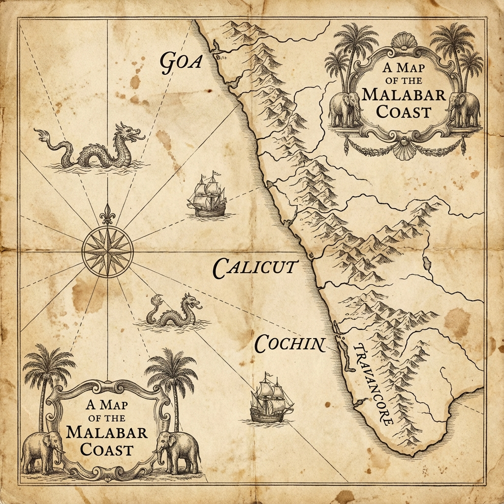

# Horse of the Servant

**Blood and Thrones, Part 1**

*RV Menon*

---

# Copyright {.unlisted}

Copyright © 2025 RV Menon

All rights reserved.

This is a work of historical fiction. While many events, places, and figures are historical, some characters, timelines, and scenes are invented or compressed for narrative.

---

# Dedication

*Dedicated to history lovers all over the world, and to Suraj, who recommended this theme.*

---

# Prequel: The Vow and the Tiger

In the late 1730s, the western coast of India smelled of wet gunpowder and pepper. Salt wind carried the tang of the Arabian Sea into every camp and every fort. Between the surf and the hills, empires pressed against each other like wrestlers, each convinced the other would tire first.

On one coast, the Portuguese still rang their church bells over Goa and flew their flags above stone walls that had learned to swallow screams. They had held this strip of land for generations, long enough to believe it belonged to them by habit. Their forts along the Konkan were a chain of white teeth, and their caravels and galleys prowled the sea lanes, guarded, when it suited them, by the dark hulled ships of the Siddis. The Siddis of Janjira were not priests and merchants like the Portuguese. They were sea fighters, a kingdom of sailors with African blood and Indian shores, hired and hated and feared in the same breath. Between them, they made the coast feel fenced.

Then the Maratha hand closed.

In Pune, Baji Rao, the Peshwa, sent orders like arrows. His younger brother Chimaji Appa carried those orders to the coast and made them personal. Chimaji was not a man who loved speeches. He loved ledgers of powder and lists of captured guns, the slow certainty of siege lines tightening. But he understood something about the Portuguese that many inland men missed. They were not unbeatable because they were white or Christian. They were dangerous because they had fort walls, cannon, and the patience of men who believed time itself worked for them.

So Chimaji vowed that time would not save them.

I heard the vow in a camp that stank of horse sweat and damp rope. The monsoon had passed, leaving the earth soft and the mosquitoes hungry. Chimaji stood in a circle of officers, a lamp smoking beside him, his face hard in the flicker. Behind him, Brahmins chanted in a small, stubborn voice, and the men answered in murmurs, hands touching sword hilts and prayer beads with equal familiarity. He did not promise easy victory. He promised that no foreign flag would be allowed to sit on Konkan soil unchallenged, not the Portuguese cross, not the Siddi banner painted on a prow. He promised to take their forts one by one, to make the coast remember who it had always belonged to.

Wars are made of such vows. They are also made of trenches, and blood, and the stubborn labour of men who drag cannon through mud.

The Konkan campaign was not a single battle. It was a grinding season of sieges and raids, forts that fell after weeks of hunger and sudden night attacks that left a road littered with broken carts and spilled grain. We learned to cut supply lines, to watch for the glint of a musket barrel in coconut groves, to move like a flood and vanish like smoke. We learned that Portuguese guns could kill a horse as easily as a man, and that a cavalry charge means nothing if the ground is chopped into ditches and sharpened stakes.

The Portuguese fought like men defending a house they had stolen and made their home. They countermined our tunnels. They bribed scouts. They sent priests to promise salvation to men who could not read their prayers. When that failed, they sent iron and rope. They broke bodies in cells under Goa and called it justice.

We broke forts instead.

At Bassein, the Portuguese fortress that watched the sea like an old predator, I saw a wall tremble under our guns. I saw men climb into smoke with ladders shaking in their hands. I saw my black mare Kanka take a ball through the chest and fold as if the ground had suddenly gone soft beneath her. In the roar and confusion, in the stink of powder and blood, I understood that campaigns turn into legends because the men who live through them need something to hold onto when the dead begin to outnumber the living.

In those months, we spoke as if Konkan was the whole world. We spoke as if Chimaji Appa's war was the only war that mattered.

It was not.

Far south, beyond the passes and the Deccan plateau, beyond the long curve of the Malabar coast where pepper vines climbed trees like hungry fingers, another king was shaping a kingdom with the same ruthless patience. I did not meet him then. I did not even know his name beyond a rumour carried by merchants. But later, in Travancore, I learned that while Chimaji tightened his siege lines against Portuguese stone, Marthanda Varma of Venad was tightening his grip on men and land.

Venad was not supposed to frighten anyone. It was a wet strip of country pressed between the mountains and the sea, broken into quarrelling houses and temple lands, rich in pepper and coconut and river mouths, and rich, too, in the kind of small pride that makes neighbours sharpen knives. Its neighbours were older, some wealthier, some with better access to the ports, but many had lived too long under the shadow of Dutch treaties and European guns to imagine a future that was fully their own.

Marthanda Varma did imagine it.

He had the ego of a man who refuses to stay small. He dreamed of a southern empire, a single authority that could tell the pepper coast what price it would accept and which foreign ship could anchor where. To build it, he first crushed the threats inside his own house. The Thampi brothers who claimed power by blood and violence were hunted down. The *Ettuveetil Pillamar*, the Eight Houses who had treated the crown like a decoration while they ruled the land, were broken and scattered. Venad learned, in a short brutal span, that this king would not be managed.

Then he turned outward.

Small kingdoms and chiefdoms that had spent generations balancing each other suddenly found a new weight pressing on them. Some bent. Some resisted. Some ran to older powers for protection. It was in the interest of the Dutch that no single prince on the Malabar coast became too strong. A divided land made treaties easy. A divided land signed away pepper cheaply, prince by prince, without the Dutch needing to maintain an expensive army beyond the walls of their coastal forts.

So the Dutch played the coast like a stringed instrument.

Cochin, long a pivot between European powers, watched with alarm. The Samudri, the Zamorin of Calicut, understood that a king who grew too strong in the south would eventually pull at the north as well. Principalities nursed grievances and old succession disputes like infected wounds. Dutch agents offered arms and ammunition, offered promises, offered the thin comfort of European umbrellas. Alliances formed, not out of love, but out of fear.

Inside Venad, Marthanda Varma prepared anyway. He had something most of his rivals lacked, a minister who could see past today's feud to tomorrow's war. Ramayyan Dalawa was not a man who shouted on battlefields. He was a man who counted, who read letters in multiple tongues, who understood that pepper is not just spice but power. Under his guidance, the king gathered guns, trained men, and made a state that could endure beyond one season's victory.

By 1738, two storms were rising on two coasts. In the west, Chimaji Appa's vow sharpened the Maratha appetite against the Portuguese and their allies. In the deep south, Marthanda Varma's ambition sharpened Travancore against every neighbour, every rival house, and every European company that believed this coast could be owned.

I was only a cavalryman then, one more rider in Chimaji's shadow, thinking I knew what war was.

The Portuguese taught me otherwise.

---

# Character Guide

This guide is here so you can keep houses, titles, and foreign powers straight on a first read. Historical figures are noted as such. Fictional or composite characters are noted as such.

## Maratha Confederacy (West Coast)

*   **Chimaji Appa (historical):** Younger brother of Baji Rao I, the Peshwa. Commander of the Maratha Konkan campaign against Portuguese forts and coastal rivals.
*   **Baji Rao I, the Peshwa (historical):** The Maratha empire's chief minister and strategist, whose expansionist wars reshape the subcontinent's balance.
*   **The Siddis of Janjira (historical):** A sea power on the Konkan, feared for naval warfare and shifting alliances.

## Travancore and Venad (Deep South)

*   **Marthanda Varma (historical):** King of Venad and architect of Travancore's rise, ruthless in consolidation and hungry for a sovereign southern state.
*   **Ramayyan Dalawa (historical):** The king's diwan and principal strategist, a man of letters, ledgers, and cold clarity.
*   **The Senior Rani (historical):** Matrilineal authority within the royal household, whose legitimacy and politics shape succession.
*   **The *Ettuveetil Pillamar* (historical, collective):** "Lords of the Eight Houses," powerful nobles broken during the years of consolidation.
*   **The Thampi brothers (historical, collective):** Rival claimants and violent challengers to the young king's authority.

## Dutch and European Soldiers

*   **Eustachius De Lannoy (historical):** A Dutch officer whose defeat becomes the beginning of a new role in Travancore's army.
*   **Karl August (composite):** A European deserter and drill expert, used in the novel as a bridge between company discipline and local war.

## Other Colonial Powers

*   **Portuguese authorities in Goa (historical):** The Estado da Índia administration, controlling prisons, forts, and old trade routes by fear and habit.
*   **English at Anjengo (historical):** A cautious Company presence on the Travancore coast, trading and watching, sometimes lending aid when interests align.
*   **French at Mahe (historical):** A smaller European power on the coast, present as a rumour and a possible counterweight in the wider chessboard.

## Rivals, Allies, and Neighbours

*   **Cochin (historical polity):** A coastal kingdom and Dutch ally, threatened by Travancore's expansion.
*   **Samudri, the Zamorin of Calicut (historical title):** "Lord of the Sea," a northern power whose interests clash with any southern empire.
*   **The Nawab of Arcot (historical office):** A Carnatic ruler whose cavalry and politics tug at Travancore's southern frontier.
*   **Chanda Sahib (historical):** A Carnatic contender whose pressure helps trigger the Dutch crisis.
*   **Kottarakkara and the Elayadathu line (historical polity):** A northern succession house used by rivals and foreign companies as leverage against Travancore.
*   **Kayamkulam, Desinganad, Purakkad, Thekkumkur, Vadakkumkur (historical polities):** Smaller kingdoms and principalities drawn into alliances against a rising Travancore.

## Key Fictional and Composite Characters (This Novel)

*   **Nagoji Sawant (fictional):** A Maratha cavalryman captured by the Portuguese and thrown into the south, where he becomes both weapon and witness.
*   **Keshavrao (fictional):** A younger comrade from the Konkan campaign, whose fate marks Nagoji.
*   **Ibrahim Marakkar (composite):** A coastal power broker who understands that trade and war are the same river.
*   **Padmini Amma (fictional):** A formidable estate holder whose house becomes a hinge between old order and new state.
*   **Revathi Bayi (fictional):** A princess of Velinadu, sharp minded and dangerous to love.
*   **Dhanaji (fictional):** A Deccan man in exile, carrying his own loyalties and grief into Travancore's wars.
*   **Savitri of Kottarakkara (fictional):** A single face for a broader succession struggle at the kingdom's northern edge.

---

# Book I, Chapter 1: Dungeons of Goa

The first thing they took was my name.

Not with ceremony or proclamation, just a shrug and an entry in a ledger. To the men who ruled this cellar I was no longer Nagoji Sawant, *huzurat* cavalry officer in the service of Chimaji Appa and the Peshwa, rider of the black horse Kanka, son of a landlocked village near Nashik where the farthest water anyone feared was a swollen river in the rains. In the quiet of Maratha tents that word *huzurat* carried weight, the household horse that rode closest to command, picked out by sardars when bravery and impatience for hesitation had been proved in more than one fight. Here I was a number the clerk scratched beside the words *prisioneiro marata* in his book.

They chained us in rows along the curved wall, backs pressed to damp stone, ankles linked by rusty iron. Above, somewhere beyond the sweating ceiling, the bells of Goa's churches rang for evening prayers. Down here, the rhythm that governed us was the scrape of the gaoler's boots and the splash of the bucket that carried away blood and filth. Water dripped somewhere in the darkness, steady as monsoon rain on a Deccan roof.

I was twenty-five that year, 1738, in the seasons after we broke a string of Portuguese forts along the Konkan, old enough to have seen men I admired die foolishly, young enough to believe I could still choose the shape of my own death.

They had already taken my fingernails by the time Father Duarte came.

The padre walked carefully between the lines of prisoners, his black cassock held slightly above the slime on the floor. He was a thin man with a scholar's stoop and ink-stained fingers, the sort of holy man who looked built for argument, not battle. Yet the calluses on his right hand told me he had once held something heavier than a quill. Here he was, deep under the Portuguese fortress at Goa, eyes moving from one ruined body to the next.

I watched from the corner of my eye. That habit predated the Portuguese by years. As a boy in the Deccan I had learned to sit in the corner of a fort courtyard and see everything, from the loosened strap on a trooper's saddle to the way a sardar's hand tightened on his sword hilt at the mention of a rival. Here in this cellar I turned the same skill on other men.

The gaoler, João, moved beside the priest. He was a broad man whose belly strained his leather belt, a man who had learned to wrap cruelty in jokes. He smelled of garlic sausage and chapel incense, an unholy combination. When he passed my place he tapped my shoulder with his boot, almost companionable.

“Este,” he said in Portuguese, “this one is stubborn.”

I kept my face blank. Stubborn is better than broken in any language.

Father Duarte's gaze followed the gaoler's gesture. His eyes were grey and tired, with the faint redness of a man who slept badly. When he saw my hands, wrapped in dirty cloth, he winced and his fingers twitched inside his sleeves.

“How long since the last questioning?” he asked in that same tongue.

“Two days,” João replied. “He still insists he is only a horseman. No names, no forts, no routes. He knows we have others who talk, but still he holds on.”

The priest's eyes came back to my face. “You understand our language, senhor marata?”

“Enough to know when I am being lied to, Father,” I said in my own Marathi. My mouth tasted of rust and old water. “But you can speak your questions. I have heard most of them already.”

João laughed. “You see, he understands.”

“Bring him,” Father Duarte said.

They unshackled my legs and hauled me upright. My joints protested after so long curled under me. I bit back the groan. A Maratha horseman does not whimper in front of an enemy. We bleed, we fall, we curse the gods and get back up. On the black soil of the Deccan that had been simple enough. Here in the Portuguese darkness it took more effort.

The interrogation chamber lay twenty paces away and felt like another world entirely. The smell changed as we went, from rotting straw and human waste to oil, sweat and something sharp that stung the nose, a sour mixture of wine and old fear. They had built the room under a vaulted arch, stone thick enough to swallow most screams before they reached the street.

Ropes hung from an iron ring bolted into the ceiling. A table sat to one side, laid out neatly with tools that had never worked metal. Pliers. Hammers. Wooden wedges. A brazier glowed on the far side of the room, its coals sending up a thin trail of heat that shimmered in the dim light.

This was where the Portuguese forged information.

They sat me on a stool with my wrists bound to its legs. João checked the knot, then moved to the table. The priest remained standing, hands tucked into his sleeves, fingers worrying at the cloth.

“Nagoji Sawant,” Father Duarte said, using my name as if it still belonged to me. “You have already told us that you rode with a Maratha force against our allies. You have admitted that you attacked Portuguese caravans and outposts. The Viceroy's spies insist you were *huzurat* cavalry under Chimaji Appa himself, chosen by your sardars for your initiative. Such men see more than dust and hooves. What we do not yet know is who ordered those attacks, how many men you had, and which forts or roads you meant to strike next.”

“You know more than I do then,” I said. “We raided where we could, when we could, against whoever traded with our enemies. That is the way of the ghats and passes. You have maps and books. You draw lines on paper and call them borders. My horse does not read.”

João picked up a pair of iron tongs. “Your horse is dead,” he said conversationally. “We shot it when we brought you in. A pity. Fine animal.”

My throat closed. Kanka's black mane against my cheek on winter mornings, his easy stride, the way he had carried me through musket fire near Chaul. I forced the memory down. They wanted to see grief; they wanted to use it as a lever.

“Then he died better than I will,” I said, hearing the flatness in my own voice.

Father Duarte studied me. “You are not a fool,” he said. “You know your position. The Viceroy needs names. He needs to know if the army that devoured his northern strongholds is turning its hunger south. He needs to know if Chimaji Appa intends to bring his siege guns to Goa next. If you cooperate, your suffering can end. I can speak for you, perhaps secure you work on a plantation, a life in chains that is still a life. If you do not...”

His gaze flickered briefly toward the brazier.

Those northern forts rose in my mind, one victory after another in those hard years, each fall ringing like a bell across the Konkan. Chimaji Appa followed, and with him the fear I smelled on these priests. They knew what we knew: the war was not over. Chimaji was coming for Goa. Any day now, the ground above this dungeon would shake with the impact of Maratha cannon.

“If I do not,” I said, “you will do what you have already done to others. You will pull at my body until it comes apart. You will hold hot iron to my skin. You will try to make me scream something that fits the shapes you already have in your mind.”

João snorted. “He talks too much.”

“He is a soldier,” Father Duarte said softly. “He knows the game.” He stepped closer. “Tell me this at least, Nagoji. Not for the Viceroy, for me. Do you believe you fight for God, for some higher good, or is it simply for plunder and the honour of your people?”

The question surprised me more than any threat could have. For an instant the dungeon vanished and I was once again on a ridge above the Godavari, looking down at the dust of a marching column, feeling that familiar tightness in my chest that was not quite fear and not quite joy.

“I fight because I was born into a world where men who do not fight are trampled,” I said slowly. “I fight because if my people do not learn to meet guns with courage, someone else's flag will fly over our forts. As for God, Father, I leave Him to the Brahmins and to you. He seems to favour whoever has the better powder.”

The priest's mouth twitched, a shadow of something that might almost have been a smile.

“You see,” João said, “he gives you nothing. Let me loosen his tongue.”

For a heartbeat Father Duarte did not answer. His jaw worked, as if he chewed on words he could not swallow. Then he inclined his head, a small, weary nod, and João reached for the tools.

The next hours stretched and blurred. The first wedge went under what remained of my left thumbnail. After that, pain lost its degrees. Once you have felt your fingers crushed in iron and your joints forced against the way they were meant to bend, the mind floats above the body and watches priests and gaolers ply their trade.

Once, when João reached for the brazier, Father Duarte's hand shot out and closed over his wrist.

“Not yet,” he said, voice rough. “The Viceroy needs a hand that can still hold a quill.”

The gaoler grumbled, but he chose another tool.

Somewhere in that haze Father Duarte said, “Enough.” João protested that the marata still held back names. The tired priest insisted that a dead prisoner could not testify and that the Viceroy preferred confessions on paper, not corpses.

When they dragged me back to the cellar and chained me in my place against the wall, my hands were raw meat and my shoulders throbbed with each breath. I closed my eyes, not in prayer, but in calculation.

How many guards at the door. How often they changed shifts. Which men wore keys at their belts and which only carried cudgels. Where the buckets were stored. How many steps from the stair to the courtyard above.

I counted, as I always had. Horses, men, paces, opportunities.

The priest's question lingered like smoke in my mind.

Did I believe in anything beyond survival and the honour of my people?

That night, as rats skittered along the edges of the straw and someone sobbed quietly in the darkness, I decided that belief did not matter in this place. Numbers did. Chains did. Ships did.

Rumour moved through the dungeon the next day, low and cautious, like water seeping through a crack.

They were gathering prisoners, men said in whispers. Not for the stake, not for the scaffold, but for transport. Somewhere far to the south the Portuguese needed labour. Somewhere beyond the horizon they were building something that required bodies that did not ask questions.

I listened, back pressed to cold stone, and for the first time since they dragged me into this fortress I felt a thin thread of hope.

Ships meant movement. Movement meant chances.

The Portuguese had taken my name and tried to break my body. They had forgotten the simplest lesson of the Deccan monsoon.

Storms do not ask permission.
# Book I, Chapter 2: The Slave Ship South

They woke us under cover of bells. The great church above rang for early Mass, a flood of sound rolling down through stone into the cells. I counted the strokes. When the last echo faded, bolts scraped at the dungeon door.

João entered with three guards at his back.

“Up,” he shouted in rough Konkani, a version rounded by Portuguese tongues. “Those marked go to the docks.”

He moved down the line with a leather strip of symbols, tapping one man, skipping two, cuffing another awake, all the while humming a hymn under his breath. The tune was the same one the church bells had played.

When he reached me he did not bother to look at the marks on my cell wall. He knew where I sat. He had spent too many hours standing over me, hands busy with iron and rope.

“On your feet, marata,” he said. “The Viceroy has found a use for you.”

The guards unlocked the shackles at my ankles. For a brief moment the weight of the iron vanished and my legs swung free, terrifyingly light. I stood slowly, every joint complaining. The beatings and the wrenched limbs from the previous days had left my body bent and aching, but I forced myself not to limp.

Ahead, two places along the chain, Keshavrao shuffled in step, his familiar narrow shoulders stiff, his black hair hacked short in the Portuguese style. Even now his right hand twitched at his side, still reaching for a sword hilt that was no longer there.
They chained us in a line, six men to a length of iron, wrists manacled, collars clamped around our necks. The metal was slick from the sweat and grime of countless prisoners before us.

“Rao,” I said softly.

His head twitched, but he did not look back. A guard walked between us, club in hand.

The climb from the dungeon to the world of light was like being born through a tunnel of stone. At each turn the air grew a little fresher and the smell of filth retreated before new smells. Oil. Bread. Sea.

We emerged into a courtyard of whitewashed walls and glaring sky. The sudden brightness stabbed my eyes. Shapes resolved themselves slowly. Musketeers stood along the walls, hats tilted, matchcords coiled at their belts.

Father Duarte stood near the gate.

He was dressed for travel, a broad hat shading his grey eyes, a leather satchel over one shoulder. When our line of prisoners shuffled past, his gaze moved along the chain until it found me. For a moment our eyes met.

I expected triumph, or at least satisfaction. The stubborn Maratha, broken at last, being led to whatever slow death awaited in the southern plantations.

Instead I saw something else. His jaw tightened. His hand rose, almost involuntarily, and made a small sign of the cross, not the hurried gesture of a man warding off contamination, but something slower, more deliberate. A blessing, perhaps. Or an apology.

He did not speak. He did not step forward. He simply watched as the guards pushed us toward the gate, and then he turned away, disappearing through a side door into the fortress.

I filed his face away in the part of my mind that kept accounts. Men who hesitate are men who can be used. Men who feel guilt carry weight that slows them down.

Someday, I thought, that hesitation might matter.

Beyond the far gate the sound of the sea thudded against the edge of hearing.

They moved us through narrow streets where the houses leaned inward like gossiping women, balconies almost touching above our heads. Goan Catholics in clean cotton stepped aside as we passed, hands over mouths and noses. A few Hindu merchants watched from their doorways, faces carefully blank. Their eyes told a different story. They measured us, weighed the value of the bodies in chains, and filed the calculations away in minds that already carried too much.

The smell of salt grew stronger. So did the stink of tar, fish and unwashed sailors.

When we reached the harbour the full weight of the Portuguese world pressed in. The masts of ships clustered against the sky like a forest of stripped trees. Ropes creaked, gulls screamed, and the heave of water against hulls set up a constant low groan that settled in the bones.

One ship loomed closer than the rest, her hull black and high, her stern built up like a little fortress of carved wood and painted saints. Men moved along her rails, hauling on lines, shouting in a mixture of tongues. On the wharf below her a platform had been erected, and on it a man in a broad brimmed hat checked lists against the lines of chained prisoners.

“To Angola,” someone whispered behind me. “Africa.”

“Not this one,” said another voice, older and bitter. “The Jesuits need bodies for their lands to the south. Some place beyond Ceylon. They will work us until we forget our own names.”

João tugged at our chain. “Faster,” he grunted. “The tide waits for no man. Not even maratas.”

We were herded up a gangplank slick with sea and tar. The ship towered over us, the smell of old voyages clinging to her planks. As my bare feet touched the wood, the planks flexed under my weight, shifting subtly as the water lifted and dropped the hull. For a moment an old, absurd thought surfaced.

Horses would hate this.

On deck the air was full of movement. Sailors darted around us, some dark skinned men from other parts of the empire, some pale Europeans whose faces burned red in the sun. Above, canvas cracked as it caught the breeze. The world of land, with its forts and fields and familiar dust, already felt far away.

They drove us below.

The hold had been prepared for us. Wooden shelves had been built along the sides, each shelf divided into little pens by upright planks. Someone had scratched prayers into the wood above my head, in a script I could not read. Another prisoner, another ship, another journey that ended somewhere in chains. We were pushed into these spaces, four or five men to a compartment, until the air was thick with bodies. Iron rings had been bolted into the beams overhead to take the chains that linked us.

Keshavrao and I ended in the same section by accident or indifference. When the guards moved on, rattling chains and cursing, he turned his head at last.

“Sahib,” he whispered.

I had never liked that word from him. In camp I had insisted he use my name. We were both sons of the Deccan; the distance between us was one of experience, not blood. Now, though, in that cramped, stinking space, there was comfort in the old military habit.

“Rao,” I said. “You are still alive.”

He gave a small, breathless laugh that turned into a cough. “For now.”

We spoke little at first. The hold filled with the noises of settling misery. Chains scraped. Men shifted to ease cramps that could not truly be eased. Someone at the far end of the deck began to chant a hymn in a coastal tongue close to my own, voice rising and falling as if it belonged to the creaking of the hull.

Through a hatch far above, a square of light showed strips of sky. A gull crossed that square, a white streak against blue, and the ship began to move.

“Do you know where they send us?” Keshavrao asked after a while.

“South,” I said. “That much is certain.”

“I heard one of the guards say they need men to cut cane,” he muttered. “Fields of sugar, as tall as a man. Sun that burns the skin off your back. The priest promised them that work in distant lands counts the same as service to their God. We will sweat for their salvation.”

In camp he had been the one who joked, who found some rough song to carry us through long marches. The dungeon had scraped that away. I remembered him riding bareheaded near Chaul, singing over the crack of muskets, daring the Portuguese to shoot the song out of his mouth.

“We are not there yet,” I said. “As long as we move, there is a chance.”

He shifted his weight, chains clinking. “The sahib still counts chances.”

“It is what I know.”

Time on a ship is different from time on land. In a fort you can measure days by the sun on the walls, by the calls of guards on the ramparts, by the rhythm of work and rest. In the dark belly of a vessel there is only the change in the pitch of the hull, the moments when hatches open for food and air, and the slow erosion of the sense that the world is anything more than wood, iron and salt.

They brought us rice and dried fish twice a day. The water was stale and tasted of wood and old journeys. Men fell sick quickly in the close, damp air. Coughs turned wet. Wounds from the dungeon festered. The little space that each of us had claimed narrowed as the weaker sagged against the stronger.

Sometimes, when the hatches stayed open a little longer, Portuguese voices drifted down from above.

“Wind is with us,” one man said once. “If it holds we round the cape before the worst of the storms.”

“If the storms do not find us anyway,” another replied. “This run is cursed. The last ship took lightning in the mast. They say God sends warnings.”

“God sends opportunity,” a third voice cut in, amused. “These bodies in the hold are silver if they live to touch the soil we have claimed.” He named a number of cruzados per head, as if we were sacks of pepper. “Pray for their health, not their souls.”

Their laughter filtered down with the light.

Below deck Keshavrao shivered.

“If there is a storm,” he said, voice low, “will the ship break?”

“All ships break,” I said. “The question is when and how.”

He was silent for a time. Then, very quietly, he said, “If the chains break too, I will follow wherever you jump, sahib.”

The words settled over me heavier than iron.

I had never meant to collect followers. On the dusty roads and river crossings near Nashik I had led men because someone had to ride in front, to show that Portuguese guns could be faced even away from their forts. Those who followed did so because they trusted my calculations, not because they saw anything in me worth adoring. Now, in a dark hold that smelled of vomit and fear, one boy's loyalty wrapped itself like a rope around my chest.

I reached across the narrow gap between us and rested my bandaged hand on his forearm.

“If there is a chance,” I said, “I will not leave you.”

His fingers closed briefly over my bandaged hand. Neither of us mentioned that promises made in chains are the easiest to break.

Above, the timbers creaked in a new rhythm. The ship rolled more sharply, the water slapping her sides with a sound that had teeth. Somewhere, a sailor cursed. Somewhere else, a prayer rose.

The Arabian Sea was beginning to remind us who owned this ship.
# Book I, Chapter 3: The Choice in the Storm

The first warning was not the shout of a sailor or the crack of thunder. It was the change in the way the ship moved.

Even in chains I had learned the rhythm of this hull. She rolled and heaved with a certain patience, rising over long swells and settling again, her creaks and groans almost like a breathing beast. One night, as the air in the hold grew thick and hot, that rhythm snapped.

The roll sharpened. The floor under us tilted harder to one side, then the other, so that our chains jerked and bodies slid against one another. A few men cursed. One began to retch. Above, heavy boots thudded across the deck with new urgency.

“Storm,” Keshavrao whispered.

I let the word hang and listened. Ships speak when they are in trouble. The strain of timbers changes. The voices of the men who serve them shift from boredom and casual insult to clipped orders.

Now those voices were raised. Portuguese words rattled overhead, sharp and fast.

“Reef the sails... haul, haul... tie that down... move, you son of a dog...”

Then, farther off, a deep boom rolled across the water. Not a cannon, but thunder, the long growl of a sky gathering its strength.

The hatch above us slammed open. Rain hammered down in a sheet for a heartbeat before a canvas awning was dragged into place. Grey light poured into the hold, turning the filth on the floor into a glistening smear.

A guard appeared at the top of the ladder, bracing himself with one hand on the frame, the other gripping a musket.

“Quiet down there,” he shouted in Konkani. “No shouting. No prayers. If any of you break your chains and try for the deck we put a ball in your gut and throw you over.”

No one laughed at his bravado. It is easy to make threats on solid ground. At sea, when the hull itself complains under your feet, every man knows he is at the mercy of things greater than muskets.

The ship lurched again, harder. Men cried out as they slammed into each other, iron biting into ankles and wrists. The guard swore, lost his balance, and disappeared from the square of light. His musket clattered down the ladder and landed not far from me, spinning on the boards before coming to rest against a beam.

For an instant the hold went very still.

Muskets are like horses. They draw every eye in a space. Even men who have never fired one recognise the shape of power.

Then the hull heaved once more. Someone shouted. A chain yanked tight. The spell broke.

“Leave it,” another guard bellowed from above. “Get back to work. The pigs below are not our problem if the mast goes.”

The musket lay between us and the ladder like something washed up by a strange tide. Too far to reach. Too close to ignore.

“Sahib,” Keshavrao murmured, “if the ship breaks...”

“If the ship breaks,” I said, “no musket will save them.”

Water began to seep along the floor, first as a thin trickle, then in thicker threads that followed the slope of the boards. The air grew colder as wind forced itself into the seams. The smell of the sea, sharp and raw, fought with the stink of the hold.

The storm did not descend at once; it built in layers. First the tilt of the deck, then the drum of rain, then the cracks of closer thunder. Only when the first real wave hit us broadside did the men in the hold understand what it meant.

The ship rolled so violently that for a few heartbeats we were almost weightless. Stomachs lurched. Chains snapped taut, then slackened. Bodies slammed into wood and into each other. Somewhere to my left a man screamed as his arm bent under another's weight at the wrong angle.

Cold water surged across the floor, soaking my legs to the knee.

“Hold to the beams,” I shouted in Marathi. “Hook your arms over the wood above. Do not let the chain drag you.”

It was useless advice for some. The space was too tight, the iron too confining. Still, a few men nearest me copied my movement, looping their forearms over the rough timber above their heads whenever the ship lurched, taking some strain off their wrists and ankles.

Keshavrao tried and nearly lost his grip as another wave hit. I grabbed his forearm and steadied him, the iron between us clanging.

“Listen to me,” I said, pitching my voice low and close. “Storms break ships. When wood breaks, iron bolts pull out. Chains go loose. The men above will think only of their own skins. In that chaos there will be one moment when we can move without them seeing.”

His eyes were wide in the gloom. “Move where?”

“Towards air,” I said. “Towards anything that floats.”

Another crash of water. The hull groaned like an animal in pain.

“And if there is no such thing?” he asked.

“Then we die here in the dark,” I said. “You have seen the dungeon. That is what awaits us at the end of this journey in another land. Tell me which death you prefer.”

He swallowed. His Adam's apple bobbed against his collar.

“With you,” he said, “I prefer the one that involves a chance.”

The storm grew teeth.

Soon there was no rhythm left in the ship, only violent, unpredictable lurches. The world narrowed to wood, iron, cold and noise. Lightning flashed through gaps around the hatch cover, turning the hold into brief, harsh portraits of fear. Men clung to each other, to beams, to whatever they could find.

Above, voices rose in panic.

“The mainmast... hold her steady... cut the rope... it will take us over...”

A new sound joined the rest, a long, splintering crack that vibrated through the hull. The ship shuddered as if struck by a giant hand. Something heavy crashed on the deck above. More shouting, this time with the edge of terror men do not bother to hide.

“She is taking water... pump, for the love of God...”

Water poured into the hold in earnest now, not in thin sheets but in surges that smacked into our legs and bellies. The cold stole breath. Chains grew heavier as they dragged through the flood.

“We will drown down here,” someone gasped.

He was right. If the ship sank with us still chained to the beams, the sea would fill our mouths before we even reached the surface.

“Look,” Keshavrao shouted in my ear. “The ring.”

He jerked his chin toward the iron ring that held the chain above our heads. It was bolted into a beam with thick nails, but with each violent roll the wood around it creaked and splintered a little more. Dark cracks spread around the bolt, widening as the hull flexed.

“When it goes,” I said, “we move.”

We did not have to wait long.

Another wave hit. The ship climbed, shuddered, then seemed to fall out from under us. In that sickening drop there was a sound like a tooth being pulled from rotten gum. The ring tore free from the beam with a spray of splinters. The chain that held our section dropped, yanking our collars and wrists, then sagged.

Men screamed, not in pain but in wild, sudden hope.

“Quiet,” I snapped. “You want them to hear?”

The noise above would hide a great deal, but panic makes men loud. Loud men attract attention.

I wriggled my hands as far as they would go along the slackened chain, bringing my wrists closer to the bolt hole in the beam. The wood there was ragged and soft. With enough force, perhaps the iron could be slipped, not from the cuffs themselves, but from the weakened timber.

“Help me,” I said to Keshavrao. “On three. Pull as if you are trying to tear your own head off. One, two...”

On three we both jerked backwards, putting all our remaining strength into the chain. Muscles screamed. The edges of the collars bit into our necks. For a moment nothing moved. Then the rotten wood gave another fraction, the hole widening.

“Again,” I hissed.

We pulled, again and again, timing our efforts with the wildest rolls of the ship. On the fourth attempt the bolt tore free entirely. The length of chain that linked our collars dropped to the floor with a splash.

We stumbled, suddenly unmoored. Our wrists were still shackled, our ankles still chained in pairs, but for the first time since Goa there was open space above our heads.

“Others,” Keshavrao said.

I nodded. “Quickly.”

We moved along the beam as far as our ankle chains allowed, grabbing at iron, yanking at rings, kicking at weak points in the wood. Some prisoners were too far away for us to reach. Others had rings buried in sound timber that would not yield. In a few compartments we were able to free the line that held the collars, giving those men the same fraction of liberty we now possessed.

Liberty was a generous word. We were still in a dark box, chained at wrists and ankles, with a storm trying to tear the world apart above us. Yet the feel of slack iron at our throats did something to the spine that torture had not. It made men stand a little straighter, even with the deck pitching underfoot.

“The hatch,” I said. “We need air. We need to see.”

The ladder swayed with every lurch. The fallen musket still lay at its foot, water washing around it in little currents.

“If we take it,” Keshavrao said, “they will shoot us.”

“If we stay,” I said, “we may drown before they can load.”

I sloshed forward, every step a battle against the water and the drag of the chains. My fingers closed around the stock of the musket. It was not loaded. Sensible men do not leave a primed weapon lying about. Still, weight is weight, and a length of hardwood with a metal barrel can break a wrist or a skull more cleanly than bare hands.

“Stay behind me,” I told Keshavrao.

I began to climb.

The ladder felt narrower than any siege stair I had ever mounted. My shackled ankles limited my stride. The musket bumped against the rungs as I went. Around me the hull creaked and shuddered. Water slapped the underside of the deck in heavy blows.

Halfway up a figure appeared in the square of light, backlit by a flash of lightning. For an instant he was only a silhouette, musket in hand.

“Back,” he shouted, the word broken by fear and the tilt of the world. “Back, or I fire.”

He tried to bring the barrel down toward me. The ship chose that moment to lurch. He flailed for balance, one hand leaving the ladder.

Years of riding into gaps in enemy lines had trained my body to move in such instants before my mind could think.

I drove the butt of my own musket upward with all the force I could muster. It connected with his wrist. Bone cracked. His weapon spun away. He cried out, reaching blindly for support, and missed.

He fell past me, hitting the rungs once, twice, then the floor of the hold with a wet, final sound. The water took him, rolling him against the planks like a piece of discarded cargo.

The ladder was clear.

“Now,” I shouted. “Move. All of you who can climb, move.”

I scrambled the last few steps and burst onto the deck. The hatch opened just aft of the mainmast, near the middle of the ship.

The storm greeted me like an enemy who had been waiting.

Rain hammered down in sheets. Wind ripped at what little cloth I had left. The deck tilted. I grabbed a rope to keep from sliding into the frothing black water below. Above, what remained of the mast loomed at an angle, torn canvas snapping like flags of surrender.

Men fought everywhere. Not each other, but the elements. Sailors wrestled with lines, knives in their teeth, trying to cut away rigging that threatened to drag the ship over. Others pumped at hand levers that fed water from the bilges back to the sea, their faces white in the lightning flashes.

No one looked at me.

To them I was just another piece of loose cargo tossed up from below. Their world had shrunk to ropes, timbers and the next wave.

Behind me, at the hatch by the mast, Keshavrao's head appeared. His eyes were huge in the storm light.

“Sahib,” he cried. The word was whipped away by the wind.

Another wave loomed, higher than the others. It reared up on our starboard side, to my right, a wall of water lit silver for a moment by lightning. For that instant everything was clear.

The broken mast. The men at the pumps. The open sea beyond, white capped and hungry. Keshavrao's thin hands on the ladder. The chain still linking his ankles. The iron still binding his wrists.

A coil of rope lay by the starboard rail at my right, half loose at my feet. A shattered spar floated just off the ship's side, momentarily caught in the eddying water.

Calculations raced through me faster than words. Leap now, reach the spar. Keshavrao follows, chains drag him under. Wait to free him, we both get smashed against the rail.

The wave fell.

It hit the ship with a force that tore screams from every throat. Water crashed over the deck, hammering us flat. For a moment I was nowhere, only a body in a cold, roaring universe. Then the ship lurched up again, and I found myself on my knees, fingers clawed into that coil of rope.

Keshavrao still clung to the hatch, half out of the hold, half in. The water had drenched him, slicking his hair to his skull. Blood ran from somewhere on his forehead, thin in the rain. His right hand still twitched at his side, reaching for a sword that would never come.

“Sahib,” he shouted again. “Do not leave me.”

He had said, in the dark below, that he would follow wherever I jumped.

The storm offered no time for noble speeches now.

I threw one end of the rope toward him. It slapped wetly against the deck, then slipped, the coils sliding toward the scuppers as the ship tilted yet again.

“Tie it,” I yelled. “Around your chest. Quick.”

He fumbled with the rope, fingers clumsy with cold. Another wave loomed. The ship's bow plunged into it. For a moment the world became only grey and white.

The rope went taut in my hands.

For an instant I thought he had managed it, that I could haul him up and over the hatch, that we would stand together on the deck and leap in our own time.

Then I felt the wrong kind of weight on the line. Not a man's body tied with intent, but the dead drag of something pulled by a force greater than any arm. The rope burned across my palm.

The ship dropped. The wave receded. The rope peeled my skin and vanished over the side, whipped away by retreating water.

Keshavrao was gone.

For a heartbeat I stared at the empty hatch, the broken ladder, the absence where his face had been. The rope burns on my palms throbbed, the only proof he had been there at all. The storm did not pause to mark his passing. The next gust tore at the stump of the mast. The next wave reared.

The spar I had seen floated closer, riding the foam just off the rail.

In the Deccan, before we rode into Portuguese fire, my troop and I had made a pact. If a man fell, the others rode on. We would mourn later, in camp, with liquor and song and stories. On the field there was no room for hesitation.

This was my field now.

I wrapped the remaining coil of rope around my chest twice and knotted it as best I could with numb fingers, leaving the free end trailing. It was a poor excuse for a plan, but sometimes the gods look kindly on men who refuse to freeze.

I staggered to the rail.

The sea clawed at the hull. The spar rose on the swell, close enough now that I could see the splinters at one end, the barnacles clinging to its underside.

I took one breath, tasting salt and fear. I thought of Keshavrao's narrow shoulders in the hold, of his quiet “with you, sahib” in the dark.

“Forgive me,” I said, to the boy I promised not to leave, to the horse who died better than I would, to whatever gods listen to men who jump into storms.

Then I hurled myself over the side.

The sea closed over my head like the hand of an angry god.
# Book I, Chapter 4: The Fishermen of the Pepper Coast

When the sea finally spat me out, it did so without ceremony.

Sand. My chest slammed into it so hard I thought my ribs had cracked. Salt water poured from my mouth, my nose, places I did not know could hold water. The retreating surf clawed at my legs, trying to pull me back. I dug my fingers into the coarse grit and held on.

Breathing was a battle. Each time I drew in air it brought more salt, more pain. My limbs felt like they belonged to someone else, a man made of lead and bruises. Somewhere in the confusion the rope around my chest had come free of the spar. Perhaps it had caught on something beneath the surface. Perhaps the storm gods had decided they wanted the wood more than they wanted me.

I lay there for a time that could have been minutes or hours, cheek pressed to wet sand, waves washing over my back and receding. At some point the noise in my ears shifted. The sea was no longer alone.

Voices.

They came first as a blur, rising and falling like the surf itself. Then words began to separate.

“...alive”

“Look at his hands...”

“Marata, see the brand on his arm.”

Hands rolled me onto my back. The sky spun. It was a flat, lowering grey, the colour of stale rice water. Rain had stopped, but clouds still hung heavy. Between my face and that sky were three other faces, framed by beards and damp hair.

They were not Portuguese.

These men wore lungis hitched up around their thighs and short, sleeveless vests that clung to their chests. Their skin was the brown of men who spent their lives in sun and salt. The smell that clung to them was strong and specific: fish, coconut oil, the faint sharpness of toddy.

One of them pushed my hair back from my forehead with rough fingers. I flinched out of habit more than fear.

“Easy, *bhau*,” he said in Konkani, using the word for brother in that tongue, close enough to my Marathi that my bruised mind could follow. “You are on land now.”

Land. The word tasted strange.

“Water,” I croaked.

A clay pot was pressed to my lips. The first swallow burned. The second soothed. The third brought my mind back enough that I could look past the men bending over me.

The beach stretched in a shallow curve, broken here and there by outcrops of black rock. Beyond it a line of coconut palms stood, their fronds rattling softly in the wind. The sea that had tried to keep me now rolled in long, heavy swells, its earlier fury spent.

On the sand to my right lay the broken carcass of a ship's boat, its planks scattered. Farther along the shore something larger loomed, half hidden by spray. I recognised the curve of a Portuguese hull, cracked open on an unseen reef. Bits of timber bobbed in the surf. No bodies, not that I could see.

Perhaps the sea had decided it had eaten enough men for one day.

“He has soldier's calluses,” one of the fishermen said, lifting my hand. The bandages the Portuguese had wrapped around my ruined fingers were soaked and filthy. “Look at this. Not a clerk. Not a merchant.”

“Look at this,” another said, tugging at the ragged cloth on my shoulder. The Portuguese brand stood out beneath it, puckered and angry.

They spoke in quick, rolling Malayalam among themselves, a language I could not follow. Their gestures and the way their eyes moved over my wounds told their conclusion clearly enough: a fighter. A man who had been in Portuguese hands long enough to be burned.

“Kill him,” a third voice said. It came from a little farther away, cautious. “Why bring trouble to the village? The Portuguese will send men when they hear of their ship. The Dutch will want to know what washed up in waters they claim. Better the sea finishes its work.”

The man who had given me water snorted.

“The Portuguese and the Dutch ask questions anyway,” he said. “You think leaving one marata on the sand will satisfy either of them? We might as well gain something.”

“What?” the cautious voice demanded. “He is half dead.”

“Half is still half,” the first man replied. He turned back to me and switched to a broken Konkani that bore the marks of trade. “You fought them, yes?”

“Yes,” I said. My voice rasped. “On the Deccan roads. Near their forts.”

He nodded, as if that confirmed a calculation.

“Our king to the south fights them too,” he said. “And the other pale ones from the north, the Dutch. He sharpens his teeth for them. A man who has seen Portuguese dungeons and still breathes may be useful.”

King. Teeth. Dutch. The words caught like hooks in my exhausted mind.

“Travancore,” I said slowly.

The fisherman raised his brows. “You know the name.”

“I know they have not yet learned to kneel when a foreign flag flies,” I said. “That is enough.”

He grinned. His teeth were surprisingly white against his weathered skin.

“You see, he has a tongue as well as scars. Come, *bhau*. Before the crabs claim you.”

They lifted me with practised ease, one man taking my shoulders, another my legs. The third walked ahead, scanning the shore. My body protested every movement. Muscles pulled at wounds. My head swam. Yet underneath the pain there was something else.

Sand grit against my bare heels. The rustle of palm fronds. The smell of earth instead of salt.

After the dungeon and the storm, these small things felt like gifts.

We left the wreckage behind. No one stopped to strip it. That would come later, when the sea had finished gnawing and the Portuguese had decided what could be salvaged. For now the fishermen moved with the quick, furtive caution of men who did not want to be seen near a crime they had not committed.

A crow cawed somewhere ahead, indignant at our approach. The first solid ground I had felt in weeks pressed against my back with each step the fishermen took.

Beyond the line of palms the land rose gently. Narrow paths wound between plots of wet paddy and neat little houses made of mud and red stone, their roofs thatched with palm leaves. The air smelled different here. Less of fish, more of earth and green things.

Children watched us from doorways, wide eyed. Women carrying pots on their hips paused, eyebrows knitting as they took in the dripping figure the men carried.

“Portuguese,” one girl whispered.

“No,” the man at my feet said sharply. “Look at his eyes. Look at his mark. This one is enemy of the Portuguese.”

We stopped at a low house near the edge of the village. A woman with streaks of grey in her hair stepped out, wiping her hands on her sari. A betel-stained smile flickered at the corner of her mouth as she took in the dripping figure, then vanished. The fishermen spoke to her rapidly in Malayalam. She listened without interrupting, eyes flicking over me, taking in the branded arm, the bandaged hands, the raw rope marks on my chest.

“Bring him in,” she said at last. Her voice had the calm authority of someone used to making decisions that stuck. “If he dies, burn him quietly. Else send word to the *kapitan*.”

The *kapitan*. A local headman, or something more? The word carried more weight here than it ever had in the inland markets where I had first heard it.

Inside the house it was cool and dim. The floor was packed earth, swept smooth. Smoke from a small hearth curled up toward a hole in the roof. They laid me on a woven mat and set about stripping off the salt stiffened rags that clung to me.

The first touch of clean water on my skin made me hiss. The woman's hands were brisk, not gentle, but she avoided the worst of the wounds. When she saw the state of my fingers, her mouth tightened. She said something in Malayalam, her tone sharp with disgust.

The fisherman who spoke Konkani translated. “She asks what they did to you.”

“Asked questions,” I said.

He translated. She clicked her tongue and replied in a quick burst of Malayalam.

“She says keep your stories for the kapitan,” the fisherman said. “She does not need to hear them to know what kind of men they are.”

A boy appeared at the doorway, panting, and spoke rapidly in Malayalam. The fishermen exchanged glances. From the word “kapitan” and the urgency in the boy's voice, I understood enough.

So. I was not the first piece of foreign wreckage to wash up in their nets.

The Konkani-speaking fisherman adjusted the cloth on his shoulder and turned to me.

“Rest,” he said. “When the *kapitan* comes, speak carefully. He works for men who have long arms.”

I closed my eyes for a moment, not to sleep but to gather what little strength I had left. Storms on land were different from storms at sea. They did not roar and crash; they crept in on quiet feet, through conversations and calculations.

I had escaped the Portuguese dungeon and the drowning ship by chance and stubbornness. If I was to survive whatever came next, I would need more than that.

Footsteps sounded outside, firm and quick. A new voice spoke in Malayalam, low but carrying. The fishermen answered with words laced with respect.

When the man they called *kapitan* stepped into the house, the smell of salt and foreign places came with him. He was shorter than the fishermen but broader, with a scar that ran from his left ear to the corner of his jaw, the kind of scar a blade leaves when it just misses the throat.

His eyes moved over me the way a horse trader's eyes move over new stock. He noted the brand, the bandaged hands, the way I held myself despite the wounds. I had seen that look before, in market squares where men were sold. For a long moment he said nothing. In that silence, I was being weighed.
# Book I, Chapter 5: Road to Travancore

The man they called *kapitan* introduced himself as Ibrahim.

Not with a bow or a flourish, only with a nod and a measuring look that told me he had decided what kind of man I was before he opened his mouth.

“You were on the Portuguese ship,” he said in Konkani, the trade tongue one of the fishermen had used to speak with me. “The storm did not like her.”

“The storm did not like any of us,” I said. My voice had grown stronger after a day of rest, rice gruel and herbs that burned my throat but soothed my chest. “I took the chance it gave.”

He glanced at my branded arm, at the bandaged hands, at the rope burns.

“You are Maratha.”

“Yes.”

“You fought them.”

“Yes.”

He nodded, his thumb tracing the scar on his jaw, a habit, I would learn, that meant he was filing information away.

“Our king fights them too,” he said. “And their cousins, the Dutch. He will want to hear what you have seen.”

He paused, his thumb tracing the scar again. Something flickered behind his eyes, a calculation, a road not taken. Then it was gone.

He did not say which king. On this coast there were many rulers, small and large, each jealous of their titles. The fishermen had spoken the name Travancore, but I wanted to hear it from this man's mouth.

“Who is your king?” I asked.

Ibrahim's lips twitched.

“You will learn his names and his titles in good time,” he said. “For now, think of him as the man whose land you lie on, whose boats pull the pepper your people crave, and whose patience with Europeans is thin.”

He gestured to the woman who had tended my wounds.

“Can he travel?”

She snorted.

“He should rest another week, but you will not wait. Men like you never do.”

“Men like me are paid to be impatient,” he said mildly. To me he added, “Can you sit a cart, or a horse?”

At the word horse an ache went through me that had nothing to do with broken skin.

“I can sit,” I said. “I can walk, if there is no better way.”

“There is a better way, though you will not like it,” Ibrahim said. “Come.”

They did not give me back my old clothes. Those were beyond saving. Instead the village turned out a set of cotton dhoti and a simple shirt that smelled faintly of coconut smoke. The cloth felt strange after months of coarse prison rags and damp. My branded arm was hidden now. My hands, wrapped in clean strips of linen, throbbed less.

Outside, the village had returned to its habits. Women drew water from a well. Children chased each other with shrieks of laughter. Men patched nets in the shade of leaning palms. Only the occasional glance at the path toward the sea betrayed the fact that a Portuguese ship had broken nearby.

Ibrahim led me not to the shore, but inland, along a narrow track that wound between paddy fields. The water in the flooded plots reflected the darkening sky in strips. Frogs chirped. A faint breeze carried the smell of wet earth and something else, sharp and almost floral.

“Pepper,” Ibrahim said when he saw my nose twitch. “You will come to know that smell well if you stay on this coast. It sits in the lungs. It pays for guns.”

I breathed it in. On the Deccan we had fought for the routes that carried this smell north. Now I was at the source.

“And for kings,” Ibrahim added. “That too.”

We reached a small clearing where a pair of bullocks stood hitched to a cart. The cart's bed was lined with sacks. Some held rice, others the dried, wrinkled berries that gave the air its sting.

“We send word ahead,” Ibrahim said. “Our people are the vines that run along this coast. We carry news as well as goods. When we bring you to the king's men, they will already know more about you than you think.”

“What do you tell them?”

He shrugged, but the gesture was a little too careful.

“That I found a branded Maratha officer on our beach after a Portuguese ship broke. That he still has both eyes and more teeth than one would expect from the Viceroy's dungeons. That he speaks like a man who has led horse into gunfire and lived.” He glanced at me sideways. “A man like that has value. The question is always to whom.”

The cart jolted as he climbed up. He offered me a hand. I took it and hauled myself onto the sacks, biting back a groan as my bruised ribs protested.

“Rest,” he said. “The road is long, and the bulls do not hurry.”

He was right about the bulls. They moved with the slow, patient gait of creatures that had never been asked to do anything quickly. The cart creaked along narrow paths that gradually turned into a broader road. Above us the sky shifted from bruised grey to the deep blue of evening. Fireflies sparked in the wet fields. Somewhere a temple bell rang, a soft, clear sound that seemed to hang in the thick air.

“Your people,” Ibrahim said after a time, “what do they think of this coast?”

“They think of it when they want money,” I said. “Pepper, cloth, horses from beyond the sea. Men from the north fight for these things, but our hills do not grow them. We have learned to ride down toward the ports, strike at caravans and warehouses, ride back before your masters answer.”

“Your masters,” he repeated. “Not you.”

“I serve, as all men serve,” I said. “But I know the difference between a fort built to defend a people and a fort built to protect a treasury.”

He considered that.

“Our fortresses are both,” he said. “You will see.”

We passed through small settlements where people spoke Malayalam I could not follow. Ibrahim greeted men by name, asked after catches and prices, then translated the essentials into Konkani for me. In one village a group of boys ran alongside the cart for a while, pointing at me.

“Who is he?” one of them called out.

“A man who thought he could drown, then changed his mind,” Ibrahim replied. The boys laughed, then peeled off, already drawn by some new distraction.

As the road climbed slightly, the line of coconut palms thinned. In their place rose other trees, taller and denser, their leaves a darker green. The air grew heavier, as if the forest held the day's heat in its branches.

“Beyond these hills,” Ibrahim said, “the land belongs to men who answer only to the king. They do not like uninvited guests. If you were walking alone, they would have misdirected you until you found yourself back at the sea with fewer coins and perhaps fewer fingers.”

“And with you?”

“With me you are still an uninvited guest,” he said, “but one whose arrival has been announced.”

We stopped near a wayside shrine where a stone image sat under a tree draped with cloth and bangles. An old woman tended a little lamp before it. Ibrahim stepped down, offered a coin and a nod. The woman blessed him with a smear of ash on his forehead, then looked past him at me.

“That one carries storms in his bones,” she said in Malayalam. Ibrahim translated, then replied in the same tongue. When I raised an eyebrow, he shrugged.

“I told her you carry horses there too. Storms and horses can both be useful, if you know how to ride them.”

As evening deepened, we reached a larger settlement. It was not quite a town, not yet, but bigger than the fishing village. Houses stood closer together. A small bazaar clustered around a crossroads, stalls offering spices, cloth, oil, and trinkets. The road here was better packed, the wheel ruts deeper.

Near the centre stood a compound wall of red stone blocks. A wooden gate broke its length. Two men with spears lounged there, straightening when they saw Ibrahim.

“You come late, *kapitan*,” one of them said.

“The sea does not consult my schedule,” Ibrahim said. He jerked his chin toward me. “This is the man I sent word about.”

The guard peered at me, his gaze lingering on my hands and the line of my shoulders.

“He looks like he should already be dead.”

“He disagrees,” Ibrahim said. “Our king might too.”

They let us through.

Inside the compound a low hall stood, its wooden pillars carved with curling designs. Lamps hung from chains, casting soft light on the packed earth floor. Men sat cross-legged around a central space where a mat had been laid. At the far end, on a slightly raised platform, another man sat with a ledger and a pile of palm leaf bundles.

He wore no crown, only a simple dhoti and a shawl over one shoulder. Yet the way others watched him made it clear he was the one who mattered here.

“This is not the king,” Ibrahim murmured as we approached. “He is busy elsewhere. This is one of his hands on this coast.”

The man looked up.

“You bring me shipwreck,” he said in Malayalam. Ibrahim translated, but the dry amusement in the official's tone needed no translation.

“The sea brought him,” Ibrahim said. “I only stopped the crabs from finishing.”

The man's eyes moved to me.

“Name,” he said. Ibrahim translated the harsh Malayalam syllable for me.

“Nagoji Sawant.”

“Service?”

“*huzurat* cavalry,” I said. “Household horse under Chimaji Appa. Until the Portuguese netted me.”

His eyes flicked to my bandaged hands, the brand under my sleeve. “You raided them?”

“Yes.”

“You know their forts?”

“Some.”

He tapped the edge of his ledger with the end of his writing stylus.

“Our king sharpens his sword for the Dutch now,” he said, waiting for Ibrahim to echo the words in Konkani. “And for those local chiefs who think they can hide behind European flags. He has horse from Arcot, musketeers of his own, ships that slip between the foreign hulls at night. What does a Maratha rider know that he does not already have?”

There it was. The question that would decide whether I was given a place in this new game or quietly dropped into some ditch.

“Your king knows his own land,” I said to Ibrahim, watching the official's face. “He knows these hills, these backwaters, which chiefs will bend and which must be broken. The Dutch and the Portuguese know their books and their drills. I know how men like them think when they stand on foreign soil and believe God and powder have made them superior. I know what a horse can do to a musket line when the man in the saddle has stopped being impressed by white skin.”

Silence settled over the hall for a moment.

Then the man on the platform smiled, very slightly.

“You speak well for someone who almost fed the fish,” he said, the translation arriving a moment after the amusement in his eyes. “Rest tonight. Tomorrow we take you to the king's war hall. He can decide whether your words are as sharp as you think.”

I bowed my head. Not as a subject, not yet, but as a man who understands that some battles begin with a lowered gaze and a measured tone.

Outside, night had fallen. The air was thick and warm. Somewhere in the darkness pepper vines climbed up their supports, indifferent to the schemes of men. Somewhere to the south a king I had not yet met considered maps covered in salt stains and ink.

The road that had begun in a Goan dungeon now pointed toward him.

Horses. Guns. Storms.

Sleep came slowly that night, but when it did, it carried no dreams of drowning. Only the steady beat of hooves on sand, and a distant roar like the sea.
# Book I, Chapter 6: The Coastal Hall

They did not take me to a palace.

In the Deccan, kings and sardars received men in high halls thick with incense, with carpets to muffle footsteps and paintings on the walls to remind visitors who held power. Here, on this coast, the hall where my fate shifted stood within sight of the sea.

We travelled south along a road that clung to the edge of the land. On one side, palm groves and pepper gardens climbed gentle slopes. On the other, low cliffs dropped toward a strip of sand and the grey plane of the ocean beyond. The air carried a constant tang of salt and something metallic, as if the very wind had tasted blood.

The bulls were gone. This time I rode, though not as I had once ridden.

The horse beneath me was a coastal animal, smaller than the Deccan mares I knew, with a rougher coat and a suspicious eye. He did not know my hand, and I did not yet know his language. Still, the feel of a moving back under me, the sway of a neck, the rhythm of hooves on packed earth, did something to straighten my spine.

Ibrahim rode on a sturdy pony at my side, his clothes different from the day I had first seen him in the fisher village. Now he wore a short coat over his vest, its pockets bulging with something that clinked softly when he moved.

“Gifts,” he said when he saw me glance. “Information costs, *bhau*. So do favours. When we reach the hall, remember that.”

Ahead, the road dipped. A narrow inlet cut into the land, its water dark and still. Boats lay drawn up along its banks, some broad-bellied cargo craft, others slender canoes for river work. The smell of fish was strong here, mixed with the smoke of cooking fires.

On a rise beyond the inlet, a structure of wood and stone looked down on everything.

It was not large, not compared to the great forts of the north, but there was purpose in every line. The outer wall was of red stone blocks, rough, topped with a parapet from which musketeers could fire. Within that wall rose a long hall with an open front, its wooden pillars carved with curling motifs of vines and tigers. Behind the hall, on higher ground, I glimpsed the start of a rampart that ran inland, following the shape of the land.

“This is only one claw,” Ibrahim said softly. “The kingdom itself is the beast.”

Guards in white cotton and dark sashes watched us approach. They carried matchlocks and spears, their posture alert but not nervous. One recognised Ibrahim and raised a hand in greeting.

“The king is in council,” he said. “You are expected.”

The words sent a little shock through me. In most kingdoms I had known, days would pass between a stranger's arrival and an audience with the ruler. Messages would be sent. Names would be checked. Here I had crossed a few hills from a minor compound and already the king himself waited at the end of the road.

They took our horses. As I dismounted, the coastal animal tossed its head and snorted. I patted its neck without thinking, feeling the warm hide, smelling sweat and salt. My bandaged fingers ached with the remembered absence of Kanka. This horse did not know me. Kanka would have nudged my shoulder.

We climbed a short flight of stone steps to the hall.

Inside, the air was cooler. The roof was high enough to let smoke and heat rise, yet low enough that one could still hear the sea beyond when the hall fell quiet. Mats covered the floor. Men sat cross-legged in loose rows, leaving a clear space in the centre.

At the far end, on a slightly raised wooden platform, a man sat with a spear resting against his shoulder and a rolled map on the mat before him.

He wore no crown. His hair was tied back, his forehead marked with the simple lines of a Vaishnavite devotee. His upper body was bare save for a single cloth thrown over one shoulder. A sword lay within easy reach, its hilt polished by use, not ornament.

At his side sat another man with sharp, fine features and a thin frame wrapped in a plain white cloth. In front of him lay a low table with palm leaf bundles, ink and a stylus. His eyes moved constantly, taking in everything, even when the king's attention seemed fixed on the map. Men near us whispered that this was his diwan, Ramayyan, a man who spoke Persian and Dutch and the trade tongues of this coast.

“Marthanda Varma,” Ibrahim murmured. “And his diwan. Remember what I said about gifts.”

We stepped forward. Conversations dimmed. The back of my neck prickled, as it always did when I walked alone into a space where everyone else already knew their place.

I bowed. Not as deeply as a subject would, but enough to acknowledge the man on the platform as something other than a fellow soldier.

“Your Majesty,” Ibrahim said, his voice smooth. “This is the Maratha rider I wrote of. He comes from Portuguese chains and storm water, and he carries knowledge of both.”

Marthanda Varma's eyes left the map and settled on me.

They were dark, steady eyes, the kind that measure before they strike. I had seen such eyes in generals' tents and in the glare of men who held small forts against impossible odds. There was nothing soft in them, but there was nothing careless either.

He spoke then, in Malayalam, the syllables unfamiliar on my ear. His gaze did not leave my face.

Ramayyan's Konkani followed a heartbeat later. “The Maharaja asks if you were on the ship that broke near our fishermen's village.”

“Yes,” I said. “I was.”

The king spoke again in his own tongue, a shorter question this time.

“He asks if you rode for the Peshwa,” Ramayyan translated.

“I did.”

Another question, another soft roll of Malayalam.

“You raided Portuguese outposts on the western roads that feed their ports,” came the diwan's version.

“I did.”

The king's hand flicked toward my bandaged fingers.

“They questioned you,” Ramayyan said for him.

“They tried.”

Something like amusement flickered in Marthanda Varma's gaze, gone as quickly as it came. If he understood my answers without his minister's help, he gave no sign beyond the speed with which his eyes moved.

He said a few more words in Malayalam, and Ramayyan pointed to a mat laid out a few paces away.

“Sit,” the diwan said. “Speak. Tell him how they fight now on your coast. Tell him how their forts stand, how their captains think, how quickly they can bring ships when a local chief resists.”

I sat. The diwan's eyes stayed on me, unblinking. His hand hovered over his stylus, ready to scratch on palm leaves anything he deemed worth remembering.

For the next while, time lost its edges.

I spoke of the Portuguese guns at Chaul and Daman, of bastions built thick and low so cannon balls skipped off instead of biting deep. I described their habit of keeping their best men close to the flag and sending raw or half sick garrisons to watch the lonely outposts. As for their papers and priests, I could only repeat what our banias and Brahmin clerks muttered in camp, that the Portuguese wrapped promises in palm leaves and made them tighter than ropes, that their padres walked ahead of soldiers with crosses held high, talking of one God while the men behind them counted how many guns a king could spare. We had heard of small rajas along this coast who signed such bargains thinking European friends would keep neighbours away, and found instead that they had invited a hungry wolf into their courtyards.

The king listened without interruption. Only occasionally did his fingers move on the spear shaft, a small adjustment, a tiny tap. The diwan wrote nothing at first. Then, as I began to speak of cavalry and how Portuguese infantry responded to sudden movement on their flanks, his hand moved, scratching quick notes.

At one point Marthanda Varma leaned forward, touched the map before him and spoke in Malayalam, tapping a point where a river mouth met the sea.

Ramayyan supplied the question in Konkani. “Here. This river mouth. How many days from their nearest stronghold at full sail?”

I closed my eyes for a moment, picturing the coastline as I had last seen it from the back of my horse. I thought of wind, of the usual routes, of how many days it had taken for replacement ships to arrive after we had burned a warehouse.

“If the wind favours them,” I said, “three days. Four if they are unlucky. Longer if someone whispers wrong directions into the ear of a pilot.”

Before the diwan could shape the words for him, the king looked up, eyes narrowing.

He said something sharp in Malayalam, only a few syllables.

“You mistrust pilots?” Ramayyan translated, but I had the prickling sense that the Maharaja already understood more than he chose to show.

“I mistrust everyone who touches a coin,” I said. “But men who steer ships can be made to see profit in many directions.”

The corner of his mouth twitched again.

“Ram,” he said without looking at the diwan.

“Already marked, Maharaja,” Ramayyan replied. His voice was soft, almost gentle. It did not match the sharpness of his gaze.

When I had finished, the hall felt oddly still, as if it were waiting for something.

Marthanda Varma spoke at length in Malayalam, his tone even. I caught none of the words, only the weight.

Ramayyan's translation carried the edge. “He says you speak as if you have counted men and ships for years, yet your own masters failed to keep you from their dungeons.”

The words were not meant as an insult. They were simple fact. Still, they stung.

“Any war has its losses,” I said. “I misjudged a patrol near the coast. I paid the price. That does not make my other calculations less true.”

The diwan turned the answer into Malayalam with a few quick phrases. The king listened, eyes unreadable. Then he spoke again, this time more briefly.

“He says, perhaps,” Ramayyan told me. “And he asks Ibrahim if he trusts you.”

“As far as one can trust a man who owes you his life and hates the same enemies,” Ibrahim said in Konkani. “Beyond that, trust is for priests.”

The king chuckled once, a dry sound that needed no translation.

Ramayyan murmured something in Malayalam that made Marthanda Varma's mouth twitch.

For a few breaths the Maharaja studied me in silence.

He spoke again in Malayalam, gesturing briefly toward the inlet and the wall behind him.

“He says they already have horse from the Nawab of Arcot,” Ramayyan translated. “Men who ride well enough. They have their own Nair warriors who can fight on foot or on small horses in this soil. They have Dutch fortifications in their minds, thanks to other Europeans who have chosen to be practical rather than loyal. He asks what you add that he does not already have.”

It was the same question that had been asked in the coastal compound, only sharpened by the fact that this time it came from the mouth of a man who could, with a word, have me thrown back to the Portuguese or consigned to some pepper estate as expendable labour.

I looked past him for a moment, out through the open side of the hall. From here, I could see the inlet below, the boats moored there, the stretch of sand beyond. Men moved like ants along the shore, unloading sacks, checking nets, shouting to one another in Malayalam.

Above them all the sea lay, flat and deceptive. Somewhere beyond that horizon sat Goa, with its dungeons. Somewhere farther still, Dutch hulls cut through foaming water, carrying men who believed pepper and souls could belong to them by right.

“You have horse from Arcot,” I said slowly. “You have Nair warriors who know this land as they know their own pulse. You have guns and forts and men from across the sea who teach you how Europeans think. What you do not yet have is someone who has ridden into a European line and felt it break. Someone who has watched their neat formations falter not from fear of God, but because a hoof struck at the right moment in the right place.”

I thought of Kanka then, of wet sand beneath his hooves near Chaul, of Portuguese musketeers flinching when our horses came at an angle they had not drilled for. I thought of Keshavrao's eyes in the storm, and the weight I now carried.

“You have men who can build ships and forts,” I said. “I can help you turn speed into a weapon against men who think their guns make them untouchable. I can help you teach your riders not to fear the sound of European volleys. I can show them where to strike, when to pull away, how to make men who drilled on flat European fields die confused on this coast.”

The diwan turned my words into Malayalam. The hall remained quiet. Somewhere outside a bird called. The waves hissed on the sand.

Marthanda Varma tapped the butt of his spear against the mat once, twice.

“Ram,” he said.

The diwan inclined his head.

In Konkani, for my benefit, he said, “The Nawab's horse know the straight charge. They do not know the feint and the vanish the way Deccan riders do. Our Maravar on horse fight bravely, but not yet with discipline against guns. You could help shape that.”

The king smiled thinly at his minister's summary. He said something brief in Malayalam, his gaze returning to me.

“He says I always see the two faces of the coin,” Ramayyan translated, amused. “And he says, very well, Nagoji Sawant. For now, you are not a guest. You are not yet a servant either. You are an experiment.”

Marthanda Varma glanced past me toward the open hall and spoke again.

“He says that outside this fort a strip of land runs along the shore, too wet for most cavalry work, too narrow for big batteries,” the diwan went on. “It is also where the Dutch will expect us to be weakest. He tells you to take the Arcot horse and a hundred Maravar riders and show him something there he has not already imagined. And he says that if you are wrong, you will find Travancore worse than the Portuguese.”

The way Ramayyan relayed it made it clear that his king had imagined a great deal.

I rose, ignoring the pull of healing wounds.

“As he commands,” I said.

The Maharaja spoke once more in Malayalam, his voice lower.

“He says I am to give you what you need,” Ramayyan translated. “And he says you are not to waste men. He has spent too many lives to sit on that mat. He does not throw them away lightly, not even when the gods demand it.”

The diwan stood, gathering his palm leaves.

“Come,” he said. “Let us see what a storm can do when given horse instead of chains.”

As I followed him out of the hall, the roar of the sea grew louder. For the first time since Goa, my blood beat in my veins with something other than pain and stubbornness.

Storms had tried to kill me. Now I would learn whether I could become one.

As I walked, my hand went to my hip, to the empty place where a sword should hang. Not in threat, but in promise. *I will serve this king,* I told myself. *I will harden his riders and break his enemies. When that debt is paid, I will turn north again, find Chimaji, and burn the Portuguese out of Goa, stone by bloody stone.*

For now, Travancore was the forge. But the blade was meant for another war.
# Book II, Chapter 7: Horses in Wet Sand

The first time I tried to make Arcot horses run in Malabar sand, they laughed at me.

Not with their mouths. Horses do not waste breath on that. They laughed with every sideways step, every planted hoof that refused to drive, every rolling eye that said what the riders did not dare speak aloud.

You do not belong here, Deccan man.

The strip of beach the king had given me was narrow, caught between the rise of a low bluff and the tug of the Arabian Sea. At high tide the waves gnawed at it until only a sliver remained. At low tide it opened into a broader, packed plain of damp sand that looked inviting to a cavalryman who had never tried to stop a charge on such footing.

The sun had only just cleared the line of palms when the Arcot troop arrived, lances gleaming, turbans wrapped high. Their commander, a lean man with a hawk nose and a scar that puckered his left cheek, saluted with his spear butt to his chest.

“Raza Khan, at your service,” he said in a Hindustani that carried the singsong of the Carnatic. “The Nawab sends his horse as promised. We have fought for Arcot and for your king before. We know how to ride.”

Behind him the men sat straight in their saddles, horses tossing their heads, bits clinking. They looked confident. Too confident.

On the bluff above, a line of Maravar horsemen watched, their lighter mounts shifting impatiently. They wore no uniforms, only white mundus hitched for riding and short jackets, but each man carried himself with the easy assurance of one whose family had held swords for generations. Their commander, a broad-shouldered fellow named Ponnam Pandya Deven, had already ridden with me along the inland tracks. He said little, but his eyes missed nothing.

Closer to the bluff, under the shade of a cloth awning, two figures sat on low stools. Distance and the haze rising off the warming sand made them look small, but I knew them. Marthanda Varma, bare headed, a simple cloth over his shoulder. Ramayyan beside him, palm leaves in his lap, stylus ready, as if he meant to take notes on horses as much as on men.

The king had told me, in that coastal hall, to show him something he had not already imagined.

At the time, with the memory of chains still raw on my skin, the challenge had felt almost like grace. Now, faced with wet sand and two sets of riders who trusted their own ways more than mine, it sat on me like a weight.

“We begin with the simple release,” I said to Raza Khan and Ponnam Pandya Deven. “Ride to the water’s edge. Turn. Ride back. Do not let the hoof slide.”

Raza Khan frowned, his hand resting on his pommel.

“We did not ride from Arcot to school our mounts like children on their first pony,” he said. “My men ride to break lines, not to dance with crabs.”

“Your men ride on hard earth,” I said. “Here the ground lies to you. It looks firm, but it drinks the hoof. If you charge a Dutch square and your horse stumbles on the turn, you are not a soldier, you are a target.”

The Arcot rider’s jaw tightened. He glanced up at the bluff, where the King watched. He did not want to be seen arguing with the stranger Marthanda Varma had set over him.

“One pass,” he said. “To show you there is no magic in sand.”

Ponnan said nothing, but a faint smile touched his lips as he signalled his Maravar.

The first pass was not a disaster, but it was ugly.

I watched the Arcot horses hit the wetter sand. They were heavy beasts, bred for the dry plains of the Carnatic. When they tried to turn, their weight carried them deep. Hooves sucked into the slurry. Legs flailed. Riders jerked reins to keep their seats, breaking the proud rhythm of the charge.

The Maravar fared better. Their ponies were smaller, stepping lightly where the larger horses sank. They spun and darted, grinning at the southerners’ clumsiness.

“See?” I called out, riding my own mount between them. “The earth here judges weight. It punishes force.”

Ponnan brought his horse alongside mine as the line wheeled back toward firmer ground.

“This earth has judged hooves longer than you have ridden, Deccan man,” Ponnan said quietly. “We learned that under other kings.”

“Then teach your Arcot friends,” I said. “Today they followed me into the bog. Tomorrow they follow you around it.”

His eye flicked to Raza Khan, still cursing at his mount, then back to me.

“We will see whose tricks the Dutch remember,” he said.

Raza Khan had wrestled his horse back to firm ground. He looked furious, shaking sand from his stirrup.

“It is a bog,” he spat. “No cavalry can fight here.”

“The Dutch will be here,” I said. “If you cannot fight where they stand, why did you take the King’s coin?”

He glared at me, but the anger was cooled by the shame of the stumble.

“Again,” I said. “But this time, do not fight the ground. Let the horse find the bottom before you ask for the turn. You must ride with the sand, not against it.”

We spent the morning in that slurry.

I stripped the pageantry from them. No formations. No lances. Just men sweating in the heat, learning that the Malabar coast did not care about their lineage. I made them mix their lines, one heavy Arcot horse, one light Maravar pony.

“Watch him,” I told an Arcot rider whose beast was lathered and trembling. I pointed to a Maravar youth whose pony stood calm. “He does not force the step. He waits for the sand to hold him.”

The sun climbed. The heat turned the air liquid.

“This is not war,” Raza Khan grumbled as we paused for water. “This is labour.”

“It is the only war that matters today,” I said. “The Dutch carry muskets that fire in volleys. Precise. Mechanical. If you charge them straight, they will break you. You must come at them like the tide, fast, from the angle they do not expect, and gone before they can reload.”

Raza Khan wiped his face. “To ride like the tide, one must first not drown in the sand.”

“Exactly.”

I drew a line in the wet earth with a piece of driftwood.

“The Dutch line,” I said.

I drew two curves coming from the flanks.

“Us. We do not hit them. We bait them. We ride close, close enough to make them level their muskets. Then we turn. If we slip then, we die. If we turn true, they fire at ghosts, and while they reload, we take them with the sabre.”

Raza Khan looked at the crude map.

“It is a gamble,” he said. “To ride into the teeth of the gun and turn away.”

“It is better than riding into the teeth and staying there,” I said.

“If the horses hold,” he murmured.

“Make them hold.”

We went back to the work. Slowly, muscle by muscle, the rhythm changed. The Arcot horses stopped fighting the ground. The riders stopped jerking the reins. They began to feel the heavy, sucking pause of the sand and ride through it.

The change came first in the saddle. Horses moved under their riders with a new give, the subtle shift from resistance to acceptance. Men began to trust that their mounts would not vanish under them at every turn. Horses began to trust that their riders would not ask for impossible strides.

On the bluff, the awning's edge moved again. The king rose, stretching his legs. He spoke to Ramayyan in words I could not catch. The diwan inclined his head and wrote a few final marks on his palm leaves.

When the run ended I rode up the slope to them, sweat drying on my skin, sand clinging to my legs.

Marthanda Varma watched the riders regroup below, tiny figures against the shining strip of water.

“You make them move like fish,” he said, without preamble. “Not like bulls.”

“Fish do not charge muskets,” I said. “But yes. If your enemies expect bulls, better to be something else.”

He nodded slowly.

“They are not yet ready,” he said. “But they are less foolish than they were at sunrise.”

Ramayyan looked up from his palm leaves.

“They obeyed you,” he said. “Even when their pride bucked harder than their horses.”

“They obeyed the king's order,” I said. “I am only the voice today.”

“Voices matter,” Ramayyan said. “Especially when the sea is loud.”

The king's gaze shifted to the horizon, where a line of darker blue hinted at deeper water.

“The Dutch think these sands belong to them,” he said softly. “They think their boots and bayonets make them owners. Show me, Nagoji Sawant, that horses can disagree.”

I bowed my head once.

“I will try,” I said.

As I rode back down toward the strip of wet sand where Arcot and Maravar horsemen waited, catching their breath, a strange mixture tightened in my chest.

Fear, yes. Responsibility, sharp as any spear point. But also something I had not felt since before Goa, before the dungeon, before the storm.

Anticipation.

---

That evening, after the horses had been rubbed down and the men had scattered to their cook fires, I walked among the picketed mounts.

In the Deccan, I had ridden Kanka, a black mare with a temper like monsoon lightning and a stride that ate distance. She had died at Bassein, a Portuguese ball through her chest, and I had walked the last miles to Goa on foot, too stunned to mourn properly.

The horses here were different. Smaller, most of them. The Maravar ponies stood barely fourteen hands, their coats rough, their eyes watchful. The Arcot horses were taller, bred for show as much as war, their lines elegant but their temperaments uncertain in this strange wet land.

One horse caught my attention.

She was a bay mare, neither Arcot nor Maravar, something in between, probably bought from a trader who dealt with both coasts. Her coat was the colour of ochre red earth after rain, that deep red-brown that seemed to hold the earth's heat. She stood at the edge of the picket line, watching me approach with an expression I recognized.

Wariness. Interest. The calculation of a creature deciding whether to trust.

I held out my hand, letting her smell the salt and sweat on my palm.

“You do not belong to any of them either,” I said softly. “Do you?”

She snorted, breath warm against my fingers, then, unexpectedly, pushed her nose into my chest.

The smell of her filled my head: hay and sweat and something else, something green and unfamiliar, the herbs they fed the horses here to keep them cool in the coastal heat. It was not Kanka's smell. It never would be.

But it was honest.

“Kayal,” I said, the word coming unbidden. It was the Malayalam name for the backwaters, those brackish channels that threaded through this coast like veins. “You will learn the sand with me. And when the Dutch come, we will show them what a backwater horse can do.”

She tossed her head, as if agreeing to terms she had not yet heard.

It was the first time since Bassein that I had named a horse. The first time I had let myself care whether one particular animal lived or died.

Some bonds are forged in battle. Others in the quiet after, when the sun sets and a man stands alone with a creature who asks nothing but grain and a steady hand.

Kayal would carry me through Colachel and beyond. But that night, all I knew was the warmth of her breath and the red-brown of her coat, and the strange comfort of belonging, even a little, to this unfamiliar land.

---

Ibrahim found me there, still standing with my hand on Kayal's neck.

“You talk to horses,” he said. “I have seen men talk to worse.”

“Horses do not argue,” I said. “They simply refuse, or they follow. It is simpler than men.”

He leaned against a palm trunk, his face half-shadowed by the evening light.

“You are Hindu,” he said. It was not a question.

“After a fashion,” I said. “The Portuguese tried to convince me otherwise. It did not take.”

“And yet you pray to their god when it suits you,” he said. “I have seen you bow your head in their churches. I have seen you touch the wall of a mosque without spitting.”

“I pray to whatever is listening,” I said. “If the gods are as numerous as men say, surely one of them has time for a cavalryman with sand in his boots.”

Ibrahim was quiet for a moment.

“I am Muslim,” he said finally. “My fathers came from the coast of Arabia, traders who married local women and stayed. We built mosques. We kept the faith. But we also lit lamps at Hindu shrines when our ships sailed, and we asked Syrian Christian priests to bless our cargo when the winds were wrong.”

He shrugged.

“On this coast, the gods mix like the waters of the backwaters, salt and fresh, never quite one thing. A man who insists on purity drowns faster than one who learns to float in both.”

“And the king?” I asked. “Does he care which god you bow to?”

“The king cares that I bring him information and that I do not sell it to the Dutch first,” Ibrahim said. “My prayers are my own business. As long as I am useful, he does not ask whether I face Mecca or the temple when the sun rises.”

He pushed off from the tree.

“You are useful too, Sawant. That is why you are still alive. The king does not keep men for their faith. He keeps them for what they can do. Remember that, when you wonder why a Muslim sailor and a Hindu horseman and a Christian merchant all sit in the same war hall.”

He walked away into the gathering dark.

I stayed with Kayal a while longer, thinking about gods and usefulness and the strange tolerance of a king who measured men by their hands, not their prayers.

On Deccan soil, I had thought I knew the limits of what a horse could do against a gun. Here, with the sea muttering at my back and wet sand underfoot, those limits shifted.

Storms did not ask permission. Perhaps horses, taught well, did not either.
# Book II, Chapter 8: Padmini Amma's Estate

For months I lived near the fishermen’s village, sleeping on a mat in a small hut that smelled of dried prawns and damp thatch.

It was a month of sun and salt. My days were spent on the wet sands, shouting until my throat was raw, trying to make Arcot horses and Maravar ponies understand each other. The fishermen watched us from their boats, laughing when a charger stumbled, nodding when a formation held. I ate their fish curry, spicy enough to make a Deccan man weep for milk, and drank their toddy. I became, in a small way, part of the landscape: the foreign captain who yelled at horses.

Then the King’s summons came. Not to the war hall, but to a smaller pavilion near the temple.

Ramayyan was waiting. He did not look up from his palm leaves as I entered.

“The King is pleased with the sand,” he said. “He thinks you might be useful indoors as well.”

“I prefer the sky,” I said.

“Preferences are luxuries,” Ramayyan said. “We need you closer to the capital. There is an estate that can house you and your officers. Padmini Amma’s lands.”

I had heard the name. The woman who owned pepper hills.

Ramayyan finally looked up. His gaze was like a clerk’s scale, weighing gold against brass.

“She is Nair,” he said. “Her house follows the old ways. They are… particular about who sleeps under their roof. You are Maratha?”

“Yes.”

“Which line?”

“Sawant,” I said. “Kshatriya. My father’s house has held the sword for five generations. We do not plough.”

He studied me. It was not enough to be a soldier. In this land, as in mine, questions of blood and birth could close a door faster than any bolt.

“Sawant,” he repeated, testing the sound on his tongue. “Good. That will satisfy the temple priests who cook at her house. If you were low-caste, we would have to billet you in the stables. Padmini Amma might tolerate a foreign captain, but she will not tolerate pollution.”

He scratched a note on his leaf.

“Go then. Pack your kit. The cart is waiting. Try not to offend her. She supplies half the pepper that pays for your salary, pepper that Arab traders from Muscat and Aden bid against the Dutch to buy, paying in silver *chuckrams* and gold *varahans* that fill the King's treasury.”

---

The first time I saw Padmini Amma's house, I thought they had brought me to a temple by mistake.

Not one of the great stone temples I knew from the Deccan, with shikharas that clawed at the sky and carved gods staring down from high walls. This place had no towering spires, no massive gateways. It sprawled low and wide beneath the palms, its tiled roofs sloping gently, its carved wooden beams dark with oil and age. Yet everything about it said power.

Power in the neatness of the courtyards, swept clean before dawn. Power in the thickness of the granary walls, mounds of paddy stacked inside like quiet promises. Power in the way men with spears stood not at the outer gate, but under the shade of the inner verandahs, where cool air and authority met.

In the shadow near the granary, I noticed a low wooden panel, its edges rubbed smooth as if fingers had found it in the dark. It looked like nothing. That was what made it feel important.

We rode in under an arch woven with coconut fronds and mango leaves. Someone had hung oil lamps there though the sun was high, wicks smoking gently, scenting the air with burnt ghee.

"Do not look for the sardar," Ibrahim murmured beside me as his horse's hooves clicked on the stone threshold. "Here, the house does not belong to the man who sleeps in the front room. It belongs to the name on the matrilineal line. You will see."

His eyes moved briefly toward the harbour road, where a Marakkar boat was being loaded with sacks that could have been pepper or could have been something else entirely. The sea folk, I would learn, always kept one hand on a rope that led somewhere else.

The courtyard we entered was long and rectangular, edged with pillared verandahs. On one side women sat sorting pepper berries on woven mats, their fingers moving with practised speed, their bangles clinking softly. On the other side, near a well, boys practised with short spears under the eye of an older man who barked corrections in Malayalam.

All of them, women and boys both, looked up as we dismounted. Their eyes slid over Ibrahim, whom they knew, then settled on me.

A stranger. A Maratha. A man who had washed up from Portuguese wreckage, spent what felt like an age smelling of dead fish, and now arrived here on a horse instead of a stretcher.

At the far end of the courtyard a woman stood.

She was not young, but no one would have called her old. Her hair, thick and black, was left unbraided and coiled at the nape of her neck. Gold gleamed at her ears and around her neck, not in great heavy chains, but in simple pieces that looked as if they had been worn for work as much as for ceremony. Her sari was cotton, not silk, hitched up around her ankles in the style of someone who might walk through fields.

She leaned lightly on a long stick that could have been a staff or a cane, depending on who held it.

“Sawant,” Ibrahim said under his breath. “Padmini Amma.”

I bowed my head slightly as we approached, the way I might greet a landholding Patil in my own country. Not a deep court bow, but more than a nod to an equal.

“Amma,” Ibrahim said aloud, dismounting. “This is the rider I spoke of. The one the sea and the Portuguese fought over.”

Her gaze travelled from my feet to my face. It lingered on my hands, still wrapped in thin linen, on the faint outline of the brand under my sleeve, on the worn leather of my belt.

“The one who survived,” she said in Malayalam, slow enough now that I could follow. “The sea spits out strange things. You understand me, Sawant?”

“Enough to know when I am being insulted, Amma,” I answered in the same halting tongue. “And enough to know when I am being measured.”

One corner of her mouth curved.

“Good. Men who cannot tell the difference do not live long here.”

She gestured with the stick.

“Come. Leave the horses to the boys. If they can handle pepper bales, they can handle saddles.”

A boy of perhaps twelve ran forward and took my gelding's reins. He handled the animal with an easy calm that spoke of long familiarity. The horse snorted once, then allowed itself to be led away.

Ibrahim stayed near the outer corner, already talking quietly with one of her stewards. Padmini Amma walked with me along the verandah, the stick tapping lightly against the stone.

“The king sends you here to be near horse,” she said. “And near a house that owes him more than it likes to admit. Clever man. He knows that understanding an estate is as important as understanding a charge.”

“I am a soldier,” I said. “I count men, hooves, distances.”

“And who owns the land those hooves cross?” she asked mildly. “Who feeds the men you count? Whose pepper pays for their powder?”

We passed open doorways that looked into cool rooms. In one, two women bent over palm leaf bundles, counting and tying. In another, an elderly man with a thin white beard traced lines on a cloth map with his finger, lips moving as if reciting something.

“My grandmother slept in that room,” Padmini Amma said, nodding toward the map. “Her brother ran away with a dancer. Her sons went to fight for different chiefs. This house stayed with her sisters and their daughters. The men come and go. The name stays here.”

“In the Deccan,” I said, “we inherit through the father's line. A man's field is his son's.”

She tapped the floor with her stick.

“If your son's wife hates you, does that field still feel like safety?” she asked. “Here, a child is born into a house that will not forget him. Or her. This is our way. It has kept pepper flowing and swords sharp through more kings than I care to count.”

We reached a smaller inner courtyard, shaded by a large jackfruit tree. A stone platform sat under it, worn smooth by generations of use. From somewhere beyond its low wall came the sound of steel ringing on steel and the grunt of bodies in practice.

“Kalari,” she said, seeing my glance. “Our boys and some of our girls train there. Sticks, swords, dagger. When the king calls, they are ready. When the king forgets us, they are also ready.”

There was no threat in her tone. Only a statement of fact, laid on the ground like a tool.

She gestured for us to sit on the platform. A girl brought water in brass tumblers. Another followed with a plate of sliced fruit and fried snacks. The ease with which they moved, the way they did not avert their eyes from me, the way Padmini Amma accepted their presence without comment, all of it was different from what I had grown up with.

In my village, women worked hard. They walked far for water, bent over fields, carried wood. But in the courtyard where men in armour sat, they moved like shadows at the edge, leaving food and vanishing. Here they flowed through the centre, talking, laughing, listening in.

“The king thinks highly of you,” Padmini Amma said, once the girl with the water had gone. “He put you on his sand, under his eye. He did not send you straight to the northern marches or to some pepper godown. That means he has not yet decided whether you are a spear for his hand or a knife that might cut it.”

“I am still an experiment,” I said. “He told me so himself.”

“He is honest, then,” she said. “Good. It makes it easier to decide how much to trust you.”

She watched me as she bit into a slice of jackfruit. The sticky juice glistened on her fingers before she wiped them on a cloth.

“You have a family,” she said. “Back in your hills.”

“Yes,” I said. The word tasted heavier than jackfruit. “Parents. A younger brother. Some fields that do not know whether I am alive.”

“And a wife?” she asked.

“No.”

“Why not?”

In the Deccan, such a question from a woman I had just met would have been unthinkable. Here it came like another test, dropped into the space between us.

“The life I chose did not lend itself to regular hearths,” I said. “I rode where the Peshwa's orders sent me. I did not think it fair to ask a woman to wait for a man who might ride into Portuguese guns one morning and never ride back.”

“You assume she would wait,” Padmini Amma said dryly. “Here, if a man does not return, the house continues. A girl's worth does not hang on whether some wanderer honours his promises. Perhaps your hills should learn from that.”

I could not help a short laugh.

“You speak freely, Amma.”

“I own this land,” she said. “Why should I not?”

She studied me for a moment, then seemed to make a decision.

“You will hear a word here,” she said. “*Sambandham*. From the Sanskrit, *sama*, meaning equal, and *bandham*, meaning bond or alliance. An equal bond. That is what we call the tie between a man and a woman here. Not ownership. Not conquest. An alliance between equals.”

I waited.

“In your Deccan,” she continued, “a woman leaves her father's house and enters her husband's. She becomes his. Her children are his. If he dies, she is a widow who depends on his family's mercy. Yes?”

“That is the way,” I said.

“Here, the way is different.” She tapped her stick against the stone. “A woman stays in her own house. Her *tharavadu*. When she takes a husband, or a lover, or a companion, call it what you will, he comes to her. He visits. He may sleep in her room. He may father her children. But he does not own the house. He does not own the land. He does not own her.”

“And the children?”

“Belong to her line,” Padmini said. “They carry her family name. They inherit from her brothers, not from their father. The father is honoured, yes. Loved, often. But he is a guest in the house where his children grow. He has his own *tharavadu*, his own sisters and their children to think of.”

She pointed toward the kalari, where the sounds of practice still echoed.

“Those boys training there, some of their fathers live in other houses, other villages. They come to visit their mothers when duty allows. But the boys belong here. This is their home. This is where they will fight and die if the king calls. Their fathers may ride for other lords entirely.”

“It sounds...” I searched for the right word. “Complicated.”

“It sounds practical,” she corrected. “A man who goes to war may not return. A man who travels for trade may find another woman in another port. A man who angers a king may lose his head. In your system, his wife and children are ruined. In ours, they are exactly where they were before, in their mother's house, with their mother's kin, on their mother's land.”

She smiled, showing teeth.

“We do not pretend men are reliable, Sawant. We plan for their failures.”

“And if a woman wishes to leave? To follow her husband to his house?”

“Then she is a fool,” Padmini said flatly. “But it happens. Some women fall so deeply in love that they forget their own names. They follow men to strange houses where they have no claim, no protection, no land. When those men tire of them, or die, or simply wander off, where do they go? Back here, if they are lucky. Into the streets, if they are not.”

She shook her head.

“*Sambandham* protects women by refusing to let them be owned. The law here says a woman's children are hers. The temples say it. The kings say it, even Marthanda Varma, who changes many things, does not change that. A Nair woman is never truly alone, because her house is always her house. Her children are always her children. No man can take that.”

“And men accept this?” I asked.

“Men accept what the land demands,” she said. “Those who do not accept it are welcome to find wives elsewhere. The Brahmins have their own customs. The Namboothiris keep their women locked in their compounds. The Syrians marry in their churches. We do as we have always done.”

She leaned forward.

“If you stay in this land, Sawant, you will have to understand this. A woman who takes you in *sambandham* is not your property. She is your partner. Your children will call you father, but they will belong to her house. You will be welcome under her roof, but you will never own it. Can your Maratha pride swallow that?”

It was a challenge, not a question.

“I have no land here,” I said slowly. “No house. No kin. If I am honest, I have no pride left worth protecting. The Portuguese burned most of it out of me in Goa.”

Something shifted in her eyes. Respect, perhaps. Or recognition.

“Good,” she said. “Pride is a poor foundation for happiness. Better to build on something more solid.”

She leaned back, studying me.

“You will be billeted here for a time,” she said. “Your horses will graze in our fields. Your men will eat from grain we grew. You will ride from this gate when the king calls. That makes you part of this house's story, whether you like it or not.”

“Houses have long memories,” I said.

“And longer tongues,” she replied. “They talk about men who think they ride above them. Remember that.”

She paused, then added, “You will meet one of those tongues soon. The king has asked our Velinadu kin to send a representative to a gathering. They send a princess. Revathi Bayi. She has more opinions than I have pepper vines. If you truly want to understand this kingdom, you will have to listen to her as carefully as you listen to Ramayyan.”

The name was not entirely new. I had heard it on the road to Travancore, in taverns and at shrines, attached to stories of a sharp tongued royal woman who refused to act grateful when Europeans bowed.

“She supports the king?” I asked.

Padmini Amma's expression shifted, just enough to be seen.

“She supports Travancore,” she said. “Not always the same thing as supporting its current occupant. You will discover this.”

I thought of Marthanda Varma on his low platform in the coastal hall, spear at his shoulder, maps at his feet. A man who had carved power from a fractured land. In my world, such a man expected his nobles to fall in line or fall in the field.

“He allows her to speak against him?” I said.

“He allows what he cannot easily stop,” Padmini Amma said. “The Velinadu line is old. Older than his throne. Older than his reforms. Older than Dutch and Portuguese ships on this coast. And they are not the only ones. The old Eight Houses on the marches once thought themselves kings too, until he broke them. You outsiders see one crown. We see many layered on the same land. Sometimes they sit well together. Sometimes they cut.”

The kalari sounds beyond the wall rose and fell. The thuds of feet, the hiss of breath, the smack of sticks training muscles to remember.

“Do you ever tire of it?” I asked suddenly.

She glanced at me.

“Of what?”

“Of holding all this in your hands,” I said. “Land, men, accounts, temple obligations. Of being the one whose name sits at the top of every ledger.”

She was quiet long enough that I wondered if I had stepped too far.

“There are days,” she said at last, “when I would like to wake up and have someone else decide which field to flood and which debt to forgive. But if I hand this house to a man whose first instinct is to please another king, my daughters and their daughters become guests in their own courtyard. I am selfish enough to prefer my own burdens to their chains.”

The kalari shouts rose again, punctuating her point.

“When do we go to Velinadu?” I asked.

“In two days,” she said. “You will come as my guest, not as the king's experiment. That will confuse people. Confusion is useful.”

She rose, using the stick more as a symbol than as a support.

“Rest now,” she said. “Wash the salt from your skin. Look at how our men and women move through this house. Tomorrow we walk the fields. I will show you where your horses will chew and where they will trample. After that, we will see whether you can speak to a princess without putting your Deccan boot in your mouth.”

As she walked away, the women in the courtyard parted without being told, then closed again behind her. Men with ledgers stepped aside, then resumed their counts. A young girl carrying firewood paused to watch me for a heartbeat, eyes bright, then hurried on.

I sat alone on the stone platform under the jackfruit tree, listening to the layered sounds of the estate.

In Goa, power had been simple. It wore a uniform, spoke Portuguese, carried a crucifix and a gun. In Pune, power wore silk and pearls and spoke in measured Marathi behind carved screens. Here, power sounded like pepper being sifted, like a woman's stick tapping stone, like boys shouting in a training pit while a jackfruit tree dropped sticky fruit into waiting hands.

The king had given me horses and wet sand. Padmini Amma offered something less obvious and perhaps more dangerous.

A house that remembered. A house whose women spoke.

If I was to survive this southern kingdom, I would have to learn its female tongues as carefully as I learned the Dutch drill manuals we captured from broken forts.

Two days to learn how not to offend a princess.

I had faced Portuguese interrogations and Arabian Sea storms. Somehow, this felt like the more delicate task.
# Book II, Chapter 9: Princess of Velinadu

We left Padmini Amma's estate before sunrise, when the sky was the colour of old iron and the air still clung to the night's cool.

The road to Velinadu wound inland at first, away from the sea. We rode through low hills quilted with rubbery green, past ponds where lotus leaves floated like idle coins, past small shrines where bundled cloth and oil lamps clung to the trunks of ancient trees. As the light strengthened, mist lifted off the fields and revealed more of the land's body.

Women with baskets on their hips walked in groups, talking and laughing as they headed for pepper gardens. Men led bullocks toward ploughs. Children chased each other along bunds, their feet sure on narrow ridges that would have sent me tumbling into irrigation channels.

Padmini Amma rode at the head of our little party, side saddle on a compact horse that moved with the confidence of one who knew every stone on the path. She wore more silk than she had at home, but it was still muted, the colours drawn from the earth rather than court paintings. Gold glinted at her throat and wrists. At her right side, a sword hung, its hilt wrapped in worn leather.

I rode a little behind and to her left, close enough to hear her speak without raising her voice, far enough that if she chose to ignore me, she could do so without effort. Ibrahim and two of Padmini's male relatives followed, their eyes scanning the road.

“You have heard of Velinadu,” she said as the path widened into a beaten road. “What did your hills tell you?”

“Stories,” I said. “Of a place where the company men once thought themselves safe until women closed the gates on them. Of a line of queens who could sign treaties without asking anyone's permission.”

“Stories travel badly,” she said. “But the bones of that one are not wrong.”

She pointed ahead with her chin.

“Remember that when you meet Revathi. She carries those bones in her tongue.”

Velinadu Kovilakam was not the city my Deccan mind had expected. There were no towering walls, no massive bastions. Instead, a ring of red stone and earth circled a cluster of buildings and trees. The gates were wide enough for carts and elephants, but the guards who stood there seemed more focused on who entered than what.

They watched Padmini Amma approach with a mixture of respect and calculation.

“Amma,” one of them said, bowing his head. “You come early.”

“I prefer to see a place awake,” she said. “When tongues are still loose from sleep, they forget to lie as well.”

The guard's mouth twitched. His gaze slid to me.

“And this?”

“A rider from the north whom the sea sent back to us,” she said. “The Maharaja plays with him. I thought Velinadu should have its share.”

The guard's eyebrows rose at that, but he stepped aside.

Inside the ring, the ground rose gently toward a cluster of buildings shaded by broad trees. A straight path led to a central hall, its tiled roof flanked by smaller structures. Banners hung from poles, heavy with the morning's stillness. Women moved along the verandahs, some in plain cotton, some in brighter silk, all with their heads uncovered, their hair oiled and coiled or braided as they pleased.

Men were present too, fewer in number, their positions given away by their weapons, their ledgers, their anxious glances toward doorways where no one had yet appeared.

“Remember,” Padmini Amma said quietly as we dismounted, “you stand in a place where land, not men, is the first thing named. The woman who carries that name can speak with the weight of many fields behind her. Do not address her as if she were a sardar's daughter waiting for a husband to give her meaning.”

“If I forget, I expect you to kick me,” I said.

She smiled, a flash of white teeth.

“That can be arranged.”

We were led to a side verandah and offered seats on woven mats. Servants brought coconut water in brass tumblers and banana leaf parcels of breakfast. The sound of drums came faintly from somewhere deeper within the complex, along with the chiming of bells.

“Ceremony,” Padmini said. “They will make you wait. That is part of the weighing.”

I sipped the cool water, letting it wash away the dust of the road. My stomach, which had once protested at every new coastal spice, had begun to learn the patterns of this land. Rice instead of bhakri. Coconut instead of groundnut. Fish where once there had been mutton.

Waiting is familiar to any soldier. You learn to let your mind drift without losing its edge. Yet as the minutes stretched, my spine tightened in a different way. This was not the tense quiet before a battle, when men cleaned swords and muttered prayers. It was the waiting men endure when summoned before someone who can change their fate with a word.

Footsteps approached. Not the heavy tread of armoured guards, but the light, quick rhythm of someone accustomed to moving through these spaces without being questioned.

A young woman stepped onto the verandah.

She was perhaps a little younger than I, though the way she held herself made guessing her exact years difficult. Her sari was of deep indigo shot with gold, draped in the local style, leaving one shoulder bare. Gold circlets gleamed on her upper arms. At her throat, a necklace of flat coins lay against skin the colour of polished teak.

Her hair was braided and looped, threaded with jasmine. A thin line of sandalwood paste ran along her hairline. Her eyes were dark and level, framed by kohl. When they met mine there was no flutter, no demure dip of lashes.

“Padmini Amma,” she said, inclining her head the smallest fraction. “You come with interesting company.”

“Revathi Bayi,” Padmini said, with the same almost bow. “You asked to see what the southern winds had blown in. I brought him before the salt left his skin.”

Revathi turned her gaze fully on me.

“You are the Maratha rider,” she said in Malayalam, her words precise and cool, each syllable placed slowly enough that even a northerner could not pretend to misunderstand. “The one the Portuguese could not quite break and the sea could not quite keep.”

“So they tell me,” I said.

“You speak our king's tongue?” she asked.

“I learn it,” I said carefully. “Slowly. Like a horse finding its footing on new ground.”

Her mouth twitched, not quite a smile.

“Good. Men who refuse to learn languages normally insist theirs is the only one that matters. Those men bore me.”

Revathi gestured to the mat opposite.

“Sit,” she said. “If you crane your neck the whole time, you will despise me before we have even argued.”

She sat with liquid ease, folding her legs under her. A servant appeared as if summoned by thought and placed a brass plate of food before her. She ignored it for the moment, eyes still on me.

“You ride for Marthanda Varma now,” she said. It was not a question.

“I ride where I am told,” I said. “At present, that is for your king.”

“My king,” she repeated, tasting the words as if they were unfamiliar. “He sits in Padmanabhapuram. He takes heads when he must and lands when he can. He builds forts and bargains with Dutchmen and Marakkars. He calls this kingdom his. That does not mean the earth beneath his feet has forgotten who owned it before.”

“You prefer the old ways?” I asked.

“I prefer ways that remember their promises,” she said. “The Velinadu line signed pacts with foreigners long before your Maratha court ever saw a European. We bled when those pacts were broken. We killed when they thought our hands too soft to hold swords. Now everyone speaks of the Maharaja's reforms as if the world began when he took the throne.”

There was no shrillness in her tone. Only a steady, simmering annoyance that reminded me of the way seasoned captains spoke of young sardars who thought themselves clever.

She leaned back slightly, studying me.

“And you,” she said. “What letters do you carry on your skin, Sawant?”

“A brand,” I said. I pushed my sleeve up enough to show the Portuguese mark. “Some scars. Joints that ache in the rain. Nothing a scribe would waste ink on.”

“You underestimate scribes,” she said. “They love scars. They make for good stories later.”

She picked up a piece of plantain from her plate at last, but held it between finger and thumb rather than eating.

“They also love patterns,” she went on. “They say you trained the Arcot horse on wet sand this week. Made them move like the fish I watch at low tide. The Maharaja sat under a cloth and pretended to be only half interested. Ramayyan filled a grove of palm leaves about it.”

“You think you can teach our men to kill Dutch as easily as you killed Portuguese on your hills?” she asked.

“There was nothing easy about it,” I said. “We lost men every time. Horses also. The ground does not care whose blood it drinks.”

“Yet you keep pouring,” she said. “Why?”

“Because if we do not, someone's flag will stand over every fort from Nashik to this place,” I said. “Because men in Goa believed they could take my name and make me a number in a ledger. Because I have seen what happens when you give Europeans an inch of riverbank and they think it entitles them to the whole valley.”

Her eyes narrowed slightly.

“On that,” she said, “we agree.”

She picked up a piece of plantain from her plate and ate it slowly, chewing as if the act helped her think.

“You know what this place is?” she asked after a moment, gesturing vaguely toward the hall behind her, the trees, the earth under us.

“Velinadu,” I said. “Land of queens. Land where company men died when they forgot to listen.”

“They did not forget to listen,” she said. “They never thought they had to. That is worse.”

She pointed at the earth between us.

“This land belongs to my line,” she said. “Not to my husband, if I take one. Not to my sons, if I have them. To my sisters. To their daughters. To the name we carry. The company men did not understand that. They thought if they pleased the right man, signed the right paper, they owned the pepper, the trees, the very wind. They were wrong. Now they send different men, different papers.”

Her eyes turned toward the south, where I knew, beyond the curve of the land, Dutch ships rode at anchor somewhere beyond sight.

“Your king,” she went on, “understands some of this. He is not a fool. He knows that if he wants a strong kingdom, he must make peace with the houses that owned land before his uncles did. Yet he also wants to pull all power into his own hands. He builds a state that answers to the crown, not to the old lines. That is good for facing Europeans. It is less good for those of us whose names are older than his.”

She paused, and something shifted in her face. A shadow, there and gone.

“My mother's cousin sits in Kottarakkara,” she said, her tone carefully flat. “Savitri. Of the Elayadathu line. She writes to me sometimes. About the old ways. About what is owed.”

She did not elaborate. The silence stretched a heartbeat longer than it should have.

“Kottarakkara has not yet bent,” Revathi added. “The chief there still remembers what his grandmothers held. Your king circles that house the way a dog circles a wounded bird. Sooner or later, one of them will move.”

I did not know the name. I did not know the house. The weight of what she was not saying settled into the air between us like monsoon humidity.

“You fear he will use men like me to cut your houses down,” I said.

“I do not fear,” she said. “Fear is for people who have no knives. I see him giving land and commands to men like you, whose ties to this coast are thin. Easier to shift such men when the time comes. Harder for them to say no.”

She smiled then, but it was a smile with an edge.

“Will you say no, Nagoji Sawant, when he points you at a house that will not bow as deeply as he likes?” she asked. “If he tells you my pepper fields shelter Dutch spies, will you burn them for him?”

The question was hypothetical, but it landed like a thrown dagger. I thought of Padmini's estate, of the boys in the kalari pit, of women sorting pepper under her eye. I thought of my own family fields near Nashik, and what it would feel like to watch them burn on the orders of a king who called himself my protector.

“I ride for the orders I am given,” I said slowly. “But I choose which king I allow to give them. That choice is not made lightly.”

“You have already made it,” she said. “You could have run north when the sea spat you out. Instead you stayed. You drilled horses on sand. You accepted the Maharaja's gaze on your neck. Do not pretend you stand at a crossroads when your feet are already on the path.”

Her bluntness stung because it was true.

“I stayed because he fights Europeans. Because in my hills men argue about who owns which fort while the companies buy whole coasts with a handful of coins and a barrel of powder.”

“So you chose him,” she said. “Understand that you also chose to stand on the other side of some doors when they close.”

She looked away briefly, toward the inner hall. Voices drifted from within, female and low.

“They groom you,” she said. “I can see it. Ramayyan marks your uses. The Maharaja tests your judgment. Padmini warms your feet at her hearth so your loyalty tastes local. They will make you a general of horse if you do not die first. Men like you look good in stories when the scribes write of brave charges.”

She met my eyes again.

“You will be offered many things,” she said. “Land. Honour. A place in their tales. Perhaps even a wife from some house that can make you feel rooted here.”

She shrugged slightly.

“Not from mine.”

The words were light. The tone was not.

“Men like you rarely have to ask,” she added. “The world falls over itself to give them offers. I state my position early.”

She rose then, smoothing her sari.

“Come,” she said. “The others will want to see that Padmini has not brought a complete fool into our courtyard. You will watch the ceremony, eat our food, listen to old women argue about dowries and young men boast about boats. Then you will go back to the Maharaja and tell him Velinadu smiled at you. Tell him also that we are still watching.”

She turned to go, then paused and looked over her shoulder.

“And Nagoji,” she said. “The next time you ride your horses on that wet sand, remember that when they trample, they do so on land that belongs to more than one king. Every hoofprint has a name beneath it. Learn those names.”

Then she was gone, swallowed by the shade of the inner hall, jasmine leaving a faint trail in the air.

Soft footsteps sounded behind me. Padmini Amma stepped back onto the verandah from the direction of the inner rooms and let out a slow breath.

“You did not disgrace yourself,” she said.

“I am not sure she agrees,” I said.

“She does not have to,” Padmini said. “Her place in this story is not to approve. It is to remind men like you and the Maharaja that the land remembers longer than crowns do.”

In the distance, drums began again, a steady heartbeat rhythm. As we rose to follow, the ground under my bare feet took on new weight.

In Goa, I had fought men who believed God and gunpowder gave them the right to rule. In Velinadu, I had met a woman who believed lineage and land gave her the right to refuse.

Between those two certainties, my own place felt precarious.

Yet there was a strange comfort in that.

If storms had taught me anything, it was that balance is not found on flat, solid ground. It is found on the shifting deck, in the moment between one wave and the next, when you decide whether to fall or to ride.

Revathi Bayi had made her position clear.

Later, when the hall had emptied and Padmini was talking quietly with house elders, a servant found me near the outer steps.

“The Velinadu lady asks if your feet remember her verandah,” he said.

She was waiting where I had first seen her, coins at her throat dimmer in the lamplight, the night air cooler on the stone.

“You heard many words today,” she said without preamble. “Tell me one thing you learned.”

“That treaties are nets,” I said. “And that Velinadu does not let anyone else hold the rope.”

The corner of her mouth twitched.

“Not bad,” she said. “And what did you learn about yourself?”

I hesitated.

“That I am still a man the sea has not decided to keep,” I said. “And that I stand on land that can throw me off if I forget whose it is.”

Her gaze flicked to the long white scar on my forearm, a souvenir of Goa.

“That one?” she asked. “Sea or fort?”

“Dungeon,” I said. “A Portuguese man with time and tools.”

Her hand lifted, almost of its own accord, stopping a finger's breadth from the mark.

“Travancore has its own tools,” she said softly. “Do not give us reason to use them.”

She let her hand drop.

“Go,” she added. “Padmini will think I am trying to steal her new toy.”

The question of where I would stand when the king's wishes scraped against the houses of this coast remained unanswered.

For now, I followed Padmini into the hall, where incense curled, drums spoke, and old Velinadu women weighed the future in words sharper than blades.
# Book II, Chapter 10: Lessons in Travancore

In the Deccan, a kingdom revealed itself in its forts.

You could stand on a bastion and read a ruler's mind in stone and mortar; how high he built his walls, how thick he poured his lime, where he dug his wells, where he placed his cannon. Temples and markets came later, clustering under the shadow of those choices.

In Travancore, I learned, you had to listen in different places.

Ramayyan taught me that, though he never called it teaching. He simply appeared one morning outside the quarters Padmini Amma had assigned me, his plain white cloth as neat as if it had never seen dust, his palm leaves under one arm.

“Walk with me, Sawant,” he said.

When the diwan of a kingdom tells you to walk, you do not ask where.

We started at the temple.

Not the great shrine at Padmanabhaswamy, which I had heard of but not yet seen, but a smaller temple on a hill above a cluster of houses and pepper gardens. Its gopuram was modest by southern standards, its stone steps worn hollow in the centre by generations of feet.

As we climbed, women and men stepped aside to let Ramayyan pass, murmuring greetings. He returned each with the same small nod, storing something behind his eyes.

Inside the outer courtyard, Brahmins moved through their rituals like men repeating a song they had sung since childhood. Oil lamps flickered. Bells chimed. The smell of ghee and incense wound itself around the stone pillars.

At the innermost threshold, where in some other temples a Deccan non-Brahmin like me might have been kept back, Ramayyan stopped and turned.

“You do not have to go closer,” he said. “The god knows you have your own ways.”

“Gods and I have an understanding,” I said. “I try not to waste their time.”

He smiled faintly.

“Watch instead,” he said.

We stood just inside the shade of the mandapa, where we could see both the sanctum and the outer courtyard.

“Who pays for the oil in those lamps?” he asked.

“The temple,” I said. “From offerings.”

“Where do the offerings come from?”

I thought of the boys in the kalari, of women sorting pepper, of carts groaning under loads of paddy.

“From the fields,” I said. “From houses like Padmini Amma's.”

“And who pays when the temple roof leaks, when the priest demands new ornaments for the god, when the elephant that carries the idol in procession goes lame?”

“The king,” I said. “If he is wise.”

“If he wants men to believe the god favours his reign,” Ramayyan said. “A temple is not just stone. It is a ledger. Offerings in. Blessings out. The names written on both sides matter.”

He nodded toward a wall where dozens of small lamps burned in niches.

“Each of those lamps is paid for by a house,” he said. “Some by Padmini's line. Some by fishermen. Some by men who own no land but rent their backs to others. When the king repairs this temple, they all see it. When he asks for extra tax to pay for muskets and forts, they remember whether he feeds their god.”

We left the temple and walked down toward the market.

There, under awnings of cloth and palm leaves, the kingdom took another shape. Traders from the interior haggled over sacks of rice and oil. Marakkar men bartered for pepper and cardamom, their eyes constantly flicking toward the path that led to the backwaters. An Arab merchant in a flowing white robe sat cross-legged on a raised platform, weighing silver *chuckrams* on a small brass scale while his servant counted sacks of pepper, each sack a *candi*, I had learned, roughly five hundred pounds, the measure by which fortunes were made or lost on this coast. Nearby, a Syrian Christian scribe sat with a low desk, writing contracts in a hand that flowed like water; beside him, a stack of *hundis*, bills of exchange that could turn pepper in Travancore into gold in Muscat without a single coin crossing the sea.

“Do you see the pattern?” Ramayyan asked.

“I see men arguing over coins,” I said. “That is the same everywhere.”

“Look closer,” he murmured.

Near one stall, a Marakkar captain I recognised from the coastal hall, not Ibrahim but his cousin Yusuf, leaned across a table piled with cloth.

“If your pepper is worm eaten,” he said in Malayalam, “my mast will refuse to carry it. The Dutch will not pay for rot.”

The woman behind the stall, not much older than Revathi Bayi but with a baby slung on her hip, folded her arms.

“My pepper has fewer worms than your honesty,” she said. “Your ships carry news as well as goods. When you bring Dutch coins into our land, remember that the king counts them with his fingers, not yours.”

Yusuf laughed, but his eyes flicked sideways, toward the street where Ramayyan and I stood, then briefly toward a pale faced factor further along the market. The scribe at his side made a tiny adjustment in the figures he had been writing.

“The king's tax sits between them,” Ramayyan said. “Too high, the Marakkar captain goes to another coast. Too low, the queen in Padmanabhapuram cannot buy Dutch guns to shoot back at Dutch ships.”

“You walk these places every day?” I asked.

“As often as I can,” he said. “A diwan who hears only petitions in the court knows half a kingdom. The other half lives here, in the way people say 'our pepper' and 'the king's pepper' as if they are the same, or as if they are not.”

From the market we went to the training ground.

It lay on a flat strip of land just inland from the coastal fort, where the ground was firm enough to bear the pounding of many feet. Men in white stood in lines two deep, matchlocks on their shoulders. A stocky European in a stained coat moved along the front rank, shouting commands in harsh, broken Hindustani.

Not De Lannoy. Not yet. This man was older, his belly soft, his eyes wary. One of the earlier European mercenaries who had sold his skill where he could.

“Ram, my friend,” he called when he saw us. “You come to see how well they march?”

“I come to see whether they can do more than march,” Ramayyan said mildly.

The European scowled.

“One thing at a time,” he said. “First they learn left from right.”

He barked an order. The front rank stepped forward, brought muskets down, primed, raised, aimed. On the next word the line fired as one. Smoke rolled out in a white sheet, stinging my eyes even from the side. The smell of saltpetre and burned powder wrapped itself around us.

“Adequate,” Ramayyan said.

“Praise indeed,” I murmured.

He glanced at me.

“Our men must learn this European dance,” he said, “or they will die confused when the Dutch play their drums. But this is only one rhythm. Yours is another. The temple has its own. The market too. A kingdom survives when these rhythms do not trip each other up.”

We walked on, down toward the backwaters.

There, in the maze of narrow channels and broad lagoons, the kingdom's veins opened.

Boats moved along the water like insects, some small, with one or two men poling, others broad and low, piled with sacks. The water's surface reflected palm fronds and sky in shards that broke and reformed with every ripple.

We found Ibrahim on a narrow quay, shouting at a man who was trying to load too many barrels onto a single boat.

“Do you want to sit on them?” he demanded. “If the boat sinks, the fish will have a feast and the Dutch will laugh.”

He broke off when he saw us.

“Diwanji,” he said, touching his forehead. “Sawant. Come to see how your horses eat?”

“Horses do not like water,” I said. “I admire anyone who rides it as if it were a road.”

Ibrahim grinned.

“Water is a road,” he said. “A road no company can draw a line through. They can put forts on the banks, but the backwaters go where they wish.”

Ramayyan rested his hand on one of the barrels.

“Pepper,” he said.

“And a little cardamom,” Ibrahim said. “Enough to flavour a Dutchman's breath and his profits.”

“And for the king?” Ramayyan asked.

“His share is already in his godowns,” Ibrahim said. “I am not fool enough to cheat the man whose scribes have longer memories than my own mother.”

Ramayyan's eyes crinkled at the edges.

“See,” he said to me as we left the quay. “Horses carry men to battle. Boats carry the coin that pays for their feed. Temples carry the stories that make those men willing to die. Markets carry the arguments over who deserves what. If you ride only on the training field, you will know how to move men. If you walk these other paths, you will know why they move.”

By the time the sun leaned westward, my legs ached more from walking than they had from a morning's ride. My head, too, buzzed with the weight of new connections.

In Pune, the world had been simple. Orders came. Men rode. Villages paid. Priests blessed. Merchants complained. Europeans were enemies to be raided, occasionally bargained with, rarely understood.

Here, everything tied to everything else with threads I had not seen at first. A temple roof and a musket barrel and a boat's cargo and a pepper vine and a boy in a kalari and a woman on a mat counting coins all tugged on the same knot.

As we climbed back up toward the coastal hall, the sea appeared again, a flat line of grey and blue beyond the inlet.

“You see now why the Maharaja thinks of war even when he sits in a temple courtyard,” Ramayyan said. “For him, conquest is not only taking land. It is knitting these pieces together so that when a Dutch cannon fires at one place, the rest does not unravel.”

“He is already at war,” I said. “Even when the Dutch have not fired.”

“He has been at war since before he took the throne,” Ramayyan said. “First with his own family. Then with the chieftains who thought him a boy.” He glanced toward the fort above us. “In the early years he turned his sword inward, against the Lords of the Eight Houses that once strangled this land and the temple yogakkar who thought the gods answered only to them. They sent assassins as often as petitions: a bowman on a palace roof, poison in lamp oil, a dagger in a festival crowd. Some of those men died on pikes, some in exile, some under the weight of their own ruined walls. Only after those knots were cut could he afford to reach outward, toward Kayamkulam and the other neighbours, and then toward Dutch cannon. Men like you feel war when the drums beat. Men like him feel it when a ledger does not balance.”

We reached the hall. The day was nearly done. Men inside already sat over palm leaves and cups of buttermilk, murmuring over plans.

Ramayyan paused at the threshold.

“You have a sharp eye, Sawant,” he said. “You see angles on a battlefield. See these angles too. When the time comes, the Maharaja will expect you to ride in ways that suit them. Not only your own.”

“He has my sword,” I said. “My eyes he can borrow when he asks.”

He regarded me for a moment, as if tasting the shape of my answer.

“Borrowed eyes,” he said. “We will see how long he keeps the loan.”

That conversation was the first lesson. The application came soon after.

---

The months blurred into seasons, the seasons into years.

I marked time not by calendars but by campaigns: the wet season when we rode against the Kayamkulam chiefs, the dry season when we fortified the northern passes, the monsoon when even horses learned to pray for solid ground. Each year the kingdom grew a little larger, a little tighter, a little more certain of its shape.

In those years before the Dutch clouds fully gathered, the King turned his “borrowed eyes” inward as Ramayyan had promised.

We rode not against foreign armies, but against the stubborn knots of the internal map. I learned that a “campaign” in Travancore did not always mean a pitched battle. Sometimes it meant riding with Padmini Amma to a chieftain's estate, a man who had formerly pledged loyalty to one of the Eight Houses, and standing silently by the gate while she negotiated the grain levy. My presence, and the fifty Maravar lancers behind me, turned a “request” into a “requirement.”

Other times, it was sharper.

I remember a raid on a recalcitrant *madampi* near Attingal who refused to send his men for the new army drills. He thought his high walls and thick bamboo groves would protect him from a young King's decrees. He did not know that Ramayyan had mapped his supply lines, or that I had trained a unit of Maravar horsemen to cut through bamboo dampness as if it were dry grass.

We took his walls at dawn. There was no glory in it, only the brutal efficiency of state-building. I watched as the King, standing in the smoking courtyard of a house that had been noble for three centuries, offered the defeated chief a choice: total submission or total erasure. The chief chose submission. His sons marched with us the next week.

“You see?” Marthanda Varma told me as we rode back, the smell of wet ash still on our clothes. “I do not destroy them because I hate them. I break them so they can be reset into a stronger bone.”

It was during these “years of consolidation” that I stopped being a guest and became a limb of this growing beast. I learned to distinguish the sullen silence of a conquered village from the quiet respect of a protected one. I learned to eat rice from a plantain leaf without spilling it, and to speak enough Malayalam to order a charge or a retreat.

And I learned that peace here was just a word for the time it took to reload.

---

Seasons passed in this way. Dust and rain and the slow grinding of old orders into new shapes. By the time the Dutch began to show their teeth more openly, I had ridden every road in the kingdom at least twice and forgotten what the Deccan hills looked like except in dreams.

One night, back at Padmini Amma's estate, as I sat under the jackfruit tree listening to distant temple bells and nearer kalari shouts, I thought of those early lessons.

Temple to market. Market to training ground. Training ground to backwaters. Backwaters to fort. Fort to palace. Palace to houses like Padmini's. Houses to Velinadu's halls.

In Goa, chains had held me still in one place. Here, invisible cords tied me to many. If one snapped, I had no doubt the others would tighten.

Travancore was already at war, even in its quiet moments. It had just learned to fight with more than swords.

If I wished to survive, I would have to learn the same.
# Book II, Chapter 11: Dutch on the Horizon

It was late in 1739 when the horizon finally changed, ending the years of quiet consolidation. This was not yet the war fleet that would come two years later, only a probing squadron, sent to measure distances and count our guns. But we did not know that then.

The Dutch had been on this coast long enough to learn our tides and our quarrels. Since they had taken Cochin from the Portuguese, their presence in Malabar had been driven by two hungers that never sat comfortably together. They wanted pepper at a price that pleased their faraway masters, and they wanted a way to reach the pepper hills beyond their coastal forts without bleeding coin on an expensive inland war. That restlessness made them smile in our halls and sharpen knives in our shadows.

We had not been idle. The army Ramayyan built had stretched its legs, marching north to swallow Quilon and break the lines of Deshinganad. It was a short, sharp campaign, a test of the new muskets and the discipline of the Nairs we had drilled in the wet sand. We won, and the Raja of Deshinganad fled, leaving his rich pepper fields in Marthanda Varma's grip. But in swallowing the small fish, we had drawn the eye of the shark.

The first time I heard De Lannoy's name, it came not in a court, but from a boy on a watch tower.

He was perhaps fifteen, lanky in the way youths are when their bones grow faster than their muscles. He stood on a wooden platform lashed to the top of a coconut palm on a headland, a long glass tube held to his eye. The sea wind tugged at his hair and his threadbare cloth.

“Three ships,” he called in Malayalam as I rode up the sandy path under the midday sun. “No, four. The new one is smaller. They fly the same colours.”

The guard at the base of the tree looked up.

“The banded flag?” he shouted.

“Yes,” the boy said. “Red, white, blue.”

The guard turned to me.

“Company ships,” he said in Hindustani. “Dutch.”

We were on a finger of land that jutted out into the sea, one of several such points along the coast where Marakkars and Nair guardians had built rough lookouts. From here, on a clear day, you could watch ships move along the horizon like beads on a string.

Today, the string was busier than usual.

I shaded my eyes and squinted out to sea. At first, all I saw were tiny specks of white against the blue. Slowly, my Deccan eyes, more accustomed to reading slopes and dust trails, began to make sense of the new shapes.

Four hulls, three large, one smaller, sails full, moving in slow procession along the line where sky met water.

“They are closer than yesterday,” the boy called.

“You have seen them before?” I asked.

He grinned down at me.

“They come and go,” he said. “Sometimes they sit like lazy crocodiles for days. Sometimes they hurry past as if chased by gods. These ones move like men who know where they are going.”

“And who leads them?” I asked.

The boy lowered the glass for a moment and wiped his sweating palm on his cloth.

“The same tall captain,” he said. “The one with the pale hair and the stick he uses to beat his men into straight lines.”

The guard at the base snorted.

“He means the Dutch officer,” he said. “The one their traders whisper about. The one who drills them until they piss in step.”

“He stands on the quarterdeck, always in the same place,” the boy went on. “Hands behind his back. When he turns, the men move. When he scratches his nose, they move slower.”

There was admiration in his voice, grudging but genuine. Even enemy discipline has its own pull for young eyes.

“He has a name?” I asked.

The boy frowned.

“They shout something,” he said. “Hard to hear over the wind. Lannoy. Lannu. Something like that.”

It was the first time the sound of that name pricked my ears.

“Keep watching,” I said. “Count how many days they hover. Count how close they dare come. The sea tells us things if we listen.”

As we rode back toward the coastal hall, Ibrahim shook his head.

“They smell blood,” he said. “Or pepper. To them it is the same.”

“They smell a king who does not kneel easily,” I said.

“That too,” he agreed.

In the war hall, the air was thick with the smell of ink and sweat.

Maps lay unrolled across the floor, held down by stones and spear shafts. Pebbles and shells marked ships, forts, hills, villages. Ramayyan crouched over one of these maps, his thin fingers moving tokens with the care of a priest placing offerings.

Marthanda Varma sat nearby, not on his platform but on the floor itself, cross-legged, spear laid aside. His hair was bound back with a simple cloth. His upper body glistened with a sheen of heat; he had clearly been there for some time.

“Sawant,” he said without looking up as I entered. “Tell me.”

I crossed the room and knelt at the edge of the map.

“Four company ships,” I said. “Three large, one smaller. Flying Dutch colours. Moving south along the line. The watch boy says the same tall officer stands on the quarterdeck. He calls him Lannoy, though the wind may have changed the name.”

Ramayyan's hand hovered above a small shell.

“Here,” he said, placing it off a headland he had marked with a charcoal smear. “If they hold that course and that speed.”

“They will anchor within sight of our coast by evening,” Ibrahim added, stepping forward. “Close enough to send boats ashore if they wish. Not close enough to risk your cannon, Maharaja.”

“They test us,” Marthanda Varma said. “They want to see how high we raise our hackles when they show their teeth.”

He looked up at me.

“What would your Peshwa do?” he asked. “If four foreign ships hovered off his coast like vultures?”

In that moment Pune's court rose before me, painted pillars and high seat, the scribes and sardars, the priests and petitioners. I imagined the news carried north, the murmurs, the measured outrage.

“He would send letters,” I said. “To his sardars, to the companies, to Delhi. He would demand explanations. He would threaten, but he would not move his own men until he had counted the cost twice. His coast is not as tightly bound to his capital as yours is. He can afford to pretend distance.”

“I cannot,” Marthanda Varma said. “If the Dutch piss in our waters, the smell reaches my throne the same day.”

Ramayyan's stylus scratched on a palm leaf.

“We know from our informants,” he said, “that these ships answer to the Zeeland chamber of the company. Their commander has been cautioned not to provoke open war, but has been told to remind local chiefs who controls trade. He will look for our weak points. He will test alliances.”

“He will land if he thinks he can do so without losing too many shoes,” Ibrahim said. “Boats to small ports. Gifts for those who fear you more than the company. Promises written in thick ink and broken in thin whispers.”

“What do they make of our sand drills?” I asked. “Of our horse and muskets?”

“They know some of it,” Ramayyan said. “Their merchants watch. Their petty captains talk. But they have not yet seen what you did on that shore when no one counted but the boy on the palm and the king under the awning.”

Marthanda Varma tapped the map with his finger.

“I want them to glimpse enough to worry,” he said. “Not enough to understand.”

He looked at me.

“You will take a small party of riders along the coast,” he said. “Move in sight of their ships, but out of cannon range. Let their glass see horse that do not fear the water's edge. Let them see dust where they expect to see only fishermen.”

“They will think we mean to charge the sea,” I said.

“Let them think many things,” he said. “Confusion is a useful ally. We will not fire first. We will not give them cause to say to Batavia and Amsterdam that the savage Travancore king attacked peaceful traders. But we will not lower our heads either.”

Ramayyan added softly, “And while you ride, our men on the backwaters will count how many boats the Dutch send toward which creeks. Our scribes in the markets will listen to which chiefs receive Dutch cloth and coins. Our temple men will note which sleeves carry new gold.”

The plan, such as it was, spread like ripples from a stone.

I left the hall with Ibrahim at my side, our heads already bent over the practicalities. Which horses. Which riders. How close we could come without inviting a stray shot. How to keep our men from spitting in the sand when they saw Dutch flags.

That evening, as the sky turned copper, we rode along the ridge above the beach.

The ships had moved closer, as predicted. Their hulls were now clear, dark against the pale water. I could see gunports like blind eyes along their sides, open, closed, open. Through Ibrahim's glass, passed briefly to me, I glimpsed tiny figures pacing decks, adjusting ropes, staring back.

On the quarterdeck of the largest ship, a man stood.

Even at this distance, his posture was distinct. Hands clasped behind his back. Feet planted apart, adjusting minutely with the roll of the ship. A hat shaded his face, but I could see the pale of his hair where it escaped.

The boy on the watch tower had not exaggerated. There was a kind of contained severity in the man's stance, the same quality I had seen in Deccan officers who lived for drill and order.

I lowered the glass, then raised it again, as if the second look might show me something the first had missed.

“He is just a man,” Ibrahim said quietly. “He will bleed like any other if you cut him.”

“I know,” I said. “But until I see him on land, it is hard not to think of him as part of the ship.”

“Then imagine him drowning,” Ibrahim said dryly. “That will help.”

We walked our horses along the ridge, taking care to keep our silhouettes visible. Below, on the beach, a handful of Maravar riders trotted their mounts through the shallows, water splashing around their horses' legs. Farther inland, carts moved along the track with deliberate slowness, making it clear that life on this coast did not halt because European hulls hovered.

On the ship, tiny glass circles glinted in the last light as Dutch eyes watched us.

“The tall one will note that your riders do not panic when the waves reach their hooves,” Ibrahim said. “He will tell his superiors that you train horse for this coast. They will mark it in their letters. Somewhere, a man with a powdered wig will tap that line and frown.”

“Good,” I said. “Let his wig itch.”

Ibrahim handed back his glass with a small, unreadable smile.

“I should ride ahead,” he said. “There are men in Quilon who will want to know the Dutch squadron has moved closer. Merchants who have contracts with both sides.”

“Both sides?” I asked.

He shrugged, the gesture carrying generations of coastal pragmatism.

“A Marakkar who sells only to one master starves when that master sails away,” he said. “My cousins trade with the company factories. My uncles trade with the Zamorin's ports. My father, God rest him, once sold the same pepper to Dutch and Portuguese buyers in the same week, each thinking they had an exclusive arrangement.”

“And you?” I asked. “Who do you sell to?”

His eyes met mine, and for a moment I saw something beneath the easy merchant's charm: a calculation as cold as any I had seen in Ramayyan's gaze.

“I sell to whoever keeps this coast free enough for men like me to keep selling,” he said. “Today, that is your king. Tomorrow?” He spread his hands. “The sea does not care about flags. Neither do I.”

He kicked his horse into motion before I could respond, leaving me to wonder whether I had just heard an oath of loyalty or a warning.

When the sun dipped, we turned back toward the inland path. The sea darkened. Lanterns bloomed on the ships, small, steady stars that moved with the swell.

Later, long after the horses were stabled and the riders dismissed, I climbed the bluff alone.

The boy with the spyglass had gone. The watch was held by an older man who nodded and went back to his quiet pacing. I walked to the edge where scrub gave way to rock and sat, knees drawn up, arms resting on them.

In the darkness, the sea erased distances. The ships were now only clusters of lights, their masts invisible. They could have been fishing boats, or floating shrines, or ghosts.

I listened to the hiss of waves on the sand below, the occasional creak of branch, the distant boom of surf against some unseen rock.

Somewhere out there, on that largest hull, the pale-haired officer, Lannoy, Lannu, whatever his men called him, stood or slept or paced. He had his own maps, his own Ramayyan whispering advice, his own king in a far city expecting profit and control.

We had not yet met. Our swords had not yet crossed. Our names were sounds on other men's tongues.

Yet already I could feel him in the shape of the air, in the tension of the men in the hall, in the way Marthanda Varma's fingers had tapped the map when he spoke of him.

In Goa, my enemies had been men I could see across a dungeon table, smell across a torture room. Here, some of the most dangerous ones hovered beyond sight, their decisions carried by water and sealed with wax hundreds of leagues away.

I pressed my palm against the rough rock beside me, feeling its solidity.

“Come closer,” I murmured to the lights offshore. “Come stand where I can reach you. Let us see how your neat lines fare when the ground shifts under you.”

The sea gave no answer. It rarely does.

But as I sat there, the breeze shifted slightly, bringing with it the faintest trace of unfamiliar smoke. Not coconut husk, not jackfruit wood, not the resin of local trees.

Ship smoke.

Dutch smoke.

The horizon had begun to move nearer, whether it wished to or not.
# Book II, Chapter 12: Threads of Alliance

Court in Travancore did not look like court in Pune.

There was no raised throne with a carved canopy, no line of sardars in embroidered coats jostling for the place closest to the royal ear. Instead, the king sat on a low platform in a long hall open on one side to the breeze. Mats covered the floor. Men and women sat in clusters rather than neat ranks, their positions telling you as much as their clothes.

From my place near one of the wooden pillars, I could see almost everything.

On the king's right sat Ramayyan, leaf bundles stacked neatly before him, stylus resting lightly in his hand. His eyes moved constantly. He seemed to be listening to three conversations at once, some spoken aloud, some in glances.

On the king's left, a space had been cleared.

That was where the Dutch would sit.

They entered with the heavy formality of men who had been told to be polite to people they considered their inferiors.

Two of them wore coats of dark cloth, cut tight at the waist, with rows of brass buttons that gleamed in the lamplight. Lace showed at their cuffs. Their hair was tied back, some grey streaks showing at the temples. Behind them walked younger men with ledgers and a single interpreter, a man of mixed features whose eyes slid everywhere and settled nowhere.

They carried hats under their arms, respectfully bareheaded within the hall.

“Maharaja,” the older of the two said in Portuguese, bowing slightly. The interpreter turned the words into Malayalam with smooth precision. “The Honourable Company brings greetings and hopes for continued friendship.”

Marthanda Varma inclined his head. He wore no crown, only a simple cloth over his shoulder and a string of rudraksha beads at his neck.

“You bring ships that sit like crows on our water,” he said. “Is that how your company shows friendship?”

The interpreter blinked, taken aback by the directness. He recovered and translated. The Dutch envoy's mouth tightened very slightly.

“Our ships patrol the coast to protect trade,” he said. “There are pirates. There are rival companies. The seas are not as peaceful as we would like.”

“Nor is the land,” the king said. “Yet you do not see my horse standing in your streets in Batavia.”

There was a ripple in the hall. A few local chiefs smiled behind their hands. Padmini Amma, seated not far from the front, her stick across her knees, allowed the barest hint of amusement to show in her eyes.

The king's gaze flicked to her, and for a heartbeat something unguarded passed between them, then vanished back into politics.

Revathi Bayi sat farther back, surrounded by older women from Velinadu and a few younger relatives. She wore a deep green sari this time, her jewellery more subdued than at our first meeting. Her gaze, however, remained as sharp as a drawn blade.

The Dutch envoy spread his hands.

“We regret if our presence has caused concern,” he said. “Our intention is only to ensure that the pepper and other goods we pay for reach our ships unmolested. We also wish to reaffirm our treaties with the important houses of this coast.”

His eyes flicked toward the cluster of Velinadu women, then to Padmini Amma. He knew enough to know where land lay.

In Goa, I had watched foreign masters do this same dance. They learned early that it is cheaper to keep a royal house quarrelling than to garrison every village. If no single branch grows strong enough to close the pepper groves to them, the company can make a treaty with whichever cousin is hungry this season, buy the spice for less than it is worth, and sail away without leaving too many bones on our soil.

Since they had taken Cochin from the Portuguese, the Dutch had lived with two hungers that never quite sat peacefully together. They wanted pepper at a price that suited their ledgers, and they wanted to push their power past the sea walls of their forts, into the hills where the vines grew. But every step inland meant stepping into our politics, and politics here is a swamp that pulls a man under as surely as any monsoon sea.

Ramayyan's stylus moved, marking that glance.

“Treaties are like nets,” Padmini had said to me once. “People remember when they are cast. They forget who pulls them tight.”

Now I watched to see whose muscles twitched.

“Our treaties stand,” Revathi Bayi said suddenly, in clear Portuguese that needed no interpreter. The room shifted its attention to her as easily as if someone had moved a lamp. “They say that the company respects Velinadu's rights and that Velinadu respects the company's trade. They say nothing of the company telling my kin in Travancore how many muskets to buy or whom to marry.”

The Dutch envoy looked faintly surprised to be addressed directly by a woman. His eyes widened a fraction more when he realised she spoke his language.

“Princess,” he said, inclining his head more deeply than he had for some of the chiefs. “We know the history of your line. We come with renewed respect.”

“Respect is shown in actions, not words,” she replied. “Last time your company men came to Velinadu with arrogance, many of them fed the earth. We have not forgotten. I doubt their widows have either.”

One of the younger Dutchmen shifted uncomfortably.

“The events you mention were unfortunate,” the envoy said. “They belonged to another time, another management.”

“Our memories do not change when your clerk's handwriting does,” she said.

Marthanda Varma let the exchange breathe for a moment, then lifted his hand.

“We are not here to relive old mistakes,” he said. “We are here to see whether new ones can be avoided.”

He gestured, and the hall's attention turned toward a group of men seated a little way off.

Local chiefs, each wearing their pride in different shapes. One had his hair tied back with a carved wooden stick, a sign of some minor title. Another wore layers of gold chains that looked more like debt than wealth. A third sat very straight, his clothes plain, his hands unadorned, the mark of someone who trusted his own land more than ornaments.

“You have lands that lie between my forts and the company's warehouses,” the king said to them. “You send pepper and men to both of us. You owe tax to my throne and promises to Velinadu and oaths to the Dutch. That is a great many directions for your heads to bow.”

There was nervous laughter.

“The Maharaja speaks truth,” one chief said, choosing boldness. “We are pulled like rope in a tug of war. We wish only that the rope not break.”

“Rope breaks when it is worn or rotten,” Ramayyan said softly. “We are trying to strengthen it. The question is whether you prefer to be tied to a king who lives among you or to a company whose masters sit beyond the sea.”

The Dutch envoy's face remained carefully neutral, but his interpreter swallowed.

I watched the chiefs' eyes. Some darted toward the Dutch, some toward the king, some toward the floor. One man's gaze flicked, just once, toward Ibrahim in the back of the hall. Ramayyan's stylus noted that too.

“The company brings guns and coins,” one of the chiefs said. “They pay fair weight for pepper, twelve *varahans* the *candi*, in good gold pagodas.”

The chief in plain clothes, the one who trusted his land more than ornaments, shifted slightly. “What of Kottarakkara?” he asked. “The Elayadathu chief still receives Dutch factors. His sister's daughter writes to Velinadu. There are whispers.”

The name dropped into the hall like a stone into still water.

I watched the ripples.

Marthanda Varma's jaw tightened, a small movement, quickly controlled. Ramayyan's stylus stopped mid-stroke. Padmini's fingers curled around her stick until her knuckles paled. And Revathi, beside her, went utterly still, her face a mask that told me nothing and everything.

No one spoke for three heartbeats.

“Kottarakkara,” the king said finally, his voice carefully even, “will be addressed in its time. We are not here to discuss houses that have not yet learned to count.”

The plain-clothed chief lowered his eyes. He had asked a question he already knew the answer to. He had wanted to see who flinched.

I filed the name away. Kottarakkara. Elayadathu. Revathi's stillness. The king's jaw. Something lived in those syllables that I did not yet understand.

Only later, when company cannon fired beside Cochin and Deshinganad men and Dutch coin flowed into the hands of exiled princes, did I understand what that question had really been. Kottarakkara was not just a stubborn house. It was a lever. The Dutch had no love for any collateral branch of Travancore. They loved only the advantage of a divided court, where promises could be bought cheap and pepper could be signed away under one cousin's seal while another cousin sharpened his knives.

“Fair weight,” Padmini murmured, as if the interruption had not happened, though her voice was tighter now. “And then they sell that pepper at three times the price elsewhere. Ask them what is fair.”

Revathi's lips did not twitch this time. Her eyes remained fixed on some point beyond the Dutch envoy's shoulder.

“We do not deny the company's role in trade,” Marthanda Varma said. “But let no one here be confused. This land is not theirs. The roads are not theirs. The fields are not theirs. The men who die when guns fire are not theirs.”

He turned back to the Dutch envoy.

“You wish to reaffirm treaties,” he said. “Let us speak plainly. You will have your pepper. You will pay for it. You will not build new forts on this coast without my consent. You will not arm my enemies. In return, you will find your ships supplied, your merchants safe from bandits who think Europeans make sound targets.”

“And if we refuse?” the envoy asked.

Silence fell. Even the breeze seemed to pause at the edge of the hall.

Ramayyan's gaze slid to me for a fraction of a heartbeat, then back to the map of faces.

“Then you test our patience,” Marthanda Varma said. “And our sand.”

The words were simple. The weight behind them was not.

I thought of the drills on the shore, of horses learning to move in wet sand, of matchlocks cracking over the surf. I thought of the boy in the palm top lookout, counting Dutch hulls.

The envoy must have thought of those things too, or of reports that had reached him. His jaw shifted. Some calculation moved behind his eyes.

“We will convey your words to our superiors,” he said. “In the meantime, we propose a written agreement, signed by you, the Velinadu house, and the leading landholders, so that all parties understand their obligations.”

Revathi lifted her chin.

“We will read every line,” she said. “Twice.”

“And we will draft some of our own,” Ramayyan added. “Our scribes are not as slow as you may think.”

The rest of the afternoon passed in the rhythms of negotiation.

Words like “mutual defence” and “exclusive rights” and “tariffs” floated in the air, in Portuguese, in Malayalam, in Tamil the interpreter shifted to when he needed to make sense to more ears. Ramayyan guided the flow like a patient river pilot, steering around rocks, nudging here, redirecting there.

I listened, and I watched.

Watched which chiefs spoke and which stayed silent. Watched when Padmini's fingers tapped her stick and when they curled tight around it. Watched when Revathi's nostrils flared at a phrase. Watched the way the Dutch envoy's younger assistants whispered into his ear when some term troubled them.

At one point, during a break in the talk, Revathi moved along the edge of the crowd until she stood near me.

“You have been very quiet, Sawant,” she said in Konkani. “Does all this talk bore a man who prefers the noise of hooves?”

“On the contrary,” I said. “I am learning how many ways there are to start wars without lifting a sword.”

She gave a short, pleased hum.

“Good,” she said. “If you are to serve here, you must learn to hear when a word carries the weight of a musket. Otherwise you will charge at the wrong time.”

Her gaze swept the hall.

“See that man,” she said, tilting her head toward one of the plainer dressed chiefs. “Two years ago he took Dutch coin to rebuild his flooded fields, a *hundi* drawn on the Cochin factory, payable in pepper at harvest. Today he speaks loudly about loyalty to the Maharaja. He is not lying. He has simply forgotten that the company expects their coin back with interest. When they come to collect, I wonder whose banner he will stand under.”

“And you?” I asked. “Under whose banner will you stand when the king and the company pull in different directions?”

She looked at me as if I had asked whether the sea preferred high or low tide.

“I stand under Velinadu's,” she said. “The others move around us and hope we do not notice when they step on our toes.”

Padmini joined us, her eyes still on the front.

“You see the threads,” she murmured. “Now imagine them pulled tighter, with smoke and cannon added. That is what we head toward.”

Before I could answer, a boy in the king's livery appeared at Ramayyan's elbow. The Dalawa listened to a whispered word, then crooked a finger at me.

“Come,” he said. “There is someone you should meet who knows the Dutch from inside their own walls.”

He led me out of the main hall, down a side passage that smelled of limewash and oil, into a smaller room open on one side to a narrow courtyard. A single man sat there on a low stool, a clay cup of water untouched at his feet.

He was pale, even under the southern sun, with a yellowish cast that spoke of old sickness. His hair, cropped short, showed threads of grey though he could not have been much older than me. A rough cotton shirt and dhoti hung awkwardly on a frame accustomed to other cloth.

“This is Karl August,” Ramayyan said in Hindustani for my benefit. “He once wore the company's blue coat. Now he wears ours, when he wears anything at all.”

The man rose, a little stiffly, and inclined his head.

“I fought for the Dutch,” he said in halting Hindustani, his accent thick, the consonants hard. “They did not pay. They did not feed. They left us to rot in mud and fever. I decided I preferred to rot on my own terms.”

Ramayyan spread a fresh palm leaf on the floor between us. Karl August knelt and began to draw with a stick of charcoal.

“Here,” he said, sketching a curve that I recognised as the line of the coast. “Colachel. Sand. Here, mud fort, half fallen already under the weight of your enemy's guns.” He marked a small square and shaded one corner. “Powder. Rice. Too close. They keep them together to watch both, and because they fear the damp.”

He drew a second mark offshore.

“Here, Kanyakumari camp,” he said. “Men sick. Smallpox. No pay. They hate their officers more than you do.”

Ramayyan watched the shapes with the calm of a man fitting new pieces into a puzzle he already almost understood.

“We will not win this war with bravery alone,” he said quietly. “We will win it with men who know where the enemy keeps his fire and his food.”

By the time the Dutch withdrew, the light slanted low. They bowed, promised to return with draft papers, and left behind a faint trail of foreign scent, a mixture of spice and sweat and some sharp alcohol.

As they walked out, their interpreter, a Portuguese factor, glanced at me, quick and curious. To him I was a foreigner in this hall, yet not European. A man in simple cotton, with scars on his hands, listening more than he spoke. A piece on the board whose shape he had not yet accounted for.

Good.

Let them wonder.

After the envoys had gone, the hall emptied slowly. Chiefs drifted toward Padmini and Revathi like small boats toward bigger hulls, each wanting to be seen, to be remembered, to share his worries and hopes.

Ramayyan sat with his palm leaves, adding a last few lines.

“You will ride tomorrow,” he said to me as I came forward. “Not to fight. To be seen. The Dutch must believe our horse can appear where they do not expect. Our own chiefs must remember that those hooves can cross their fields if they forget their promises.”

“A parade,” I said.

“A reminder,” he corrected.

He looked up from his palm leaves, his expression thoughtful. “The Dutch left angry today. They know the King is shifting the peppercorn trade away from them.”

“Shifting it where?” I asked.

“To the Syrian Christians,” he said, gesturing vaguely toward the north where Mathoo Tharakan's people held sway. “Tharakan and his kin. The King trusts them. They are of this soil, even if their god came from across the water. They build the warehouses, they move the grain, they keep the coin within the kingdom.”

“And the other chiefs?”

“They grumble,” Ramayyan said. “Houses like Elayadathu prefer the Portuguese or the Dutch. They think white skin means heavier gold. They do not see that the foreign hand takes two coins for every one it gives.”

I frowned. “Why does the King not give the trade to his own kind? Why must it be Christians or foreigners? Are there no Hindu merchants?”

Ramayyan smiled, a dry, thin curving of his lips. “You are from the Deccan, Sawant. You forget our laws here. For a Hindu of good caste to cross the black water is to lose his caste. The ocean is *kalapani* forbidden water. We can farm the pepper, we can tax the pepper, but we cannot sail with it to the markets of Arabia or Rome. That sin, we leave to others.”

He tapped his stylus against the leaf. “So we use the hands that are free to move. The Syrians. The Muslims. The King binds them to him so that when the ships sail, the profit returns to Padmanabhapuram, not Lisbon or Amsterdam.”

“And the English?” I asked. “They sit at Anchuthengu and watch the same sea.”

Ramayyan's mouth twitched.

“They are not saints,” he said. “They lent us guns and silver when Chanda Sahib pushed from the south, not out of love for Travancore, but because they did not wish to see their factory swallowed by Madurai men.”

He picked up another leaf, its edge already dark with handling.

“A doctor there, Alexander Orme, put his own coin on the line,” he went on. “He advanced money so that the Maharaja could meet part of what Chanda Sahib demanded and keep his army moving. The English call it a loan. We call it buying time.”

“You trust him?” I asked.

“I trust his fear,” Ramayyan said. “He knows that if this kingdom falls, the next army that marches along this coast will not stop at Anchuthengu to ask about interest.”

Marthanda Varma had left already, melting away as quietly as he had sat, but his presence still hung over the mats.

As I stepped out into the evening, the sky above the fort glowed with the last of the sun. Far off, on the line where sea met sky, I could just make out the faintest silhouettes of masts.

Threads had been woven in that hall. Some would hold. Some would snap. Either way, the fabric of this coast had been pulled a little tighter.

Soon, it would be tested.
# Book II, Chapter 13: The Eve of Colachel

The day before Colachel smelled of coconut smoke and rain that had not yet fallen.

Clouds had gathered over the sea since morning, thick and low, their underbellies a dark grey that matched the mood along the coast. The air was heavy, each breath like drinking warm water. Even the waves seemed to roll in with less enthusiasm, as if waiting for something.

We waited with them.

Reports had come in all day.

From the boy on the palm tower came word of Dutch ships shifting their positions offshore, boats running between them and the coast, sails furled and unfurled like nervous fingers.

Ibrahim and his Marakkar cousins sent tidings of supply craft cut loose in the night, anchors sabotaged, small fires flickering briefly on distant decks.

Messengers from inland chiefs spoke of men mustering, some eager, some sullen; grain moved toward the fort; rumours of certain houses grumbling that this was not their quarrel.

Kottarakkara sent nothing. A silence that Ramayyan noted without comment, his stylus pausing over the name before moving on. When I asked about it, he only said, “Some absences speak louder than presence.” Padmini, overhearing, made a sound that was not quite a laugh. “The Thekkumkur Raja counts Dutch masts and waits to see which way the wind blows. Savitri in Kottarakkara writes letters to Velinadu asking whether this is the moment.” She did not say what moment. She did not need to.

Velinadu replied with a formal message from Revathi Bayi, saying she would remain within her halls, Velinadu men ready to move if the Dutch threatened their share of the coast. The words were correct, empty of warmth. Padmini read them twice. “She is watching too,” she murmured. “Watching to see whether her king is worth her kinswoman's silence.”

Padmini Amma moved through all of this like a pivot.

In the morning, she was in her fields, walking the bunds with bare feet despite the heat, speaking to men and women who bent over pepper vines. She told them which plants would be stripped early to feed troops and which would be left to ripen for trade, a calculation that balanced war and future harvest.

“You will not take the vines on that ridge,” she told one village headman. “If the Dutch burn the lower fields, we will still have pepper to sell them at higher prices when they crawl back.”

He blinked, then grinned.

“Always thinking of profit, Amma,” he said.

“Profit is survival written on a ledger,” she replied. “Go. Make sure the granaries are locked. If any man tries to sell grain to a company agent at the old price tomorrow, I will make him eat dust for a month.”

By noon, she was at the fort, her stick tapping stone as she walked along the ramparts.

“The walls will hold,” she said, more to herself than to me. “If the men do.”

In the afternoon, she sat in a small room near the war hall, counting out cloth and grain for the families of men who would ride or march at dawn.

“We do not let our soldiers worry about whether their children will eat while they face Dutch guns,” she said. “Fear is heavy enough without empty stomachs.”

By sunset, she was back at her estate, watching as boys carried oil to the temple, as women lit lamps in doorways, as the shadows lengthened.

“You will ride from here in the morning,” she told me, standing under the jackfruit tree where so many of our conversations had begun. “Your horses will leave hoofprints in my yard. Do not waste them.”

“I will try not to trample anything you wish to keep,” I said.

“The sea and the Dutch will trample more than you ever could,” she said. “Just make sure that when they do, they taste sand with it.”

While she moved through her layers of responsibility, I moved through mine.

In the coastal training ground, I rode with the Arcot and Maravar horsemen one last time before the real test. We had been drilling for months, so we did not run full drills. It was too late to teach new tricks. Instead, we rode slowly along the wet sand, letting the horses feel the ground under different tides.

Ponnan kept his horse a half length from mine, as he often did now, close enough to hear, far enough to pretend distance.

“Tomorrow we do not have the luxury of turning when we please,” he said. “They will fire when it suits them, not us.”

“Then make the sand your ally before their powder speaks,” I said. “You and your men read this beach better than any Deccan rider.”

He snorted softly.

“If we live through this, Sawant, I will decide whether to be flattered,” he said.

“Remember,” I told them all, “you do not have to kill every Dutchman to win. You have to break their line, their nerve, their belief that you will always fall before their guns. If you survive one volley and reach them still moving, half their courage will die before any man does.”

Raza Khan adjusted his turban.

“We have fought men with guns before,” he said. “But we have not fought men who think their God has given them all the guns that matter.”

“Then we teach their God some humility,” I said.

Later, in the fort courtyard, I walked among the Nair footsoldiers.

They sat cleaning muskets, checking powder flasks, tying talismans around their wrists and arms. Some muttered mantras under their breath. Others joked too loudly, voices a shade too high.

I stopped near a group of young men who had drilled under the European instructor and under Deccan cavalry eyes both.

“You have seen their ships now,” I said. “Do they look like gods?”

One laughed, nervously.

“They look like houses turned on their sides,” he said. “With too many sticks.”

“And the men on them?” I asked.

“They look like men,” another said. “Too pale. Too stiff.”

“Good,” I said. “Remember that when they fire. Their powder burns the same. Their blood spills the same. Their screams sound the same when steel touches them.”

In the war hall, maps lay open again.

Marthanda Varma studied them with that same stillness I had come to recognise, the kind that meant all his thinking had narrowed to a fine point. Beside him stood a man I had seen only fleetingly, Mathoo Tharakan, a Syrian Christian merchant from the north with eyes as sharp as Ramayyan’s stylus. He wore the simple white cloth of his people, but the gold cross at his neck and the deference the Dalawa showed him spoke of his standing.

“They are here because their ledgers are bleeding,” Marthanda Varma said, his finger tracing the coastline on the map. He glanced at the merchant. “They are angry that we swallow the pepper states. They are angry that we refuse their contracts and sell instead through men like Tharakan here. They are angry that the profit stays in Syrian and Nair purses instead of flowing to Batavia.”

Tharakan inclined his head. “Their anger is cheaper than their pepper, Your Highness. Let them keep it.”

He looked up, his eyes hard.

“They expect to march inland, burn a few villages, perhaps even threaten the capital, and force us to sign whatever paper they shove in front of us.”

Ramayyan moved a token, a small Dutch coin, onto the sand of Colachel.

“They are overconfident,” the Dalawa said. “And they are alone. Our spies in Ceylon say the Governor there has stripped his garrisons to send this force. They expect reinforcements from Batavia, but they will not come.”

“Why not?” I asked.

“The Java War,” Ramayyan said, a rare hint of satisfaction in his voice. “The Dutch are busy fighting their own fires in the east. They cannot spare men for a pepper feud in Travancore. What sits on that beach is all they have.”

“Four hundred men,” Varma said. “Professional soldiers. Good muskets. Cannon.”

“Against our thousands,” I said. “If we charge them,”

“No charge,” Varma cut in. “Not yet. We do not spend men to prove we are brave. We spend them to win.”

He pointed to the map again.

“We pin them,” he said. “I have raised two thousand extra levies from the southern districts. We move them here, and here. Block the outcome to the inland road. Force them back onto the sand.”

“A siege?” I asked. “On an open beach?”

“A prison without walls,” Ramayyan corrected. “We dig in. We build batteries. We squeeze them against the sea.”

“And the sea?” I asked. “They have ships. They can resupply. They can leave.”

“Not if the water is as hostile as the land,” Varma said. “I have spoken to the Mukkuvar headmen. The fishermen. They know every rock and current. At night, the sea will belong to them, not the Dutch ships.”

He looked at me.

“Your horsemen will not charge a line, Nagoji. You will be the bars of the cage. You will patrol the perimeter. Capture their scouts. Cut off their foraging parties. Make sure that once they step onto that beach, they never step off it unless in chains.”

It was a colder plan than a dawn charge. It lacked the glory of a thunderous collision, but it carried the ruthless weight of certainty.

“We will starve them,” I said. “And bleed them.”

“We will break them,” Varma said. “Slowly. Until they realise that their monopoly is worth less than their lives.”

Night came down slowly.

The clouds that had hung low all day finally let go a thin drizzle, just enough to sharpen the smell of earth and sea. Before the last orders went out, the temple near the fort held a special puja.

Not the noisy, sprawling festival of harvest or marriage, but a focused, tight ceremony meant to steady hands that would hold weapons at dawn. Oil lamps were set in long rows along the outer wall. Men and women moved past them with cupped palms, touching each flame lightly, then pressing that faint heat to their eyelids and chests.

Padmini stood near the inner gate, handing small packets of kumkum and ash to any soldier who wished to take them. Some men tied the cloth around their wrists, others tucked it into their belts. A few, mostly Arcot horsemen, hung back, respectful but wary of unfamiliar gods.

Ibrahim brought a small brass lamp from the mosque by the shore and set it discreetly near the temple steps, the light from it mingling with the others.

“The sea does not care whose name you call when it takes you,” he murmured to me. “Best to have several listening.”

Raza Khan stood apart with his Arcot men, their hands pressed together in their own way towards Mecca, their lips moving in prayers that belonged to other lands. We had all come from somewhere else. Tomorrow we would bleed into the same sand.

“You think they pray on those ships?” Ibrahim asked, nodding toward the dark line of the sea.

“They pray to their god and their profit,” I said. “I do not know which they trust more.”

“We will find out tomorrow,” he said.

When the last chant faded and the priests banked the central flame, the air in the courtyard felt thicker, not with smoke, but with the weight of what had been asked and promised in whispers. Lamps flickered on one by one in houses and halls. In the temple courtyards, priests chanted louder than usual, as if hoping their gods could be persuaded to pay special attention in the morning.

Back at Padmini Amma's estate, a quiet settled that felt almost like the pause between inhaling and exhaling.

Men who would normally have gathered to talk after supper sat with their families instead, fingers tracing outlines on children's faces, hands resting a little longer on wives' shoulders. Women moved with restless energy, checking and rechecking that rice jars were full, that lamps had enough oil, that clothes for mourning lay where they could be found if needed.

Under the jackfruit tree, Dhanaji, one of my senior riders from the Deccan who had survived Goa's dungeons alongside me, sat sharpening his talwar.

“You ever think you would be here, sahib?” he asked, using the old title out of habit. “At the edge of a southern sea, about to ride at Dutch guns for a king who is not yours?”

“The gods have poor handwriting,” I said. “If they wrote this in my horoscope, the astrologer must have fallen asleep.”

He chuckled, then grew serious.

“The men trust you,” he said. “They grumble about sand and salt, but when you say 'ride', they will.”

“That is what frightens me,” I said.

He looked up, surprised.

“You are not afraid of Dutch guns?” he asked.

“Guns I understand,” I said. “Men who follow because they believe you see further than they do, that is a weight I am still learning how to carry.”

Dhanaji's gaze softened.

“You carried it on the Godavari,” he said. “You carried it when we hit Portuguese caravans. You carried it when you chose to jump from that ship and leave a boy behind rather than let both of you drown for nothing. Do not pretend this is new.”

The mention of Keshavrao landed like a stone in my chest.

“It feels different here,” I said. “There, we rode for hills we knew. For forts that had our banners. Here, I ride for a king I have known only a short while, on land whose gods I do not fully understand.”

“The bullets will not stop to ask whose gods you prayed to,” Dhanaji said. “You ride for the man you chose when you did not run north. That is enough for now.”

Padmini appeared then, her stick making no sound on the damp earth, as if she knew better than to disturb the night's heavy silence.

“You men speak of guns and gods,” she said, stepping into the circle of lantern light. “But there are older powers to reckon with before the sun rises.”

She looked at me. “Come, Nagoji. There is one place you must visit. A place few eyes outside our bloodline have seen.”

I glanced at Dhanaji, who nodded slightly, sensing a dismissal. I rose and followed her.

She led me away from the house, past the granaries and the sleeping quarters of the servants, toward a dense thicket of trees that loomed like a dark island at the edge of the estate. As we approached, the air grew cooler, smelling of wet stone, camphor, and rotting leaves. The canopy overhead was so thick it blotted out the few stars that had managed to pierce the clouds.

“This is the *Sarpa Kavu*,” Padmini whispered. “The Abode of Snakes.”

We stepped into the grove, and a cold prickle of dread ran down my spine. The hairs on my arms rose as the air thickened. Roots coiled over the ground like solidified serpents. In the centre, beneath a massive tree that seemed to hold up the sky itself, a small stone clearing opened up. Large termite mounds rose from the earth like natural stupas, the ancient homes of the serpents, flanked by hundreds of granite idols. Snakes with hoods spread, coiled bodies, singular and intertwined, stood in silent vigil.

Revathi Bayi was there, lighting a small oil lamp at the foot of the largest idol. She stood wrapped in a shawl against the damp air, her face illuminated by the flickering flame.

“It is a secret place,” Revathi said softly, her voice blending with the rustle of leaves. “Only the immediate family of Padmini Amma's *tharavadu* may walk here freely. To bring a stranger is to ask the Naga Rajas to witness him.”

“He rides for us,” Padmini said, bowing her head before the stone serpents. “He needs their permission to bleed on their earth.”

Revathi gestured to the idols. “Do you understand the significance of this, Nagoji? This house is one of the oldest in the state. Before there were kings in Padmanabhapuram, before the Dutch sailed their wooden islands, this grove was here. We do not cut a single branch. We do not sweep the leaves. We let the Nagas rule this darkness so that they might let us rule the light.”

“We ask for their blessing,” Padmini added. “Not for glory, but for venom. The stillness that strikes.”

I bowed, feeling the weight of the centuries in that small, shadowed clearing. The silence here was not empty; it was watchful.

“There is a moment,” Revathi said, looking past the idols into the dark, “before every great event, when the land holds its breath. Birds become quiet. Even the wind hesitates. This is that moment. The Naga lords are listening.”

“You will ride tomorrow,” she continued, her eyes finding mine. “Songs will be written about men like you. But remember, we do not shout our war cries here. We endure. We bend until men think we will break, then we stand up again. That is the lesson of the snake.”

Padmini touched the ground, then her forehead. “Pray, Nagoji. Ask that your strike be true.”

I closed my eyes, the smell of the damp earth filling my lungs. I did not pray for victory. I prayed for the focus of the cobra, the patience of the stone.

When I opened my eyes, I was alone with Revathi. Padmini had slipped away, perhaps to the supply wagons, or perhaps simply to give us this moment.

“Good,” Revathi said, her voice trembling slightly. “Now go. Sleep if you can.”

The vulnerability in her tone broke my resolve. I stepped forward and pulled her into a tight embrace. She did not resist; she melted against me, her body soft and shaking, tears dampening my shoulder. For a heartbeat, the war vanished. I did not care about the King or the Dutch or the damp gunpowder waiting in the fort. I only wanted to remain here, anchoring myself to this woman, for a lifetime.

“If I survive,” I whispered into her hair, the words fighting their way past the lump in my throat, “we will have a conversation about queens and guests. But not tonight.”

She pressed her forehead briefly against my neck, breath warm on my skin, then pulled back just far enough to look at me.

“You do not get to die cheaply now,” she said, voice rough. “Not with unfinished words between us.”

“Then I will try to live expensively,” I said, attempting a smile that did not quite reach my own eyes.

“Nagoji?” Dhanaji’s voice echoed from near the house, sharp and questioning.

Revathi pulled back, wiping her cheeks swiftly. She looked at me, a sad, knowing smile touching her lips. Then she stepped closer again, her voice dropping to a whisper that carried the sharp edge of a blade.

“And Nagoji... if you die tomorrow, die facing the right direction. Do not give the Dutch the satisfaction of seeing your back.”

She hesitated, her fingers brushing one of the stone serpents.

“And if you live,” she murmured, barely louder than the rustle of leaves, “do not make me a widow for a king I did not choose.”

She turned back to the idols, leaving only the memory of her fragrance hanging in the humid air to torture me.

Padmini guided me back to the edge of the grove when I emerged. “The dawn will not wait,” she said, appearing from the shadows. “Rest now.”

When I finally lay down on the mat Padmini's people had given me, sleep came in fragments.

In one fragment, I was again in the Goan dungeon, chains cold against my skin. In another, I was on the storm struck ship, rope burning my hands as Keshavrao vanished into the black water. In a third, I was on that wet strip of sand, horses pounding beside me, Dutch muskets spitting fire, and through the smoke, Revathi’s sorrowful smile watching me.

In the last fragment before dawn, I stood alone on a beach that was both Colachel and not, the sea on one side, the fort on the other, the sound of drums carrying on the wind.

When the real drums began, calling men to arms in the grey before sunrise, they sounded exactly like the ones in my dream.

The eve was over.

The storm was here.
# Book III, Chapter 14: The Siege of Colachel

By the time we closed our ring around Colachel, we were already tired from another war.

The Dutch had not come when Travancore was fresh and waiting. They chose their moment while the Maharaja was far to the south, near the tip of the land, wrestling with Chanda Sahib's men and the Madurai claim on Anchuthengu. The army had marched and bled along that front, coin had already been turned into borrowed muskets and English favours, and Ramayyan's palm leaves were full of debts instead of spare plans. When company flags finally showed themselves off Colachel, they were not striking a king who had been building his sand batteries in peace. They were striking a man who had only just pushed one invader back and had not yet found his footing again.

The first days were confusion.

Messages galloped up and down the coast. Men who had thought they were going home from the southern campaign found themselves turned north instead. Guns that had faced Chanda Sahib's lines were dragged through wet fields and narrow village paths toward this new beachhead. For a short, sharp time, the Dutch had what they wanted: Travancore stretched, its king fighting on two fronts, its lines thin.

Their confidence had not come from the sea alone. Two years before Colachel, the company had decided to stop being a guest at our table. They reached for the oldest weapon on this coast, a royal house divided. They took up the grievance of the Elayadathu line at Kottarakkara, a princess pushed aside when Varma interfered in her house's succession, and they promised her Dutch support in return for pepper signed cheap under her seal. Deshinganad, Cochin, Purakkad, Thekkumkur, each nursing its own wounds, were quick to stand under that foreign umbrella. Their men struck from the north while Dutch ships bit at the south, and for a few months blue coats sat in villages from Kottar to the edges of Colachel as if Padmanabhapuram were already within reach.

Only when those scattered strands were pulled together did the battle settle into its true shape.

The war became a weight, not a collision.

There was no grand charge, no thunder of hooves on wet sand as I had imagined in restless sleep. Instead, there was the slow, grinding work of earth and patience.

For weeks, we pinned them against the sea.

Our lines curved around their beachhead like a tightening noose. We dug trenches in the sandy soil, reinforcing them with palm trunks and woven mats. We raised batteries of cannon that pounded their impromptu stockade day and night. We watched them through the haze of heat and salt spray, a blue and grey mass of men shrinking into an ever-smaller patch of ground.

“They are stubborn,” Dhanaji muttered one morning, wiping sweat from his eyes as we watched a fresh plume of smoke rise from their camp. “Most men would have swum for the ships by now.”

“They are waiting for help that is not coming,” I said. “And they are afraid to admit that the great Dutch East India Company has been trapped by a king they thought was a petty chieftain.”

Strategy had shifted, just as Varma had promised.

My riders did not charge squares. We became the gaolers of the perimeter. Ponnan’s Maravar horse wove through scrub and low palms, closing gaps my Deccan eyes would have missed, while Arcot and Maratha riders watched the wider tracks.

We patrolled the scrub inland, catching the desperate few who tried to slip out to forage for food. We rode down their scouts. We cut off the trickle of fresh water from the inland streams.

But the true strangeness of this war was that it had two fronts: the land where we stood, and the sea where the fishermen ruled.

Late one night, I went down to the water’s edge, away from our main batteries.

The moon was hidden behind monsoon clouds. The sea was a black, heaving mass. It should have been empty; no sane man sailed these waters in the dark during the rains.

But it was alive.

Shadows moved on the surf. Low, narrow boats, blackened with soot, slipped through the waves with barely a splash. The Mukkuvar men, their bodies oiled to slip through water and grip rope and hull alike, were going to work.

A group of them returned, dragging their craft up the sand. They were grinning, their teeth white in the gloom.

“Good fishing?” I asked one of the headmen, a scarred man named Antony.

He spat a stream of betel juice into the sand.

“Very good, Ayya,” he said. “We found a supply boat trying to come in from a ship further out. It has a hole in its hull now. The rice is for the fish.”

“And the crew?”

“Some swam,” he said with a shrug. “The sea is hungry tonight.”

He gestured to the dark water.

“They do not understand,” he said. “They think big ships make them masters. But big ships must anchor. And anchors act like tethers for goats. We swim out, we cut, we drill. They are fighting the ocean, and the ocean is on our side.”

It was a terrifyingly efficient alliance. On land, Ramayyan’s batteries hammered their walls. At sea, Ibrahim’s divers and boatmen bled their supplies and nerves. The Dutch were trapped in a box where the walls were fire and the floor was water.

Before we pinned them here, their mud ramparts had already sagged under the weight of their own guns, and an early storm had torn some of their anchors away. Hackert, the commander they had trusted to lead them, had gone north with fresh troops, leaving Lieutenant Rijtel to hold this shrinking patch of sand with sick men and empty barrels.

Yet they held.

Lannoy kept them disciplined. From a distance, a tall figure I took for him paced the perimeter of their shrinking fort. He shifted men to plug gaps, rationed their dwindling food, and kept their muskets firing, though the volleys grew more ragged as powder ran low.

“He is a good officer,” Ramayyan admitted one evening, looking over the casualty reports. “A waste of a man, serving a ledger.”

“He thinks he is serving his nation,” Varma said. The king sat on a camp stool, sharpening a small knife, his eyes on the distant Dutch fires.

“He serves a company,” Ramayyan corrected. “Merchants who will check the cost of his rescue against the price of pepper and decide he is too expensive.”

The end, when it came, arrived on a wind from the sea.

It was the 10th of August. The sun had broken through the clouds, baking the wet sand until the air shimmered. The smell of the siege, unburied waste and rotting fish mixed with burnt powder, hung heavy over everything.

Our batteries had been firing sluggishly all morning. The heat made the gunners slow.

I thought of Karl August's charcoal marks on Ramayyan's leaf, the little shaded square he had drawn where powder and rice lay too close together for anyone's comfort.

“Wake them up,” I told a Nair captain. “If the Dutch think we are sleeping, they might try a sortie.”

He shouted an order. A crew on the main battery, nearest the beach, sponged their piece and rammed a charge home. They adjusted the elevation, squinting against the glare, aligning the barrel by habit toward the heart of the fort where Ramayyan had quietly told them the enemy kept its teeth.

I do not believe in luck. I believe in preparation meeting opportunity. But sometimes, war throws dice.

The gun fired. A puff of white smoke. A dull thud.

We watched the ball arc through the air, a dark speck against the bright sky. It cleared the outer wall of the Dutch stockade. It cleared the line of tents where their sick lay.

It dropped with the precision of a hawk into the centre of their camp.

For a heartbeat, nothing happened.

Then the world turned white.

A roar, deeper and louder than any thunder, punched the air. It knocked men off their feet in our forward trenches. My horse reared, screaming. I fought to control him, my own ears ringing, the breath driven from my lungs by the shockwave.

A pillar of flame stood over the Dutch camp. It climbed higher and higher, boiling with black smoke, debris spinning in its heart like leaves in a cyclone.

“The magazine,” Dhanaji screamed, his voice sounding thin through the ringing in my ears. “They hit the powder store!” Or the rice store. Or both. It didn't matter. Fire swept through the stockade, hungry and fast, fed by the wind. We could see tiny figures running, flailing. We could hear the pops of muskets cooking off in the heat, small echoes of the great blast.

Secondary explosions rippled out, barrels of powder, grenades, anything that could burn. The structures they had built, the food they had hoarded, the shelter they had clung to, all of it was being consumed.

I thought the explosion would break them. I was wrong.

Through the smoke and flame, I saw movement. Blue coats, grey coats, emerged from the wreckage. Not fleeing. Forming.

“They're coming out,” Dhanaji shouted.

And they were. The Dutch infantry poured through the gaps in their burning walls, muskets levelled, bayonets fixed. Even with their fort destroyed, their supplies gone, their powder scattered, they came out fighting.

Their first volley caught our forward trenches. Men fell. The ragged line of blue-coats advanced through the smoke, firing and reloading with the mechanical precision of men who had drilled until the motions lived in their bones.

“Hold!” Ramayyan's voice carried over the chaos. “Hold the centre!”

The Nair infantry braced, their swords and spears forming a wall against the bayonets. But the Dutch kept coming, their square tight, their discipline unbroken even in catastrophe. They were not running to the sea. They were cutting their way out.

I was already riding when I saw it.

I had positioned my Maravar and Arcot horse on the left flank, hidden by a grove of palms. From there, I saw what Ramayyan might have missed in the smoke, the Dutch square had a seam.

They were focused on the infantry ahead. Their rear ranks watched the burning fort behind them. But their flank, the side facing the scrubland, had thinned as officers pulled men forward to reinforce the advance.

I did not wait for an order. I did not signal. I simply kicked my horse into motion, and my riders followed like water through a broken dam.

The last hundred yards stretched like hours. Through the haze I saw Dutch faces turning, eyes widening as they registered what was coming. A sergeant shouted something, tried to wheel his men. Too slow. Their muskets were still swinging toward us when we reached them, bayonets catching sunlight at angles that would never meet horse or rider.

We hit the Dutch square from the side.

The impact was terrible. Horses screaming, steel ringing, the wet crunch of bodies falling. The Dutch tried to turn, to reform, but a square that turns is no longer a square. It is a crowd.

I drove my horse toward the gap we had torn. Dhanaji was beside me, then ahead of me, his sword already bloody. The Deccan riders poured through, and suddenly we were among them, too close for their muskets, too fast for their bayonets.

The square collapsed.

It did not break cleanly. The Dutch fought in knots, in clusters, back to back. But the shape that had protected them was gone. Ramayyan's infantry pressed from the front. We circled and struck again from the rear. We were in the middle of it, cutting down the resistance one desperate pocket at a time.

And then, as suddenly as it had begun, it was over.

The survivors threw down their arms. Some knelt. Others simply stood, hollow-eyed, their hands raised, their blue coats stained with blood and ash.

As the sun began to set, painting the smoke-stained sky in lurid purples and reds, the fire finally burned itself down to glowing embers. The Dutch huddled on the beach, a broken remnant of the force that had landed with such arrogance. But they had not surrendered meekly. They had come out fighting, and it had taken our charge to end them.

I rode up to where Ramayyan stood.

He was not holding a ledger today. The Diwan had led the infantry centre himself, and his white dhoti was splattered with mud and soot. He was wiping a curved Nair sword with a piece of silk, the motion as precise as his calligraphy.

“They are done,” I said.

“Yes,” he said softly, sliding the blade back into its sheath with a click. “They are done.” He looked at the king.

“Shall we finish them?” a captain asked.

Marthanda Varma looked at the miserable huddle on the sand, at the ships turning away in the deepening twilight.

“No,” he said. “Dead men cannot sign treaties. And they cannot teach us how to build what they just lost.”

He turned his horse away.

“Let them simmer tonight,” he said. “Let them taste the ash. Tomorrow, we will see what remains.”

The siege of Colachel had ended not with the thunderclap alone, but with our charge through the smoke. The explosion had wounded them. The cavalry had finished it.

But as I looked at the smoking ruin and the prisoners being led away, I knew the silence to come would be more dangerous than the noise. Now came the words. And words, in my experience, could be sharper than any sword.
# Book III, Chapter 15: Prisoners of a New King

The end came with a lie, or perhaps just a misunderstanding of what honour meant on this coast.

The next morning, the smoke from the great explosion still drifted across the sands of Colachel. The Dutch had signalled their readiness to treat. Terms had been agreed upon, or so they believed.

They marched out of their ruined camp at mid-morning.

It was a strange sight. Beaten men, coats stained with soot and blood, yet forming ranks with their drums beating. They carried their muskets. Their officers wore their swords. The agreement was that they would be compelled to surrender the fort but allowed to march with their arms to the Dutch factory at Kanyakumari.

I sat on my horse near the dunes, watching them come.

“They look relieved,” Dhanaji said. “They think they are going for a long walk and then a boat home.”

“The King does not let tigers walk away because they promise not to bite,” I said.

Marthanda Varma waited on the rise where our main battery had stood. His Nair infantry lined the path the Dutch were taking, silent, impassive.

When the last Dutch soldier had stepped away from the charred remains of the stockade, the trap snapped shut.

A conch blew.

Suddenly, the Nair lines thickened. Spears lowered. Matchlocks were raised from behind the dunes where my riders had waited. The path to Kanyakumari was blocked by a wall of shields.

The Dutch column halted. Confusion rippled through their ranks. An officer, Lannoy, I presumed, shouted something, pointing his sword towards the road.

Ramayyan rode forward.

“The road is closed,” he said, his voice carrying over the wind. “You are prisoners of the State of Travancore.”

“We have terms!” Lannoy shouted back, his face darkening with rage. “We are to march out with arms!”

“You have marched out,” Ramayyan said calmly. “Now you will drop the arms.”

For a moment, I thought they would fight. I saw hands tighten on musket stocks. I saw Lannoy's knuckles turn white on his hilt. They were surrounded, outnumbered twenty to one, starving and shocked, but they were soldiers.

I watched Lannoy's face through my glass. I had seen that expression before, on Keshavrao's face in the storm, on my own in the Goan dungeon. The moment when a man realizes that every road leads to the same wall.

His lips moved. I could not hear the words, but I saw him look at the sky, then down at his boots, then at the young drummer boy standing rigid beside him. The boy could not have been more than fourteen. His hands were shaking on his drumsticks.

Lannoy reached out and put a hand on the boy's shoulder. Something passed between them, permission, perhaps, or apology. The boy's face crumpled, then steadied.

Then Lannoy looked at his men, hollow-eyed, burnt, swaying with fatigue. He looked at the thousands of fresh Nair troops ringing them. He looked at the sea behind him, where the ships had drawn back like spectators who did not want to be splashed by blood.

He swore, a short, sharp sound. Then he unbuckled his sword belt.

He did not throw it. He held it for a moment, the leather warm from his body, the brass of the hilt catching the sun. I saw his thumb trace the Company insignia, the VOC monogram that had been his identity since he was a boy in Flanders dreaming of foreign shores.

Then he let it fall. It landed in the sand with a soft thud, not a clatter. A quiet death for a quiet surrender.

“Down,” he ordered, his voice cracking on the word.

The clatter of hundreds of muskets falling onto the beach sounded like a heavy rain. Some of the men wept. Others stood rigid, staring at nothing. One sergeant knelt and pressed his forehead to his fallen weapon, as if saying goodbye to an old friend.

“Take them,” Varma said.

We took twenty-four European officers that day, including Eustachius De Lannoy and his second, Donadi. We took hundreds of soldiers, their muskets, their drums, and the few cannon that hadn't burst in the fire.

We did not march them to Kanyakumari. We marched them inland, away from the sea that had failed to save them, to the granite walls of Udayagiri Fort.

---

The next morning, before the prisoners had even been sorted and counted, Ibrahim Marakkar appeared at the beach.

He came not from the inland roads but from the sea itself, his small boat sliding through the surf with the ease of a man who had spent his life reading these waters. Behind him, a second boat carried crates and bundles wrapped in oiled cloth.

I watched from the dunes as he stepped onto the sand, his bare feet finding purchase where Dutch boots had stumbled. He surveyed the wreckage of the company camp with the eye of a merchant appraising goods at auction.

“You move quickly,” I said, walking down to meet him.

“The sea moves quickly,” he replied. “I merely follow its currents.”

He gestured to the burned stockade, the scattered equipment, the abandoned positions.

“There will be salvage,” he said. “Rope, metal, cloth. Things the company left behind in their haste to surrender. Things that have no flag now.”

“Those belong to the king,” I said.

“Some do,” Ibrahim agreed. “The cannon, certainly. The muskets. But the small things? The cook pots and the sail canvas and the personal effects of men who will never need them again?” He smiled. “Those find their way into other hands. They always have. Since the first ship wrecked on this coast, men like my grandfather have known where to look.”

“And you happened to be nearby,” I said. “Ready to look.”

“I happened to be watching from a safe distance,” he said. “As I always do when large men with guns disagree. It is healthier.”

His crew had begun unloading the second boat. It was not salvage, I realised, but supplies. Rice. Dried fish. Coconut oil. The small necessities that an army needs after a battle.

“For the prisoners,” Ibrahim said, following my gaze. “They will need to eat. The king will want them alive and useful, not starved into uselessness. This is my contribution.”

“Generous,” I said.

“Practical,” he corrected. “Marthanda Varma will remember who fed his new recruits. And if the Dutch ever return, they will remember who was kind to their countrymen in captivity.” He shrugged. “A man who is remembered kindly by both sides is a man who survives.”

“Is that all you care about? Surviving?”

Ibrahim looked at me, and for a moment the merchant's mask slipped.

“I care about this coast,” he said quietly. “My family has traded here for three hundred years. We have seen the Portuguese come and fade. Now the Dutch fade. Tomorrow it will be someone else. But the Marakkars remain.” He tapped his chest. “We remain because we never forget that the sea belongs to no one. It only lends itself to those clever enough to use it.”

He turned back to his boats, already calling orders to his men.

“Tell your king his prisoners will not starve on my account,” he said over his shoulder. “And tell Ramayyan I will have the full inventory of Dutch salvage on his table by nightfall. For the usual consideration, of course.”

I watched him work, this man who fed both sides and swore loyalty to neither, and wondered which was more dangerous: an enemy you could see, or a friend you could never quite trust.

---

Two days later, I stood in a stone courtyard within Udayagiri.

The air here was different, still heavy with moisture, but held close by the hills and the high walls. The Dutch officers had been separated from their men. They were kept in the upper quarters, treated better than common prisoners but watched by guards who never blinked.

Marthanda Varma had summoned Lannoy.

The meeting took place in a small hall used for private audiences. No throne, just a low platform and simple mats. Ramayyan was there, of course, his stylus ready.

And beside him sat Mathoo Tharakan. He was no longer just the merchant I had seen at the war council. Today, he wore the heavy gold chains and silk tunic of a *Valia Sarvadhi Karyakkar*, a high noble of the court. Marthanda Varma had elevated him, breaking centuries of caste tradition to place a Syrian Christian at the heart of his durbar. It was a statement as loud as any cannon: in this new Travancore, power flowed to those who built the state, regardless of the god they prayed to.

To my Deccan eyes it still felt like a boundary crossed. But the Syrian houses of this coast were not meek converts huddled outside the warrior order. They trained in the same kalari pits as Nairs, carried steel when the kingdom called, and stood in the old hierarchy closer to horse and musket than to plough. The king was shocking some priests, yes, but he was not inventing a new world from nothing.

I stood by the door, silent witness.

Lannoy was brought in. He looked better than he had on the beach: washed, his wound bandaged, though his coat was still the same stained blue. He did not bow.

“You have a strange way of keeping treaties,” he said, his voice flat.

Marthanda Varma studied him.

“I keep the treaties that benefit my people,” the king said. “Allowing an enemy army to march to another fort so they can attack me again next year does not benefit anyone but you.”

“Honour,” Lannoy began.

“Honour is eating well and sleeping without fear,” Varma cut him off. “Dead men have no honour. You are alive. That is the only term that matters.”

Lannoy fell silent. He knew enough of war to know that the loser does not dictate the vocabulary of the aftermath.

“You are Eustachius De Lannoy,” the king said. “You know guns. You know drill. You know how to build forts that do not burn when a lucky shot hits them.”

“I am a Captain of the Dutch East India Company.”

“The Company is a ledger,” Varma said.

“And a ledger with too much red ink is burnt,” Tharakan interjected softly, his voice carrying the weight of a man who owned half the warehouses on the coast.

“It has already written you off,” the king continued, nodding at his noble. “Do you think they will send a fleet to rescue a man who lost a beachhead? They will count the cost, shake their heads, and hire a new captain.”

Ramayyan had already shown him damp letters taken from the wrecked Dutch camp. One, in the Governor's careful hand from Cochin, admitted that the company had been “successful at first, but for want of men and other necessaries had to leave him master of the field.” Varma did not need enemy ink to know the truth, but he enjoyed hearing it from their own mouths.

Lannoy flinched. It was a small movement, but it betrayed him.

“What do you want?” he asked.

“I want you to build me an army that fights like yours,” Varma said. “But better. Because it will fight for its own land, not for pepper prices.”

“You want me to turn my coat.”

“I want you to change your master,” Varma said. “Serve me. Train my men. Cast cannon for us. Build walls that stand.”

“And if I refuse?”

“Then you remain in Udayagiri,” Ramayyan said. “Not as a guest, but as a prisoner. You will rot here while the world forgets your name. And eventually, you will die here, of fever or old age, wondering what you might have built.”

Lannoy looked at the stone floor. He looked at the window, where the green hills of Travancore rose against the sky.

“And if I accept?”

“You keep your sword,” Varma said. “You keep your rank. You rise as high as your skill takes you. You become the Valia Kappithan the Great Captain of my forces.”

It was a staggering offer. To go from a prisoner in a dungeon to the commander of the army that had defeated him.

Lannoy looked at me.

“You were a mercenary once,” he said. “Before you were a courtier.”

“I am still a mercenary,” I said. “I just found a paymaster who offers more than coin.”

“And does he keep his word?”

“He kept me alive when others would have hanged me,” I said. “And he let you live when he could have let the Nair boys spear you on the beach.”

Lannoy took a long breath. He looked at his hands, then at the King.

“I have men,” he said. “Donadi. The others.”

“They can serve too,” Varma said. “Or they can wait. The choice is theirs. But the offer starts with you.”

The silence stretched. I could see the calculation in the Dutchman’s eyes. The loyalty to a distant flag warring with the reality of the stone walls and the indifference of the corporate master he had served.

“I will not fight against the Dutch,” he said finally.

“I do not need you to fight them,” Varma said, a smile touching his lips. “I need you to make sure I do not have to fight them again. Or if I do, that they lose even faster.”

Lannoy nodded slowly.

“Then,” he said, “I accept.”

Marthanda Varma did not rise. He simply nodded to Ramayyan.

“Good,” the King said. “Ram will draw up the papers. You start tomorrow.”

“Tomorrow?” Lannoy looked surprised.

“The war isn't over just because you surrendered,” Varma said. “There are other factories. Other chiefs. There is always work. Go. Sleep. You will need your strength.”

As guards escorted the new Great Captain out, Ramayyan looked up from his leaf.

“He will be useful,” the Dalawa said.

“He will be a weapon,” Varma said. “And like any weapon, we must make sure he points away from us.”

He looked at me.

“That will be part of your task, Nagoji. You speak his language. You know his kind. Watch him. Be his friend holding the shield.”

“Friendship with a man you helped capture is a complicated thing,” I said.

“Life is complicated,” Marthanda Varma said, standing up and reaching for his spear. “That includes surviving it. The simple things usually end in funerals.”

We walked out into the courtyard of Udayagiri. The sun was high now. The Dutch prisoners, no, the Dutch recruits, were being fed in the lower yard. They looked up as we passed, fear mixing with curiosity.

They did not know it yet, but they had just become the seed of the Travancore Nair Brigade.

---

Lannoy's first morning as a Travancore officer began before dawn.

I found him in the courtyard, still wearing his stained Dutch coat, staring at the pile of local cloth that had been left outside his door. A white *mundu*, a simple cotton tunic, sandals of a kind he had probably never worn.

“They expect me to dress as one of them,” he said.

“They expect you to stop dressing as their enemy,” I said. “The coat is a problem. Men who lost brothers at Colachel will not take orders from a man who wears the uniform that killed them.”

He touched the brass buttons, running his thumb along the Company insignia.

“I have worn this since I was seventeen,” he said. “It was the first thing I bought with my own wages. My mother sewed the lining herself before I sailed from Flanders.”

“Your mother is in Flanders,” I said. “You are in Travancore. The coat cannot follow you where you are going.”

He stood very still for a long moment.

Then, slowly, he unbuttoned it. The brass clicked softly in the morning quiet. He folded the coat with the care of a man folding a shroud and set it on the stone bench beside him.

Beneath it, his shirt was sweat-stained, his chest pale where the sun had never reached.

He picked up the white *mundu* and looked at it as if it were a map of an unknown country.

“Show me,” he said.

I showed him how to wrap it, how to tuck the end so it would not unravel during drill, how to move without tripping over the unfamiliar length. He fumbled twice, cursed in Flemish, then got it right on the third attempt.

When he straightened, he looked like a ghost of himself, a European skeleton wearing Indian skin.

“Do I look ridiculous?” he asked.

“You look like a man who has not yet learned to stand in his new clothes,” I said. “That will change. The cloth is easy. The hard part is what happens when you give your first order and a Nair captain looks at your pale face and wonders why he should obey.”

“What do I do then?”

“You show him something he respects,” I said. “Not your old rank. Not your old flag. Something new. Competence. Fairness. The willingness to stand in the same sun and eat the same rice.”

He nodded slowly.

“The rice,” he said, “is going to take some getting used to.”

“So is everything else,” I said. “Welcome to Travancore, Kappithan.”

He did not smile. But something in his face shifted, the first crack in the wall between what he had been and what he might become.

That evening, I saw him walking the ramparts alone, the Dutch coat still folded on his bench, untouched. He had not thrown it away. Perhaps he never would.

But he was not wearing it.

History is strange. It turns on a lucky shot, a broken promise, and a conversation in a stone room.

I looked at the walls of the fort. They were strong. But with Lannoy’s help, I knew they would become stronger. And Travancore, this slip of land between the mountains and the sea, would become something no one, not even the great Companies of Europe, could swallow.
# Book III, Chapter 16: Building a New Army

The horse died on the third day of the fever.

I had bought him from a Tamil trader, a grey with a black mane, not as fine as the mount I had lost in the storm, but steady, patient, willing to learn the sand. I had named him Megha, for the monsoon clouds he reminded me of.

When he would not rise that morning, I knew. I sat with him in the stable while the grooms kept their distance, watching his flanks heave, feeling his neck grow cold under my hand. He did not struggle at the end. He simply stopped, the way a lamp runs out of oil.

I buried him myself, on the hill behind Padmini Amma's estate, in the shade of a tamarind tree. The ground was hard. It took hours. By the time I finished, my hands were blistered and the sun was setting.

Dhanaji found me there, staring at the mound of red earth.

“He was a good horse,” he said.

“He was mine,” I said. “The first thing I owned in this land that I chose myself.”

We stood in silence. Below us, the lights of the training ground flickered where the evening drill was beginning without me.

“How long have we been here?” I asked.

Dhanaji counted on his fingers. “Four monsoons since we washed up on this coast.”

Time after a battle does not move in days. It moves in drills.

You look up one morning and realise that the men who had never seen a European volley a season ago now curse when a recruit fumbles his priming. You notice that the boys in the kalari have grown into broad-shouldered youths who no longer look over their shoulders for approval before they strike. You find grey at your temples that you do not remember earning.

That was how I measured time after Colachel.

In the first weeks after the battle, before drills ground the days into one long line, I lay under the jackfruit tree at Padmini Amma's estate with my ribs bound tight and my head full of surf and smoke.

Revathi came twice.

The first time was on the pretext of speaking with Padmini about grain and widows' stipends. When Padmini left us with a pot of buttermilk and a warning not to bleed on her courtyard, Revathi sat on the low wall near my feet, her eyes on the sky.

“You look worse than the Dutch,” she said. “At least they had the sense to collapse on sand, not good stone.”

“Sand is softer,” I said. “Stone holds the bruise longer.”

She clicked her tongue and reached for the bandage at my side.

“Who wrapped this?” she asked.

“A Maratha who has tied more saddle girths than ribs,” I said.

She undid the cloth with quick, efficient fingers, ignoring my hiss when the air touched the raw skin, then wound it again, tighter and neater.

“This kingdom keeps trying to turn you into ash,” she murmured. “Do not give it all of you at once.”

I wanted to tell her that part of me had already burnt on that beach and in the letters I had not yet written north. Instead, I said, “I promised your Nagas I would bleed on their earth. I did not promise how much.”

She tied off the bandage and sat back.

“Learn to keep a little for yourself,” she said. “And for those who will have to live with whatever is left.”

Then she rose and called for Padmini, business returning to her face like a veil.

The second time, she came alone.

It was past midnight. The household had gone to sleep, and I was lying awake in my room, watching the shadows of palm fronds move across the ceiling. My ribs ached. My mind would not stop replaying the moment my cavalry had hit the Dutch square, the sound, the give, the faces.

I heard the door open. No knock. No lamp.

“You are not sleeping,” she said from the darkness.

“Neither are you.”

She crossed the room and sat on the edge of my mat. I could smell jasmine and something else, sandalwood, the kind burned at funerals and temples.

“Padmini told me you wake screaming,” she said. “That you call out names she does not recognize.”

“Padmini talks too much.”

“Padmini loves you,” she said. “That is why she told me.”

We sat in silence. Outside, a night bird called, plaintive and unanswered.

“I lost a husband,” she said quietly. “At the battle of the lagoon, five years before you washed up on this coast. He was a fool who charged when he should have waited. I watched from the walls. I saw his horse go down. I saw what they did to him after.”

Her voice did not waver. She had told this story to herself too many times for it to wound her now.

“For a year, I did not sleep,” she continued. “I would close my eyes and see his face. Not the living face, the other one. The one they left in the mud.”

“How did it stop?” I asked.

“It did not stop,” she said. “I learned to carry it. The way you learn to walk with a stone in your shoe. Eventually, you forget you are limping.”

She reached out and found my hand in the darkness.

“I did not come here to talk about the dead,” she said.

“Why did you come?”

“Because you are alive,” she said. “And so am I. And I am tired of pretending that is not worth something.”

Her fingers traced up my arm, finding the edge of the bandage, then moving past it to the bare skin of my shoulder. I caught her wrist.

“Revathi...”

“There is a room,” she said. “Below the granary. Padmini showed me, years ago. It kept someone alive once, when knives were hunting. No one goes there now. No one will hear.”

“If anyone sees you leave...”

“I am a widow,” she said. “I am not a wife. What I do with my nights is my own concern.”

There was a defiance in her voice, but beneath it, something else. A question. She was giving me the choice to refuse.

I did not refuse.

We moved through the sleeping house like thieves. She knew the way, through the storeroom, past the great clay vessels of rice, to the low wooden door in the corner that looked like nothing more than a repair panel. The cellar beyond was small and dark, smelling of old grain and earth. A single mat had been laid on the floor, and a brass lamp that she lit with a flint she carried.

In that flickering light, she looked at me.

“I have thought about this,” she said. “Since the night you stood in my hall and told me you were not a man who made promises. I have thought about what it would mean to want someone who might die in any season's campaign.”

“And?”

“And I decided that I would rather have one night I chose than a lifetime of nights I did not.”

She reached up and unpinned her hair. It fell past her shoulders, darker than the shadows around us.

What happened next was not the coupling of poems, all moonlight and whispered endearments. It was something rawer, two people who had both learned that the world takes without asking, choosing for once to take something for themselves.

She was careful of my ribs. I was careful of the scars she carried that I could not see. We did not speak of love. We did not need to. The word would have been too small for what moved between us, grief and want and the desperate hunger to feel something other than the weight of the dead.

Afterward, we lay on the mat in the lamplight, her head on my shoulder, her breath warm against my neck.

“Padmini will know,” I said.

“Padmini knew before I did,” she replied. “Why do you think she showed me this room?”

I laughed, then winced as my ribs protested.

“That woman sees too much.”

“She sees what she needs to see,” Revathi said. “And she decides what to remember.”

She propped herself up on one elbow and looked at me.

“This changes nothing,” she said. “You are still a mercenary with no name and no house. I am still a princess with a dead husband and a living reputation to protect. In the morning, I will leave before the servants wake. We will not speak of this in daylight.”

“And the next time?”

She smiled, a small, private thing that I had never seen her wear in public.

“The next time,” she said, “you will have to earn.”

She rose, dressed in the darkness with the efficiency of a woman who had learned not to linger, and was gone before the first birds began to call.

I lay in that hidden room until dawn crept through the cracks in the door. The lamp had burned out. The smell of her lingered on the mat, on my skin.

Something had shifted. Not the world, the world remained indifferent to the small hungers of two people in a cellar. But something in me. A door I had kept barred since Keshavrao drowned, since my family faded into letters that grew shorter each year.

I was still a man with no home. But for the first time since I had washed up on this coast, I was a man who wanted one.

Before any of us returned to drill, the king went to settle a debt with his god.

We rode north to Tiruvattar, to the Adi Kesava Perumal temple where the river runs clear over black stone and the air smells of wet moss and ghee lamps. Varma went in barefoot, no crown, only a white cloth and the bandage on his shoulder still stiff from Colachel. He laid gold and pepper at the inner shrine, a *kanikka* offering for a victory he believed had been granted as much by Padmanabha as by powder. When he rose, the Chief Priest brought out a long sword from the sanctum and placed it in his hands, the royal blade the deity is said to lend to kings who defend this land.

On the ride back, he carried that sword across his knees as if it were a living thing. I had seen him ruthless in war, cunning in council, tender once or twice with a child. I had never seen him so certain. The work that followed felt like it marched behind that steel.

After that, the drills began in earnest.

In drills. In walls. In the sound of muskets fired in rhythm on fields where once only temple drums echoed.

Lannoy chose to stay.

At sunrise, the morning after his interrogation, he came before the king again. His hands were unbound this time, though guards still stood near.

“I will serve,” he said in Portuguese, voice flat but clear. “Under your conditions.”

Marthanda Varma inclined his head slowly.

“Then you are no longer a prisoner,” he said. “You are an officer. We will see what kind.”

From that day, the work changed.

Walls that had been patched with whatever stone was at hand were stripped and rebuilt according to new designs. Bastions took on an angular, European look, jutting out like clenched fists. Firing steps were cut with careful calculations of height and angle. Old cannons were remounted, new ones cast or bought. Udayagiri’s granite belly was thickened and braced, and the older fort at Kalkulam was rebuilt on the same star lines, then renamed Padmanabhapuram Fort so the capital would never be without teeth again.

The first time I climbed one of those finished walls and looked down, my stomach did a small, unfamiliar twist. Deccan forts I had grown up with were proud, vertical things. They rose from crags like stacked fists, their lines clean, their corners square, their strength drawn as much from the hill beneath as from the stone above. You could ride up to such a fort, look at it, and know where its teeth sat and where its blind spots lay. Lannoy's designs were different. From above, the fort no longer looked like a box or a ring. It looked like a jagged flower or a star, each bastion thrust out at an angle so that every length of wall could be watched and raked by fire from another. There were no safe shadows at the base now, no stretch of stone that did not lie under some slit or parapet. Even the height felt strange. The walls were lower and thicker than the tall, showy ramparts of my childhood, built not to impress riders like me, but to swallow cannon shot and spit it aside.

Lannoy walked those walls with the same restrained intensity he had once given to Dutch decks. He sketched on palm leaves and bits of paper, muttering to himself, then turned to Travancore masons and carpenters and explained with gestures when words failed.

“If you make this parapet straight, a cannonball that hits it will punch through,” he said once, tapping a line in the clay. “If you slope it, the ball glances off. You save stone. You save men.”

The mason, a squat man with arms like tree trunks, squinted at the sketch, then at the old wall.

“Angled seems more difficult,” he said. “Stone likes to sit square.”

“So do men,” Lannoy replied. “We will teach them both new habits.”

He did not work alone.

I found myself increasingly at his side, not because we liked each other, but because Ramayyan liked the results when we were forced to share space.

In the mornings, Lannoy drilled musketeers and cannon crews.

“Again,” he would say, not raising his voice, but sharpening it. “Prime, load, aim, fire. Faster. Together. The ball does not care whose fingers poured the powder if the timing is wrong.”

He taught them to aim low, to fire not at banners or faces, but at belts, where a shot might tear through more than one man. He taught them to conserve powder in the wet season, to keep their matchcord dry, to clean their barrels with care.

In the afternoons, I drilled horse.

“Again,” I would say, sometimes in the same tone without meaning to. “Circle, feint, scatter, reform. Feel the sand. Trust the man at your side to see the gap you missed.”

I taught them to ride not as independent heroes, but as parts of a moving shape. I taught them that the first volley is not the end of the world, that horses can be taught not to bolt at the sound of muskets if handled calmly.

Sometimes our drills overlapped.

On those days, Lannoy and I stood together on the edge of the training ground, watching as musketeers fired and horse swept across their front at calculated distances.

“In Flanders, we would never expose our men like this,” he said once, shaking his head as a line of Travancore infantry fired over the heads of a passing cavalry unit. “Too much risk of friendly fire.”

“In Flanders, you fight on flat ground,” I said. “Here, your men will have Nairs screaming in their ears and sand in their teeth. Better they learn now how to keep their hands steady when hooves thunder near.”

He made a noncommittal sound, then adjusted a recruit's stance with a quick touch.

“Thumb here,” he said in broken Malayalam. “If you put it there, the recoil will break it. Then you cannot pull the trigger again.”

The recruit winced, nodded, corrected himself.

We argued often.

“Your cavalry should form in deeper blocks,” he said one day, tracing rectangles with his boot in the dust. “Two or three ranks. Their weight will punch through any line.”

“And present a thicker target for cannon,” I replied. “Our horses are not war machines that regenerate overnight. We cannot afford to lose them in piles for the satisfaction of seeing one dramatic impact.”

“Shock matters,” he insisted.

“So does survival,” I said. “These men have fields to return to when the wet season comes. If you burn them all in one summer, who will plant your pepper?”

He glared, then sighed.

“You are stubborn,” he said.

“You are surprised?” I asked.

He laughed, short and sharp.

“No,” he said. “You are a horseman. I would worry if you were not.”

The men watched these exchanges with a mixture of amusement and wariness.

For them, we represented two very different kinds of foreignness.

I was the Deccan outsider, with my Maratha tongue and my stories of forts in dry hills. Lannoy was the pale-haired European, with his long nose and his talk of places with names like Zeeland and Flanders. We both spoke with the king's backing. We both shouted at them when drills went badly. We both bled with them when things went wrong.

Ramayyan hovered at the edge of our shared work, occasionally stepping in to smooth a quarrel, more often simply watching.

“You pull in different directions,” he said once, when Lannoy and I had nearly come to blows over the placement of a new redoubt. “Good. That keeps the fort from rolling down the hill in one piece.”

“We could build two forts,” I muttered. “One for each of us.”

“We cannot feed two,” he replied. “Learn to share walls.”

The king did not attend every drill. He did not need to. His presence was felt anyway.

When he did appear, he watched quietly, saying little. A slight tightening of his jaw at a sloppy volley, a small nod at a clean charge, a brief word to a captain whose unit had improved, all of these carried more weight than a dozen shouted orders.

He also rode out to inspect the new forts that rose along the northern marches.

“We will not wait for the Dutch to bring their friends here,” he said, standing on a newly built bastion overlooking a narrow pass. “We have other enemies in this land. The Mysore men. The old chiefs who resent my line. The Tamil, Arcot, if they decide to ride south. This army is not only for white men.”

His gaze slid to me when he said Tamil.

A few days after one such inspection, he appeared at the drill ground with a bundle of cloth over his arm.

“If we are to face them,” he said, glancing toward the distant line of the sea where Dutch hulls rode, “let them see that we can stand in their order as well as our own.”

Lannoy unfolded short coats of rough blue cloth and stiff felt hats in the company style. The men muttered as the pile grew. So did I.

“We are not Dutch,” I said later, low enough that only Lannoy heard. “I will not dress like one of your ledgers on legs.”

“Cloth does not decide who you serve,” he replied. “These coats make your men look like one body. They make European eyes see an army, not a crowd. Wear them when the Maharaja asks. Throw them aside when you ride home.” He looked at our infantry, bare-chested, dhotis hitched, muskets on shoulders. “If a captain in Amsterdam sees a sketch of blue jackets and straight lines, he will think twice before sending a few more men as if they marched into a market.”

I hated that he was right.

The next time the drums beat and the king came to watch, a line of Nair and Arcot infantry stood in those blue coats, hats stiff on their heads, muskets at the same angle. I sat my horse behind them, the collar tight at my throat, the felt hot and unfamiliar above my scars. Some of the men grinned when they saw me in that foreign cloth, but they straightened all the same.

For a few breaths, from a distance, the line might almost have been one of the neat formations I had once ridden against. Then the order broke, coats were shrugged open, dhotis loosened, and the smell of sweat and river mud reclaimed the field. The cloth was only another tool. The men inside it were still ours.

Travancore's shape changed under this work.

Villages that had once sent men only when summoned now saw their sons marching in regular drills on designated days. Chiefs who had kept small private bands of fighters began to send those men to be integrated into company-sized units under the king's officers. The old, loose patchwork of levies and personal retainers slowly rewove itself into something tighter.

Not everyone liked it.

In some houses, older men grumbled that the Maharaja was taking their traditional rights. In others, younger men welcomed the chance to rise through a system that recognised skill more than birth.

Padmini Amma navigated these shifts with her usual blend of sharp tongue and practical adjustment.

“You will send ten men to the new fort,” she told one reluctant kinsman. “You will also send grain. In return, when raiders come from the north, those cannons will not ask whether your house paid its proper share before they fire. This is how a kingdom works, cousin. Not like your grandfather's time.”

Revathi watched with a more complicated gaze.

At Velinadu, she attended some of the new musters, her eyes following the lines of men, the shapes of formations, the flags that flew above them.

“Your king buys loyalty with guns,” she said to me once as we watched a mixed unit of Nair and Arcot infantry fire in turn. “It is an expensive currency. When the guns rust, what will hold them?”

“Habit,” I said. “Fear. Pride.”

“Habit breaks,” she said. “Fear changes its object. Pride is a fire that burns houses as easily as enemy camps.”

She was not wrong.

But as I watched a line of young recruits bring their muskets to their shoulders in a smooth movement that would have been unthinkable three years earlier, I could not deny the power of what we were building.

A state that could kill Europeans.

A state that could, in time, kill men who looked like me, if the map shifted.

In quieter moments, alone under the jackfruit tree or on the fort wall at dusk, I thought of my village near Nashik. Of my brother walking the fields. Of my parents' hair turning white. Of Deccan forts that may or may not have heard of a small southern battle called Colachel.

“You could go back,” Dhanaji said one evening as we watched Lannoy's men practice loading drills by lamplight. “You have earned the right. The king would not stop you. He might even send a letter to Peshwa saying you fought well.”

“And then what?” I asked. “I arrive as a man who has seen how a small kingdom built for war thinks. They will either treat me as a curiosity or try to use me against this land. Either way, I will find myself in another man's web. At least here I know the strands.”

He grunted.

“You speak as if you are resigned,” he said.

“I speak as if I have counted,” I replied. “And found fewer deaths in this column than in the others.”

He laughed, shaking his head.

“Always counting,” he said.

“It is what I know how to do,” I said.

One evening, after a long day of drills, Lannoy and I found ourselves standing alone on a bastion above the inlet where Marakkar boats moved like dark insects.

For a time we said nothing. The sky was the colour of old pewter, the water below catching and breaking what little light remained.

“When I was a boy,” he said suddenly, without preamble, “I dreamed of building fortresses on foreign shores. In school we drew maps and imagined walls that would project our power into strange lands. It was all lines and angles. None of us drew the people who would live behind those walls.”

He gestured toward the fort under our feet.

“Now I build them for a king who once tried to kill me,” he said. “Life has a sense of humour.”

“You are paid,” I said.

“So are carpenters,” he replied. “They do not always get to choose which houses their beams hold up.”

He looked at me.

“My mother writes that the company priests tell her to pray for my soul,” he added quietly. “She lights candles for a son who is either dead or damned, depending on which story they tell that week. I do not know which pains her less.”

The admission hung between us, more intimate than any talk of angles.

“Do you ever regret staying?” he asked.

I thought of Goa. Of the storm. Of Keshavrao's hand slipping from the rope. Of the first time Marthanda Varma offered me a place.

“Regret” I said. “No. Question, yes. Often.”

“That is something,” he said.

A few weeks later, at Udayagiri, someone tried to answer those questions for us.

We were walking the new rampart line there at dusk, arguing over whether a particular angle gave enough overlapping fire, when a musket cracked from the scrub beyond the outer ditch. The sound came with the flat, hard snap of powder close to hand, not the distant thud of a practice shot.

The ball sang past Lannoy's head, close enough that I heard it clip a loose strand of his hair. Another shot followed a heartbeat later, then a third, both low and hurried. Stone chipped from the parapet near my knee.

“Down,” I snarled, dragging him with me behind the bastion's lip.

Below, our sentries shouted and scattered, muskets snatched up, eyes searching the scrub and rocky outcrops beyond the ditch. Dogs barked. A whistle blew. Somewhere in the gathering dark, feet pounded briefly, then faded.

By the time a search party reached the far bank, whoever had fired was gone. They found only three spent cartridges, trampled grass and the faint, sour smell of someone who had sweated fear and anger in equal measure.

“Not our men,” Ramayyan said later, when reports came in. “Our guards do not waste powder taking potshots at their own fort. Dutch agents, perhaps. Or some Cochin fool who thinks that if De Lannoy dies, the company will pat his head. It pleases me that they aimed badly. It troubles me that they aimed at all.”

Lannoy had gone very still when the first ball passed his ear. Afterward, in the lamplight of the guardroom, he looked at the chipped stone on the parapet and said only, “They will try again, in other ways.”

For me, the musket marks at Udayagiri became one more line in the ledger of storms we now lived under. Not all of them came from the sea.

The next morning the king sent for us. He listened to Ramayyan’s report, eyes flat, then turned to two Nair soldiers from his own household, men with scarred forearms and the quiet gait of temple guards.

“You will walk with Kappithan Lannoy,” he told them. “You will walk with Sawant. Wherever they go, you are their shadow.” It was protection, yes. It was also a reminder. No weapon in this kingdom is left without a hand on its hilt.

For a little while, another thought gnawed at me.

Revathi had spoken more than once of how dangerous it was to let a foreign officer build teeth into this coast, how easy it would be, if a wall ever fell, to let it land on the man who had drawn its lines. Velinadu had eyes and ears in more places than I could count. It would not have been hard for someone who shared her hatred of European arrogance to whisper a path to a hired musket.

The idea tasted wrong even as it formed. She had never been a woman who hid behind bush and ditch. If she wanted De Lannoy humbled or gone, she would say it in a hall where everyone could hear, not send a nervous shooter to scratch stone at his ear. I held on to that, the way a man in a storm holds on to one known star. Love is a poor shield against suspicion, but it is more stubborn than fear.

Below, a cannon boomed, part of a test. The sound rolled out over the water, startling birds from the trees.

“They will come back,” Lannoy said softly. “My old masters. In some form. They do not like being told no.”

“Then we will have walls ready for them,” I said.

He nodded.

“And guns,” he added. “And horse. And men who know how to move on sand.”

We stood there until the light faded, two foreigners on a southern wall, both bound to a king who trusted us enough to let us build his teeth and distrusted us enough never to look away for long.

Travancore was changing.

So was I.

The Deccan rider who had washed up on this coast had never imagined he would spend years teaching men how to drill, arguing over stone angles with a Dutchman, and worrying about grain ledgers.

Yet when I watched a new unit march past in neat order, muskets on their shoulders, eyes forward, I felt something like pride.

Not in the idea of a perfect army. There is no such thing. But in the knowledge that somewhere, in some future battle, a Dutchman or a Portuguese or a Mysorean would stand, baffled, as men from this small kingdom refused to die in the patterns their manuals predicted.

That was enough for now.
# Book III, Chapter 17: Adoption of the Stranger

The King came to Padmini Amma’s estate not with the thunder of drums or the announcement of heralds, but with the quiet dust of a traveller who knows the road too well.

He arrived at dusk, just as the lamps were being lit in the niches of the front courtyard. There were no elephants, only a small troop of his household guard who stayed by the gate, their eyes scanning the perimeter with the ease of men who expected trouble even in peace.

But it was the passengers in the palanquins who made the household hold its breath.

First, Marthanda Varma himself, stepping out with that familiar, coiled energy. Then, from a second, more ornate palanquin, a woman whose bearing mirrored his, the Senior Rani of Attingal, his sister. And with her, a boy of perhaps ten years, with wide, watchful eyes. The nephew. The heir.

I stood by the jackfruit tree, ready to melt away since there was something secretive about this visit. “Stay,” Padmini Amma said from the verandah. She was dressed in her finest white, fresh jasmine in her hair, but her face was set in lines of old iron. “This is not a state visit. It is a family matter.”

“I am not family, Amma,” I said. “I should leave.”

“You will stay,” she repeated.

The King did not stop for formalities. He walked up the steps, touched Padmini’s feet with a reverence I had rarely seen him show anyone, even priests.

“Valiyamma,” he said.

“Highness,” she replied, her voice soft. She looked at the woman and the boy. “And the future.”

The Rani inclined her head. “The past remembers the debt, Padmini amma. We have brought the boy to see the walls that saved his uncle.”

The boy stood very still, taking in the estate with eyes that missed nothing. He had his uncle's sharp cheekbones but his mother's watchful stillness. When his gaze passed over me, it paused, catalogued, moved on.

“You are the Maratha,” he said. His voice had not yet broken, but it carried clearly. “The one who trains horses to dance with muskets.”

“I am,” I said.

“My uncle says you once killed three men in Goa with a chain still on your wrist.”

“Your uncle exaggerates,” I said. “It was two men. The third I only broke.”

The boy considered this.

“I would like to learn how to break men,” he said. “When I am older.”

The Senior Rani placed a hand on his shoulder. “You will learn many things when you are older,” she said. Her voice was cool, measured, the voice of a woman who had spent her life ensuring her son would live long enough to learn anything at all. “For now, you will learn to watch and remember. That is what kings do before they act.”

She looked at me, and I saw the calculation in her eyes, the same ledger-keeping that lived in her brother.

“My brother trusts you,” she said. “I am slower to trust. But I am told you have kept him alive when others would have let him fall. That buys you my attention, if not yet my confidence.”

“I ask for nothing more, Highness,” I said.

“Good,” she said. “Men who ask for too much too quickly tend to lose what they already have.”

They moved into the inner courtyard, the *nalukettu*, where the open sky looked down on a sunken stone floor. The house was a masterpiece of the old style, its steep, gabled roofs swooping low. Dark teak pillars stood at the corners, carved with Yalis and processions of elephants that seemed to march around the wood, carrying the weight of the roof on their backs. The floor beneath our feet was a seamless expanse of black oxide, polished with egg whites and coconut oil until it gleamed like a dark mirror.

The servants were dismissed. The guards remained outside. It was just Padmini, the royal family, Ramayyan (who had arrived silently, as always), and me.

I was an intruder in a shrine.

“Sit,” Marthanda Varma said, settling himself on a low wooden stool. The boy sat beside him, mimicking his posture.

“Nagoji Sawant,” the King said, looking at me. “You look ready to jump over the wall.”

“Royal visits usually involve more warning, Highness,” I said. “And fewer secrets.”

“This house has held bigger secrets than this,” Varma said. His eyes roamed the wooden pillars, the dark timber ceiling. “Do you know why I trust Valiyamma more than my own ministers? Why her grain wagons pass my checkpoints without being searched?”

I glanced at Padmini. She was watching him with a mixture of affection and fierce protectiveness.

“No, Highness.”

“Thirty years ago,” the King said, his voice dropping to a murmur that barely carried across the stone, “I was not yet eight years old, but I was a hunted animal. The Lords of the Eight Houses, the *Ettuveetil Pillamar*, wanted my blood. They had poisoned my food, bribed my guards, and set assassins on the roads. I could trust no one. Not the palace, not the temples.”

He pointed to a small wooden door in the corner, barely visible in the shadows.

“That leads to the cellar,” he said. “Beneath the granary. It is dark, full of spiders and the smell of old rice.”

He looked at the boy. “I lived there for three weeks, while the Pillamar's men tore apart the village looking for me. I heard their boots on the floorboards above my head. I heard them threaten Valiyamma. I heard them hold a knife to her husband’s throat.”

The boy’s eyes widened.

“And what did she do?” the King asked, his gaze shifting back to Padmini.

“I offered them buttermilk,” Padmini said drily. “And told them that if they woke my baby, I would curse their lineage for seven generations. They were superstitious men. They left.”

The King smiled, but it didn't reach his eyes. “She fed me when I was starving. She hid me when I was hunted. She risked her house, her life, and her child for a prince who was fourth in line and had nothing to give her but promises.”

“You have kept those promises,” Padmini said.

“Not all of them,” Varma said. “I am here to offer you a son, not as a replacement for your son and husband, felled by the Pillamar's men, but as a new staff for my Valiyamma to lean on in her old age.”

He turned to me. The playfulness was gone.

“Nagoji Sawant. You have commanded my horse. You have built my walls. You have bled at Colachel. You serve me better than men who share my blood.”

“I serve the hand that feeds me,” I said.

“That is a mercenary's answer,” Ramayyan interjected from the shadows. “The King needs more than a mercenary.”

“You are a stranger here,” the King continued. “A Maratha. A man with no clan, no *tharavadu* to claim him. In Travancore, a man without a house is like smoke, he drifts with the wind. I cannot have my best cavalry commander drift.”

He motioned to the Rani. She stepped forward, holding a silver plate with a folded cloth, a lamp, and a small ivory elephant, its tusk tipped with gold, a symbol of the strength the King wished to grant this new bond.

“The priests say a man's caste is written in bone,” the King said, his voice dry. “But I have found that even the gods' writing can be edited, if the ink is gold.”

He gestured to Ramayyan, who produced a small scroll tied with saffron thread.

“The Chief Priest has discovered, after a surprisingly generous donation to the temple roof fund, that your lineage was not Maratha after all, but a lost branch of a Nair house that wandered north. A miracle.” Varma’s eyes glittered. “You have been purified. The rituals were done in your absence, by proxy. You are a Nair now, Sawant. Or you will be, once the water touches you.”

He looked at Padmini.

“I formally request,” the King said, using the high, formal Malayalam of the court, “that the House of Padmini Amma accept a new son. Not of blood, but of water and oath. That he be given the rights of the hearth, the protection of the name, and the duty of the lineage.”

The silence in the courtyard was absolute.

I looked at Padmini. This was no small thing. What the King proposed was not the formal royal adoption of princes, but a *tharavadu* inclusion, a ceremony by which a house could weave a stranger into its lineage through water, oath, and the consent of its senior woman. It was rare, but not unknown; the matrilineal houses of this coast had always found ways to graft useful branches onto their family trees. Still, it meant inheriting the debts, the feuds, the ancestors.

Padmini stood up. She walked over to me, her eyes searching my face.

“He eats too much,” she said to the King, her voice trembling slightly. “And he cleans his sword in the house, which annoys the servants. And he broods like an old woman when it rains.”

She reached out and cupped my face. Her hands were rough with work, warm and steady.

Then she did something I did not expect. She took my wrist, my left wrist, where the Portuguese brand still sat like a pale scar against my skin, and turned it upward. She traced the ridged letters with her thumb, the way a mother might trace a wound she wished she could have prevented.

“This mark,” she said quietly, “says you belong to men who wanted to break you. It says you are property. It says you are less than the goats they slaughtered for their feasts.”

Her grip tightened.

“But this house,” she said, “says otherwise. This house says you are mine. And no brand, no empire, no company of merchants will ever own what I have claimed.”

She pressed her lips to the scar, a gesture so swift and fierce that I nearly pulled away. When she raised her head, her eyes were wet but her voice was iron.

“You are already my son in every way that matters to the gods. The only thing left is to tell the gods formally.”

She turned to the King. “I accept.”

The Rani stepped forward. She dipped her finger in the oil of the lamp and touched it to my forehead, then to the boy's.

“Witness,” she said to the young Prince. “This is how loyalty is woven. Not just with gold, but with kinship.”

The King stood. He looked at me, and for the first time, I saw him not as the strategist or the warlord, but as a man paying a debt he had carried for thirty years.

“You are Nagoji of Padmini's House now,” he said. “The stranger is gone. Do not let us find him again.”

“I will not, Highness,” I said, my voice thick.

“Good,” he said. He gestured to the door. “Now, show the boy the cellar, Valiyamma. He needs to know that Kings do not always sit on thrones. Sometimes, they sit in the dark and wait for a woman with a sharp tongue to save them.”

The boy looked at the heavy wooden door, then up at the intricate latticework of the ventilation screens above, where light filtered in geometric patterns. The palace he would one day inherit at Padmanabhapuram was grander, with its four-storied complex and the Mint Palace, but the grammar of the wood and stone was the same here. The same reverence for shadow, the same breathing walls.

As they disappeared through the low doorway, Padmini turned to me.

“A name,” she said. “You need one that fits this house.”

The Rani, pausing at the threshold, looked back. “In this land, a man belongs to his mother's line. You have no mother here. But you have Valiyamma.”

Padmini was silent for a moment, her fingers still warm against my jaw.

“Ananthan,” she said finally. “For the serpent on which Lord Padmanabha rests. The one who holds up the world without asking for thanks.”

“Ananthan Pillai,” Ramayyan said from the shadows, testing the sound. “It will do. The records will reflect it.”

Footsteps returned from the cellar, soft on the black oxide floor. The boy came out first, eyes wide, dust on his knees as if the earth itself had claimed him for a moment and let him go. Marthanda Varma followed, one hand still on the boy’s shoulder.

He stopped in front of me. In his hand was a small bundle wrapped in red cloth.

“Ananthan Pillai,” he said, tasting the name. “Now you look like you belong.”

The bundle landed in my palm, heavier than it should have been for its size. I unfolded the cloth and a blade caught the lamplight, straight, narrow, cold even in warm air. Near the hilt, stamped clean into the steel, was a conch, the royal mark.

“Dutch steel,” the King said. “Fine Holland steel, taken off my beach and hammered into something worth carrying. If you must wear a foreigner’s iron at your belt, let it carry my sign.”

The handle was ivory, fitted with gold at guard and pommel, fine work made for a courtier’s hand. I closed my fingers around it and felt the weight settle, certain, deliberate.

“This is too much,” I said.

“It is exactly enough,” he replied. “A name ties you to a house. A blade ties you to a duty. Keep it close. Let every man who sees it understand whose work you do.”

The name settled on me like a second skin, strange and familiar at once.

I had ridden into this land as Nagoji Sawant, on a borrowed horse, branded by enemies, carrying nothing but the memory of a drowned friend and a war I could not finish.

I would stay as Ananthan Pillai.

Later, alone in the courtyard after they had gone, I traced the carved elephants on the nearest pillar. They marched in an endless procession, trunk to tail, carrying nothing, going nowhere, holding up the roof simply because that was what they had been made to do.

The knife’s weight pressed at my waist, its conch a second mark against my skin. I understood then what the King had given and what he expected in return.

I understood them now.

---

Revathi came three days later.

She had heard, of course. News of a royal visit travels faster than horses, and news of an adoption faster still. By the time she arrived, half the coast knew that the Maratha mercenary had been swallowed into a Nair house.

She found me on the verandah, watching the rain.

“Ananthan Pillai,” she said, testing the name the way one tests a blade's edge. “It suits you less than I expected.”

“It will grow into me,” I said. “Or I into it.”

She sat beside me, close enough that our shoulders almost touched. The rain made a curtain between us and the world.

“You have a house now,” she said. “A name. A mother who will fight tigers for you.” There was something in her voice I could not read. “The stranger is gone.”

“The stranger was always a story I told myself,” I said. “A way to keep one foot outside the door. In case I needed to run.”

“And now?”

I turned to look at her. The rain had dampened her hair, and droplets clung to her skin like scattered pearls.

“Now I have a door of my own,” I said. “And I would like you to come through it.”

She raised an eyebrow. “That is bold, for a man who once told me he made no promises.”

“I am not making a promise,” I said. “I am making an invitation.”

I stood and held out my hand.

She looked at it for a long moment. Then at me. Then at the house behind us, Padmini's house, my house now, with its carved elephants and its hidden rooms and its weight of history.

“Padmini...” she began.

“Has gone to the temple,” I said. “She will not return until evening. The servants know better than to disturb the son of the house when he is entertaining.”

A smile tugged at the corner of her mouth. “You have grown arrogant very quickly, Ananthan Pillai.”

“I have grown certain,” I said. “There is a difference.”

She took my hand.

This time, I led. Through the corridors I now had the right to walk as master, past the storeroom and the granary, to the cellar door that no longer felt like a secret I was borrowing.

“The last time,” she said as I lit the lamp, “I brought you here.”

“The last time, I had nothing to offer but myself,” I said. “Now I have walls. A roof. A name that will not wash away with the next tide.”

“You think that matters to me?”

“I think,” I said, setting down the lamp and turning to face her, “that you have spent years being the one who decides. The one who comes and goes. The one who holds the door.”

I stepped closer.

“Tonight,” I said, “let me hold it.”

She studied my face in the flickering light. Looking for something, doubt, perhaps, or the old hesitation that had lived in me like a second heartbeat.

She did not find it.

“One night,” she said. “Then we see.”

“One night,” I agreed.

But we both knew it was a lie. One night had already become two, and two would become more, and somewhere in the counting we would lose track and find that we had built something without meaning to.

This time was different. In the cellar where kings had hidden and strangers had coupled in the dark, I was neither fugitive nor guest. I was a man in his own house, with a woman who had chosen to enter it.

She let me unlace her blouse. She let me lay her down on the mat that still smelled faintly of old grain and older secrets. She let me set the pace, slow where before we had been urgent, deliberate where before we had been desperate.

Afterward, she lay with her head on my chest, tracing the scar on my wrist, the brand that Padmini had kissed, the mark that no longer felt like a chain.

“You are different,” she said.

“I am the same man.”

“No,” she said. “You are the same soul. But the man has changed.” She propped herself up to look at me. “The man who washed up on this coast would not have taken my hand. He would have waited for me to take his.”

“The man who washed up on this coast had nothing to offer.”

“He had himself,” she said. “That was always enough. He just did not know it.”

She kissed me once, soft and unhurried, then rose to dress.

“I will come again,” she said.

“I know.”

“Not because you have a house now,” she added, pausing at the door. “But because you finally believe you deserve one.”

She left. The lamp guttered and died. I lay in the darkness of my own cellar, in my own house, and felt for the first time that the walls around me were not a cage but a foundation.

Some burdens are not chosen. Some names are not earned. Some debts are paid by becoming what is needed, and learning to call it home.

And some doors, once opened, are never fully closed again.
# Book III, Chapter 18: Dutch Come Bowing

The second time Dutchmen entered the coastal hall, they smelled less of salt and more of caution.

It had been some time since Colachel.

Long enough for new walls to rise, for fresh muskets to find their way into Travancore hands, for stories of the broken company square to spread along the Malabar coast and into places where men in powdered wigs frowned over them.

Long enough for Batavia to send new instructions.

We heard of the envoys before we saw them.

In the markets, Marakkar traders spoke of Dutch factors counting coins more carefully, of ship captains who now asked twice before pressing a local chief too hard. Yusuf Marakkar in particular always seemed to know a little more than he said, his comments about company moods shaped like bait. In the backwaters, boatmen reported quieter company landings, fewer musket armed patrols. In the temples, priests heard confessions from men who had once taken Dutch bribes and now feared they had backed the wrong god.

“They will come,” Ramayyan said one morning, tapping a palm leaf with his stylus. “Not with drums, this time. With papers.”

He was right.

When the envoys arrived, their coats were more subdued than those of the men who had strutted here before the battle. Their lace was less ostentatious, their hats held more humbly. Behind them walked scribes with thicker bundles, as if they hoped paper could balance scales that guns had tipped.

Lannoy stood at the edge of the hall as they entered.

I stood further in to the right of the King’s platform. I was no longer the mercenary observing from the pillars. I was the *Valia Sarvadhi Karyakkar* of the Horse, wearing the heavy silver chain of office Padmini Amma had fastened around my neck that morning. The guards knew it, the ministers knew it, and from the way the Dutch envoys’ eyes lingered on me, they suspected that the “Maratha” had found a permanent stall in this stable. I was a man with a *tharavadu* now, and that gave me a weight that mere steel could not.

Lannoy wore a simple cotton coat over his European shirt, his hair tied back as always. A sword hung at his side, not the one he had surrendered at Colachel, but a similar blade, its hilt now wrapped in local cloth.

The Dutch envoys saw him and faltered.

For a heartbeat, their careful expressions cracked. Then they recovered, faces smoothing.

“Captain De Lannoy,” the senior envoy said in Dutch, bowing slightly. “We were told...”

He trailed off. What had they been told? That he was dead. That he was rotting in some dungeon. That he had been shipped off to another colony.

Their eyes took in the sword at his side, the way Travancore guards stood near him without hostility, the way Ramayyan's gaze flicked to him with approval rather than suspicion.

“You were told many things,” Lannoy replied in the same language. “Some of them were true.”

He stepped back, ceding the centre of the hall, making it clear that he was not the one they had to address.

Marthanda Varma sat on his platform as before, bare feet on the mat, spear within reach. If he felt any satisfaction at the sight of Dutchmen forced to greet one of their own as a subordinate in his court, he did not show it beyond the smallest narrowing of the eyes.

“Maharaja,” the envoy said in careful Portuguese, then through a Malayalam interpreter, “the Honourable Dutch East India Company conveys its formal regrets for the unfortunate conflict at Colachel and wishes to restore relations based on mutual advantage.”

“Regrets,” Marthanda Varma repeated. “You regret that your men died when they tried to land on my shore. Do you regret sending them here at all?”

The envoy spread his hands in that same well-practised manner that men of his trade seemed to learn along with their letters.

“Circumstances,” he said, “were misjudged. We underestimated the strength and resolve of Travancore. We have been instructed to correct this error.”

“By whose instruction?” Ramayyan asked softly.

“By the Governor General and Council at Batavia,” the envoy said. “And by our superiors in the chambers that oversee company trade in Europe.”

“So far from this coast,” Padmini murmured from her place. “Yet their decisions wash up here like driftwood.”

“They now recognise,” the envoy continued, “that trying to force terms upon Travancore is neither profitable nor prudent. They propose a treaty.”

He gestured, and a scribe stepped forward with a folded document.

Ramayyan did not move to take it. Instead, he signalled to one of his own scribes, who came forward with an empty palm leaf and stylus.

“Read,” Ramayyan said.

The scribe read aloud in Portuguese, the interpreter trailing in Malayalam. Terms unrolled in the air.

Recognition of Travancore's sovereignty over its present territories. Agreement not to build new forts or expand existing ones without consultation. Guarantees of pepper and other spices to the company at agreed prices. This was the Treaty of Mannar, a first step, though Ramayyan called it “only a pause for breath.”

“Who decides who is a pirate?” Revathi asked from where she sat beside Padmini. “In Velinadu, when we killed company men who broke their word, you called us pirates.”

The envoy's jaw tightened.

“We propose a joint commission,” he said. “Representatives from your court and ours. They will determine such matters.”

Ramayyan's stylus scratched a note.

“You wish us to share the work of deciding whether men who threaten your profits are criminals,” he said. “Interesting.”

There were other clauses.

Company access to certain forests for timber. Provisions for protection of company factors in Travancore towns. An article expressing “friendship and alliance” in the event of other European power encroachment.

Lannoy's face remained impassive, but I saw one corner of his mouth twitch at that.

“You would like us to fight your rivals at your side,” Marthanda Varma said. “After you tried to land soldiers on my beach without permission.”

“We would like stability,” the envoy said. “Your kingdom has proven that it can resist outsiders. We prefer to be your trading partners rather than your enemies.”

“Partners,” the king said. “Partners who once tried to break my spine.”

There was a murmur in the hall.

“You offer recognition,” Ramayyan said, tapping the air with his stylus. “You offer trade. You offer to pay for pepper instead of taking it. In return, you wish our help in keeping other company rivals away, and our assurance that we will not shut you out entirely.”

“Yes,” the envoy said.

“And what do you offer,” Revathi asked, “for the men who died at Colachel and in Velinadu and in the smaller towns your patrols burned?”

The envoy hesitated.

“We cannot bring back the dead,” he said. “We can only ensure that more do not die in similar misunderstandings.”

The envoy paused, and something flickered behind his careful expression.

“We are also aware,” he added, his tone shifting to something almost casual, “that not all houses on this coast share the Maharaja's... enthusiasm for consolidation. There are those who remember older arrangements. Older claims.”

He did not look at anyone in particular. He did not need to.

Ramayyan's stylus stopped moving. Marthanda Varma's eyes narrowed by a fraction. Revathi's hand, resting on her knee, curled into a loose fist.

“If the company wished,” the envoy continued, “we could simply wait. Support those who feel aggrieved. Let internal divisions do what external force could not.”

The words hung in the air like smoke after a musket shot.

“You could,” the king said softly. “You will find the cost higher than you expect.”

“Perhaps,” the envoy said. “Or perhaps not. We have learned patience.”

The threat was clear. Somewhere, someone the Dutch could use was waiting. A claim. A grievance. A kinswoman with long memories.

I thought of the name I had seen in Ramayyan's ledger. Elayadathu. The entry marked HIGH.

“Misunderstandings,” Padmini said under her breath, her voice harder than before. “A pretty word for greed.”

Marthanda Varma sat very still for a long moment.

When he spoke, his voice was calm.

“You come here,” he said, “because you have learned that your guns cannot keep us from killing your men if you land them without leave. You have learned that this small strip of coast is not as easy to bully as some others. You have learned that some of our houses, like Velinadu and Padmini's line, will not sign papers that erase their names. So you bring different papers. Clever. I approve of cleverness. It makes life interesting.”

The envoy opened his mouth to speak. The king lifted a hand.

“Do not mistake my approval for weakness,” he said. “We will sign treaties that benefit us. We will not sign away our children's choices. If you wish pepper, you will pay. If you wish safe anchorage, you will obey our rules. If you wish warriors, you will not have them. This army is not for hire.”

Ramayyan's stylus paused over his leaf. He glanced at the king, then wrote something with quick strokes.

“As for Captain De Lannoy,” Marthanda Varma went on, “he is now my officer. He will not return to your service. If your company has complaints about that, they may address them to me, not to him.”

The envoy's throat worked.

“We had hoped,” he began, “that he might be returned as part of an exchange...”

“You had hoped many things,” the king said. “Hopes are not terms.”

Lannoy stood very straight, eyes fixed somewhere past the envoys' shoulders.

“If you wish to send him letters,” Ramayyan said, a hint of something like kindness in his tone, “we will read them first. If they are respectful, we will let him see them. If they instruct him to betray his new oath, we will burn them without troubling him.”

The younger Dutchman at the envoy's side looked as if he might choke. The older man kept his features composed through will alone.

“We will convey your requirements to Batavia,” he said. “In the meantime, may we proceed to sign the articles that concern trade and recognition”

“We will draft our own version,” Ramayyan said. “Your paper will be weighed against it. When both sides match, we will sign.”

“How long will this take?” the envoy asked.

“As long as needed,” Ramayyan replied. “We have learned to be patient. We will sign this truce at Mannar now. But the real treaty, the one where you promise never to stand in our way again, the Treaty of Mavelikkara, that will come when we are finished with the north.”

After the formal session ended, the hall thinned.

Chiefs drifted away, muttering about clauses, about how much pepper would now be counted in new ways. Priests whispered that the company was finally acknowledging what the gods had known: that Travancore would not be an easy feast.

Lannoy stood near a pillar, hands clasped behind his back, watching as his old compatriots were escorted out.

The senior envoy paused beside him.

“You seem healthy,” he said in Dutch. “Better than many expected.”

“I have work,” Lannoy said. “Men here do not waste tools.”

“You have chosen the wrong side,” the envoy murmured. “The company does not forget those who betray it.”

“It forgets those who die for it,” Lannoy replied quietly. “I prefer to be remembered by someone closer than Amsterdam.”

The envoy's jaw tightened.

“They call you traitor in Batavia,” he said.

“They can call me what they like,” Lannoy said. “Here, they call me kapitan. That is enough.”

After the Dutch had gone, I found Revathi on the verandah outside, looking toward the sea.

The light caught the coins at her throat and turned them into small, steady suns. For a moment I imagined what it would be to see that glint across a courtyard that smelled of rice and lamp smoke, not ink and powder.

“Satisfied?” I asked.

She made a noncommittal sound.

“They bowed,” she said. “That is something. They put quills where they once put muskets. Also something. But I have seen enough paper to know that men who sign today can tear tomorrow.”

“Ram will keep copies,” I said.

“Paper burns,” she said. “Land remembers.”

Padmini joined us, her stick ticking against the floor.

“Today, my son, we have made them pay to do what they once did for free,” she said. “That is a small victory.”

“Small victories add up,” I said.

“So do small betrayals,” Revathi replied.

Her hand brushed mine briefly as she turned back toward the sea, the contact so light it might have been an accident. My pulse did not think so.

She looked at me.

“Remember this, Nagoji,” she said, dropping the formal titles she used in public. “You are of this house now. So when people speak of Colachel in years to come, they will talk of the day Dutchmen fell before Travancore guns and horse. Few will talk of the quiet days afterward, when men in coats tried to rebuild their power with ink. Those days matter too.”

“I will remember,” I said.

“Good,” she said. “Because one day, when you are old and some young rider asks you how we kept this coast from becoming another Goa, you must tell him about both. The charge and the papers. The dead on the sand and the men who bowed here today.”

Her words settled into me like stones in a pouch.

Later, writing by lamplight, I noted the date, the names, the key terms. Not because I trusted my memory, but because I had learned from watching Ramayyan that paper, in the right hands, could be a weapon.

Before the oil in the lamp had burned halfway down, a guard tapped at my door.

“Ramayyan requests you,” he said. “Now.”

---

I found Ramayyan bent over his palm leaves, stylus moving as if the day had never ended.

He was not alone. Ibrahim Marakkar sat on a low stool nearby, a cup of buttermilk in his hands, speaking in a low voice that stopped when I entered.

“Sawant,” Ibrahim said, rising. “I was just leaving.”

“Stay,” Ramayyan said, without looking up. “He should hear this too.”

Ibrahim hesitated, then settled back onto his stool.

“Dutch?” I asked.

“Not Dutch,” Ramayyan said. “North.”

Ibrahim's eyes held mine.

“My cousins trade in Maratha ports,” he said. “They carry pepper and cloth and silver. They carry talk too. Pune has heard of Colachel. Some men call it luck. Some call it warning. Some say a kingdom that can break a company square might one day threaten Maratha borders. Others say such a kingdom might make a useful ally against the English, who are beginning to look south with hungry eyes.”

I felt the room tighten around those names. Pune. English. Ally. Threat.

“And which way does the wind blow?” I asked.

Ibrahim stood.

“The wind blows in circles,” he said. “It carries your name north and the Peshwa's name south. Somewhere in the middle, men are deciding whether those names should be written in treaties or in obituaries.”

He touched his forehead in a gesture of respect and walked out, leaving the smell of sea salt behind him.

I watched him go.

“You trust him?” I asked.

Ramayyan's stylus paused.

“I trust his web,” he said. “Every strand vibrates when something moves. If he lies to me, another strand will tell me.”

He returned to his leaf as if nothing had been said.

“When the first letter comes,” he added, voice calm, “bring it to me.”

---

The Dutch had come bowing.

It did not mean they had forgotten how to bite.

But as I went back to my lamp and my notes, I could taste dust on the wind, dry and far away, carrying the Deccan toward this coast.
# Book III, Chapter 19: Shadows of the Deccan

News from the Deccan arrived the way monsoon storms do.

Not as a single, clear front, but as a series of clouds that thickened until you realised the sky had changed.

Sometimes it came in letters, carefully wrapped in cloth and tucked into the luggage of a trader whose loyalties could be bought or trusted. Sometimes it came as gossip in the mouth of a caravan guard who had drunk too much toddy at a wayside stall. Sometimes it came in the eyes of a man who had walked too far in too few days to be merely passing through.

For a long time after Goa and the storm, I had trained myself not to look north too often. The work in Travancore had needed my full attention. Sand, horse, fort, Dutch. The Deccan had receded to the edges of my waking mind, surfacing only at night in dreams of black soil and dry wind.

Then a letter arrived with my village's dust still clinging to it.

Padmini found me in the shade of the jackfruit tree, as she often did, and tossed the small bundle into my lap.

“From your hills, my son,” she said, her voice softer than usual. “The boy who brought it walked like a man used to stones, not sand. He eats too fast. That is how I know he comes from a place where grain is a worry.”

My fingers trembled slightly as I unwrapped the cloth.

Inside was a folded piece of paper, not palm leaf, bearing my name in a hand I recognised even before I read the words.

My younger brother's, grown more angular since I had last seen it.

Nagoji anna,

We heard from a trader that you did not drown. I would have been offended if the sea had kept you. This land needs you more than salt does.

Our parents live. Their backs bend more than before, but they still walk the fields at dawn and argue with each other over how much seed to risk in each plot. Father says the sky is more unreliable than the Peshwa. I am not sure which is the greater insult.

The world here turns as it always has and yet not.

The Peshwa grows more powerful. New chiefs rise. Old ones fall. There are quarrels with men in Delhi and men in Mysore and men with names I did not hear when you left. Our forts still stand, but their banners change more often. Some say the Maratha hand is strong. Others say each finger pulls in a different direction.

He wrote of local matters too.

A neighbour's death. A cousin's marriage. A new well that had finally struck water after so many failed attempts that the villagers now treated it like a miracle.

Then, near the end, a single line that made my chest tighten.

Do you remember Keshavrao, who sat in the cell with you near the coast before they took you away? We heard a tale from a coastal trader that a boy with his name died trying to escape a Portuguese ship. There are many boys and many names. Stories change as they travel. I do not know if this is true. I only know that when I heard it, I thought of you and the sea.

The words blurred for a moment.

We heard a tale.

Not a report. Not a record. A story. Yet stories carry their own weight.

I saw again the black water boiling around the ship, the rope burning my hands, the moment the line went taut and then snapped free. Keshavrao's face, eyes wide, mouth open, vanished under a wave.

I had known, in my bones, that the sea had kept him. Seeing the shape of the tale written in my brother's hand pressed that knowledge into ink.

At the bottom of the letter, almost an afterthought, he had written:

The Peshwa's court has heard of a southern king who broke white men on a beach. They argue over whether it was luck or craft. Some say we should send men to learn. Some say we should conquer him before he grows too strong. I thought you might want to know that your new king's name has reached our hills, even if they mispronounce it.

I sat for a long time with the letter in my hands.

The jackfruit tree's shade shifted. The sounds of the estate moved around me. Women called to each other. Boys shouted in the kalari. Somewhere, a pot clanged.

Deccan names wrapped themselves around Travancore sounds in my head until it felt as if two different songs were playing at once.

When I finally folded the letter and tucked it into my belt, Padmini was still there, watching from a respectful distance.

“Bad news?” she asked.

“Mixed,” I said. “Which is the only kind that travels far.”

“Your people live,” she said. It was not a question.

“Yes,” I said. “For now.”

“And the men who rule your hills?” she asked.

“They grow sharper,” I said. “And more divided.”

She nodded.

“Sharp and divided,” she said. “Dangerous combination.”

Her words should have steadied me.

Instead, I heard Ibrahim's voice from the day the Dutch came bowing: the wind blows in circles, and names travel.

By dusk, Ramayyan's runner found me.

“The Maharaja wants you,” he said. “Bring the letter.”

We sat not in the crowded war hall, but in a smaller room off to the side, its walls lined with shelves of palm leaves and a few cloth wrapped volumes that had once been Portuguese property.

He held my brother's letter in his hand.

“Your people write well,” he said. “Your brother has a quick mind. I like his joke about the sky and the Peshwa.”

“He does not have to face either directly,” I said. “That makes jokes easier.”

The king smiled faintly, then let the expression fade.

“He tells you that your homeland has heard of me,” he said. “That some in your former master's court admire Colachel, others fear it.”

“Yes.”

“He also tells you of quarrels, of shifting banners,” the king said. “None of that surprises me. The Maratha confederacy is a storm with many centres. What interests me is this.”

He tapped the line about conquering Travancore.

“Do you think they will try?” he asked.

I thought of the men in Pune, of their hunger for land and revenue, of their pride.

“If they think you are weak, yes,” I said. “If they think you are useful, they will keep you as you are, so long as you do not interfere with their plans. They have many enemies closer to home.”

“And you?” he asked. “If they called you back, if they sent a letter with your brother, ordering you to return to serve under their banner again, what would you do?”

The words landed like weights on the mat between us.

I thought of my father, his back bent over a plough. Of my mother, her hands stained with turmeric and oil. Of my brother, sitting by lamplight, tongue between his teeth as he wrote this letter. Of Deccan forts where I had first learned to count men and cannons.

I also thought of this king, sitting on a low platform surrounded by palm leaves and rolled maps, building a new kind of state because the old kinds were crumbling under European pressure.

“I would read the letter,” I said slowly. “I would weigh it. I would remember Goa. I would remember the storm. I would remember Colachel. Then I would choose.”

“You do not say which way you would choose,” he said.

“Because I am not arrogant enough to think I know what the world will look like when that letter arrives,” I said. “If it arrives.”

He studied me.

“Honest,” he said. “I prefer honest answers to pious lies.”

He set the letter down.

“Understand this, Nagoji,” he said. “You are useful to me because you are Maratha *and* because you are Padmini's son. You can speak to men in Pune in a way my other nobles cannot. You can tell them what you have seen here. You can make them fear and respect this kingdom, or you can make them see it as prey.”

His gaze sharpened.

“If you ever choose the second, we will stand on opposite sides of a very narrow river,” he said. “If you choose the first, you will have my gratitude. For whatever that is worth.”

“Gratitude does not stop bullets,” I said.

“No,” he said. “But it weighs on scales you cannot see yet.”

He waved a hand, dismissing the solemnity with a flick.

“For now, you stay,” he said. “There is still Dutch paper to manage and Mysore greed to watch. The north will have to wait its turn.”

When I left the room, the air outside felt thicker.

The shadows of the Deccan had lengthened into Travancore's corridors.

In the days that followed, I noticed small changes in the way some men looked at me.

Not mistrust exactly. More calculation.

In their eyes, my usefulness now had a clear expiry date. As long as I pointed my gaze and my horse south and west, toward Dutch and Mysore threats, I was an asset. The moment my head turned too often north, I would become a risk.

Padmini, as always, cut through the fog with a single remark.

“You cannot stand with one foot in each river forever,” she said as we watched men load supplies for a northern fort. “At some point you must choose which current to let carry you.”

“What if I cling to a rock between them?” I asked.

“Then you drown slower,” she said. “But you still drown.”

Revathi was blunter.

“Your hills call you,” she said one evening on the Velinadu verandah. “Your king here calls you. You are flattered to be wanted by both. Do not let that flattery blind you to the fact that neither will mourn very long if they must cut you loose.”

“You have a cruel tongue,” I said.

“No,” she said. “I have an impatient one.”

She leaned back against the carved pillar, a playful glint entering her eyes that softened the hard truth of her words.

“Besides,” she added, “do not let that silver chain weigh you down with too much hope. Even if you have a *tharavadu* now, I am a Princess of Velinadu. We do not marry commoners, Nagoji. Even ones who think they have found a root.”

It was said in jest, but the wall was there, invisible and ancient.

That impatient tongue was right. I could not stand in two rivers.

That night, I did not sleep.

I sat on the verandah of my quarters, watching the moon trace its slow arc over the coconut palms. The estate was quiet save for the rhythmic croak of frogs in the irrigation channels and the distant bark of a village dog.

I looked at my hands in the moonlight. The fingernails had grown back, but wrong, ridged and discoloured where the Portuguese interrogators had torn them out. I had stopped noticing them months ago. Now I studied them as if seeing them for the first time.

These hands had held Maratha reins on Deccan dust. They had gripped Portuguese chains in Goa's darkness. They had pulled Keshavrao toward a rope that broke. They had trained Travancore cavalry in wet sand and held a dying chevar's wrist while a king drove steel through his throat.

Whose hands were they now?

I thought of my father's hands, thick-knuckled from decades of plough and sword. Of my mother's hands, always moving, grinding spices at dawn, the stone *sil-batta* keeping time with her morning prayers. Of my brother's hands, ink-stained, scratching words onto paper by lamplight.

They did not know the man those hands had made me. They remembered a son, a brother, a Maratha horseman who rode north to raid Portuguese forts and never came home. That man had been simpler. He had known which rivers were his.

Somewhere in the black water off this coast, Keshavrao's bones lay tangled in Portuguese wreckage. He had followed me. He had trusted me. And I had let go.

I could not bring him back. But I could stop pretending that the man who failed him still existed.

The decision, when it came, arrived not as a thunderclap but as a settling, like silt finding the riverbed after a flood. I had been fighting the current for years. Now I would let it carry me.

The next morning, I went to the market near the harbour, to a stall run by a Gujarati *sowcar*, a money changer whose networks of trust ran deeper than any royal decree.

I placed a heavy pouch on his table. It was gold, borrowed from Padmini Amma’s private vault. A debt I would repay with service, or blood.

“This goes to Nashik,” I said. “To the house of Ramji Sawant.”

The trader weighed the pouch, his eyes widening slightly at the heft. “It is a long road, *Karyakkar*. Roads have bandits. Bandits have hunger.”

“It travels by your *hundi*,” I said. “Your paper is worth more than gold on the road. Do not tell me otherwise.”

He nodded, a flicker of respect in his gaze. He wrote out the note of credit, his hand steady.

“And this?” he asked, pointing to the sealed letter I had placed beside the gold.

“This travels with it,” I said.

I had written it the night before, by a dying lamp. It was short.

*To Bhalerao Sawant,*

*The man known as Nagoji died at Colachel. The sea that took Keshavrao took him too, in a different way. Do not look for him. He fights battles that are no longer yours.*

*Use this gold to buy new seed, to fix the roof, to keep the creditors from the door. It is the last debt he owed you.*

*Forget his name. Remember his love.*

It was a lie. And it was the truest thing I had ever written.

“It will reach them,” the trader said, sealing the transaction with a stamp of red wax. “My word is iron.”

“See that it is,” I said.

I walked back to the fort feeling lighter, as if I had cut a heavy pack from my saddle.

When I reached Padmini’s estate, she was waiting by the gate, leaning on her stick. She looked at my empty hands, then at my face.

“The letter is sent?” she asked.

“Yes,” I said.

“And the man who wrote it?”

“He stayed at the market,” I said. “He is not coming back.”

She nodded slowly, her eyes searching mine.

“Then who stands before me?” she asked.

I touched the cold silver of the chain around my neck. I looked at the red tiled roof of the *tharavadu* that had sheltered a king and now sheltered me. I tasted the air, heavy with pepper and sea salt. It no longer tasted foreign.

For a moment, I felt the pull of two currents, the dry wind of the Deccan, smelling of dust and millet and my mother's turmeric-stained hands, and the wet breath of this coast, carrying salt and pepper and the jasmine Padmini wore in her hair. They had been at war in my chest for years.

Now, standing at this gate, I let one of them go.

Not forgotten. Never forgotten. But released, the way you release a horse too old to ride, with gratitude and grief, with the knowledge that holding on would only make both of you suffer.

I looked at my scarred hands one last time. Nagoji Sawant's hands. Hands that had failed Keshavrao, that had been broken by Portuguese iron, that had somehow found their way to this red-tiled house on a pepper coast.

They would not change. The scars would remain. But the name attached to them could.

“Ananthan Pillai,” I said.

The name felt strange on my tongue, new and stiff like unconquered leather. But it fit. Ananthan, the endless one, the serpent who holds up worlds. Pillai, the suffix that marked me as Padmini's son, as a man with roots in this soil even if his bones remembered another.

The man I had been, Nagoji Sawant, died in the black water with Keshavrao. The sea had just taken longer to tell me.

Padmini Amma smiled, an expression that cracked the iron mask she usually wore.

“Welcome home, Ananthan Pillai,” she said. “Dinner is ready. Do not make us wait.”

As I stepped through the gate, I caught sight of Revathi’s latest letter tucked into Padmini’s waistband, its edge stained with lamp smoke. I knew its outward words would be correct and cool, all talk of levies and Velinadu rights, but somewhere between them there would be a line that cut deeper. She never named worry, but she folded it into the way she asked whether the king's new walls were worth the men they ate.

The thought that my new name might one day be spoken in her halls as easily as in this courtyard lodged itself like a small, dangerous hope.

I followed Padmini inside.

The Deccan son was gone. Another man, with two coasts in his chest, had taken his place.

The Travancore soldier had finally arrived.

For the moment, that was enough.
# Book III, Chapter 20: Guest in Velinadu

Some months after Colachel and before fire ever touched Padmini's upper fields, things shifted between Revathi and me.

It began with small things. A message about canal rights that arrived addressed to me personally, not through Ramayyan's office. A question about horse breeds slipped into correspondence about levy schedules. An invitation to a temple festival in a village near her border, phrased as if my presence were required for security but attended by no one who needed securing.

I rode to that festival. She was there, standing near the offering stones, her presence explained by some thin fiction about inspecting local granaries. We did not speak of anything important. We watched the procession, the drums, the brass lamps carried by women in white. When our hands brushed reaching for the same plate of *prasadam*, neither of us pulled away.

“You are far from your marches,” she said.

“The marches can spare me for a day,” I said.

“Only a day?”

“Perhaps two.”

It was two days, and then three. I slept in a guesthouse near the temple, and each morning she found some reason to be walking the same paths I walked. We spoke of the kingdom, of the Dutch who had bowed, of the chiefs who still grumbled. We did not speak of what we were doing, circling each other like two hawks who had spotted the same thermal.

On the third evening, as the festival ended and the crowds dispersed, she stopped at the edge of the village where her escort waited.

“This cannot continue,” she said.

“No,” I agreed.

“It is noticed. People talk. Ramayyan has already written three lines about it in his ledger.”

“Only three?”

She did not smile.

“Come to Velinadu,” she said. “When you are ready to speak plainly. Not before.”

She rode away without looking back.

It took me two months to find the courage. In that time, I told myself a dozen reasons why it was impossible, why the gap between us was too wide, why a landless Maratha and a Princess of Velinadu belonged in different stories. Each reason crumbled when I remembered her hand brushing mine over the *prasadam*.

Then the summons came.

---

The summons from Velinadu came on a piece of cloth, not a palm leaf.

Padmini handed it to me under the jackfruit tree, her fingers lingering on the edge as if reluctant to let it go.

“She asks,” Padmini said, “not commands. That is already different.”

The cloth was dyed a deep green, the colour Revathi favoured. The message, stitched in fine Malayalam, was brief.

*Come to Velinadu when the next moon is full. There is a decision to be made that cannot be written.*

It was not signed.

It did not need to be.

---

Velinadu had changed since my first visit.

The walls were thicker. The halls felt more crowded. Children’s voices echoed in courtyards where once only older women had sat. Men with muskets now stood at certain gates where before there had been only spears.

Yet the bones of the place remained the same.

The long verandah where Revathi had first watched me, coins at her throat catching the light. The training pit where boys learned to move with sticks while their sisters watched and commented. The inner courtyard where pepper and politics were weighed together.

She met me there, under the same beam of carved wood, her hair now threaded with more grey, her eyes no less sharp.

“Ananthan Pillai,” she said, inclining her head the smallest fraction. “Or do you still answer to Nagoji when you dream?”

“Depends on the dream,” I said.

Her mouth twitched.

“You have not grown less infuriating,” she said.

We walked the length of the verandah in silence for a while, listening to the household move around us. Women’s bangles. The thud of grain being pounded. The distant shout of a boy in the kalari.

She stopped near a pillar and rested her hand against it.

She turned to face me fully.

“My uncles bring proposals every week,” she said. “Men of good lineage. Men with land. Men whose feet are firmly planted in this red soil. They promise safety. They promise that the weight of this house will not rest solely on my shoulders.”

“And yet you sent a green cloth to a landless Maratha,” I said.

“Because safety bores me,” she admitted, a ghost of a smile touching her lips. “But fear does not.”

She took a step closer, her eyes searching mine.

“I am afraid, Nagoji. Not of war. Of you.”

“Me?”

“You are a man of the sword,” she said. “And you are a man of the Deccan. Your heart beats to a rhythm I do not know. If I marry you, will you stay true? Or will you one day wake, smell the dust of the north, and ride back to your hills, leaving me with memories and ghosts?”

“The Deccan is my past,” I said. “You are my present.”

“Present is fleeting,” she countered. “And there is another thing. A harder thing.”

She straightened, her chin lifting in that regal way that always made my breath catch.

“I am not a woman who walks three paces behind. I am the matriarch of Velinadu. I sit in councils. I command men. Can you, a warrior who has ridden with kings, accept a woman as his equal? Not in the shadows, in the light?”

“I have ridden with Padmini Amma,” I said. “I know what a woman with iron in her spine looks like.”

“Padmini is your mother by oath,” she said. “I would be your wife. It is different. A husband expects to rule. Here, you will not rule.”

She gestured to the house around us.

“This is *Marumakkathayam*, Nagoji. The lineage runs through the women. If we have children, sons or daughters, they will belong to Velinadu. They will be of my house, not yours. You will be the father, loved and honoured, but you will be a visitor in their heritage. Can your pride accept that? Can you watch your son grow up belonging to a world where you are always, in some small way, a guest?”

The question hung heavy in the air.

I looked at the stone under our feet. I thought of the pride of my ancestors, the patrilineal certainty of the Marathas. Then I looked at her, at the strength in her jaw, the vulnerability in her eyes.

“My pride died at Colachel,” I said softly. “It was reborn as something else. Something that values the root over the branch.”

“I will always be a guest here,” I said. “If you can spare me a corner of your house and a sliver of your heart, that is enough.”

Her eyes closed briefly.

“You already hold more than a sliver,” she said. “But I have responsibilities. To this land. To these people. You are an honoured guest here, and a guest under Padmanabha's sky. This land was never yours to own. Only to serve.”

“My own ‘house’ is a neem in the fort courtyard and a jackfruit in Padmini's yard,” I said. “My only property is a horse that does not like cannon smoke.”

She smiled, genuinely this time.

“Then you lose nothing you truly possess,” she said. “And gain nieces who will argue with you and sons who will pretend to listen.”

The picture that rose in my mind at those words undid me more than any flattery could have.

Children’s feet on these stones. A small hand in mine, sticky with fruit, tugging me toward the kalari to show off a new strike. Revathi’s voice scolding me for teaching them dirty Deccan curses.

“Padmini knows?” I asked.

“She was the one who told me to stop being proud and send for you,” Revathi said. “She said, ‘If you must refuse him, do it with a full stomach, not an empty bed.’”

I laughed, the sound startling us both.

“And Ramayyan?” I asked.

“He has already written three lines in his ledger about the possible outcomes,” she said. “He will adjust the fourth when we tell him what we have decided.”

“My house,” I said slowly, “will always be Padmini Amma’s courtyard and whatever barracks and walls the king sends me to. My name in the Deccan is already a ghost. If I marry you, I do not become lord of Velinadu. I become another story whispered in its corridors.”

“Yes,” she said. “One more story. One more thread in the cloth. That is all any of us are.”

I stepped closer.

“Then let it be written,” I said.

She let out a breath I had not known she was holding.

“Do not expect wedding songs,” she said. “We are too old for that nonsense.”

“You are,” I said. “I, on the other hand, am ageless.”

She snorted.

“You will sleep in the small room near the western verandah,” she said briskly, slipping back into command. “Your horse will stay at the outer stable. You will attend morning rites when you are here and drills when you are not. You will not teach our nieces to gamble with cowrie shells.”

“I make no promises about the cowries,” I said.

Her hand brushed mine, the same light touch as on that verandah after the Dutch bowed, years ago. This time, neither of us pretended not to feel it.

---

The marriage itself was smaller than any court scribe would have wanted and larger than either of us would admit mattered.

There were no trumpets, only drums, the deep, rolling *chenda* that set the blood moving, and the sharper *thimila* that answered like a heartbeat. No foreign captains, only house elders. No long lines of guests, only those who had carried these years with us.

Dhanaji arrived the morning of the ceremony, dusty from the road, with a grin I had not seen since we were young men racing horses on the Deccan plateau.

“You could have sent word earlier,” he said, clasping my arm. “I had to bribe three boatmen and outride a tax collector to get here in time.”

“I did not know myself until a week ago,” I said. “Revathi does not believe in long engagements.”

“She does not believe in anything that wastes time,” he said. “I have learned that much.” He looked around the courtyard, at the preparations underway, the flowers being strung, the brass vessels being polished. “So. The last of us to fall.”

“You never fell,” I said.

“I fell many times,” he said. “I simply never let anyone catch me.” His eyes dropped to my waist, to the pale curve of ivory at my belt. The gold caught the light even under the courtyard shade.

“Since when do you wear a king’s jewellery?” he asked.

“It is not jewellery,” I said. I loosened the cloth that covered the hilt. Fine things in a crowded house invite hungry fingers. “The Maharaja gave it to me after the adoption. Dutch steel, reforged. His conch stamped into the blade so no one forgets who owns the work.”

Dhanaji’s grin died.

“No,” he said at once. “Keep it.”

The knife had ridden at my waist since the day Padmini named me. Giving it away felt like loosening a knot I had only just learned to tie.

I drew it anyway and placed it in his palm, hilt first.

He tried to give it back as if it burned him.

“Do you want me to ride with your king’s mark on my hip?” he said, low. “Back in the Deccan, they will call it betrayal. Here, they will call it a leash.”

“It cuts rope,” I said. “It cuts flesh. It is only a leash if you let it pull you.”

He stared at me, jaw tight. “And you do not feel it pulling?”

The Portuguese brand on my wrist ached with an old memory. Padmini’s kiss on the scar. Varma’s conch pressing a new ownership against my skin.

“I know exactly what it is,” I said. “That is why you should have it.”

“Why?” he demanded.

“Because I am tying myself to this coast,” I said. “You are the one man who remembers the Deccan boy under my skin. Take it, Dhanaji. If the gods cut you down here, let your son come south with it. Let him find me by the conch and the gold. I will not turn him away.”

For a moment, the courtyard noise thinned. Dhanaji swallowed.

“You swear that?” he asked.

“I swear it,” I said.

He slid the knife into his belt under his cloth, hiding the gold like contraband.
His hand stayed there a moment, as if he needed to feel the weight and know it was real.

“If anyone asks,” he said hoarsely, “I stole it.”

“If anyone asks,” I said, “tell them you earned it.”

“Stay for the feast,” I said. “There will be enough food to make even you stop talking.”

“I would not miss it,” he said. “Someone has to tell embarrassing stories about your youth. The bride deserves to know what she is getting.”

---

The ceremony began as the sun touched the tops of the coconut palms.

Padmini stood beside Revathi, her stick planted firm, her eyes bright with something fiercer than tears. She had dressed in her finest white, and the jasmine in her hair filled the air with sweetness. When she looked at me, I saw not just approval but something like completion, as if a circle she had been drawing for years had finally closed.

Lannoy stood near the back, awkward in local cloth, watching with the expression of a man who could not decide whether this counted as a military alliance or something more dangerous. Ramayyan hovered near a pillar, lips moving as if already turning the scene into neat lines on palm leaves. Dhanaji leaned against the far wall, arms crossed, smiling.

The priest chanted in Sanskrit I only half understood, his voice rising and falling like water over stones. Revathi sat before the sacred fire, her face composed, her hands steady as they moved through the ritual gestures. I knelt beside her, close enough to smell the sandalwood paste on her skin, the jasmine woven into her hair.

And then the moment came.

The priest held up the *tali*, a small gold ornament on a yellow thread, simple compared to the heavy necklaces I had seen on northern brides, but carrying the weight of a thousand years of tradition. He blessed it with water and ash and words older than any kingdom on this coast.

“Take it,” the priest said to me. “Tie it, and she is yours. She ties her thread to you, and you are hers. Three knots for three lives, past, present, and what is yet to come.”

I looked at Revathi.

She was not looking at the priest or the fire or the watching elders. She was looking at me. And in her eyes, I saw the same question she had asked on the verandah: *Can you do this? Can you stay?*

I took the *tali* in my hands. The gold was warm from the priest's palm, the thread soft against my fingers. I had held swords and reins and dying men. I had never held anything that felt as heavy as this small piece of metal.

Revathi bowed her head, exposing the nape of her neck. I saw a small scar there, near her hairline, something I had never noticed in all our nights in the cellar. A childhood wound, perhaps. A story I did not yet know.

I would have time to learn it now.

My hands trembled as I brought the thread around her neck. I, who had charged Dutch squares without flinching, whose fingers never shook when drawing a bow, could not keep my hands steady for this.

The first knot.

*For the past*, the priest intoned. *For all that brought you to this moment.*

I thought of Keshavrao drowning. Of the brand on my wrist. Of the cellar where we had first reached for each other in the dark.

The second knot.

*For the present. For what you are to each other now.*

Revathi's breath was warm against my wrist. She reached up, not to adjust the thread, but to touch my hand, a brief pressure, steadying me, telling me without words that she was here, that this was real, that I was not dreaming in some fever after Colachel.

The third knot.

*For what is yet to come. For children and grandchildren. For the thread that continues after you are both dust.*

I pulled the knot tight.

When I looked up, Revathi's eyes were wet. Not with sorrow. With something I had never seen her permit herself to show in public, hope.

“It is done,” the priest said.

The drums began again, louder now, triumphant. Women ululated, the sound piercing the evening air. Somewhere, Dhanaji whooped like a boy at a horse fair.

But I heard none of it. I was looking at my wife, my *wife*, and she was looking back at me, and for a moment the world was only the two of us and the thin gold thread that now bound us.

“You did not drop it,” she murmured, too soft for anyone else to hear.

“I almost did,” I admitted.

“I know,” she said. “I felt your hands shaking. The great cavalry commander, terrified of a piece of string.”

“The string is easy,” I said. “It is what it means that terrifies me.”

She smiled, the private smile, the one she had first shown me in the cellar.

“Good,” she said. “Stay terrified. It will keep you honest.”

---

The feast that followed was Velinadu's answer to any doubt that this union was blessed.

Banana leaves lined the courtyard floor, each one a green platter waiting to be filled. The women of the house moved in practiced rhythm, ladling rice into small mountains, surrounding them with a siege of curries and condiments. First came the *sambar*, thick with drumstick and tamarind. Then the *rasam*, thin and peppery, smelling of smoke and *jeera*. Fried *pappadam* cracked under eager fingers. Pickled mango, sour enough to make my eyes water, sat beside fresh coconut *chutney*.

But the dish that drew murmurs of appreciation was the *avial*.

It arrived in brass vessels, steam rising, vegetables cut into precise batons, drumstick, yam, raw banana, beans, snake gourd, all bound together in a sauce of coconut and yoghurt, tempered with curry leaves and a whisper of coconut oil. The aroma alone was enough to make a hungry man weep.

“Ramayyan invented this,” Padmini said, noticing my expression. “Years ago, during a siege, when we had many vegetables and little else. He told the cooks to combine everything and pray. It worked better than prayer usually does.”

I looked at the Dalawa, who was methodically mixing his rice with *sambar*, pretending not to hear.

“You invented a dish?” I asked.

“I solved a logistics problem,” he said without looking up. “The cooks merely executed.”

Revathi laughed, a real laugh, unguarded, the first I had heard from her all day.

“He also insisted on the precise sequence of cutting,” she said. “Something about the vegetables cooking at the same rate. He wrote it down in one of his ledgers.”

“Some things,” Ramayyan said primly, “are worth recording.”

I bent to my leaf and ate as the Malabar coast ate, with my fingers, mixing rice and curry into small balls, the coconut oil slick on my palm, the flavours layering on my tongue in ways that Deccan food never had. The *avial* was unlike anything I had tasted: creamy and earthy, the vegetables still holding their shape, the yoghurt adding a tang that cut through the richness.

For a moment, surrounded by the sounds of eating and laughter and the occasional clatter of a serving ladle, I forgot that I was a Maratha in a Nair house, a sword in a land of pepper. I was simply a hungry man at a wedding feast, grateful for the food and the company.

When Revathi and I walked the small circle before the goddess, the lamps flickered in a draft. For a heartbeat, the flames leaned toward us, then straightened, as if acknowledging a new pattern in the air.

Later, in the quiet of the western verandah, after the rituals and the teasing and the first awkward attempts at sharing a space that was hers before it was ours, she sat with her back against a pillar and watched the courtyard.

“Do you feel married?” she asked.

“I feel like a guest who has been told he may stay past sunset,” I said.

“Good,” she said. “Never forget you are that. When you ride out, you carry more than your own name now. You carry mine. You carry the children we may have and the ones who will claim us in stories. Do not make them spit when they say ‘Ananthan Pillai’.”

She fell silent for a moment, watching a single lamp flame gutter and steady again in the courtyard below.

“My mother died when I was young,” she said, voice low. “Sometimes I try to remember her face and find only the lines other people drew for me. I do not want our children to know me only as a name on land records and in Ramayyan's leaves.”

“They will know you as the woman who kept their house standing when kings and companies tried to pull it apart,” I said.

“They will know me as the woman who sent their father to the marches,” she replied. “Do not let them hate me for that.”

“If they must hate anyone, let it be me,” I said. “I will tell them it was my choice to ride. Yours to keep the roof over their heads.”

“I will try to give them reasons to argue over me instead,” I said. “Half will call me fool. Half will call me necessary.”

“All will call you loud,” she said.

We sat in companionable silence, listening to the house settle. Somewhere a child laughed in its sleep. Somewhere a woman scolded a man for stepping on freshly washed stone.

After a time, she rose.

“Come,” she said, and held out her hand.

She did not lead me to the cellar.

She led me to her room, the room that had been hers alone since her first husband died, the room where the matriarch of Velinadu slept and woke and made the decisions that shaped a thousand lives. The door was carved teak, old and heavy. She pushed it open without ceremony.

Inside, a single lamp burned. The bed was low, spread with white cloth, strewn with jasmine that the women of the house had scattered there as was customary. The smell was almost overwhelming, sweetness and tradition and expectation.

“No cellar tonight,” she said, reading my expression. “No hiding. You are my husband now. This is your room as much as mine.”

“It does not feel like mine,” I said.

“It will,” she said. “Give it time.”

She began to remove her jewelry, the heavy gold at her ears, the bangles at her wrists, the *tali* she left. Each piece she set on a wooden stand with the precision of ritual.

“In the cellar,” she said, her back to me, “we were thieves. Stealing hours. Pretending the world did not exist beyond those walls.”

She turned.

“Tonight, we are not thieves. Tonight, we are husband and wife, in our own home, with the blessings of priests and the knowledge of everyone who matters. There is nothing to hide from.”

She reached up and unpinned her hair. It fell the way it had that first night, darker than shadows, longer than memory.

“I find,” she said, “that I do not know how to do this without hiding. I have been a widow so long that secrecy became a skin. Help me shed it.”

I crossed the room to her. I took her face in my hands, the same hands that had trembled tying the *tali*, now steady.

“We learn together,” I said.

This time was different from the cellar.

There was no urgency, no desperation, no fear of footsteps overhead. There was only the lamp and the jasmine and the slow discovery of what it meant to touch someone you no longer had to let go of at dawn.

She was different too. The guarded woman who had always held something back, some final reserve, let it fall away piece by piece. When she pulled me down to the bed, it was not with the fierce hunger of stolen time but with the quiet certainty of claimed ground.

I learned the scar at her hairline, a fall from a mango tree when she was seven. I learned the ticklish spot behind her knee that made her gasp and then laugh. I learned the way she said my name, my real name, *Nagoji*, when she forgot to be careful, and the way she corrected herself to *Ananthan* and then gave up and used neither, just sounds, just breath.

And she learned me. The brand she had traced before, she now kissed, not with Padmini's fierce claiming, but with a tenderness that undid me more completely. The scars from Colachel, still pink and puckered along my ribs. The grey that had crept into my hair since we first met.

“You are older,” she said, tracing a line at my temple.

“So are you,” I said.

“I have earned it,” she said. “You have merely survived.”

“Survival is its own earning,” I said.

She smiled and pulled me closer, and for a long time there were no more words.

---

Afterward, she lay with her head on my chest, her fingers drawing idle patterns on my skin.

“I should go,” I said, old habit speaking. “Before the servants...”

“You should stay,” she said, her arm tightening around me. “You are not a guest anymore, Ananthan. You do not have to leave before the house wakes. You can be here when the sun rises. You can eat breakfast in this room if you wish. You can walk these corridors without looking over your shoulder.”

The words settled into me slowly, like water into dry earth.

I did not have to leave.

I could stay.

“It will take time,” I said, “to stop feeling like a thief.”

“I know,” she said. “It took me years to stop feeling like a widow. Some mornings I still wake and reach for a man who has been dead longer than you have been on this coast.” She propped herself up to look at me. “We are both haunted. But perhaps haunted people can keep each other company.”

I pulled her back down, her head settling into the hollow of my shoulder as if it had been made for that purpose.

“Company,” I said. “Yes. I think I can do that.”

We slept then, tangled together, while the house woke around us and the servants whispered and the children of Velinadu began their morning noise. For the first time, I did not wake at the sound of footsteps. For the first time, I did not reach for a weapon.

For the first time, I was home.

---

For the first time since Goa, since the dungeon, since the storm, I felt something like rest.

Not peace. The world beyond Velinadu still boiled. Mysore still watched. The British and the French still bartered with Arcot. The Dutch still counted their losses. Travancore still balanced on knives.

But here, in this house where pepper and politics and old love all shared the same air, I was no longer only a sword.

I was also a husband.

And, in time, a father whose children ran these stones and called this place home, even as they learned to ride under a king whose kingdom we had both helped, and hindered, and loved into being.
# Book III, Chapter 21: Ramayyan's Ledger

I had always known that Ramayyan wrote things down.

You could see it in the ink stains on his fingers, in the callus where his stylus rested, in the way his eyes drifted for a moment when someone spoke, as if he were already filing the words away on some inner page.

What I had not seen, until that afternoon, was the scale of his book.

It was not a single volume, of course. It was a room.

I found it by accident.

We were in the fort, discussing the placement of a new storehouse, when a sudden rain squall rolled in from the sea, grey and angry. Men scrambled to cover powder barrels. The meeting scattered. Looking for shelter, I ducked through a doorway I had not used before, expecting a small guard room.

Instead, I stepped into a space where history sat in rows.

Palm leaf bundles filled shelves from floor to ceiling. Each bundle was tied with string and marked with a small clay tag impressed with symbols. There was no dust. Someone came here often enough to keep it away.

At a low table in the centre of the room sat Ramayyan.

He did not look surprised to see me.

“You found my garden,” he said.

“Garden?” I asked, dripping rainwater onto the floor.

“These are the plants I tend,” he said, gesturing at the shelves. “Some bear fruit. Some only thorns.”

I stepped closer, careful not to brush against the bundles.

“What are they?” I asked, though I had already guessed.

“Records,” he said. “Of land. Of grain. Of taxes. Of temple offerings. Of letters. Of men.”

He picked up a bundle and untied it with the ease of long habit.

On the top leaf, in his neat hand, I saw a list of names.

Each name had lines of notes beside it. Places. Dates. Short phrases.

He ran a finger down the list and stopped on one.

Sawant, Nagoji.  
Origin: Deccan, near Nashik.  
First appearance: Goan dungeon, retrieved by Travancore allies.  
Skills: cavalry command, European engagement, adaptability.  
Family: father (farmer), mother, younger brother.  
Loyalties: to Maratha ideal, to personal honour, increasingly to Travancore king.  
Risks: potential Maratha recall (mitigated by Velinadu bond), emotional ties northward, relationship with Revathi Bayi (alliance tied, marriage).

The last word made me cough.

“You write this of me?” I asked.

“I would be negligent if I did not,” he said calmly. “You are a piece on the board. A valuable one. Pieces can be lost in many ways. I keep track.”

He turned a few more leaves.

Padmini Amma. Landholdings. Kin ties. Temper.  
He had already noted her heir in that tight script of his, a niece named Nandini who was still a child when I first saw the line. Years later he would add, in the same neat hand, the date of Padmini's death beside it.  
Revathi Bayi. Velinadu rights. Alliances. Known grudges.  
Eight Houses of the Marches. Old noble coalition. Broken formally, roots remain.  
Lannoy. Family in Europe. Letters sent and burned. Skills. Possible breaking points.

He turned another leaf, and I caught a glimpse before he moved on.

Elayadathu Swaroopam (Kottarakkara).  
Chief: confined. Health: declining. Succession: disputed.  
Senior lady: Savitri. Claims: legitimate under matrilineal law. Disposition: hostile.  
Dutch contact: confirmed. Letters intercepted: three.  
Velinadu connection: blood tie to Revathi Bayi. Leverage: significant.  
Risk assessment: HIGH. Timeline: before next monsoon.

The words “before next monsoon” had been underlined twice.

Ramayyan turned the leaf over before I could read more, but not before I saw his finger pause on one line. The line that said “Velinadu connection.”

He did not explain. I did not ask. Some ledgers are not meant to be read aloud.

He tapped Lannoy's name instead.

“He worries about his soul,” he said. “That is useful to know.”

I felt an odd mixture of amusement and discomfort.

“And you keep such lists on everyone?” I asked. “Even the king?”

“Especially the king,” he said. “He would be angry if I did not. He understands that forgetting is a luxury small kingdoms cannot afford.”

He retied the bundle and set it aside, then picked up another.

“This one is about land,” he said. “Who owns which field. Which temple claims what offering. Which house has a dispute with its neighbour that might flare into something worse. That is another kind of army.”

He gestured toward a shelf where tags bore the names of distant villages.

“If a chief in the north delays sending grain,” he said, “I can see from here whether his harvest failed or his greed grew. I do not have to ride there to find out.”

“You watch us all,” I said.

“Yes,” he said simply.

“Is that not... exhausting?” I asked.

He smiled, a little sadly.

“It is what I know how to do,” he said. “You count men and hooves. I count tendencies. Between us, perhaps we keep this place alive.”

I glanced back at the leaf with my own name on it.

“You write of my loyalties,” I said. “Do you write of your own?”

“Of course,” he said. “Only not where anyone else can read.”

He opened another bundle and let me see only the top line before snapping it shut.

Ramayyan.  
Loyalties: to the idea of a Travancore that outlives this generation. To the king as long as he remembers that.

“You will burn that if someone else ever comes in here,” I said.

For the first time since I had entered the room, something like weariness slipped past his careful composure.

“If someone else comes in here uninvited, there will be larger problems than old palm leaves,” he said. “Some days I wonder whether all this writing merely delays the avalanche. Then a small note saves a village or stops a fool from giving a Dutch factor too much pepper, and I pick up the stylus again.”

We stood in silence for a moment, surrounded by the soft murmur of the rain outside and the imagined rustle of all those recorded lives.

“Does it not feel like spying?” I asked. “Keeping such close watch on men who trust you?”

“Spying is what others call watching when they disapprove of the watchers,” he said. “I call it preparation. I have seen too many small kings fall because they believed goodwill would shield them from men with ships and guns. Goodwill is a poor shield. Knowledge is better.”

“Knowledge can twist,” I said. “It can make you see danger where there is none. It can make you cut men down before they have done anything, because you fear they might.”

He regarded me.

“You speak like someone who has seen that happen,” he said.

“In Pune, I watched a sardar order a loyal captain executed because a Brahmin said the stars looked wrong,” I said. “He had heard a rumour that the captain admired another chief. That rumour became fact in his mind because fear and jealousy filled the gaps. We lost a brave man. The supposed traitor never even drew his sword.”

Ramayyan nodded slowly.

“Fear is my enemy too,” he said. “That is why I write. It gives fear less room to invent.”

He gestured at the bundles again.

“When someone tells me that Padmini holds back grain,” he said, “I can look and see that last year her fields flooded and the year before she sent more than required. Gossip dies on paper like that. When a chief whispers that Revathi plots against the king, I can see that she has refused three offers from Dutch factors in the last month. I do not have to guess.”

“And when you see a line you do not like?” I asked. “What then?”

“Then I talk,” he said. “Or I watch more closely. Or I advise the king to move a piece before it moves itself. I am not omniscient, Nagoji. I can only reduce surprises.”

He looked at me, his gaze sharpening.

“You fear that one day you will open a letter from your brother and I will be reading over your shoulder, planning how to keep you from riding north,” he said.

“Should I not?” I asked.

“You should know that if I decide to keep you from riding north, it will not be because of a letter,” he said. “It will be because the balance of this kingdom requires it. If I decide it is better to let you go, it will be for the same reason. My ledger is not about you alone. You are one line in a very long text.”

There was no malice in his tone. That made it harder, not easier.

“Does it not trouble you,” I asked, “to think of people as lines on leaves?”

“Sometimes,” he said quietly. “Then I walk in the market. I stand in a temple. I eat at Padmini's hearth. I remind myself that these marks represent men and women with faces and voices. That keeps me from becoming what you fear. Or so I hope.”

He retied the bundle with my name and slid it back onto the shelf.

“You are disturbed,” he said. “That is good. Men who are comfortable being watched are either fools or tyrants.”

“And you?” I asked. “Which are you?”

He smiled again, that same sad twist.

“I am tired,” he said. “And determined. That is all.”

The rain outside had eased to a drizzle. The light in the room was soft, filtered through the high narrow window.

“Why show me this?” I asked. “You could have sent me away.”

“Because you walk with half your weight in the north and half here,” he said.

“I married into Velinadu,” I countered. “I sent my brother the final gold. I am here.”

“Marriages end,” Ramayyan said, unmoved. “Gold runs out. Roots are harder to kill than branches. I watch to ensure they do not regrow. You need to understand what you carry in this land. Not just your sword. Your shadow. You are not just a man who trains horses. You are a potential message. A symbol. A warning. It is better you see how I measure that than imagine monsters where there are only old men with styluses.”

“Old?” I said, raising an eyebrow.

He chuckled.

“Old in work, if not in years,” he said. “I have already seen three serious attempts to cut his life short. An arrow from the north wall, a priest with poison in the sanctum oil, a knife in the crush of a festival crowd. We caught those because someone, somewhere in these leaves, had written a warning in time. I would rather fill shelves than graves.”

I remembered that festival night.

The Maharaja had insisted on sweeping the inner stones at Padmanabhapuram himself before the lamps were lit, broom in his hands, forehead bare of crown, priests chanting while women set rows of flame along the walls. The crowd pressed in closer than Ramayyan liked, helpers and onlookers and curious men blending into one restless ring of bodies. When the first assassin moved, I saw him not by his face, but by the way his shoulders did not bend in reverence with everyone else's. His knife flashed toward the king's side. I caught his wrist and dragged him down, and in the tangle that followed the Maharaja slipped on spilled oil and struck his head on the flagstones. We killed two of the men there among the broken pots and scattered flowers. A third vanished into the press. We never learned whether he carried Dutch coin, Cochin promises, or only the old houses' grudges in his sleeve.

As I left the room, the shelves watched me with their mute rows.

Outside, the air smelled of wet stone and ink.

That night, lying under the jackfruit tree after the ground had dried, I thought of Ramayyan's ledger.

Of my line in it. Of Revathi's. Of Padmini's. Of Lannoy's. Of the king's own.

In Goa, a different kind of book had been kept, with names and numbers and punishments assigned. There, I had been a prisoner number. Here, I was a sentence in a longer story.

It was a small difference. It was also vast.

I did not know whether, in years to come, historians would praise Ramayyan as wise or condemn him as a spider. I only knew that without men like him, scribbling in rooms that smelled of coconut smoke and ink, kings like Marthanda Varma would stand even less chance against machines like the Dutch company and storm bent confederacies like my own.

We all kept ledgers, in our own ways.

Mine were carved in memories of hooves on sand and the weight of men's trust.

His were written in palm leaves and tags.

Both, I suspected, would matter when the next storm came.
# Book IV, Chapter 22: Command of the Marches

The king liked to meet his gods without witnesses.

Not at the great temples where priests and courtiers watched every gesture, but at the older shrine in the Padmanabhapuram temple complex, on its rocky hill a little inland from the coast, half swallowed by jackfruit trees and old stone.

“If I breathe too often under carved ceilings,” he had said once, “I forget what rain smells like on bare rock.”

It was there, at Padmanabhapuram, that he summoned me on the morning the chevar came.

We rode without escort.

Ramayyan had protested, in his careful way, arguing for at least a few guards, a few trusted Nair blades, a Marakkar with a keen eye. “You remember the festival night when you fell on the temple stones,” he said. “Not every knife announces itself.” Marthanda Varma listened, then shook his head.

“If a king cannot sit with his god without a wall of men between them,” he said, “he is already dead.”

“If you die,” Ramayyan replied, “so do many of us who had no say in that decision.”

In the end they compromised.

The guards came with us as far as the foot of the hill. There, at a narrow stone stair that cut up through the trees, the king dismounted and handed his reins to a waiting boy.

“You will have your men,” he told Ramayyan, who had followed us that far. “They will wait here. If I do not come down by the time the sun reaches that palm’s top frond, you may storm the gods' courtyard and scold me.”

Ramayyan did not laugh. He only bowed and stepped back.

“Take Sawant,” he said. “If you insist on trusting no one else with your back today, at least trust the man who has seen how Europeans strike.”

So it was that I climbed the temple steps beside a king, alone, with no sound but our breath and the distant murmur of the forest.

The shrine was small.

Its gopuram barely rose above the trees. The outer wall, once painted, now showed patches of bare stone where lime had peeled. A single priest swept the courtyard, his old arms moving with steady rhythm. A few women in faded saris lit lamps at a side altar and murmured prayers.

The inner courtyard was barely the size of a Deccan village house.

Stone flags underfoot. A low mandapa leading to the sanctum, its entrance hung with strings of wilting jasmine. In the centre of the space stood a single jackfruit tree, its trunk thick, its roots pushing up between the stones, its shade cool.

Marthanda Varma stepped under the tree, hands coming together in a brief namaskaram.

Without his spear, without his platform, he looked less like a king and more like any other man who had brought his worries to a god. The muscles at the back of his neck were tight. The lines around his eyes had deepened in the years since I had first seen him in the coastal hall.

“Wait here,” he said quietly. “If anyone comes, tell them the king is scolding his god and does not wish to be scolded in return.”

He moved toward the sanctum, where the priest now prepared lamps.

I stayed near the jackfruit tree, eyes scanning the courtyard.

Old habit.

Count the exits. The shadows. The people.

The two women had already left, their bangles jingling faintly as they descended the outer steps. The priest moved between sanctum and side room, fussing with ghee and wicks. A dog slept in a patch of sun near the wall, twitching occasionally in some chase dream.

Everything seemed ordinary.

Then a younger priest stepped out from the side room.

His hair was oiled and tied back, ash smeared thick on his forehead. A white cloth was wrapped cleanly around his waist and over one shoulder in the temple style. In his hands he carried a small brass plate with flowers and a clay lamp. To any casual eye he was simply another servant of the god coming to tend the flame.

Only his eyes were wrong.

They were too still.

Devout men have a certain softness around the gaze, a readiness to be distracted by a bird or a child or a stray dog. This man's eyes moved once, to take in the courtyard, and then fixed on the king's back with the unblinking focus of a man who has burned away every other thought.

I felt the hairs on my arms rise.

He walked toward the sanctum, footsteps almost soundless on the stone. In his hands, the brass plate did not rattle. The little lamp's flame burned steady despite the faint breeze.

He passed within arm's length of me.

“Ayya,” I said softly, in Malayalam. “The priest is busy. You may have to wait.”

He ignored me and stopped a few paces from the king.

He lifted the brass plate until the lamp's light touched Marthanda Varma's face and spoke in a low, formal Malayalam that rolled too fast for my Deccan ears. I caught only fragments. Eight houses. Vow. Chevar.

Whatever the full words, the king understood them.

I saw his shoulders tighten, his hands uncurl from prayer. He turned, not away, but toward the sound, shifting his weight like a man who has chosen to meet a charging bull with his chest rather than his back.

Then the young priest's right hand dropped.

The brass plate clanged as it hit the stone. The flower garland spilled. The little lamp skidded, smearing a line of oil.

In the same motion, his left hand came up from beneath the edge of his cloth.

Steel flashed.

A long dagger, curved slightly, double-edged, held in a reversed grip, the point angled toward his own body, ready to plunge forward into another's.

He lunged toward the king's spine.

My body moved before thought caught up.

I stepped in, left hand snapping out to grab his wrist, fingers closing around bone and tendon. The impact jolted up my arm, but I held. His momentum carried us both forward. My shoulder thudded into his ribs. The dog woke with a bark and fled.

Marthanda Varma half turned, the movement spoiling the chevar's line.

Yes, chevar.

The word surfaced with the shock.

I had heard of such men in stories. Warriors from the north who bound their hair with certain knots, whispered oaths before goddesses, and swore to die taking down their target. Men who trained not for survival, but for a single moment of impact.

His strength surprised me.

He was not a large man, but his arm felt like a rope pulled taut. He twisted his wrist, trying to slide the blade free of my grip, not to escape, but to find another angle toward the king.

His elbow slammed into my ribs.

Pain flared along my side. My grip loosened for a fraction of a heartbeat. He used that sliver of freedom to wrench his arm, the dagger's point scraping along my palm.

Blood slicked our hands.

The blade darted up, now aiming for the king's throat rather than his back.

Marthanda Varma moved.

Later, when I thought back on it, I realised that the stories of his youth, the ones about him fighting his uncles' men in temple courtyards and river fords, had not been exaggerated.

He stepped inside the dagger's arc instead of away, his left hand snapping out to clamp down on the chevar's forearm just above my grip. His right hand drove into the man's throat, fingers stiff, the way kalari masters strike at certain points.

The chevar gagged, his breath catching.

For most men, that would have ended the fight.

He was not most men.

With a strangled sound, he snapped his head forward, his forehead crashing into the king's brow. Bone met bone with a dull crack. Marthanda Varma reeled back a step, blood already trickling down between his eyes.

The dagger surged forward again, this time toward the soft flesh under his jaw.

My right hand, freed for an instant, shot up.

I caught the chevar's wrist with both hands now, fighting not just his arm, but the full weight of his body driving behind it.

We looked like dancers locked in an awkward embrace, our arms tangled, our faces inches apart.

His breath stank of betel and something metallic, with a resinous sweetness I had smelled in northern camps. Kanjav, chewed to make a man deaf to the thought of his own death. His eyes were wide, pupils blown, not with terror, but with some fierce joy.

“For the old houses,” he rasped again, in a voice torn by the strike to his throat. “For those he broke.”

He tried to knee me in the belly. I twisted, letting the blow glance off my hip.

I drove my forehead into his cheekbone.

Stars burst behind my eyes. A wet crunch told me his nose had fared worse.

We staggered, feet slipping on the oil from the fallen lamp.

His heel skidded. For a heartbeat, balance deserted him.

I used that opening.

Dropping my weight, I hooked my foot behind his ankle and heaved, twisting his wrist as I did.

We went down together.

The stone slammed into my shoulder. Something popped, a hot line of pain shooting down my arm.

The dagger clattered, skidding away across the floor, spinning once before coming to rest against a pillar.

The chevar did not hesitate.

He rolled toward me, fingers clawing, nails digging into my face, my neck. His right hand shot for my belt, seeking any weapon there. Finding none, he curled those fingers into a fist and drove it toward my throat.

Marthanda Varma's foot took him in the ribs.

The king had regained his balance.

He kicked not like a courtier, but like a man who had spent hours in bare earth pits, stamping out on straw men the patterns kalari masters taught. His heel drove into the chevar's side with a meaty thud.

The man's body folded around the impact.

Before he could uncurl, the king dropped onto him, one knee pinning his arm, one hand seizing a fistful of hair and slamming his head against the stone.

Once.

Twice.

The third time, the chevar's eyes lost focus for a fraction of a heartbeat.

That was enough.

I scrambled, crawling across the stone, shoulder screaming, hand slick with blood, reaching for the fallen dagger.

Fingers closed around the hilt.

The metal felt warm from recent life.

I turned, blade ready.

The chevar, pinned under the king's weight, saw the steel.

He did not flinch.

He bucked, using what little freedom he had left, not to escape, but to drive his body upward, trying to impale himself on the point, to push his chest toward it so that his death might yet score the king.

Marthanda Varma shifted, taking the brunt of that surge on his own shoulder.

The chevar's head collided with his jaw. Teeth clicked. Blood sprayed from the king's split lip.

For a moment, I feared the dagger would find us all.

Then training took over.

Instead of driving the blade straight down, I angled it, sliding the edge along the chevar's throat and then pressing, hard, at a shallow cut.

He thrashed.

I cut again, deeper this time, at the side of the neck, where I knew bigger veins ran close to the surface under the skin.

Warmth spilled over my hand.

His movements became more frantic, then weaker, then stuttered.

He stared up at the tree above us, at its leaves, at the patch of sky, at a god only he could see.

“For the old...” he whispered, the last word lost in a wet gurgle.

Then he was still.

For a long moment, all I could hear was breath.

My own, ragged. The king's, rough. The priest's, somewhere near the sanctum, high and panicked. The dog's, whining from behind a pillar.

The smell in the courtyard had changed.

Jackfruit leaves and ghee lamps and old stone, now cut through with the sharp iron tang of fresh blood.

Marthanda Varma eased himself off the corpse.

His forehead was split, a line of red cutting through the sandal paste. Blood dripped from his lip. His right shoulder hung a little lower than the left.

“You are hurt,” I said.

“So are you,” he replied.

Only then did I notice the sting in my palm where the dagger had scraped, the dull ache in my ribs, the persistent throb in my dislocated shoulder.

The priest shuffled forward, hands shaking.

“Maharaja,” he stammered. “Forgive... I did not... he came as any other... I...”

“Quiet,” Marthanda Varma said, not unkindly. “Fetch water. Clean cloth. And send a boy down to Ramayyan. Tell him the king has slipped on the temple steps and needs a bandage.”

The priest stared, then bobbed his head and fled, sandals slapping on the stone.

We sat under the jackfruit tree, backs against the trunk, the chevar's body lying a little distance away, already losing the tension that had made him so dangerous.

“Chevar,” Marthanda Varma said after a while, testing the word on his split lip. “From the marches, most likely. One of the old Eight Houses that still dream of undoing me.”

“He said it was for the old houses,” I said.

“Of course,” he said. “Men like him are always for something old. They rarely live long enough to see whether the old was worth killing for.”

He wiped blood from his brow with the back of his hand, smearing it.

“You moved fast,” he added, almost as an afterthought.

“Not fast enough,” I said, flexing my sore fingers.

“Fast enough to make me reach for his arm instead of my neck,” he said. “Fast enough that I have time now to think about the problem, instead of meeting my ancestors earlier than I wish.”

We sat in silence a little longer.

“This is why Ramayyan hates when I come alone,” he said finally. “He counts these risks. He writes them in his leaves. Today he will add a line in red.”

“He will add one for me too,” I said.

“He already had one for you,” the king said. “Today, perhaps, he will underline it.”

He turned his head, wincing.

“You could have stepped aside,” he said quietly. “Left him to his path. I would be lying broken on this stone now. You would have a clear road north, in the confusion that followed.”

“I did not think,” I said. “My body moved.”

“Bodies move toward what they trust,” he said. “Remember that.”

Footsteps sounded on the stair below, fast and many.

Ramayyan burst into the courtyard, two guards behind him. His usually composed face was tight, eyes scanning the scene in a single sweep.

He took in the corpse, the blood, the king's split brow, my bruised shoulder.

His jaw clenched.

“Steps,” he said flatly. “You slipped on the steps.”

Marthanda Varma smiled faintly.

“The gods are clumsy hosts,” he said.

Ramayyan exhaled through his nose, then nodded once, accepting the fiction for what it was.

“We will clear this,” he said, gesturing to the body. “Quietly. I will have questions. Later.”

He looked at me.

“You too,” he said. “Do not ride far until we have spoken.”

For once, there was no humour in his voice.

Later, when the blood had been washed from the stone and a fresh smear of sandal paste applied as if to heal both floor and pride, we sat in a small room off the fort courtyard, my shoulder bound, the king's brow stitched.

Ramayyan paced like a caged tiger.

“I keep ledgers,” he said. “I count chiefs who murmur. I watch Dutch papers. I listen to Marakkar gossip. I have already seen arrows loosed from our own walls, poison in lamp oil, knives in festival crowds. I knew there were men who wished you dead. I did not know one had hired a chevar.”

“If you had,” Marthanda Varma said, “you would have forbidden me to climb that hill. I would have gone anyway.”

Ramayyan stopped pacing.

“Yes,” he said. “That is why it infuriates me.”

He turned to me.

“You took the blade meant for him,” he said. “Or at least, the first one. That buys you more than thanks.”

Marthanda Varma shifted in his seat.

“It confirms something I had been weighing,” he said. “Ram worries about the north. About what you will do if your hills call you loudly enough. I worry about the marches. About men there who watch my growing strength and wonder whether they might trim it while Dutch eyes are elsewhere.”

He looked at me.

“I cannot stand on every fort wall myself,” he said. “I cannot sit in every temple courtyard. I cannot ride every patrol. I need men whose first instinct, when a dagger appears, is to move toward my chest, not away from it.”

My bruised ribs ached at the memory.

“So,” he said, “I will give you what I once offered and you once refused. Land. A house. A permanent command on the northern marches. Horse that answer to your word. Men who will look to you when they see smoke on the horizon.”

Ramayyan's eyes flicked between us, measuring.

“If you accept,” the king went on, “you tie yourself to this kingdom in a way that will be hard to undo. If you later decide to ride north, you will not do so as a free blade, but as a man breaking his own oath.”

“A chevar in reverse,” I said. “Sworn to die in one place instead of to kill in another.”

He smiled, though the split in his lip made the motion painful.

“Something like that,” he said.

“You do not have to answer now,” Ramayyan interjected quickly. “This is a fevered moment. Blood runs hot. Decisions made when the smell of iron is still in the nose can feel different when it fades.”

I shook my head.

“No,” I said. “If I think too long, I will count too many futures and ride in none. I am tired of standing with one foot in each river.”

I looked at the king.

“I will take your marches,” I said. “I will build horse there that answer to this land. I will send word north of what I have chosen. If the Peshwa or his men think me traitor, they can write my name in their own ledgers. I have no space left in mine for their judgments.”

Ramayyan closed his eyes briefly, then opened them.

“So noted,” he said softly.

“Good,” Marthanda Varma said. “Then this is settled. Ram will see that the orders are written. Padmini will scold you for taking on more work. Revathi will scold you for choosing us over her old worlds. The rest we will handle as it comes.”

He raised his cup of watered buttermilk.

“To clumsy gods and fast horses,” he said.

I raised mine.

“To careful reckonings that keep us alive long enough to regret our choices,” I replied.

He laughed, wincing, and drank.

When word of my new command reached Padmini, she came to the fort with her stick tapping more sharply than usual.

“So,” she said, looking me up and down. “You finally decided which current to trust. I hope your horse can swim.”

“They can,” I said. “I am less sure about their rider.”

“You managed a chevar,” she said. “The marches will be easier. At least there, the men who want to kill you will have to ride a little before they try.”

As I rode north some weeks later, standard snapping above my cavalry column, shoulder still aching faintly in the evenings, I thought of the temple stone, of the thin line between life and death measured by inches of steel and a man's decision to step in instead of aside.

The marches waited.

So did whatever knives the old houses there had honed in the dark.

But for the first time since Goa, I felt not like wreckage caught between currents, but like part of a river that had chosen its course.
# Book IV, Chapter 23: First Campaign for the Tiger

The northern marches smelled different from the coast.

Less salt, more dust. Less pepper, more smoke from small village fires. The wind carried the sharp scent of red earth and dry grass instead of wet sand. It felt closer to the Deccan than anything I had known in years, and yet the rhythm of the land was still Travancore's.

The houses here owed the king less by habit than by calculation.

Their fields fed both his forts and their own ambitions. Their men had fought under his banner when Dutch guns threatened, but they had not forgotten that, before Marthanda Varma's rise, they had answered to weaker crowns. Some resented the new walls that rose on their ridges. Some grumbled about the levies Ramayyan's scribes counted with such care.

It was among these hills that the first campaign of my new command began.

The trouble started, as such things often do, with a rumour.

“Kollamkara Raja is entertaining foreign visitors,” a Marakkar trader said as he warmed his hands on a cup of spiced buttermilk in the fort courtyard. “Men with pale faces and boxes of cloth. They come up the river at night.”

“Dutch?” I asked.

The trader shrugged.

“Their ships sit off the coast these days with papers instead of cannons,” he said. “But their smaller craft still wander. Company men do not forget how to look for gaps.”

Ramayyan's fingers tapped on his palm leaf when he heard.

“Kollamkara sits near Padmini's northern edge,” he said. “If he tilts too far toward Dutch coin, they will have a foothold behind our forts.”

Marthanda Varma looked at me.

“You wanted marches,” he said. “Here they are. Go and see whether this raja needs reminding who sharpens his sword.”

So we rode.

My new command was a mixed force.

Travancore Maravar horse, lighter and quicker than Deccan cavalry, able to move through scrub and narrow paths. Arcot lancers, still a little disdainful of these inland tracks but proud of their spears. A core of Maratha riders from my own band, men who had chosen to stay in this southern service with me, their tongues and jokes still carrying the hills in them.

Behind us, on slower feet, marched a unit of musketeers and a small, mobile gun, meant more to remind the northern chiefs of the king's reach than to batter walls.

Padmini rode with us for the first day.

“My lands lie between you and his,” she said. “I would rather be there when your men look for grazing.”

Her presence did more than protect her fields.

Her stick and tongue kept certain chiefs honest.

When we stopped in the first village, a petty headman greeted us with the formalities due a royal officer, then tried to impress us with his grievances against Kollamkara.

“He takes more grain than the old agreements said,” the man complained. “He sends his men to collect 'roads tax' each season. We pay to use the paths our grandfathers cut.”

Padmini listened, then said, “You also sell pepper behind the king's back to men who come in small boats at night. Do not pretend only he stretches old lines.”

The headman flushed and fell silent.

In one village that lay between Padmini's lands and Kollamkara's hill, we rode into the middle of a temple festival.

It was not a grand thing like those I had heard of at Padmanabhapuram, but the scale did not blunt its power. Bright cloths had been tied between trees. Oil lamps flickered in niches along the outer wall. Drums and nadaswarams wound a tight melody through the air. Men and women circled the shrine with small clay lamps cupped in their hands, their faces lit from below like the carved figures on the gopuram.

We reined in at the edge of the crowd. A magnificent tusker, its forehead adorned with a gold *nettipattam*, the ceremonial forehead plate, stood near the entrance, swaying gently as children offered it bananas. No one scattered. They shifted to make space, eyes flicking to our swords and horses, then back to the small procession that wound out from the sanctum.

A group of girls carried a palanquin bearing a simple wooden image of the goddess, decked in fresh flowers. Behind them walked older women with brass plates of rice and turmeric, their steps measured. Padmini dismounted and joined them without a word, slipping into the line as if she had always been there. Men bowed their heads as she passed.

“War does not stop for this,” Dhanaji murmured.

“This does not stop for war either,” I said.

For a few breaths we were simply part of the circle. The lamps moved, the drums spoke, the smell of ghee and jasmine and sweat wrapped around us. Somewhere in that swirl, a boy bumped into Yusuf Marakkar, who had appeared near the food stalls, hand on a basket of sweet fried discs.

He steadied the child with an easy smile, then caught my eye and tipped his head, as if to say that business never slept, not even when gods walked. I did not know whether he had come to pay respect, to listen, or to see which chiefs showed their faces. Perhaps all three.

When the procession ended and the goddess returned to her place, Padmini came back to her horse, eyes brighter.

“Now we go remind men outside these walls that she is not the only one watching,” she said.

By the next morning, the air had thickened with a different kind of tension.

Scouts reported armed men moving near the forest edge. Smoke rose in thin columns from hidden camps. A runner brought word that a small convoy of Travancore grain, destined for the new fort, had been ambushed a few nights earlier. The attackers had left company cloth and coins on one of the bodies, either as payment or as a message.

“He wants us to know,” Dhanaji said as we examined the scene. “He is not hiding this. He wants the Maharaja to see Dutch colour in his quarrel.”

“That way, if we strike him, he can tell other chiefs that we did it at the Dutch's bidding,” I said. “And if we do not, he can tell the Dutch we fear their anger.”

We found Kollamkara's men first.

They waited for us in a narrow valley where the road dipped between two wooded slopes.

Not a full ambush.

That would have required more patience than they possessed. It was an assertion, not an attempt to kill us all.

A line of spearmen and archers across the path. Men on the slopes with muskets. Their banners fluttered in the hot breeze, bright cloth pinned to tall poles.

At their centre sat the raja.

He was a heavy man, flesh hanging a little over his belt, but his eyes were sharp. He wore gold in his ears and around his neck, and a sword at his hip that had seen use. He sat on a low stool placed deliberately in the centre of the road, as if daring us to ask him to move.

I rode forward with Dhanaji and a Nair captain at my side.

“Raja,” I said, inclining my head.

“Sawant,” he said. “We heard the Maharaja had given a Maratha his marches. Nice of him to send you to announce yourself.”

His tone walked the line between mockery and welcome.

“You block the king's road,” I said. “That is one way to greet his officer.”

“I block no one's road,” he said. “I sit on mine. If the king wishes to pass, his horse can step around me. There is plenty of ground in this valley.”

His men chuckled.

“And if Dutch coin passes along this road at night?” I asked. “Does that belong to you as well?”

His eyes narrowed fractionally.

“Dutch coin spends in our markets,” he said. “As does Marakkar coin. As does Brahmin coin. The grain you send north does not ask whose hand dropped the money it buys. Why should I?”

Dhanaji shifted his weight beside me, ready for the argument to turn sharper.

I lifted a hand slightly.

“The king does not object to trade,” I said. “He objects to men using foreign guns to settle local quarrels.”

I gestured at the assembled force.

“Travancore men lie dead on that road you raided,” I said. “Their powder has company smell on it. That is not trade. That is provocation.”

For a moment, something like guilt flickered in his gaze.

Then pride smothered it.

“They took more than their due,” he said. “The new walls demand more from us than the old ones did. If the king wants to tighten his hand, he should expect us to wriggle.”

“If you wriggle into Dutch arms, do not be surprised when their grip leaves marks,” I said. “We have seen what their embrace feels like.”

His jaw clenched.

“You come here with horse and muskets and speak as if we are children,” he said. “You forget that my men bled at Colachel too. When the Dutch fell, they did not ask whether the spear in their gut belonged to a Travancore Nair or a Kollamkara one.”

He was not wrong.

Many of these men had fought under the same sky on that beach. They now stood, not exactly opposite us, but at an angle that could become sharp quickly.

“We do not forget,” I said. “Which is why the king sent me to talk before cannons. But talk has its limits.”

I glanced at the slopes.

His men watched us, shifting their weight, fingers near trigger guards.

“You know what Dutch do when they see men with muskets blocking their road,” I said. “They fire, then argue later. We are giving you the courtesy of argument first. Do not mistake it for fear.”

He looked past me at the line of Travancore musketeers behind, at the small gun, at Padmini's banner among our horse.

When he saw Padmini herself, sitting her horse under a nearby tree, face unreadable, his shoulders tightened.

“If you fight them, you fight me,” she had told him years ago over a dispute about canal water. “When you come to their aid, you spill your blood on my soil. Do not forget whose ground you stand on.”

He glanced now at the stretch of land where our two domains brushed.

“What do you want, Sawant?” he asked.

“Your men off the road,” I said. “Your promise that you will not use Dutch muskets on Travancore caravans. And your agreement that if company men come again, they do so as merchants, not as your private army.”

“And what does the king give?” he asked tightly.

“The same thing he gave at Colachel,” I said. “Proof that when Dutch turn from coins to guns, they find more sand in their mouths than pepper.”

For a heartbeat, the valley held its breath.

Then he snorted and pushed himself up from his stool.

“You speak well for a man from the hills,” he said. “Too well. It makes me suspect you have Ramayyan's ink on your tongue.”

“I have my own words,” I said. “He just helps me keep track of where they land.”

He waved his hand.

“Stand aside,” he told his men. “Let the king's horse pass. Only fools stand in front of a cannon to prove a point.”

The line parted, slowly.

It felt less like victory than like being allowed to step over a tripwire that could be reset behind us.

As we rode past, Dhanaji leaned toward me.

“That was not the last of him,” he murmured.

“No,” I said. “But it is not today.”

We did not have to wait long for today.

Two weeks later, while we were still establishing our new patrol patterns and visiting smaller chiefs, smoke rose from near Padmini's northern fields.

Not cook smoke. Not temple lamps. Thick, black columns that meant burning.

By the time we reached the ridge above, the raiders were already withdrawing.

They had hit a narrow strip of pepper gardens along a canal, torching vines, cutting support poles, trampling the soil. A few of Padmini's men lay dead near the path, their bodies hacked, not shot. The raiders moved with the easy familiarity of men who knew every bend of the land.

Kollamkara's men. Wearing no company colours, carrying no Dutch muskets, but the message was clear enough: you do not frighten me with your cannon.

“He could not strike at the king,” Padmini said, her voice shaking with restrained fury. “So he struck at me instead. He thinks you will hesitate to chase him into his own scrub.”

He was wrong.

We rode hard.

The chase that followed was not like Colachel.

No neat lines. No open beach. No clear horizon.

We galloped along narrow tracks between red rock outcrops, branches whipping at our faces. We splashed through shallow streams, hooves slipping on mossy stones. We crashed through patches of scrub, ducking low to avoid branches.

Kollamkara's riders knew the breaks in the land where they could vanish. We had to force them to show us.

At one bend, they tried an ambush.

Half a dozen men burst from cover ahead, firing matchlocks at close range. Another group loosed arrows from a side thicket.

The first volley caught two of our horsemen. One fell backwards, hands clutching at a spreading dark on his chest. The other pitched sideways, his foot tangled in his stirrup, his horse dragging him for several yards before Dhanaji drew the ivory-and-gold knife from his belt, cut the strap, and hauled him clear.

We did not stop.

I drove my horse straight at the nearest shooter, my sword out.

His eyes widened as he realised his musket had not had time to reload. He dropped it and reached for a sword.

Too slow.

My blade caught his arm, biting through cloth and flesh. He yelled, stumbling back. My horse's shoulder slammed into his chest, knocking him aside.

Ponnan and his Maravar riders swept into the flank of the ambush, their lighter mounts darting between trees. Spears flashed. The raiders, seeing their first strike fail, disappeared back into the scrub.

As we regrouped on the far side of the bend, Ponnan rode up, sweat streaking his horse's neck.

“Your Deccan tricks work in these hills too,” he said, breathing hard. “I begin to believe you did not lie about sand and surprise.”

“I trust Maravar hooves more than my tricks,” I said. “Without you on that flank, half my plans would be corpses in the road.”

He gave a short, pleased grunt.

“Good,” he said. “Remember that when the king counts whose men bled here.”

We did not follow deep. That was their terrain. Instead, we pressed along the main path, forcing their main body to keep moving.

By late afternoon, we had pushed them toward a shallow valley choked with low thorn bushes and rocky outcrops.

The kind of place where a careless commander could lose half his men in a few breaths.

We reined in on a ridge, horses blowing hard.

“If we go in there blind, we will bleed for every shrub,” Dhanaji said.

“He chose this ground for that,” Padmini said. She had insisted on coming, riding near the rear of our column, eyes flinty. “He thinks you will either rush in and lose men or pull back and let him claim he held you.”

I looked at the valley.

At the patterns of shadow and light. At the possible lines of retreat. At the rocks that could hide men with muskets.

“We do neither,” I said.

I signalled for the small gun we had brought.

Not a great battering piece like those that sat in the coastal forts. A lighter cannon, meant to be moved quickly, its crew used to dragging it over uneven ground.

We positioned it on the ridge, pointed not at a wall, but at the thickest stand of scrub where the raiders' trail vanished.

“We do not need to kill them all,” I said to the gun captain. “Just remind them that this terrain does not belong only to them.”

He nodded, sighted, and fired.

The cannon's roar echoed off the hills, startling birds from the trees. The ball tore through scrub and rock. Men shouted from below, some in pain, some in anger.

We fired twice more, adjusting slightly each time.

The cannon could not kill a whole band hidden in such cover. It could tear holes in their confidence.

“Now,” I said.

We sent in small groups on foot.
 
 I went with them, dismounting and drawing my talwar. Sometimes, unsuspecting men die faster when you can look them in the eye.
 
 The valley swallowed us.
 
 Thorns caught at cloth and skin. Stones shifted underfoot. The air felt closer, humid with the exhalations of hidden bodies.
 
It began with a musket shot that went wide, shredding leaves near my ear. Then they were on us.
 
A man lunged at me from behind a bush, spear low. I twisted, letting the point slide past my hip, and drove my elbow into his jaw. Bone crunched. He staggered, and I did not just strike him down; I followed the motion with a fluid, unnecessary cut, slashing his hamstring before finishing him.
 
 Another came. Then two more.
 
The world narrowed to a red tunnel. The heat of the valley, the screams, the smell of powder and fresh blood, it all sang to something dark in me. I wasn't just fighting; I was hunting.
 
 I cornered a young raider against a rock face. He had lost his sword. His hands were up, eyes wide with terror.
 
 “Mercy!” he cried.
 
 I laughed. It was a wet, ugly sound.
 
 “Mercy is for men who stay on their own land,” I snarled. I raised my sword, intent not just on killing him, but on splitting him to the navel.
 
 A hand clamped onto my wrist. Iron-hard.
 
 “Nagoji!”
 
 I spun, ready to strike the interrupter.
 
 Dhanaji stood there, his face streaked with soot, but his eyes clear and hard. He held my arm, forcing the blade down.
 
 “Look at him,” Dhanaji hissed. “He is a boy. He is beaten.”
 
 “He is an enemy,” I panted, the blood pounding in my ears like a war drum.
 
 “He is not the Portuguese,” Dhanaji said, his voice cutting through the haze. “We are not at Colachel, fighting white devils. These are men of the soil. Kill him if you must, but do not butcher him like a dog.”
 
 The red receded, leaving me cold and shaking. I looked at the boy, who was sobbing now. I looked at my sword, dripping.
 
 I lowered the blade.
 
 “Go,” I told the boy. “Run before I remember who I am.”
 
 He scrambled away.
 
 By the time the sun slid toward the horizon, the valley was silent. The raiders who hadn't fled lay broken among the rocks.
 
 We walked back to the ridge. Padmini was waiting.
 
She looked at the blood on me, too much of it to be mine, and then at the bodies being dragged into lines.
 
 “You were thorough,” she said. Her voice was steady, but there was a flicker of something in her eyes. Not fear, exactly. Recognition.
 
 “They will not come back,” I said. My voice sounded raspy, strange even to my own ears.
 
 “No,” Dhanaji observed quietly, wiping his spear. “Ghosts rarely raid.”
 
 “Good,” Padmini said. She turned her horse. “War is not a place for half-measures.”

When we returned to the fort weeks later, report written, the reception was not what I expected.
 
 Ramayyan Dalawa sat in the audience hall, the palm leaf scroll unspooled before him. Marthanda Varma paced behind him. The air in the room was brittle.
 
 “This report,” Ramayyan said, tapping the leaf with a stylus. “It makes for... vivid reading.”
 
 “We secured the border,” I said, standing stiffly. Padmini stood beside me, her chin high.
 
 “You secured a massacre,” Marthanda Varma said, stopping his pace. He turned to look at me, his eyes cold. “We sent you to deter a chieftain, Sawant. Not to paint the rocks with the entrails of his farmers.”
 
 “They were armed,” Padmini cut in. “They were raiders.”
 
 “They were potential subjects,” Ramayyan snapped. “Or at least, men whose cousins pay us tax. Do you know what the gossip in the market is? That the King's new Maratha captain is a butcher. That he enjoys the kill too much.”
 
The flush rose in my neck. The memory of the red haze, of the boy I had almost split, burned.
 
 “It... got out of hand,” I said, my voice low. “The fighting was close. Confused. I lost myself.”
 
 “You are a commander,” the King said sharply. “You do not get the luxury of losing yourself. That is for foot soldiers and berserkers.”
 
 “I apologise, Your Highness,” I said, bowing my head. “It will not happen again.”
 
 “It better not,” Ramayyan said.
 
 “He has nothing to apologise for,” Padmini said, her voice ringing in the hall.
 
 We all looked at her.
 
 “They burned my fields,” she said, her eyes flashing fire. “They took foreign money to threaten our flank. Nagoji did what was necessary. If the price of safety is a few bloody rocks, I will pay it.”
 
 “We do not ask you to pay it, Amma,” Marthanda Varma said quietly. “We ask you to remember that we are building a kingdom, not a graveyard.”
 
“Sometimes they are the same thing,” she said. She looked from the King to me, disgust on her face, perhaps at them for their softness, perhaps at me for my apology. “I will not stand here and be scolded for surviving.”
 
 She turned and walked out, her cane striking the stone floor hard with every step.
 
 The silence she left was heavy.
 
 “Go, Sawant,” Ramayyan said, waving a hand. “Clean yourself up. And pray that the next rumour speaks of your discipline, not your thirst.”
 
 I saluted and left, feeling smaller than I had in years.
 
 ***
 
 Late that night, long after the lamps had dimmed in the barracks, Ramayyan sat alone with the King in the private chambers.
 
 The room was located in the upper storey of the palace, under the steep, tiled roof that curved upward at the eaves like the prow of a ship. The heavy timber beams were carved with rows of charging elephants, their trunks raised in silent trumpets, marching eternally across the ceiling. The floor was a smooth expanse of black, so polished it held the reflection of the oil lamp like a second moon.
 
 The report lay on the table between them.
 
 “He was suitably chastised,” Ramayyan noted, pouring a small cup of water.
 
 “He was,” Marthanda Varma agreed. He moved to the window, looking out over the dark walls of the fort to the northern hills.
 
 “And your Valiyamma?”
 
 “She is angry,” the King said. “But she is loyal. She will hold that border with iron now.”
 
 Ramayyan picked up the report again, re-reading the description of the skirmish.
 
 “It is brutal,” he said.
 
 “It is,” Marthanda Varma said. He turned back, and in the dim light, a faint, cold smile touched his lips. “But tell me, Dalawa... do you think Kollamkara will send men into that valley again?”
 
 “No,” Ramayyan said. “Not after hearing what the Maratha did to the last ones.”
 
 “Exactly,” the King said softer. “We cannot be butchers, Ramayyan. But it is very useful to have a man who the enemy believes is one. Let them fear the Tiger's claws.”
 
 “So, we are pleased?” Ramayyan asked.
 
 Marthanda Varma blew out a lamp.
 
 “We are very pleased.”
 
 ***
 
Peace is a fragile skin on a rotting fruit.
 
 Three days later, the King went to the great temple. It was a private worship, or as private as a King's prayers can ever be. The Heir, the young nephew from Padmini's courtyard, went with him.
 
I commanded the escort. We stood at the outer perimeter of the *belikal* stones, the offering stones that ring the temple, watching the crowd that had gathered to see the royal party.
 
 The air smelled of camphor and crushed flowers. A line of temple elephants, darker than the night sky and draped in silks, swayed in the shade of the gopuram, their chains clinking with a lazy rhythm that underpinned the chanting.
 
 It happened in the space between two heartbeats.
 
 A man near the front of the crowd, dressed in the simple white mundu of a devotee, suddenly moved. He did not run; he flowed, like water finding a crack in a dam.
 
 A *chevar*. A suicide warrior who has accepted death before he even draws his blade. They come to their mission with kanjav or bhang in their blood, to dull fear and sharpen resolve into a single point. The coast has sung of chevars for generations, in ballads and kalari tales, so a man who chooses that path is already half legend before his blade clears his cloth.
 
 Ideally, my guards should have stopped him. But he was fast, and the crowd was thick.
 
 He cleared the line of spears in one leap. His target was not the King.
 
 It was the boy.
 
The Heir stood frozen, eyes wide, as the assassin's knife, a curved, nasty thing meant for gutting, flashed down.
 
 Marthanda Varma did not shout. He did not call for guards.
 
 He stepped in.
 
 He threw his own body across the boy's, turning his back to the blade.
 
 The knife did not find the boy's throat. It found the King's shoulder.
 
 I was moving by then, my sword already clearing leather. But the King was faster. Even as the blade bit into his flesh, he spun, ignoring the pain, and drove his heavy rings into the assassin's face.
 
 The man stumbled.
 
 A dozen spears took him before he hit the ground.
 
 The silence that followed was more terrible than the scream.
 
 The King stood swaying slightly, blood darkening the white silk of his angavastram. The boy clung to his leg, sobbing.
 
 “Highness!” Ramayyan was there in an instant, his face ashen.
 
 “I am fine,” Marthanda Varma rasped. He looked down at the dead assassin. “Check the boy.”
 
 “The Prince is unharmed,” Padmini's voice came from the crowd, sharp with relief. She pulled the nephew into her arms.
 
 We carried the King back to the palace. At the main gates, the royal elephants sensed the blood or the tension; they shifted restlessly in their stables, their low rumbles vibrating through the ground as we passed. We took him to the same room with the black floor and the ship-prow roof. Physicians came with pastes and bandages. The wound was deep but not mortal. The muscle had taken the fury of the blow.
 
 I used the time while they bound him to study the assassin's corpse.
 
 Ramayyan came in an hour later. He looked sick.
 
 “Well?” the King asked, his voice tight with pain.
 
 “A *chevar*,” Ramayyan said. “From the north.”
 
 “Who sent him?”
 
 “We found a mark on his dagger hilt,” Ramayyan said. “And gold in his waist pouch that speaks of Cochin mints. But the style... the hatred...”
 
 He hesitated.
 
 “Say it,” the King hissed.
 
 “Thampi,” Ramayyan whispered. “One of the sons who fled. The brothers are dead, but their hate breeds in exile.”
 
 Marthanda Varma closed his eyes.
 
 For a long moment, there was only the sound of the oil lamps sputtering.
 
 When he opened them, the cold amusement I had seen earlier was gone. In its place was something ancient and terrifying. “They struck at the child,” he said softly. “They did not come for me, a man who can fight. They came for the future.”
 
 “They are desperate, Highness,” Ramayyan said. “Exiles dreaming of old glories.”
 
 “Dreams are dangerous,” the King said. He sat up, pushing away the physician's restraining hand.
 
 “Listen to me, Dalawa. And you, Sawant.”
 
 We leaned in.
 
 “I want a squad,” he said. “Not soldiers. *Chevars* of our own. Or men who have forgotten how to sleep.”
 
 “To guard the Prince?” I asked.
 
 “No,” Marthanda Varma said. “To hunt.”
 
 He looked at the ceiling, where shadows danced on the carved timber.
 
 “Go north,” he said. “Find where these sons hide. Find their wives. Find their children. Find anyone who carries a drop of Thampi blood.”
 
 “Highness,” Ramayyan started, “the political fallout...”
 
 “There will be no politics,” the King said, his voice dropping to a whisper that chilled the room more than the night air. “Because there will be no one left to complain. I want them gone, Ramayyan. Root and branch. If a babe in arms carries that name, I want it silenced.”
 
 “But... just days ago, you spoke against butchery,” I ventured, the memory of his scolding fresh.
 
 He looked at me. His eyes were hard, flat surfaces, reflecting nothing but the intent to destroy.
 
 “That was war, Sawant,” he said. “War has rules. Men fight for land, for coin, for duty. We respect that.”
 
 He touched the bandage on his shoulder.
 
 “This?” he said. “This is not war. This is a weed trying to strangle my sapling. And for weeds, there is no treaty. There is only fire.”
 
 He lay back, his face pale but his jaw set like the stone of his fort.
 
 “Kill them all,” he said. “And when you are done, bring me the rings from their fingers so I know my nephew is safe.”
 
 I looked at Ramayyan. The Dalawa nodded, slowly, his face grim.
 
 We walked out into the corridor, where the black floor gleamed under our feet.
 
 “The Tiger has teeth,” Ramayyan murmured, echoing the King's earlier words.
 
 “And claws,” I said, feeling a chill that had nothing to do with the wind. “God help anyone who thinks they can clip them.”
# Book IV, Chapter 24: Under De Lannoy's Standard

By the time the first dry season after Kollamkara's valley campaign came and went, people in the fort had started calling one of the new bastions “the foreigner's tooth.”

They said it half in jest, half in grudging respect.

From that bastion, De Lannoy and I watched a unit of cavalry and infantry move through a combined drill that would have made both my younger self and his former company captains splutter.

Maravar horse trotted along the base of the wall, then wheeled, moving in pairs between marked posts. Behind them, musketeers lowered their weapons in controlled waves, firing over the horses' backs at imaginary targets in the scrub beyond. At intervals, a small cannon boomed, its recoil checked by well-braced wheels.

The air smelled of burned powder, sweat and red dust.

“They are improving,” Lannoy said, shading his eyes with one hand as he watched.

“You sound almost pleased,” I said.

“Almost,” he agreed.

We stood under a banner that combined our worlds.

The king's emblem flew at the top of the staff, but below it hung a smaller pennant bearing a simple design Lannoy had drawn himself: a diagonal line, representing the fort wall, crossed by a curved one, representing horse movement.

“If you insist on naming bastions after me,” he had said when he first heard the soldiers muttering “foreigner's tooth,” “I insist on at least choosing a decent symbol.”

I had shrugged.

“Better a tooth than a sore,” I had said. “At least this one bites outward.”

Not everyone liked how sharp that bite was becoming.

In court, whispers had grown.

“The Deccan rider and the Dutch captain,” one chief said once, loud enough for the words to travel. “Two foreigners teaching us how to use our own land.”

“Teaching us how to keep it,” Padmini had replied. “If you prefer to learn from men who have never seen a European musket up close, that is your choice. Do not complain when your sons bleed for it.”

Still, the resentment was there.

We felt it in the way some chiefs delayed sending men for drills, citing weather or harvests. We heard it in the sharper questions posed in the hall when Ramayyan suggested new levy structures. We saw it in the tightened mouths of certain officers when the king listened more closely to Lannoy's fortification advice than to theirs.

“We must not become a separate standard,” Lannoy said to me one evening as we walked along the rampart. “If they see us as a force within a force, we will be cut out like a tumour when the monarchy changes.”

“You think that will happen?” I asked.

He shrugged.

“In my land, kings fall,” he said. “In yours, too. We would be naive to think this court will look the same ten years from now.”

“We fight for the structure, then,” I said. “Not the man.”

“We fight so that whoever sits on that platform cannot easily undo what we have built without making himself vulnerable to men with better guns,” he said. “It is a selfish defence, in a way.”

“Selfish defence keeps people alive,” I said.

He laughed.

“There you go with your unpleasant truths again,” he said.

Our partnership had settled into a rough rhythm.

We still argued, about walls and patrols, about how much to build and how much to risk in motion.

Ramayyan stepped in, not as judge, but as balancer. “Stone where you must, earth where you can. Drill, but do not go blind on the marches.” When I told him he spent as much time keeping the two of us from killing each other as keeping the king alive, he replied, “It is all the same work. Preventable deaths exhaust me.”

Our men, meanwhile, learned to see us not as two rival courts, but as two facets of the same demand.

On one hot afternoon, during a combined drill, a young Nair musketeer fired too early, his shot kicking up dust far from the wooden target.

“Again,” Lannoy barked, surprisingly fluent in Malayalam now.

The youth flinched, began to fumble with his powder horn.

“Breathe,” I called from my horse's back as I trotted past. “The gun does not fear your heartbeat. Make it go slower than the drum.”

Later, when the same recruit managed to fire in perfect time over the heads of passing cavalry, both of us nodded.

“Good,” Lannoy said.

“Now do it when someone is shouting in your ear,” I added.

The boy grinned, sweat dripping into his eyes.

“Yes, Kapitan, yes, Sawant,” he said.

He did not seem to care which of us got which title. We were both, to him, men who made his arms ache and his shoulders remember new positions.

It was in such small, shared approvals that our partnership took root.

Outside the fort, the world did not stop. New powers stirred inland, and new flags began to appear at northern ports.

“The Dutch are no longer the only storm,” Ibrahim said one evening over a cup of toddy. “Now there are others.”

“We will need more than one tooth,” Padmini said. “And more than one kind of jaw.”

Revathi watched from Velinadu with her usual layered gaze.

“You and De Lannoy are useful,” she said to me on one of my visits. “You are also convenient scapegoats.”

“Scapegoats?” I asked.

“If the army fails, they will say the foreigner misled it,” she said. “If it grows too strong, they will say the foreigner twisted it. Either way, men who resent change will blame you rather than their own laziness.” Her gaze drifted toward the foreigner's tooth. “If a wall ever falls, I would rather it land on the Dutchman who designed it than on my people,” she added once, without a smile.

“You make the future sound bleak,” I said.

“I make it sound like what it often is,” she replied. “Complicated.”

---

The king's next demand made Revathi's complications feel almost simple.

He held up the coat as if it were a trophy.

White cotton, cut long in the European fashion, with buttons of brass running down the front like a column of small suns. Beneath it, a waistcoat of red. Beside these, breeches that stopped at the knee, stockings, and shoes with buckles that caught the lamplight.

“This,” Marthanda Varma said, “is what my army will wear.”

The war hall had gone very quiet.

I stood among a dozen officers, Nair captains, Maravar commanders, a few men from the hired Arcot regiment. De Lannoy stood apart, near the maps, his face carefully blank.

“The drill is European,” the king continued. “The muskets are European. The cannon are cast to European patterns. The forts are built to European designs.” He set the coat down on the table. “It is time the men who use these things look as if they belong to the same army.”

One of the older Nair captains shifted his weight.

“Maharaja,” he said carefully, “our men have always worn...”

“What they pleased,” the king finished. “And they have fought as individuals who happened to stand near each other. That ends. When a Dutch officer looks through his glass at my lines, I want him to see something that makes his stomach turn. Not a rabble. A machine.”

He turned to De Lannoy.

“You have seen European armies. Tell them.”

Lannoy stepped forward. His Malayalam had grown fluent over the years, though his accent still marked him.

“In Europe,” he said, “when regiments dress alike, they move alike. The eye learns to follow the pattern. A man who breaks formation is visible at once. His officers can correct him. His comrades can support him.” He paused. “More than this, when an enemy sees a line of men dressed the same, he sees not individuals but a wall. Walls are harder to break than crowds.”

“And,” the king added, “when those walls wear coats that look like the ones his own army wears, the enemy hesitates. He wonders if reinforcements have arrived. He wonders if his maps are wrong. Hesitation kills.”

The logic was sound. I knew it. Every officer in that room knew it.

But when I looked at the coat on the table, I did not see logic.

I saw Goa.

I saw Portuguese soldiers in their white and red, walking the corridors of the fortress where I had hung in chains. I saw the officer who had supervised my interrogation, adjusting his cuffs before giving the order for the next round. I saw the guards who had dragged Keshavrao and me to the ship, their buckled shoes clicking on stone floors slick with monsoon damp.

The coat was not Portuguese. The cut was different, the buttons plain rather than ornate. But the colour, the shape, the entire idea of wrapping myself in European cloth...

My throat tightened.

“You have concerns, Sawant,” the king said.

It was not a question.

“I have served you in the clothes I brought from the Deccan,” I said. “They have not prevented me from drilling your horse or riding in your campaigns.”

“No,” he agreed. “But your horse are a small part of this army. When the full force marches, I want one face. Not many.”

“The men will resist,” I said. “They will see this as...”

“Foreign,” he said. “Yes. As they saw muskets once. As they saw star forts. As they saw firing by volley instead of by whim.” His eyes held mine. “They learned. So will you.”

He turned to the room.

“Coats will be issued within the month. Officers will set the example. Dismissed.”

The others filed out. I stayed.

The king did not seem surprised.

“You are thinking of Goa,” he said.

“I am thinking of many things.”

“You are thinking that this coat looks like the coat of the men who broke your fingers and chained you in a ship's hold.” He picked up the garment, examining it. “It is not the same coat. The men who wear it will not be the same men.”

“Knowing and feeling are different animals,” I said.

“Yes,” he said. “They are. But I do not have time to wait for your feelings to catch up with your knowledge. The Dutch will return in some form. Other Europeans will come. When they do, I want them to see an army that they recognise and fear.”

He set the coat down and walked to the window.

“Talk to De Lannoy,” he said. “He wears the coat already. Ask him how it sits on a man who once wore a different one.”

---

I found Lannoy on the bastion they still called the foreigner's tooth.

He was watching the evening drill, a cup of toddy in his hand. The setting sun painted the training ground in shades of copper and dust.

“You stayed behind,” he said without turning. “I assume you did not simply want to admire the buttons.”

“The king told me to speak with you.”

“Ah.” He took a sip. “About the coat.”

“About wearing the coat.”

He nodded slowly, still watching the men below.

“When I was captured at Colachel,” he said, “I expected to die. I had seen what happens to European officers taken by Indian armies. Ransom if lucky. Execution if not. What I did not expect was to be offered a choice.”

“The king's offer.”

“Yes. Serve Travancore or rot in a cell until the company remembered to pay for me.” He laughed softly. “They would not have paid. I knew too much about their failures. Dead men cannot testify.”

He turned to face me.

“The first time I put on Travancore colours, I felt as if I had swallowed broken glass. Every thread reminded me that I was no longer Dutch. That the company's ledgers had written me off. That my mother would light candles for a son who had become, in their eyes, a traitor.”

“And now?”

He looked down at his coat, the same white cotton the king had displayed, though worn and patched at the elbows.

“Now it is cloth,” he said. “It keeps the sun off my shoulders and the rain off my back. The man inside has not changed. He has simply learned to wear a different skin.”

“You chose this,” I said. “You accepted the king's offer. I did not choose to look like a Portuguese guard.”

“No,” he agreed. “But you chose to stay. You chose to drill these men, to build these walls with me, to ride in campaigns that served this crown. Each of those choices was a thread. The coat is simply the weaving.”

I leaned against the parapet, staring at the distant line of the sea.

“In Goa,” I said, “there was an officer. He would come to the cell each morning in a coat like the one the king showed us. White, with red beneath. Brass buttons. He would check his cuffs before he gave orders. He was very particular about his cuffs.”

Lannoy said nothing.

“The coat was always clean,” I continued. “Even when there was blood on the floor. He would step around it carefully so as not to stain his shoes. Then he would leave, and the guards would do what he had ordered, and the coat would walk out as spotless as it had walked in.”

“And when you see this coat...”

“I see his cuffs,” I said. “I see his shoes. I see the door closing behind him while I hung from the chains and wondered how many more mornings I could survive.”

The evening drum sounded below. Men began to form up for the last drill of the day.

“I cannot make that memory disappear,” Lannoy said. “No one can. But I can tell you what I have learned about clothes and men.”

He moved to stand beside me, both of us looking down at the training ground.

“In Zeeland, where I was born, there is a saying: the shirt does not make the sailor, but it tells you which ship he serves. When I wore the company's coat, I served the company. I believed in their mission, their maps, their vision of what these coasts should become. When I put on this coat, I did not stop being the man who once believed those things. I simply chose a different ship.”

“And if the ship is wrong?”

“Then you are wrong with it,” he said. “But you are wrong *together*. That is what the coat means. Not that you have become European. Not that you have forgotten Goa or the Deccan or whatever home you carry in your chest. It means that when you stand in a line with these men, you are telling the world: we fight as one.”

He finished his toddy and set the cup on the parapet.

“The Portuguese who tortured you, they were not evil because of their coats. They were evil because of what they chose to do while wearing them. You have the same choice. You can wear this cloth and be the man who trains cavalry to protect Padmini's fields. Or you can refuse, and be the man who could not see past his scars to what his king was building.”

The words struck harder than I wanted to admit.

“You make it sound simple,” I said.

“It is not simple,” he said. “I still dream of Dutch ships sometimes. I wake up speaking Flemish. There are mornings when I look at the coat hanging on its peg and I feel that glass in my throat again.” He shrugged. “Then I put it on. And I go to the wall. And I do the work. Eventually, the glass becomes smaller.”

Below, a young recruit fumbled his musket drill. An officer shouted. The boy corrected himself.

I thought of Keshavrao. Of my brother's fields in the Deccan. Of Revathi's sharp eyes and Padmini's steady hands. Of every choice I had made since the storm threw me onto this coast.

The coat was cloth. The man inside would still be me.

“I will wear it,” I said.

Lannoy nodded. He did not smile or clap my shoulder or offer congratulations. He simply nodded, as one soldier acknowledges another's decision.

“The first few days will be difficult,” he said. “The cloth will feel wrong. You will want to tear it off and burn it.” A faint smile crossed his face. “I recommend against burning it. The quartermaster is very particular about inventory.”

“I will try to restrain myself.”

“Good.” He picked up his cup. “Now come. There is more toddy in the guardroom, and I want to argue with you about whether the northern patrol should be expanded.”

---

When the coats arrived a week later, I put mine on in private.

The cloth was stiff, the buttons unfamiliar under my fingers. For a long moment I stood before the small bronze mirror in my quarters, seeing a stranger.

Then I adjusted the cuffs, carefully, the way that officer in Goa had done, and walked out to the drill ground.

The men stared. A few muttered. One young horseman started to laugh, then stopped when he saw my face.

“The same drills,” I said. “Different cloth. Mount up.”

They mounted.

And we began.

---

The Portuguese came two weeks after the coats.

Not with ships or guns, but with letters and gifts, a small embassy sent from Goa to assess the kingdom that had broken their old rivals. Three men in dark cloth, one secretary with a ledger, and a priest.

I was on the parade ground when they rode in, my new coat stiff across my shoulders, watching a squad of musketeers run through their paces. Ramayyan appeared at my elbow.

“The Viceroy sends his compliments,” he said, his voice dry. “And his curiosity. They wish to discuss trade. Pepper, as always.”

“The Dutch came for pepper too,” I said. “We know how that ended.”

“The Portuguese are more careful now. They have watched what happened at Colachel. They come to talk, not to threaten.” He paused. “You should be present at the audience. The king wants them to see our officers.”

I turned to follow him, and stopped.

The priest had dismounted near the stables. He was older than I remembered, his hair gone grey, his scholar's stoop more pronounced. But the ink-stained fingers were the same. The grey eyes, tired and watchful, were the same. The way his hand twitched inside his sleeve when he was uncertain, that too was the same.

Father Duarte.

He had not seen me yet. He was speaking to his secretary, gesturing toward the fortifications with something that might have been professional interest or professional concern.

More than a decade.

More than a decade since he had walked between the rows of prisoners in that dungeon, his cassock held above the filth, since he had asked me whether I believed in God or only in powder, since he had watched João reach for the tools, hesitated, and nodded anyway, since he had stood at the gate and made the sign of the cross as they led me to the ship.

I walked toward him.

My boots, European boots, buckled, the kind that had clicked on the stone floors of Goa, announced my approach. He turned, and his face went through a sequence of expressions: polite greeting, confusion, recognition, and then something I had not expected.

Fear.

“Senhor,” he said, his voice catching. His Portuguese came out rough, as if he had forgotten how to use it. “I... that is...”

“Father Duarte,” I said. I kept my voice level. “You have come a long way from Goa.”

His eyes moved over my coat, my stance, the sword at my hip, the men drilling behind me who would come if I raised my hand. He was calculating, as I had calculated once, the distance between himself and safety.

“You survived,” he said finally. “The ship... we heard it was lost in a storm.”

“Most of it was,” I said. “I did not.”

He swallowed. His hand moved toward the cross at his throat, then stopped, as if he realised the gesture would be inadequate.

“I have thought of you,” he said. “Over the years. I have wondered...”

“Whether I would come for you?”

“Whether you found what you were fighting for.” His voice steadied slightly. “That night, in the chamber, you said you fought because men who do not fight are trampled. You said God favours whoever has the better powder.” He looked at the parade ground, at the uniformed soldiers, at the fort walls built to European design. “It seems you found the better powder.”

“I found something,” I said. “Whether it is what I was fighting for, I am still deciding.”

We stood in silence. Around us, the business of the fort continued. Horses were led to water. Officers shouted commands. The secretary hovered at a distance, uncertain whether to intervene.

“I could have you arrested,” I said quietly. “There are enough men here who remember what the Portuguese did to their kin. Some of them lost brothers in your dungeons. Some of them lost more.”

His jaw tightened, but he did not look away.

“You could,” he said. “It would not be unjust.”

“No,” I said. “It would not.”

I let the silence stretch.

“But I am not going to,” I said. “Do you know why?”

He shook his head.

“Because you hesitated,” I said. “In the chamber, when João reached for the brazier, you stopped him. At the gate, when they led us to the ship, you made the sign of the cross. Not the quick one, the one that wards off evil. The slow one. The one that asks for something.”

His eyes glistened. He blinked it away.

“I asked for your forgiveness,” he said. “I have asked for it every day since.”

“I cannot give you that,” I said. “What was done to me is not mine alone to forgive. Keshavrao drowned in that storm. Others died in your cells. Their forgiveness is not mine to grant.”

I stepped closer.

“But I can tell you this, Father. You were right about one thing. The men who do not fight are trampled. And sometimes the men who fight become something they did not expect. I wear this coat now. I drill these men. I serve a king who broke your old rivals and will break anyone else who threatens his coast.”

“The man you tortured is gone,” I said. “The man who stands here now has made his choices. Some of them haunt me. Some of them I am proud of. Most are somewhere in between.”

Father Duarte nodded slowly.

“Then we are alike in that,” he said. “More than I would have thought.”

“Perhaps,” I said. “Go to your audience. Discuss your pepper. Sign whatever treaties Ramayyan puts in front of you. And when you return to Goa, tell them what you saw here. Tell them that the man they branded as property now commands the cavalry that guards this coast.”

I turned and walked back to the parade ground.

Behind me, I heard the secretary hurrying to Father Duarte's side, heard the murmur of questions. I did not look back.

That night, alone in my quarters, I took off the European coat and hung it on its peg. My hands were steady. The glass in my throat, the one Lannoy had spoken of, was still there.

But it was smaller.

---

The Prince came to the training ground three months after the coats arrived.

He was no longer the wide-eyed boy who had clung to his uncle's leg while assassins' blood pooled on temple stone. Four years had stretched him into a young man of fourteen, with his uncle's sharp cheekbones and his mother's watchful eyes. He had grown tall enough to look me in the chest, though his shoulders still carried the narrowness of youth.

“My uncle says I am to learn from you,” he said.

He stood at the edge of the drill ground, dressed not in royal silks but in a simple training tunic. Two guards hovered at a respectful distance, their hands never far from their hilts.

“Learn what?” I asked.

“How to stay alive when men want me dead.”

There was no self-pity in his voice. Only a flat acknowledgment of fact.

I remembered the temple. The curved blade flashing toward his throat. His frozen terror. The King's blood on white silk.

“Your uncle could have sent you to De Lannoy,” I said. “He knows more about European warfare than I ever will.”

“De Lannoy teaches formations,” the Prince said. “My uncle says you teach survival.”

I looked at the guards.

“They stay at the gate,” I said. “On the training ground, you are not a prince. You are a student. If I strike you, they do not interfere. If you fall, they do not help you rise. Understood?”

The Prince turned to the guards. “You heard him. Wait at the gate.”

They hesitated. One of them, an older Nair with grey at his temples, stepped forward.

“Highness, the Maharaja's orders were...”

“The Maharaja's orders were to learn from this man,” the Prince said. His voice had an edge I had not heard before. “I cannot learn if I am wrapped in silk. Go.”

They went.

The Prince turned back to me, and for a moment I saw his uncle in the set of his jaw.

“What first?” he asked.

I threw a wooden practice sword at his chest. He caught it, barely.

“First,” I said, drawing my own, “you learn how much you do not know.”

I did not go easy on him.

For the first week, I beat him thoroughly. I struck his ribs when his guard dropped, swept his legs when he overcommitted, disarmed him until he learned to recover without thinking.

He did not complain or ask to rest. When I finally called a halt each evening, he would bow, drink deeply, and return the next morning with fresh bruises layered over fading ones.

“You are trying to kill the heir,” Ramayyan observed one afternoon, appearing at my shoulder with his usual silence.

“I am trying to make him harder to kill,” I said. “There is a difference.”

“The Senior Rani has concerns.”

“The Senior Rani can train him herself if she prefers.”

Ramayyan's lips twitched. “I will tell her you said that.”

“Tell her also that he has not once asked to stop. Not once asked for special treatment. In a month, he has learned more than most recruits learn in three.”

“She knows,” Ramayyan said. “That is why she has not intervened.”

He watched the Prince take another fall, roll, and come up with his sword ready, a move I had drilled into him until his body performed it without thought.

“He will need more than sword work,” Ramayyan added.

“I know,” I said. “But sword work comes first. A king who cannot fight inspires no one.”

“A king who can only fight inspires no one either.”

“Then teach him your ledgers,” I said. “I will teach him how to survive long enough to use them.”

---

The Senior Rani came to watch on the last day of the first month.

She did not announce herself. I noticed her only when the Prince's eyes flicked toward the edge of the training ground and stayed there a heartbeat too long. I followed his gaze and saw her standing in the shade of the armoury wall, dressed in white without ornament, her hair pulled back severely, her face unreadable.

“Continue,” I said to the Prince. “A king who is distracted by his mother will be distracted by everything.”

He flushed but returned to his stance. We drilled for another hour, the sun climbing, the dust rising. When I finally called a halt, I walked to where she stood.

“Highness,” I said. “You could have summoned me to the palace if you wished to speak.”

“I wished to see,” she said. “There is a difference between reports and observation.”

Her eyes moved to her son, who was drinking deeply from a water skin, his training tunic dark with sweat.

“He has changed,” she said. “The way he stands. The way he enters a room. Even the servants have noticed.”

“He has learned that his body can do more than he believed,” I said. “That is the first lesson. The rest follow.”

“And the cost?”

“Bruises. Sore muscles. A few cuts that will scar.” I paused. “Nothing that will not heal.”

She was silent for a moment.

“When he was born,” she said, her voice dropping, “my brother held him and wept. He knew what it meant to bring a son into a house where men with knives dream of your blood.”

She turned to face me fully.

“I have spent fourteen years keeping him alive,” she said. “Tasters, guards, astrologers. I have counted every shadow, every servant, every visitor who lingered too long near his rooms.”

“And now you send him to me to be beaten with wooden swords,” I said.

“Now I send him to you because I have realised that all my counting has made him soft.” Her jaw tightened. “At the temple, when the chevar came, he froze. My son, heir to all this, stood like a deer in torchlight while men died around him. I cannot protect him from his own paralysis.”

“He will not freeze again,” I said. “I am burning that out of him.”

“I know,” she said. “That is why I have not stopped you, despite what Ramayyan tells you about my concerns.” A ghost of a smile crossed her face. “My concerns are real. But so is my understanding that a mother's fear can become a son's chains.”

She reached into the folds of her sari and withdrew a small object, pressing it into my hand. It was a gold coin, old, worn smooth by generations of fingers.

“This was my grandmother's,” she said. “It passes from woman to woman in this house. It has no value except memory.”

“Then why give it to me?”

“I am not giving it to you,” she said. “I am showing it to you. So that you understand what you are training. Not a soldier. Not a prince. A line. Four hundred years of women who have kept this house standing while men with swords tried to cut it down.”

She took the coin back.

“If you break him,” she said, “I will have you killed. Slowly. With full knowledge of what is happening to you. Do you understand?”

“I understand, Highness.”

“Good.” She turned to leave, then paused. “He speaks of you at dinner. He says you tell him unpleasant truths. Continue. He hears too many pleasant lies from everyone else.”

She walked away, back straight, steps measured, a woman who had learned to carry weight without showing it.

The Prince appeared at my elbow, watching her go.

“She likes you,” he said.

“She threatened to have me killed slowly.”

“Yes,” he said. “That is how you know she likes you. The ones she does not like, she simply has killed. Without warning.”

I looked at him, this boy who was learning to be hard.

“Your mother is a dangerous woman,” I said.

“She is a Rani of Attingal,” he replied. “Dangerous is the least of what she is.”

---

The second month, I began to teach him to ride.

Not the ceremonial riding of processions, sitting tall on an elephant's back while servants held umbrellas. Real riding. The kind where the horse is an extension of your body, where you think in hoofbeats instead of words.

We started before dawn, when the training ground was empty and the air still cool enough to breathe without tasting dust.

“In the Deccan,” I told him as we walked the horses in slow circles, “a man's horse is his second self. When I was your age, I learned to eat and sleep only after my mount had been fed and watered.”

“We do not have the same tradition here,” the Prince said. “Our kings ride elephants.”

“Elephants are for show,” I said. “For crushing and terrifying. But a horse, a horse can take you where elephants cannot. Through gaps in lines. Around flanks. Away from danger when danger is the only certainty.”

I nudged my horse into a trot. He followed, his seat improving day by day.

“Your uncle rides well for a man raised on palanquins,” I said. “He learned because he had to. When the Pillamar hunted him, elephants would have announced his presence to every spy in the kingdom. Horses let him move like smoke.”

“He told me,” the Prince said. “He said you reminded him of the men who taught him.”

“I am not from this coast,” I said. “I do not know its roads and its rivers the way a local man would. But I know what it means to run. And I know what it means to stop running and turn to fight.”

We rode in silence for a while. The sun crept above the tree line, painting the world in shades of gold and green.

“Sawant,” the Prince said. “At the temple. When the chevar came.”

I waited.

“I froze,” he said. “I saw the blade and I could not move. If my uncle had not...”

“He did,” I said. “That is what matters.”

“But I should have...”

“You were ten years old,” I said. “Trained in nothing. Prepared for nothing. A grown warrior might have frozen in that moment. A boy can be forgiven.”

“I am not ten now,” he said.

“No,” I agreed. “You are not.”

I reined my horse to a stop. He did the same.

“If it happens again,” I said, “you will not freeze. Not because you are braver than you were, but because your body will know what to do before your mind has time to be afraid. That is what we are building here. Instinct that runs deeper than thought.”

“And if instinct is not enough?”

“Then you die,” I said. “As all men do, eventually. But you die moving, not standing still. You die with your sword in your hand, not in its sheath. And the men who see it will say: he was a prince who fought like a king.”

He looked at me for a long moment.

“You do not speak to me like the others do,” he said.

“Should I?”

“No,” he said. “The others speak around the truth. You speak through it.”

“Your uncle does the same.”

“My uncle is the king. He can afford honesty.” The Prince smiled, a small, wry thing that reminded me suddenly of Revathi. “The rest of the court cannot.”

“I am not of the court,” I said. “I am a Maratha who washed up on your shore and learned to wear your coats. I have nothing to gain from flattering you and nothing to lose from telling you when your guard drops.”

“That,” he said, “is why my uncle sent me to you.”

---

By the third month, I began to include him in the regular drills.

Not as a prince, but as a junior officer. He wore the same white coat as the others, stood in the same lines, took the same corrections.

At first the men were uneasy. One Nair captain muttered that the heir could not be treated like a common soldier. I told him that was the point.

The Prince did not complain. He took corrections without argument, repeated drills until his arms shook, and one afternoon hauled a collapsed recruit into the shade with his own water.

That evening, after the men had dispersed, the Prince found me on the bastion.

“Sawant,” he said. “The men. They look at me differently now.”

“They look at you as one of them,” I said. “Is that not what you wanted?”

“I do not know what I wanted,” he admitted. “I only knew I did not want to be the boy at the temple again. The one who stood there while others bled for him.”

“You will never be that boy again,” I said. “You have made certain of it.”

He leaned against the parapet, looking out at the training ground below.

“De Lannoy says you are too hard on the men,” he said. “He says a good commander knows when to push and when to rest.”

“De Lannoy is right,” I said. “About most things. But he was not hunted as a child. He did not grow up knowing that assassins dream of his blood. You and your uncle have a different war than the one Lannoy fights.”

“And you?”

I thought of Goa. Of the chains. Of Keshavrao's hand slipping from the rope.

“I have my own wars,” I said. “They taught me that rest is a luxury. Survival is not.”

The Prince nodded slowly.

“My uncle says you are the only man in this court who has nothing to gain from his favour,” he said. “He says that makes you dangerous. And valuable.”

“Your uncle sees too much,” I said.

“He sees enough,” the Prince replied. “He saw that I needed this. And he saw that you could give it.”

He straightened, rolling his shoulders the way I had taught him to shake off tension.

“Thank you, Sawant,” he said. “For not treating me like glass.”

“Glass breaks,” I said. “You are not glass. You are iron that has not yet been forged. The fire is uncomfortable. But it is necessary.”

He smiled, that wry, Revathi-like smile again.

“Then I will try to enjoy the burning,” he said.

He walked down from the bastion, past the guards who no longer hovered quite so close, past the men who nodded to him as a fellow soldier rather than bowing to him as a prince.

I watched him go, and thought of the boy in Padmini's courtyard, wide-eyed and uncertain, witnessing an adoption he did not yet understand.

That boy was gone.

In his place walked someone who might, one day, be worthy of the throne his uncle was building for him.

---

The artillery came under new command that season.

His name was Thoma Ittyerah, and he was the first man I met in Travancore who made the sign of the cross before touching a cannon.

He was Syrian Christian, from a family that claimed descent from converts made by the Apostle Thomas himself, long before any Portuguese ship had troubled these waters. His people had been here for centuries, trading pepper and metal while kingdoms rose and fell around them.

“My grandfather cast cannon for the Zamorin,” Thoma told me the first day we worked together. “My father cast them for Cochin. I cast them for Travancore.” He shrugged, his broad shoulders lifting beneath the simple white cloth of his tunic. “The metal does not care which king pays for the mould.”

De Lannoy had found him in the north, at a village where Syrian Christian metalworkers had been making church bells and agricultural tools for generations. What Lannoy saw was potential, men who understood fire and bronze, who could learn to shape weapons as easily as ploughshares.

“They are not soldiers,” Lannoy had reported to the king. “But they are craftsmen. Give me a year, and they will be both.”

It had taken less than a year.

Thoma now commanded the lighter artillery pieces, the field guns that could be dragged through hill country and jungle paths, the weapons that had broken Kollamkara's confidence in that bloody valley. His crews were a mix of Syrian Christians and converted Nairs, bound together by the shared language of powder and trajectory.

“You do not pray to the same gods as your men,” I observed one afternoon, watching his crew drill.

“No,” Thoma agreed. He was adjusting the elevation of a small cannon, squinting along its barrel. “But we bleed the same colour. That is enough for a gun crew.”

He stepped back and signalled. The cannon roared. Downrange, a wooden target exploded into splinters.

“The Dutch taught us that cannons are tools of discipline,” he said, as the smoke cleared. “Fire together, reload together, fire again. No room for heroes. Only for men who can count and follow orders.”

“You learned from the Dutch?”

“My uncle worked in their foundry at Cochin, before they decided that teaching Indians to cast good bronze was against company policy.” He smiled, showing teeth stained by betel. “They stopped the lessons. They could not take back what we had already learned.”

His crews worked with a precision that reminded me of temple rituals, each movement prescribed, each role understood. The loader, the rammer, the man who held the slow match. They moved around the cannon like priests around an altar, their faith not in any god but in the mathematics of fire.

---

It was Thoma who first told me about the Jews.

We were inspecting a shipment of saltpetre when a small boat pulled up to the dock. The man who stepped off wore a dark coat despite the heat, a cap over his head, and a beard that fell to his chest.

“Avraham,” Thoma called, raising a hand. “You are early.”

The man approached, his eyes taking in everything, the stacked barrels, the guards, me.

“The roads from Cochin are clear this season,” he said. His Malayalam was accented, the vowels shaped by some other tongue. “The king's peace has been good for travel.”

Thoma turned to me. “Sawant, this is Avraham ben Ephraim. His family has traded with mine for four generations. Avraham, this is the Maratha, the one the soldiers call the Deccan rider.”

Avraham inclined his head. “I have heard of you. The man who teaches horses to dance with muskets.”

“The man who tries,” I said. “What brings you from Cochin?”

“Saltpetre,” he said. “And other things the king requires. My people have traded on this coast longer than any European memory.”

I had heard of the Jews of Cochin, traders who kept their own quarter near the Raja's palace, but I had never spoken to one.

“You supply the king's army?” I asked.

“We supply whoever pays fairly and keeps their word,” Avraham said. “Marthanda Varma pays fairly. His Dalawa keeps accounts that even our elders respect. That is rare among kings.”

He gestured toward the barrels.

“Good saltpetre,” he said to Thoma. “From the caves near Madurai. The Tamil merchants tried to raise the price, but we reminded them that we have been trading longer than their grandfathers have been alive. They reconsidered.”

Thoma laughed. “The Jews of Cochin,” he said to me, “have a saying: 'The Portuguese came and went, the Dutch came and are going, the English are coming. We remain.'”

“We have been expelled from many lands,” Avraham said. “Spain, Portugal, half of Europe. But never from this coast. The rajas here understood something that Christian kings did not, a merchant who can trade with Arabs and Persians and Europeans alike is more valuable than any army.”

He looked at the fort rising behind us, at the star-shaped bastions and the European-style walls.

“Now you build armies too,” he added. “Perhaps that is wise. Perhaps not. We shall see what survives longer, the walls or the ledgers.”

---

Over the following months, I learned more about the Jews of Cochin.

Thoma said there were Malabari Jews, old families woven into the coast, and Paradesi Jews, newer arrivals from Europe who still carried Spanish and Portuguese scars. Both lived under the Raja's protection near the palace, trading where others were forbidden to own land.

“They cannot own land outside their quarter,” Thoma said. “But they can own ships. They can trade. And they remember everything, every debt, every favour, every slight. Do not cheat a Jew of Cochin, Sawant. His grandson will remember.”

“You speak as if you admire them,” I said.

“I speak as a Christian whose ancestors were here before Portugal existed,” Thoma replied. “We know what it means to be ancient in a land that others call new. The Jews understand. The Nairs understand, though they would not admit it. Even you Marathas, with your old forts and older gods, you understand.”

He adjusted the cannon we were inspecting, tightening a wheel bolt.

“The Dutch and the Portuguese, they think history began when their ships arrived. They write their books and draw their maps and believe they are the first to see these shores.” He spat into the dust. “This coast has buried empires before them. It will bury more.”

I thought of Goa, and of men certain their faith and their flags made them superior to the men they tortured.

“And yet we wear their coats now,” I said. “And fire their cannons.”

“We wear what is useful,” Thoma said. “We fire what works. That is not surrender. That is wisdom.” He smiled. “The Jews taught us that, too. Survive first. Remember always. And never forget who tried to destroy you.”

---

Avraham came to the fort several more times that season, always with goods the army needed, saltpetre, sulphur, copper for casting, cloth for uniforms. Each time, he and Thoma would sit together over cups of arrack, speaking in a mixture of Malayalam and Portuguese and something else that I later learned was Ladino, the old Spanish tongue the Paradesi Jews had carried with them across the seas.

One evening, I joined them.

“You ask many questions,” Avraham observed, after I had spent an hour learning about trade routes and currency exchanges and the complex web of debts and favours that connected Cochin to Basra to Amsterdam.

“I was a soldier,” I said. “Soldiers learn to read terrain. This,” I gestured vaguely at the ledgers and manifests spread between us, “is terrain I never learned to read.”

“It is simpler than you think,” Avraham said. “Every transaction is a story. Who needs what. Who has what. What they will trade to get what they need. Follow the story, and you understand the trade.”

“And what story does Travancore tell?” I asked.

He was quiet for a moment, turning his cup in his hands.

“Travancore tells a story of a king who learned that pepper is power,” he said. “Who saw that the Europeans would bleed each other dry for control of the spice trade, and decided to make them bleed on his terms instead of theirs. It is a clever story. We shall see if it has a happy ending.”

“You doubt it?”

“I doubt all kings,” Avraham said. “My people have learned that lesson in many lands. But this king...” He paused. “This king pays his debts. That is worth something.”

He stood, gathering his papers.

“My grandfather traded with the Zamorin,” he said. “My father traded with Cochin. I trade with Travancore. My son will trade with whoever holds this coast when I am gone.” He smiled, and there was something ancient in his eyes. “The Jews endure, Sawant. We have outlasted Pharaohs and Caesars and Inquisitors. We will outlast kings of pepper, too.”

He left, his small boat disappearing into the gathering dusk.

Thoma and I sat in silence for a while, watching the lamps being lit along the walls.

“Strange allies, these,” I said.

“All allies are strange,” Thoma replied. “Until you need them.”

---

One evening, after a particularly long day of drills and disputes, Lannoy and I ended up in the fort's small armoury, checking a new shipment of blades.

He picked up a talwar, feeling its weight.

“Your swords are better for cutting from horseback,” he said. “Our straight blades are better for thrusts on foot.”

“We make do with what the land asks,” I said. “If the ground is cluttered, curve your steel.”

He tested the edge with his thumb, then flipped the sword, offering it hilt first.

“If we are to be blamed together, we may as well be armed together,” he said.

I took the blade.

“You have accepted that you will never go back,” I said.

He leaned against a rack of spears, staring at some point between us.

“Back where?” he asked. “To ships that would call me traitor? To a land that has already written my name in a different ledger?”

He shook his head.

“This is my fort now,” he said. “These are my men. If I spend the rest of my life trying to make sure they do not die as stupidly as some of my countrymen did, perhaps that will be enough to balance a few lines.”

His words echoed my own thoughts more than he knew.

We stood there in silence for a few breaths, two men far from the places that had birthed us, bound to a banner that was neither of our first choosing, yet had become ours by repeated, bloody decisions.

“Under whose standard do we truly stand, Nagoji Sawant?” he asked softly. “The king's? The idea of this place? The memory of the men who died at Colachel?”

“All of them,” I said. “On different days.”

He nodded.

“On the days when it is the king's,” he said, “we must be careful. Kings change. Places endure longer.”

“You have been talking to Revathi,” I said.

He smiled.

“She scolds me too,” he said. “Apparently my foreignness does not exempt me.”

We left the armoury and stepped out onto the wall.

Below, under the foreigner's tooth, men still drilled in the waning light.

Travancore men, moving in patterns that had never existed on this coast before European hulls, Deccan riders and Dutch captains all smashed into it.

Whatever names future scribes gave this army, for this moment, it was ours.

We stood under its standard.

Together.
# Book IV, Chapter 25: Ramayyan's Test

The summons came on a day that smelled of ink and rain.

I had spent the morning on the marches, watching a new patrol route settle into the feet of my horsemen. By afternoon, clouds rolled in from the west, blurring the line of the hills. By the time I reached the fort, my clothes were damp and my temper short.

Ramayyan waited for me in his small room off the war hall, the one that looked onto a narrow courtyard where a single neem tree grew.

“You ride in all weathers now,” he said, as I shook rain from my turban.

“The marches do not stay still when the sun hides,” I replied.

He nodded toward a low stool.

“Sit,” he said. “We have a matter to discuss that is not for the hall.”

A palm leaf lay on the table between us, weighted with a small stone.

He did not touch it.

“You have been busy,” he said. “Putting out small fires along the northern border. Reminding rajas and petty chiefs that Dutch coins are not the only shining things in this world.”

“You told me that was my work,” I said.

“It is,” he said. “So is this.”

He lifted the stone and turned the leaf so that I could see the script.

It was not his hand.

The curves and strokes were Deccan, the ink a little thicker, the pressure on the fibre different.

My own name sat near the top.

Nagoji Sawant,  
Who rode once under our banners and now rides for a southern king.

“From Pune,” I said softly.

“From a camp near it,” Ramayyan said. “Carried by a trader who thought he was being clever and by a spy who was cleverer.”

I read.

Brother in arms,

Word has reached us that you did not die in the sea as some said, but live in the south, drilling horse for a small king who has found a way to trouble Europeans.

You have seen their methods now. You know their weaknesses and their strengths. You also know the weaknesses of this southern kingdom, for all its new walls.

Our masters plan.

The northern storms will soon settle; attention will turn to lands that have grown fat while we fought elsewhere. The Peshwa and his sardars speak of pepper and ports and of not letting any small ruler think he can stand alone when the confederacy stretches its hand.

If you return now, with what you have learned, you will not come back as a simple cavalry officer. You will have estates confirmed, your family freed from certain levies, your advice heard. You could help guide our charge south so that we do not waste men as company fools did at Colachel.

If you stay, you risk being trapped when the map changes under your feet.

Think on this.

For now, tell us what you know.

He did not sign his name, but the tone told me who had written it.

A sardar I had ridden under in the Konkan, a man who had once clapped me on the shoulder after a well judged raid and said, “You see further than I do, Nagoji. One day that will get you killed or much land.”

Here he was, offering the latter and implying the former.

“How long have you had this?” I asked.

“Long enough to read it more than once,” Ramayyan said. “Not long enough for the ink to fade.”

“And you did not burn it,” I said. “Interesting.”

He regarded me levelly.

“It is not my place to burn your past,” he said. “Only to weigh what it asks of your present.”

“You think this is a trick,” I said.

“Everything is a trick,” he said. “That does not mean it is not also sincere.”

He leaned back, hands resting lightly on his knees.

“They offer you land, status, a place beside men whose blood you share,” he said. “They ask for information. Not yet for betrayal. That comes later, if the first request goes unchallenged.”

“You brought me here knowing this,” I said.

“Yes,” he said. “I could have had the messenger arrested, the letter intercepted, and never told you. Instead, I show you. Ask yourself why.”

“You want to see what I do,” I said. “You want to move me from the 'risk' line in your ledger to the 'asset' one or the other way around.”

He did not pretend otherwise.

“The Maharaja trusts you more than most of his own nobles,” he said. “That trust has kept some of this kingdom's bones from breaking. It also makes you a potential crack. I prefer to test a wall before the storm does.”

Rain tapped softly on the tiles above.

I looked at the leaf again.

Estates confirmed.  
Family freed from certain levies.  
Advice heard.

I could picture my father straightening his back a little if such promises came true. I could see my brother's wife cooking with a little more ghee, my nephews wearing slightly better cloth. I could imagine riding up to one of the old Deccan forts as a man whose name scribes took down without asking for a patron's seal.

I could also see the other images the leaf did not paint.

Travancore forts with their star teeth turned inward. Dutch and other European faces watching as Maratha horse poured down from the north, trying to do in one sweep what companies had failed to do in years of nibbling. Padmini's estate burned not by Kollamkara's men but by my own countrymen. Revathi watching from Velinadu as yet another power tried to fold her land into a larger map.

“They ask for what I know,” I said. “If I tell them nothing, I insult men I once rode beside. If I tell them everything, I open this kingdom's ribs.”

“If you tell them nothing useful,” Ramayyan said, “you close one door but leave others uncertain. If you tell them only what helps them avoid company mistakes without helping them cut us, you may keep two houses from collapsing on each other.”

“Half truths,” I said.

“Selected truths,” he replied.

His eyes sharpened.

“This is the test, Nagoji,” he said. “Not whether you will ride north tomorrow. I do not believe you will. The test is whether, when confronted with a choice between making Travancore easier prey and making your old masters slightly less blind, you know where to place your weight.”

He slid a blank leaf toward me, along with a stylus.

“Write,” he said. “I will not guide your hand. I will read what you write. Then I will decide what to send.”

The stylus felt heavier than any sword.

For a moment, the room spun with images from both lives.

My mother tying a charm on my wrist before my first real battle. Padmini handing me a cup of water under the jackfruit tree. Keshavrao's face as the rope slipped from his grasp. Lannoy's profile as he watched a new bastion take shape. The boy on the palm tower tracking Dutch sails. My brother's letter, the line about men in Pune mispronouncing Marthanda Varma's name.

I began to write.

Not quickly, not slowly.

I wrote of Colachel, but not of every detail.

I described the Dutch error in landing on a narrow strip of sand without securing the flanks. I wrote of how their square became a trap when muskets and horse hit from unexpected angles. I mentioned the way wet ground betrayed heavy boots. I did not write that Travancore drills had improved since then. I did not mention the new bastions' angles, the specific range of certain batteries, the weaknesses we had patched and those we had only marked for later.

I wrote of European arrogance, how it made them underestimate Indian infantry, how it made them believe a few cannon and flags could break houses that had buried their dead before under other empires.

I did not write of internal rifts in Travancore, of which chiefs grumbled, of which houses might be tempted to switch sides if a large Maratha force appeared.

I wrote that if the confederacy wished to ride south with some hope of not ending as Dutchmen had, it would need to treat coastal houses as partners, not possessions, and to understand that matrilineal estates did not respond to threats the way some fief holders did.

I did not write that such understanding came with a cost that my old masters had never seemed willing to pay.

When I finished, my hand ached.

Ramayyan took the leaf and read it in silence.

His expression did not change much, but I saw his eyes pause on certain lines.

When he looked up, his gaze was thoughtful.

“You have given them enough to avoid dying stupidly if they ever fight Europeans on beaches,” he said. “You have not given them a clear path through our forts.”

“If they do come, I would rather they hit Dutch and other company men effectively than stumble into our guns like idiots,” I said. “But I will not pave their road over Padmini's fields or Velinadu's shrines.”

He nodded once.

“The messenger waits at the border,” he said. “He is patient.”

“And if he is not?” I asked.
 
“Then his horse will sink in sand one day and I will not weep,” he said.
 
 Ramayyan reached for the leaf.
 
“No,” I said.
 
 My hand covered his.
 
 He looked up, eyebrows raised.
 
“It is a good letter,” I said. “It allows me to keep a foot in the north. To answer a friend. To be a Maratha who helps Travancore.”
 
“Yes,” Ramayyan said.
 
“I am not a Maratha who helps Travancore,” I said. “Not anymore.”
 
 I took the leaf. I took the original message from the Deccan.
 
 I walked to the small oil lamp burning in the niche.
 
“Nagoji,” Ramayyan said softly. “Once you do this, there is no echo. You become silent to them.”
 
“I know,” I said.
 
 I held the leaves to the flame.
 
 They caught quickly. The dry palm cracked, the ink bubbling as it turned to black smoke.
 
 We watched them burn until the ash fell onto the stone floor.
 
“I have no advice for Pune,” I said. “My sword is here. My words stay here.”
 
 Ramayyan watched the last spark die. Then, for the first time in all the years I had known him, he smiled. A true smile, not a baring of teeth.

“You understand what you have done,” he added. “You have closed a door on one future. You could have written a different letter, one that made this court easier to cut. I would have seen it. The Maharaja would have seen it. We would have acted.”

“You would have cut me before they could cut you,” I said.

“Yes,” he said, without flinching. “Today, I do not have to.”

He reached for another leaf, smaller, and wrote two short lines.

Sawant, Nagoji: tested with northern letter.  
Burned the bridge himself.  
Is ours.

He did not hide it from me.

“You keep this in your ledger,” I said.

“I keep it in mine,” he said. “You keep it in your bones.”

He set down the stylus and regarded me with something that might have been satisfaction.

“There is one more thing,” he said. “Since you have proven yourself today, you may as well know the shape of other pieces on the board.”

He reached for another bundle of leaves, older, the edges worn from handling.

“The Portuguese priest,” he said. “Father Duarte. You confronted him when the embassy arrived.”

My jaw tightened. “I remember.”

“He has been in my pay for eleven years.”

The words landed like stones in still water.

“What?”

“Since before you washed up on this coast,” Ramayyan said. “He reached out to us through a Marakkar trader not long after the Dutch began pressing harder. A man of conscience, he said. A man who had seen what his empire did to those it conquered and found the taste bitter.”

I thought of the dungeon. The hesitation. The sign of the cross at the gate.

“He tortured me,” I said. “He watched while João...”

“Yes,” Ramayyan said. “He did. And then he spent years sending us reports on Portuguese troop movements, on which officers could be turned, on which soldiers were desperate enough to consider service under a different flag.”

“The European defectors,” I said slowly. “The ones who came to train our gunners.”

“Some of them came because Father Duarte whispered in their ears,” Ramayyan said. “He told them of a kingdom that paid well, that did not ask men to burn villages for the glory of a distant crown, that valued skill over birth. He absolved them of their doubts and pointed them south.”

I sat back, my mind reeling.

The dungeon rose before me unbidden. The stone walls. The chains. João's tools laid out with surgical precision. And Duarte, always Duarte, standing just far enough back to claim he was merely observing, his grey eyes watching my fingers bend at angles they were never meant to bend.

Eleven years.

While I had been learning to ride on wet sand, to eat rice instead of millet, to say Padmanabha's name without stumbling, I had been burning my bridge to the Deccan and building a new self from the ashes. In those same years, that priest had been whispering in the ears of my new masters. Every report he sent had helped the kingdom that saved me. Every soldier he turned had strengthened the army I now commanded.

The man who watched my torture had spent eleven years secretly serving the crown I had chosen to die for.

I did not know whether to laugh or weep or simply walk out into the rain and let it wash away the neat lines I had drawn between enemy and ally, torturer and saviour.

“When he came with the embassy,” I said. “When I confronted him. Did he know...”

“That you were here? That you had become one of our generals?” Ramayyan's smile was thin. “Of course he knew. I told him myself, years ago, when I first understood who you were. I told him that the man he had watched being broken in Goa now commanded cavalry that could reach the walls of his precious fort.”

“And he still came.”

“He asked to come,” Ramayyan said. “He wanted to see what you had become. Perhaps he wanted to know if you would kill him. Perhaps he wanted to give you the chance.”

I remembered the fear in Duarte's eyes. The way his hand had moved toward the cross at his throat. The words: *I have asked for your forgiveness every day since.*

“Was any of it real?” I asked. “The guilt? The hesitation?”

“All of it was real,” Ramayyan said. “That is why he is useful. A man who pretends guilt can be caught in his pretense. A man who truly carries it will do anything to lighten the weight.” He paused. “He serves us because serving us is the only penance he can find. Every soldier he turns, every report he sends, is a small stone removed from the pile on his chest.”

“And you let me threaten him,” I said. “You let me stand there and speak of having him arrested.”

“I let you have your moment,” Ramayyan said. “You needed it. He needed it. Now you both know where you stand.”

“Where do we stand?”

“On the same side of the wall,” Ramayyan said. “Though you came to it by different doors.”

I thought of the confrontation again. Of Duarte saying *Then we are alike in that. More than I would have thought.*

He had not been speaking only of choices and regrets. He had been speaking of service to the same crown.

“Does he know I know now?” I asked.

“He will,” Ramayyan said. “I will send him word. It may make your next meeting less... theatrical.”

“There will be a next meeting?”

“There will be many,” Ramayyan said. “He is too useful to waste on a single embassy. And now that you know, you can work with him directly. There are Portuguese soldiers who might listen to a man who survived their dungeons more readily than they would listen to a spy in priest's robes.”

I shook my head slowly.

“Your reach is longer than I imagined,” I said.

“My reach is exactly as long as it needs to be,” Ramayyan said. “The Maharaja builds walls. I build the network that tells us where enemies will strike before they lift their hammers.”

He gathered the old leaves and tucked them away.

“Father Duarte will continue his work,” he said. “You will continue yours. Occasionally, your paths will cross. When they do, remember that the man who watched your torture has spent eleven years trying to undo what his empire builds. That does not erase what he did. But it may change what it means.”

He paused at the door.

“One more thing,” he said. “The priest has asked to remain. Not as an envoy. Permanently.”

“Here? In Travancore?”

“In Thiruvananthapuram,” Ramayyan said. “He says Goa has become unbearable to him. Too many ghosts in the corridors. He wishes to spend his remaining years where his work has meaning.”

“And the Maharaja permits this?”

“The Maharaja permits many things that serve his purpose,” Ramayyan said. “A Catholic priest who can minister to our European soldiers, who can ease the conscience of men thinking of defecting, who can write letters to Goa that say what we wish them to say: such a man has value. Besides,” he added, “De Lannoy has been asking for a chaplain for years. His faith sits uneasily without the sacraments. Now he will have them.”

I imagined it: the Dutch soldier and the Portuguese priest, kneeling together in some small chapel, speaking to a god neither Marthanda Varma nor Ramayyan worshipped, yet serving the same crown.

“This kingdom collects strange pieces,” I said.

“This kingdom uses what it finds,” Ramayyan replied. “As it used you. As it used me. As it will use anyone who proves their worth.”

When I stepped out into the courtyard, the rain had stopped.

The neem tree dripped slowly, its leaves gleaming.

Padmini found me there, as if she had been waiting.

“Ram summoned you,” she said. “He had the look he gets when balancing pots on a shelf.”

“He tested a shelf,” I said. “It did not crack.”

“Good,” she said. “I am too old to build new ones for this house.”

Revathi's reaction came later, through a line in one of her sharp letters.

You have done what I expected and feared, she wrote. You have chosen to make the Deccan less blind without making Travancore naked. That is a narrow path. Do not pretend it is not also a chain.

She was right.

Every choice binds.

Ramayyan's test had not been whether I loved my hills more than this coast. It had been whether, when pressed, I would betray one home to save another.

I had chosen.

The ledger had been updated.

The storm that would test those lines had not yet arrived.

But when it did, at least I would not have to wonder whose side of the wall I was standing on.
# Book IV, Chapter 26: Fire in the Pepper Fields

The fire started as a thin, uncertain line on the horizon.

At first it looked like nothing more than the usual dry season burn, a farmer clearing undergrowth, a careless coal from a cook fire. We had seen such smudges before along the marches and near the coast.

Then the line thickened. Broke. Reappeared in two places at once.

By the time the first runner reached the fort, sweat slick on his chest, the air already held the faint, bitter tang of something more than scrub.

“Raiders,” he panted. “From the west and the north. Some with Dutch guns. Some with old house banners. They strike near Padmini Amma's upper fields.”

Two fronts.

Exactly what Ramayyan had feared.

“The timing,” he said later, in the war hall, fingers pinching the bridge of his nose, “is not an accident. Someone has been counting our drills as carefully as we count their gossip.”

One column of raiders had come along the coast, hitting small fishing villages and storehouses, testing our new outposts, then fading when confronted with cannon. The other slipped down through the northern hills, men from Kollamkara's line and a few of his sulking neighbours, now emboldened by whispers of Dutch backing and Maratha distraction.

They had chosen their meeting point well.

A stretch of land where pepper grew thick on both sides of a narrow path, the vines climbing their rough bark supports in dense walls of green. Canals ran nearby, feeding the plants and providing easy movement for boats. A few small shrines dotted the ridges, stone and carved wood almost swallowed by foliage.

Padmini's land.

She was in the fort when the news came, having come to argue over grain rates and levy schedules.

Her stick stopped tapping when she heard the runner's words.

“They chose my fields,” she said. “Of course they did. Old men fight their wars in land they have never walked; young ones set torches where women count vines.”

Marthanda Varma's jaw tightened.

“We cannot let them hold that strip,” he said. “If they do, they have a knife at our throat. They can move along the canal, slip between our northern and coastal forts, vanish into house land whenever we chase.”

I saw the problem as soon as I pictured the map.

“Our horse cannot move at speed through those vines,” I said. “The path is too narrow. The supports too close. The canal banks too soft.”

“Foot,” Ramayyan said.

“Foot will bleed in every bush,” I said. “Every stand of pepper is cover. Every tree hides a musket. We will lose men in inches.”

“You have an alternative?” the king asked.

The answer came before I wanted it to.

“Burn it,” I said.

The word hung in the air like smoke.

Padmini's head snapped toward me.

“Burn it?” she repeated, very softly.

“Not all,” I said quickly. “A strip. Narrow. Enough to deprive them of cover along the canal. We can drive them out of that corridor. Without that, they must choose: retreat into the open where our horse can run or stay and be flanked in smaller patches.”

“You speak of my vines as if they were scrub,” she said.

“Today, to them, they are a shield,” I said. “Tomorrow, if they live, they are coin. I know what I am asking.”

Her knuckles tightened on her stick.

“You know,” she said. “You do not feel.”

Marthanda Varma looked between us.

“If we do nothing,” he said quietly, “they will move along that corridor until they reach places where our walls are thin and our men few. They will hit us where we cannot easily answer. They will write their own terms in our fields.”

“If we burn,” Padmini said, “you carve a wound through my land that will take years to heal. Pepper is not rice. It does not spring back in one season. You cut into my children and their children.”

Ramayyan's stylus lay still on the leaf before him.

“Amma,” he said, “if we let them keep that corridor, they carve different wounds. Through forts. Through houses. Through your own name when they brag of having used your land to break the king.”

She closed her eyes for a heartbeat.

When she opened them, they were wet and furious.

“Do it,” she said. “But do not pretend you did it to me without my consent. Let every man who walks that blackened line in years to come know that I allowed it, and that I remember every step you take on it.”

I nodded, throat tight.

“I will ride there myself,” I said. “I will not ask another to light the first torch.”

The ride to her upper fields was short and long at once.

Short in distance. Long in what it stretched inside me.

Smoke thickened as we approached.

Not the high, pale smoke of distant scrap fires, but dark, greasy columns that tasted of resin and sap. Sparks floated in the air, landing on skin and cloth, stinging.

We reined in on a ridge that overlooked the disputed strip.

The sight below made my stomach knot.

Pepper vines climbed in dense, ordered lines along both sides of the canal, their leaves thick, their fruit clusters hanging like green beads. Between them, the narrow path ran like a vein. In that vein, raiders moved, their bodies half hidden by foliage, muskets glinting between leaves.

Shots cracked from the shadows.

Along the canal, we could see the shapes of boats, low and loaded, ready to slip into any gap.

“If we hit them from here,” Dhanaji said, “we expose ourselves. They have too many places to hide.”

“We do not hit them here,” I said. “We hit their shield.”

I dismounted.

The ground underfoot was dry, the leaf litter crisp. The air shimmered with heat from fires already licking at the far edges, where some careless torch had caught more than intended.

I took a torch from one of the men, its head wrapped in oil soaked cloth, flame steady despite the breeze.

For a moment, I simply stood, feeling the weight of it.

Padmini's face flashed in my mind. Her stick. Her eyes.

Revathi's words came too.

You will always choose the king first, she had said. The houses later.

I stepped to the line where the first row of vines began.

I set the torch to the dried leaves and bark at the base of the support post.

For a heartbeat, nothing happened.

Then the flame caught.

It crawled up the post, licking at the lower leaves. The sap in the stem hissed, resisting. The fire flared brighter, driven by the oiliness of the plant.

I moved along the line, men spreading out on either side of me, setting similar points.

A controlled burn, as much as such a thing can be in war.

We lit a zig zag path, not a solid wall, leaving gaps where men could move, where new growth might find purchase in years to come. Enough, I hoped, to deny full cover without turning the land into a charcoal scar with no hope.

The fire responded with its own logic.

It leapt where we had not intended, skipped over some of our careful lines to catch on a fallen branch we had missed. Smoke boiled up, thicker, hotter. The raiders below shouted, caught between the sudden blaze and the patrols we had already sent to block their retreat into open ground.

Some tried to push through the unburned rows, hoping the vines would protect them from our shots.

We waited until the smoke half obscured their movement, then fired into the gaps we had created, where silhouettes showed clearer against flame.

This was a cruel way to fight.

Men coughed and choked, eyes streaming, stumbling out of the burning strip only to meet our blades. Others, more lucky or more desperate, threw themselves into the canal, water hissing as embers fell around them.

I do not pretend there was honour in that moment.

It was ugly and hot and filled with the sounds of men and plants dying together.

Some of our own fell too, caught by stray shots or sucked into the flames when the wind shifted. We pulled who we could back. We lost others in the smoke.

By late afternoon, the corridor no longer existed.

In its place lay a blackened stretch of ground, posts charred and fallen, vines gone, earth scorched. Beyond it, patches of green pepper still stood, untouched, their leaves fluttering in a hot breeze that smelled of ash.

The raiders had scattered.

Some bodies lay in the burned strip, blackened beyond recognition. Others floated in the canal. A few survivors limped away into neighbouring land, coughing, their clothes singed, their pride burned worse than their skin.

We did not pursue far.

The fire had done its work.

That night, back at the fort, the smell of smoke clung to everything. Even the water tasted faintly of it.

Padmini arrived late, having ridden to her fields as soon as we sent word that the immediate danger had passed.

She walked into the hall without ceremony, soot streaks on her sari, hair plastered to her temples with sweat.

Every conversation stuttered and stopped.

She stood in the centre of the room and looked at me.

“You did what you said you would,” she said. “You burned a strip. Not all. Enough.”

Her voice was flat.

“I rode there,” she went on. “I walked the black line. It runs like a mark across my land. For years, men will ask what happened there. I will tell them. They will ask why. I will tell them that too.”

“We stopped them,” I said. “They will not use your vines as cover again.”

“When the raiders burned your lower fields years ago, you called it an act of cowardice,” I said, the memory of that first campaign rising unbidden. “Today, I did it with a torch in my own hand. I do not know which ash is heavier.”

She looked at me, her eyes hard and unblinking.

“They burned to destroy,” she said. “You burned to save. But ash tastes the same in my mouth, Nagoji. Do not expect me to distinguish the flavour.”

“My vines,” she continued, her voice dropping. “The king's vines. The Dutch's desired vines. Your fuel. Many names for the same plants.”

She took a breath.

“I do not say you were wrong,” she said. “If I thought there had been another way, I would be screaming now, not speaking. But do not expect me to thank you. There are wounds that are necessary and wounds that are kind. This was the first, not the second.”

Marthanda Varma watched from his platform, face unreadable.

“You have my word,” he said quietly, “that the state will help replant, will support your house through the years it takes for those vines to bear fruit again.”

“Your word does not make plants grow faster,” she said. “But perhaps it will keep some of my boys from having to sell their swords to men like Kollamkara when the hunger comes.”

She turned to leave, then paused.

“You have chosen your side firmly now, Sawant,” she said without looking back at me. “When Dutch, Mysore or your own hills come in force, you will be in front of the king's fort. You will not be standing on my verandah. I will remember that.”

Her footsteps echoed as she walked out.

Revathi's anger arrived later, as I had known it would.

She did not waste it on public scenes.

Instead, she came to the fort wall where I stood a few evenings later, watching the blackened strip in the distance, still visible as a dark line even from here.

“You carved your own mark into this land,” she said, without greeting.

“We carved it together,” I said. “The king, Ramayyan, Padmini. I merely held the first torch.”

“Men like you always say that,” she replied. “You hide behind councils and shared decisions when the fire is yours.”

She leaned on the parapet, staring north.

“Do you remember when you first came to Velinadu,” she asked, “how you spoke of fighting Europeans, of keeping this land free from their flags?”

“I do,” I said.

“Today, for a moment, you were the one using fire on fields to force men to move,” she said. “If a Dutchman had done what you did, you would have called him monster. Because you did it for a king you respect, you call it necessity.”

“You think there was another choice?” I asked.

She was silent for a long time.

“No,” she said finally. “That is what angers me most. Sometimes, the only choices left are between a slow death and a quick burn. You chose well for the kingdom. Badly for the house. As I knew you would.”

She straightened.

“This does not make you evil,” she said. “It makes you dangerous. To love you, as I do, is to love a man whose first instinct is to save the larger pattern, not the smaller square.”

Her gaze flicked toward the blackened strip.

“You once asked only for a corner of my house and a sliver of my heart,” she said. “Today you carved a wound across my land instead.”

The words landed heavier than any accusation.

“You knew that before we stood before the goddess,” I said quietly.

“Of course,” she said. “I married you with my eyes open. I knew there would be days when you stood on the wall beside the king instead of on my verandah. I did not expect to like it when those days came.”

She moved away from the wall, then turned back.

“We will work together when it suits the land,” she said. “We will stand in the same halls. We will speak the same anger at the same foreigners. We will share this house in name and in law. But do not ask me to pretend this scar is not also your work.”

She walked away, her back straight.

The blackened strip in the distance did not care about our hearts.

It sat there, a dark vein, waiting for green to creep back over it in its own time.

As the sun set, its last light turned the scorched posts into jagged silhouettes.

The fire in the pepper fields had done more than deny cover to raiders.

It had burned away the illusion that love could soften the choices ahead.

In its place, another truth rose, harder edged.

Later, when Ramayyan sifted rumours, Ibrahim Marakkar's name floated more than once to the surface, tied to bales of cloth and quiet conversations on canal banks. Whether he had helped Kollamkara reach Dutch guns or had nudged those same whispers toward the fort first was never entirely clear.

I asked Ramayyan about it once, months after the ash had cooled.

He did not look up from his ledger.

“Some men are most useful when both sides believe they are theirs,” he said. “Ibrahim has traded on this coast longer than you have been alive. He will trade here after we are both dust. Do not trouble yourself with his accounts. I keep them for him.”

“And if he betrayed us?”

“Then I would know,” Ramayyan said. “And he would know that I know. That is usually enough.”

He turned a page, stylus already moving to the next line.

Men like Ibrahim rarely walked in straight lines. Perhaps that was the only way to survive on a coast where every power wanted the same pepper.
# Book IV, Chapter 27: The Last of the Old Houses

The map in the war hall had grown crowded.

Not with our own marks, with others'. Ramayyan had drawn them in different inks, each colour a different threat, each line a different direction from which death might come.

To the north, in red: Mysore. Its growing power was still half rumour, half fact, a hill kingdom learning to move men and guns like a single body. Its eyes, they said, turned toward every coast that grew pepper.

To the northeast, in black: the Nizam's lands. Hyderabad was far, but its armies were not. They had swallowed kingdoms larger than Travancore for breakfast and forgotten their names by dinner.

To the east, in brown: Arcot. The Nawab there played games with the British and the French, selling his loyalty to whoever paid most that season. His cavalry could ride south if anyone made it worth their while.

And all around the coast, in blue: the Europeans. Dutch. Portuguese. British. French. Each with ships, each with guns, each with the patient hunger of men who thought in generations.

“We are small,” Marthanda Varma said, his finger tracing the borders of his kingdom. “Smaller than any of them. If they came together, if even two of them agreed to split us, we would last a season. Perhaps two.”

He looked up at me.

“Do you know why I have spent twenty years taking every small kingdom on this coast?”

It was not a question that expected an answer. But I gave one anyway.

“To deny them footholds,” I said. “Every petty raja who might sell his port to Mysore or his pepper to the Dutch without your leave. Every chief who might open a back door while you face the front.”

“Partly,” he said. “But there is more.”

He gestured at the map.

“A hundred small kingdoms are a hundred small throats to cut,” he said. “One larger kingdom is a single throat, yes, but it is also a single fist. I do not take these lands because I am greedy. I take them because divided, we are meat. United, we are at least a problem.”

By then Padmini Amma was gone.

The fever that followed the last rains had taken her in three days, quick and unsentimental as she would have chosen. The same jackfruit tree that had shaded her stick when she scolded kings shaded the pyre where her body burned, the smoke carrying the smell of ghee and pepper leaves into a sky that had watched her all her life.

Her heir was her sister's girl, Nandini, still small enough that the brass water pot she carried looked too big for her hands. The house elders came to Velinadu and to the fort both, cloths knotted tight in worry, and asked Revathi and me to stand with them until the child was old enough to carry the name herself.

As Padmini's adopted son, some duties fell to me that no woman, however senior, could perform in the eyes of temple and custom. It was my hand that carried the fire to her pyre. It was my shoulder that helped bear her body around the inner stones before the flames took her. When the priests recited the rites that mark a house's loss, they looked to me to answer where a son might have stood.

I did not inherit that estate. No man truly does here. But as Padmini's adopted son and Revathi's husband, I became its caretaker. When tax men came or Marakkars haggled or temple stewards asked about lamp oil, it was my hand that signed beside Nandini's mark. My work was to keep the roof sound and the vines alive until she grew into her own temper.

Only once that duty was settled did the king begin to speak aloud of Kottarakkara.

Ramayyan set down his stylus.

“Kottarakkara,” he said quietly.

The name fell into the room like a stone into water.

“Yes,” the king said. “Kottarakkara. The last of the old houses that still believes it can stand alone.”

---

I had known this day was coming.

The foreshadowing had been there for years, in Revathi's silences, in Padmini's careful warnings, in the entries in Ramayyan's ledger that I had glimpsed and pretended not to understand.

Kayamkulam had fallen. Thekkumkur and Vadakkumkur were ours. But now a new name rose.

Kottarakkara. Savitri.

Names that meant nothing to me when I first washed up on this coast, and everything now.

The Raja of Kottarakkara had finally pushed too far. Dutch factors in his court. Letters intercepted that spoke of “alternatives” to Travancore rule. When we marched, he fled to Cochin, leaving the throne empty. But his kinswoman remained.

“He thinks he can play them against us,” Ramayyan said. “He thinks if he makes himself useful to the Dutch, they will protect him from our reach.”

“They will eat him,” I said. “After they use him to weaken us.”

“He knows that too, somewhere in his mind,” Ramayyan said. “But pride is a powerful drug. His grandmothers held this land before our king's line took the throne. He cannot accept that the world has changed.”

“And Savitri?” I asked.

The name tasted strange on my tongue. Revathi's kinswoman. The woman whose claim to Kottarakkara was as legitimate as any could be under the old laws.

“She waits,” Ramayyan said. “She writes letters to Velinadu asking what Revathi will do when the hammer falls. She writes letters to the Dutch asking what they will offer if she raises a banner. She is not foolish. She prepares for every outcome.”

“Including the one where we win,” I said.

“Including that one,” he agreed.

---

The campaign against Kottarakkara was not like Colachel.

There was no single beach, no dramatic charge. It was a slow strangulation, a series of small moves that cut the chief off from his allies, his trade, his hope.

We blocked the roads his merchants used. We diverted the canals that fed his fields. We made it known to every house that traded with him that Travancore's memory was long and its patience short.

“This is not war,” Lannoy said one evening as we watched supply carts move toward our forward positions. “This is siege without walls.”

“Walls can be rebuilt,” I said. “What we are breaking cannot.”

Within months, the siege lines around Kottarakkara were complete. The Raja fled to Cochin. But Savitri did not run. She stayed to claim the chair he left behind.

And then Savitri's letter came.

---

She claimed what was hers by right.

Under the matrilineal laws of her house, she was the senior woman of Kottarakkara. With the raja fled and no male heir of age, the succession passed to her. She demanded recognition. She demanded Kottarakkara.

She demanded what Marthanda Varma had already decided to keep.

“If I give her the throne of Kottarakkara,” he said in the war hall, “every house I have absorbed will see it as permission to demand the same. The Kollamkara remnants. The Kayamkulam kin. The Thekkumkur nephews. The dozen petty rajas whose lands now feed our army. They will point to Savitri and say, see, the old ways still hold.”

“And if you refuse?” I asked.

“Then I make an enemy of a woman with legitimate grievances and powerful friends,” he said. “The Dutch will use her. And Velinadu...”

He did not finish. He did not need to.

Velinadu was Revathi. And Revathi was blood kin to Savitri.

“This was always going to happen,” Ramayyan said. “We knew it when we first moved against Kottarakkara. We knew that one day a woman would stand in this hall and demand what her grandmothers held.”

“Did you know it would be her?” the king asked.

“I knew it would be someone like her,” Ramayyan said. “Sharp. Legitimate. Connected. The worst kind of enemy: one who is not wrong.”

---

I met Savitri at Kottarakkara, in the old palace where she had barricaded herself when Travancore's pressure grew too strong.

She was older than I had expected, lines of care etched around her eyes and mouth. But she held herself like someone who had spent a lifetime being told she could not, and had decided otherwise.

“The Maratha rider,” she said when she saw me. “Marthanda Varma's foreign sword.”

“I am not here to fight you,” I said.

“No,” she agreed. “You are here to measure me. To see if I am the kind of threat that can be bought, or frightened, or simply waited out.”

“And which are you?”

She smiled, but there was no warmth in it.

“I am the kind that remembers,” she said. “My kinsman died in a room he could not leave, asking for air, asking for home. Your king calls that statecraft. I call it murder dressed in manners.”

“He threatened Travancore's unity,” I said. “He invited our enemies into his court.”

“He defended his house,” she said. “As his mothers did before him. As I will.”

She stepped closer.

“Do you know why your king fears the matrilineal law?” she asked. “It is not because it is old. It is because it gives women like me standing. A claim that does not depend on which man thinks he owns me. Your king builds a state where power flows downward from one throne. We come from a world where it flows sideways, through sisters, through daughters, through the women who remember.”

“That world is ending,” I said.

“Perhaps,” she said. “Or perhaps it will outlast his walls. Empires fall. Women remain.”

She turned away.

“Tell him I will not disappear quietly,” she said. “Tell him that if he denies my claim, I will find allies who respect it. Tell him that the Dutch have already made offers. Tell him that when Mysore finally moves south, they will remember which houses resisted Travancore and reward them.”

“You would sell your coast to the very powers you claim to oppose?” I asked.

“I would survive,” she said. “That is what women like me have always done. We outlast the men who think they own us. We tend our gardens long after their forts have fallen.”

---

The battle came at Kottarakkara, as we knew it would.

Savitri had fled to the Dutch when the palace walls could no longer hold. They had armed her cause, gathered men from the chiefs who still resented Marthanda Varma's rising hand. It was their last play, their attempt to reclaim through proxy what they had lost on Colachel's beach.

The fighting was ugly.

Not the clean chaos of cavalry charges and musket volleys. This was house land, temple land, ground where every tree held a memory. Men fought not just for pay or king, but for the idea that the old names still meant something.

I saw Savitri once, across a field of trampled paddy. She sat her horse in white mourning clothes, now grey with dust and smoke. A sword hung at her side. Behind her, men with Dutch guns and local spears waited for orders.

Our eyes met.

She did not look like a villain. She looked like a woman who had weighed her choices and found them all bitter.

We won.

Not because we were right, but because we had more. More guns. More discipline. More of the terrible arithmetic that decides such things.

By evening, her force had scattered. The Dutch factors fled toward their ships. The local men melted back into the land, hoping to be forgotten.

Savitri herself was captured trying to reach the coast.

---

They brought her to the king's tent as the sun set over the field where her hopes had died.

Her hands were bound. Her face was bruised. But she stood straight, and when she looked at Marthanda Varma, there was no surrender in her eyes.

“You could have run,” he said.

“This is my land,” she replied. “I will not watch it from a ship.”

He rose and walked to where she stood.

For a long moment, neither spoke.

“I met you once,” he said finally. “When we were young. Before any of this. You had a laugh that carried across courtyards.”

Something flickered in her face. Memory. Pain.

“I have not laughed in a long time,” she said.

“No,” he agreed. “Neither have I.”

He turned away, then back.

“I will not kill you,” he said. “I will not imprison you. You will go to Cochin, to the Dutch who promised you so much and delivered so little. You will live there. But you will not return. If you set foot in Travancore again, I will treat you as I would any invader.”

“Exile,” she said.

“Survival,” he replied. “More than your kinsman received.”

Her jaw tightened.

“You are building something,” she said. “I see it. These forts. These armies. One kingdom where a hundred stood. Perhaps it will hold against Mysore. Perhaps it will outlast the Dutch. Perhaps your name will be spoken with respect a hundred years from now.”

She leaned forward.

“But remember this,” she said. “Every house you broke, every succession you denied, every woman you sent into exile, we become stories. And stories outlast walls. When your forts are ruins and your laws are dust, someone will remember what you took. They will remember me.”

“Let them,” he said. “I build for the living, not the remembered.”

“That,” she said, “is why you will never understand us.”

They led her away toward the coast, toward a ship that would carry her to a place she could see but never again touch.

I watched until she was gone from sight, this woman who had been willing to burn everything for the right to remain. The smoke from Kottarakkara's fields drifted across the evening sky, mixing with the salt air from the sea that would carry her into exile.

The last of the old houses had fallen.

Now came the work of making sure they could never rise again.
# Book IV, Chapter 28: Servant of Padmanabha

The fall of Kottarakkara broke the resistance of the old houses, but Marthanda Varma knew that broken things could be mended if the glue was strong enough. He needed an act that would seal the kingdom forever, beyond the reach of Dutch intrigue or noble ambition.

Three days later, in the monsoon month of 1750, he called every noble in the kingdom to Padmanabhaswamy.

Not for war council. Not for treaty. For something else entirely.

The temple at night was a different creature than by day. Oil lamps burned in brass holders along every wall, their flames reflected and doubled in the polished stone floors until the whole space seemed to float on fire. The smell of ghee and camphor mixed with the older smell of stone that had stood for centuries. Shadows moved between the pillars, too deep to hold anything human, yet watchful.

I stood at the back, among the lesser officers and the Marakkar captains. Near the front there was a place where Padmini would once have stood, stick planted, eyes sharp. Fever had taken her months before, yet in that packed hall the gap she left felt as visible as any banner. Revathi had not come. Her absence was noted, weighed, filed away.

The nobles filled the mandapa in ranks according to their importance, their jewels catching the lamplight, their faces carefully composed. Some had lost kinsmen to the king's campaigns. Some had lost lands. All had learned to bow.

A conch blew, long and low. A temple herald stepped into the lamplight, voice trained to cut through drums and crowd.

“Listen and witness. His Highness Sree Anizham Thirunal Marthanda Varma, Maharaja of Travancore, victor of Colachel, breaker of the Eight Houses.”

The titles landed like drumbeats. The full name raised gooseflesh on my arms. I had heard him called Varma, called Maharaja, called tiger. Hearing the whole weight of him spoken aloud inside a temple made the air feel thinner.

Marthanda Varma entered with none of his usual display.

He wore no crown, no heavy gold. Only a simple white dhoti and the sacred thread across his chest. In his hands he carried a sword, its blade catching the flame light, its hilt wrapped in silk.

The temple priests waited before the sanctum, their chants low and steady, a river of sound that had flowed here long before any of us were born and would flow long after we were dust.

He walked the length of the mandapa alone.

Every eye followed him. Every breath held.

At the threshold of the sanctum, the air grew heavy, pressed down by the weight of stone and centuries. Inside, the massive form of the deity, Lord Padmanabha reclining on the great serpent Anantha, was visible only in fragments of gold and shadow.

But the true weight of this place was not in the stone. It was under it. We all knew what lay in the vaults beneath the flagged floor. Centuries of the coast's harvest, the black gold of pepper, converted into the yellow gold of offerings. Roman aurae, Venetian ducats, Dutch guilders, ancient coins from empires that had risen and fallen while this temple stood. Every sack of spice that had left these shores had returned as tribute, buried here in the dark, a hoard vast enough to buy the Dutch East India Company three times over.

The serpent's hoods seemed to shift in the flickering light, a thousand eyes watching the one man who dared to stand before them.

Marthanda Varma stopped.

He knelt on the cold stone. The silence in the mandapa was absolute; I could hear the hiss of oil in the nearest lamp.

He lowered the sword.

It did not clatter. He placed it with the care of a father laying down a sleeping child, steel touching stone with a soft, final *click*.

And then he spoke.

“From this day,” he said, his voice carrying through the sudden silence, “I am no longer king of this land. I am only the servant of He who lies here. All that I have taken, all that I have built, all that I have paid for in blood and exile and broken houses, I give to Him. The kingdom is His. I merely hold it in trust.”

The priests' chanting swelled, a deep, resonant vibration that seemed to come from the floor itself, accepting the gift.

I watched the nobles' faces in the lamplight.

Some looked moved, tears glinting at the edges of their eyes. The pious among them saw a king humbling himself before his god, surrendering earthly glory for divine service. They saw devotion.

Others saw the trap.

Near the back, where I stood, a minor chief from the northern marches leaned toward his neighbour, his eyes wide.

“He has given the land to god,” he murmured, his voice barely audible above the chanting, “so that he can keep it forever.”

His neighbour's lips twitched but did not smile.

“Who can take from a god what a god owns?” the first man continued. “Not Mysore. Not the Nizam. Not the Dutch. Not even a woman with a legitimate claim.”

I looked at Ramayyan. The Dalawa was not watching the King. He was not looking at the deity. His gaze was sweeping the rows of bent heads, cataloguing every hesitation, every stiff conflict in a noble's shoulder. He was checking the mortar on this new wall they had built.

I understood then.

He had built walls of stone and armies of men. Now he built a wall of faith, and it was the strongest of them all.

The king, the servant now, rose from his knees. The sword remained at the deity's feet, drinking the lamplight.

When he turned to face the assembly, his eyes found mine for a moment.

There was no triumph in his gaze. Only the weariness of a man who had finally placed his last piece on the board and could only wait to see if the game was won.

“Padmanabha Dasa,” the priests intoned. Servant of Padmanabha.

The nobles bowed.

Even those who had muttered bent their heads, because what else could they do? The land belonged to god now. And god's servant still held the sword.

---

Revathi came to the fort one week later.

She did not speak to me at first. She simply stood in the courtyard, looking at the banner that flew above the gate, the banner that now flew over all the lands that had once been a dozen kingdoms.

“She reached Cochin,” she finally said. “They gave her a small house. She tends a garden now.”

“I am glad she lives,” I said.

“Are you?” she asked.

I did not answer.

“You could have let her go,” she said. “During the battle. You were close enough. She was trying to reach the boats.”

“I did not see her,” I said.

“Liar,” she said, but there was no heat in it. Only weariness.

“Perhaps,” I admitted.

She looked at me then, truly looked, as if seeing me for the first time.

“You have made your choice,” she said. “Completely now. There is no more standing with one foot in each river. You are his man. His sword. His builder.”

“Yes,” I said.

“And I am still hers,” she said. “Her kinswoman. Her blood. The one who stood beside you in the same hall while you burned her claim.”

“Velinadu sent no men against us,” I said. “You kept your doors closed.”

“Closed is not the same as open,” she said. “Silence is not the same as support.”

She turned away, then back.

“We will not be enemies,” she said. “Velinadu and Travancore need each other too much for that. We will stand in the same halls. We will sign the same treaties. We will face the same threats from Mysore and wherever else they come.”

She paused.

“But we will never be simple,” she said. “You chose. So did I.”

“What did you choose?” I asked.

“To remember,” she said. “When everyone else forgets what this cost, I will remember. Savitri's face. Her garden in Cochin. The laugh she will never laugh again. Someone has to carry that weight. It will not be you. It will not be him. So it will be me.”

She walked away into the evening light.

I watched her go, this woman I might have loved in another life, another choice, another world where kings did not have to break houses to build kingdoms.

---

The Thrippadidanam, the Great Offering, did what accounts and cannons could not. It silenced the internal threats. And with the house secure, the external threats withered.

Three years later, in 1753, the Dutch returned to Mavelikkara. This time, they did not just bow. They signed. Ramayyan's “real treaty” had come to pass. They agreed to “reciprocate friendship,” to sell us arms, and most importantly, to never again stand in the way of Travancore's expansion. They had sold their allies to save their trade.

But the final cost of that peace was not written in ink.

That night, I found the king on the rampart, staring at nothing.

“The Nizam sent an envoy last month,” he said without looking at me. “Asking about trade routes. Mysore's man was here before that, talking about shared interests. The British have begun building at Madras as if they mean to stay forever. And the Dutch, even now, count their losses and plan their next move.”

He turned to face me.

“This is what I was always building toward,” he said. “Not conquering for glory. Consolidating for survival. Every house I absorbed, every chief I bent, every woman I exiled, it was all for this: a kingdom strong enough that when they come, any of them, all of them, they will find more than pepper and prayers.”

“And the cost?” I asked.

“The cost,” he said, “is that men like Savitri's kinsman die in rooms they cannot leave. That women like her tend gardens in foreign cities and curse my name. That Revathi looks at me like I am the disease I claimed to cure.”

He gripped the parapet.

“Do you think I do not feel it?” he asked. “Do you think I do not wake in the night and hear them? Every name. Every claim I denied. Every law I bent or broke.”

His voice cracked.

“I remember her laugh,” he said. “From when we were young. And I remember the moment, in that tent, when I looked in her eyes and saw that she would never laugh again. I did that. For this.”

He gestured at the kingdom around us. The forts. The walls. The roads. The army.

“For this,” he repeated.

I had no comfort to offer.

Some wounds are the price of building. Some prices are too high to name but too necessary not to pay.

---

The chapel stood in a quiet corner of Udayagiri Fort, built of local stone with a simple wooden cross above its door.

I found them there one evening, after the treaty was signed and the Dutch had sailed away with their diminished pride. De Lannoy knelt in the front pew, his grey head bowed, his lips moving silently. Father Duarte stood at the small altar, hands raised, speaking Latin words that meant nothing to me but clearly meant everything to the man who listened.

I waited outside until the prayers ended.

When De Lannoy emerged, his face held a peace I rarely saw in the war halls.

“Sawant,” he said. “You do not usually visit this part of the fort.”

“I do not usually find two Europeans praying to their god in a kingdom that just surrendered itself to ours,” I said.

Father Duarte appeared in the doorway behind him. He was older now, his hair fully white, but his eyes still carried that grey tiredness I remembered from the dungeon. Only now it looked less like guilt and more like acceptance.

“The Maharaja has been generous,” Duarte said. “He permits us this small space. In return, we ask nothing of him but the right to serve.”

“And to pray,” De Lannoy added. “A man needs something beyond walls and ledgers. Otherwise the walls become a prison and the ledgers become chains.”

I looked at them: the Dutch soldier who had been captured at Colachel and chosen to stay, the Portuguese priest who had watched my torture and chosen to atone. Both had found their way to this same small chapel in a Hindu kingdom that had broken the power of both their empires.

“It is strange,” I said. “The three of us. A Maratha cavalryman, a Dutch artillerist, a Portuguese priest. Twenty years ago, our peoples were killing each other across three continents. Now we stand under the same banner.”

“The banner does not ask where we came from,” De Lannoy said. “Only where we stand now.”

Father Duarte stepped forward. His hand rose, hesitated, then completed the motion, a sign of the cross in my direction, quick but deliberate.

“I do not do this to convert you,” he said. “I know you have your own gods, or none, as you choose. I do it because it is the only blessing I know how to give. And you have earned a blessing, Nagoji Sawant. Whatever you believe.”

I did not know how to respond.

“The chapel is open,” De Lannoy said. “Not only to Catholics. Some of the Syrian Christians come. A few of the European soldiers who have families now. Even Ramayyan visited once, though he spent the whole time examining the stonework rather than the altar.”

“That sounds like Ramayyan,” I said.

“He said the mortar was acceptable,” Duarte added, with a ghost of a smile. “High praise, from him.”

We stood in the evening light, three men who had come to this coast by different storms and found ourselves building the same house.

“When I die,” De Lannoy said quietly, “I have asked to be buried here. In this fort I helped design. Under a stone that says I served Travancore.”

“And I will say the words over you,” Duarte said. “If God grants me the years.”

“What words?” I asked.

“The ones that tell God a good man is coming,” Duarte said. “A man who served faithfully, even when faith was hard. A man who built walls to protect people he had once been sent to conquer.” He looked at De Lannoy. “The words are the same in any language. The meaning is what matters.”

De Lannoy clasped my arm.

“We are all servants now,” he said. “You serve Padmanabha through the king. I serve Padmanabha through the walls. Duarte serves Padmanabha through the men he turns from destruction to construction.” He smiled. “It is a strange household. But it holds.”

I thought of Ramayyan's words, years ago: *This kingdom uses what it finds.*

Here was the proof. A chapel in a Hindu fort. A Dutch soldier and a Portuguese priest praying side by side. A Maratha cavalryman watching them, wearing a European coat, carrying a sword blessed by a Brahmin.

The kingdom had absorbed us all.

And somehow, in the absorbing, it had made us more than we had been alone.

---

Years later, when my hair had greyed and my joints ached with old battles, a young officer asked me what Travancore had been like before it was Travancore.

I thought of the map in the war hall, with its many colours. Red for Mysore. Black for the Nizam. Brown for Arcot. Blue for the Europeans.

I thought of a hundred small kingdoms that were now one.

I thought of Savitri in her garden, tending plants she had not chosen, in a city she had not wanted.

I thought of Revathi, somewhere in Velinadu, remembering what the rest of us had learned to forget, our children and grandchildren running those same stones, arguing over whether their grandfather was a fool or a necessary storm.

I thought of one night on her western verandah, long before Savitri's banners rose, when I almost told her I would lay down my marches if she asked. The words sat on my tongue like a loaded musket. She turned away to scold a niece for running on wet stone, and I swallowed them. Perhaps that mercy was hers, not mine.

I thought of Marthanda Varma on that rampart, gripping the stone, saying “I remember her laugh.”

“It was smaller,” I said finally. “And more divided. And more free, in some ways. And more vulnerable.”

“Do you miss it?” the officer asked.

I looked out at the forts that now guarded every approach, at the roads that connected every village, at the army that could stand against Mysore and the Dutch and whoever else came.

"I miss what it cost," I said.

He did not understand. How could he? He had been born into the kingdom we built. He did not know what had been burned to make it.

I thought of a young man in a Portuguese dungeon, telling a priest that belief did not matter, that only numbers and chains and ships were real. That man had been wrong. Belief had turned out to matter more than anything, just not the kind the priest was selling.

But somewhere in Cochin, an old woman tended her garden.

And somewhere in Velinadu, another old woman remembered, while young voices that carried my blood and hers shouted in the courtyards of a house that had taken me in as a guest and kept my children as its own.

And here, on these walls, I stood guard over the thing we had built from the ashes of what they had lost.

That was the price.

That was always the price.

The monsoon came that year, as it always did. The rains fell on the forts and the fields and the roads. They fell on Cochin, where Savitri's garden drank them gratefully. They fell on Velinadu, where Revathi sat and remembered and my grandchildren ran laughing through wet corridors.

They fell on me, on these walls, on this kingdom that had eaten so many smaller ones to become something that might survive.

I lifted my face to the rain and let it wash away what it could.

Some things do not wash.

Some things we carry.

For as long as we live, and in the stories that outlast us.
# Author's Historical Note: Blood and Thrones

This novel is fiction built on a real landscape.

**Marthanda Varma and Travancore**

Marthanda Varma (r. 1729–1758) was a historical ruler of Travancore in what is now Kerala. He expanded a relatively small kingdom into a significant regional power, broke several older local houses that opposed him, and used a mixture of military reform, temple patronage and fiscal centralisation to tighten control over the coast and its pepper trade.

The novel leans on that broad arc but invents much of the interior life and many specific scenes. The conversations with Nagoji, the temple attack by a chevar, and the exact form of his councils are imagined, though they echo the violence and political risk recorded in contemporary and later sources.

**Colachel and De Lannoy**

The Battle of Colachel in 1741 was real and important. A Travancore force under Marthanda Varma defeated a Dutch East India Company expedition, one of the first times an Indian state decisively broke a European company in open battle on the Indian coast.

Eustachius De Lannoy was a historical Dutch officer captured at Colachel who entered Travancore service and helped modernise its forts and infantry. The star influenced bastions, angled walls and low, thick ramparts described in the novel draw on real sites such as Udayagiri Fort and Vattakottai, though their construction is compressed and dramatised. De Lannoy’s relationship with Nagoji, his internal conflicts and dialogue are fictional.

**Ramayyan and court politics**

Ramayyan Dalawa was a real diwan of Travancore and a key adviser to Marthanda Varma. Contemporary and later accounts present him as an able, often ruthless administrator. His “ledger room,” his habit of recording personal dossiers and the specific tests he sets for Nagoji are inventions, meant to embody the kind of hard political memory that a small besieged state needed to survive.

The tensions between the crown and older local houses are grounded in the historical “Years of Consolidation” (1735–1740) where Marthanda Varma systematically broke the *Ettuveetil Pillamar* and other chiefs. Nagoji arrives in 1738, in the later phase of that consolidation, and the novel dramatizes these police actions and internal wars as the crucible where he earns trust before the Dutch threat arrives. Characters like Kollamkara are composites rather than portraits of a single person.

**Women, Velinadu and matriliny**

Travancore and several real houses on its fringes had strong matrilineal traditions in this period. Land, titles and authority in many Nair and royal lines ran through women, who could hold estates, sign agreements and shape succession.

The novel's *Velinadu Kovilakam* is invented, though it is inspired by the documented independence of certain coastal matrilineal houses that dealt directly with European companies and defended their rights with both paper and steel. Padmini Amma and Revathi Bayi are fictional, but their roles and attitudes are shaped by this wider matrilineal context. Their words, loves and choices are imagined but meant to honour that historical autonomy.

**Nagoji Sawant and the Marathas**

Nagoji Sawant, his family near Nashik, his capture in Goa and his entire first person narrative are invented. There were Maratha raids against Portuguese and other European positions on the west coast, and Maratha horsemen did move through Goa and the Konkan, but this particular officer never existed.

His letters from the Deccan, the hints of Peshwa interest in Travancore and the tension between confederacy ambitions and southern small state survival mirror real eighteenth century dynamics. Timelines and relationships are simplified and filtered through his limited, biased perspective.

**Chevars, kalari and battle detail**

The chevar assassination attempt at the temple is fictional but draws on South Indian traditions of sworn suicide warriors and on the real violence Marthanda Varma faced from displaced houses. The kalari training pits, weapons and hand to hand fighting techniques are informed by Keralan martial traditions, but described with some licence for narrative clarity.

Weapons, armour and tactics are based on period appropriate sources: matchlocks, flintlocks, talwars, small field cannon, and emerging “European drill” coexisting with older styles. Reload times, effective ranges and the impact of wet sand, smoke and close quarters combat are treated as seriously as the story allows, without claiming technical perfection.

**What is compressed or shifted**

Chronology has been tightened. Real campaigns, fort projects and diplomatic exchanges that in reality unfolded over many years are compressed into fewer scenes so that the narrative has shape and momentum. Some real places are renamed or combined, and some invented estates and forts are placed in plausible but fictional locations to give characters room to move.

The novel is written from inside Nagoji's head. He does not know everything a historian might know. He misreads motives, misses distant developments and interprets events through his own loyalties and fears. Where his account clashes with documentary history, the history wins; where the sources are silent, imagination has filled the gaps within what seems period plausible.

**Kottarakkara, Elayadathu, and the northern houses**

Elayadathu Swaroopam (Kottarakkara) and the northern principalities of Thekkumkur and Vadakkumkur were real flashpoints in Travancore's expansion. In documentary history, Dutch policy in 1739–1741 intersects with the Elayadathu grievance, while the annexations of Thekkumkur and Vadakkumkur occur later. The novel compresses and braids these threads, using Savitri of Kottarakkara as a single character through whom the broader matrilineal succession dispute can be felt at the human scale.

**Treaty of Mavelikkara (1753)**

The decisive treaty where the Dutch agreed to “reciprocate friendship” and withdraw support from local princes is known as the Treaty of Mavelikkara (1753). In the novel, the initial “bowing” of the Dutch (Chapter 18) represents earlier truces (like the Treaty of Mannar, 1743), while the final capitulation is referenced in Book IV as the ultimate consequence of the northern victories.

**Assassination attempts and the Ettuveetil Pillamar**

Marthanda Varma faced repeated assassination attempts throughout his reign, particularly from the Ettuveetil Pillamar (Lords of the Eight Houses), powerful nobles who had controlled much of Travancore's land and revenue before his centralising reforms stripped their authority. Historical sources record attempts including bowmen on palace walls, poisoned lamp oil in temple sanctums, and knives in festival crowds. The novel's chevar scene and Ramayyan's references to “three serious attempts” draw on this documented pattern of violence.

The *chevar* tradition, sworn warriors who took oaths to kill or die trying, was real in parts of South India. Though the specific attack in the novel is invented, such men were employed by aggrieved houses against rulers they considered usurpers. That Marthanda Varma survived these attempts and went on to break the Eight Houses entirely shaped his reputation as both ruthless and divinely protected.

**Thrippadidanam and the Padmanabhaswamy Temple**

Marthanda Varma's act of dedicating his kingdom to Lord Padmanabha, declaring himself merely “Padmanabha Dasa” (Servant of Padmanabha), is historical. This *Thrippadidanam* transformed the king from sovereign to divine steward and made Travancore theoretically the property of a god.

The novel treats this as both sincere devotion and shrewd statecraft. Contemporaries and later historians have debated how much was faith and how much was political genius, making the kingdom untouchable by earthly claimants. This ambiguity is preserved in the narrative.

The Padmanabhaswamy Temple in Thiruvananthapuram was rebuilt as the monumental structure we see today under Marthanda Varma. The main Vishnu idol, largely destroyed in a fire during his predecessor Rama Varma's reign, was reconstructed. He created the Ottakkal Mandapam and the Sheevelippura, and completed five of the temple gopura's seven floors. New state ceremonies, including Murajapam and Bhadra Deepam, were introduced during his reign.

The connection between survival and sacred architecture runs through the novel: a king who had poison planted in temple oil went on to rebuild that same temple as a statement that neither assassins nor fire could stop what he was building. The *Thrippadidanam* was the final move, giving to god what men had tried to take by steel.

**Thiruvananthapuram and cultural patronage**

Thiruvananthapuram became a prominent city in Kerala under Marthanda Varma. As neighbouring chiefdoms were absorbed, artists and scholars from these places migrated to the capital, transforming it into a cultural centre. Marthanda Varma gave patronage to temple art forms including Koothu, Padhakam, Kathakali, Thullal and Koodiyattam. This cultural flowering, built partly on the displacement of older houses, adds another layer to the novel's central tension between state building and human cost.

Readers interested in the real Travancore, Marthanda Varma, De Lannoy and the Dutch on the Malabar coast are encouraged to consult modern scholarly work and to visit surviving forts and temples. This book is not a textbook. It is a story about how a small kingdom learned to ride out storms, told by a man who might have stood in their spray.

## Selected Timeline (Part 1)

- 1738: Nagoji’s Goa captivity, shipwreck, and arrival on the Travancore coast (fictional).
- Late 1739: Dutch probing ships appear offshore (fictionalised from the tightening VOC posture in Malabar).
- 10 August 1741: Battle and siege end at Colachel (historical anchor).
- 1743: Treaty of Mannar, an early settlement with the Dutch (historical).
- 1750: Thrippadidanam, Marthanda Varma’s dedication of the kingdom to Padmanabha (historical).
- 1753: Treaty of Mavelikkara, Dutch recognition and withdrawal from local prince politics (historical).
# Glossary of Terms

## Titles and People
*   **Maharaja:** Great King. The ruler of Travancore.
*   **Dalawa:** Prime Minister and chief administrator.
*   **Rani:** Queen or Princess. In the matrilineal system, the Senior Rani is the queen-mother or eldest female of the royal house, not the King's wife.
*   **Valiyamma:** “Big Mother” or respected aunt/elder woman. Used as a term of high respect.
*   **Ettuveetil Pillamar:** “Lords of the Eight Houses.” Powerful Nair nobles who controlled land and temple revenues and opposed the King's authority.
*   **Chevar:** A sworn warrior, often dedicated to death or revenge. A suicide squad member.
*   **Kapitan:** Captain. Used by locals to refer to European officers or powerful maritime leaders.
*   **Marakkar:** Powerful Muslim merchant clan dominating coastal trade and naval warfare.
*   **Samudri (Zamorin):** “Lord of the Sea.” The hereditary ruler of Calicut (Kozhikode), one of the most powerful kingdoms on the Malabar coast and a traditional rival of Travancore.
*   **Sowcar:** A merchant or moneylender, often part of an extended Gujarati banking network.
*   **Bhau:** Brother (Konkani/Marathi). A term of familiarity.
*   **Chanda Sahib:** Nawab claimant from the Carnatic/Madurai sphere whose pressure from the south forces Travancore to fight on another front just before Colachel.
*   **Factor (Feitor):** A purchasing agent in trading posts (feitorias) who gathered goods (spices, sugar, etc.) for shipment back to Portugal, managing logistics and storage.

## Social Structure and Customs
*   **Marumakkathayam:** “Inheritance through the sister's children.” The matrilineal system of inheritance practiced by Nairs and the Royal Family, where lineage and property pass through the female line.
*   **Kalari:** Training ground for martial arts (*Kalaripayattu*).
*   **Kalapani:** “Black Water.” The ocean, which caste Hindus were traditionally forbidden from crossing.
*   **Kanikka:** A ritual offering presented at a temple in return for blessing.
*   **Tali:** A gold ornament tied around a bride's neck during marriage.
*   **Padmanabha Dasa:** “Servant of Padmanabha.” The title taken by Marthanda Varma after dedicating the kingdom to the deity.

## Objects and Places
*   **Angavastram:** Upper-body cloth worn over the shoulder, typically as part of formal or ceremonial dress.
*   **Gopuram:** Ornate, towering gateway at the entrance of a South Indian temple.
*   **Mandapa:** Pillared hall or pavilion, often found in temple complexes.
*   **Nadaswaram:** Traditional South Indian wind instrument, often played at temple ceremonies and festivals.
*   **Nalukettu:** Traditional Kerala homestead with a central open courtyard.
*   **Sarpa Kavu:** A sacred serpent grove.
*   **Tharavadu:** The ancestral home and joint family of a Nair lineage.
*   **Konkan:** The western coastal belt between the Deccan and the sea, north of Goa, where Marathas and Portuguese fought over forts and ports.
*   **Bassein (Vasai):** A major Portuguese fortress north of Bombay, captured by the Marathas in Chimaji Appa’s campaign.
*   **Janjira:** The island fortress and seat of the Siddis, a feared naval power on the Konkan coast.
*   **Colachel:** A coastal town and beachhead where Travancore defeated the Dutch in 1741.
*   **Kottar:** A southern frontier town near the tip of the peninsula, contested during the Dutch and local wars.
*   **Anchuthengu (Anjengo):** The English Company’s coastal fort and trading post, used as a listening post and arms source.
*   **Mahe:** A French settlement on the Malabar coast, occasionally invoked as a counterweight in European rivalry.
*   **Padmanabhapuram:** The Travancore royal palace complex and capital in this period, near the southern tip of the kingdom.
*   **Udayagiri Fort:** A major Travancore fort where key prisoners were held and later fortifications were modernised.
*   **Kalkulam:** An older fort rebuilt on new lines and later associated with Padmanabhapuram’s defensive system.
*   **Candi:** A unit of weight used for spices (approx. 500 lbs typically, but variable).
*   **Chuckram:** Small silver coin of Travancore.
*   **Varahan/Pagoda:** Gold coin widely used in South India.
*   **Palki:** Palanquin.
*   **Hundi:** A bill of exchange or credit note used for transferring money across long distances.
*   **Nettipattam:** Gold caparison or ornament worn on an elephant's forehead.
*   **Belikal:** Sacrificial stones or altars in a temple courtyard.
*   **Talwar:** Curved Indian sword with a single cutting edge, particularly associated with cavalry warfare.

## Kingdoms and Polities
*   **Travancore:** The kingdom in southern Kerala ruled by Marthanda Varma, later dedicated to Lord Padmanabha.
*   **Venad:** The older southern polity that Marthanda Varma reshaped and expanded into the Travancore state.
*   **Attingal:** A matrilineal royal domain closely tied to Travancore; the Senior Rani holds power and lineage authority through this line.
*   **Velinadu:** A powerful matrilineal house and its lands (fictional in the novel), positioned as one of Travancore’s most independent allies.
*   **Kottarakkara:** A northern principality and court on Travancore’s fringe, central to the Elayadathu succession dispute in the novel.
*   **Elayadathu Swaroopam:** The matrilineal royal house associated with Kottarakkara, used by outside powers as a lever against Travancore.
*   **Kayamkulam:** A neighbouring principality absorbed during Travancore’s consolidation.
*   **Deshinganad (Desinganad):** A principality centred around Quilon (Kollam), caught between Dutch influence and Travancore expansion.
*   **Purakkad:** A small coastal principality involved in the shifting alliances of the Malabar pepper coast.
*   **Thekkumkur:** A northern Kerala principality later annexed by Travancore.
*   **Vadakkumkur:** A northern Kerala principality, often paired with Thekkumkur, later annexed by Travancore.
*   **Cochin:** A Malabar coast kingdom and port city, long contested by European powers and a key Dutch base after the Portuguese.
*   **Arcot (Carnatic):** A south-eastern nawabate whose cavalry and politics press on Travancore, shaped by British and French rivalry.
*   **Mysore:** An inland kingdom to the north and east, rising as a long-term threat on Travancore’s map.
*   **Hyderabad (Nizam):** A major Deccan power to the north-east, feared for its armies and shifting alliances.
*   **Madurai:** A Tamil political centre and regional power sphere referenced in the novel’s southern frontier pressures.

## Historical Concepts
*   **Thrippadidanam:** The “Grand Offering” or “Surrender to the Feet.” The historical event in 1750 where Marthanda Varma surrendered his kingdom to the deity Sri Padmanabhaswamy.
*   **Dutch East India Company (VOC):** *Vereenigde Oostindische Compagnie*. The powerful Dutch trading corporation that dominated the spice trade until broken by Travancore.

## Languages and Communities
*   **Malayalam:** Dravidian language of the Kerala coast and Travancore; the everyday tongue of most characters in the kingdom.
*   **Marathi:** Indo-Aryan language of the Deccan; Nagoji's mother tongue and the language of Maratha power.
*   **Konkani:** Coastal trade language spoken along the Konkan and in Goa; often used between Marathi speakers and Goan Catholics.
*   **Hindustani:** North Indian lingua franca (mix of Hindi/Urdu) used for communication between different groups of soldiers and traders.
*   **Tamil:** Dravidian language spoken to the east and south of Travancore; used for trade and by some soldiers and raiders in the marches.
*   **Persian:** Court and diplomatic language across much of early modern India; Ramayyan reads and uses it for high-level correspondence.
*   **Portuguese:** Language of older European power on this coast; used in Goa, among some Goan Catholics, and in older company records.
*   **Dutch:** Language of the VOC officers and records; Lannoy and company envoys speak it among themselves.
*   **Arabic:** Trade and religious language tied to West Asian merchants and Muslim communities on the Malabar coast.
*   **Ladino:** Old Judeo-Spanish used by the Paradesi Jews of Cochin in trade and private speech.
*   **Syrian Christian:** Here used for Malayalam-speaking St. Thomas Christian communities who follow West Syriac liturgy and act as key merchants and intermediaries.

---

# About the Author

RV Menon is a software engineer who grew up between Kerala and Maharashtra, two lands whose histories intertwine in this novel. The stories in these pages draw from memories shared by his father, grandparents, uncles, aunts, mother-in-law, and wife, woven together with historical research into a narrative that honours both family lore and the documented past. He has poured his love into this book to bring these stories to everyone.

*Horse of the Servant* is his first novel.
